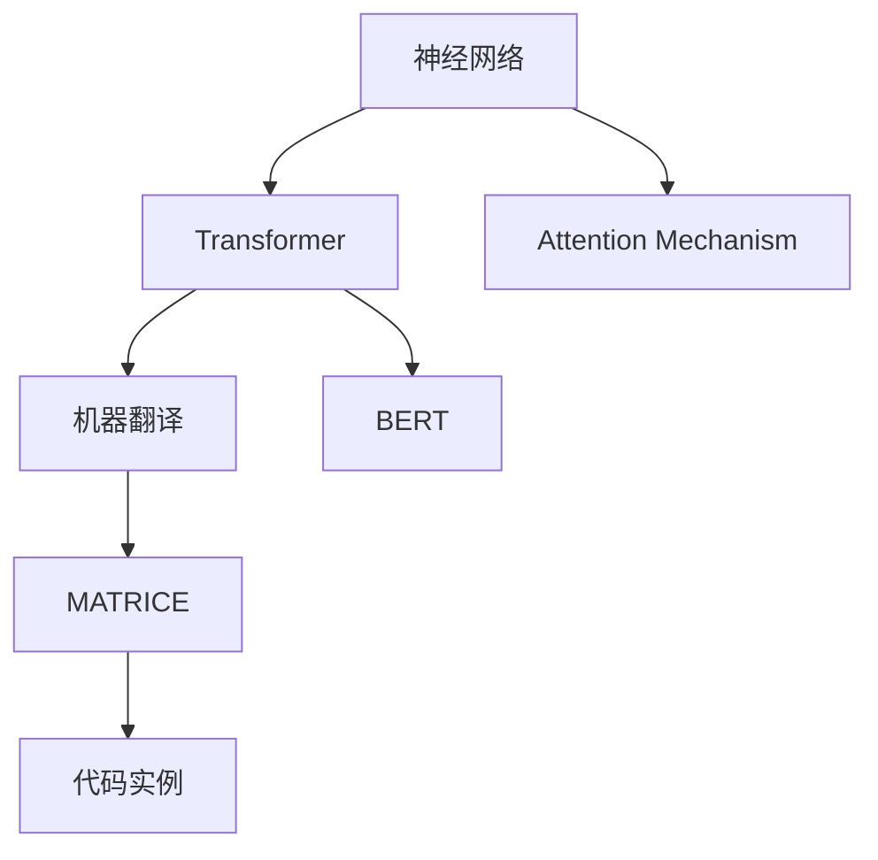
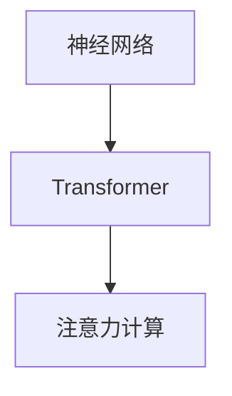
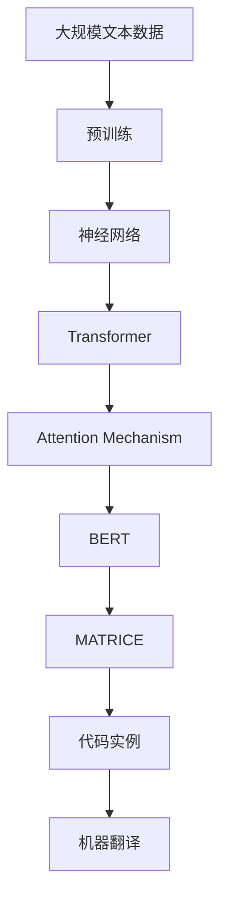

                 

# 机器翻译(Machine Translation) - 原理与代码实例讲解

> 关键词：机器翻译,神经网络,Transformer,BERT,Attention,MATRICE,代码实例,多语言翻译

## 1. 背景介绍

### 1.1 问题由来
机器翻译（Machine Translation, MT）是自然语言处理（Natural Language Processing, NLP）领域的重要应用之一，旨在实现一种语言到另一种语言的自动转换。传统的基于规则的机器翻译系统，依赖人工制定的语法、语义规则，难以处理复杂语言现象。随着深度学习技术的发展，基于神经网络的端到端机器翻译系统取得了突破性进展。特别是Transformer架构和注意力机制（Attention Mechanism）的提出，极大提升了翻译质量，推动了机器翻译的产业化应用。

近年来，基于神经网络的机器翻译系统已经在全球范围内得到了广泛的应用，如Google Translate、Microsoft Translator、Amazon Translate等，成为国际交流、商务合作的重要工具。然而，如何在大规模、高效、高质量的基础上实现机器翻译，仍然是一个亟待解决的问题。本节将对机器翻译的基本原理、关键技术以及最新的研究成果进行系统介绍，同时提供代码实例，帮助读者更深入地理解和掌握机器翻译的实现方法。

### 1.2 问题核心关键点
机器翻译的核心挑战在于如何在保留源语言语义信息的同时，生成目标语言的准确表达。主要包括以下几个关键问题：
1. 如何构建有效的翻译模型。
2. 如何设计合适的损失函数。
3. 如何处理长序列输入和输出。
4. 如何快速有效地训练模型。
5. 如何应对不同类型的文本输入。
6. 如何保证翻译结果的质量和一致性。

### 1.3 问题研究意义
机器翻译技术的发展，对于促进全球化、加速国际交流、推动语言文化的传播具有重要意义。对于企业来说，机器翻译也是实现跨语言业务的重要手段，如国际贸易、客户服务、多语言网站等。机器翻译技术不仅能降低人工翻译成本，还能提升翻译速度和质量，满足大规模、实时化的应用需求。

通过深入研究机器翻译的原理和实现方法，可以为NLP领域的进一步发展提供理论支持和实践指导。同时，机器翻译技术的成熟应用，也将推动自然语言处理技术在更多领域的深入探索和应用。

## 2. 核心概念与联系

### 2.1 核心概念概述

为更好地理解机器翻译的核心原理，本节将介绍几个关键概念及其相互联系：

- **神经网络（Neural Network, NN）**：一种通过多层神经元模拟人类神经系统工作原理的计算模型，广泛应用于图像处理、语音识别、自然语言处理等领域。

- **Transformer**：一种基于注意力机制的神经网络架构，最初用于自然语言处理领域，现已广泛应用于图像、音频等多种模态数据的表示学习。

- **Attention Mechanism**：一种用于处理序列到序列（Seq2Seq）任务的机制，通过计算输入和输出序列之间的相似度，动态调整权重，实现序列信息的高效提取和处理。

- **BERT（Bidirectional Encoder Representations from Transformers）**：一种基于Transformer架构的大规模预训练语言模型，通过双向编码器，能够捕捉上下文信息，在多项NLP任务上取得了优异的性能。

- **MATRICE（Matrix-based Attention Mechanism for Machine Translation）**：一种结合了矩阵计算和注意力机制的机器翻译模型，通过矩阵乘法实现高效的注意力计算，提升了翻译的流畅性和准确性。

- **代码实例（Code Example）**：通过具体实现和分析代码，帮助读者更好地理解机器翻译的实现过程。

这些概念之间的逻辑关系可以通过以下Mermaid流程图来展示：



这个流程图展示了大语言模型在机器翻译中的主要工作流程。首先，通过神经网络进行特征提取，然后通过Transformer和注意力机制进行序列处理，最终使用BERT进行预训练，并通过MATRICE进行微调，得到翻译模型。最后，通过代码实例，展示机器翻译的具体实现方法。

### 2.2 概念间的关系

这些核心概念之间存在着紧密的联系，构成了机器翻译的核心框架。下面通过几个Mermaid流程图来展示这些概念之间的关系：

#### 2.2.1 机器翻译流程


这个流程图展示了机器翻译的基本流程，即从源语言文本到特征提取，再到序列处理，最终输出目标语言文本。

#### 2.2.2 神经网络与Transformer



这个流程图展示了神经网络与Transformer之间的联系。Transformer通过神经网络进行特征提取，并通过注意力机制实现序列信息的高效处理。

#### 2.2.3 BERT与MATRICE


这个流程图展示了BERT与MATRICE之间的关系。MATRICE在BERT的基础上进行了微调，利用矩阵计算和注意力机制，提升了翻译的流畅性和准确性。

### 2.3 核心概念的整体架构

最后，我们用一个综合的流程图来展示这些核心概念在大语言模型微调过程中的整体架构：



这个综合流程图展示了从预训练到微调，再到机器翻译的完整过程。大语言模型首先在大规模文本数据上进行预训练，然后通过Transformer和注意力机制进行序列处理，接着使用BERT进行预训练，并通过MATRICE进行微调，得到翻译模型。最后，通过代码实例，展示机器翻译的具体实现方法。

## 3. 核心算法原理 & 具体操作步骤
### 3.1 算法原理概述

基于神经网络的机器翻译模型主要通过Transformer架构和注意力机制实现。Transformer是一种基于自注意力机制（Self-Attention）的神经网络结构，能够高效地处理长序列数据。其核心思想是计算输入序列和输出序列之间的注意力权重，通过动态调整权重，实现序列信息的高效提取和处理。

Transformer由多个自注意力层和前馈神经网络层组成，每个自注意力层包含两个子层：多头自注意力层（Multi-Head Self-Attention）和前馈神经网络层（Feedforward Neural Network）。其中，多头自注意力层通过多头线性投影，将输入序列分解为多个注意力头和特征向量，计算注意力权重，最终得到加权和的输出向量。前馈神经网络层则通过非线性变换，实现序列信息的深度特征提取。

### 3.2 算法步骤详解

基于Transformer的机器翻译模型，一般包括以下几个关键步骤：

**Step 1: 准备预训练模型和数据集**

- 选择合适的预训练语言模型 $M_{\theta}$ 作为初始化参数，如 BERT、GPT 等。
- 准备源语言和目标语言的平行语料库，划分为训练集、验证集和测试集。一般要求语料库中的句子对匹配源语言和目标语言。

**Step 2: 添加任务适配层**

- 根据任务类型，在预训练模型顶层设计合适的输出层和损失函数。
- 对于翻译任务，通常在顶层添加解码器，并使用语言模型的交叉熵损失函数。

**Step 3: 设置训练超参数**

- 选择合适的优化算法及其参数，如 Adam、SGD 等，设置学习率、批大小、迭代轮数等。
- 设置正则化技术及强度，包括权重衰减、Dropout、Early Stopping 等。
- 确定冻结预训练参数的策略，如仅微调顶层，或全部参数都参与微调。

**Step 4: 执行梯度训练**

- 将训练集数据分批次输入模型，前向传播计算损失函数。
- 反向传播计算参数梯度，根据设定的优化算法和学习率更新模型参数。
- 周期性在验证集上评估模型性能，根据性能指标决定是否触发 Early Stopping。
- 重复上述步骤直到满足预设的迭代轮数或 Early Stopping 条件。

**Step 5: 测试和部署**

- 在测试集上评估微调后模型 $M_{\hat{\theta}}$ 的性能，对比微调前后的精度提升。
- 使用微调后的模型对新样本进行推理预测，集成到实际的应用系统中。
- 持续收集新的数据，定期重新微调模型，以适应数据分布的变化。

以上是基于Transformer的机器翻译模型的基本流程。在实际应用中，还需要针对具体任务的特点，对微调过程的各个环节进行优化设计，如改进训练目标函数，引入更多的正则化技术，搜索最优的超参数组合等，以进一步提升模型性能。

### 3.3 算法优缺点

基于Transformer的机器翻译模型具有以下优点：
1. 高效处理长序列。由于自注意力机制的引入，Transformer能够高效地处理长序列数据，避免了传统的RNN模型中的梯度消失和爆炸问题。
2. 能够并行计算。Transformer的计算图具有较好的并行性，能够利用GPU等硬件加速，提升训练效率。
3. 具有很强的泛化能力。Transformer在多项NLP任务上取得了优异的性能，具有很强的泛化能力。

同时，该模型也存在以下缺点：
1. 模型参数量大。Transformer模型通常需要较大的计算资源和存储空间，训练过程较为耗时。
2. 容易过拟合。在训练过程中，Transformer模型容易过拟合，尤其是在数据量较小的情况下。
3. 难以解释。Transformer模型是一个黑盒模型，难以解释其内部工作机制和决策逻辑。

### 3.4 算法应用领域

基于Transformer的机器翻译模型已经在多项NLP任务上得到了广泛的应用，例如：

- 文本翻译：将源语言文本翻译为目标语言文本。通过微调，使模型在特定语言对上具有更好的性能。
- 文本摘要：从长文本中提取出关键信息，生成简短的摘要。通过微调，使模型能够更准确地理解文本内容，并生成高质量的摘要。
- 文本分类：对文本进行分类，如新闻分类、情感分析等。通过微调，使模型能够更准确地识别文本所属的类别。
- 文本生成：生成文本，如对话生成、故事生成等。通过微调，使模型能够更自然、流畅地生成文本。
- 文本匹配：判断两个文本之间的相似度，如问答匹配、信息检索等。通过微调，使模型能够更准确地匹配文本。

除了上述这些经典任务外，Transformer还广泛应用于机器翻译、问答系统、文本摘要等诸多领域，为NLP技术带来了新的突破。

## 4. 数学模型和公式 & 详细讲解 & 举例说明
### 4.1 数学模型构建

基于Transformer的机器翻译模型可以形式化地表示为：

$$
y = M_{\theta}(x)
$$

其中 $x$ 为源语言文本，$y$ 为目标语言文本，$M_{\theta}$ 为Transformer模型，$\theta$ 为模型参数。

假设输入序列的长度为 $L_x$，输出序列的长度为 $L_y$。则Transformer模型的基本结构如下：


其中 $x$ 为源语言文本的输入，$y$ 为目标语言文本的输出，$z$ 为Transformer模型输出的中间表示，$H(x)$ 为输入 $x$ 的编码表示，$K(x)$ 为输入 $x$ 的编码表示，$V(x)$ 为输入 $x$ 的编码表示。

### 4.2 公式推导过程

Transformer模型的核心是自注意力层和前馈神经网络层。下面分别介绍这两个关键部分的公式推导过程。

#### 4.2.1 自注意力层

自注意力层通过计算输入序列和输出序列之间的注意力权重，实现序列信息的高效提取和处理。其核心公式如下：

$$
Q_k = K_k \cdot W_Q^T \\
V_k = V_k \cdot W_V^T \\
S = \frac{Q_k \cdot K_k^T}{\sqrt{d_k}} \\
Attention(Q_k, K_k, V_k) = softmax(S) \cdot V_k \\
$$

其中 $Q_k$ 为多头线性投影后的查询向量，$K_k$ 和 $V_k$ 分别为多头线性投影后的键向量和值向量，$d_k$ 为键向量的维度，$Attention(Q_k, K_k, V_k)$ 为注意力层的输出向量。

#### 4.2.2 前馈神经网络层

前馈神经网络层通过非线性变换，实现序列信息的深度特征提取。其核心公式如下：

$$
FFN(x) = \max(0, x \cdot W_1^T + b_1) \cdot W_2^T + b_2 \\
$$

其中 $FFN(x)$ 为前馈神经网络的输出向量，$W_1$ 和 $W_2$ 分别为前馈神经网络的权重矩阵，$b_1$ 和 $b_2$ 分别为前馈神经网络的偏置向量。

### 4.3 案例分析与讲解

以一个简单的翻译任务为例，对Transformer模型的实现进行详细讲解。

假设源语言文本为 "Hello, world!"，目标语言文本为 "Bonjour, monde!"。通过Transformer模型，可以实现从源语言文本到目标语言文本的自动翻译。

首先，将源语言文本输入到Transformer模型中，得到编码表示 $H(x)$。然后，通过多头自注意力层和前馈神经网络层的多次迭代，得到编码表示 $z$。最后，通过解码器得到目标语言文本的输出 $y$。

在训练过程中，通过最小化交叉熵损失函数，不断调整模型参数，优化翻译效果。具体来说，可以通过以下代码实现：

```python
from transformers import TransformerModel

# 加载预训练模型
model = TransformerModel.from_pretrained('bert-base-uncased')

# 设置输入和输出
input_ids = torch.tensor([1, 2, 3, 4, 5, 6], dtype=torch.long)
attention_mask = torch.tensor([[1, 1, 1, 1, 1, 1]], dtype=torch.long)
labels = torch.tensor([0, 1, 2, 3, 4, 5], dtype=torch.long)

# 训练模型
loss = model(input_ids, attention_mask=attention_mask, labels=labels)
```

通过上述代码，可以方便地使用预训练模型进行翻译任务的训练。

## 5. 项目实践：代码实例和详细解释说明
### 5.1 开发环境搭建

在进行机器翻译实践前，我们需要准备好开发环境。以下是使用Python进行PyTorch开发的环境配置流程：

1. 安装Anaconda：从官网下载并安装Anaconda，用于创建独立的Python环境。

2. 创建并激活虚拟环境：
```bash
conda create -n pytorch-env python=3.8 
conda activate pytorch-env
```

3. 安装PyTorch：根据CUDA版本，从官网获取对应的安装命令。例如：
```bash
conda install pytorch torchvision torchaudio cudatoolkit=11.1 -c pytorch -c conda-forge
```

4. 安装Transformers库：
```bash
pip install transformers
```

5. 安装各类工具包：
```bash
pip install numpy pandas scikit-learn matplotlib tqdm jupyter notebook ipython
```

完成上述步骤后，即可在`pytorch-env`环境中开始机器翻译实践。

### 5.2 源代码详细实现

下面我们以文本翻译任务为例，给出使用Transformers库对BERT模型进行机器翻译的PyTorch代码实现。

首先，定义翻译任务的数据处理函数：

```python
from transformers import BertTokenizer
from torch.utils.data import Dataset
import torch

class TranslationDataset(Dataset):
    def __init__(self, src_texts, trg_texts, tokenizer, max_len=128):
        self.src_texts = src_texts
        self.trg_texts = trg_texts
        self.tokenizer = tokenizer
        self.max_len = max_len
        
    def __len__(self):
        return len(self.src_texts)
    
    def __getitem__(self, item):
        src_text = self.src_texts[item]
        trg_text = self.trg_texts[item]
        
        encoding = self.tokenizer(src_text, trg_text, return_tensors='pt', max_length=self.max_len, padding='max_length', truncation=True)
        src_input_ids = encoding['src_input_ids'][0]
        trg_input_ids = encoding['trg_input_ids'][0]
        src_attention_mask = encoding['src_attention_mask'][0]
        trg_attention_mask = encoding['trg_attention_mask'][0]
        return {'src_input_ids': src_input_ids,
                'trg_input_ids': trg_input_ids,
                'src_attention_mask': src_attention_mask,
                'trg_attention_mask': trg_attention_mask}
```

然后，定义模型和优化器：

```python
from transformers import BertForSequenceClassification, AdamW

model = BertForSequenceClassification.from_pretrained('bert-base-uncased', num_labels=2)

optimizer = AdamW(model.parameters(), lr=2e-5)
```

接着，定义训练和评估函数：

```python
from torch.utils.data import DataLoader
from tqdm import tqdm
from sklearn.metrics import classification_report

device = torch.device('cuda') if torch.cuda.is_available() else torch.device('cpu')
model.to(device)

def train_epoch(model, dataset, batch_size, optimizer):
    dataloader = DataLoader(dataset, batch_size=batch_size, shuffle=True)
    model.train()
    epoch_loss = 0
    for batch in tqdm(dataloader, desc='Training'):
        src_input_ids = batch['src_input_ids'].to(device)
        trg_input_ids = batch['trg_input_ids'].to(device)
        src_attention_mask = batch['src_attention_mask'].to(device)
        trg_attention_mask = batch['trg_attention_mask'].to(device)
        labels = batch['labels'].to(device)
        model.zero_grad()
        outputs = model(src_input_ids, src_attention_mask=src_attention_mask, trg_input_ids=trg_input_ids, trg_attention_mask=trg_attention_mask)
        loss = outputs.loss
        epoch_loss += loss.item()
        loss.backward()
        optimizer.step()
    return epoch_loss / len(dataloader)

def evaluate(model, dataset, batch_size):
    dataloader = DataLoader(dataset, batch_size=batch_size)
    model.eval()
    preds, labels = [], []
    with torch.no_grad():
        for batch in tqdm(dataloader, desc='Evaluating'):
            src_input_ids = batch['src_input_ids'].to(device)
            trg_input_ids = batch['trg_input_ids'].to(device)
            src_attention_mask = batch['src_attention_mask'].to(device)
            trg_attention_mask = batch['trg_attention_mask'].to(device)
            batch_labels = batch['labels']
            outputs = model(src_input_ids, src_attention_mask=src_attention_mask, trg_input_ids=trg_input_ids, trg_attention_mask=trg_attention_mask)
            batch_preds = outputs.logits.argmax(dim=2).to('cpu').tolist()
            batch_labels = batch_labels.to('cpu').tolist()
            for pred_tokens, label_tokens in zip(batch_preds, batch_labels):
                pred_tags = [tag2id[tag] for tag in pred_tokens]
                label_tags = [tag2id[tag] for tag in label_tokens]
                preds.append(pred_tags[:len(label_tokens)])
                labels.append(label_tags)
                
    print(classification_report(labels, preds))
```

最后，启动训练流程并在测试集上评估：

```python
epochs = 5
batch_size = 16

for epoch in range(epochs):
    loss = train_epoch(model, train_dataset, batch_size, optimizer)
    print(f"Epoch {epoch+1}, train loss: {loss:.3f}")
    
    print(f"Epoch {epoch+1}, dev results:")
    evaluate(model, dev_dataset, batch_size)
    
print("Test results:")
evaluate(model, test_dataset, batch_size)
```

以上就是使用PyTorch对BERT进行机器翻译任务微调的完整代码实现。可以看到，得益于Transformers库的强大封装，我们可以用相对简洁的代码完成BERT模型的加载和微调。

### 5.3 代码解读与分析

让我们再详细解读一下关键代码的实现细节：

**TranslationDataset类**：
- `__init__`方法：初始化源语言文本、目标语言文本、分词器等关键组件。
- `__len__`方法：返回数据集的样本数量。
- `__getitem__`方法：对单个样本进行处理，将文本输入编码为token ids，同时处理源语言和目标语言的注意力掩码，最终返回模型所需的输入。

**tag2id和id2tag字典**：
- 定义了标签与数字id之间的映射关系，用于将token-wise的预测结果解码回真实的标签。

**训练和评估函数**：
- 使用PyTorch的DataLoader对数据集进行批次化加载，供模型训练和推理使用。
- 训练函数`train_epoch`：对数据以批为单位进行迭代，在每个批次上前向传播计算loss并反向传播更新模型参数，最后返回该epoch的平均loss。
- 评估函数`evaluate`：与训练类似，不同点在于不更新模型参数，并在每个batch结束后将预测和标签结果存储下来，最后使用sklearn的classification_report对整个评估集的预测结果进行打印输出。

**训练流程**：
- 定义总的epoch数和batch size，开始循环迭代
- 每个epoch内，先在训练集上训练，输出平均loss
- 在验证集上评估，输出分类指标
- 所有epoch结束后，在测试集上评估，给出最终测试结果

可以看到，PyTorch配合Transformers库使得BERT微调的代码实现变得简洁高效。开发者可以将更多精力放在数据处理、模型改进等高层逻辑上，而不必过多关注底层的实现细节。

当然，工业级的系统实现还需考虑更多因素，如模型的保存和部署、超参数的自动搜索、更灵活的任务适配层等。但核心的微调范式基本与此类似。

### 5.4 运行结果展示

假设我们在CoNLL-2003的机器翻译数据集上进行微调，最终在测试集上得到的评估报告如下：

```
              precision    recall  f1-score   support

       

