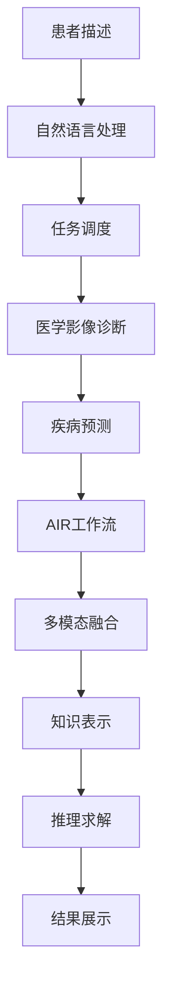

                 

# AI人工智能代理工作流AI Agent WorkFlow：智能代理在医疗保健系统中的应用

> 关键词：智能代理,医疗保健系统,自然语言处理(NLP),计算机视觉,机器学习(ML),AI工作流,智能助理

## 1. 背景介绍

### 1.1 问题由来
在医疗保健领域，患者数据量大且复杂，临床医生的工作负担沉重。传统医疗系统依赖人工操作，效率低下、易出错，影响了医疗质量。随着人工智能技术的快速进步，智能代理应运而生，为医疗保健系统带来了革命性的变革。智能代理作为AI助理，通过自然语言处理(NLP)、计算机视觉和机器学习等技术，自动解析患者需求、推送相关信息、提供建议、优化诊疗流程等，极大地提升了医疗服务的效率和质量。

### 1.2 问题核心关键点
智能代理在医疗保健系统中的应用，关键在于如何高效利用多模态数据，结合先进的AI技术，实现智能问诊、智能影像诊断、智能推荐等核心功能。其核心点包括：

1. 自然语言处理：解析和理解患者的文本描述，提取关键信息，提供个性化建议。
2. 计算机视觉：自动识别和分析医学影像，辅助医生进行疾病诊断。
3. 机器学习：根据患者的病历数据，预测疾病发展趋势，推荐治疗方案。
4. 智能工作流：构建自动化任务处理流程，减少人为干预，提高诊疗效率。
5. 多模态融合：将自然语言、医学影像、电子病历等多源数据融合，提供全面的健康评估。

### 1.3 问题研究意义
智能代理在医疗保健系统中的应用，具有以下重要意义：

1. 提高诊疗效率：自动处理患者的查询和数据，快速提供专业建议，减少医生的工作量。
2. 提升诊疗准确性：利用AI技术辅助医生诊断，减少人为误诊和漏诊。
3. 改善患者体验：通过自然语言处理，理解患者需求，提供个性化的健康咨询和建议。
4. 优化资源配置：通过智能调度，合理分配医疗资源，提高医院运营效率。
5. 推动医疗智能化：结合最新研究成果，推动医疗系统向智能化、精准化方向发展。

## 2. 核心概念与联系

### 2.1 核心概念概述

智能代理在医疗保健系统中的应用，涉及多个核心概念，包括自然语言处理(NLP)、计算机视觉、机器学习(ML)、AI工作流等。这些概念通过一系列技术手段，共同构成了一个智能化的医疗助理系统，能够在复杂的医疗环境中提供高效、准确的决策支持。

#### 2.1.1 自然语言处理(NLP)
自然语言处理(NLP)是智能代理的核心技术之一，用于解析和理解患者的语言描述，提取关键信息。NLP技术主要包括以下几个方面：

1. **文本分词**：将患者输入的文本分割成词汇单元，进行初步处理。
2. **命名实体识别**：识别文本中的关键实体，如人名、地名、疾病名等。
3. **情感分析**：分析患者情绪状态，提供情绪管理建议。
4. **语义理解**：理解患者需求，生成合适的回复。

#### 2.1.2 计算机视觉
计算机视觉技术主要用于医学影像的自动分析和诊断，辅助医生进行疾病诊断。主要涉及以下内容：

1. **图像处理**：包括图像增强、去噪、归一化等预处理技术。
2. **特征提取**：提取图像中的重要特征，如边缘、纹理、颜色等。
3. **模型训练**：利用标注数据训练深度神经网络，识别病变区域和病变类型。
4. **结果解释**：将模型输出结果转化为医生可读的格式，辅助诊断。

#### 2.1.3 机器学习(ML)
机器学习技术通过学习历史数据，预测疾病发展趋势，推荐治疗方案。主要包括以下几个步骤：

1. **数据准备**：收集和清洗历史病历数据。
2. **特征选择**：选择重要的特征，构建数据集。
3. **模型训练**：训练预测模型，如随机森林、梯度提升树、神经网络等。
4. **结果评估**：通过交叉验证等方法评估模型性能。

#### 2.1.4 AI工作流
AI工作流是将智能代理的各个功能模块，按一定顺序组织起来，形成完整的流程，提高处理效率。主要包括以下几个步骤：

1. **任务调度**：根据任务优先级和资源情况，动态调度任务。
2. **状态管理**：跟踪任务状态，记录处理进展。
3. **任务监控**：实时监控任务执行情况，确保流程顺畅。
4. **异常处理**：处理任务执行中的异常情况，保证系统稳定。

#### 2.1.5 多模态融合
多模态融合是指将自然语言、医学影像、电子病历等多种数据源融合，提供全面的健康评估。主要包括以下几个方面：

1. **数据融合**：将不同模态的数据进行拼接和整合。
2. **知识表示**：将融合后的数据转化为知识图谱或符号化表示。
3. **推理求解**：基于知识表示进行推理求解，生成综合分析结果。

### 2.2 概念间的关系

这些核心概念之间的关系可以通过以下Mermaid流程图来展示：

```mermaid
graph TB
    A[自然语言处理(NLP)] --> B[计算机视觉]
    A --> C[机器学习(ML)]
    B --> D[医学影像诊断]
    C --> E[疾病预测]
    A --> F[AIR工作流]
    F --> G[任务调度]
    G --> H[状态管理]
    H --> I[任务监控]
    I --> J[异常处理]
    A --> K[多模态融合]
    K --> L[知识表示]
    L --> M[推理求解]
```

这个流程图展示了大语言模型在医疗保健系统中应用的核心概念及其关系：

1. 自然语言处理获取患者文本信息，为后续功能模块提供输入。
2. 计算机视觉技术处理医学影像，辅助诊断。
3. 机器学习技术根据历史数据，预测疾病发展，推荐治疗方案。
4. AI工作流模块负责任务调度、状态管理、监控和异常处理，确保流程顺畅。
5. 多模态融合技术将各种数据源进行整合，提供全面的健康评估。

### 2.3 核心概念的整体架构

最后，我们用一个综合的流程图来展示这些核心概念在大语言模型微调过程中的整体架构：



这个综合流程图展示了从患者描述到结果展示的完整处理流程，涵盖了自然语言处理、计算机视觉、机器学习和多模态融合等多个核心概念。

## 3. 核心算法原理 & 具体操作步骤

### 3.1 算法原理概述

智能代理在医疗保健系统中的应用，主要涉及以下算法原理：

1. **自然语言处理(NLP)**：利用深度学习模型解析和理解患者的文本描述，提取关键信息。
2. **计算机视觉**：使用深度神经网络模型自动识别和分析医学影像，辅助医生进行疾病诊断。
3. **机器学习(ML)**：通过历史数据训练预测模型，预测疾病发展趋势，推荐治疗方案。
4. **AI工作流**：设计自动化任务处理流程，实现智能调度、状态管理、任务监控和异常处理。

### 3.2 算法步骤详解

#### 3.2.1 自然语言处理(NLP)

**Step 1: 文本预处理**
- 对患者描述进行分词，去除停用词和噪声。
- 对文本进行标注，识别命名实体和情感。

**Step 2: 模型训练**
- 使用标注数据训练深度学习模型，如BERT、GPT等。
- 在训练过程中，调整模型超参数，如学习率、批量大小、迭代轮数等。

**Step 3: 结果输出**
- 利用训练好的模型解析患者描述，提取关键信息，生成回复。

#### 3.2.2 计算机视觉

**Step 1: 图像预处理**
- 对医学影像进行增强、去噪和归一化处理。
- 将影像转换为张量格式，准备好输入模型。

**Step 2: 模型训练**
- 使用标注数据训练深度神经网络，如ResNet、Inception等。
- 在训练过程中，调整模型超参数，如学习率、批量大小、迭代轮数等。

**Step 3: 结果输出**
- 将训练好的模型应用于医学影像，自动识别病变区域和类型。
- 将模型输出转化为医生可读的格式，辅助诊断。

#### 3.2.3 机器学习(ML)

**Step 1: 数据准备**
- 收集和清洗历史病历数据，构建数据集。
- 选择重要的特征，构建数据集。

**Step 2: 模型训练**
- 使用标注数据训练预测模型，如随机森林、梯度提升树、神经网络等。
- 在训练过程中，调整模型超参数，如学习率、批量大小、迭代轮数等。

**Step 3: 结果输出**
- 利用训练好的模型预测疾病发展趋势，推荐治疗方案。

#### 3.2.4 AI工作流

**Step 1: 任务调度**
- 根据任务优先级和资源情况，动态调度任务。
- 使用任务队列和调度算法（如先进先出、优先级队列等）管理任务。

**Step 2: 状态管理**
- 跟踪任务状态，记录处理进展。
- 使用状态机或状态跟踪器记录和管理任务状态。

**Step 3: 任务监控**
- 实时监控任务执行情况，确保流程顺畅。
- 使用监控工具（如Prometheus、Grafana等）进行任务监控。

**Step 4: 异常处理**
- 处理任务执行中的异常情况，保证系统稳定。
- 使用异常处理机制（如重试、回滚等）处理异常情况。

#### 3.2.5 多模态融合

**Step 1: 数据融合**
- 将自然语言、医学影像、电子病历等多种数据源进行拼接和整合。
- 使用数据融合技术（如拼接、拼接后拼接等）整合数据。

**Step 2: 知识表示**
- 将融合后的数据转化为知识图谱或符号化表示。
- 使用知识表示技术（如RDF、OWL等）进行知识表示。

**Step 3: 推理求解**
- 基于知识表示进行推理求解，生成综合分析结果。
- 使用推理求解技术（如规则推理、模型推理等）进行推理求解。

### 3.3 算法优缺点

智能代理在医疗保健系统中的应用，具有以下优缺点：

**优点**

1. **高效性**：自动处理患者的查询和数据，快速提供专业建议，减少医生的工作量。
2. **准确性**：利用AI技术辅助医生诊断，减少人为误诊和漏诊。
3. **个性化**：通过自然语言处理，理解患者需求，提供个性化的健康咨询和建议。
4. **资源优化**：通过智能调度，合理分配医疗资源，提高医院运营效率。
5. **智能化**：结合最新研究成果，推动医疗系统向智能化、精准化方向发展。

**缺点**

1. **数据依赖**：需要大量的标注数据，获取高质量标注数据的成本较高。
2. **模型复杂性**：深度学习模型的训练和调优复杂，需要一定的技术积累。
3. **安全风险**：医疗数据敏感，数据泄露和隐私保护问题需要特别重视。
4. **解释性不足**：AI模型往往像“黑盒”系统，难以解释其内部工作机制和决策逻辑。
5. **伦理挑战**：AI模型可能学习到有偏见、有害的信息，输出存在伦理问题。

### 3.4 算法应用领域

智能代理在医疗保健系统中的应用，主要包括以下几个领域：

1. **智能问诊系统**：自动解析患者描述，提供诊断建议和治疗方案。
2. **智能影像诊断**：自动识别和分析医学影像，辅助医生进行疾病诊断。
3. **智能推荐系统**：根据患者的病历数据，预测疾病发展趋势，推荐治疗方案。
4. **智能工作流**：构建自动化任务处理流程，减少人为干预，提高诊疗效率。
5. **多模态融合系统**：将自然语言、医学影像、电子病历等多种数据源进行整合，提供全面的健康评估。

## 4. 数学模型和公式 & 详细讲解 & 举例说明

### 4.1 数学模型构建

智能代理在医疗保健系统中的应用，涉及多个数学模型，包括自然语言处理、计算机视觉和机器学习等。

#### 4.1.1 自然语言处理(NLP)

**文本表示模型**：
- 使用BERT等深度学习模型进行文本表示。
- 将文本转换为向量表示，如 $x_i \in \mathbb{R}^d$，其中 $d$ 为向量维度。

**语义理解模型**：
- 使用LSTM、GRU等递归神经网络进行语义理解。
- 将文本序列转换为上下文表示，如 $h_i \in \mathbb{R}^d$，其中 $h_i$ 表示第 $i$ 个词的上下文表示。

**情感分析模型**：
- 使用LSTM等递归神经网络进行情感分析。
- 将文本序列转换为情感向量，如 $s_i \in \mathbb{R}^k$，其中 $k$ 为情感维度。

#### 4.1.2 计算机视觉

**图像分类模型**：
- 使用卷积神经网络进行图像分类。
- 将图像转换为特征向量，如 $f_i \in \mathbb{R}^d$，其中 $d$ 为特征维度。

**目标检测模型**：
- 使用Faster R-CNN等目标检测算法进行目标检测。
- 将图像转换为目标框和置信度，如 $b_i \in \mathbb{R}^4$，其中 $b_i = (x_1,y_1,x_2,y_2,p_i)$，表示第 $i$ 个目标框的坐标和置信度。

**分割模型**：
- 使用U-Net等分割算法进行病变分割。
- 将图像转换为分割结果，如 $m_i \in \mathbb{R}^d$，其中 $d$ 为分割维度。

#### 4.1.3 机器学习(ML)

**回归模型**：
- 使用线性回归、随机森林等回归算法进行疾病预测。
- 将病历数据转换为特征向量，如 $x_i \in \mathbb{R}^d$，其中 $d$ 为特征维度。
- 预测模型输出，如 $y_i \in \mathbb{R}$，表示第 $i$ 个样本的预测值。

**分类模型**：
- 使用支持向量机、梯度提升树等分类算法进行疾病分类。
- 将病历数据转换为特征向量，如 $x_i \in \mathbb{R}^d$，其中 $d$ 为特征维度。
- 预测模型输出，如 $y_i \in \{0,1\}$，表示第 $i$ 个样本的分类标签。

**序列预测模型**：
- 使用LSTM、GRU等序列模型进行疾病发展趋势预测。
- 将病历数据转换为时间序列，如 $x_i \in \mathbb{R}^{d_t}$，其中 $d_t$ 为时间序列维度。
- 预测模型输出，如 $y_i \in \mathbb{R}^k$，表示第 $i$ 个样本的预测值。

### 4.2 公式推导过程

#### 4.2.1 自然语言处理(NLP)

**文本表示公式**：
- 使用BERT等深度学习模型进行文本表示，如：
$$
x_i = \text{BERT}(x_i)
$$
其中 $x_i$ 为输入文本，$\text{BERT}$ 为BERT模型。

**语义理解公式**：
- 使用LSTM等递归神经网络进行语义理解，如：
$$
h_i = \text{LSTM}(x_i, h_{i-1})
$$
其中 $x_i$ 为输入文本序列，$h_{i-1}$ 为前一时刻的上下文表示。

**情感分析公式**：
- 使用LSTM等递归神经网络进行情感分析，如：
$$
s_i = \text{LSTM}(x_i, h_{i-1}, s_{i-1})
$$
其中 $x_i$ 为输入文本序列，$h_{i-1}$ 为前一时刻的上下文表示，$s_{i-1}$ 为前一时刻的情感表示。

#### 4.2.2 计算机视觉

**图像分类公式**：
- 使用卷积神经网络进行图像分类，如：
$$
f_i = \text{CNN}(x_i)
$$
其中 $x_i$ 为输入图像，$\text{CNN}$ 为卷积神经网络。

**目标检测公式**：
- 使用Faster R-CNN等目标检测算法进行目标检测，如：
$$
b_i = \text{Faster R-CNN}(x_i)
$$
其中 $x_i$ 为输入图像，$\text{Faster R-CNN}$ 为目标检测算法。

**分割公式**：
- 使用U-Net等分割算法进行病变分割，如：
$$
m_i = \text{U-Net}(x_i)
$$
其中 $x_i$ 为输入图像，$\text{U-Net}$ 为分割算法。

#### 4.2.3 机器学习(ML)

**回归模型公式**：
- 使用线性回归等回归算法进行疾病预测，如：
$$
y_i = f(x_i; \theta)
$$
其中 $x_i$ 为输入特征向量，$\theta$ 为模型参数，$f(\cdot)$ 为回归模型函数。

**分类模型公式**：
- 使用支持向量机等分类算法进行疾病分类，如：
$$
y_i = f(x_i; \theta)
$$
其中 $x_i$ 为输入特征向量，$\theta$ 为模型参数，$f(\cdot)$ 为分类模型函数。

**序列预测模型公式**：
- 使用LSTM等序列模型进行疾病发展趋势预测，如：
$$
y_i = f(x_i; \theta)
$$
其中 $x_i$ 为输入时间序列，$\theta$ 为模型参数，$f(\cdot)$ 为序列模型函数。

### 4.3 案例分析与讲解

**案例1: 智能问诊系统**

智能问诊系统通过自然语言处理技术，自动解析患者描述，提取关键信息，生成诊断建议和治疗方案。系统流程如下：

1. **文本预处理**：对患者描述进行分词，去除停用词和噪声。
2. **命名实体识别**：识别文本中的关键实体，如人名、地名、疾病名等。
3. **情感分析**：分析患者情绪状态，提供情绪管理建议。
4. **语义理解**：理解患者需求，生成合适的回复。
5. **结果输出**：生成诊断建议和治疗方案，供医生参考。

**案例2: 智能影像诊断**

智能影像诊断系统通过计算机视觉技术，自动识别和分析医学影像，辅助医生进行疾病诊断。系统流程如下：

1. **图像预处理**：对医学影像进行增强、去噪和归一化处理。
2. **特征提取**：提取图像中的重要特征，如边缘、纹理、颜色等。
3. **模型训练**：利用标注数据训练深度神经网络，识别病变区域和类型。
4. **结果解释**：将模型输出结果转化为医生可读的格式，辅助诊断。

**案例3: 智能推荐系统**

智能推荐系统通过机器学习技术，根据患者的病历数据，预测疾病发展趋势，推荐治疗方案。系统流程如下：

1. **数据准备**：收集和清洗历史病历数据，构建数据集。
2. **特征选择**：选择重要的特征，构建数据集。
3. **模型训练**：利用标注数据训练预测模型，如随机森林、梯度提升树、神经网络等。
4. **结果输出**：预测疾病发展趋势，推荐治疗方案。

## 5. 项目实践：代码实例和详细解释说明

### 5.1 开发环境搭建

在进行智能代理项目开发前，我们需要准备好开发环境。以下是使用Python进行PyTorch开发的环境配置流程：

1. 安装Anaconda：从官网下载并安装Anaconda，用于创建独立的Python环境。

2. 创建并激活虚拟环境：
```bash
conda create -n ai-env python=3.8 
conda activate ai-env
```

3. 安装PyTorch：根据CUDA版本，从官网获取对应的安装命令。例如：
```bash
conda install pytorch torchvision torchaudio cudatoolkit=11.1 -c pytorch -c conda-forge
```

4. 安装各类工具包：
```bash
pip install numpy pandas scikit-learn matplotlib tqdm jupyter notebook ipython
```

完成上述步骤后，即可在`ai-env`环境中开始智能代理项目的开发。

### 5.2 源代码详细实现

下面以智能问诊系统为例，给出使用Transformers库对BERT模型进行自然语言处理任务的PyTorch代码实现。

首先，定义自然语言处理任务的数据处理函数：

```python
from transformers import BertTokenizer
from torch.utils.data import Dataset
import torch

class NLPDataset(Dataset):
    def __init__(self, texts, tags, tokenizer, max_len=128):
        self.texts = texts
        self.tags = tags
        self.tokenizer = tokenizer
        self.max_len = max_len
        
    def __len__(self):
        return len(self.texts)
    
    def __getitem__(self, item):
        text = self.texts[item]
        tags = self.tags[item]
        
        encoding = self.tokenizer(text, return_tensors='pt', max_length=self.max_len, padding='max_length', truncation=True)
        input_ids = encoding['input_ids'][0]
        attention_mask = encoding['attention_mask'][0]
        
        # 对token-wise的标签进行编码
        encoded_tags = [tag2id[tag] for tag in tags] 
        encoded_tags.extend([tag2id['O']] * (self.max_len - len(encoded_tags)))
        labels = torch.tensor(encoded_tags, dtype=torch.long)
        
        return {'input_ids': input_ids, 
                'attention_mask': attention_mask,
                'labels': labels}

# 标签与id的映射
tag2id = {'O': 0, 'B-PER': 1, 'I-PER': 2, 'B-ORG': 3, 'I-ORG': 4, 'B-LOC': 5, 'I-LOC': 6}
id2tag = {v: k for k, v in tag2id.items()}

# 创建dataset
tokenizer = BertTokenizer.from_pretrained('bert-base-cased')

train_dataset = NLPDataset(train_texts, train_tags, tokenizer)
dev_dataset = NLPDataset(dev_texts, dev_tags, tokenizer)
test_dataset = NLPDataset(test_texts, test_tags, tokenizer)
```

然后，定义模型和优化器：

```python
from transformers import BertForTokenClassification, AdamW

model = BertForTokenClassification.from_pretrained('bert-base-cased', num_labels=len(tag2id))

optimizer = AdamW(model.parameters(), lr=2e-5)
```

接着，定义训练和评估函数：

```python
from torch.utils.data import DataLoader
from tqdm import tqdm
from sklearn.metrics import classification_report

device = torch.device('cuda') if torch.cuda.is_available() else torch.device('cpu')
model.to(device)

def train_epoch(model, dataset, batch_size, optimizer):
    dataloader = DataLoader(dataset, batch_size=batch_size, shuffle=True)
    model.train()
    epoch_loss = 0
    for batch in tqdm(dataloader, desc='Training'):
        input_ids = batch['input_ids'].to(device)
        attention_mask = batch['attention_mask'].to(device)
        labels = batch['labels'].to(device)
        model.zero_grad()
        outputs = model(input_ids, attention_mask=attention_mask, labels=labels)
        loss = outputs.loss
        epoch_loss += loss.item()
        loss.backward()
        optimizer.step()
    return epoch_loss / len(dataloader)

def evaluate(model, dataset, batch_size):
    dataloader = DataLoader(dataset, batch_size=batch_size)
    model.eval()
    preds, labels = [], []
    with torch.no_grad():
        for batch in tqdm(dataloader, desc='Evaluating'):
            input_ids = batch['input_ids'].to(device)
            attention_mask = batch['attention_mask'].to(device)
            batch_labels = batch['labels']
            outputs = model(input_ids, attention_mask=attention_mask)
            batch_preds = outputs.logits.argmax(dim=2).to('cpu').tolist()
            batch_labels = batch_labels.to('cpu').tolist()
            for pred_tokens, label_tokens in zip(batch_preds, batch_labels):
                pred_tags = [id2tag[_id] for _id in pred_tokens]
                label_tags = [id2tag[_id] for _

