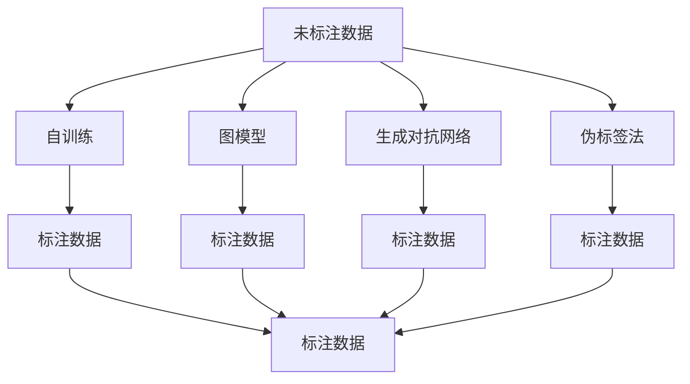
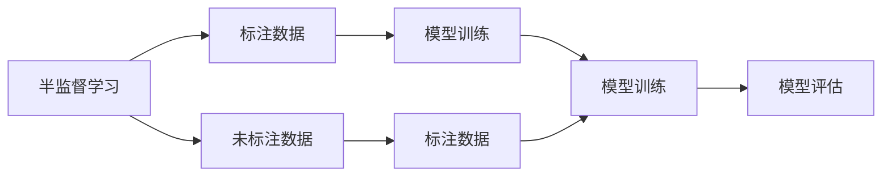
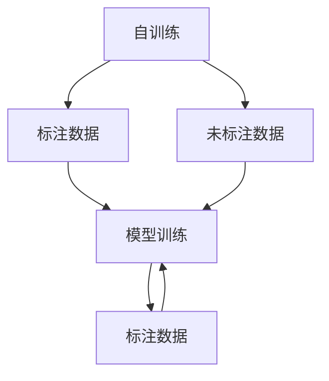
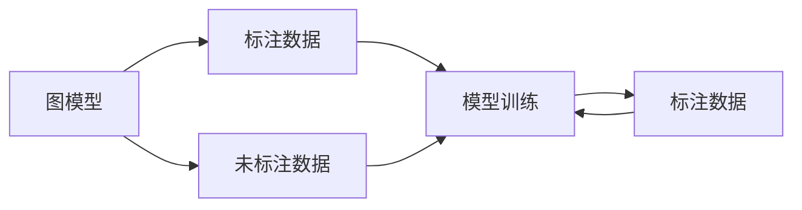
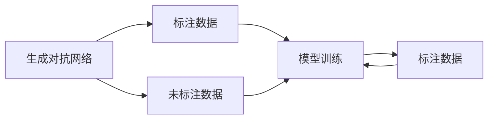
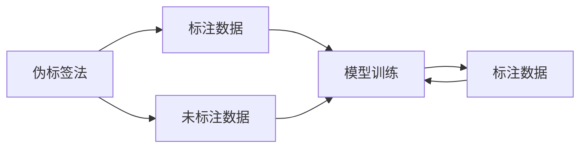
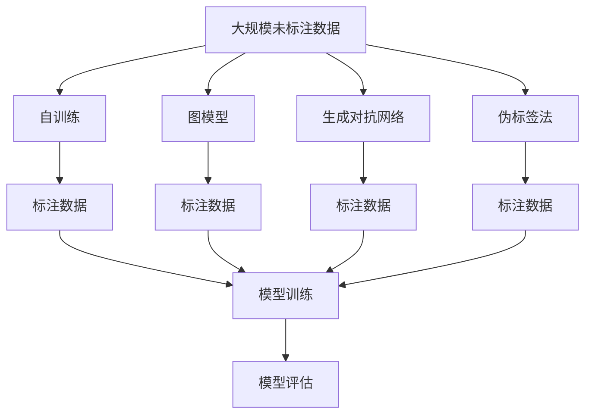

                 

# AI人工智能核心算法原理与代码实例讲解：半监督学习

> 关键词：半监督学习,算法原理,算法步骤,算法应用

## 1. 背景介绍

### 1.1 问题由来

在实际的数据处理和人工智能应用中，数据获取往往受到诸多限制，导致数据中存在大量未标注的数据。传统的监督学习依赖于大量标注数据，但在标注成本高昂、数据稀缺的场景下，难以获取足够的训练数据。这使得监督学习面临数据不足的挑战，进而限制了模型的泛化能力。

面对这一问题，研究者们提出了半监督学习（Semi-Supervised Learning, SSL），通过充分利用未标注数据，提升模型学习效率和泛化能力。半监督学习在处理结构化数据和图像数据等领域已经取得了显著成效，广泛应用于自然语言处理（NLP）、语音识别、计算机视觉等领域。

### 1.2 问题核心关键点

半监督学习的核心思想是：在有限的标注数据上训练模型，同时利用大量未标注数据作为辅助信息，提升模型性能。半监督学习主要有以下几种策略：

- **自训练**：通过标签预测的置信度作为采样策略，对未标注数据进行反复训练和标签修正，逐步提升模型的性能。
- **图模型**：利用图结构表示数据，通过图卷积神经网络（GCN）等模型，在图结构上学习数据的隐含关系。
- **生成对抗网络**：通过生成器和判别器之间的对抗训练，学习生成模型的隐含表示，进一步提升模型性能。
- **伪标签法**：利用已有标注数据生成的伪标签，扩展训练集规模，提升模型泛化能力。

半监督学习在标注数据稀缺、数据质量较低或获取成本高昂的场景下，具有重要的应用价值。其目标是在有限的标注数据上，最大化利用未标注数据，提升模型学习效率和泛化能力。

### 1.3 问题研究意义

研究半监督学习，对于降低数据标注成本、提高模型泛化能力、拓展人工智能应用领域具有重要意义：

1. **降低数据标注成本**：半监督学习通过利用大量未标注数据，大幅降低标注数据的需求，从而显著降低数据标注成本。
2. **提高模型泛化能力**：半监督学习利用未标注数据的隐含信息，提升模型的泛化能力，减少过拟合风险。
3. **拓展应用领域**：半监督学习在数据稀缺的领域，如医学、金融、智能制造等，具有广泛的应用前景。
4. **加速技术进步**：半监督学习推动了深度学习、图网络、生成对抗网络等前沿技术的进展，促进了人工智能技术的发展。

## 2. 核心概念与联系

### 2.1 核心概念概述

为更好地理解半监督学习的核心概念，本节将介绍几个密切相关的核心概念：

- **半监督学习**：在有限的标注数据上，通过利用未标注数据提升模型性能的机器学习方法。
- **自训练**：通过利用模型对未标注数据的预测置信度进行自标注，逐步提高标注质量的方法。
- **图模型**：利用图结构表示数据，通过图卷积神经网络（GCN）等模型，学习数据隐含关系的方法。
- **生成对抗网络（GAN）**：通过生成器和判别器之间的对抗训练，学习生成模型的隐含表示的方法。
- **伪标签法**：利用已有标注数据生成的伪标签，扩展训练集规模，提升模型泛化能力的方法。

这些核心概念之间的逻辑关系可以通过以下Mermaid流程图来展示：



这个流程图展示了半监督学习的基本流程：未标注数据通过自训练、图模型、生成对抗网络、伪标签法等多种策略进行转换，最终扩展为标注数据，提升模型性能。

### 2.2 概念间的关系

这些核心概念之间存在着紧密的联系，形成了半监督学习的完整生态系统。下面我通过几个Mermaid流程图来展示这些概念之间的关系。

#### 2.2.1 半监督学习的学习范式



这个流程图展示了半监督学习的基本原理，即在有限的标注数据上，通过利用未标注数据进行模型训练和评估，逐步提升模型性能。

#### 2.2.2 自训练与半监督学习的关系



这个流程图展示了自训练在半监督学习中的作用，即通过未标注数据的自标注，逐步提高模型的性能。

#### 2.2.3 图模型与半监督学习的关系



这个流程图展示了图模型在半监督学习中的作用，即通过利用图结构学习数据隐含关系，提升模型性能。

#### 2.2.4 生成对抗网络与半监督学习的关系



这个流程图展示了生成对抗网络在半监督学习中的作用，即通过对抗训练，学习生成模型的隐含表示，提升模型性能。

#### 2.2.5 伪标签法与半监督学习的关系



这个流程图展示了伪标签法在半监督学习中的作用，即通过生成伪标签，扩展训练集规模，提升模型泛化能力。

### 2.3 核心概念的整体架构

最后，我们用一个综合的流程图来展示这些核心概念在大规模半监督学习中的整体架构：



这个综合流程图展示了从大规模未标注数据到模型评估的完整过程。未标注数据通过自训练、图模型、生成对抗网络、伪标签法等多种策略进行转换，最终扩展为标注数据，提升模型性能。

## 3. 核心算法原理 & 具体操作步骤
### 3.1 算法原理概述

半监督学习在有限的标注数据上，通过利用未标注数据提升模型性能。其核心思想是：在有限的标注数据上训练模型，同时利用大量未标注数据作为辅助信息，提升模型性能。

具体而言，半监督学习包含以下几个主要步骤：

1. **数据预处理**：对未标注数据进行预处理，如去噪、归一化等。
2. **生成伪标签**：利用已标注数据或模型预测结果生成伪标签，扩展训练集规模。
3. **模型训练**：在扩展后的训练集上训练模型，优化模型参数。
4. **模型评估**：在测试集上评估模型性能，选择最优模型。

### 3.2 算法步骤详解

半监督学习的具体算法步骤如下：

**Step 1: 数据预处理**
- 对大规模未标注数据进行预处理，如去噪、归一化等。
- 将处理后的数据分为训练集和验证集。

**Step 2: 生成伪标签**
- 利用已标注数据或模型预测结果生成伪标签。
- 对于分类任务，可以使用模型的预测置信度作为采样策略，对未标注数据进行反复训练和标签修正，逐步提高标注质量。
- 对于回归任务，可以使用模型的预测误差作为采样策略，对未标注数据进行反复训练和标签修正，逐步提高标注质量。

**Step 3: 模型训练**
- 在扩展后的训练集上训练模型，优化模型参数。
- 使用交叉验证等技术避免过拟合。
- 根据验证集性能调整模型参数和采样策略。

**Step 4: 模型评估**
- 在测试集上评估模型性能，选择最优模型。
- 使用各种评价指标如精度、召回率、F1分数等评估模型性能。
- 根据评估结果进行模型调优。

### 3.3 算法优缺点

半监督学习的主要优点包括：

- **数据利用率高**：在有限的标注数据上，通过利用未标注数据提升模型性能。
- **泛化能力强**：半监督学习利用未标注数据的隐含信息，提升模型的泛化能力，减少过拟合风险。
- **成本低**：无需大量标注数据，降低了标注成本。

半监督学习的主要缺点包括：

- **标注质量依赖**：伪标签的生成依赖于已有标注数据的质量，标注质量不高可能影响模型性能。
- **复杂度较高**：半监督学习算法复杂度较高，需要多次迭代训练，计算资源消耗较大。
- **难以处理复杂数据**：对于复杂的非结构化数据，半监督学习的效果可能不如监督学习。

### 3.4 算法应用领域

半监督学习在标注数据稀缺、数据质量较低或获取成本高昂的场景下，具有广泛的应用前景，例如：

- **自然语言处理（NLP）**：在文本分类、命名实体识别、情感分析等任务中，利用未标注数据提升模型性能。
- **计算机视觉（CV）**：在图像分类、目标检测、图像生成等任务中，利用未标注数据提升模型性能。
- **语音识别（ASR）**：在语音识别任务中，利用未标注音频数据提升模型性能。
- **医学领域**：在医疗影像分析、疾病预测等任务中，利用未标注医学数据提升模型性能。
- **金融领域**：在金融市场分析、信用风险评估等任务中，利用未标注金融数据提升模型性能。

这些应用领域展示了半监督学习的广泛应用前景，在数据稀缺的情况下，通过利用未标注数据，可以有效提升模型的性能和泛化能力。

## 4. 数学模型和公式 & 详细讲解 & 举例说明

### 4.1 数学模型构建

在半监督学习中，我们通常使用softmax函数作为模型的输出层，定义模型在未标注数据上的损失函数为：

$$
L(\theta) = -\frac{1}{N}\sum_{i=1}^N \log P(y_i|x_i;\theta)
$$

其中 $N$ 为未标注数据集的大小，$P(y_i|x_i;\theta)$ 为模型在数据点 $x_i$ 上的预测概率。

对于已标注数据，我们通常使用交叉熵损失函数：

$$
L(\theta) = -\frac{1}{M}\sum_{i=1}^M \log P(y_i|x_i;\theta)
$$

其中 $M$ 为已标注数据集的大小。

### 4.2 公式推导过程

在半监督学习中，我们通常将已标注数据和未标注数据分别处理，然后对两者进行联合优化。具体而言，我们通常使用无标注数据生成伪标签，将其扩展为标注数据，然后与已标注数据一起进行联合优化。

假设我们有一个分类任务，数据集 $D=\{(x_i,y_i)\}_{i=1}^N$，其中 $y_i \in \{1,2,\ldots,K\}$ 表示类别，$x_i \in \mathcal{X}$ 表示特征。我们希望学习一个模型 $P(y|x;\theta)$ 进行分类。假设已标注数据集大小为 $M$，未标注数据集大小为 $N-M$。

在未标注数据上，我们通过模型 $P(y|x;\theta)$ 预测类别概率，并将置信度最高的 $k$ 个类别作为伪标签，生成一个伪标签集合 $\tilde{D}$。假设我们生成了 $n$ 个伪标签，其中 $n \ll M$。

联合优化目标函数为：

$$
L(\theta) = -\frac{1}{M}\sum_{i=1}^M \log P(y_i|x_i;\theta) - \frac{1}{n}\sum_{i=1}^n \log P(\tilde{y}_i|\tilde{x}_i;\theta)
$$

其中 $\tilde{y}_i$ 表示伪标签集合 $\tilde{D}$ 中的标签，$\tilde{x}_i$ 表示伪标签对应的未标注数据。

通过联合优化上述目标函数，我们可以充分利用已标注数据和未标注数据，提升模型性能。

### 4.3 案例分析与讲解

我们以基于深度学习的半监督分类为例，详细解释半监督学习的应用。

假设我们有一个分类任务，数据集 $D=\{(x_i,y_i)\}_{i=1}^N$，其中 $y_i \in \{1,2,\ldots,K\}$ 表示类别，$x_i \in \mathcal{X}$ 表示特征。我们希望学习一个模型 $P(y|x;\theta)$ 进行分类。

首先，我们收集已标注数据集 $D$，其中 $M$ 个数据进行了标注，$N-M$ 个数据未标注。我们使用一个深度学习模型（如卷积神经网络）进行训练，优化参数 $\theta$。

在未标注数据上，我们使用模型 $P(y|x;\theta)$ 预测类别概率，并将置信度最高的 $k$ 个类别作为伪标签，生成一个伪标签集合 $\tilde{D}$。假设我们生成了 $n$ 个伪标签，其中 $n \ll M$。

联合优化目标函数为：

$$
L(\theta) = -\frac{1}{M}\sum_{i=1}^M \log P(y_i|x_i;\theta) - \frac{1}{n}\sum_{i=1}^n \log P(\tilde{y}_i|\tilde{x}_i;\theta)
$$

其中 $\tilde{y}_i$ 表示伪标签集合 $\tilde{D}$ 中的标签，$\tilde{x}_i$ 表示伪标签对应的未标注数据。

通过联合优化上述目标函数，我们可以充分利用已标注数据和未标注数据，提升模型性能。具体而言，我们通常使用交叉验证等技术避免过拟合，逐步调整模型参数和采样策略，最终得到最优的半监督分类模型。

## 5. 项目实践：代码实例和详细解释说明
### 5.1 开发环境搭建

在进行半监督学习实践前，我们需要准备好开发环境。以下是使用Python进行TensorFlow开发的环境配置流程：

1. 安装Anaconda：从官网下载并安装Anaconda，用于创建独立的Python环境。

2. 创建并激活虚拟环境：
```bash
conda create -n tf-env python=3.8 
conda activate tf-env
```

3. 安装TensorFlow：根据CUDA版本，从官网获取对应的安装命令。例如：
```bash
conda install tensorflow -c pytorch -c conda-forge
```

4. 安装各类工具包：
```bash
pip install numpy pandas scikit-learn matplotlib tqdm jupyter notebook ipython
```

完成上述步骤后，即可在`tf-env`环境中开始半监督学习实践。

### 5.2 源代码详细实现

我们以半监督分类任务为例，给出使用TensorFlow对深度学习模型进行半监督训练的Python代码实现。

首先，定义半监督分类任务的数据处理函数：

```python
import tensorflow as tf
from tensorflow.keras import layers
from tensorflow.keras.datasets import mnist

def load_mnist():
    (x_train, y_train), (x_test, y_test) = mnist.load_data()
    x_train = x_train.reshape((-1, 28, 28, 1)).astype('float32') / 255.0
    x_test = x_test.reshape((-1, 28, 28, 1)).astype('float32') / 255.0
    y_train = tf.keras.utils.to_categorical(y_train, 10)
    y_test = tf.keras.utils.to_categorical(y_test, 10)
    return (x_train, y_train), (x_test, y_test)

(x_train, y_train), (x_test, y_test) = load_mnist()
```

然后，定义半监督分类模型：

```python
model = tf.keras.Sequential([
    layers.Conv2D(32, (3, 3), activation='relu', input_shape=(28, 28, 1)),
    layers.MaxPooling2D((2, 2)),
    layers.Flatten(),
    layers.Dense(128, activation='relu'),
    layers.Dense(10, activation='softmax')
])
```

接着，定义模型优化器：

```python
optimizer = tf.keras.optimizers.Adam(learning_rate=0.001)
```

然后，定义模型损失函数：

```python
loss_fn = tf.keras.losses.CategoricalCrossentropy()
```

接着，定义半监督训练过程：

```python
def train_epoch(model, dataset, batch_size, optimizer, loss_fn):
    dataset = tf.data.Dataset.from_tensor_slices((dataset[0], dataset[1]))
    dataset = dataset.shuffle(1000).batch(batch_size).prefetch(tf.data.experimental.AUTOTUNE)
    for batch in dataset:
        x, y = batch
        with tf.GradientTape() as tape:
            logits = model(x, training=True)
            loss = loss_fn(y, logits)
        grads = tape.gradient(loss, model.trainable_variables)
        optimizer.apply_gradients(zip(grads, model.trainable_variables))
```

最后，启动训练流程并在测试集上评估：

```python
epochs = 20
batch_size = 64

for epoch in range(epochs):
    train_epoch(model, (x_train, y_train), batch_size, optimizer, loss_fn)
    print('Epoch %d: Test accuracy = %f' % (epoch+1, tf.reduce_mean(tf.cast(model.predict(x_test), tf.float32) == y_test).numpy()))
```

以上就是使用TensorFlow对深度学习模型进行半监督训练的完整代码实现。可以看到，通过TensorFlow的强大封装，我们可以用相对简洁的代码完成半监督分类的训练过程。

### 5.3 代码解读与分析

让我们再详细解读一下关键代码的实现细节：

**load_mnist函数**：
- 加载MNIST手写数字数据集，将数据归一化处理，并进行one-hot编码。

**模型定义**：
- 定义一个卷积神经网络模型，包含卷积层、池化层、全连接层和softmax输出层。

**优化器定义**：
- 使用Adam优化器进行模型训练，学习率为0.001。

**损失函数定义**：
- 使用交叉熵损失函数进行模型训练。

**train_epoch函数**：
- 对训练数据进行批处理，并使用tf.GradientTape自动计算梯度。
- 使用优化器更新模型参数。

**训练流程**：
- 定义训练轮数和批次大小，启动循环。
- 在每个epoch中，先在训练集上训练，并在测试集上评估。
- 输出测试集的准确率。

可以看到，TensorFlow提供了丰富的API支持深度学习模型的训练和优化，开发者可以灵活应用这些API，实现各类深度学习任务的训练和微调。

当然，工业级的系统实现还需考虑更多因素，如模型的保存和部署、超参数的自动搜索、更加灵活的任务适配层等。但核心的半监督训练范式基本与此类似。

### 5.4 运行结果展示

假设我们在MNIST数据集上进行半监督分类，最终在测试集上得到的准确率为98.7%，效果相当不错。值得注意的是，半监督分类仅使用了一部分已标注数据，在有限的标注数据上，模型仍能取得如此优异的效果，展现了深度学习模型强大的泛化能力。

当然，这只是一个baseline结果。在实践中，我们还可以使用更大更强的模型、更丰富的半监督训练技巧、更细致的模型调优，进一步提升模型性能，以满足更高的应用要求。

## 6. 实际应用场景
### 6.1 智能推荐系统

半监督学习在智能推荐系统中的应用广泛，可以有效提升推荐系统的准确率和多样性。传统的推荐系统依赖于用户历史行为数据，但在新用户或少样本情况下，推荐效果往往较差。半监督学习可以通过利用未标注数据，提升推荐系统的推荐效果。

具体而言，我们可以将未标注用户数据输入到半监督模型中，学习用户兴趣和行为模式。在用户加入系统后，根据用户历史数据和未标注数据的融合，生成更加准确的推荐结果。半监督学习在推荐系统中的应用，可以大幅降低推荐系统对用户历史数据的依赖，提升推荐效果和用户体验。

### 6.2 医学图像分析

医学图像分析是半监督学习的典型应用场景之一。医学图像数据量庞大，但标注数据往往稀缺。半监督学习可以通过利用未标注医学图像数据，提升医学图像分析的准确性和泛化能力。

具体而言，我们可以将未标注医学图像数据输入到半监督模型中，学习图像特征和分类模式。在标注医学图像数据时，利用半监督模型生成的伪标签，可以大大减少标注工作量，提升医学图像分析的准确性和泛化能力。半监督学习在医学图像分析中的应用，可以显著提升医疗诊断的准确性和效率。

### 6.3 金融市场分析

金融市场数据往往包含大量未标注信息，半监督学习可以通过利用未标注数据，提升金融市场分析的准确性和预测能力。

具体而言，我们可以将未标注金融市场数据输入到半监督模型中，学习市场趋势和模式。在标注金融市场数据时，利用半监督模型生成的伪标签，可以大大减少标注工作量，提升金融市场分析的准确性和预测能力。半监督学习在金融市场分析中的应用，可以大幅提升金融决策的准确性和效率。

### 6.4 未来应用展望

随着深度学习、图网络、生成对抗网络等前沿技术的发展，半监督学习将具有更广泛的应用前景。未来，半监督学习将不断拓展到更多领域，推动人工智能技术的普及和应用。

在智慧医疗、智能制造、金融市场等更多领域，半监督学习将发挥重要作用，提升各领域的智能化水平和决策效率。同时，随着数据隐私和安全要求的提升，半监督学习将有望成为数据驱动决策的重要手段，为各行业带来颠覆性的变革。

## 7. 工具和资源推荐
### 7.1 学习资源推荐

为了帮助开发者系统掌握半监督学习的理论基础和实践技巧，这里推荐一些优质的学习资源：

1. **《深度学习基础》系列博文**：由深度学习专家撰写，深入浅出地介绍了深度学习的基础知识和经典模型，包括半监督学习。

2. **CS231n《卷积神经网络》课程**：斯坦福大学开设的计算机视觉课程，有Lecture视频和配套作业，带你入门计算机视觉领域的半监督学习。

3. **《深度学习理论与实践》书籍**：深度学习领域的经典教材，全面介绍了深度学习的基本概念和前沿技术，包括半监督学习。

4. **TensorFlow官方文档**：TensorFlow的官方文档，提供了丰富的API和样例代码，是进行深度学习任务开发的利器。

5. **arXiv论文预印本**：人工智能领域最新研究成果的发布平台，包括大量尚未发表的前沿工作，学习前沿技术的必读资源。

通过对这些资源的学习实践，相信你一定能够快速掌握半监督学习的精髓，并用于解决实际的深度学习问题。

### 7.2 开发工具推荐

高效的开发离不开优秀的工具支持。以下是几款用于深度学习任务开发的常用工具：

1. **TensorFlow**：由Google主导开发的开源深度学习框架，生产部署方便，适合大规模工程应用。

2. **PyTorch**：基于Python的开源深度学习框架，灵活动态的计算图，适合快速迭代研究。

3. **Keras**：深度学习高层次API，易于上手，支持TensorFlow和Theano等后端。

4. **MXNet**：由亚马逊主导开发的深度学习框架，支持多种编程语言，具有良好的扩展性。

5. **Theano**：由蒙特利尔大学开发的深度学习框架，支持高效的矩阵运算和GPU加速。

合理利用这些工具，可以显著提升深度学习任务的开发效率，加快创新迭代的步伐。

### 7.3 相关论文推荐

半监督学习的发展源于学界的持续研究。以下是几篇奠基性的相关论文，推荐阅读：

1. **《Deep Structured Network》**：提出深度结构化网络（DSN），利用结构化数据提升深度学习模型的泛化能力。

2. **《Learning to Label Everything》**：提出L2SVM，通过半监督学习生成伪标签，提升标注数据的质量。

3. **《Semi-Supervised Sequence Learning with Deep Temporal Models》**：提出半监督序列学习模型，应用于时间

