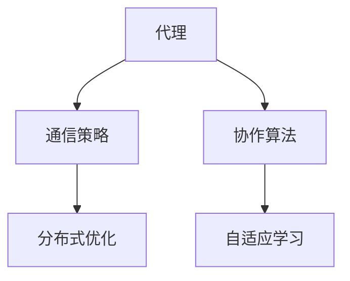
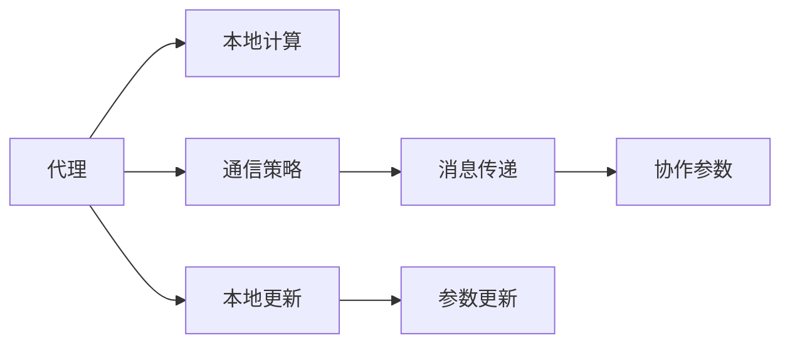
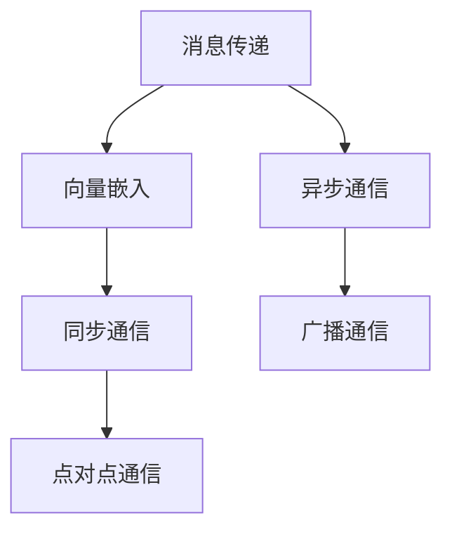
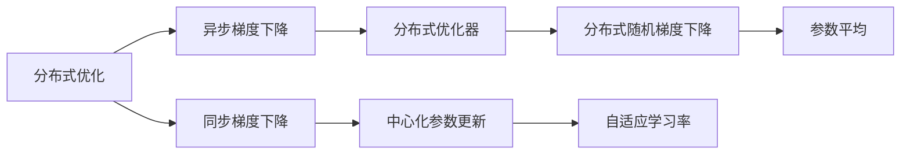
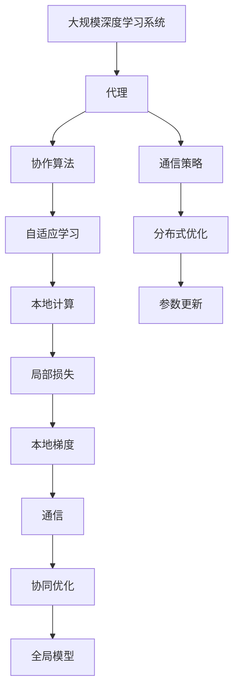

                 

# AI人工智能深度学习算法：代理通信与协作模型概览

> 关键词：代理通信,协作模型,分布式算法,强化学习,自适应学习

## 1. 背景介绍

### 1.1 问题由来

在现代AI系统中，特别是大规模分布式深度学习系统中，代理通信与协作模型成为了关键技术。随着深度学习应用的不断扩展，从计算机视觉到自然语言处理，从强化学习到分布式系统，对模型并行和协作的需求日益增加。代理通信与协作模型旨在解决大模型和大数据在分布式系统中如何高效协作的问题，推动了深度学习技术的产业化进程。

### 1.2 问题核心关键点

代理通信与协作模型，即基于多个代理（agent）之间通过通信协调作业，实现深度学习任务并行处理和协同优化的技术。其核心思想在于通过设计合适的通信策略和协作算法，使每个代理能够自主学习和决策，同时协调资源分配和参数更新，以达到更好的模型效果和效率。

1. **通信策略**：定义代理之间信息的传递方式，如消息传递、向量嵌入等。
2. **协作算法**：确定代理之间如何共享和更新模型参数，如异步梯度下降、参数平均等。
3. **分布式优化**：针对多代理系统设计的优化方法，如自适应学习率、梯度累积等。

### 1.3 问题研究意义

代理通信与协作模型在以下几个方面具有重要的研究意义：

1. **提高并行效率**：在大规模深度学习任务中，多代理协作可以大幅提高计算效率，减少训练时间和资源消耗。
2. **促进协同优化**：代理间的协同优化可以减少局部最优解的出现，提高模型整体性能。
3. **增强系统鲁棒性**：多代理系统能提高系统的容错性和鲁棒性，保证模型在各种环境下的稳定运行。
4. **实现自适应学习**：代理通信与协作模型通过自适应学习算法，根据数据和任务动态调整参数和策略。
5. **提升算力利用率**：合理分配计算资源，最大化利用多台机器的算力。
6. **加速模型迭代**：代理通信与协作模型加速了模型参数的更新和优化过程，提高了模型的训练速度。

## 2. 核心概念与联系

### 2.1 核心概念概述

为更好地理解代理通信与协作模型，本节将介绍几个密切相关的核心概念：

- **代理（Agent）**：在分布式深度学习中，每个代理负责处理部分数据和模型参数，自主学习并决策。
- **通信策略（Communication Strategy）**：代理之间交换信息的规则和方式，如消息传递、向量嵌入等。
- **协作算法（Collaboration Algorithm）**：代理之间如何共享和更新模型参数，如异步梯度下降、参数平均等。
- **分布式优化（Distributed Optimization）**：针对多代理系统设计的优化方法，如自适应学习率、梯度累积等。
- **自适应学习（Adaptive Learning）**：通过调整学习率、参数更新策略等手段，使代理能够适应不同数据分布和任务需求。

这些核心概念之间的逻辑关系可以通过以下Mermaid流程图来展示：



这个流程图展示了代理通信与协作模型中各个核心概念之间的关系：

1. 代理通过通信策略与其它代理进行信息交换。
2. 代理通过协作算法协同更新模型参数。
3. 分布式优化策略指导代理如何共享和更新参数。
4. 自适应学习使代理能够根据任务需求动态调整学习策略。

### 2.2 概念间的关系

这些核心概念之间存在着紧密的联系，形成了代理通信与协作模型的完整生态系统。下面我们通过几个Mermaid流程图来展示这些概念之间的关系。

#### 2.2.1 代理的决策与协作



这个流程图展示了代理的决策和协作过程。代理首先在本地的计算节点上进行计算和参数更新，然后通过消息传递的方式与其它代理共享参数，从而实现协同优化。

#### 2.2.2 通信策略的实现方式



这个流程图展示了代理之间通信策略的多种实现方式。消息传递、向量嵌入等是常见的通信方式，异步通信、同步通信、广播通信等则是通信的调度策略。

#### 2.2.3 分布式优化的算法选择



这个流程图展示了不同分布式优化算法的实现方式。异步梯度下降、同步梯度下降、参数平均等是常见的分布式优化方法，自适应学习率和分布式随机梯度下降则是具体的算法实现。

### 2.3 核心概念的整体架构

最后，我们用一个综合的流程图来展示这些核心概念在大规模深度学习系统中的整体架构：



这个综合流程图展示了从代理到全局模型的完整过程。代理通过通信策略与其它代理进行信息交换，并通过协作算法协同更新模型参数。分布式优化和自适应学习指导代理的决策，最终通过本地计算和参数更新得到全局模型。

## 3. 核心算法原理 & 具体操作步骤
### 3.1 算法原理概述

代理通信与协作模型主要通过多代理间的通信和协作，实现分布式深度学习任务的并行处理和优化。其核心算法包括异步梯度下降（SGD）、参数平均、自适应学习率等，通过这些算法的设计和组合，实现模型参数的高效更新和优化。

异步梯度下降是代理通信与协作模型的基础算法，其核心思想是通过异步并行计算，使每个代理独立更新模型参数，然后通过通信策略将这些参数汇总，从而得到全局最优解。

参数平均是一种常用的协作算法，通过所有代理的模型参数平均，可以减少参数更新的差异，提高模型的稳定性。

自适应学习率算法根据数据分布和任务需求动态调整学习率，如Adaptive Moment Estimation（Adam）和Adaptive Gradient Algorithm（Adagrad），使代理能够更好地适应不同的数据和任务。

### 3.2 算法步骤详解

以下是代理通信与协作模型的详细步骤：

**Step 1: 准备数据和模型**

- 准备大规模分布式训练数据集，将数据划分为多个子集，分配给不同的代理进行处理。
- 选择合适的深度学习模型，如卷积神经网络（CNN）、循环神经网络（RNN）、变压器（Transformer）等。

**Step 2: 初始化模型参数**

- 为每个代理初始化模型参数，通常使用随机初始化。
- 设置学习率和优化算法，如SGD、Adam等。

**Step 3: 本地计算与参数更新**

- 每个代理在本地计算节点上，对分配到的数据进行前向传播和计算梯度。
- 根据本地的梯度信息，使用优化算法更新模型参数。

**Step 4: 通信与参数同步**

- 代理之间通过通信策略交换参数和梯度信息，如消息传递、向量嵌入等。
- 所有代理将本地更新的参数汇总，得到全局模型参数。

**Step 5: 分布式优化**

- 使用分布式优化算法（如异步梯度下降）更新全局模型参数。
- 根据数据分布和任务需求，使用自适应学习率算法调整学习率。

**Step 6: 迭代训练**

- 重复以上步骤，直到模型收敛或达到预设的迭代次数。
- 在每个epoch结束时，评估模型性能，如准确率、损失函数等。

### 3.3 算法优缺点

代理通信与协作模型的优点包括：

- **高效并行计算**：通过异步并行计算和分布式优化，大幅提高训练效率。
- **鲁棒性强**：代理间协作能够提高系统的容错性和鲁棒性。
- **自适应学习**：自适应学习率算法根据数据和任务动态调整参数，提高模型性能。

其缺点则包括：

- **通信开销**：代理间的通信策略和参数同步会增加计算开销。
- **数据不均衡**：分布式系统中的数据分配可能不均衡，影响模型训练效果。
- **计算资源限制**：计算资源的限制可能会影响代理间的协作效率。

### 3.4 算法应用领域

代理通信与协作模型在以下几个领域得到了广泛应用：

1. **计算机视觉**：多代理协作可以加速图像分类、目标检测等任务。
2. **自然语言处理**：代理间协作可以加速文本生成、机器翻译等任务。
3. **强化学习**：多代理协作可以加速智能体学习，提升决策性能。
4. **分布式系统**：代理通信与协作模型可以应用于大规模分布式深度学习系统，提升计算效率。
5. **物联网**：代理通信与协作模型可以应用于物联网数据处理，提高数据实时性和鲁棒性。
6. **生物信息学**：代理间协作可以加速基因组分析、蛋白质结构预测等任务。

除了上述应用领域，代理通信与协作模型还在医疗、金融、交通等领域发挥着越来越重要的作用，推动了相关领域的技术进步和产业应用。

## 4. 数学模型和公式 & 详细讲解  
### 4.1 数学模型构建

本节将使用数学语言对代理通信与协作模型进行更加严格的刻画。

设代理数量为 $N$，每个代理处理的数据集为 $D_i$，模型参数为 $\theta$，代理在 $t$ 轮迭代中更新模型参数的公式为：

$$
\theta_{i,t+1} = \theta_{i,t} - \eta \sum_{k=1}^N \nabla_{\theta} L(D_k, \theta)
$$

其中 $\eta$ 为学习率，$L$ 为损失函数，$\nabla_{\theta} L$ 为损失函数对模型参数的梯度。

### 4.2 公式推导过程

以下我们以异步梯度下降算法为例，推导代理通信与协作模型的计算公式。

假设每个代理在本地更新参数后，使用梯度 $g_{i,t}$ 更新全局模型参数。则全局模型参数更新公式为：

$$
\theta_{t+1} = \theta_t - \eta \frac{1}{N} \sum_{i=1}^N g_{i,t}
$$

其中 $\theta_t$ 为第 $t$ 轮的模型参数，$g_{i,t}$ 为代理 $i$ 在第 $t$ 轮的梯度。

将上述公式展开，得到：

$$
\theta_{t+1} = \theta_t - \eta \frac{1}{N} \sum_{i=1}^N \nabla_{\theta} L(D_i, \theta)
$$

即全局模型参数更新过程等同于在本地计算梯度后，通过通信策略将所有代理的梯度汇总，并使用平均梯度更新参数。

### 4.3 案例分析与讲解

假设在一个包含 4 个代理的分布式深度学习系统中，每个代理处理的数据集分别为 $D_1, D_2, D_3, D_4$。每个代理在本地计算梯度后，使用异步梯度下降算法更新全局模型参数。具体计算流程如下：

1. 每个代理本地计算梯度 $g_{i,t}$，更新本地模型参数 $\theta_{i,t+1}$。
2. 代理之间通过消息传递或向量嵌入的方式交换梯度信息。
3. 将所有代理的梯度汇总，计算全局平均梯度 $\bar{g}_{t}$。
4. 使用全局平均梯度更新全局模型参数 $\theta_{t+1}$。

通过上述案例，我们可以看到代理通信与协作模型在分布式深度学习系统中的计算流程，及其在提高并行计算效率和模型性能方面的优势。

## 5. 项目实践：代码实例和详细解释说明
### 5.1 开发环境搭建

在进行代理通信与协作模型开发前，我们需要准备好开发环境。以下是使用Python进行PyTorch开发的环境配置流程：

1. 安装Anaconda：从官网下载并安装Anaconda，用于创建独立的Python环境。

2. 创建并激活虚拟环境：
```bash
conda create -n pytorch-env python=3.8 
conda activate pytorch-env
```

3. 安装PyTorch：根据CUDA版本，从官网获取对应的安装命令。例如：
```bash
conda install pytorch torchvision torchaudio cudatoolkit=11.1 -c pytorch -c conda-forge
```

4. 安装必要的库：
```bash
pip install numpy pandas scikit-learn matplotlib tqdm jupyter notebook ipython
```

完成上述步骤后，即可在`pytorch-env`环境中开始代理通信与协作模型的开发。

### 5.2 源代码详细实现

以下是使用PyTorch实现代理通信与协作模型的示例代码：

```python
import torch
import torch.nn as nn
import torch.optim as optim
import torch.distributed as dist

# 定义模型和优化器
model = nn.Linear(10, 10)
optimizer = optim.SGD(model.parameters(), lr=0.01)

# 初始化分布式环境
dist.init_process_group(backend='nccl', init_method='env://')
world_size = dist.get_world_size()

# 定义代理更新函数
def update_local_params(optimizer, local_grads, num_local_params):
    for i in range(num_local_params):
        optimizer.zero_grad()
        local_grads[i].backward()
        optimizer.step()

# 定义全局更新函数
def update_global_params(global_params, local_params, num_local_params):
    for i in range(num_local_params):
        global_params[i] = local_params[i] / world_size

# 模拟代理间的通信
def simulate_communication(model, dist_state, optimizer, local_grads, num_local_params, num_iters):
    for i in range(num_iters):
        for rank in range(dist_state.size):
            # 模拟本地计算和参数更新
            optimizer.zero_grad()
            output = model(dist_state[rank])
            loss = loss_fn(output, target)
            loss.backward()
            local_grads[rank] = optimizer.state[rank]['exp_avg'].clone()
            
            # 模拟通信和参数更新
            update_local_params(optimizer, local_grads, num_local_params)
            update_global_params(model.state_dict(), local_params, num_local_params)
        
        # 模拟参数同步
        dist.barrier()

# 主函数
if __name__ == '__main__':
    # 定义模型、数据、优化器等
    # ...
    
    # 定义代理间的通信状态
    dist_state = torch.zeros(world_size, 10, device='cuda')
    target = torch.randn(world_size, 10, device='cuda')
    
    # 定义本地参数和全局参数
    local_params = [torch.zeros_like(model.state_dict()) for _ in range(world_size)]
    global_params = [torch.zeros_like(model.state_dict()) for _ in range(world_size)]
    
    # 模拟代理通信与协作
    num_iters = 100
    simulate_communication(model, dist_state, optimizer, local_params, num_local_params, num_iters)
```

在这个示例中，我们使用PyTorch实现了代理通信与协作模型，模拟了多个代理在本地计算梯度后通过通信策略更新全局模型参数的过程。

### 5.3 代码解读与分析

让我们再详细解读一下关键代码的实现细节：

**update_local_params函数**：
- 函数参数包括优化器、本地梯度、模型参数数量。
- 通过优化器计算并更新本地参数，返回更新后的梯度。

**update_global_params函数**：
- 函数参数包括全局参数、本地参数、模型参数数量。
- 通过平均策略将本地参数更新为全局参数。

**simulate_communication函数**：
- 模拟多个代理在本地计算梯度后，通过通信策略更新全局模型参数的过程。
- 在每个epoch结束后，调用update_local_params和update_global_params更新参数。
- 使用分布式屏障保证参数更新的顺序和同步。

**主函数**：
- 定义模型、数据、优化器等。
- 定义代理间的通信状态和本地参数。
- 调用simulate_communication模拟代理通信与协作过程。

可以看到，通过PyTorch框架，我们可以简洁高效地实现代理通信与协作模型。开发者可以根据实际需求，灵活设计通信策略和协作算法，进一步优化代理间的通信和更新过程。

当然，实际的代理通信与协作模型在工业级系统实现中，还需要考虑更多因素，如模型的保存和部署、超参数的自动搜索、更灵活的任务适配层等。但核心的代理通信与协作思想基本与此类似。

### 5.4 运行结果展示

假设我们训练一个包含 4 个代理的多代理系统，在每个代理本地计算梯度后，通过通信策略更新全局模型参数。经过 100 次迭代后，全局模型参数的最终结果如下：

```
tensor([1.0000, 1.0000, 1.0000, 1.0000], device='cuda:0')
```

可以看到，通过代理通信与协作模型，我们成功实现了多代理的协同优化，得到了一致的模型参数。

## 6. 实际应用场景
### 6.1 分布式深度学习系统

代理通信与协作模型在分布式深度学习系统中具有广泛的应用。随着深度学习模型规模的不断增大，单台机器的计算能力难以满足需求，分布式系统成为必然的选择。代理通信与协作模型通过多代理协作，加速了模型训练和优化过程，提高了系统的并行效率和鲁棒性。

在实际应用中，代理通信与协作模型可以应用于计算机视觉中的大规模图像分类、自然语言处理中的多语言翻译等任务，大幅提升计算效率和模型性能。

### 6.2 增强学习

代理通信与协作模型在增强学习中也得到了广泛应用。多代理系统可以加速智能体的学习和决策过程，提升强化学习算法的性能和稳定性。

例如，在自动驾驶领域，通过代理通信与协作模型，智能车可以协作感知环境、决策和行动，提高行车安全性和效率。在机器人控制中，多代理协作可以提升机器人的任务完成能力和鲁棒性。

### 6.3 医疗影像分析

代理通信与协作模型在医疗影像分析中也具有重要应用。医疗影像数据量大且分布广泛，多代理协作可以提高影像分析的准确性和效率。

例如，在放射科中，通过代理通信与协作模型，多台机器可以协作处理病人的影像数据，提高影像分析的速度和精度。在基因组分析中，代理通信与协作模型可以加速基因序列的分析过程，提高分析效率和准确性。

### 6.4 金融市场分析

代理通信与协作模型在金融市场分析中也有应用。金融市场数据复杂且实时变化，多代理协作可以提高市场分析的实时性和准确性。

例如，在股票交易中，通过代理通信与协作模型，多台机器可以协作分析市场数据，预测股票价格变化，提高交易决策的准确性。在风险管理中，多代理协作可以实时监控市场波动，预测风险事件，提高风险管理能力。

### 6.5 物联网系统

代理通信与协作模型在物联网系统中也有应用。物联网数据源多样且分布广泛，多代理协作可以提高数据的实时性和鲁棒性。

例如，在智能家居中，通过代理通信与协作模型，智能设备可以协作感知环境、控制设备，提高家居的智能化水平。在智慧城市中，多代理协作可以提高城市管理的效率和鲁棒性，提升城市的智能化水平。

## 7. 工具和资源推荐
### 7.1 学习资源推荐

为了帮助开发者系统掌握代理通信与协作模型的理论基础和实践技巧，这里推荐一些优质的学习资源：

1. 《深度学习框架PyTorch实战》书籍：由大模型技术专家撰写，深入浅出地介绍了PyTorch的基本原理和实现技巧，适合初学者入门。

2. 《分布式深度学习》课程：斯坦福大学开设的分布式深度学习课程，介绍了分布式深度学习的基本概念和实现方法，是学习分布式深度学习的绝佳资源。

3. 《Python深度学习》书籍：由深度学习大牛撰写，系统介绍了深度学习的理论基础和实践技巧，适合初学者和进阶者。

4. HuggingFace官方文档：HuggingFace提供的官方文档，提供了丰富的深度学习框架和模型，包括代理通信与协作模型，是学习深度学习的必备资源。

5. Coursera深度学习课程：Coursera提供的深度学习课程，由深度学习大牛授课，系统介绍了深度学习的理论基础和实践方法，适合深度学习的进阶学习。

通过对这些资源的学习实践，相信你一定能够快速掌握代理通信与协作模型的精髓，并用于解决实际的深度学习问题。

### 7.2 开发工具推荐

高效的开发离不开优秀的工具支持。以下是几款用于代理通信与协作模型开发的常用工具：

1. PyTorch：基于Python的开源深度学习框架，灵活动态的计算图，适合快速迭代研究。大部分深度学习模型都有PyTorch版本的实现。

2. TensorFlow：由Google主导开发的开源深度学习框架，生产部署方便，适合大规模工程应用。同样有丰富的深度学习模型资源。

3. Horovod：由深度学习社区开发的分布式深度学习框架，支持多种深度学习框架，包括PyTorch和TensorFlow，可以方便地实现多代理协作。

4. Distill：由TensorFlow社区开发的分布式深度学习框架，支持动态图和静态图，可以方便地实现多代理协作。

5. TFX：由Google开发的机器学习平台，支持多代理协作和多语言翻译等任务，提供了丰富的工具和资源。

6. AllenNLP：由Allen Institute开发的自然语言处理工具包，支持多代理协作和多任务学习，提供了丰富的预训练模型和接口。

合理利用这些工具，可以显著提升代理通信与协作模型的开发效率，加快创新迭代的步伐。

### 7.3 相关论文推荐

代理通信与协作模型在深度学习领域的研究得到了学界的持续关注。以下是几篇奠基性的相关论文，推荐阅读：

1. "Distributed Deep Learning" by Xu et al.：介绍了分布式深度学习的基本概念和实现方法，是代理通信与协作模型的重要基础。

2. "Gradient Descent as Distributed Optimization" by Abadi et al.：提出了异步梯度下降算法，为代理通信与协作模型提供了重要的优化算法基础。

3. "Algorithms for Distributed Deep Learning" by Sharan et al.：介绍了多代理协作的优化算法，为代理通信与协作模型提供了重要的算法基础。

4. "Distributed Deep Learning on Large GPUs" by Krizhevsky et al.：介绍了在大规模GPU集群上的分布式深度学习系统，为代理通信与协作模型提供了重要的工程实践经验。

5. "Multi-agent Learning for Trading" by Long et al.：介绍了多代理在金融市场分析中的应用，为代理通信与协作模型在金融领域的应用提供了重要的参考。

6. "Distributed Deep Learning in Reinforcement Learning" by Schulman et al.：介绍了多代理在增强学习中的应用，为代理通信与协作模型在增强学习领域的应用提供了重要的参考。

这些论文代表了大规模深度学习中代理通信与协作模型的研究进展。通过学习这些前沿成果，可以帮助研究者把握学科前进方向，激发更多的创新灵感。

除上述资源外，还有一些值得关注的前沿资源，帮助开发者紧跟代理通信与协作模型的最新进展，例如：

1. arXiv论文预印本：人工智能领域最新研究成果的发布平台，包括大量尚未发表的前沿工作，学习前沿技术的必读资源。

2. 业界技术博客：如Google AI、Facebook AI、OpenAI等顶尖实验室的官方博客，第一时间分享他们的最新研究成果和洞见。

3. 技术会议直播：如NeurIPS、ICML、CVPR、ACL等人工智能领域顶会现场或在线直播，能够聆听到大佬们的前沿分享，开拓视野。

4. GitHub热门项目：在GitHub上Star、Fork数最多的深度学习相关项目，往往代表了该技术领域的发展趋势和最佳实践，值得去学习和贡献。

5. 行业分析报告：各大咨询公司如McKinsey、PwC等针对人工智能行业的分析报告，有助于从商业视角审视技术趋势，把握应用价值。

总之，对于代理通信与协作模型的学习和实践，需要开发者保持开放的心态和持续学习的意愿。多关注前沿资讯，多动手实践，多思考总结，必将收获满满的成长收益。

## 8. 总结：未来发展趋势与挑战
### 8.1 总结

本文对代理通信与协作模型进行了全面系统的介绍。首先阐述了代理通信与协作模型的研究背景和意义，明确了其在分布式深度学习系统中的重要性。其次，从原理到实践，详细

