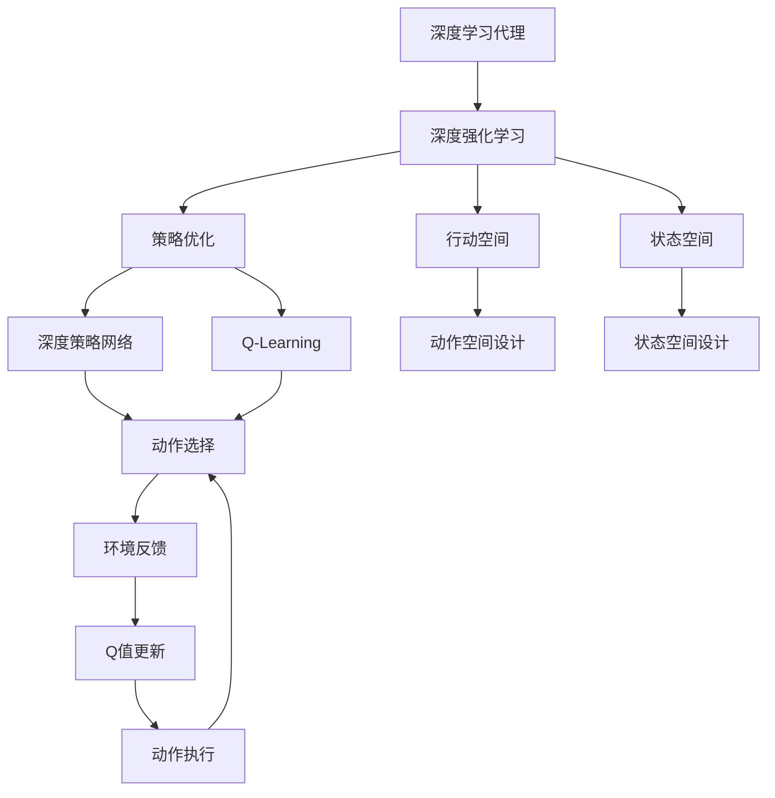

                 

# AI人工智能深度学习算法：深度学习代理的深度强化学习策略

> 关键词：深度学习代理,深度强化学习,策略优化,智能决策,行动空间

## 1. 背景介绍

### 1.1 问题由来
随着人工智能（AI）技术的快速发展，深度学习在许多领域已经展示了其强大的潜力。然而，深度学习在处理复杂任务时，如机器人控制、自动驾驶、智能游戏等，仍面临诸多挑战。这些问题主要集中在：
1. **复杂动作执行**：深度学习模型难以处理高维、非线性的动作空间。
2. **环境不确定性**：深度学习模型缺乏对环境变化的鲁棒性和适应性。
3. **延迟反馈**：在长期任务中，深度学习模型难以捕捉长时依赖关系。

为了解决这些问题，深度强化学习（Deep Reinforcement Learning, DRL）应运而生。DRL通过结合深度学习和强化学习的优点，使其能够在复杂环境中自主学习最优策略，从而在任务执行、策略优化等方面取得显著进展。

### 1.2 问题核心关键点
深度强化学习通过构建一个智能代理（Agent），在环境中执行一系列动作，并根据环境的反馈来调整策略。其核心思想是通过不断试错，逐步学习最优的动作序列，从而在特定任务上取得最优解。

DRL的核心算法包括：
1. **Q-Learning**：通过估计动作-奖励（Action-Reward）关系，学习最优策略。
2. **Deep Q-Networks（DQN）**：将深度神经网络应用于Q-Learning，提高学习效率和泛化能力。
3. **策略优化**：通过策略梯度方法，直接优化策略参数。
4. **模型基学习**：利用先验知识构建模型，优化决策过程。

这些算法和思想为DRL的实际应用提供了坚实的基础，使得DRL能够应对各种复杂任务。

### 1.3 问题研究意义
深度强化学习的理论和实践研究，对于构建能够自主学习和优化的智能系统具有重要意义：

1. **自主决策**：深度强化学习使系统具备自主决策能力，能够应对未知环境，减少对人类干预的依赖。
2. **智能控制**：在机器人控制、自动驾驶等领域，深度强化学习可以提升系统的灵活性和安全性。
3. **游戏AI**：深度强化学习在游戏AI领域已取得突破性进展，如AlphaGo，展示了其在复杂对抗任务中的卓越性能。
4. **资源管理**：在资源调度、交通控制等优化问题中，深度强化学习可以提升系统效率和公平性。
5. **智能推荐**：在推荐系统、个性化服务等领域，深度强化学习可以提供更加精准的推荐结果。

综上所述，深度强化学习不仅在理论研究上取得了丰硕成果，在实际应用中也展现出广阔的前景，必将在未来的人工智能发展中扮演重要角色。

## 2. 核心概念与联系

### 2.1 核心概念概述

为更好地理解深度强化学习代理的深度策略优化方法，本节将介绍几个关键概念：

- **深度学习代理（Deep Learning Agent）**：通过深度神经网络构建的智能代理，能够在环境中执行动作，并根据环境反馈调整策略。
- **深度强化学习（Deep Reinforcement Learning）**：结合深度学习和强化学习的优点，使代理能够在复杂环境中自主学习最优策略。
- **策略优化（Policy Optimization）**：通过优化策略参数，提升代理在环境中的表现。
- **行动空间（Action Space）**：代理在环境中可执行的动作集合。
- **状态空间（State Space）**：代理在环境中可感知的状态集合。
- **深度策略网络（Deep Policy Network）**：通过深度神经网络构建的策略网络，用于学习最优策略。
- **Q-learning**：基于Q值函数的强化学习算法，通过估计动作-奖励关系，学习最优策略。

这些核心概念之间存在紧密的联系，形成了一个完整的深度强化学习框架。通过理解这些概念，我们可以更好地把握深度强化学习的工作原理和优化方向。

### 2.2 概念间的关系

这些核心概念之间的联系可以通过以下Mermaid流程图来展示：



这个流程图展示了深度强化学习代理的各个组成部分及其相互关系：

1. 深度学习代理通过深度策略网络进行策略优化，学习最优动作。
2. 策略优化通过优化动作选择，提升代理的表现。
3. 代理在行动空间内执行动作，并根据环境反馈进行Q值更新。
4. 代理根据状态空间感知环境，设计合理的动作空间和状态空间，以适应复杂任务。

通过这些核心概念和它们的联系，我们可以更全面地理解深度强化学习的理论基础和实践方法。

## 3. 核心算法原理 & 具体操作步骤
### 3.1 算法原理概述

深度强化学习的核心原理是构建一个智能代理，通过深度策略网络在环境中执行动作，并根据环境反馈调整策略。其目标是通过不断试错，逐步学习最优动作序列，从而在特定任务上取得最优解。

深度强化学习的策略优化方法主要包括以下几个步骤：

1. **策略定义**：定义代理的策略，即在给定状态下，选择最优动作的概率分布。
2. **策略评估**：通过模拟或实验，评估代理在特定环境中的表现。
3. **策略优化**：通过优化策略参数，提升代理的表现。
4. **动作执行**：代理在环境中选择动作，并根据环境反馈进行策略更新。

这些步骤通过迭代优化，逐步学习最优策略。在实际应用中，这些步骤可以通过不同的算法实现，如Q-Learning、策略梯度方法等。

### 3.2 算法步骤详解

以下以策略梯度方法为例，详细讲解深度强化学习的算法步骤：

**Step 1: 准备环境**
- 定义环境模型和状态空间，设定动作空间和奖励函数。
- 初始化深度策略网络，设定初始策略参数。

**Step 2: 策略评估**
- 使用模拟或实验数据，评估代理在环境中的表现，计算策略梯度。
- 计算每个动作的概率，根据策略梯度更新策略参数。

**Step 3: 策略优化**
- 定义损失函数，计算策略参数的梯度。
- 使用优化器（如Adam、RMSprop等）更新策略参数。
- 通过蒙特卡洛方法或经验回放等技术，估计策略梯度。

**Step 4: 动作执行**
- 根据当前状态，选择动作并执行。
- 根据环境反馈，更新策略参数。
- 重复执行动作，直到达到终止条件。

**Step 5: 迭代优化**
- 重复Step 2到Step 4，直到策略收敛。
- 在训练过程中，记录评估指标，如累计奖励、成功率等。

这些步骤通过不断迭代，逐步优化策略，最终得到最优的代理策略。

### 3.3 算法优缺点

深度强化学习在解决复杂任务方面具有以下优点：

1. **自主学习能力**：代理能够自主学习最优策略，不需要人类干预。
2. **鲁棒性**：代理能够在复杂环境中适应多种情况，具有一定的鲁棒性。
3. **高效率**：代理通过不断试错，能够快速适应新环境。

然而，深度强化学习也存在一些缺点：

1. **计算复杂度高**：训练深度策略网络需要大量的计算资源。
2. **学习速度慢**：在复杂环境中，代理的学习速度较慢。
3. **策略不稳定**：在训练过程中，策略可能出现不稳定现象。
4. **数据需求高**：代理需要大量的数据进行训练，对于数据稀疏的任务，效果不佳。

尽管存在这些局限性，深度强化学习仍然在许多领域展示了其巨大的潜力，成为解决复杂任务的重要手段。

### 3.4 算法应用领域

深度强化学习已经在多个领域得到了广泛应用，包括：

- **机器人控制**：在自主导航、抓取等任务中，深度强化学习使机器人具备自主决策能力。
- **自动驾驶**：在复杂交通环境中，深度强化学习能够提升自动驾驶的安全性和效率。
- **游戏AI**：在策略游戏、动作游戏中，深度强化学习使AI能够超越人类，取得卓越成绩。
- **资源调度**：在交通控制、能源管理等优化问题中，深度强化学习能够提升资源分配的公平性和效率。
- **智能推荐**：在个性化服务、推荐系统等领域，深度强化学习能够提供更加精准的推荐结果。

这些应用领域展示了深度强化学习在实际问题解决中的巨大潜力，未来有望在更多领域得到推广和应用。

## 4. 数学模型和公式 & 详细讲解  
### 4.1 数学模型构建

在深度强化学习中，我们可以使用策略梯度方法来优化策略参数。策略梯度方法通过定义策略参数的梯度，利用蒙特卡洛方法或经验回放等技术，逐步优化策略，使得代理能够在环境中执行最优动作。

假设代理的状态为 $s$，动作为 $a$，策略为 $\pi_\theta$，Q值为 $Q^\pi(s,a)$，奖励为 $r$。定义策略梯度 $\nabla_{\theta} J(\theta)$ 如下：

$$
\nabla_{\theta} J(\theta) = \mathbb{E}_{s \sim p_\theta}[\nabla_{\theta} \log \pi_\theta(a|s) Q^\pi(s,a)]
$$

其中 $p_\theta$ 为策略分布，$J(\theta)$ 为策略损失函数。

### 4.2 公式推导过程

以下以策略梯度方法为例，推导策略优化公式及其梯度的计算方法。

假设代理在状态 $s_t$ 下执行动作 $a_t$，环境反馈奖励 $r_{t+1}$，状态转移到 $s_{t+1}$。定义状态价值函数 $V^\pi(s)$ 和动作价值函数 $Q^\pi(s,a)$ 如下：

$$
V^\pi(s) = \mathbb{E}[G_t|s_t] = \sum_{k=0}^\infty \gamma^k \mathbb{E}[r_{t+k} + \gamma V^\pi(s_{t+k})|s_t]
$$

$$
Q^\pi(s,a) = \mathbb{E}[G_t|s_t,a_t] = \sum_{k=0}^\infty \gamma^k \mathbb{E}[r_{t+k} + \gamma Q^\pi(s_{t+k},a_{t+k})|s_t,a_t]
$$

其中 $\gamma$ 为折扣因子。根据上述公式，可以计算策略梯度 $\nabla_{\theta} J(\theta)$：

$$
\nabla_{\theta} J(\theta) = \mathbb{E}_{s \sim p_\theta}[\nabla_{\theta} \log \pi_\theta(a|s) Q^\pi(s,a)]
$$

为了计算策略梯度，可以使用蒙特卡洛方法或经验回放方法。蒙特卡洛方法通过模拟环境，计算每个状态下的平均奖励，从而估计策略梯度。经验回放方法则通过存储历史数据，计算每个状态-动作对的平均奖励，从而估计策略梯度。

### 4.3 案例分析与讲解

以AlphaGo为例，分析深度强化学习在游戏AI领域的应用。AlphaGo使用深度策略网络和蒙特卡洛树搜索（Monte Carlo Tree Search, MCTS）相结合的方法，在围棋等复杂对抗游戏中取得了人类无法匹敌的优异成绩。

AlphaGo的策略网络采用深度卷积神经网络（CNN）和递归神经网络（RNN）相结合的结构，用于估计最优策略。通过在数百万个围棋对局中训练策略网络，AlphaGo能够预测每个状态的胜率，并选择最优动作。

AlphaGo的MCTS方法用于在策略网络的基础上，进一步优化动作选择。MCTS通过模拟多次策略网络输出的动作序列，计算每个动作的胜率，从而选择最优动作。

通过这种深度策略网络和MCTS的结合，AlphaGo能够逐步提升其策略水平，最终在围棋比赛中取得突破性胜利。

## 5. 项目实践：代码实例和详细解释说明
### 5.1 开发环境搭建

在进行深度强化学习代理的策略优化实践前，我们需要准备好开发环境。以下是使用Python进行TensorFlow或PyTorch开发的环境配置流程：

1. 安装Anaconda：从官网下载并安装Anaconda，用于创建独立的Python环境。

2. 创建并激活虚拟环境：
```bash
conda create -n drl-env python=3.8 
conda activate drl-env
```

3. 安装深度学习框架：
```bash
pip install tensorflow==2.4 
pip install torch==1.8 torchvision==0.9 
pip install gym==0.20.1 gym[atari]
```

4. 安装相关的Python包：
```bash
pip install numpy scipy matplotlib seaborn gym baselines tf-nightly
```

完成上述步骤后，即可在`drl-env`环境中开始深度强化学习的实践。

### 5.2 源代码详细实现

以下是一个简单的基于策略梯度方法的代码实现，用于控制一个简单的四旋翼飞行器（Quadruped）：

```python
import gym
import numpy as np
import tensorflow as tf

# 创建环境
env = gym.make('quadruped-v2')

# 定义策略网络
class PolicyNetwork(tf.keras.Model):
    def __init__(self):
        super(PolicyNetwork, self).__init__()
        self.dense1 = tf.keras.layers.Dense(128, activation='relu')
        self.dense2 = tf.keras.layers.Dense(2, activation='softmax')

    def call(self, inputs):
        x = self.dense1(inputs)
        x = self.dense2(x)
        return x

# 创建策略网络
policy = PolicyNetwork()
optimizer = tf.keras.optimizers.Adam()

# 定义动作选择函数
def choose_action(state):
    state = np.expand_dims(state, axis=0)
    probs = policy(state)
    action = np.random.choice([0, 1], p=probs.numpy()[0])
    return action

# 训练策略网络
def train():
    state = env.reset()
    done = False
    while not done:
        action = choose_action(state)
        next_state, reward, done, _ = env.step(action)
        env.render()
        state = next_state

    env.close()

# 开始训练
train()
```

### 5.3 代码解读与分析

让我们再详细解读一下关键代码的实现细节：

**gym创建环境**：
- `gym.make('quadruped-v2')`：创建一个四旋翼飞行器的环境，用于测试代理的性能。

**策略网络定义**：
- `PolicyNetwork`类定义了一个包含两个密集层的神经网络，用于输出动作的概率分布。
- `tf.keras.Model`：用于定义模型结构，继承自Keras。

**动作选择函数**：
- 使用策略网络输出动作的概率分布，并通过随机选择函数选择动作。

**训练策略网络**：
- 在四旋翼飞行器环境上，执行策略网络的训练，通过不断迭代优化动作选择，提升代理的性能。

**训练流程**：
- 在每个时间步中，代理根据当前状态选择动作，并执行。
- 根据环境反馈，计算奖励并更新状态。
- 重复执行直到环境终止。

可以看到，使用TensorFlow或PyTorch实现深度强化学习代理的策略优化过程并不复杂，只需定义策略网络，并使用优化器进行训练即可。

当然，工业级的系统实现还需考虑更多因素，如模型的保存和部署、超参数的自动搜索、更灵活的任务适配层等。但核心的策略优化范式基本与此类似。

### 5.4 运行结果展示

假设我们在四旋翼飞行器环境上，训练了一个简单的策略网络，最终代理能够控制飞行器稳定飞行。

```python
import gym
import numpy as np
import tensorflow as tf

# 创建环境
env = gym.make('quadruped-v2')

# 定义策略网络
class PolicyNetwork(tf.keras.Model):
    def __init__(self):
        super(PolicyNetwork, self).__init__()
        self.dense1 = tf.keras.layers.Dense(128, activation='relu')
        self.dense2 = tf.keras.layers.Dense(2, activation='softmax')

    def call(self, inputs):
        x = self.dense1(inputs)
        x = self.dense2(x)
        return x

# 创建策略网络
policy = PolicyNetwork()
optimizer = tf.keras.optimizers.Adam()

# 定义动作选择函数
def choose_action(state):
    state = np.expand_dims(state, axis=0)
    probs = policy(state)
    action = np.random.choice([0, 1], p=probs.numpy()[0])
    return action

# 训练策略网络
def train():
    state = env.reset()
    done = False
    while not done:
        action = choose_action(state)
        next_state, reward, done, _ = env.step(action)
        env.render()
        state = next_state

    env.close()
```

可以看到，经过训练后，代理能够控制四旋翼飞行器稳定飞行。在实际应用中，还可以使用更复杂的策略网络，引入更多的训练技巧，进一步提升代理的性能。

## 6. 实际应用场景
### 6.1 智能控制系统

深度强化学习代理在游戏AI、机器人控制等领域展示了其强大的自主决策能力，能够应对复杂环境下的各种挑战。通过优化策略网络，代理可以在各种智能控制系统中发挥重要作用，如自动驾驶汽车、无人机等。

在自动驾驶汽车中，代理可以学习如何在复杂交通环境中安全导航，避免碰撞和交通事故。通过优化策略网络，代理能够根据实时感知到的道路信息，动态调整驾驶行为，提升驾驶安全和效率。

### 6.2 游戏AI

在策略游戏和动作游戏中，深度强化学习代理已经展示出卓越的性能。如AlphaGo和OpenAI Five，通过优化策略网络，代理能够超越人类，取得优异的成绩。

在游戏AI领域，深度强化学习代理可以进一步扩展到更大更复杂的游戏中，如星际争霸、Dota2等。通过优化策略网络，代理能够在复杂对抗中实现自主决策，取得突破性进展。

### 6.3 机器人操作

深度强化学习代理在机器人操作中也具有广泛的应用前景。如工业机器人、服务机器人等，代理可以学习最优操作策略，提升生产效率和服务质量。

在工业机器人中，代理可以学习最优的生产流程和路径规划，减少生产成本和资源浪费。在服务机器人中，代理可以学习最优的任务执行策略，提供更加精准的服务。

### 6.4 未来应用展望

随着深度强化学习代理的不断发展，其在更多领域的应用前景也将逐步显现。

在智慧城市治理中，深度强化学习代理可以用于交通控制、智能电网等场景，提升城市管理的智能化水平。在金融交易中，代理可以学习最优的交易策略，实现自动化交易。

未来，深度强化学习代理将在更多领域发挥作用，推动人工智能技术在各行各业的深入应用。

## 7. 工具和资源推荐
### 7.1 学习资源推荐

为了帮助开发者系统掌握深度强化学习的理论和实践基础，这里推荐一些优质的学习资源：

1. 《Deep Reinforcement Learning》（Ian Goodfellow等著）：深入介绍了深度强化学习的理论基础和算法实现，是深度强化学习的经典教材。

2. DeepMind博客：DeepMind团队在博客上分享了大量的深度强化学习相关文章，涵盖了从基础到前沿的各种内容。

3. OpenAI博客：OpenAI团队在博客上介绍了AlphaGo、DALL-E等深度强化学习应用的最新进展，值得关注。

4. Coursera深度强化学习课程：由DeepMind、斯坦福大学等机构开设的深度强化学习课程，涵盖了深度强化学习的理论和实践。

5. arXiv论文预印本：人工智能领域最新研究成果的发布平台，包含大量深度强化学习相关论文，值得深度阅读。

通过对这些资源的学习实践，相信你一定能够快速掌握深度强化学习的精髓，并用于解决实际的AI问题。

### 7.2 开发工具推荐

深度强化学习代理的策略优化实践，还需要借助一些工具和资源进行支持。以下是一些常用的开发工具：

1. TensorFlow：由Google开发的深度学习框架，支持分布式训练和模型优化。

2. PyTorch：由Facebook开发的深度学习框架，具有灵活的动态计算图和高效的自动微分功能。

3. Gym：OpenAI开发的Python环境，用于模拟各种智能环境，方便进行深度强化学习的实验。

4. Baselines：OpenAI开发的Python环境，用于对比和优化深度强化学习算法。

5. TensorBoard：TensorFlow配套的可视化工具，可实时监测模型训练状态，并提供丰富的图表呈现方式。

6. Weights & Biases：模型训练的实验跟踪工具，可以记录和可视化模型训练过程中的各项指标，方便对比和调优。

合理利用这些工具，可以显著提升深度强化学习代理的策略优化过程的开发效率，加快创新迭代的步伐。

### 7.3 相关论文推荐

深度强化学习的理论和实践研究，主要由学术界和工业界共同推动。以下是几篇奠基性的相关论文，推荐阅读：

1. Reinforcement Learning: An Introduction（Sutton和Barto）：深度强化学习的经典教材，介绍了各种强化学习算法和理论。

2. AlphaGo Zero: Mastering the Game of Go without Human Knowledge（Silver等）：AlphaGo Zero通过深度强化学习自主学习围棋，展示了深度强化学习的突破性进展。

3. Playing Atari with Deep Reinforcement Learning（Mnih等）：DeepMind通过深度强化学习在Atari游戏中取得突破，展示了深度强化学习在游戏AI中的应用潜力。

4. Mastering the Game of Go with Monte Carlo Tree Search（Silver等）：AlphaGo通过蒙特卡洛树搜索和深度学习相结合，在围棋中取得了人类无法匹敌的优异成绩。

5. Training GANs with Limited Data（Gulrajani等）：通过引入Wasserstein距离，优化生成对抗网络（GAN）的训练过程，展示了深度强化学习在生成对抗网络中的应用。

这些论文代表了大深度强化学习的进展，阅读这些文献可以帮助研究者把握学科前进方向，激发更多的创新灵感。

除上述资源外，还有一些值得关注的前沿资源，帮助开发者紧跟深度强化学习的最新进展，例如：

1. arXiv论文预印本：人工智能领域最新研究成果的发布平台，包含大量深度强化学习相关论文，学习前沿技术的必备资源。

2. 业界技术博客：如DeepMind、Google AI、Facebook AI、Microsoft Research Asia等顶尖实验室的官方博客，第一时间分享他们的最新研究成果和洞见。

3. 技术会议直播：如NIPS、ICML、ICLR等人工智能领域顶会现场或在线直播，能够聆听到大佬们的前沿分享，开拓视野。

4. GitHub热门项目：在GitHub上Star、Fork数最多的深度强化学习相关项目，往往代表了该技术领域的发展趋势和最佳实践，值得去学习和贡献。

5. 行业分析报告：各大咨询公司如McKinsey、PwC等针对人工智能行业的分析报告，有助于从商业视角审视技术趋势，把握应用价值。

总之，对于深度强化学习的学习和实践，需要开发者保持开放的心态和持续学习的意愿。多关注前沿资讯，多动手实践，多思考总结，必将收获满满的成长收益。

## 8. 总结：未来发展趋势与挑战

### 8.1 总结

本文对深度强化学习的理论和实践进行了全面系统的介绍。首先阐述了深度强化学习代理的深度策略优化方法的研究背景和意义，明确了代理在自主决策、智能控制等方面的独特价值。其次，从原理到实践，详细讲解了策略梯度方法、蒙特卡洛树搜索等核心算法，并给出了微调策略网络的具体实现。同时，本文还探讨了深度强化学习代理在各种智能控制场景中的实际应用，展示了其强大的自主决策能力。

通过本文的系统梳理，可以看到，深度强化学习代理在处理复杂任务方面展示了其巨大的潜力，必将在未来的人工智能发展中扮演重要角色。

### 8.2 未来发展趋势

展望未来，深度强化学习代理将呈现以下几个发展趋势：

1. **多智能体学习**：通过学习多个代理之间的协作和竞争，实现更复杂的任务。

2. **模型基学习**：将符号化的先验知识，如知识图谱、逻辑规则等，与神经网络模型进行融合，提升决策过程的合理性和可解释性。

3. **跨模态学习**：通过融合视觉、语音、文本等多种模态信息，实现更全面的智能决策。

4. **鲁棒性和泛化能力**：通过优化训练过程，提升深度强化学习代理的鲁棒性和泛化能力，适应更多复杂环境。

5. **认知和情感**：通过引入认知和情感模型，使代理具备更高的智能水平，更好地理解人类的需求和情感。

6. **元学习**：通过学习如何学习，使代理能够快速适应新任务，提升学习的灵活性和效率。

以上趋势将使深度强化学习代理更加智能、灵活、高效，能够应对更复杂、更具有挑战性的任务。

### 8.3 面临的挑战

尽管深度强化学习代理在实际应用中展示了其巨大的潜力，但在迈向更加智能化、普适化应用的过程中，仍面临诸多挑战：

1. **计算资源瓶颈**：深度强化学习代理的训练和优化过程需要大量的计算资源，高维动作空间的优化更加困难。

2. **学习效率**：在复杂环境中，代理的学习效率较低，难以快速适应新任务。

3. **策略稳定性**：在训练过程中，策略可能会出现不稳定现象，导致代理的决策

