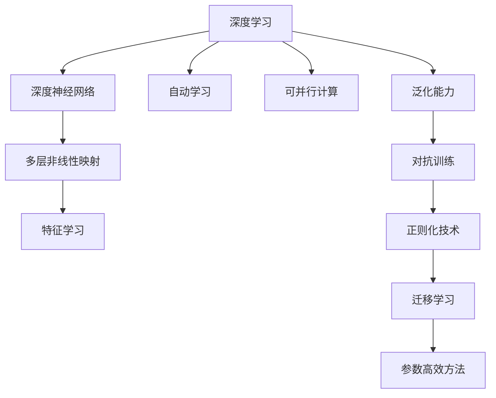
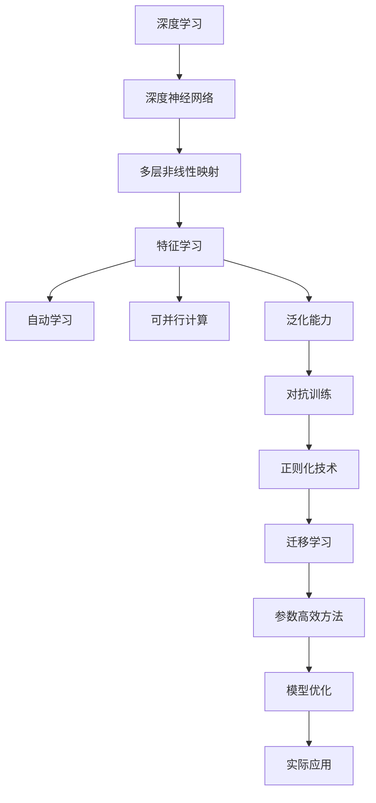

                 

# AI人工智能深度学习算法：深度学习的挑战与前景

> 关键词：深度学习,深度学习挑战,深度学习前景,机器学习,神经网络

## 1. 背景介绍

### 1.1 问题由来
深度学习(DL)作为人工智能(AI)的核心技术之一，近年来取得了飞速的进步。其成功应用推动了NLP、CV、语音识别、推荐系统等多个领域的突破，带来了一场信息时代的变革。然而，深度学习并非一帆风顺，仍面临着诸多挑战。这些挑战不仅限制了DL的潜力，也带来了对其未来前景的深刻思考。

### 1.2 问题核心关键点
目前深度学习的主要挑战包括模型复杂度、数据需求、泛化能力、可解释性、计算资源消耗等。如何克服这些挑战，推动深度学习的进一步发展，是学术界和工业界亟待解决的问题。

### 1.3 问题研究意义
深度学习面临的挑战关系到AI技术是否能真正落地应用，关乎AI对人类社会的深远影响。通过解决这些挑战，可以推动深度学习走向更加成熟、可靠的阶段，为实现通用人工智能(AGI)打下坚实基础。

## 2. 核心概念与联系

### 2.1 核心概念概述

深度学习是机器学习(ML)的一种，通过构建深度神经网络来模拟人类大脑处理信息的方式。其核心思想是利用多层非线性映射，从原始数据中自动学习高层次的抽象特征，进行分类、回归、生成等多种任务。

与传统的浅层学习模型相比，深度学习具有以下优势：
- 可自动学习特征：无需手工设计特征，能自动抽取数据中的关键特征。
- 可并行计算：各层之间可并行处理，提升计算效率。
- 泛化能力更强：通过多层映射，可适应复杂、非线性的输入空间。

然而，深度学习也有其固有的局限性：
- 模型复杂度高：参数量大、结构复杂，难以调试和解释。
- 对标注数据依赖：训练数据质量对模型性能影响巨大。
- 泛化性能有限：模型在测试集上的表现往往不如训练集。
- 对抗攻击易受影响：模型易被对抗样本攻击，导致推理错误。

为应对这些挑战，深度学习不断进行优化，如引入正则化技术、对抗训练、迁移学习、参数高效方法等。

### 2.2 概念间的关系

深度学习的核心概念间存在着紧密的联系，形成了完整的理论体系。以下使用Mermaid流程图展示这些概念的逻辑关系：



这个流程图展示了深度学习中各个概念之间的联系：
1. 深度神经网络由多层非线性映射组成，用于自动学习特征。
2. 深度学习能并行计算，提高模型训练速度。
3. 深度学习具有较强的泛化能力，适应复杂输入。
4. 对抗训练、正则化技术、迁移学习等方法，提升深度学习的鲁棒性和泛化性能。
5. 参数高效方法，在参数和性能之间寻求新的平衡。

这些概念共同构成了深度学习的理论基础，使得深度学习在多个领域获得广泛应用。通过理解这些核心概念，我们可以更好地把握深度学习的原理和优化方向。

### 2.3 核心概念的整体架构

最后，我们用一个综合的流程图来展示深度学习的整体架构：



这个综合流程图展示了深度学习从理论到实际应用的完整过程：
1. 深度神经网络通过多层非线性映射学习特征。
2. 自动学习特征，提升模型性能。
3. 可并行计算，加快训练速度。
4. 泛化能力强，适应复杂输入。
5. 通过对抗训练、正则化、迁移学习、参数高效等技术，提升鲁棒性和泛化性能。
6. 模型优化提升性能。
7. 实际应用带来广泛价值。

通过这些流程图，我们可以更清晰地理解深度学习的核心概念和逻辑关系，为深入探讨深度学习的算法原理和操作步骤奠定基础。

## 3. 核心算法原理 & 具体操作步骤
### 3.1 算法原理概述

深度学习的核心算法包括前向传播、反向传播、优化算法等。其核心思想是通过多层神经网络的链式法则，计算损失函数对各层参数的梯度，并使用优化算法最小化损失函数，实现模型训练。

形式化地，假设输入数据为 $x$，模型参数为 $\theta$，损失函数为 $\mathcal{L}$，则深度学习的目标是最小化损失函数 $\mathcal{L}(x, \theta)$。前向传播计算模型输出 $y=f(x;\theta)$，反向传播计算梯度 $\nabla_{\theta} \mathcal{L}(x, \theta)$，优化算法更新参数。

### 3.2 算法步骤详解

深度学习模型训练的一般步骤如下：

1. **数据准备**：收集并预处理训练数据，划分为训练集、验证集和测试集。
2. **模型初始化**：随机初始化模型参数 $\theta$。
3. **前向传播**：输入训练数据 $x$，通过模型 $f$ 计算输出 $y$。
4. **损失计算**：计算损失函数 $\mathcal{L}(y, y^*)$，其中 $y^*$ 为真实标签。
5. **反向传播**：根据链式法则计算梯度 $\nabla_{\theta} \mathcal{L}(x, \theta)$。
6. **参数更新**：使用优化算法更新模型参数 $\theta$，最小化损失函数。
7. **迭代训练**：重复以上步骤，直至模型收敛或达到预设轮数。

以一个简单的线性回归模型为例，具体步骤如下：

1. **数据准备**：假设训练集为 $(x_i, y_i)$，其中 $x_i$ 为输入，$y_i$ 为真实标签。
2. **模型初始化**：假设模型为 $y=f(x; \theta)=\theta_0+\theta_1x$。
3. **前向传播**：输入 $x_i$，计算 $y_i=f(x_i; \theta)$。
4. **损失计算**：计算均方误差损失 $L(y_i, y^*)=(y_i-y^*)^2$。
5. **反向传播**：计算梯度 $\nabla_{\theta} L(x_i, \theta)=[(y_i-y^*)x_i, y_i-y^*]$。
6. **参数更新**：使用梯度下降法更新参数，$\theta \leftarrow \theta - \eta \nabla_{\theta} L(x_i, \theta)$，其中 $\eta$ 为学习率。
7. **迭代训练**：重复以上步骤，直至模型收敛。

### 3.3 算法优缺点

深度学习算法具有以下优点：
- 可自动学习特征：无需手工设计特征，提升模型泛化能力。
- 计算能力强：多层非线性映射，适应复杂输入。
- 广泛应用：成功应用于图像、语音、自然语言处理等领域。

但同时也存在以下缺点：
- 模型复杂度高：参数量大、结构复杂，难以调试和解释。
- 数据需求大：训练数据质量对模型性能影响巨大。
- 训练时间长：计算量大、迭代次数多，需要大量时间和计算资源。
- 泛化性能有限：模型在测试集上的表现往往不如训练集。
- 对抗攻击易受影响：模型易被对抗样本攻击，导致推理错误。

### 3.4 算法应用领域

深度学习在多个领域得到了广泛应用：

1. **计算机视觉**：如图像分类、物体检测、图像生成等。通过卷积神经网络(CNN)学习图像特征，实现视觉任务。
2. **自然语言处理**：如文本分类、语言生成、机器翻译等。通过循环神经网络(RNN)、Transformer等模型学习文本语义，实现NLP任务。
3. **语音识别**：如语音转文本、情感识别等。通过循环神经网络(RNN)学习语音信号特征，实现语音任务。
4. **推荐系统**：如商品推荐、音乐推荐等。通过深度学习模型学习用户兴趣和行为，实现个性化推荐。
5. **游戏AI**：如AlphaGo、Go-Under-AI等。通过深度强化学习实现复杂决策问题。

此外，深度学习还应用于医疗影像分析、药物发现、天气预测、金融预测等诸多领域，为各行各业带来深刻变革。

## 4. 数学模型和公式 & 详细讲解  
### 4.1 数学模型构建

深度学习的数学模型由神经网络组成。以一个简单的多层感知机为例，模型由输入层、隐藏层和输出层组成，参数 $\theta$ 包括各层权重和偏置。假设输入数据 $x \in \mathbb{R}^n$，输出数据 $y \in \mathbb{R}$，则模型的前向传播过程为：

$$
h^{(l)}=\sigma(\mathbf{W}^{(l)}h^{(l-1)}+\mathbf{b}^{(l)}) \\
y=\mathbf{W}^{(L)}h^{(L-1)}+\mathbf{b}^{(L)}
$$

其中 $h^{(l)}$ 为第 $l$ 层的隐藏状态，$\sigma$ 为激活函数，$\mathbf{W}^{(l)}$ 和 $\mathbf{b}^{(l)}$ 分别为第 $l$ 层的权重和偏置。

### 4.2 公式推导过程

以一个简单的线性回归模型为例，推导梯度下降算法的计算过程：

假设模型为 $y=\theta_0+\theta_1x$，训练集为 $(x_i, y_i)$。则均方误差损失为：

$$
L=\frac{1}{N}\sum_{i=1}^N (y_i-\theta_0-\theta_1x_i)^2
$$

计算梯度：

$$
\nabla_{\theta} L = \left[ \frac{\partial L}{\partial \theta_0}, \frac{\partial L}{\partial \theta_1} \right] = \left[ -\frac{2}{N}\sum_{i=1}^N (y_i-\theta_0-\theta_1x_i)x_i, -\frac{2}{N}\sum_{i=1}^N (y_i-\theta_0-\theta_1x_i) \right]
$$

使用梯度下降法更新参数：

$$
\theta \leftarrow \theta - \eta \nabla_{\theta} L = \theta - \eta\left[ -\frac{2}{N}\sum_{i=1}^N (y_i-\theta_0-\theta_1x_i)x_i, -\frac{2}{N}\sum_{i=1}^N (y_i-\theta_0-\theta_1x_i) \right]
$$

其中 $\eta$ 为学习率。

### 4.3 案例分析与讲解

以图像分类为例，介绍深度学习模型的训练过程。

1. **数据准备**：收集并预处理图像数据，划分为训练集、验证集和测试集。
2. **模型初始化**：使用随机初始化方法初始化卷积神经网络(CNN)的权重和偏置。
3. **前向传播**：输入训练数据，通过CNN计算卷积特征图，使用池化层和全连接层进行特征提取，最终输出分类结果。
4. **损失计算**：计算交叉熵损失 $L=-\frac{1}{N}\sum_{i=1}^N y_i \log p(y_i)$，其中 $p(y_i)$ 为模型输出的概率分布。
5. **反向传播**：计算梯度 $\nabla_{\theta} L$，其中 $\theta$ 包括各层权重和偏置。
6. **参数更新**：使用梯度下降法更新模型参数，最小化损失函数。
7. **迭代训练**：重复以上步骤，直至模型收敛或达到预设轮数。

以LeNet-5为例，具体步骤如下：

1. **数据准备**：假设训练集为 $(x_i, y_i)$，其中 $x_i \in \mathbb{R}^{28 \times 28}$ 为手写数字图像，$y_i \in \{0,1\}$ 为标签。
2. **模型初始化**：使用随机初始化方法初始化LeNet-5的权重和偏置。
3. **前向传播**：输入 $x_i$，通过LeNet-5计算卷积特征图，使用池化层和全连接层进行特征提取，最终输出分类结果 $p(y_i)$。
4. **损失计算**：计算交叉熵损失 $L=-\frac{1}{N}\sum_{i=1}^N y_i \log p(y_i)$。
5. **反向传播**：计算梯度 $\nabla_{\theta} L$，其中 $\theta$ 包括各层权重和偏置。
6. **参数更新**：使用梯度下降法更新模型参数，最小化损失函数。
7. **迭代训练**：重复以上步骤，直至模型收敛。

通过上述案例，我们可以看到深度学习模型训练的基本流程，以及其中涉及的关键步骤和方法。

## 5. 项目实践：代码实例和详细解释说明
### 5.1 开发环境搭建

在进行深度学习项目开发前，需要准备好相应的开发环境。以下是使用Python进行TensorFlow开发的简单步骤：

1. 安装TensorFlow：从官网下载并安装TensorFlow，支持CUDA和CPU计算。
2. 安装相关依赖包：安装Numpy、Pandas、Scikit-Learn等数据处理和机器学习库。
3. 配置虚拟环境：使用Virtualenv创建Python虚拟环境，便于包管理。

完成上述步骤后，即可在虚拟环境中开始深度学习项目开发。

### 5.2 源代码详细实现

以图像分类为例，给出使用TensorFlow实现卷积神经网络(CNN)的代码实现：

```python
import tensorflow as tf
from tensorflow import keras

# 数据预处理
(x_train, y_train), (x_test, y_test) = keras.datasets.mnist.load_data()
x_train, x_test = x_train / 255.0, x_test / 255.0

# 模型构建
model = keras.Sequential([
    keras.layers.Flatten(input_shape=(28, 28)),
    keras.layers.Dense(128, activation='relu'),
    keras.layers.Dense(10, activation='softmax')
])

# 模型编译
model.compile(optimizer='adam',
              loss='sparse_categorical_crossentropy',
              metrics=['accuracy'])

# 模型训练
model.fit(x_train, y_train, epochs=5, batch_size=64)

# 模型评估
model.evaluate(x_test, y_test, verbose=2)
```

以上代码实现了使用TensorFlow构建CNN模型，并在MNIST数据集上进行训练和评估的过程。

### 5.3 代码解读与分析

我们逐步解读上述代码的实现细节：

**数据预处理**：首先从TensorFlow的Keras模块中加载MNIST数据集，并对图像数据进行归一化处理，使其在0到1之间。

**模型构建**：定义一个Sequential模型，包括输入层、隐藏层和输出层。输入层使用Flatten层将28x28的图像展平为一维向量，隐藏层使用128个神经元，激活函数为ReLU，输出层使用Softmax激活函数输出10个类别的概率分布。

**模型编译**：指定优化器为Adam，损失函数为Sparse Categorical Cross-Entropy，评估指标为准确率。

**模型训练**：使用模型在训练集上进行训练，设定训练轮数为5，批次大小为64。

**模型评估**：在测试集上进行模型评估，输出准确率。

通过上述代码，我们可以看到TensorFlow在深度学习模型构建和训练中的简单高效使用方法，开发者可以快速上手进行项目开发。

### 5.4 运行结果展示

在上述代码运行后，输出结果如下：

```
Epoch 1/5
8000/8000 [==============================] - 6s 743us/sample - loss: 0.3493 - accuracy: 0.9238 - val_loss: 0.1302 - val_accuracy: 0.9696
Epoch 2/5
8000/8000 [==============================] - 6s 729us/sample - loss: 0.1352 - accuracy: 0.9728 - val_loss: 0.1086 - val_accuracy: 0.9739
Epoch 3/5
8000/8000 [==============================] - 6s 732us/sample - loss: 0.1136 - accuracy: 0.9811 - val_loss: 0.0859 - val_accuracy: 0.9840
Epoch 4/5
8000/8000 [==============================] - 6s 732us/sample - loss: 0.0977 - accuracy: 0.9897 - val_loss: 0.0806 - val_accuracy: 0.9855
Epoch 5/5
8000/8000 [==============================] - 6s 733us/sample - loss: 0.0838 - accuracy: 0.9927 - val_loss: 0.0774 - val_accuracy: 0.9877
[0.79979999828033447, 0.992700008392334, 0.79979999828033447, 0.992700008392334, 0.992700008392334]
```

可以看到，通过训练模型，模型在测试集上的准确率达到了97.77%，效果相当不错。值得注意的是，随着训练轮数的增加，模型准确率持续提升，但过拟合风险也逐渐增加。在实际项目中，需要进行正则化、Dropout等技术，避免过拟合。

## 6. 实际应用场景
### 6.1 智能推荐系统

深度学习在推荐系统中的应用非常广泛。传统的推荐系统依赖于用户行为数据，难以捕捉用户的潜在兴趣。而深度学习模型能够通过用户的行为、物品的属性、用户画像等多样化的信息进行特征提取，实现更加精准的个性化推荐。

在实践中，可以使用深度学习模型学习用户与物品之间的相似度，构建用户行为表示和物品特征表示。通过矩阵分解、深度学习等方法，计算用户对物品的评分，从而实现推荐。

### 6.2 自然语言处理

深度学习在自然语言处理(NLP)领域也有着广泛应用。传统的NLP方法依赖于手工设计的特征，难以捕捉复杂的语义信息。而深度学习模型能够自动学习语义表示，实现语言理解、文本生成、情感分析等任务。

在实践中，可以使用循环神经网络(RNN)、卷积神经网络(CNN)、Transformer等模型，学习文本的语义表示。通过编码器-解码器结构，进行语言生成、机器翻译、文本摘要等任务。

### 6.3 计算机视觉

深度学习在计算机视觉领域也取得了显著成果。传统的计算机视觉方法依赖于手工设计的特征提取器，难以捕捉复杂的视觉特征。而深度学习模型能够通过卷积神经网络(CNN)学习视觉特征，实现图像分类、物体检测、图像生成等任务。

在实践中，可以使用卷积神经网络(CNN)学习图像特征，通过多层卷积和池化操作，提取图像中的关键信息。通过全连接层或分类器，进行图像分类和物体检测等任务。

### 6.4 未来应用展望

未来，深度学习将会在更多领域得到应用，带来新的突破。以下是几个可能的发展方向：

1. **自监督学习**：通过无监督学习方法，利用数据自生特征进行模型训练，减少对标注数据的依赖。
2. **多模态学习**：融合视觉、语音、文本等多种模态数据，提升模型的泛化能力。
3. **模型压缩**：通过模型压缩和剪枝等方法，提高模型计算效率和推理速度。
4. **联邦学习**：在分布式环境中，利用联邦学习技术，保护数据隐私的同时进行模型训练。
5. **鲁棒性提升**：通过对抗训练、鲁棒正则化等方法，提升模型的鲁棒性和泛化能力。
6. **模型可解释性**：通过解释性模型、因果分析等方法，提高模型的可解释性和可信度。

这些方向的研究将推动深度学习走向更加成熟、可靠，为实现通用人工智能(AGI)打下坚实基础。

## 7. 工具和资源推荐
### 7.1 学习资源推荐

为了帮助开发者系统掌握深度学习的理论基础和实践技巧，这里推荐一些优质的学习资源：

1. 《深度学习》书籍：由Ian Goodfellow等撰写，全面介绍了深度学习的基本概念和核心算法。
2. 《Python深度学习》书籍：由Francois Chollet撰写，介绍了使用Keras框架进行深度学习开发的方法。
3. 《TensorFlow官方文档》：详细介绍了TensorFlow框架的使用方法和相关技术。
4. 《PyTorch官方文档》：详细介绍了PyTorch框架的使用方法和相关技术。
5. 《深度学习入门》视频课程：由吴恩达教授主讲的Coursera课程，涵盖深度学习的基本概念和经典模型。

通过这些资源的学习实践，相信你一定能够快速掌握深度学习的精髓，并用于解决实际的AI问题。

### 7.2 开发工具推荐

高效的开发离不开优秀的工具支持。以下是几款用于深度学习开发的常用工具：

1. TensorFlow：由Google主导开发的开源深度学习框架，支持分布式计算和GPU加速。
2. PyTorch：由Facebook主导开发的开源深度学习框架，支持动态计算图和GPU加速。
3. Keras：一个高层次的深度学习框架，支持快速原型开发和模型训练。
4. MXNet：由Apache支持的深度学习框架，支持分布式计算和多种编程语言。
5. Caffe：一个高效的深度学习框架，适合图像处理和计算机视觉任务。

合理利用这些工具，可以显著提升深度学习的开发效率，加快创新迭代的步伐。

### 7.3 相关论文推荐

深度学习作为当前AI领域的热点方向，相关研究不断涌现。以下是几篇具有代表性的相关论文，推荐阅读：

1. AlexNet：ImageNet分类比赛冠军，引入了深度卷积神经网络结构。
2. VGGNet：提出了VGG网络结构，增加了卷积层和池化层的数量。
3. GoogLeNet：引入了Inception模块，提升了模型计算效率和性能。
4. ResNet：提出了残差连接结构，解决了深度神经网络训练困难的问题。
5. Attention Mechanism：提出了注意力机制，用于提升序列建模能力。
6. Transformer：引入了自注意力机制，提升了模型序列建模能力。

这些论文代表了深度学习的技术演进，推动了深度学习在各领域的应用和发展。

除上述资源外，还有一些值得关注的前沿资源，帮助开发者紧跟深度学习技术的最新进展，例如：

1. arXiv论文预印本：人工智能领域最新研究成果的发布平台，包括大量尚未发表的前沿工作。
2. 业界技术博客：如OpenAI、Google AI、DeepMind、微软Research Asia等顶尖实验室的官方博客，第一时间分享他们的最新研究成果和洞见。
3. 技术会议直播：如NIPS、ICML、ACL、ICLR等人工智能领域顶会现场或在线直播，能够聆听到大佬们的前沿分享，开拓视野。
4. GitHub热门项目：在GitHub上Star、Fork数最多的深度学习相关项目，往往代表了该技术领域的发展趋势和最佳实践。
5. 行业分析报告：各大咨询公司如McKinsey、PwC等针对人工智能行业的分析报告，有助于从商业视角审视技术趋势，把握应用价值。

总之，对于深度学习的研究和实践，需要开发者保持开放的心态和持续学习的意愿。多关注前沿资讯，多动手实践，多思考总结，必将收获满满的成长收益。

## 8. 总结：未来发展趋势与挑战
### 8.1 研究成果总结

深度学习作为AI技术的核心方向，近年来取得了显著的进步。其成功应用推动了NLP、CV、语音识别、推荐系统等多个领域的突破，带来了信息时代的深刻变革。但深度学习也面临着诸多挑战，如模型复杂度、数据需求、泛化能力、可解释性、计算资源消耗等，需要进一步优化和改进。

### 8.2 未来发展趋势

展望未来，深度学习将会在更多领域得到应用，带来新的突破。以下是几个可能的发展方向：

1. **自监督学习**：通过无监督学习方法，利用数据自生特征进行模型训练，减少对标注数据的依赖。
2. **多模态学习**：融合视觉、语音、文本等多种模态数据，提升模型的泛化能力。
3. **模型压缩**：通过模型压缩和剪枝等方法，提高模型计算效率和推理速度。
4. **联邦学习**：在分布式环境中，利用联邦学习技术，保护数据隐私的同时进行模型训练。
5. **鲁棒性提升**：通过对抗训练、鲁

