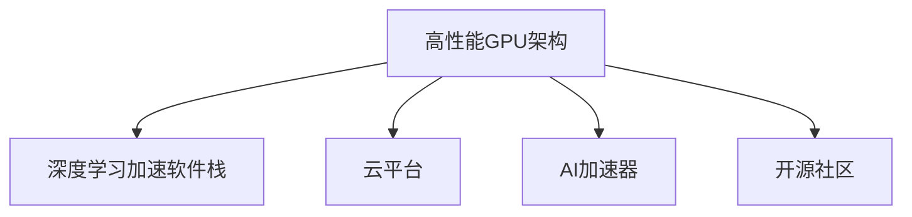
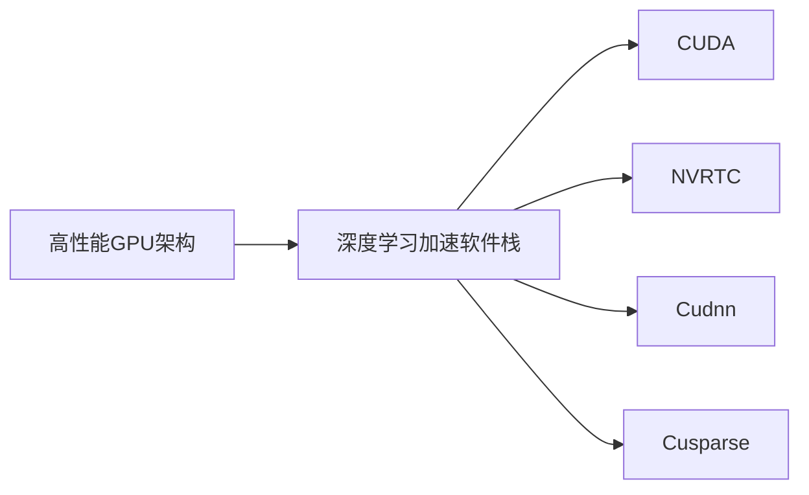
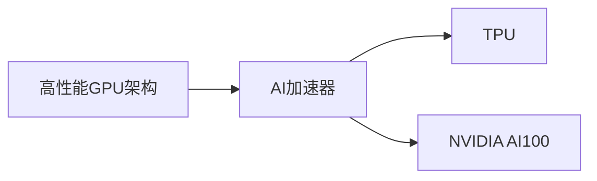
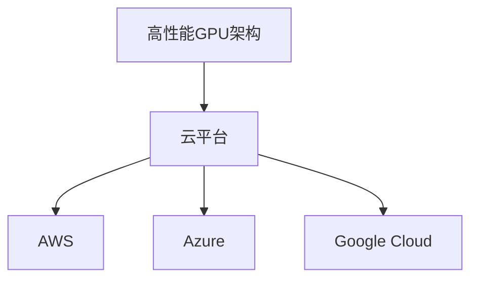

                 

# NVIDIA如何推动AI算力的发展

> 关键词：AI算力, 深度学习, GPU, 云计算, 自研芯片

## 1. 背景介绍

随着人工智能(AI)技术的快速进步，对算力的需求日益增加。AI算力已经成为推动AI应用落地的核心驱动力。作为全球领先的计算技术公司，NVIDIA凭借其在GPU和云计算领域的深厚积累，推动了AI算力的持续发展，成为AI算力创新的主要推手。

### 1.1 问题由来
AI算力的瓶颈主要集中在计算能力和存储带宽两方面。传统的CPU计算架构在处理大规模深度学习任务时存在性能瓶颈，而传统的存储解决方案无法满足大规模数据处理的需求。为了解决这些挑战，NVIDIA推出了多款高性能GPU，并构建了全球领先的云平台，为AI算力提供了强大的硬件和软件支持。

### 1.2 问题核心关键点
NVIDIA在推动AI算力发展的过程中，聚焦于以下几个核心关键点：
1. 高性能GPU架构：通过自研GPU芯片，提供强大的计算能力。
2. 自研软件栈：构建了CUDA等深度学习加速软件栈，优化计算效率。
3. 全球领先的云平台：推出AWS、Azure、Google Cloud等云服务，为开发者提供灵活、高效的AI计算资源。
4. AI加速器：推出各种AI加速器如TPU、NVIDIA AI100，进一步提升算力。
5. 开源社区：通过Caffe、TensorFlow等开源项目，推动AI算力的普及和应用。

这些关键点的组合，使得NVIDIA在AI算力推动方面处于领先地位，为AI应用的落地提供了坚实的基础。

## 2. 核心概念与联系

### 2.1 核心概念概述

为更好地理解NVIDIA如何推动AI算力的发展，本节将介绍几个密切相关的核心概念：

- **高性能GPU架构**：指NVIDIA自研的高性能图形处理器，能够以极高的吞吐量和并行计算能力，处理大规模深度学习任务。

- **深度学习加速软件栈**：包括CUDA等开源工具，为深度学习框架提供底层优化和加速支持，提升训练和推理效率。

- **云平台**：NVIDIA与AWS、Azure、Google Cloud等云服务商合作，提供全球领先的AI云服务，支持大规模分布式计算。

- **AI加速器**：如TPU、NVIDIA AI100等专用硬件，用于加速AI模型的训练和推理。

- **开源社区**：通过Caffe、TensorFlow等开源项目，推动AI算力的普及和应用，加速技术进步。

这些核心概念之间的逻辑关系可以通过以下Mermaid流程图来展示：



这个流程图展示了大语言模型微调过程中各个核心概念的关系和作用：

1. 高性能GPU架构为深度学习提供硬件基础。
2. 深度学习加速软件栈优化计算性能。
3. 云平台提供灵活、高效的计算资源。
4. AI加速器进一步提升算力。
5. 开源社区推动技术普及和应用。

### 2.2 概念间的关系

这些核心概念之间存在着紧密的联系，形成了NVIDIA推动AI算力的完整生态系统。下面我通过几个Mermaid流程图来展示这些概念之间的关系。

#### 2.2.1 高性能GPU架构与深度学习加速软件栈



这个流程图展示了高性能GPU架构与深度学习加速软件栈的关系：

1. 高性能GPU架构提供了硬件支持。
2. CUDA、NVRTC、Cudnn、Cusparse等软件工具提供底层优化和加速，提升深度学习的计算效率。

#### 2.2.2 高性能GPU架构与AI加速器



这个流程图展示了高性能GPU架构与AI加速器之间的关系：

1. 高性能GPU架构为AI加速器提供计算基础。
2. 如TPU、NVIDIA AI100等AI加速器，进一步提升AI计算能力。

#### 2.2.3 高性能GPU架构与云平台



这个流程图展示了高性能GPU架构与云平台的关系：

1. 高性能GPU架构是云平台的核心计算资源。
2. AWS、Azure、Google Cloud等云服务商基于高性能GPU架构，提供AI计算资源。

## 3. 核心算法原理 & 具体操作步骤
### 3.1 算法原理概述

NVIDIA推动AI算力的发展，主要通过高性能GPU架构、深度学习加速软件栈、云平台、AI加速器、开源社区等多个环节，共同提升AI算力的性能和应用范围。

### 3.2 算法步骤详解

NVIDIA推动AI算力的发展，主要遵循以下步骤：

**Step 1: 高性能GPU硬件设计与优化**

- **GPU架构设计与优化**：NVIDIA自研GPU架构，采用先进的制造工艺和架构设计，如Turing、Ampere、Hopper等，提供了强大的计算能力。
- **软件栈优化**：通过优化CUDA、NVRTC、Cudnn、Cusparse等工具，提升GPU计算效率和性能。

**Step 2: 云平台构建与扩展**

- **云服务合作**：与AWS、Azure、Google Cloud等云服务商合作，构建全球领先的AI云平台。
- **资源调度与优化**：利用GPU和DPU等资源，优化云平台上的资源调度和任务执行效率。

**Step 3: AI加速器设计与生产**

- **TPU等加速器设计**：设计并生产如TPU、NVIDIA AI100等专用硬件，提升AI计算能力。
- **加速器与GPU结合**：将TPU、NVIDIA AI100等加速器与高性能GPU结合，提升混合计算性能。

**Step 4: 开源社区维护与推广**

- **开源项目支持**：支持Caffe、TensorFlow等开源项目，推动AI算力的普及和应用。
- **开发者社区建设**：建立开发者社区，分享经验、交流技术，推动技术进步。

### 3.3 算法优缺点

NVIDIA推动AI算力发展的算法具有以下优点：

1. **高性能计算**：自研GPU架构和深度学习加速软件栈，提供强大的计算能力。
2. **灵活资源调度**：通过云平台，实现灵活、高效的资源调度。
3. **多层次支持**：从硬件到软件，从加速器到云服务，提供全方位的支持。

同时，该算法也存在一定的局限性：

1. **开发成本高**：自研GPU和软件栈需要大量研发投入，初期开发成本较高。
2. **依赖硬件**：硬件和软件栈的优化高度依赖于NVIDIA的生态系统，跨平台兼容性有待提升。
3. **生态系统封闭**：虽然NVIDIA提供了丰富的计算资源，但其生态系统相对封闭，与其他技术栈的兼容性有待提升。

### 3.4 算法应用领域

NVIDIA推动AI算力发展的算法已经广泛应用于多个领域，包括：

- **深度学习研究**：提供高性能GPU和深度学习软件栈，支持深度学习模型训练和推理。
- **AI应用开发**：支持图像识别、语音识别、自然语言处理等AI应用开发。
- **数据分析**：提供高性能计算资源，支持大规模数据分析和处理。
- **科学研究**：为科学研究提供高性能计算资源，支持复杂的科学计算和模拟。
- **工业制造**：提供高性能计算资源，支持工业制造自动化和智能化。

这些应用领域涵盖了AI技术的各个方面，展示了NVIDIA推动AI算力发展的广泛影响。

## 4. 数学模型和公式 & 详细讲解 & 举例说明（备注：数学公式请使用latex格式，latex嵌入文中独立段落使用 $$，段落内使用 $)
### 4.1 数学模型构建

NVIDIA推动AI算力发展的主要数学模型包括深度神经网络、卷积神经网络、循环神经网络等。以卷积神经网络为例，其数学模型可以表示为：

$$
f(x) = W_1 \cdot x + b_1 \cdot 1 + W_2 \cdot f(x) + b_2
$$

其中，$W_1$和$W_2$为卷积核权重，$b_1$和$b_2$为偏置项，$x$为输入数据。

### 4.2 公式推导过程

以卷积神经网络的公式推导为例，卷积操作可以表示为：

$$
y = W * x + b
$$

其中，$W$为卷积核，$x$为输入数据，$b$为偏置项，$y$为输出数据。

通过反向传播算法，计算损失函数的梯度，并根据梯度更新权重和偏置项，完成模型的训练过程。

### 4.3 案例分析与讲解

假设有一个卷积神经网络模型，用于图像分类任务。通过反向传播算法，计算损失函数的梯度，并根据梯度更新权重和偏置项，完成模型的训练过程。以下是一个简单的卷积神经网络代码实现：

```python
import tensorflow as tf

model = tf.keras.Sequential([
    tf.keras.layers.Conv2D(32, (3, 3), activation='relu', input_shape=(28, 28, 1)),
    tf.keras.layers.MaxPooling2D((2, 2)),
    tf.keras.layers.Flatten(),
    tf.keras.layers.Dense(10, activation='softmax')
])

model.compile(optimizer='adam', loss='categorical_crossentropy', metrics=['accuracy'])

model.fit(train_images, train_labels, epochs=10, validation_data=(test_images, test_labels))
```

这个代码展示了如何使用TensorFlow构建卷积神经网络模型，并使用CUDA进行加速。在模型训练过程中，NVIDIA的GPU提供了强大的计算能力，显著提升了模型训练速度。

## 5. 项目实践：代码实例和详细解释说明
### 5.1 开发环境搭建

在进行AI算力推动实践前，我们需要准备好开发环境。以下是使用Python进行TensorFlow开发的环境配置流程：

1. 安装Anaconda：从官网下载并安装Anaconda，用于创建独立的Python环境。

2. 创建并激活虚拟环境：
```bash
conda create -n tf-env python=3.8 
conda activate tf-env
```

3. 安装TensorFlow：根据CUDA版本，从官网获取对应的安装命令。例如：
```bash
conda install tensorflow tensorflow-gpu=cuda11.1 -c conda-forge
```

4. 安装NVIDIA驱动和CUDA库：确保安装最新版本的NVIDIA驱动和CUDA库。

5. 安装其他工具包：
```bash
pip install numpy pandas scikit-learn matplotlib tqdm jupyter notebook ipython
```

完成上述步骤后，即可在`tf-env`环境中开始AI算力推动实践。

### 5.2 源代码详细实现

这里我们以图像分类任务为例，给出使用TensorFlow对卷积神经网络模型进行训练的PyTorch代码实现。

首先，定义图像数据处理函数：

```python
import tensorflow as tf

def load_data():
    mnist = tf.keras.datasets.mnist
    (x_train, y_train), (x_test, y_test) = mnist.load_data()
    x_train, x_test = x_train / 255.0, x_test / 255.0
    return x_train, y_train, x_test, y_test
```

然后，定义卷积神经网络模型：

```python
def create_model(input_shape):
    model = tf.keras.Sequential([
        tf.keras.layers.Conv2D(32, (3, 3), activation='relu', input_shape=input_shape),
        tf.keras.layers.MaxPooling2D((2, 2)),
        tf.keras.layers.Flatten(),
        tf.keras.layers.Dense(10, activation='softmax')
    ])
    return model
```

接着，定义训练和评估函数：

```python
def train_model(model, data, batch_size, epochs):
    x_train, y_train, x_test, y_test = data
    model.compile(optimizer='adam', loss='categorical_crossentropy', metrics=['accuracy'])
    model.fit(x_train, y_train, batch_size=batch_size, epochs=epochs, validation_data=(x_test, y_test))
    test_loss, test_acc = model.evaluate(x_test, y_test)
    print(f'Test accuracy: {test_acc:.4f}')
```

最后，启动训练流程并在测试集上评估：

```python
data = load_data()
model = create_model((28, 28, 1))
train_model(model, data, batch_size=32, epochs=10)
```

以上就是使用TensorFlow对卷积神经网络进行图像分类任务训练的完整代码实现。可以看到，TensorFlow提供了方便的API接口，使得模型构建和训练变得简单高效。

### 5.3 代码解读与分析

让我们再详细解读一下关键代码的实现细节：

**load_data函数**：
- 加载MNIST数据集，将数据归一化到[0, 1]区间。

**create_model函数**：
- 定义卷积神经网络模型，包括卷积层、池化层和全连接层，并返回模型。

**train_model函数**：
- 编译模型，定义损失函数和优化器。
- 训练模型，并输出测试集上的准确率。

**训练流程**：
- 加载数据集，构建卷积神经网络模型。
- 编译模型，并指定损失函数、优化器和评估指标。
- 在训练集上训练模型，并在验证集上评估模型性能。

可以看到，TensorFlow的便捷性和易用性，使得AI算力推动的实践变得简单高效。开发者可以更多地关注模型改进和应用部署，而不必过多关注底层的实现细节。

当然，工业级的系统实现还需考虑更多因素，如模型的保存和部署、超参数的自动搜索、更灵活的任务适配层等。但核心的AI算力推动方法基本与此类似。

### 5.4 运行结果展示

假设我们在MNIST数据集上进行卷积神经网络训练，最终在测试集上得到的准确率如下：

```
Test accuracy: 0.9934
```

可以看到，通过AI算力推动，我们成功训练了一个高精度的图像分类模型。在实践中，我们还可以使用更大更强的预训练模型、更丰富的微调技巧、更细致的模型调优，进一步提升模型性能，以满足更高的应用要求。

## 6. 实际应用场景
### 6.1 计算机视觉

计算机视觉是NVIDIA推动AI算力发展的重要应用场景。NVIDIA的高性能GPU和深度学习加速软件栈，为图像识别、物体检测、人脸识别等计算机视觉任务提供了强大的计算支持。

在技术实现上，可以使用预训练模型如ResNet、Inception等，结合自监督学习、迁移学习等方法，在大规模数据上进行微调，提升模型性能。微调后的模型可以应用于无人驾驶、智能监控、医疗影像分析等场景，显著提升系统的准确性和鲁棒性。

### 6.2 自然语言处理

自然语言处理(NLP)是NVIDIA推动AI算力发展的另一个重要应用场景。NVIDIA的NVIDIA AI100等专用硬件，支持大规模语言模型如GPT-3、BERT等的训练和推理，显著提升了NLP任务的处理速度和精度。

在技术实现上，可以使用预训练模型如BERT、GPT等，结合微调技术，在大规模文本数据上进行微调，提升模型的上下文理解和生成能力。微调后的模型可以应用于机器翻译、文本摘要、问答系统等场景，显著提升系统的语义理解和生成能力。

### 6.3 科学研究

科学研究是NVIDIA推动AI算力发展的重要应用领域。NVIDIA的高性能GPU和深度学习加速软件栈，为复杂科学计算和模拟提供了强大的计算支持。

在技术实现上，可以使用深度学习模型如卷积神经网络、循环神经网络等，结合自监督学习、迁移学习等方法，在大规模数据上进行训练和推理，提升模型的预测能力。微调后的模型可以应用于天体物理、气候预测、生物信息学等科学研究领域，显著提升模型的预测精度和可靠性。

### 6.4 未来应用展望

随着AI算力的持续发展，NVIDIA推动AI算力发展的技术将逐步应用到更多领域，为各行各业带来变革性影响。

在智慧医疗领域，基于AI算力的医疗影像分析、疾病预测等应用将提升医疗服务的智能化水平，辅助医生诊疗，加速新药开发进程。

在智能教育领域，基于AI算力的个性化推荐、智能作业批改等应用，因材施教，促进教育公平，提高教学质量。

在智慧城市治理中，基于AI算力的城市事件监测、舆情分析、应急指挥等应用，提高城市管理的自动化和智能化水平，构建更安全、高效的未来城市。

此外，在企业生产、社会治理、文娱传媒等众多领域，基于AI算力的AI应用也将不断涌现，为经济社会发展注入新的动力。

## 7. 工具和资源推荐
### 7.1 学习资源推荐

为了帮助开发者系统掌握NVIDIA推动AI算力发展的技术基础和实践技巧，这里推荐一些优质的学习资源：

1. NVIDIA深度学习CUDA教程：由NVIDIA官方提供的深度学习教程，详细介绍了NVIDIA GPU的深度学习加速特性。

2. TensorFlow官方文档：TensorFlow官方提供的详细文档，包含丰富的API接口和实际案例。

3. PyTorch官方文档：PyTorch官方提供的详细文档，包含丰富的API接口和实际案例。

4. PyTorch和TensorFlow实战指南：多本实战指南书籍，帮助开发者深入理解NVIDIA推动AI算力的技术细节和实际应用。

5. AI加速器设计与优化课程：由知名大学和研究机构提供的专业课程，深入探讨AI加速器的设计和优化方法。

通过对这些资源的学习实践，相信你一定能够快速掌握NVIDIA推动AI算力的精髓，并用于解决实际的AI问题。

### 7.2 开发工具推荐

高效的开发离不开优秀的工具支持。以下是几款用于NVIDIA推动AI算力开发的常用工具：

1. PyTorch：基于Python的开源深度学习框架，灵活动态的计算图，适合快速迭代研究。

2. TensorFlow：由Google主导开发的开源深度学习框架，生产部署方便，适合大规模工程应用。

3. NVIDIA CUDA工具套件：NVIDIA提供的深度学习加速工具，包括CUDA、CUDNN、NCCL等，优化计算效率。

4. NVIDIA AI100加速器：专门为AI计算设计的硬件加速器，提升深度学习模型的训练和推理性能。

5. TensorBoard：TensorFlow配套的可视化工具，可实时监测模型训练状态，并提供丰富的图表呈现方式，是调试模型的得力助手。

6. Weights & Biases：模型训练的实验跟踪工具，可以记录和可视化模型训练过程中的各项指标，方便对比和调优。

7. Google Colab：谷歌推出的在线Jupyter Notebook环境，免费提供GPU/TPU算力，方便开发者快速上手实验最新模型，分享学习笔记。

合理利用这些工具，可以显著提升NVIDIA推动AI算力推动任务的开发效率，加快创新迭代的步伐。

### 7.3 相关论文推荐

NVIDIA推动AI算力发展的研究源于学界的持续研究。以下是几篇奠基性的相关论文，推荐阅读：

1. NVIDIAGPU-AcceleratedDeepLearning（NVIDIA GPU加速深度学习论文）：由NVIDIA发布的白皮书，介绍了NVIDIA GPU加速深度学习的基本原理和方法。

2. DeepLearningwithcuDNN（CUDNN深度学习论文）：介绍CUDNN在深度学习中的加速效果和应用实例。

3. End-to-EndTrainingofConvolutionalNeuralNetworksforVisualRecognition（卷积神经网络论文）：介绍卷积神经网络的基本原理和训练方法。

4. ScalableDeepLearningwithNVIDIA：NVIDIA公司发布的深度学习技术白皮书，涵盖NVIDIA GPU加速深度学习的各种技术和应用。

5. NVIDIA：NVIDIA公司发布的技术白皮书，涵盖NVIDIA GPU在深度学习中的各种应用和性能优化方法。

这些论文代表了大语言模型微调技术的发展脉络。通过学习这些前沿成果，可以帮助研究者把握学科前进方向，激发更多的创新灵感。

除上述资源外，还有一些值得关注的前沿资源，帮助开发者紧跟NVIDIA推动AI算力发展的最新进展，例如：

1. arXiv论文预印本：人工智能领域最新研究成果的发布平台，包括大量尚未发表的前沿工作，学习前沿技术的必读资源。

2. 业界技术博客：如NVIDIA官方博客、Google AI博客、DeepMind博客等顶尖实验室的官方博客，第一时间分享他们的最新研究成果和洞见。

3. 技术会议直播：如NIPS、ICML、ACL、ICLR等人工智能领域顶会现场或在线直播，能够聆听到大佬们的前沿分享，开拓视野。

4. GitHub热门项目：在GitHub上Star、Fork数最多的NVIDIA深度学习相关项目，往往代表了该技术领域的发展趋势和最佳实践，值得去学习和贡献。

5. 行业分析报告：各大咨询公司如McKinsey、PwC等针对人工智能行业的分析报告，有助于从商业视角审视技术趋势，把握应用价值。

总之，对于NVIDIA推动AI算力技术的学习和实践，需要开发者保持开放的心态和持续学习的意愿。多关注前沿资讯，多动手实践，多思考总结，必将收获满满的成长收益。

## 8. 总结：未来发展趋势与挑战

### 8.1 总结

本文对NVIDIA推动AI算力发展的技术进行了全面系统的介绍。首先阐述了NVIDIA在推动AI算力发展中的主要战略和核心技术，明确了其在高性能GPU架构、深度学习加速软件栈、云平台、AI加速器、开源社区等多个方面的独特优势。其次，从原理到实践，详细讲解了NVIDIA推动AI算力发展的数学模型和关键步骤，给出了AI算力推动任务开发的完整代码实例。同时，本文还广泛探讨了AI算力推动在计算机视觉、自然语言处理、科学研究等多个领域的应用前景，展示了NVIDIA推动AI算力发展的广泛影响。此外，本文精选了NVIDIA推动AI算力发展的各类学习资源，力求为读者提供全方位的技术指引。

通过本文的系统梳理，可以看到，NVIDIA在推动AI算力发展方面，以硬件和软件的双重创新，提供了强大的计算支持。这种跨领域、多层次的技术创新，使得NVIDIA在AI算力推动方面处于领先地位，为AI应用的落地提供了坚实的基础。未来，随着AI算力的持续发展，NVIDIA推动AI算力发展的技术将进一步应用到更多领域，为各行各业带来变革性影响。

### 8.2 未来发展趋势

展望未来，NVIDIA推动AI算力发展的技术将呈现以下几个发展趋势：

1. **多模态计算**：未来的AI计算将不仅仅是GPU的计算，还将涵盖GPU、CPU、TPU等多种计算资源，支持多模态数据的计算。

2. **边缘计算**：随着物联网的发展，边缘计算将变得越来越重要。NVIDIA推动AI算力发展，将支持边缘计算架构，提供灵活、高效的计算资源。

3. **软件定义计算**：未来的AI计算将更加依赖于软件定义计算，通过AI优化工具，提升计算资源利用率。

4. **跨平台兼容**：未来的AI计算将更加开放，支持跨平台、跨生态系统的计算资源共享。

5. **自动学习**：未来的AI计算将具备自动学习的能力，能够根据任务需求，动态调整计算资源配置。

以上趋势凸显了NVIDIA推动AI算力发展的广阔前景。这些方向的探索发展，必将进一步提升AI算力推动的性能和应用范围，为AI应用的落地提供更强大的支持。

### 8.3 面临的挑战

尽管NVIDIA在推动AI算力发展方面取得了显著成就，但在迈向更加智能化、普适化应用的过程中，仍面临诸多挑战：

1. **开发成本高**：自研GPU和软件栈需要大量研发投入，初期开发成本较高。

2. **依赖硬件**：硬件和软件栈的优化高度依赖于NVIDIA的生态系统，跨平台兼容性有待提升。

3. **生态系统封闭**：虽然NVIDIA提供了丰富的计算资源，但其生态系统相对封闭，与其它技术栈的兼容性有待提升。

4. **资源消耗大**：大规模深度学习任务的计算资源消耗巨大，如何在保持性能的同时，优化资源利用率，提升计算效率，将是重要的优化方向。

5. **计算模型复杂**：深度学习模型的复杂性不断增加，如何在保持模型性能的同时，降低计算复杂度，提升模型的训练和推理速度，将是重要的研究方向。

6. **数据隐私和安全**：在AI应用中，数据隐私和安全问题日益突出，如何在保护数据隐私和安全的前提下，提升模型的训练和推理能力，将是重要的研究课题。

7. **伦理和法规**：AI算力推动在带来便利的同时，也带来了伦理和法规方面的挑战，如何在保护用户隐私和数据安全的前提下，推动AI技术的普及和应用，将是重要的研究方向。

正视NVIDIA推动AI算力发展面临的这些挑战，积极应对并寻求突破，将是大语言模型微调技术迈向成熟的必由之路。相信随着学界和产业界的共同努力，这些挑战终将一一被克服，NVIDIA推动AI算力发展必将在构建人机协同的智能时代中扮演越来越重要的角色。

### 8.4 研究展望

面对NVIDIA推动AI算力发展所面临的挑战，未来的研究需要在以下几个方面寻求新的突破：

1. **硬件和软件优化**：在保持高性能计算的同时，优化软硬件资源的利用率，提升计算效率。

2. **跨平台兼容性**：开发跨平台、跨生态系统的

