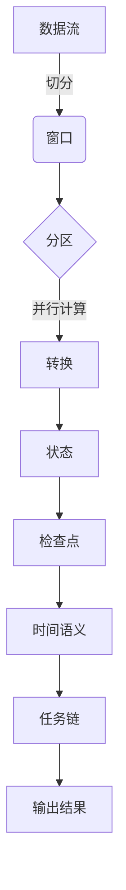

# Apache Flink

## 1. 背景介绍

### 1.1 问题的由来

在当今数据爆炸式增长的时代，传统的批处理系统已经无法满足实时数据处理的需求。随着物联网、社交媒体、电子商务等应用的兴起,海量的数据源源不断地产生,对实时数据处理和分析的需求越来越迫切。传统的批处理系统如Apache Hadoop MapReduce,虽然能够处理大规模数据,但无法实现低延迟的实时处理。因此,一种新型的大数据处理范式应运而生——流式数据处理(Stream Processing)。

### 1.2 研究现状

Apache Flink作为一种新兴的开源分布式流式数据处理框架,已经受到了广泛的关注和应用。它不仅能够实现准确一次(Exactly-Once)的状态一致性,还支持事件时间(Event Time)语义和窗口操作,可以满足各种复杂的实时数据处理需求。此外,Flink还具有高吞吐量、低延迟、高容错性和高可扩展性等优点,使其在实时数据处理领域占据重要地位。

### 1.3 研究意义

深入研究Apache Flink的核心概念、原理和实现细节,对于构建高性能、低延迟的实时数据处理管道至关重要。本文将全面剖析Flink的内部架构、执行模型、状态管理、容错机制等关键技术,并通过实践案例和代码示例,帮助读者掌握Flink的使用方法和最佳实践。同时,本文还将探讨Flink在不同应用场景下的实践经验,以及未来的发展趋势和挑战。

### 1.4 本文结构

本文将从以下几个方面全面介绍Apache Flink:

1. 背景介绍
2. 核心概念与联系
3. 核心算法原理与具体操作步骤
4. 数学模型和公式详细讲解与举例说明
5. 项目实践:代码实例和详细解释说明
6. 实际应用场景
7. 工具和资源推荐
8. 总结:未来发展趋势与挑战
9. 附录:常见问题与解答

## 2. 核心概念与联系

Apache Flink是一个分布式、有状态的流处理框架,它将流式计算与批处理统一到同一个运行时环境中。Flink的核心概念包括:

1. **流(Stream)**: Flink中的基本数据模型,可以是有界或无界的数据流。
2. **转换(Transformation)**: 对流进行各种转换操作,如过滤、映射、聚合等。
3. **分区(Partitioning)**: 将数据流分区到不同的任务实例上进行并行计算。
4. **窗口(Window)**: 对无限数据流进行切分,形成有限的数据集进行计算。
5. **状态(State)**: 维护计算过程中的中间结果,实现有状态的流处理。
6. **检查点(Checkpoint)**: 定期保存流处理的状态快照,用于容错恢复。
7. **时间语义(Time Semantics)**: 支持事件时间和处理时间两种时间概念。
8. **任务链(Task Chain)**: 将多个转换操作链接在一起,减少数据移动和序列化开销。

这些核心概念相互关联、相互作用,共同构建了Flink的流式处理模型。



## 3. 核心算法原理与具体操作步骤

### 3.1 算法原理概述

Apache Flink采用了基于流的执行模型,将无界数据流划分为有限的数据集(窗口),并对这些数据集进行并行计算。Flink的核心算法包括以下几个关键步骤:

1. **数据分区(Data Partitioning)**: 将输入数据流按照指定的分区策略(如Round-Robin、Hash等)划分到不同的任务实例上,实现并行计算。
2. **窗口操作(Window Operation)**: 对无界数据流进行切分,形成有限的数据集(窗口),作为计算的基本单位。Flink支持多种窗口类型,如滚动窗口、滑动窗口、会话窗口等。
3. **有状态计算(Stateful Computation)**: Flink支持有状态的流处理,可以维护计算过程中的中间结果,实现复杂的业务逻辑。状态可以存储在内存或者外部存储系统中。
4. **容错机制(Fault Tolerance)**: Flink通过定期生成检查点(Checkpoint),将计算状态持久化到外部存储系统,实现容错恢复。发生故障时,可以从最近的一致检查点恢复计算。
5. **任务链优化(Task Chain Optimization)**: Flink将多个转换操作链接在一起,形成任务链,减少数据移动和序列化开销,提高计算效率。

### 3.2 算法步骤详解

1. **数据分区**

   Flink支持多种分区策略,用于将数据流划分到不同的任务实例上进行并行计算。常用的分区策略包括:

   - **Rebalance**: 按照Round-Robin方式将数据均匀分配到各个分区上。
   - **Hash**: 根据指定的键对数据进行Hash分区。
   - **Rescale**: 根据上游分区的个数,重新平衡数据到下游分区。
   - **Broadcast**: 将数据广播到所有下游分区。
   - **Global**: 将所有数据发送到一个分区上进行计算。

2. **窗口操作**

   Flink支持多种窗口类型,用于将无界数据流切分为有限的数据集进行计算:

   - **滚动窗口(Tumbling Window)**: 固定大小的非重叠窗口,每个事件只属于一个窗口。
   - **滑动窗口(Sliding Window)**: 固定大小的重叠窗口,事件可能属于多个窗口。
   - **会话窗口(Session Window)**: 根据事件之间的活动间隔动态合并事件,适用于会话数据处理。
   - **全局窗口(Global Window)**: 将所有事件合并到一个全局窗口中进行计算。

   窗口操作通常与窗口函数(如sum、max、min等)结合使用,对窗口内的数据进行聚合计算。

3. **有状态计算**

   Flink支持有状态的流处理,可以维护计算过程中的中间结果。状态可以存储在内存或者外部存储系统中,如RocksDB。常见的有状态操作包括:

   - **KeyedState**: 基于键(Key)维护状态,适用于数据流的分组操作。
   - **OperatorState**: 维护整个算子的状态,不依赖于键。
   - **BroadcastState**: 将状态广播到所有下游任务实例。

   有状态计算可以实现复杂的业务逻辑,如数据去重、连续计算等。

4. **容错机制**

   Flink采用检查点(Checkpoint)机制实现容错恢复。检查点是系统在某个一致性点上的全局状态快照,包括算子状态、barrier等信息。Flink通过以下步骤实现容错:

   - **检查点生成**: 定期生成检查点,将状态持久化到外部存储系统(如HDFS、S3等)。
   - **故障恢复**: 发生故障时,从最近的一致检查点重新启动作业,恢复计算状态。
   - **端到端一致性**: Flink支持端到端的一致性语义,保证exactly-once的状态一致性。

5. **任务链优化**

   Flink将多个转换操作链接在一起,形成任务链,减少数据移动和序列化开销,提高计算效率。任务链的形成需要满足以下条件:

   - 操作之间没有重分区(Repartition)操作。
   - 操作之间没有阻塞(Blocking)操作,如窗口操作。
   - 操作之间没有有状态操作。

   任务链优化可以显著提高Flink的性能,尤其是对于计算密集型的作业。

### 3.3 算法优缺点

**优点**:

1. **准确一次(Exactly-Once)**: Flink支持端到端的准确一次语义,保证状态一致性。
2. **低延迟**: 基于流的执行模型,能够实现低延迟的实时数据处理。
3. **高吞吐量**: 通过任务链优化和高效的内存管理,Flink具有高吞吐量。
4. **高容错性**: 检查点机制和自动重启策略,提供了高容错性能。
5. **可扩展性强**: 基于分区和并行计算模型,Flink具有良好的水平扩展能力。

**缺点**:

1. **学习曲线陡峭**: Flink的概念和API相对复杂,需要一定的学习成本。
2. **内存开销大**: 有状态计算需要维护大量的中间状态,对内存有较高的需求。
3. **调优复杂**: 涉及多个参数的调优,需要一定的经验和实践。
4. **生态系统相对较小**: 相比Hadoop和Spark,Flink的生态系统规模较小。

### 3.4 算法应用领域

Apache Flink广泛应用于以下领域:

1. **实时数据分析**: 对实时数据流进行分析和处理,如网络日志分析、用户行为分析等。
2. **实时数据管道**: 构建实时数据处理管道,实现数据的实时采集、转换和加载。
3. **事件驱动应用**: 基于事件驱动的架构,实现复杂事件处理(CEP)等应用。
4. **机器学习**: Flink支持在流式数据上训练和部署机器学习模型。
5. **传统批处理**: 虽然Flink主打流式计算,但也可以用于批处理场景。

## 4. 数学模型和公式详细讲解与举例说明

在流式数据处理中,常常需要对数据进行聚合计算,如求和、计数、平均值等。这些操作通常可以用数学模型和公式来描述。

### 4.1 数学模型构建

假设有一个无界数据流 $S = \{x_1, x_2, x_3, \ldots\}$,我们需要对其进行滚动计数,即计算最近 $n$ 个元素的个数。我们可以构建如下数学模型:

$$
count(S, n) = \sum_{i=1}^{n} 1
$$

其中 $count(S, n)$ 表示最近 $n$ 个元素的个数。

对于滚动求和操作,我们可以构建如下数学模型:

$$
sum(S, n) = \sum_{i=1}^{n} x_i
$$

其中 $sum(S, n)$ 表示最近 $n$ 个元素的和。

### 4.2 公式推导过程

对于滚动平均值操作,我们可以基于上述求和公式推导出平均值公式:

$$
\begin{aligned}
avg(S, n) &= \frac{sum(S, n)}{count(S, n)} \
          &= \frac{\sum_{i=1}^{n} x_i}{\sum_{i=1}^{n} 1} \
          &= \frac{\sum_{i=1}^{n} x_i}{n}
\end{aligned}
$$

其中 $avg(S, n)$ 表示最近 $n$ 个元素的平均值。

### 4.3 案例分析与讲解

假设我们有一个实时的温度数据流,每个数据记录包含时间戳和温度值。我们需要计算最近 5 分钟内的平均温度。

首先,我们需要定义一个 5 分钟的滑动窗口:

```java
DataStream<SensorReading> temperatures = ...
DataStream<SensorReading> avgTemps = temperatures
    .keyBy(r -> r.id)
    .window(TumblingEventTimeWindows.of(Time.minutes(5)))
    .apply(new AvgTemperature());
```

其中 `AvgTemperature` 是一个自定义的窗口函数,用于计算窗口内温度值的平均值。

在 `AvgTemperature` 函数中,我们可以使用前面推导的平均值公式:

```java
public class AvgTemperature extends WindowFunction<SensorReading, Tuple3<String, Long, Double>, String, TimeWindow> {

    @Override
    public void apply(String key, TimeWindow window, Iterable<SensorReading> values, Collector<Tuple3<String, Long, Double>> out) {
        double sum = 0;
        int count =