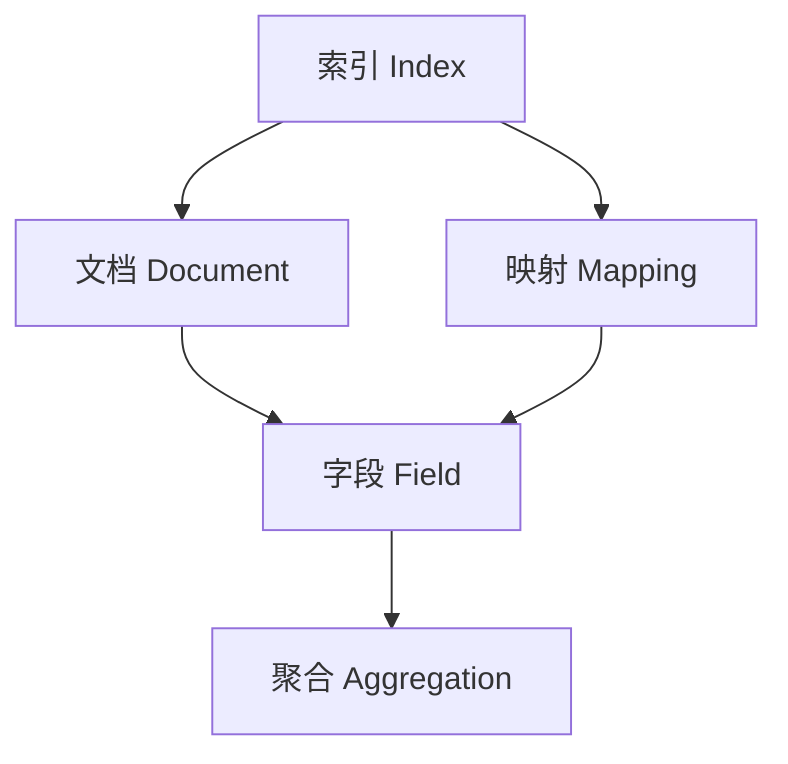
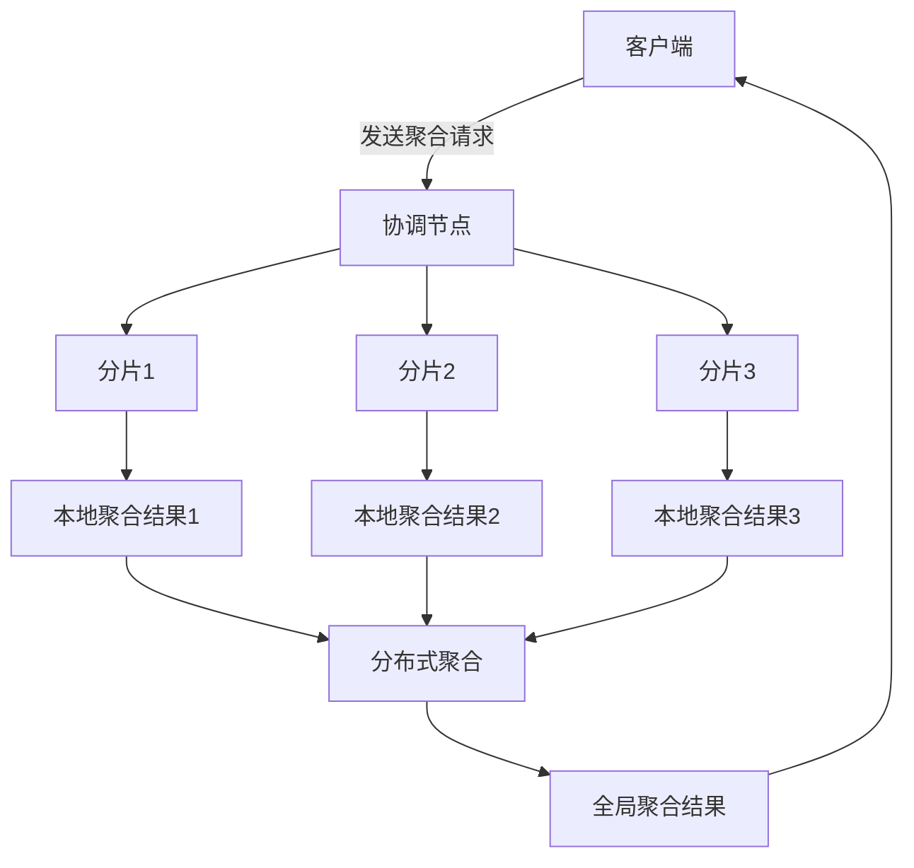

# ES聚合分析原理与代码实例讲解

## 1. 背景介绍

### 1.1 问题的由来

在当今大数据时代，海量数据的存储和分析成为了一个巨大的挑战。传统的关系型数据库在处理非结构化和半结构化数据时往往效率低下。为了解决这个问题,Elasticsearch(简称ES)作为一种分布式、RESTful 风格的搜索和数据分析引擎应运而生。

ES不仅提供了强大的全文搜索功能,还支持对数据进行实时的聚合分析。聚合分析是数据挖掘和商业智能领域的一个重要概念,它能够从海量数据中发现隐藏的模式、趋势和统计信息,为企业的决策提供有价值的洞见。

### 1.2 研究现状

目前,ES的聚合分析功能已经被广泛应用于各个领域,例如日志分析、网络安全监控、电子商务用户行为分析等。不同于传统的SQL聚合,ES的聚合分析具有更高的性能和更丰富的功能。它支持各种类型的聚合,如桶(bucket)聚合、指标(metric)聚合、管道(pipeline)聚合等,能够满足复杂的数据分析需求。

### 1.3 研究意义

深入理解ES聚合分析的原理和实现方式,对于提高数据分析效率、发现数据价值至关重要。本文将系统地介绍ES聚合分析的核心概念、算法原理、数学模型、代码实现和实际应用场景,为读者提供一个全面的学习和参考资料。

### 1.4 本文结构

本文共分为9个部分:

1. 背景介绍
2. 核心概念与联系
3. 核心算法原理与具体操作步骤
4. 数学模型和公式详细讲解与举例说明
5. 项目实践:代码实例和详细解释说明
6. 实际应用场景
7. 工具和资源推荐
8. 总结:未来发展趋势与挑战
9. 附录:常见问题与解答

## 2. 核心概念与联系

在深入探讨ES聚合分析的原理之前,我们需要先了解一些核心概念及其之间的关联。

### 2.1 文档(Document)

ES是一种分布式文档存储系统,它的基本数据单元就是文档(Document)。每个文档都是一个JSON对象,由多个字段(Field)组成。例如,一个产品文档可能包含"名称"、"描述"、"价格"等字段。

### 2.2 索引(Index)

索引是ES中的一个逻辑数据空间,用于存储相关的文档。一个索引可以被further划分为多个分片(Shard),以实现水平扩展和高可用性。

### 2.3 映射(Mapping)

映射定义了索引中文档的结构,包括字段的数据类型、分词规则等。合理的映射设计对于提高搜索和聚合性能至关重要。

### 2.4 聚合(Aggregation)

聚合是ES中用于对数据进行统计分析的核心功能。它可以对文档集合中的数据进行各种统计操作,如求和、平均值、最大/最小值等。聚合分为四种类型:

1. **桶(Bucket)聚合**: 用于对文档进行分组,如按照某个字段的值进行分组。
2. **指标(Metric)聚合**: 用于对文档字段进行统计计算,如求和、平均值等。
3. **矩阵(Matrix)聚合**: 基于其他聚合的结果进行运算和建模。
4. **管道(Pipeline)聚合**: 对其他聚合的输出结果进行进一步转换。

### 2.5 关联关系

上述核心概念之间的关联关系如下所示:

- 索引包含多个文档,每个文档由多个字段组成。
- 映射定义了索引中文档的结构,即字段的数据类型等。
- 聚合是基于文档字段进行的统计分析操作。

了解这些核心概念及其关联,有助于我们更好地理解ES聚合分析的工作原理。

## 3. 核心算法原理与具体操作步骤

### 3.1 算法原理概述

ES聚合分析的核心算法原理是基于数据分片(Shard)级别的本地聚合和集群级别的分布式聚合相结合。具体过程如下:

1. **本地聚合(Local Aggregation)**: 每个数据分片上的数据都会进行本地聚合操作,生成本地聚合结果。
2. **分布式聚合(Distributed Aggregation)**: 将所有分片的本地聚合结果进行合并,得到全局聚合结果。

这种两阶段聚合算法能够充分利用ES的分布式架构,提高聚合性能和可扩展性。

### 3.2 算法步骤详解

1. **客户端发送聚合请求**

   客户端向ES集群发送聚合请求,指定要进行聚合分析的索引、查询条件和聚合类型等。

2. **协调节点分发请求**

   接收到聚合请求的节点被称为协调节点。它将请求分发给索引的所有相关分片。

3. **分片进行本地聚合**

   每个分片都会根据请求中的查询条件,从本地分片数据中筛选出符合条件的文档,并对这些文档进行本地聚合操作。本地聚合的结果是一个聚合响应对象。

4. **分布式聚合合并结果**

   协调节点会收集所有分片的本地聚合响应对象,并对它们进行合并,生成全局聚合结果。

5. **返回全局聚合结果**

   最终,协调节点将全局聚合结果返回给客户端。

这种分布式聚合算法充分利用了ES的分布式架构,每个分片只需要处理本地数据的一部分,从而提高了聚合性能和可扩展性。

### 3.3 算法优缺点

**优点**:

- **高性能**: 由于聚合操作是在分片级别并行执行的,因此能够充分利用集群的计算资源,提高聚合性能。
- **可扩展性强**: 随着数据量的增加,只需要增加更多的节点和分片,就可以线性扩展聚合能力。
- **容错性好**: 即使某些分片或节点出现故障,也不会影响整个聚合过程,只会导致部分数据缺失。

**缺点**:

- **网络开销**: 分布式聚合需要在节点之间传输本地聚合结果,会产生一定的网络开销。
- **内存消耗**: 聚合操作需要在内存中缓存中间结果,对内存的消耗较大。
- **实时性差**: 由于需要在多个节点上进行聚合计算,实时性会比单机系统差一些。

### 3.4 算法应用领域

ES聚合分析算法可以广泛应用于以下领域:

- **日志分析**: 对服务器日志进行聚合分析,发现异常模式、性能瓶颈等。
- **网络安全监控**: 对网络流量数据进行聚合分析,发现潜在的安全威胁。
- **电子商务用户行为分析**: 对用户浏览、购买记录进行聚合分析,发现用户偏好和购买模式。
- **物联网数据分析**: 对传感器采集的海量数据进行聚合分析,发现隐藏的规律和趋势。
- **商业智能(BI)**: 对企业数据进行多维度的聚合分析,为决策提供数据支持。

总的来说,ES聚合分析算法在大数据分析、商业智能等领域具有广泛的应用前景。

## 4. 数学模型和公式详细讲解与举例说明

在ES中,聚合分析涉及到一些数学模型和公式,下面我们将对其进行详细讲解和举例说明。

### 4.1 数学模型构建

ES聚合分析的数学模型是基于集合论和代数运算构建的。我们将文档集合表示为$D=\{d_1, d_2, \ldots, d_n\}$,其中$d_i$表示第$i$个文档。

对于指标聚合,我们定义了一个聚合函数$f$,它将文档集合$D$映射到一个标量值:

$$f: \mathcal{P}(D) \rightarrow \mathbb{R}$$

其中,$\mathcal{P}(D)$表示$D$的幂集,即$D$的所有子集。常见的指标聚合函数包括:

- $\operatorname{sum}(D) = \sum_{d \in D} v(d)$,计算文档字段值的总和。
- $\operatorname{avg}(D) = \frac{1}{|D|}\sum_{d \in D} v(d)$,计算文档字段值的平均值。
- $\operatorname{max}(D) = \max\limits_{d \in D} v(d)$,计算文档字段值的最大值。
- $\operatorname{min}(D) = \min\limits_{d \in D} v(d)$,计算文档字段值的最小值。

这里,$v(d)$表示文档$d$中某个字段的值。

对于桶聚合,我们定义了一个分组函数$g$,它将文档集合$D$划分为若干个不相交的子集(桶):

$$g: D \rightarrow \{B_1, B_2, \ldots, B_m\}$$

其中,$B_i$是第$i$个桶,满足$\bigcup\limits_{i=1}^m B_i = D$且$B_i \cap B_j = \emptyset(i \neq j)$。常见的分组函数包括:

- 按照字段值进行分组: $g(d) = v(d)$
- 按照日期区间进行分组: $g(d) = \lfloor\frac{t(d)}{k}\rfloor$,其中$t(d)$是文档的时间戳,$k$是时间间隔。

通过组合指标聚合函数$f$和分组函数$g$,我们可以实现复杂的聚合分析,例如:

$$\operatorname{sum}(B_i) = \sum_{d \in B_i} v(d)$$

计算每个桶中文档字段值的总和。

### 4.2 公式推导过程

下面我们将推导一个常见的聚合分析公式:计算文档集合$D$中某个字段值的方差(variance)。

方差的定义为:

$$\operatorname{var}(D) = \frac{1}{|D|}\sum_{d \in D}\left(v(d) - \operatorname{avg}(D)\right)^2$$

将$\operatorname{avg}(D)$代入,我们得到:

$$\begin{aligned}
\operatorname{var}(D) &= \frac{1}{|D|}\sum_{d \in D}\left(v(d) - \frac{1}{|D|}\sum_{d' \in D}v(d')\right)^2\
&= \frac{1}{|D|}\sum_{d \in D}\left(v(d)^2 - \frac{2v(d)}{|D|}\sum_{d' \in D}v(d') + \frac{1}{|D|^2}\left(\sum_{d' \in D}v(d')\right)^2\right)\
&= \frac{1}{|D|}\left(\sum_{d \in D}v(d)^2 - \frac{2}{|D|}\left(\sum_{d \in D}v(d)\right)^2 + \frac{1}{|D|}\left(\sum_{d \in D}v(d)\right)^2\right)\
&= \frac{1}{|D|}\sum_{d \in D}v(d)^2 - \frac{1}{|D|}\left(\frac{1}{|D|}\sum_{d \in D}v(d)\right)^2
\end{aligned}$$

令$M_1 = \sum_{d \in D}v(d)$,$M_2 = \sum_{d \in D}v(d)^2$,我们可以得到一个等价的公式:

$$\operatorname{var}(D) = \frac{M_2}{|