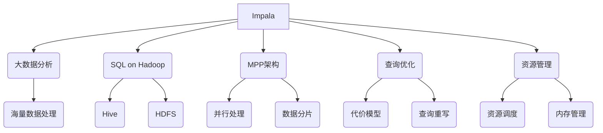
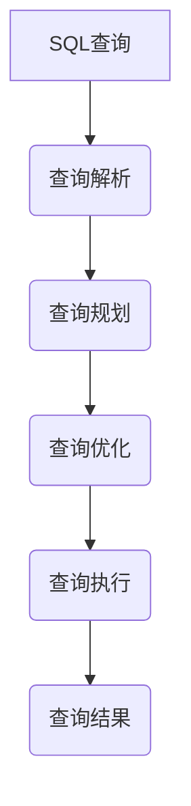

# Impala原理与代码实例讲解

## 1. 背景介绍

### 1.1 问题的由来

在大数据时代,海量数据的存储和查询成为了一个巨大的挑战。传统的数据库系统在处理大规模数据集时,往往会遇到性能瓶颈和可扩展性问题。为了解决这一难题,Apache Impala应运而生。

Impala是一种开源的大规模并行处理(MPP)SQL查询引擎,专为大数据分析而设计。它建立在Apache Hadoop之上,能够高效地查询存储在Hadoop分布式文件系统(HDFS)或Amazon S3等云存储中的海量数据。

### 1.2 研究现状

目前,Impala已经成为大数据分析领域中一个非常重要的组件。它凭借出色的查询性能、低延迟和高吞吐量,在行业内获得了广泛应用。许多知名公司如Cloudera、Amazon Web Services(AWS)等都在其产品和服务中集成了Impala。

然而,Impala的内部原理并不是一个黑盒子。透过表象,深入理解其底层架构、查询执行流程和优化策略,对于充分利用Impala的强大功能至关重要。只有掌握了这些核心知识,我们才能更好地应对实际场景中的挑战,并为大数据分析系统的构建和优化提供指导。

### 1.3 研究意义

本文将深入探讨Impala的核心原理,剖析其查询执行流程,并通过代码实例加以说明。通过对Impala的全面解析,读者将获得以下收获:

1. 理解Impala的整体架构设计,掌握其在大数据生态系统中的定位。
2. 掌握Impala查询执行的关键流程,了解其查询优化和资源管理策略。
3. 学习Impala的数据模型和查询语言,熟悉SQL on Hadoop的实现方式。
4. 通过代码实例,加深对Impala内部实现的理解,为自身开发和优化工作做好准备。
5. 把握Impala的发展趋势,探讨其在大数据分析领域的未来应用前景。

### 1.4 本文结构

本文共分为9个部分,内容安排如下:

1. 背景介绍
2. 核心概念与联系
3. 核心算法原理与具体操作步骤
4. 数学模型和公式详细讲解与举例说明
5. 项目实践:代码实例和详细解释说明
6. 实际应用场景
7. 工具和资源推荐
8. 总结:未来发展趋势与挑战
9. 附录:常见问题与解答

## 2. 核心概念与联系

在深入探讨Impala的原理之前,我们需要先了解一些核心概念及它们之间的联系。这些概念构成了Impala的理论基础,对于全面把握Impala至关重要。

1. **大数据分析(Big Data Analytics)**: Impala的设计目标是为了高效处理大规模数据集,支持各种分析查询和商业智能应用。
2. **SQL on Hadoop**: Impala实现了在Hadoop生态系统上运行SQL查询的能力,使用户能够使用熟悉的SQL语言来分析存储在HDFS等分布式文件系统中的结构化和半结构化数据。
3. **大规模并行处理(MPP)架构**: Impala采用了MPP架构,能够在多个节点上并行执行查询,从而实现高吞吐量和低延迟。
4. **查询优化**: Impala内置了多种查询优化策略,包括代价模型、查询重写等,以提高查询执行效率。
5. **资源管理**: Impala拥有高效的资源管理机制,能够动态调度和分配计算资源,确保查询的高效运行。

上述核心概念相互关联、环环相扣,共同构成了Impala的理论基础和技术支撑。只有将这些概念牢牢掌握,我们才能真正领会Impala的精髓所在。

## 3. 核心算法原理与具体操作步骤

### 3.1 算法原理概述

Impala的查询执行过程涉及多个核心算法,包括查询解析、查询规划、查询优化和查询执行等环节。这些算法共同保证了Impala能够高效地处理大规模数据查询。

1. **查询解析(Query Parsing)**: 将SQL查询语句解析为抽象语法树(Abstract Syntax Tree, AST),作为查询处理的起点。
2. **查询规划(Query Planning)**: 根据AST生成逻辑查询计划,描述如何执行查询。
3. **查询优化(Query Optimization)**: 对逻辑查询计划进行优化,生成高效的物理查询计划。
4. **查询执行(Query Execution)**: 在Impala的MPP架构下并行执行物理查询计划,获取查询结果。

### 3.2 算法步骤详解

#### 3.2.1 查询解析

查询解析是Impala查询执行的第一步,主要包括以下几个阶段:

1. **词法分析(Lexical Analysis)**: 将SQL查询语句拆分为一个个有意义的单词(token)。
2. **语法分析(Syntax Analysis)**: 根据SQL语法规则,将单词序列构建成抽象语法树(AST)。
3. **语义分析(Semantic Analysis)**: 对AST进行语义检查,解析表名、列名等对象引用,检查数据类型兼容性等。

经过上述步骤,Impala就能够将SQL查询转化为内部表示的AST,为后续的查询处理做好准备。

#### 3.2.2 查询规划

查询规划的目标是根据AST生成一个逻辑查询计划,描述如何执行查询。主要步骤包括:

1. **查询重写(Query Rewriting)**: 对AST进行等价变换,如谓词下推、投影剪裁等,以优化查询执行效率。
2. **逻辑计划生成(Logical Plan Generation)**: 遍历重写后的AST,构建逻辑查询计划树。
3. **代价估算(Cost Estimation)**: 为逻辑计划中的每个算子估算执行代价,为后续优化做准备。

生成的逻辑查询计划是一个高度抽象的表示,描述了查询的基本执行策略,但尚未考虑具体的物理执行方式。

#### 3.2.3 查询优化

查询优化的目的是基于逻辑查询计划,生成一个高效的物理查询计划。主要包括以下步骤:

1. **探索空间(Exploration Space)**: 根据优化规则,为逻辑计划生成多个物理计划候选方案。
2. **代价模型(Cost Model)**: 使用代价模型评估每个物理计划的执行代价。
3. **选择最优计划(Plan Selection)**: 根据代价估算结果,选择执行代价最小的物理计划作为最终执行计划。

Impala采用基于代价的查询优化策略,通过探索不同的执行方案并评估它们的代价,从而选择出最优的物理查询计划。

#### 3.2.4 查询执行

最后,Impala将执行由查询优化阶段生成的物理查询计划。查询执行的主要步骤如下:

1. **任务分发(Task Dispatch)**: 将物理计划分解为多个执行单元(执行计划片段),分发到不同的执行节点上。
2. **并行执行(Parallel Execution)**: 各执行节点并行执行分配到的计划片段,处理对应的数据分区。
3. **数据洗牌(Data Shuffling)**: 执行诸如Join、Aggregation等需要数据重分布的算子。
4. **中间结果合并(Intermediate Result Merge)**: 合并各执行节点产生的中间结果,生成最终查询结果。

Impala采用无共享架构,通过将计算任务分发到多个执行节点并行执行,实现了高吞吐量和低延迟的查询处理能力。

### 3.3 算法优缺点

Impala的查询执行算法具有以下优点:

1. **高效并行**: 采用MPP架构,能够充分利用集群资源进行并行计算,提高查询吞吐量。
2. **低延迟**: 通过查询优化和高效的执行引擎,Impala能够以较低的延迟响应查询。
3. **成本优化**: 基于代价模型的查询优化策略,能够选择执行代价最小的物理计划。
4. **SQL友好**: 支持标准SQL语法,降低了用户的学习成本。

但同时,Impala的算法也存在一些不足:

1. **更新支持有限**: 目前Impala主要面向分析查询场景,对于数据更新操作的支持较为有限。
2. **资源隔离性较差**: Impala缺乏对查询的资源预留和隔离机制,可能导致资源抢占问题。
3. **优化空间有限**: 目前Impala的查询优化策略仍有一定局限性,在特定场景下可能无法生成最优执行计划。

### 3.4 算法应用领域

Impala的查询执行算法主要应用于以下几个领域:

1. **交互式分析**: 由于Impala具有低延迟的特点,非常适合用于交互式的数据探索和分析查询。
2. **批量数据处理**: Impala也可以用于批量数据处理任务,如ETL、报表生成等,充分利用其高吞吐量的优势。
3. **实时数据分析**: 结合实时数据摄入工具(如Kafka),Impala能够对近实时数据进行低延迟分析。
4. **机器学习特征工程**: Impala可用于高效地从海量数据中提取特征,为机器学习模型训练做准备。

总的来说,Impala的查询执行算法使其成为大数据分析领域中一个非常重要的工具,在多个应用场景中发挥着关键作用。

## 4. 数学模型和公式详细讲解与举例说明

在Impala的查询执行过程中,涉及多种数学模型和公式,用于估算查询代价、优化查询执行计划等。本节将对其中几个核心模型进行详细讲解,并结合实例加以说明。

### 4.1 数学模型构建

#### 4.1.1 代价模型

代价模型是Impala查询优化的核心部分,用于评估不同物理执行计划的代价,从而选择最优计划。Impala的代价模型主要考虑以下几个因素:

- **I/O代价**: 读取数据所需的I/O开销,包括本地I/O和远程I/O。
- **CPU代价**: 执行查询所需的CPU计算开销。
- **内存代价**: 执行查询所需的内存消耗。
- **网络代价**: 执行查询所需的网络数据传输开销。

Impala的代价模型由多个子模型组成,分别对应不同的查询算子。以TableScan算子为例,其代价模型可表示为:

$$
Cost(TableScan) = \sum\limits_{i=1}^{n}(\alpha_i \times I/O_{cost_i} + \beta_i \times CPU_{cost_i})
$$

其中:
- $n$表示数据块数量
- $I/O_{cost_i}$表示读取第$i$个数据块的I/O代价
- $CPU_{cost_i}$表示处理第$i$个数据块的CPU代价
- $\alpha_i$和$\beta_i$分别为I/O代价和CPU代价的权重系数

通过对各种代价因素进行建模和量化,Impala能够比较不同执行计划的代价大小,从而选择最优计划。

#### 4.1.2 数据统计模型

为了准确估算查询代价,Impala需要获取表和列的数据统计信息,如行数、数据大小、数据分布等。这些统计信息对于评估查询过滤条件的选择性、估算中间结果大小等至关重要。

Impala采用基