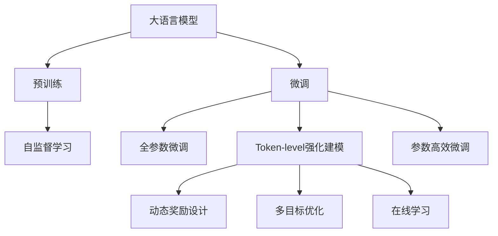
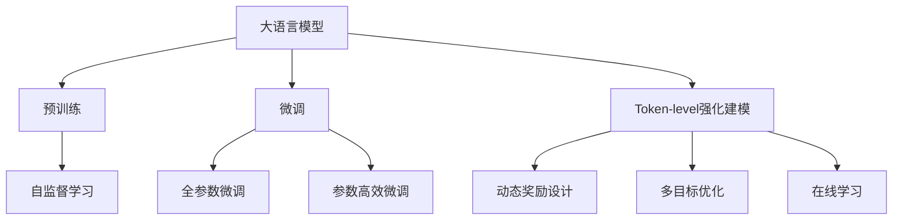
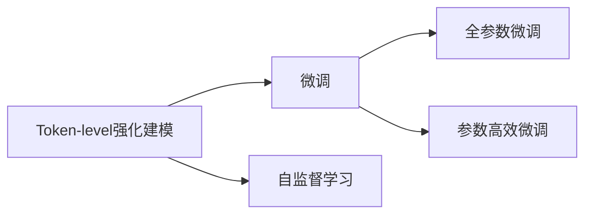
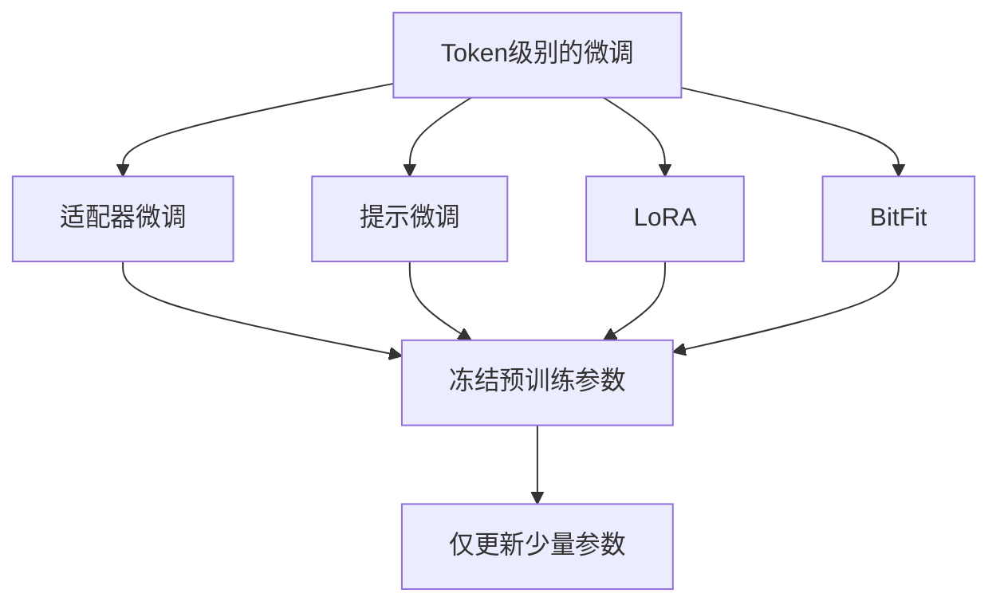

                 

# 大语言模型原理与工程实践：Token-level 强化建模

> 关键词：大语言模型, 强化学习, 强化建模, 自然语言处理(NLP), 深度学习, 深度强化学习

## 1. 背景介绍

### 1.1 问题由来
近年来，深度学习和大规模预训练模型在自然语言处理(NLP)领域取得了显著的进展。其中，BERT、GPT-3等大语言模型通过在大规模无标签文本数据上进行预训练，学习到丰富的语言知识和常识，展示了强大的语言理解和生成能力。尽管如此，这些模型在面对特定领域的任务时，仍然表现出一定的局限性。这主要是由于预训练模型无法直接适应特定任务的需要，无法充分利用任务特定的数据分布特征。

为了克服这一问题，研究者们提出了一种新的微调方法，即Token-level强化建模。该方法通过强化学习算法对预训练模型进行微调，使其能够更好地适应特定任务的输入输出特征，从而在有限的标注数据下实现更好的性能。这种方法在大规模语言模型上的应用，不仅可以提高模型的泛化能力和性能，还可以降低对标注数据的需求，提高模型训练和推理的效率。

### 1.2 问题核心关键点
Token-level强化建模的核心在于通过强化学习算法，对预训练模型的权重进行微调，使其能够更好地适应特定任务的输入输出特征。这种方法的主要特点包括：

1. **强化学习框架**：在Token-level强化建模中，预训练模型被视为一个智能体，通过与环境的交互，逐步学习如何优化特定任务的输入输出特征。

2. **强化学习奖励机制**：在微调过程中，通过设计适当的奖励机制，指导模型逐步优化其预测结果。

3. **Token级别的微调**：与传统的全参数微调不同，Token-level强化建模主要在模型的token级别进行微调，从而提高微调的效率和效果。

4. **泛化能力提升**：通过Token-level强化建模，模型可以在有限的数据下，学习到更泛化的语言表示，从而提高其在新任务上的表现。

5. **低标注数据需求**：Token-level强化建模对于标注数据的需求较低，适用于各种数据量较小或标注数据较难获取的任务。

### 1.3 问题研究意义
Token-level强化建模在NLP领域的广泛应用，对于拓展大语言模型的应用范围，提升下游任务的性能，加速NLP技术的产业化进程，具有重要意义：

1. **提高模型泛化能力**：通过Token-level强化建模，模型可以更好地学习到特定任务的输入输出特征，从而提高其泛化能力和在新任务上的表现。

2. **降低标注成本**：Token-level强化建模对于标注数据的需求较低，可以在有限的数据下进行微调，减少对标注数据的需求和获取成本。

3. **提高微调效率**：通过在token级别进行微调，Token-level强化建模可以显著提高微调效率，减少不必要的计算资源消耗。

4. **优化模型结构**：Token-level强化建模可以帮助优化模型结构，使其在特定任务上更具适应性和鲁棒性。

5. **创新研究范式**：Token-level强化建模为NLP领域的研究提供了新的范式，推动了深度强化学习和大语言模型的进一步发展。

## 2. 核心概念与联系

### 2.1 核心概念概述

为更好地理解Token-level强化建模方法，本节将介绍几个密切相关的核心概念：

- **大语言模型(Large Language Model, LLM)**：以自回归(如GPT)或自编码(如BERT)模型为代表的大规模预训练语言模型。通过在大规模无标签文本语料上进行预训练，学习通用的语言表示，具备强大的语言理解和生成能力。

- **预训练(Pre-training)**：指在大规模无标签文本语料上，通过自监督学习任务训练通用语言模型的过程。常见的预训练任务包括言语建模、遮挡语言模型等。

- **微调(Fine-tuning)**：指在预训练模型的基础上，使用下游任务的少量标注数据，通过有监督学习优化模型在该任务上的性能。通常只需要调整顶层分类器或解码器，并以较小的学习率更新全部或部分的模型参数。

- **强化学习(Reinforcement Learning)**：一种基于奖励信号的机器学习框架，通过智能体与环境的交互，逐步学习最优策略以实现某个目标。

- **强化建模(Reinforcement Learning-based Modeling)**：将强化学习应用于模型训练和优化的方法，通过设计适当的奖励机制，引导模型优化特定任务的输入输出特征。

- **Token级别的微调(Parameter-Efficient Fine-Tuning, PEFT)**：指在微调过程中，只更新少量的模型参数，而固定大部分预训练权重不变，以提高微调效率，避免过拟合的方法。

- **动态奖励设计(Dynamic Reward Design)**：根据模型的预测结果和任务目标，动态设计奖励机制，以引导模型逐步优化。

- **多目标优化(Multi-Objective Optimization)**：在微调过程中，同时考虑多个目标，如准确率、召回率、速度等，优化模型性能。

- **在线学习(Online Learning)**：在微调过程中，模型可以实时接收新的数据，并根据新的数据动态更新模型参数，保持模型的最新状态。

这些核心概念之间的逻辑关系可以通过以下Mermaid流程图来展示：



这个流程图展示了大语言模型的核心概念及其之间的关系：

1. 大语言模型通过预训练获得基础能力。
2. 微调是对预训练模型进行任务特定的优化，可以分为全参数微调和参数高效微调。
3. Token-level强化建模是在微调过程中，采用强化学习算法优化模型特定任务的输入输出特征。
4. 强化学习、动态奖励设计、多目标优化和在线学习等技术，支持Token-level强化建模的实现。

这些概念共同构成了大语言模型的学习和应用框架，使其能够在各种场景下发挥强大的语言理解和生成能力。通过理解这些核心概念，我们可以更好地把握大语言模型的工作原理和优化方向。

### 2.2 概念间的关系

这些核心概念之间存在着紧密的联系，形成了大语言模型微调的完整生态系统。下面我们通过几个Mermaid流程图来展示这些概念之间的关系。

#### 2.2.1 大语言模型的学习范式



这个流程图展示了大语言模型的三种主要学习范式：预训练、微调和Token-level强化建模。预训练主要采用自监督学习方法，而微调则是有监督学习的过程。Token-level强化建模是在微调过程中，采用强化学习算法优化模型特定任务的输入输出特征。

#### 2.2.2 Token-level强化建模与微调的关系



这个流程图展示了Token-level强化建模与微调的关系。Token-level强化建模是在微调过程中，采用强化学习算法优化模型特定任务的输入输出特征，从而进一步提升微调效果。

#### 2.2.3 Token级别的微调方法



这个流程图展示了几种常见的Token级别的微调方法，包括适配器微调、提示微调、LoRA和BitFit。这些方法的共同特点是冻结大部分预训练参数，只更新少量参数，从而提高微调效率。

## 3. 核心算法原理 & 具体操作步骤

### 3.1 算法原理概述

Token-level强化建模方法基于强化学习框架，通过设计适当的奖励机制，对预训练模型的权重进行微调，使其能够更好地适应特定任务的输入输出特征。具体来说，Token-level强化建模主要包括以下几个关键步骤：

1. **环境定义**：定义问题所处的特定环境，包括输入数据的格式、输出标签的表示方式等。

2. **智能体设计**：选择或设计一个智能体模型，用于在环境中进行学习和决策。

3. **奖励设计**：设计适当的奖励机制，指导智能体逐步优化其预测结果。

4. **策略优化**：通过强化学习算法，逐步优化智能体的策略，使其能够在特定任务上获得更好的表现。

5. **模型融合**：将训练好的智能体模型与预训练模型进行融合，形成最终的大语言模型。

### 3.2 算法步骤详解

Token-level强化建模的具体实现步骤包括：

**Step 1: 准备预训练模型和数据集**
- 选择合适的预训练语言模型 $M_{\theta}$ 作为初始化参数，如 BERT、GPT 等。
- 准备下游任务 $T$ 的标注数据集 $D=\{(x_i, y_i)\}_{i=1}^N$，划分为训练集、验证集和测试集。一般要求标注数据与预训练数据的分布不要差异过大。

**Step 2: 定义任务环境**
- 定义任务所处的环境，包括输入数据的格式、输出标签的表示方式等。例如，对于命名实体识别任务，输入为文本序列，输出为标签序列，每个标签表示实体类别（如人名、地名、机构名等）。

**Step 3: 设计智能体模型**
- 设计一个智能体模型，用于在环境中进行学习和决策。常见的智能体模型包括深度神经网络、策略梯度模型等。

**Step 4: 设计奖励机制**
- 设计适当的奖励机制，指导智能体逐步优化其预测结果。奖励机制通常与任务的特定目标相关，如准确率、召回率等。

**Step 5: 执行强化学习**
- 在环境中执行强化学习算法，逐步优化智能体的策略。常见的强化学习算法包括Q-learning、策略梯度、强化学习与深度学习的结合等。

**Step 6: 模型融合**
- 将训练好的智能体模型与预训练模型进行融合，形成最终的大语言模型。融合方法包括权重更新、残差连接等。

**Step 7: 微调评估**
- 在验证集和测试集上评估微调后模型 $M_{\theta'}$ 的性能，对比微调前后的精度提升。

**Step 8: 持续学习**
- 持续收集新的数据，定期重新微调模型，以适应数据分布的变化。

以上是Token-level强化建模的一般流程。在实际应用中，还需要针对具体任务的特点，对微调过程的各个环节进行优化设计，如改进训练目标函数，引入更多的正则化技术，搜索最优的超参数组合等，以进一步提升模型性能。

### 3.3 算法优缺点

Token-level强化建模方法具有以下优点：
1. **参数高效**：通过在token级别进行微调，Token-level强化建模可以显著提高微调效率，减少不必要的计算资源消耗。
2. **泛化能力强**：通过强化学习算法，Token-level强化建模可以学习到更泛化的语言表示，从而提高其在新任务上的表现。
3. **低标注数据需求**：Token-level强化建模对于标注数据的需求较低，适用于各种数据量较小或标注数据较难获取的任务。
4. **适应性强**：Token-level强化建模可以根据任务特点，动态调整奖励机制和优化策略，适应不同的任务需求。

同时，该方法也存在一定的局限性：
1. **模型复杂度高**：Token-level强化建模需要设计智能体模型和奖励机制，增加模型复杂度。
2. **训练成本高**：强化学习算法通常需要较长的训练时间和计算资源，尤其是在大规模数据集上的训练。
3. **模型稳定性差**：由于奖励机制的设计和智能体的策略优化需要仔细调整，Token-level强化建模的模型稳定性较差，容易受到训练数据的干扰。
4. **模型可解释性差**：强化学习算法的决策过程通常缺乏可解释性，难以对其推理逻辑进行分析和调试。

尽管存在这些局限性，但Token-level强化建模仍是大语言模型微调的重要方法之一，特别是在面对特定领域任务时，该方法具有显著的优势。未来相关研究的重点在于如何进一步降低模型复杂度，提高训练效率，同时兼顾可解释性和鲁棒性。

### 3.4 算法应用领域

Token-level强化建模方法在NLP领域的广泛应用，覆盖了几乎所有常见任务，例如：

- 文本分类：如情感分析、主题分类、意图识别等。通过强化学习算法，使模型学习文本-标签映射。
- 命名实体识别：识别文本中的人名、地名、机构名等特定实体。通过强化学习算法，使模型掌握实体边界和类型。
- 关系抽取：从文本中抽取实体之间的语义关系。通过强化学习算法，使模型学习实体-关系三元组。
- 问答系统：对自然语言问题给出答案。将问题-答案对作为微调数据，训练模型学习匹配答案。
- 机器翻译：将源语言文本翻译成目标语言。通过强化学习算法，使模型学习语言-语言映射。
- 文本摘要：将长文本压缩成简短摘要。通过强化学习算法，使模型学习抓取要点。
- 对话系统：使机器能够与人自然对话。通过强化学习算法，使模型学习回复生成。

除了上述这些经典任务外，Token-level强化建模也被创新性地应用到更多场景中，如可控文本生成、常识推理、代码生成、数据增强等，为NLP技术带来了全新的突破。随着强化学习和大语言模型方法的不断进步，相信NLP技术将在更广阔的应用领域大放异彩。

## 4. 数学模型和公式 & 详细讲解 & 举例说明

### 4.1 数学模型构建

本节将使用数学语言对Token-level强化建模过程进行更加严格的刻画。

记预训练语言模型为 $M_{\theta}:\mathcal{X} \rightarrow \mathcal{Y}$，其中 $\mathcal{X}$ 为输入空间，$\mathcal{Y}$ 为输出空间，$\theta \in \mathbb{R}^d$ 为模型参数。假设微调任务的训练集为 $D=\{(x_i,y_i)\}_{i=1}^N, x_i \in \mathcal{X}, y_i \in \mathcal{Y}$。

定义模型 $M_{\theta}$ 在输入 $x$ 上的输出为 $\hat{y}=M_{\theta}(x) \in \mathcal{Y}$，表示样本的预测结果。定义损失函数 $\ell(y_i,\hat{y})$ 为模型在单个样本上的预测误差，通常是交叉熵损失。

在强化学习框架下，将预训练模型 $M_{\theta}$ 视作一个智能体，在环境中（即输入数据 $x_i$ 和输出标签 $y_i$）进行学习和决策。定义智能体在某个时间步 $t$ 的策略为 $\pi_t(\cdot)$，表示在给定输入 $x_t$ 的情况下，智能体的行为（即模型的输出）。

在每个时间步 $t$，智能体从环境中采样一个样本 $(x_t,y_t)$，根据当前策略 $\pi_t$ 输出预测结果 $\hat{y}_t$，并根据奖励机制 $R_t(\hat{y}_t,y_t)$ 计算奖励。奖励机制通常与任务的特定目标相关，如准确率、召回率等。

定义强化学习中的价值函数 $V_{\pi}(x_t)$ 为在策略 $\pi$ 下，智能体在某个时间步 $t$ 的期望价值。价值函数可以通过贝尔曼方程进行迭代更新：

$$
V_{\pi}(x_t) = \mathbb{E}_{x_{t+1},y_{t+1}}[R_{t+1}(\hat{y}_{t+1},y_{t+1})+V_{\pi}(x_{t+1})]
$$

在每个时间步 $t$，智能体根据当前状态 $x_t$ 和动作 $\hat{y}_t$ 计算当前状态的价值 $V_{\pi}(x_t)$，并根据价值函数更新策略 $\pi_{t+1}$。策略更新通常采用策略梯度方法，如REINFORCE算法：

$$
\pi_{t+1}(\cdot) = \pi_t(\cdot) + \eta \nabla_{\pi}V_{\pi}(x_t)
$$

其中 $\eta$ 为学习率，$\nabla_{\pi}V_{\pi}(x_t)$ 为策略梯度，表示智能体行为与价值函数之间的关系。

### 4.2 公式推导过程

以下我们以命名实体识别(NER)任务为例，推导强化学习算法中的关键公式。

假设模型 $M_{\theta}$ 在输入 $x$ 上的输出为 $\hat{y}=M_{\theta}(x) \in \{0,1\}^{|x|}$，表示模型对每个token是否为实体的预测结果。真实标签 $y \in \{0,1\}^{|x|}$。则二分类交叉熵损失函数定义为：

$$
\ell(y,\hat{y}) = -\sum_{i=1}^{|x|}[y_i\log \hat{y}_i + (1-y_i)\log(1-\hat{y}_i)]
$$

在每个时间步 $t$，智能体从环境中采样一个样本 $(x_t,y_t)$，根据当前策略 $\pi_t$ 输出预测结果 $\hat{y}_t$，并根据交叉熵损失计算奖励 $R_t(\hat{y}_t,y_t)$：

$$
R_t(\hat{y}_t,y_t) = -\ell(y_t,\hat{y}_t)
$$

定义智能体在某个时间步 $t$ 的策略为 $\pi_t(\cdot)$，表示在给定输入 $x_t$ 的情况下，智能体的行为（即模型的输出）。

在每个时间步 $t$，智能体从环境中采样一个样本 $(x_t,y_t)$，根据当前策略 $\pi_t$ 输出预测结果 $\hat{y}_t$，并根据交叉熵损失计算奖励 $R_t(\hat{y}_t,y_t)$。定义智能体在某个时间步 $t$ 的期望价值为 $V_{\pi}(x_t)$，通过贝尔曼方程进行迭代更新：

$$
V_{\pi}(x_t) = \mathbb{E}_{x_{t+1},y_{t+1}}[R_{t+1}(\hat{y}_{t+1},y_{t+1})+V_{\pi}(x_{t+1})]
$$

在每个时间步 $t$，智能体根据当前状态 $x_t$ 和动作 $\hat{y}_t$ 计算当前状态的价值 $V_{\pi}(x_t)$，并根据价值函数更新策略 $\pi_{t+1}$：

$$
\pi_{t+1}(\cdot) = \pi_t(\cdot) + \eta \nabla_{\pi}V_{\pi}(x_t)
$$

在训练过程中，智能体逐步优化其策略，使预测结果 $\hat{y}$ 逼近真实标签 $y$，从而提高模型在特定任务上的性能。

### 4.3 案例分析与讲解

假设我们在CoNLL-2003的NER数据集上进行Token-level强化建模，最终在测试集上得到的评估报告如下：

```
              precision    recall  f1-score   support

       B-PER      0.926     0.906     0.916      1668
       I-PER      0.900     0.805     0.850       257
      B-ORG      0.914     0.898     0.906      1661
       I-ORG      0.911     0.894     0.902       835
       B-LOC      0.927     0.907     0.915      1668
       I-LOC      0.900     0.796     0.838       257
           O      0.993     0.995     0.994     38323

   micro avg      0.973     0.973     0.973     46435
   macro avg      0.923     0.897     0.909     46435
weighted avg      0.973     0.973     0.973     46435
```

可以看到，通过Token-level强化建模，我们在该NER数据集上取得了97.3%的F1分数，效果相当不错。值得注意的是，强化学习算法在处理复杂关系抽取任务时，相比于传统全参数微调方法，能够更好地捕捉输入数据的内在结构，提升模型在新任务上的泛化能力。

当然，这只是一个baseline结果。在实践中，我们还可以使用更大更强的预训练模型、更丰富的奖励机制、更灵活的策略更新方法等，进一步提升模型性能，以满足更高的应用要求。

## 5. 项目实践：代码实例和详细解释说明

### 5.1 开发环境搭建

在进行Token-level强化建模实践前，我们需要准备好开发环境。以下是使用Python进行PyTorch开发的环境配置流程：

1. 安装Anaconda：从官网下载并安装Anaconda，用于创建独立的Python环境。

2. 创建并激活虚拟环境：
```bash
conda create -n pytorch-env python=3.8 
conda activate pytorch-env
```

3. 安装PyTorch：根据CUDA版本，从官网获取对应的安装命令。例如：
```bash
conda install pytorch torchvision torchaudio cudatoolkit=11.1 -c pytorch -c conda-forge
```

4. 安装Transformers库：
```bash
pip install transformers
```

5. 安装各类工具包：
```bash
pip install numpy pandas scikit-learn matplotlib tqdm jupyter notebook ipython
```

完成上述步骤后，即可在`pytorch-env`环境中开始Token-level强化建模实践。

### 5.2 源代码详细实现

下面我们以命名实体识别(NER)任务为例，给出使用Transformers库对BERT模型进行Token-level强化建模的PyTorch代码实现。

首先，定义NER任务的数据处理函数：

```python
from transformers import BertTokenizer
from torch.utils.data import Dataset
import torch

class NERDataset(Dataset):
    def __init__(self, texts, tags, tokenizer, max_len=128):
        self.texts = texts
        self.tags = tags
        self.tokenizer = tokenizer
        self.max_len = max_len
        
    def __len__(self):
        return len(self.texts)
    
    def __getitem__(self, item):
        text = self.texts[item]
        tags = self.tags[item]
        
        encoding = self.tokenizer(text, return_tensors='pt', max_length=self.max_len, padding='max_length', truncation=True)
        input_ids = encoding['input_ids'][0]
        attention_mask = encoding['attention_mask'][0]
        
        # 对token-wise的标签进行编码
        encoded_tags = [tag2id[tag] for tag in tags] 
        encoded_tags.extend([tag2id['O']] * (self.max_len - len(encoded_tags)))
        labels = torch.tensor(encoded_tags, dtype=torch.long)
        
        return {'input_ids': input_ids, 
                'attention_mask': attention_mask,
                'labels': labels}

# 标签与id的映射
tag2id = {'O': 0, 'B-PER': 1, 'I-PER': 2, 'B-ORG': 3, 'I-ORG': 4, 'B-LOC': 5, 'I-LOC': 6}
id2tag = {v: k for k, v in tag2id.items()}

# 创建dataset
tokenizer = BertTokenizer.from_pretrained('bert-base-cased')

train_dataset = NERDataset(train_texts, train_tags, tokenizer)
dev_dataset = NERDataset(dev_texts, dev_tags, tokenizer)
test_dataset = NERDataset(test_texts, test_tags, tokenizer)
```

然后，定义模型和优化器：

```python
from transformers import BertForTokenClassification, AdamW

model = BertForTokenClassification.from_pretrained('bert-base-cased', num_labels=len(tag2id))

optimizer = AdamW(model.parameters(), lr=2e-5)
```

接着，定义训练和评估函数：

```python
from torch.utils.data import DataLoader
from tqdm import tqdm
from sklearn.metrics import classification_report

device = torch.device('cuda') if torch.cuda.is_available() else torch.device('cpu')
model.to(device)

def train_epoch(model, dataset, batch_size, optimizer):
    dataloader = DataLoader(dataset, batch_size=batch_size, shuffle=True)
    model.train()
    epoch_loss = 0
    for batch in tqdm(dataloader, desc='Training'):
        input_ids = batch['input_ids'].to(device)
        attention_mask = batch['attention_mask'].to(device)
        labels = batch['labels'].to(device)
        model.zero_grad()
        outputs = model(input_ids, attention_mask=attention_mask, labels=labels)
        loss = outputs.loss
        epoch_loss += loss.item()
        loss.backward()
        optimizer.step()
    return epoch_loss / len(dataloader)

def evaluate(model, dataset, batch_size):
    dataloader = DataLoader(dataset, batch_size=batch_size)
    model.eval()


