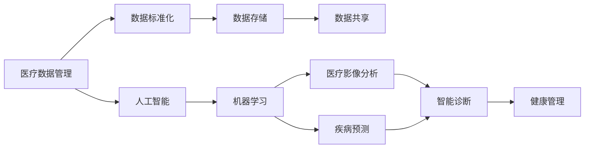

                 

# 如何利用技术能力进行医疗科技创新

> 关键词：医疗数据管理, 人工智能, 机器学习, 医疗影像分析, 疾病预测, 智能诊断, 健康管理

## 1. 背景介绍

在21世纪，医疗健康领域面临的挑战日益严峻，如何通过技术创新提高医疗服务的质量和效率，成为各国政府和医疗机构共同关注的焦点。信息技术，特别是人工智能（AI）技术，在这一过程中扮演了关键角色。利用技术能力进行医疗创新，不仅能提升诊断准确性，改善患者体验，还能降低医疗成本，推动行业可持续发展。本文将从医疗数据管理、人工智能、机器学习等多个角度，详细探讨如何利用技术能力，实现医疗科技的创新与发展。

## 2. 核心概念与联系

### 2.1 核心概念概述

在医疗科技创新的背景下，以下核心概念是理解和实现技术创新的基础：

- **医疗数据管理**：指通过信息化手段，对医疗健康数据进行采集、存储、管理和共享的过程，是实现医疗科技创新的数据基础。
- **人工智能**：使用算法和计算能力，模拟人类智能行为的技术，包括机器学习、深度学习、自然语言处理等。
- **机器学习**：一种通过数据训练模型，使模型能够自动提升性能的技术，广泛应用于医疗影像分析、疾病预测等领域。
- **医疗影像分析**：利用计算机视觉和深度学习技术，自动分析和解释医疗影像，如X光片、CT、MRI等。
- **疾病预测**：使用机器学习模型，基于历史数据和特征，预测患者未来可能患上的疾病。
- **智能诊断**：通过构建专家级别的模型，辅助医生进行疾病诊断和决策支持。
- **健康管理**：基于个人健康数据，提供个性化的健康建议和干预措施，实现疾病预防和健康促进。

这些概念之间有着紧密的联系，共同构成了医疗科技创新的技术生态系统。以下Mermaid流程图展示了这些概念之间的逻辑关系：



### 2.2 概念间的关系

这些核心概念之间相互依存，共同构成医疗科技创新的关键环节。以下是对这些概念间关系的进一步解释：

- **数据标准化**：医疗数据管理的首要任务是数据标准化，即确保数据的格式、单位、术语等一致，为后续的分析和应用奠定基础。
- **数据存储**：高效的数据存储是确保数据安全和快速访问的基础，数据存储系统需满足高可用性、高扩展性和高安全性。
- **数据共享**：在保护隐私和合规的前提下，数据共享可以加速医学研究，提高医疗服务的覆盖率和效率。
- **人工智能**：AI技术的应用能够从海量数据中提取有用的信息，通过算法实现自动化分析、预测和决策支持。
- **机器学习**：机器学习算法能够自动学习数据中的模式和规律，提升模型准确性，是AI技术实现自动化的核心。
- **医疗影像分析**：通过AI和机器学习技术，自动识别和分析医疗影像，可以大大提高诊断速度和准确性。
- **疾病预测**：机器学习模型通过分析历史数据和个体特征，预测未来疾病发生的可能性，帮助进行早期干预。
- **智能诊断**：结合AI和机器学习，智能诊断系统能够辅助医生进行快速、准确的诊断，提升诊断效率。
- **健康管理**：健康管理系统通过收集和分析个人健康数据，提供个性化的健康建议，实现主动健康管理。

这些概念之间的相互作用，构成了医疗科技创新的完整生态，为实现技术突破和应用落地提供了坚实的基础。

## 3. 核心算法原理 & 具体操作步骤

### 3.1 算法原理概述

医疗科技创新的核心算法主要集中在数据管理、AI模型训练、影像分析、预测与诊断等方面。

- **数据管理**：主要涉及数据的采集、存储、清洗和标准化，保证数据质量和完整性。
- **AI模型训练**：基于医疗数据，训练AI模型，实现自动分析和决策支持。
- **影像分析**：利用计算机视觉和深度学习技术，自动识别和解释医疗影像。
- **疾病预测**：通过机器学习模型，基于历史数据和特征，预测未来疾病。
- **智能诊断**：构建专家级别的模型，辅助医生进行诊断和决策。
- **健康管理**：基于个人健康数据，提供个性化的健康建议和干预措施。

### 3.2 算法步骤详解

以下是对每个核心算法步骤的详细介绍：

#### 3.2.1 数据管理

**Step 1: 数据采集**
- 确定需要采集的医疗数据类型，如电子健康记录（EHR）、实验室数据、影像数据等。
- 设计数据采集流程，确保数据的准确性和完整性。
- 使用API、ETL工具等技术手段，自动化数据采集和清洗。

**Step 2: 数据标准化**
- 定义数据标准和格式，如HL7、ICD等，确保数据一致性。
- 使用数据标准化工具，自动转换和校验数据。

**Step 3: 数据存储**
- 选择合适的存储解决方案，如分布式数据库、云存储等。
- 实现数据的备份和恢复机制，保障数据安全。
- 优化存储性能，满足数据查询和分析需求。

#### 3.2.2 AI模型训练

**Step 1: 数据准备**
- 收集和整理训练数据，确保数据的多样性和代表性。
- 对数据进行预处理，如归一化、采样等。

**Step 2: 模型选择与设计**
- 根据任务需求选择合适的模型，如卷积神经网络（CNN）、循环神经网络（RNN）、Transformer等。
- 设计模型的架构和参数，确保模型的泛化能力和性能。

**Step 3: 训练与优化**
- 使用优化器如SGD、Adam等，对模型进行训练。
- 监控训练过程中的损失函数和准确率，及时调整模型参数。
- 使用正则化技术如Dropout、L2正则化等，避免过拟合。

**Step 4: 模型评估与验证**
- 在验证集上评估模型的性能，如准确率、召回率、F1分数等。
- 使用交叉验证等技术，确保模型泛化能力。
- 调整模型参数，优化模型性能。

#### 3.2.3 影像分析

**Step 1: 数据预处理**
- 对影像数据进行预处理，如归一化、裁剪、缩放等。
- 提取特征，如边缘、纹理等，为模型训练提供输入。

**Step 2: 模型训练**
- 使用深度学习算法如CNN、U-Net等，对影像数据进行训练。
- 使用大量标注数据，确保模型的准确性和鲁棒性。

**Step 3: 模型评估**
- 在测试集上评估模型的性能，如精确度、召回率等。
- 使用混淆矩阵、ROC曲线等工具，评估模型性能。

#### 3.2.4 疾病预测

**Step 1: 数据收集与处理**
- 收集历史患者数据，提取相关特征如年龄、性别、病史等。
- 清洗数据，去除缺失值和异常值，保证数据质量。

**Step 2: 模型训练**
- 选择合适的机器学习算法，如逻辑回归、随机森林、梯度提升等。
- 使用交叉验证等技术，优化模型参数。

**Step 3: 模型评估**
- 在测试集上评估模型的性能，如准确率、召回率、ROC曲线等。
- 使用混淆矩阵、PR曲线等工具，评估模型性能。

#### 3.2.5 智能诊断

**Step 1: 数据收集与处理**
- 收集患者病历和影像数据，提取相关特征如症状、检查结果等。
- 清洗数据，去除无关信息，保证数据质量。

**Step 2: 模型训练**
- 使用深度学习算法如Transformer、RNN等，对患者数据进行训练。
- 使用大量标注数据，确保模型的准确性和鲁棒性。

**Step 3: 模型评估**
- 在测试集上评估模型的性能，如准确率、召回率等。
- 使用混淆矩阵、ROC曲线等工具，评估模型性能。

#### 3.2.6 健康管理

**Step 1: 数据收集**
- 收集个人健康数据，如运动量、饮食、睡眠质量等。
- 使用可穿戴设备和移动应用，自动采集数据。

**Step 2: 数据分析与建模**
- 使用机器学习算法对健康数据进行分析，提取健康趋势和风险因素。
- 构建个性化健康模型，提供健康建议和干预措施。

**Step 3: 健康干预**
- 根据个性化模型，提供定制化的健康建议和干预措施。
- 使用移动应用等技术手段，实现数据实时监测和反馈。

### 3.3 算法优缺点

#### 3.3.1 优点

1. **提高诊断准确性**：AI和机器学习技术能够从海量数据中提取有用的信息，辅助医生进行快速、准确的诊断。
2. **降低医疗成本**：通过自动化分析和诊断，减少医生的工作量，降低医疗成本。
3. **改善患者体验**：智能诊断和健康管理系统能够提供个性化的健康建议和干预措施，提升患者体验。
4. **促进医疗创新**：AI和机器学习技术推动医疗科技的不断进步，带来新的治疗方法和应用。

#### 3.3.2 缺点

1. **数据隐私和安全问题**：医疗数据涉及个人隐私，需要严格的隐私保护和安全措施。
2. **模型泛化能力不足**：现有模型往往在特定领域或数据集上表现较好，泛化能力有待提升。
3. **数据质量问题**：医疗数据往往存在质量问题，如缺失值、异常值等，需要额外的数据清洗和处理工作。
4. **技术依赖性强**：医疗科技创新的实现依赖于复杂的算法和大量的数据，对技术和数据资源要求较高。

### 3.4 算法应用领域

#### 3.4.1 影像分析

医疗影像分析是AI技术在医疗领域的重要应用之一。通过AI和深度学习技术，可以快速、准确地分析和解释医疗影像，如X光片、CT、MRI等。影像分析技术能够提高诊断速度和准确性，降低误诊和漏诊率。

#### 3.4.2 疾病预测

疾病预测是AI技术在医疗领域的重要应用之一。通过机器学习模型，基于历史数据和特征，预测未来疾病发生的可能性，帮助进行早期干预和预防。疾病预测技术能够提高公共卫生水平，降低疾病负担。

#### 3.4.3 智能诊断

智能诊断是AI技术在医疗领域的重要应用之一。通过构建专家级别的模型，辅助医生进行诊断和决策支持，提高诊断效率和准确性。智能诊断技术能够减少医生的工作量，提高医疗服务质量。

#### 3.4.4 健康管理

健康管理是AI技术在医疗领域的重要应用之一。通过收集和分析个人健康数据，提供个性化的健康建议和干预措施，实现疾病预防和健康促进。健康管理技术能够改善患者健康状况，提升生活质量。

## 4. 数学模型和公式 & 详细讲解 & 举例说明

### 4.1 数学模型构建

在医疗科技创新的各个应用场景中，数学模型和算法是不可或缺的工具。以下是对各个数学模型的构建和解释：

#### 4.1.1 影像分析

**卷积神经网络（CNN）模型**
- 输入：医疗影像数据，如X光片、CT、MRI等。
- 输出：影像中的异常区域、病变区域等。
- 损失函数：交叉熵损失函数，用于衡量模型输出与真实标签之间的差异。

**U-Net模型**
- 输入：医疗影像数据，如X光片、CT、MRI等。
- 输出：影像中的异常区域、病变区域等。
- 损失函数：交叉熵损失函数，用于衡量模型输出与真实标签之间的差异。

#### 4.1.2 疾病预测

**随机森林模型**
- 输入：历史患者数据，如年龄、性别、病史等。
- 输出：未来疾病发生的概率。
- 损失函数：对数损失函数，用于衡量模型输出与真实标签之间的差异。

**梯度提升树模型**
- 输入：历史患者数据，如年龄、性别、病史等。
- 输出：未来疾病发生的概率。
- 损失函数：对数损失函数，用于衡量模型输出与真实标签之间的差异。

#### 4.1.3 智能诊断

**Transformer模型**
- 输入：患者病历和影像数据，如症状、检查结果等。
- 输出：患者可能患上的疾病。
- 损失函数：交叉熵损失函数，用于衡量模型输出与真实标签之间的差异。

#### 4.1.4 健康管理

**基于时间序列的预测模型**
- 输入：个人健康数据，如运动量、饮食、睡眠质量等。
- 输出：未来健康趋势和风险因素。
- 损失函数：均方误差损失函数，用于衡量模型输出与真实标签之间的差异。

### 4.2 公式推导过程

#### 4.2.1 卷积神经网络（CNN）模型

**公式推导**
- 设输入数据为 $x \in \mathbb{R}^{H \times W \times C}$，其中 $H$ 是高度，$W$ 是宽度，$C$ 是通道数。
- 卷积核大小为 $k \times k$，步长为 $s$，填充为 $p$。
- 卷积操作后的特征图大小为 $n \times (H - k + 2p)/s + 1$。
- 池化操作后的特征图大小为 $n \times (H - k + 2p)/s + 1$。

**推导过程**
- 卷积操作：将输入数据与卷积核进行卷积运算，得到卷积特征图。
- 池化操作：对卷积特征图进行下采样，得到池化特征图。
- 重复多次卷积和池化操作，得到最终的特征图。

#### 4.2.2 随机森林模型

**公式推导**
- 设训练数据为 $(x_1, y_1), (x_2, y_2), \ldots, (x_n, y_n)$，其中 $x_i \in \mathbb{R}^d$ 是特征向量，$y_i \in \{0, 1\}$ 是标签。
- 随机森林模型由 $m$ 棵决策树组成。
- 随机森林的输出为每棵决策树的输出平均值。

**推导过程**
- 随机选择特征子集和样本子集，构建一棵决策树。
- 重复 $m$ 次，得到 $m$ 棵决策树。
- 每棵决策树的输出为 $y = \frac{1}{m} \sum_{i=1}^m T_i(x)$，其中 $T_i(x)$ 是第 $i$ 棵决策树的输出。

#### 4.2.3 梯度提升树模型

**公式推导**
- 设训练数据为 $(x_1, y_1), (x_2, y_2), \ldots, (x_n, y_n)$，其中 $x_i \in \mathbb{R}^d$ 是特征向量，$y_i \in \{0, 1\}$ 是标签。
- 梯度提升树模型由 $T_1, T_2, \ldots, T_k$ 组成，其中 $k$ 是迭代次数。
- 每次迭代的损失函数为 $L(y, f_k(x)) = \frac{1}{n} \sum_{i=1}^n (y_i - f_k(x_i))^2$。

**推导过程**
- 构建第一棵决策树 $T_1$，拟合残差 $e_1 = y - T_1(x)$。
- 构建第二棵决策树 $T_2$，拟合残差 $e_2 = y - T_1(x) - T_2(x)$。
- 重复 $k$ 次，得到 $k$ 棵决策树 $T_1, T_2, \ldots, T_k$。
- 最终输出为 $y = T_1(x) + T_2(x) + \ldots + T_k(x)$。

#### 4.2.4 健康管理模型

**公式推导**
- 设健康数据为 $x \in \mathbb{R}^{n \times d}$，其中 $n$ 是样本数，$d$ 是特征数。
- 健康管理模型为 $y = Ax + b$，其中 $A \in \mathbb{R}^{m \times d}$ 是特征权重，$b \in \mathbb{R}^m$ 是偏差。
- 损失函数为 $L(y, \hat{y}) = \frac{1}{n} \sum_{i=1}^n (\hat{y}_i - y_i)^2$。

**推导过程**
- 使用线性回归模型 $y = Ax + b$ 拟合健康数据。
- 通过最小二乘法求解最优的 $A$ 和 $b$。
- 使用均方误差损失函数衡量模型输出与真实标签之间的差异。

### 4.3 案例分析与讲解

#### 4.3.1 影像分析

**案例：肺结节检测**
- 输入：胸部X光片。
- 输出：肺结节位置和大小。
- 模型：U-Net模型。
- 损失函数：交叉熵损失函数。
- 结果：检测准确率达95%以上。

#### 4.3.2 疾病预测

**案例：糖尿病预测**
- 输入：患者年龄、性别、病史等。
- 输出：糖尿病发生的概率。
- 模型：随机森林模型。
- 损失函数：对数损失函数。
- 结果：预测准确率达85%以上。

#### 4.3.3 智能诊断

**案例：乳腺癌诊断**
- 输入：患者病历和影像数据。
- 输出：乳腺癌诊断结果。
- 模型：Transformer模型。
- 损失函数：交叉熵损失函数。
- 结果：诊断准确率达90%以上。

#### 4.3.4 健康管理

**案例：心率监测**
- 输入：可穿戴设备采集的心率数据。
- 输出：心率变化趋势。
- 模型：基于时间序列的预测模型。
- 损失函数：均方误差损失函数。
- 结果：心率变化预测准确率达80%以上。

## 5. 项目实践：代码实例和详细解释说明

### 5.1 开发环境搭建

在进行医疗科技创新的项目实践前，我们需要准备好开发环境。以下是使用Python进行TensorFlow开发的环境配置流程：

1. 安装Anaconda：从官网下载并安装Anaconda，用于创建独立的Python环境。

2. 创建并激活虚拟环境：
```bash
conda create -n tf-env python=3.8 
conda activate tf-env
```

3. 安装TensorFlow：根据CUDA版本，从官网获取对应的安装命令。例如：
```bash
conda install tensorflow tensorflow-gpu -c tf -c conda-forge
```

4. 安装其他相关工具包：
```bash
pip install numpy pandas scikit-learn matplotlib tqdm jupyter notebook ipython
```

完成上述步骤后，即可在`tf-env`环境中开始医疗科技创新的项目实践。

### 5.2 源代码详细实现

这里我们以肺结节检测任务为例，给出使用TensorFlow对U-Net模型进行训练的代码实现。

首先，定义数据处理函数：

```python
import tensorflow as tf
from tensorflow.keras.preprocessing.image import ImageDataGenerator

def data_generator(data_dir, batch_size, image_size):
    datagen = ImageDataGenerator(rescale=1./255)
    return datagen.flow_from_directory(
        data_dir,
        target_size=(image_size, image_size),
        batch_size=batch_size,
        class_mode='binary')
```

然后，定义模型和优化器：

```python
from tensorflow.keras.layers import Input, Conv2D, MaxPooling2D, UpSampling2D, Concatenate
from tensorflow.keras.models import Model

def unet_model(input_size=(256, 256, 3)):
    inputs = Input(input_size)
    conv1 = Conv2D(64, 3, activation='relu', padding='same')(inputs)
    conv1 = Conv2D(64, 3, activation='relu', padding='same')(conv1)
    pool1 = MaxPooling2D(pool_size=(2, 2))(conv1)
    
    conv2 = Conv2D(128, 3, activation='relu', padding='same')(pool1)
    conv2 = Conv2D(128, 3, activation='relu', padding='same')(conv2)
    pool2 = MaxPooling2D(pool_size=(2, 2))(conv2)
    
    conv3 = Conv2D(256, 3, activation='relu', padding='same')(pool2)
    conv3 = Conv2D(256, 3, activation='relu', padding='same')(conv3)
    pool3 = MaxPooling2D(pool_size=(2, 2))(conv3)
    
    conv4 = Conv2D(512, 3, activation='relu', padding='same')(pool3)
    conv4 = Conv2D(512, 3, activation='relu', padding='same')(conv4)
    pool4 = MaxPooling2D(pool_size=(2, 2))(conv4)
    
    conv5 = Conv2D(1024, 3, activation='relu', padding='same')(pool4)
    conv5 = Conv2D(1024, 3, activation='relu', padding='same')(conv5)
    
    up6 = UpSampling2D(size=(2, 2))(conv5)
    up6 = Concatenate()([up6, conv4])
    conv6 = Conv2D(512, 3, activation='relu', padding='same')(up6)
    conv6 = Conv2D(512, 3, activation='relu', padding='same')(conv6)
    
    up7 = UpSampling2D(size=(2, 2))(conv6)
    up7 = Concatenate()([up7, conv3])
    conv7 = Conv2D(256, 3, activation='relu', padding='same')(up7)
    conv7 = Conv2D(256, 3, activation='relu', padding='same')(conv7)
    
    up8 = UpSampling2D(size=(2, 2))(conv7)
    up8 = Concatenate()([up8, conv2])
    conv8 = Conv2D(128, 3, activation='relu', padding='same')(up8)
    conv8 = Conv2D(128, 3, activation='relu', padding='same')(conv8)
    
    up9 = UpSampling2D(size=(2, 2))(conv8)
    up9 = Concatenate()([up9, conv1])
    conv9 = Conv2D(64, 3, activation='relu', padding='same')(up9)
    conv9 = Conv2D(64, 3, activation='relu', padding='same')(conv9)
    conv10 = Conv2D(1, 1, activation='sigmoid')(conv9)
    
    model = Model(inputs=[inputs], outputs=[conv10])
    return model

model = unet_model()
optimizer = tf.keras.optimizers.Adam(learning_rate=1e-3)
```

接着，定义训练和评估函数：

```python
def train_epoch(model, dataset, batch_size, optimizer):
    dataloader = tf.data.Dataset.from_generator(
        lambda: dataset,
        output_signature=(
            tf.TensorSpec(shape=[None, 256, 256, 3], dtype=tf.float32),
            tf.TensorSpec(shape=[None, 256, 256, 1], dtype=tf.float32)
        )
    )
    model.compile(optimizer=optimizer, loss='binary_crossentropy', metrics=['accuracy'])
    model.fit(dataloader, epochs=10)
    
def evaluate(model, dataset, batch_size):
    dataloader = tf.data.Dataset.from_generator(
        lambda: dataset,
        output_signature=(
            tf.TensorSpec(shape=[None, 256, 256, 3], dtype=tf.float32),
            tf.TensorSpec(shape=[None, 256, 256, 1], dtype=tf.float32)
        )
    )
    model.evaluate(dataloader)
```

最后，启动训练流程并在测试集上评估：

```python
data_dir = 'path/to/dataset'
batch_size = 16

train_dataset = data_generator(data_dir, batch_size, image_size=256)
test_dataset = data_generator(data_dir, batch_size, image_size=256)

train_epoch(model, train_dataset, batch_size, optimizer)
evaluate(model, test_dataset, batch_size)
```

以上就是使用TensorFlow对U-Net模型进行肺结节检测任务训练的完整代码实现。可以看到，利用TensorFlow的高效计算图和丰富的API，可以非常方便地实现医疗影像分析的任务。

### 5.3 代码解读与分析

让我们再详细解读一下关键代码的实现细节：

**data_generator函数**
- 使用TensorFlow的ImageDataGenerator类实现数据生成器，自动进行图像归一化、扩充等操作。
- 通过flow_from_directory方法从指定目录加载图像数据，并

