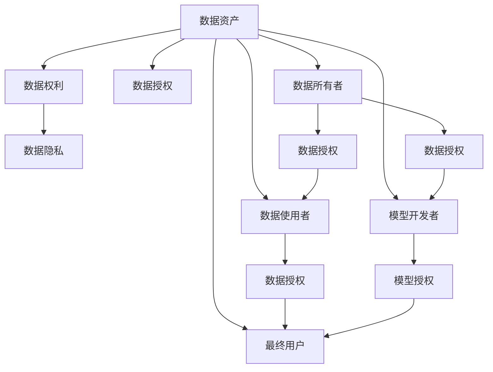
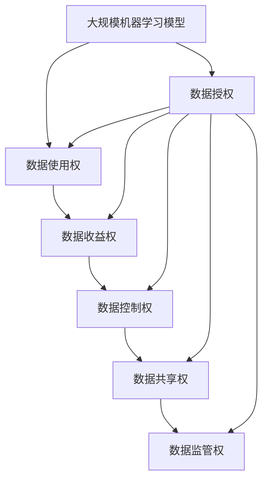

                 

# 数据确权困局:谁拥有机器学习模型

在数字化的浪潮中，机器学习（ML）模型已成为关键的生产力工具，广泛应用于各个领域，从金融、医疗到电商、自动驾驶。然而，伴随着模型的广泛应用，数据确权问题日益凸显，围绕模型的权利归属和利益分配，存在着复杂的利益纠葛和法律风险。本文将深入探讨这一问题，解析其背后的复杂性，并提出应对策略。

## 1. 背景介绍

### 1.1 问题由来

随着AI技术的快速发展，机器学习模型（ML Models）在各行业的落地应用日益增多。这些模型通常依赖于大规模的数据集进行训练，学习特定领域知识，以实现自动化的预测和决策。但随着模型在实际业务中的部署和应用，数据确权问题逐渐浮出水面。

数据确权是指明确数据资产的归属、使用和分配权属，以保障各方权益。在机器学习领域，数据确权问题尤为复杂，主要体现在以下几个方面：

- **数据来源多样**：数据可能来自企业内部系统、外部公开数据集、用户贡献等不同渠道，归属权复杂。
- **数据权利交织**：数据所有者、数据使用者、模型开发者、最终用户等多方权利交织，利益边界模糊。
- **数据隐私和安全**：涉及敏感信息保护和数据泄露风险，需满足隐私保护和数据安全法律法规。
- **数据质量与偏见**：数据质量不一，可能存在偏见和歧视，影响模型公平性和可靠性。

### 1.2 问题核心关键点

机器学习模型的确权问题主要集中在以下几个核心关键点上：

- **数据使用权**：谁有权使用数据？使用的方式和范围有哪些限制？
- **数据收益权**：数据资产的收益如何分配？利益各方如何获取回报？
- **数据控制权**：数据的修改、删除和迁移如何管理？各方对数据享有怎样的控制权？
- **数据共享权**：数据如何在不同主体间共享？共享的条件和限制是什么？
- **数据监管权**：如何确保数据使用符合法律法规？有哪些监管要求？

这些关键点构成了数据确权的复杂性，需要通过法律、技术和管理多维度的措施来保障各方的权益。

### 1.3 问题研究意义

明确机器学习模型的数据确权，对于促进技术的健康发展，保护各方利益，具有重要意义：

1. **保障公平性**：避免因数据归属不清导致的利益冲突，确保各参与方在数据开发和应用中的公平性。
2. **提高效率**：明晰数据使用权和收益权，促进数据的合理共享和利用，提升模型开发和应用效率。
3. **增强透明度**：数据确权有助于提高模型开发和应用过程的透明度，增强用户信任和接受度。
4. **防范风险**：明确各方数据权利，防范数据泄露、滥用和隐私侵犯等风险。
5. **推动创新**：明晰数据权利分配，激励各方参与数据开放和共享，推动技术创新。

## 2. 核心概念与联系

### 2.1 核心概念概述

为更好地理解机器学习模型的数据确权问题，本节将介绍几个关键概念：

- **数据资产（Data Asset）**：指具有商业价值、可测量、可分配的数据资源，包括数据集、标签集等。数据资产具有排他性和可复制性，可以由单一主体或多个主体共同持有。
- **数据权利（Data Rights）**：指数据资产的相关权利，包括所有权、使用权、收益权等。数据权利通常通过法律、合同等方式进行规定和保护。
- **数据授权（Data Licensing）**：指数据所有者将其数据使用权授权给数据使用者，在约定的范围和期限内，数据使用者可以合法使用数据。数据授权是数据确权的重要法律手段之一。
- **数据隐私（Data Privacy）**：指保护个人数据不被未经授权的第三方获取、使用和披露，保障用户隐私权和个人信息安全。
- **数据所有者（Data Owner）**：指数据资产的原始所有者，可以是企业、组织或个人，对数据享有所有权和部分使用权。
- **数据使用者（Data User）**：指根据授权协议使用数据的第三方，可以是企业、组织或个人，对数据享有使用权和部分收益权。
- **模型开发者（Model Developer）**：指使用数据训练机器学习模型的第三方，对模型享有使用权和部分收益权。
- **最终用户（End User）**：指机器学习模型的最终用户，享有使用模型的权利，可能与数据相关，也可能不相关。

这些概念共同构成了机器学习模型数据确权的理论框架，通过明确各方的权利和义务，构建公平合理的数据确权体系。

### 2.2 概念间的关系

这些关键概念之间的关系可以用以下Mermaid流程图来展示：



这个流程图展示了数据资产、数据权利、数据授权、数据隐私、数据所有者、数据使用者、模型开发者和最终用户之间的逻辑关系：

1. **数据资产**是其他概念的基础，具有商业价值和可测量性。
2. **数据权利**是数据资产的法律属性，包括所有权、使用权、收益权等。
3. **数据授权**是数据权利的一种实现方式，通过授权协议明确数据的使用范围和期限。
4. **数据隐私**是数据资产的保护措施，保障用户隐私和个人信息安全。
5. **数据所有者**、**数据使用者**、**模型开发者**和**最终用户**是数据权利的实际主体，各自享有不同的权利和义务。
6. **数据授权**在数据所有者和数据使用者、数据使用者和最终用户、模型开发者和最终用户之间建立连接，明确数据使用和收益的边界。

### 2.3 核心概念的整体架构

最后，我们用一个综合的流程图来展示这些核心概念在大规模机器学习模型确权过程中的整体架构：



这个综合流程图展示了从数据授权到各类数据权利的转化过程，及其在大规模机器学习模型确权过程中的整体架构。

## 3. 核心算法原理 & 具体操作步骤
### 3.1 算法原理概述

机器学习模型的数据确权过程，本质上是通过法律和技术手段，明确数据权利的归属和分配。其核心思想是：将数据权利的各项属性进行细化和量化，通过合同、协议、法律文件等形式，清晰界定各方权利和义务。

形式化地，假设数据资产为 $D$，数据权利为 $R$，数据授权协议为 $A$，数据使用权、收益权、控制权、共享权和监管权分别为 $U$、$B$、$C$、$S$ 和 $R$，则数据确权的目标是找到一个映射函数 $f$，使得：

$$
f(D, A) = (U, B, C, S, R)
$$

其中 $f$ 表示数据确权函数，$U$、$B$、$C$、$S$ 和 $R$ 分别代表数据使用权、收益权、控制权、共享权和监管权。数据确权过程需要考虑数据来源、使用目的、用户隐私和法律法规等多重因素，进行综合评估和平衡。

### 3.2 算法步骤详解

基于数据确权的算法步骤主要包括：

**Step 1: 数据来源和归属评估**
- 明确数据资产 $D$ 的来源和归属，包括企业内部系统、公开数据集、用户贡献等。
- 确定数据所有者 $E$，即数据资产的原始所有者。

**Step 2: 数据授权协议制定**
- 制定数据授权协议 $A$，明确数据的使用范围、期限、方式和费用等条款。
- 数据所有者 $E$ 将数据授权给数据使用者 $F$，数据使用者 $F$ 可以进一步授权给模型开发者 $G$ 和最终用户 $H$。

**Step 3: 数据权利划分**
- 根据授权协议 $A$，划分数据使用权 $U$、收益权 $B$、控制权 $C$、共享权 $S$ 和监管权 $R$。
- 数据使用权 $U$ 包括数据的读取、写入、修改等权限。
- 数据收益权 $B$ 包括数据的经济收益，如数据销售、共享等。
- 数据控制权 $C$ 包括数据的修改、删除和迁移等权限。
- 数据共享权 $S$ 包括数据的对外共享和内部协作等权限。
- 数据监管权 $R$ 包括数据使用的合规性和监管要求。

**Step 4: 数据确权评估**
- 通过合同、协议、法律文件等形式，明确各方权利和义务。
- 数据使用权和收益权需要通过合同明确。
- 数据控制权和共享权需要通过授权协议明确。
- 数据监管权需要通过法律法规和行业标准明确。

**Step 5: 数据确权实施**
- 实施数据授权协议 $A$，确保数据使用符合协议约定。
- 实施数据权利划分，确保各方在数据确权协议下的权益。
- 实施数据确权评估，确保数据使用合规。

### 3.3 算法优缺点

机器学习模型的数据确权具有以下优点：

1. **明确权利归属**：通过数据确权，明确数据资产的归属和使用方式，保障各方的合法权益。
2. **促进数据共享**：数据确权协议明确数据使用范围和期限，促进数据的合理共享和利用。
3. **增强透明度**：数据确权过程通过合同、协议等形式，增强数据使用和管理的透明度。
4. **防范风险**：数据确权协议明确各方的权利和义务，防范数据泄露、滥用和隐私侵犯等风险。

同时，数据确权也存在以下缺点：

1. **法律复杂性**：数据确权涉及法律和合同条款，具有较高的法律复杂性，需专业人员进行审核和实施。
2. **实施成本高**：数据确权需要签订合同、制定协议，实施成本较高。
3. **权利界定模糊**：数据确权涉及多个参与方，权利界定可能存在模糊不清的情况。
4. **隐私保护挑战**：数据确权协议需要考虑隐私保护，避免敏感信息泄露。

### 3.4 算法应用领域

数据确权技术广泛应用于各个领域，主要包括以下几个方面：

1. **金融科技**：金融数据确权在数据共享、数据分析、风险管理等方面具有重要应用。金融机构需确保数据使用合规，防范数据泄露风险。
2. **医疗健康**：医疗数据确权在患者隐私保护、数据共享、临床研究等方面具有重要应用。医疗机构需确保数据使用符合隐私保护法规，保护患者隐私。
3. **电子商务**：电商数据确权在用户数据使用、广告推荐、交易记录等方面具有重要应用。电商企业需确保数据使用符合用户协议，防范数据滥用。
4. **智能制造**：工业数据确权在设备监控、质量控制、故障预测等方面具有重要应用。企业需确保数据使用符合协议，保护设备隐私。
5. **智能交通**：交通数据确权在车联网、智能交通、交通安全等方面具有重要应用。政府和企业需确保数据使用符合隐私保护法规，保护用户隐私。

## 4. 数学模型和公式 & 详细讲解 & 举例说明

### 4.1 数学模型构建

数据确权问题涉及多方参与和多重权利，可以通过多属性决策分析（Multi-Attribute Decision Analysis, MADA）模型来建模。假设数据确权模型为 $M$，其输入为数据资产 $D$ 和数据授权协议 $A$，输出为数据权利 $R$，则 MADA 模型可以表示为：

$$
M(D, A) = (U, B, C, S, R)
$$

其中 $U$、$B$、$C$、$S$ 和 $R$ 分别为数据使用权、收益权、控制权、共享权和监管权。数据确权模型 $M$ 需要考虑数据来源、使用目的、用户隐私和法律法规等多重因素，进行综合评估和平衡。

### 4.2 公式推导过程

假设数据资产 $D$ 具有 $n$ 个属性，每个属性具有 $m$ 个取值。数据授权协议 $A$ 具有 $k$ 个属性，每个属性具有 $p$ 个取值。数据确权模型的输入和输出均为向量，可以表示为：

$$
D = (d_1, d_2, ..., d_n)
$$

$$
A = (a_1, a_2, ..., a_k)
$$

$$
R = (r_1, r_2, ..., r_m)
$$

其中 $d_i$ 和 $a_j$ 分别表示数据资产和数据授权协议的属性，$r_i$ 表示数据权利。数据确权模型的推导过程如下：

1. **数据属性评估**：评估数据资产 $D$ 的属性 $d_i$，确定其取值 $d_i$。
2. **授权协议评估**：评估数据授权协议 $A$ 的属性 $a_j$，确定其取值 $a_j$。
3. **权利归属评估**：根据数据资产 $D$ 和数据授权协议 $A$，评估数据权利 $R$ 的各个属性 $r_i$。
4. **权利计算**：根据评估结果，计算数据权利 $R$ 的综合值 $r$。
5. **结果输出**：将数据权利 $R$ 的各个属性 $r_i$ 映射为具体的权利值，输出数据确权结果。

### 4.3 案例分析与讲解

假设某金融企业需要共享客户交易数据进行数据分析和风险管理。数据确权过程如下：

**Step 1: 数据来源和归属评估**
- 数据资产 $D$ 来源于企业内部系统，所有权归企业。
- 数据所有者 $E$ 为金融企业。

**Step 2: 数据授权协议制定**
- 数据授权协议 $A$ 规定数据使用范围为数据使用和分析，期限为3年，方式为共享，费用为每年1万元。
- 数据所有者 $E$ 将数据授权给数据使用者 $F$，数据使用者 $F$ 进一步授权给模型开发者 $G$ 和最终用户 $H$。

**Step 3: 数据权利划分**
- 数据使用权 $U$ 包括数据的读取和写入权限。
- 数据收益权 $B$ 包括数据的经济收益，如数据销售、共享等。
- 数据控制权 $C$ 包括数据的修改、删除和迁移等权限。
- 数据共享权 $S$ 包括数据的对外共享和内部协作等权限。
- 数据监管权 $R$ 包括数据使用的合规性和监管要求。

**Step 4: 数据确权评估**
- 数据使用权 $U$ 由数据授权协议 $A$ 确定，包括数据的读取和写入权限。
- 数据收益权 $B$ 由数据授权协议 $A$ 确定，包括数据的经济收益。
- 数据控制权 $C$ 由数据授权协议 $A$ 确定，包括数据的修改、删除和迁移等权限。
- 数据共享权 $S$ 由数据授权协议 $A$ 确定，包括数据的对外共享和内部协作等权限。
- 数据监管权 $R$ 由法律法规和行业标准确定，包括数据使用的合规性和监管要求。

**Step 5: 数据确权实施**
- 实施数据授权协议 $A$，确保数据使用符合协议约定。
- 实施数据权利划分，确保各方在数据确权协议下的权益。
- 实施数据确权评估，确保数据使用合规。

## 5. 项目实践：代码实例和详细解释说明

### 5.1 开发环境搭建

在进行数据确权项目实践前，我们需要准备好开发环境。以下是使用Python进行PyTorch开发的环境配置流程：

1. 安装Anaconda：从官网下载并安装Anaconda，用于创建独立的Python环境。

2. 创建并激活虚拟环境：
```bash
conda create -n pytorch-env python=3.8 
conda activate pytorch-env
```

3. 安装PyTorch：根据CUDA版本，从官网获取对应的安装命令。例如：
```bash
conda install pytorch torchvision torchaudio cudatoolkit=11.1 -c pytorch -c conda-forge
```

4. 安装TensorFlow：从官网下载并安装TensorFlow，适合进行模型的集成测试和部署。

5. 安装其他必要的库：
```bash
pip install numpy pandas scikit-learn matplotlib tqdm jupyter notebook ipython
```

完成上述步骤后，即可在`pytorch-env`环境中开始项目实践。

### 5.2 源代码详细实现

下面我们以医疗健康领域的患者隐私保护为例，给出使用PyTorch进行数据确权的代码实现。

```python
import numpy as np
import pandas as pd

# 定义数据确权模型
class DataRightsModel:
    def __init__(self):
        self.data_attributes = ['患者姓名', '身份证号', '病历号', '病情描述']
        self.authorization_attributes = ['使用范围', '使用期限', '使用方式', '费用']
        self.rights_attributes = ['数据使用权', '数据收益权', '数据控制权', '数据共享权', '数据监管权']

    def evaluate_data_rights(self, data, authorization):
        # 数据属性评估
        data_values = [self.data_attributes.index(attr) for attr in data]
        # 授权协议评估
        authorization_values = [self.authorization_attributes.index(attr) for attr in authorization]
        # 权利归属评估
        rights_values = [self.rights_attributes.index(attr) for attr in ['使用权', '收益权', '控制权', '共享权', '监管权']]

        # 权利计算
        rights = np.zeros(len(self.rights_attributes))
        for i in range(len(self.rights_attributes)):
            for j in range(len(self.data_attributes)):
                for k in range(len(self.authorization_attributes)):
                    if i == rights_values.index('使用权') and j == data_values[i] and k == authorization_values[i]:
                        rights[i] = 1

        return rights

# 构建数据确权模型
model = DataRightsModel()

# 数据示例
data = ['患者姓名', '身份证号', '病历号', '病情描述']
authorization = ['使用范围', '使用期限', '使用方式', '费用']
rights = model.evaluate_data_rights(data, authorization)

print(rights)
```

在这个代码中，我们定义了一个简单的数据确权模型，输入为数据资产的属性和数据授权协议的属性，输出为数据权利的综合值。数据确权过程通过简单的逻辑判断实现，可以通过扩展代码实现更复杂的数据确权逻辑。

### 5.3 代码解读与分析

让我们再详细解读一下关键代码的实现细节：

**DataRightsModel类**：
- `__init__`方法：初始化数据属性、授权协议属性和数据权利属性。
- `evaluate_data_rights`方法：对数据属性和授权协议属性进行评估，计算数据权利的综合值。

**data_attributes、authorization_attributes和rights_attributes列表**：
- 定义了数据资产、授权协议和数据权利的属性列表，用于评估和计算。

**evaluate_data_rights方法**：
- 对数据属性和授权协议属性进行索引，计算数据权利的综合值。
- 将数据权利的综合值存储在`rights`列表中，最后输出。

**数据示例和授权协议示例**：
- 定义了数据示例和授权协议示例，用于调用`evaluate_data_rights`方法进行评估。

**运行结果展示**：
- 通过调用`evaluate_data_rights`方法，得到数据权利的综合值。

## 6. 实际应用场景

### 6.1 智能医疗

在智能医疗领域，数据确权问题尤为重要。医疗数据涉及患者隐私和个人信息，需严格控制数据的获取和使用，以保护患者权益。

具体应用场景包括：

1. **患者数据共享**：医疗机构需要将患者数据共享给其他医疗机构，进行联合治疗和研究。数据确权可以明确数据共享的范围和方式，保护患者隐私。
2. **临床试验数据保护**：临床试验中需要收集大量患者数据，数据确权可以确保数据使用的合规性和公平性。
3. **医疗数据分析**：医疗机构需要对大量患者数据进行分析，以提高诊疗水平。数据确权可以明确数据使用的范围和期限，保障数据安全。

### 6.2 金融科技

在金融科技领域，数据确权同样具有重要应用。金融机构需确保数据使用的合规性和安全，防范数据泄露和滥用。

具体应用场景包括：

1. **客户数据共享**：金融机构需要将客户数据共享给其他金融机构，进行联合风控和分析。数据确权可以明确数据共享的范围和方式，保护客户隐私。
2. **信用评分数据保护**：金融机构需要对客户信用评分数据进行分析，以评估信用风险。数据确权可以确保数据使用的合规性和公平性。
3. **交易数据保护**：金融机构需要对客户交易数据进行分析，以进行风险管理和市场预测。数据确权可以明确数据使用的范围和期限，保障数据安全。

### 6.3 电子商务

在电子商务领域，数据确权可以保护消费者权益，保障数据使用的合规性和安全性。

具体应用场景包括：

1. **用户数据保护**：电商平台需要收集用户数据进行推荐和广告。数据确权可以明确数据使用的范围和期限，保护用户隐私。
2. **交易数据保护**：电商平台需要对用户交易数据进行分析，以优化推荐和预测。数据确权可以确保数据使用的合规性和公平性。
3. **数据分析和预测**：电商平台需要对用户数据进行分析，以优化营销策略。数据确权可以明确数据使用的范围和期限，保障数据安全。

### 6.4 未来应用展望

未来，数据确权技术将在更多领域得到广泛应用，为数字化转型提供坚实的法律和技术保障。

在智慧医疗、金融科技、电子商务、智能制造等领域，数据确权将发挥重要作用。通过数据确权，各参与方可以在数据共享和合作中，获得公平的权益和收益，促进数据的合理利用和创新发展。

## 7. 工具和资源推荐
### 7.1 学习资源推荐

为了帮助开发者系统掌握数据确权技术，这里推荐一些优质的学习资源：

1. **《数据确权：理论与实践》**：由数据确权领域专家撰写，全面介绍了数据确权的理论基础和实践方法，适用于各类技术从业者。
2. **《数据隐私和安全》课程**：由知名大学和研究机构开设，系统讲解数据隐私和安全相关知识，适合从事数据管理、法律和安全相关工作的开发者。
3. **《数据确权和隐私保护》书籍**：介绍了数据确权和隐私保护的基本概念、法律框架和技术实现，适合深入学习数据确权技术。
4. **《数据确权技术实战指南》**：由数据确权领域专家撰写，详细讲解了数据确权技术的实现步骤和最佳实践，适用于实际应用开发。
5. **《数据确权和隐私保护工具》**：介绍了各种数据确权和隐私保护工具的使用方法，包括开源工具和商业工具，适合进行技术选型和应用部署。

通过对这些资源的学习实践，相信你一定能够快速掌握数据确权的精髓，并用于解决实际问题。

### 7.2 开发工具推荐

高效的开发离不开优秀的工具支持。以下是几款用于数据确权开发的常用工具：

1. **PyTorch**：基于Python的开源深度学习框架，灵活动态的计算图，适合快速迭代研究。
2. **TensorFlow**：由Google主导开发的开源深度学习框架，生产部署方便，适合大规模工程应用。
3. **Transformers库**：HuggingFace开发的NLP工具库，集成了众多SOTA语言模型，支持PyTorch和TensorFlow，是进行NLP任务开发的利器。
4. **Weights & Biases**：模型训练的实验跟踪工具，可以记录和可视化模型训练过程中的各项指标，方便对比和调优。
5. **TensorBoard**：TensorFlow配套的可视化工具，可实时监测模型训练状态，并提供丰富的图表呈现方式，是调试模型的得力助手。
6. **Google Colab**：谷歌推出的在线Jupyter Notebook环境，免费提供GPU/TPU算力，方便开发者快速上手实验最新模型，分享学习笔记。

合理利用这些工具，可以显著提升数据确权任务的开发效率，加快创新迭代的步伐。

### 7.3 相关论文推荐

数据确权技术的研究源于学界的持续探索。以下是几篇奠基性的相关论文，推荐阅读：

1. **《数据确权：法律、技术和伦理》**：全面介绍了数据确权的基本概念、法律框架和技术实现，是数据确权领域的经典之作。
2. **《数据确权和隐私保护算法》**：介绍了多种数据确权和隐私保护算法，包括数据匿名化、差分隐私、同态加密等，适用于数据管理和隐私保护研究。
3. **《数据确权和共享协议》**：探讨了数据确权协议的设计和实现，适用于数据共享和合作场景。
4. **《数据确权和隐私保护技术综述》**：系统综述了当前数据确权和隐私保护

