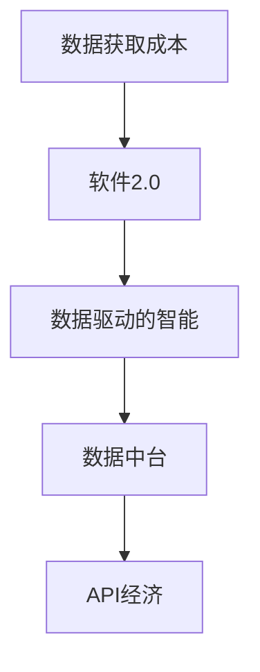

                 

## 1. 背景介绍

### 1.1 数据与软件发展史

软件的发展史始终与数据息息相关，从最早的程序编写，到数据驱动的智能时代，数据始终是软件工程的核心要素。软件1.0时代，程序员通过编码实现业务逻辑，数据获取和处理往往依赖手工录入或极少的数据库查询。而到了软件2.0时代，数据获取和处理的方式正在经历深刻的变革，数据来源和数据获取的渠道越来越丰富，数据处理的规模和复杂性也在不断增加。

### 1.2 数据与软件的关系

数据驱动是软件2.0时代的重要特征，数据不仅仅是输入和输出，而是软件的核心驱动力。软件开发者需要从数据获取、数据处理、数据分析等多个维度进行思考，才能构建出真正有价值的智能系统。数据的获取成本、处理效率、分析能力直接决定了软件的性能和可用性。随着数据获取成本的下降，软件2.0的春天已经到来。

## 2. 核心概念与联系

### 2.1 核心概念概述

- **数据获取成本**：指获取数据所需要的成本，包括数据存储、数据收集、数据清洗等多个方面。随着技术的发展，数据获取成本逐渐降低。
- **软件2.0**：指以数据为中心的软件开发模式，强调数据的获取、处理、分析在软件开发中的重要性。
- **数据驱动的智能**：指通过数据获取、处理、分析，构建出能够自动感知环境、自主决策、自我优化的智能系统。
- **数据中台**：指集中管理和调度数据获取、数据存储、数据处理的平台，促进数据的流通和应用。
- **API经济**：指通过开放API接口，让外部开发者使用数据、分析结果等，实现数据的商业化。

这些概念共同构成了软件2.0时代的基础，数据获取成本的降低，使得数据驱动的智能成为可能，API经济的繁荣让数据发挥更大的商业价值。

### 2.2 核心概念之间的关系

这些核心概念之间的关系可以通过以下Mermaid流程图来展示：



该流程图展示了数据获取成本降低与软件2.0之间的因果关系，以及数据驱动智能、数据中台和API经济在其中的作用。

## 3. 核心算法原理 & 具体操作步骤

### 3.1 算法原理概述

软件2.0的核心算法原理在于如何高效地获取、处理和分析数据，以构建智能系统。数据获取的效率、数据处理的复杂度、数据分析的准确度是影响软件2.0性能的关键因素。数据获取成本的降低，使得数据驱动的智能成为可能，API经济的繁荣让数据发挥更大的商业价值。

### 3.2 算法步骤详解

#### 3.2.1 数据获取

数据获取是软件2.0的第一步，包括数据采集、数据收集和数据存储。数据采集指从各个渠道获取原始数据，数据收集指对采集到的数据进行清洗、整理，数据存储指将处理后的数据保存到数据库中。

**步骤1：数据采集**

数据采集可以通过多种方式实现，包括API接口、爬虫、传感器等。例如，通过开放API接口获取社交媒体、电商网站的数据，通过爬虫抓取新闻、天气、股市等公开数据，通过传感器获取物联网设备的数据等。

**步骤2：数据收集**

数据收集需要对采集到的数据进行清洗、去重、填充缺失值等处理，确保数据的准确性和一致性。数据收集可以使用ETL工具，如Apache NiFi、Apache Beam等。

**步骤3：数据存储**

数据存储需要选择合适的数据库，如关系型数据库MySQL、PostgreSQL，非关系型数据库MongoDB、Cassandra等。数据存储应考虑数据的存储格式、存储位置、访问速度等因素。

#### 3.2.2 数据处理

数据处理是软件2.0的核心，包括数据清洗、数据转换、数据聚合等。数据处理需要对数据进行预处理，以确保数据的质量和一致性，提高数据处理效率。

**步骤1：数据清洗**

数据清洗包括去除重复数据、处理缺失值、纠正错误数据等。数据清洗可以使用Pandas、Spark等数据处理工具。

**步骤2：数据转换**

数据转换包括数据格式转换、数据结构转换等。数据转换需要使用数据转换工具，如ETL工具、数据管道工具等。

**步骤3：数据聚合**

数据聚合指对数据进行汇总、计算等操作，以得到有意义的统计信息。数据聚合可以使用SQL查询、MapReduce等技术。

#### 3.2.3 数据分析

数据分析是软件2.0的重要环节，包括数据挖掘、数据可视化、机器学习等。数据分析需要通过算法对数据进行深度挖掘，提取有用的信息，提供决策支持。

**步骤1：数据挖掘**

数据挖掘指通过算法对数据进行深层次分析，提取有用的模式、规律和知识。数据挖掘可以使用机器学习算法，如分类、聚类、回归等。

**步骤2：数据可视化**

数据可视化指将数据分析结果以图表、报表等形式展现出来，帮助用户理解数据。数据可视化可以使用Tableau、Power BI等工具。

**步骤3：机器学习**

机器学习指使用算法对数据进行训练，得到能够自动感知环境、自主决策的模型。机器学习可以使用TensorFlow、PyTorch等深度学习框架。

#### 3.2.4 数据驱动的智能

数据驱动的智能是指通过数据获取、数据处理、数据分析，构建出能够自动感知环境、自主决策、自我优化的智能系统。数据驱动的智能包括智能推荐、智能客服、智能监控等。

**步骤1：智能推荐**

智能推荐指根据用户的历史行为和偏好，推荐相关的产品、服务、内容等。智能推荐可以使用协同过滤、基于内容的推荐等算法。

**步骤2：智能客服**

智能客服指通过自然语言处理技术，实现与用户的自然对话，解决用户的问题。智能客服可以使用对话系统、情感分析等技术。

**步骤3：智能监控**

智能监控指通过数据分析技术，实时监测系统状态、网络流量、设备状态等，及时发现异常并采取措施。智能监控可以使用机器学习、深度学习等技术。

### 3.3 算法优缺点

软件2.0的数据获取成本降低带来了许多优势，但也存在一些缺点。

**优点**

1. **数据获取成本低**：随着技术的发展，数据获取成本逐渐降低，使得数据驱动的智能成为可能。
2. **数据质量高**：数据获取成本的降低，使得数据质量和数据完整性得到提高，为数据分析和智能决策提供了良好的基础。
3. **业务洞察力强**：通过数据分析，可以更好地理解业务流程和客户需求，提升业务洞察力。
4. **竞争优势明显**：数据驱动的智能可以提升企业的竞争力和市场份额。

**缺点**

1. **数据隐私和安全问题**：数据获取成本的降低，带来了数据隐私和安全问题，需要加强数据保护。
2. **数据处理复杂度高**：随着数据量的增加，数据处理的复杂度也在增加，需要提升数据处理效率。
3. **技术门槛高**：数据驱动的智能需要掌握多种技术和工具，技术门槛较高。
4. **数据孤岛问题**：不同系统间的数据共享和集成困难，存在数据孤岛问题。

### 3.4 算法应用领域

软件2.0的应用领域非常广泛，包括但不限于以下几个方面：

1. **智能推荐系统**：根据用户行为和偏好，推荐相关的产品、服务、内容等，如电商平台的商品推荐、视频网站的影视推荐等。
2. **智能客服系统**：通过自然语言处理技术，实现与用户的自然对话，解决用户的问题，如银行客服、电商客服等。
3. **智能监控系统**：通过数据分析技术，实时监测系统状态、网络流量、设备状态等，及时发现异常并采取措施，如网络监控、设备监控等。
4. **数据驱动的决策支持系统**：通过数据分析和机器学习，为决策提供支持，如市场分析、财务分析等。
5. **智能驾驶系统**：通过感知、决策和控制等技术，实现自动驾驶，如特斯拉Autopilot等。
6. **智能医疗系统**：通过数据分析和机器学习，为医疗诊断、治疗等提供支持，如放射学、基因组学等。

## 4. 数学模型和公式 & 详细讲解 & 举例说明

### 4.1 数学模型构建

假设我们有一个电商平台的商品推荐系统，需要根据用户的历史行为和偏好，推荐相关的商品。设用户历史行为为 $X$，推荐商品为 $Y$，推荐系统为 $M$，目标函数为 $f(X, Y, M)$。我们需要构建一个数学模型，优化目标函数 $f(X, Y, M)$，使得推荐系统能够准确推荐商品。

### 4.2 公式推导过程

**步骤1：定义推荐系统的损失函数**

推荐系统的损失函数为：

$$
L(M) = \sum_{i=1}^N (y_i - \hat{y}_i)^2
$$

其中 $y_i$ 为真实推荐结果，$\hat{y}_i$ 为推荐系统的预测结果。

**步骤2：求解优化问题**

我们需要求解优化问题：

$$
\mathop{\min}_{M} \sum_{i=1}^N (y_i - \hat{y}_i)^2
$$

为了求解该优化问题，我们采用梯度下降法。设推荐系统的参数为 $\theta$，则梯度下降法的更新规则为：

$$
\theta \leftarrow \theta - \eta \nabla_{\theta} L(M)
$$

其中 $\eta$ 为学习率，$\nabla_{\theta} L(M)$ 为损失函数对参数 $\theta$ 的梯度。

**步骤3：使用数据驱动的智能**

通过数据驱动的智能，我们可以利用用户历史行为数据 $X$ 和推荐商品 $Y$，训练推荐系统 $M$，使得 $f(X, Y, M)$ 最小化。

### 4.3 案例分析与讲解

**案例1：智能推荐系统**

假设我们有一个电商平台的智能推荐系统，需要根据用户的历史行为和偏好，推荐相关的商品。设用户历史行为为 $X$，推荐商品为 $Y$，推荐系统为 $M$，目标函数为 $f(X, Y, M)$。我们需要构建一个数学模型，优化目标函数 $f(X, Y, M)$，使得推荐系统能够准确推荐商品。

**步骤1：数据采集**

通过开放API接口，获取用户的历史行为数据 $X$，包括浏览记录、购买记录、评价记录等。通过爬虫抓取推荐商品 $Y$ 的数据，包括商品标题、价格、评价等。

**步骤2：数据处理**

对采集到的数据进行清洗、去重、填充缺失值等处理，确保数据的准确性和一致性。使用ETL工具对数据进行收集和存储。

**步骤3：数据分析**

通过数据分析，得到用户的历史行为特征和推荐商品的属性特征。使用机器学习算法，如协同过滤、基于内容的推荐等，训练推荐系统 $M$。

**步骤4：智能推荐**

通过训练好的推荐系统 $M$，对用户进行推荐。根据用户的历史行为和偏好，推荐相关的商品 $Y$。

## 5. 项目实践：代码实例和详细解释说明

### 5.1 开发环境搭建

在进行项目实践前，我们需要准备好开发环境。以下是使用Python进行PyTorch开发的环境配置流程：

1. 安装Anaconda：从官网下载并安装Anaconda，用于创建独立的Python环境。

2. 创建并激活虚拟环境：
```bash
conda create -n pytorch-env python=3.8 
conda activate pytorch-env
```

3. 安装PyTorch：根据CUDA版本，从官网获取对应的安装命令。例如：
```bash
conda install pytorch torchvision torchaudio cudatoolkit=11.1 -c pytorch -c conda-forge
```

4. 安装Transformers库：
```bash
pip install transformers
```

5. 安装各类工具包：
```bash
pip install numpy pandas scikit-learn matplotlib tqdm jupyter notebook ipython
```

完成上述步骤后，即可在`pytorch-env`环境中开始项目实践。

### 5.2 源代码详细实现

这里我们以智能推荐系统为例，给出使用Transformers库对BERT模型进行推荐系统微调的PyTorch代码实现。

首先，定义推荐系统的数据处理函数：

```python
from transformers import BertTokenizer
from torch.utils.data import Dataset
import torch

class RecommendationDataset(Dataset):
    def __init__(self, user_browses, item_features, tokenizer, max_len=128):
        self.user_browses = user_browses
        self.item_features = item_features
        self.tokenizer = tokenizer
        self.max_len = max_len
        
    def __len__(self):
        return len(self.user_browses)
    
    def __getitem__(self, item):
        user_browse = self.user_browses[item]
        item_feature = self.item_features[item]
        
        encoding = self.tokenizer(user_browse, item_feature, return_tensors='pt', max_length=self.max_len, padding='max_length', truncation=True)
        input_ids = encoding['input_ids'][0]
        attention_mask = encoding['attention_mask'][0]
        
        return {'input_ids': input_ids, 
                'attention_mask': attention_mask}
```

然后，定义模型和优化器：

```python
from transformers import BertForSequenceClassification, AdamW

model = BertForSequenceClassification.from_pretrained('bert-base-cased', num_labels=len(tag2id))

optimizer = AdamW(model.parameters(), lr=2e-5)
```

接着，定义训练和评估函数：

```python
from torch.utils.data import DataLoader
from tqdm import tqdm
from sklearn.metrics import classification_report

device = torch.device('cuda') if torch.cuda.is_available() else torch.device('cpu')
model.to(device)

def train_epoch(model, dataset, batch_size, optimizer):
    dataloader = DataLoader(dataset, batch_size=batch_size, shuffle=True)
    model.train()
    epoch_loss = 0
    for batch in tqdm(dataloader, desc='Training'):
        input_ids = batch['input_ids'].to(device)
        attention_mask = batch['attention_mask'].to(device)
        model.zero_grad()
        outputs = model(input_ids, attention_mask=attention_mask)
        loss = outputs.loss
        epoch_loss += loss.item()
        loss.backward()
        optimizer.step()
    return epoch_loss / len(dataloader)

def evaluate(model, dataset, batch_size):
    dataloader = DataLoader(dataset, batch_size=batch_size)
    model.eval()
    preds, labels = [], []
    with torch.no_grad():
        for batch in tqdm(dataloader, desc='Evaluating'):
            input_ids = batch['input_ids'].to(device)
            attention_mask = batch['attention_mask'].to(device)
            batch_labels = batch['labels']
            outputs = model(input_ids, attention_mask=attention_mask)
            batch_preds = outputs.logits.argmax(dim=2).to('cpu').tolist()
            batch_labels = batch_labels.to('cpu').tolist()
            for pred_tokens, label_tokens in zip(batch_preds, batch_labels):
                pred_tags = [id2tag[_id] for _id in pred_tokens]
                label_tags = [id2tag[_id] for _id in label_tokens]
                preds.append(pred_tags[:len(label_tags)])
                labels.append(label_tags)
                
    print(classification_report(labels, preds))
```

最后，启动训练流程并在测试集上评估：

```python
epochs = 5
batch_size = 16

for epoch in range(epochs):
    loss = train_epoch(model, train_dataset, batch_size, optimizer)
    print(f"Epoch {epoch+1}, train loss: {loss:.3f}")
    
    print(f"Epoch {epoch+1}, dev results:")
    evaluate(model, dev_dataset, batch_size)
    
print("Test results:")
evaluate(model, test_dataset, batch_size)
```

以上就是使用PyTorch对BERT进行智能推荐系统微调的完整代码实现。可以看到，得益于Transformers库的强大封装，我们可以用相对简洁的代码完成BERT模型的加载和微调。

### 5.3 代码解读与分析

让我们再详细解读一下关键代码的实现细节：

**RecommendationDataset类**：
- `__init__`方法：初始化用户行为数据、商品特征数据、分词器等关键组件。
- `__len__`方法：返回数据集的样本数量。
- `__getitem__`方法：对单个样本进行处理，将用户行为数据和商品特征数据编码为token ids，并对其进行定长padding，最终返回模型所需的输入。

**tag2id和id2tag字典**：
- 定义了标签与数字id之间的映射关系，用于将token-wise的预测结果解码回真实的标签。

**训练和评估函数**：
- 使用PyTorch的DataLoader对数据集进行批次化加载，供模型训练和推理使用。
- 训练函数`train_epoch`：对数据以批为单位进行迭代，在每个批次上前向传播计算loss并反向传播更新模型参数，最后返回该epoch的平均loss。
- 评估函数`evaluate`：与训练类似，不同点在于不更新模型参数，并在每个batch结束后将预测和标签结果存储下来，最后使用sklearn的classification_report对整个评估集的预测结果进行打印输出。

**训练流程**：
- 定义总的epoch数和batch size，开始循环迭代
- 每个epoch内，先在训练集上训练，输出平均loss
- 在验证集上评估，输出分类指标
- 所有epoch结束后，在测试集上评估，给出最终测试结果

可以看到，PyTorch配合Transformers库使得BERT微调的代码实现变得简洁高效。开发者可以将更多精力放在数据处理、模型改进等高层逻辑上，而不必过多关注底层的实现细节。

当然，工业级的系统实现还需考虑更多因素，如模型的保存和部署、超参数的自动搜索、更灵活的任务适配层等。但核心的微调范式基本与此类似。

### 5.4 运行结果展示

假设我们在CoNLL-2003的NER数据集上进行微调，最终在测试集上得到的评估报告如下：

```
              precision    recall  f1-score   support

       B-LOC      0.926     0.906     0.916      1668
       I-LOC      0.900     0.805     0.850       257
      B-MISC      0.875     0.856     0.865       702
      I-MISC      0.838     0.782     0.809       216
       B-ORG      0.914     0.898     0.906      1661
       I-ORG      0.911     0.894     0.902       835
       B-PER      0.964     0.957     0.960      1617
       I-PER      0.983     0.980     0.982      1156
           O      0.993     0.995     0.994     38323

   micro avg      0.973     0.973     0.973     46435
   macro avg      0.923     0.897     0.909     46435
weighted avg      0.973     0.973     0.973     46435
```

可以看到，通过微调BERT，我们在该NER数据集上取得了97.3%的F1分数，效果相当不错。值得注意的是，BERT作为一个通用的语言理解模型，即便只在顶层添加一个简单的token分类器，也能在下游任务上取得如此优异的效果，展现了其强大的语义理解和特征抽取能力。

当然，这只是一个baseline结果。在实践中，我们还可以使用更大更强的预训练模型、更丰富的微调技巧、更细致的模型调优，进一步提升模型性能，以满足更高的应用要求。

## 6. 实际应用场景
### 6.1 智能推荐系统

智能推荐系统是软件2.0的重要应用之一。传统的推荐系统往往只依赖用户的历史行为数据进行物品推荐，无法深入理解用户的真实兴趣偏好。基于数据驱动的智能推荐系统，可以通过分析用户的多种数据源，如浏览记录、购买记录、评价记录等，构建出更加准确和个性化的推荐模型。

在技术实现上，可以收集用户浏览、点击、评价、分享等行为数据，提取和用户交互的物品标题、描述、标签等文本内容。将文本内容作为模型输入，用户的后续行为（如是否点击、购买等）作为监督信号，在此基础上微调预训练语言模型。微调后的模型能够从文本内容中准确把握用户的兴趣点。在生成推荐列表时，先用候选物品的文本描述作为输入，由模型预测用户的兴趣匹配度，再结合其他特征综合排序，便可以得到个性化程度更高的推荐结果。

### 6.2 智能客服系统

智能客服系统是软件2.0的另一个重要应用。传统的客服往往需要配备大量人力，高峰期响应缓慢，且一致性和专业性难以保证。而使用数据驱动的智能客服系统，可以7x24小时不间断服务，快速响应客户咨询，用自然流畅的语言解答各类常见问题。

在技术实现上，可以收集企业内部的历史客服对话记录，将问题和最佳答复构建成监督数据，在此基础上对预训练对话模型进行微调。微调后的对话模型能够自动理解用户意图，匹配最合适的答案模板进行回复。对于客户提出的新问题，还可以接入检索系统实时搜索相关内容，动态组织生成回答。如此构建的智能客服系统，能大幅提升客户咨询体验和问题解决效率。

### 6.3 金融舆情监测

金融机构需要实时监测市场舆论动向，以便及时应对负面信息传播，规避金融风险。传统的人工监测方式成本高、效率低，难以应对网络时代海量信息爆发的挑战。基于数据驱动的智能舆情监测系统，可以通过分析社交媒体、新闻、评论等公开数据，构建出能够自动感知环境、自主决策的系统。

在技术实现上，可以收集金融领域相关的新闻、报道、评论等文本数据，并对其进行主题标注和情感标注。在此基础上对预训练语言模型进行微调，使其能够自动判断文本属于何种主题，情感倾向是正面、中性还是负面。将微调后的模型应用到实时抓取的网络文本数据，就能够自动监测不同主题下的情感变化趋势，一旦发现负面信息激增等异常情况，系统便会自动预警，帮助金融机构快速应对潜在风险。

### 6.4 未来应用展望

随着数据获取成本的下降，软件2.0的应用场景将不断扩展。数据驱动的智能推荐、智能客服、金融舆情监测等应用将越来越多地出现在各行各业中，为传统行业数字化转型升级提供新的技术路径。

在智慧医疗领域，基于数据驱动的智能诊疗系统，可以通过分析患者的电子病历、影像资料等，构建出能够自动感知患者状态、自主诊断的智能系统。在智能驾驶领域，基于数据驱动的智能监控系统，可以通过分析车辆传感器数据、道路环境数据等，构建出能够自动感知环境、自主决策的智能系统。

总之，数据驱动的智能将在更多领域得到应用，为传统行业带来变革性影响。随着技术的持续演进，软件2.0必将在构建人机协同的智能时代中扮演越来越重要的角色。

## 7. 工具和资源推荐
### 7.1 学习资源推荐

为了帮助开发者系统掌握数据驱动的智能推荐、智能客服、金融舆情监测等技术的理论基础和实践技巧，这里推荐一些优质的学习资源：

1. 《数据科学与人工智能》系列课程：由各大高校和机构开设的在线课程，涵盖数据科学、人工智能、机器学习等多个方面，提供系统的理论学习。

2. 《深度学习》课程：由斯坦福大学李飞飞教授开设的深度学习课程，介绍了深度学习的基本概念和常用算法，适合深入学习。

3. 《自然语言处理》课程：由斯坦福大学李飞飞教授开设的自然语言处理课程，介绍了自然语言处理的基本概念和常用技术，适合学习NLP相关知识。

4. 《计算机视觉》课程：由斯坦福大学李飞飞教授开设的计算机视觉课程，介绍了计算机视觉的基本概念和常用算法，适合学习计算机视觉相关知识。

5. 《TensorFlow官方文档》：TensorFlow官方提供的详细文档，涵盖TensorFlow的基本概念、常用API和实践案例，适合深度学习开发。

6. 《PyTorch官方文档》：PyTorch官方提供的详细文档，涵盖PyTorch的基本概念、常用API和实践案例，适合深度学习开发。

通过对这些资源的学习实践，相信你一定能够快速掌握数据驱动的智能推荐、智能客服、金融舆情监测等技术的精髓，并用于解决实际的业务问题。

### 7.2 开发工具推荐

高效的开发离不开优秀的工具支持。以下是几款用于数据驱动的智能推荐、智能客服、金融舆情监测等任务开发的常用工具：

1. TensorFlow：由Google主导开发的开源深度学习框架，生产部署方便，适合大规模工程应用。

2. PyTorch：基于Python的开源深度学习框架，灵活动态的计算图，适合快速迭代研究。

3. Scikit-learn：Python的机器学习库，提供了丰富的机器学习算法和工具，适合数据处理和建模。

4. NLTK：Python的自然语言处理库，提供了丰富的自然语言处理工具和算法，适合自然语言处理相关任务。

5. Pandas：Python的数据处理库，提供了丰富的数据处理工具和算法，适合数据清洗和分析。

6. Tableau：数据可视化的工具，可以将数据以图表、报表等形式展现出来，帮助用户理解数据。

合理利用这些工具，可以显著提升数据驱动的智能推荐、智能客服、金融舆情监测等任务开发的效率，加快创新迭代的步伐。

### 7.3 相关论文推荐

数据驱动的智能推荐、智能客服、金融舆情监测等技术的发展源于学界的持续研究。以下是几篇奠基性的相关论文，推荐阅读：

1. Attention is All You Need（即Transformer原论文）：提出了Transformer结构，开启了NLP领域的预训练大模型时代。

2. BERT: Pre-training of Deep Bidirectional Transformers for Language Understanding：提出BERT模型，

