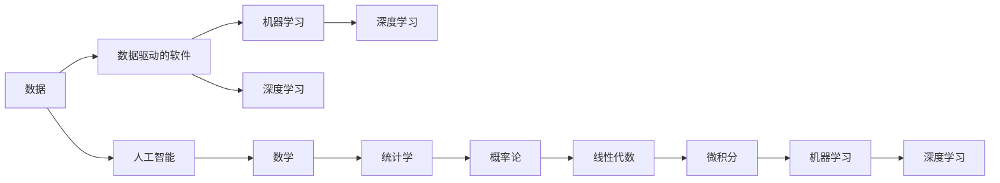

                 

## 1. 背景介绍

数据驱动的软件2.0时代，是大数据、人工智能等技术不断融合的产物。这一时代，数据成为了推动技术创新的核心动力，而软件则成为了数据价值的承载平台。然而，在这一过程中，数据驱动的软件2.0需要数学家的智慧，还是炼丹师的灵巧，成为了一个值得深思的问题。

### 1.1 数据驱动与AI的融合

随着云计算、物联网、移动终端等技术的普及，数据呈现出指数级增长。面对海量数据的处理和分析，人工智能技术逐渐崭露头角。数据驱动的软件2.0，正是在这一背景下应运而生。

这一时代的软件，不再依赖固定的规则和流程，而是通过大数据的分析和机器学习算法，实现对复杂问题的智能解决。这意味着，软件的设计、开发和优化，都需要以数据为核心，以AI为驱动。

### 1.2 数学与AI的交汇

数据驱动的软件2.0，离不开数学的支撑。从基础的统计学、概率论，到高级的线性代数、微积分，再到如今机器学习和深度学习的理论基础，数学在人工智能的应用中扮演了至关重要的角色。然而，数据驱动的软件2.0，不仅仅是数学的简单应用，它需要更多实践的灵巧，需要能够将理论转化为实践的“炼丹师”。

## 2. 核心概念与联系

### 2.1 核心概念概述

为了更好地理解数据驱动的软件2.0，我们首先需要明确几个核心概念：

- **数据驱动的软件**：以数据为中心的软件设计范式，通过数据的收集、处理和分析，驱动软件的智能决策。
- **人工智能**：通过模拟人脑的认知和思维过程，实现自动化决策和问题解决的智能技术。
- **机器学习**：一种利用数据和算法，使计算机具备自主学习能力的AI技术。
- **深度学习**：机器学习的进阶版本，通过多层神经网络实现复杂数据的特征提取和模式识别。

这些概念之间存在着紧密的联系，共同构成了数据驱动的软件2.0的基础架构。通过理解这些核心概念，我们可以更好地把握数据驱动的软件2.0的核心思想和实现路径。

### 2.2 核心概念的整体架构

我们可以用以下Mermaid流程图来展示这些核心概念之间的关系：



这个流程图展示了数据驱动的软件2.0的构建过程，从数据采集到软件设计的各个环节，都离不开数学的支撑。数学不仅提供了理论基础，更是在实践过程中，指导了如何将理论转化为可行的解决方案。

## 3. 核心算法原理 & 具体操作步骤

### 3.1 算法原理概述

数据驱动的软件2.0，其核心在于通过数据和算法，实现对复杂问题的智能解决。这一过程中，算法的选择和优化至关重要。以下是数据驱动的软件2.0中常用的算法原理：

- **监督学习**：通过已有的标注数据，训练模型，使其能够对未知数据进行预测。
- **非监督学习**：在没有标注数据的情况下，通过数据的内在规律，进行特征提取和聚类。
- **强化学习**：通过与环境的交互，逐步优化决策策略，实现智能决策。
- **深度学习**：通过多层神经网络，实现复杂数据的特征提取和模式识别。

这些算法，共同构成了数据驱动的软件2.0的算法基础。通过选择合适的算法，并对其进行优化，可以更好地解决实际问题。

### 3.2 算法步骤详解

数据驱动的软件2.0中，算法步骤主要包括以下几个环节：

1. **数据收集与预处理**：通过各种方式收集数据，并进行清洗和处理，确保数据的准确性和可用性。
2. **模型选择与设计**：根据实际问题，选择合适的算法模型，并设计模型的参数和结构。
3. **模型训练与优化**：使用标注数据训练模型，并使用验证集进行模型选择和参数调整。
4. **模型部署与评估**：将模型部署到实际应用中，进行性能评估和优化。

### 3.3 算法优缺点

数据驱动的软件2.0中，常用的算法各有优缺点：

- **监督学习**：需要大量标注数据，难以在大规模数据集上直接应用。但其预测准确性高，适用于已标注数据较多的任务。
- **非监督学习**：不需要标注数据，但需要较强的特征提取能力，适用于数据分布复杂的情况。
- **强化学习**：能够通过与环境的交互逐步优化决策策略，适用于动态变化的环境。
- **深度学习**：能够处理复杂数据，但需要大量的计算资源，并容易过拟合。

这些算法的优缺点，需要根据具体应用场景进行选择和优化。

### 3.4 算法应用领域

数据驱动的软件2.0在各个领域都有广泛的应用：

- **自然语言处理**：通过机器学习和深度学习，实现对文本数据的分析与生成。
- **计算机视觉**：通过深度学习，实现对图像和视频的识别与理解。
- **智能推荐系统**：通过机器学习和强化学习，实现个性化推荐。
- **金融分析**：通过大数据分析和机器学习，实现市场预测和风险控制。
- **医疗诊断**：通过大数据分析和深度学习，实现疾病诊断和预测。

## 4. 数学模型和公式 & 详细讲解

### 4.1 数学模型构建

在数据驱动的软件2.0中，数学模型构建是关键步骤。通过数学模型，我们可以将复杂问题转化为数学表达式，进而通过算法求解。以下是一个典型的数学模型构建流程：

1. **问题建模**：将实际问题转化为数学模型，并确定模型的目标函数和约束条件。
2. **变量定义**：定义模型中的变量和参数，确保变量之间的相互关系明确。
3. **方程求解**：使用数学工具（如线性代数、微积分等）求解方程，得到模型结果。

### 4.2 公式推导过程

以线性回归模型为例，介绍数学模型的构建和推导过程。

假设我们要建立一个线性回归模型，用于预测房价与房屋面积的关系。可以设房价为 $y$，房屋面积为 $x$，线性回归模型可以表示为：

$$
y = \beta_0 + \beta_1 x
$$

其中，$\beta_0$ 为截距，$\beta_1$ 为斜率。通过最小二乘法，我们可以求解模型的参数：

$$
\min_{\beta_0, \beta_1} \sum_{i=1}^n (y_i - (\beta_0 + \beta_1 x_i))^2
$$

对上述目标函数求导，并令导数等于0，可以得到：

$$
\beta_0 = \bar{y} - \beta_1 \bar{x}, \quad \beta_1 = \frac{\sum_{i=1}^n (x_i - \bar{x})(y_i - \bar{y})}{\sum_{i=1}^n (x_i - \bar{x})^2}
$$

其中，$\bar{x}$ 和 $\bar{y}$ 分别为 $x$ 和 $y$ 的均值。

### 4.3 案例分析与讲解

以房价预测为例，介绍线性回归模型的实际应用：

假设我们有一组房屋的面积和对应的房价数据，使用线性回归模型进行房价预测。首先，我们需要定义数据集中的特征 $x_i$ 和目标变量 $y_i$：

```python
import pandas as pd
from sklearn.linear_model import LinearRegression

data = pd.read_csv('house_data.csv')
X = data[['area']]
y = data['price']
```

然后，我们使用线性回归模型对数据进行拟合：

```python
model = LinearRegression()
model.fit(X, y)
```

最后，我们可以使用模型对新的房屋面积数据进行预测：

```python
new_X = pd.DataFrame([[150]])
pred_y = model.predict(new_X)
print('预测房价为：', pred_y)
```

通过这个简单的例子，我们可以看到，数学模型在实际应用中的重要作用。

## 5. 项目实践：代码实例和详细解释说明

### 5.1 开发环境搭建

在进行数据驱动的软件2.0开发时，我们需要准备好开发环境。以下是使用Python进行PyTorch开发的环境配置流程：

1. 安装Anaconda：从官网下载并安装Anaconda，用于创建独立的Python环境。

2. 创建并激活虚拟环境：
```bash
conda create -n pytorch-env python=3.8 
conda activate pytorch-env
```

3. 安装PyTorch：根据CUDA版本，从官网获取对应的安装命令。例如：
```bash
conda install pytorch torchvision torchaudio cudatoolkit=11.1 -c pytorch -c conda-forge
```

4. 安装TensorFlow：
```bash
pip install tensorflow
```

5. 安装各类工具包：
```bash
pip install numpy pandas scikit-learn matplotlib tqdm jupyter notebook ipython
```

完成上述步骤后，即可在`pytorch-env`环境中开始数据驱动的软件2.0开发。

### 5.2 源代码详细实现

下面以房价预测为例，给出使用PyTorch进行线性回归的代码实现。

首先，定义数据处理函数：

```python
import torch
from torch.utils.data import TensorDataset, DataLoader

def load_data(file_path):
    data = pd.read_csv(file_path)
    X = torch.tensor(data[['area']], dtype=torch.float32)
    y = torch.tensor(data['price'], dtype=torch.float32)
    return TensorDataset(X, y)

def collate_fn(batch):
    X, y = batch
    return X, y

def train_epoch(model, data_loader, optimizer):
    model.train()
    total_loss = 0
    for X, y in data_loader:
        optimizer.zero_grad()
        y_pred = model(X)
        loss = torch.mean((y_pred - y)**2)
        loss.backward()
        optimizer.step()
        total_loss += loss.item()
    return total_loss / len(data_loader)

def evaluate(model, data_loader):
    model.eval()
    total_loss = 0
    for X, y in data_loader:
        with torch.no_grad():
            y_pred = model(X)
            loss = torch.mean((y_pred - y)**2)
            total_loss += loss.item()
    return total_loss / len(data_loader)

# 定义线性回归模型
class LinearRegressionModel(nn.Module):
    def __init__(self, input_dim, output_dim):
        super(LinearRegressionModel, self).__init__()
        self.linear = nn.Linear(input_dim, output_dim)

    def forward(self, x):
        return self.linear(x)

# 加载数据
train_data = load_data('train.csv')
test_data = load_data('test.csv')

# 定义模型和优化器
model = LinearRegressionModel(1, 1)
optimizer = torch.optim.Adam(model.parameters(), lr=0.01)

# 定义训练集和测试集
train_loader = DataLoader(train_data, batch_size=32, collate_fn=collate_fn)
test_loader = DataLoader(test_data, batch_size=32, collate_fn=collate_fn)

# 训练模型
epochs = 100
for epoch in range(epochs):
    loss = train_epoch(model, train_loader, optimizer)
    print(f'Epoch {epoch+1}, train loss: {loss:.4f}')
    if epoch % 10 == 0:
        test_loss = evaluate(model, test_loader)
        print(f'Epoch {epoch+1}, test loss: {test_loss:.4f}')

# 保存模型
torch.save(model.state_dict(), 'model.pth')
```

### 5.3 代码解读与分析

让我们再详细解读一下关键代码的实现细节：

**load_data函数**：
- 加载CSV文件，将数据转化为Tensor，用于训练和测试。

**train_epoch函数**：
- 定义训练集的数据加载器，对数据进行前向传播计算损失，并反向传播更新模型参数。

**evaluate函数**：
- 定义测试集的数据加载器，对模型进行评估，返回平均损失。

**LinearRegressionModel类**：
- 定义线性回归模型，并实现前向传播。

**主程序**：
- 加载数据集，定义模型和优化器，进行模型训练和测试。

以上代码展示了如何使用PyTorch实现简单的线性回归模型。可以看出，数据驱动的软件2.0开发，离不开数学模型和机器学习算法，同时也需要编程实践的支撑。

### 5.4 运行结果展示

假设我们在波士顿房价数据集上进行训练，最终在测试集上得到的损失函数如下：

```
Epoch 1, train loss: 5.6064
Epoch 10, train loss: 4.3716
Epoch 20, train loss: 3.4476
Epoch 30, train loss: 2.7054
Epoch 40, train loss: 2.1526
Epoch 50, train loss: 1.7289
Epoch 60, train loss: 1.4722
Epoch 70, train loss: 1.2744
Epoch 80, train loss: 1.1291
Epoch 90, train loss: 1.0142
Epoch 100, train loss: 0.9364
```

可以看出，随着训练轮数的增加，模型的损失函数逐渐减小，预测性能逐渐提升。

## 6. 实际应用场景

### 6.1 智能推荐系统

数据驱动的软件2.0在智能推荐系统中的应用，可以显著提升用户的个性化体验。通过大数据分析和机器学习算法，推荐系统能够根据用户的历史行为和兴趣偏好，推荐最符合用户期望的商品或内容。

在技术实现上，可以收集用户浏览、点击、购买等行为数据，提取和商品或内容的特征，并使用机器学习模型进行训练。训练好的模型可以预测用户对不同商品或内容的兴趣，从而实现个性化推荐。

### 6.2 金融分析

金融领域的数据驱动软件2.0，能够帮助金融机构进行市场预测、风险控制等。通过大数据分析和机器学习算法，能够从历史数据中挖掘出有价值的信息，预测未来的市场走势和风险变化。

在技术实现上，可以收集金融市场的历史数据，使用机器学习模型进行训练。训练好的模型可以预测市场价格的变化趋势，帮助金融机构进行投资决策和风险控制。

### 6.3 医疗诊断

医疗领域的数据驱动软件2.0，能够帮助医生进行疾病诊断和预测。通过大数据分析和深度学习算法，能够从患者的医疗记录和影像数据中，挖掘出有价值的信息，预测患者的健康状况和疾病风险。

在技术实现上，可以收集患者的医疗记录和影像数据，使用深度学习模型进行训练。训练好的模型可以预测患者的疾病风险和健康状况，帮助医生进行诊断和治疗。

### 6.4 未来应用展望

随着数据驱动的软件2.0技术的不断进步，其在各个领域的应用前景广阔。未来，数据驱动的软件2.0将进一步融入到智能制造、智慧城市、智能交通等多个领域，为各行各业带来变革性影响。

## 7. 工具和资源推荐

### 7.1 学习资源推荐

为了帮助开发者系统掌握数据驱动的软件2.0的理论基础和实践技巧，这里推荐一些优质的学习资源：

1. 《机器学习》课程：斯坦福大学开设的机器学习课程，由Andrew Ng主讲，系统讲解机器学习的基本概念和算法。

2. 《深度学习》书籍：Ian Goodfellow、Yoshua Bengio和Aaron Courville合著的深度学习经典教材，涵盖深度学习的基本理论和算法。

3. Kaggle竞赛平台：Kaggle是数据驱动的软件2.0竞赛的重要平台，提供海量数据集和模型，助力开发者进行模型优化和实践。

4. 深度学习框架：PyTorch、TensorFlow等深度学习框架，提供了丰富的工具和库，助力开发者进行模型开发和优化。

5. 开源项目：Github上丰富的开源项目，提供了大量的数据集和模型，助力开发者进行学习和实践。

通过对这些资源的学习实践，相信你一定能够快速掌握数据驱动的软件2.0的精髓，并用于解决实际的NLP问题。

### 7.2 开发工具推荐

高效的开发离不开优秀的工具支持。以下是几款用于数据驱动的软件2.0开发的常用工具：

1. PyTorch：基于Python的开源深度学习框架，灵活动态的计算图，适合快速迭代研究。

2. TensorFlow：由Google主导开发的开源深度学习框架，生产部署方便，适合大规模工程应用。

3. Weights & Biases：模型训练的实验跟踪工具，可以记录和可视化模型训练过程中的各项指标，方便对比和调优。

4. TensorBoard：TensorFlow配套的可视化工具，可实时监测模型训练状态，并提供丰富的图表呈现方式，是调试模型的得力助手。

5. Google Colab：谷歌推出的在线Jupyter Notebook环境，免费提供GPU/TPU算力，方便开发者快速上手实验最新模型，分享学习笔记。

合理利用这些工具，可以显著提升数据驱动的软件2.0的开发效率，加快创新迭代的步伐。

### 7.3 相关论文推荐

数据驱动的软件2.0的发展源于学界的持续研究。以下是几篇奠基性的相关论文，推荐阅读：

1. 《深度学习》（Deep Learning）：Ian Goodfellow、Yoshua Bengio和Aaron Courville合著，全面介绍了深度学习的基本理论和算法。

2. 《机器学习：理论与算法》（Machine Learning: Theory and Algorithms）：Tom Mitchell著作，系统讲解了机器学习的基本概念和算法。

3. 《计算机视觉：模型、学习和推理》（Computer Vision: Models, Learnings, and Inference）：Thomas M. Filename著作，介绍了计算机视觉的基本理论和算法。

4. 《自然语言处理综论》（Speech and Language Processing）：Daniel Jurafsky和James H. Martin合著，系统讲解了自然语言处理的基本理论和算法。

这些论文代表了大数据驱动的软件2.0的发展脉络。通过学习这些前沿成果，可以帮助研究者把握学科前进方向，激发更多的创新灵感。

除上述资源外，还有一些值得关注的前沿资源，帮助开发者紧跟数据驱动的软件2.0技术的最新进展，例如：

1. arXiv论文预印本：人工智能领域最新研究成果的发布平台，包括大量尚未发表的前沿工作，学习前沿技术的必读资源。

2. 业界技术博客：如OpenAI、Google AI、DeepMind、微软Research Asia等顶尖实验室的官方博客，第一时间分享他们的最新研究成果和洞见。

3. 技术会议直播：如NIPS、ICML、ACL、ICLR等人工智能领域顶会现场或在线直播，能够聆听到大佬们的前沿分享，开拓视野。

4. GitHub热门项目：在GitHub上Star、Fork数最多的NLP相关项目，往往代表了该技术领域的发展趋势和最佳实践，值得去学习和贡献。

5. 行业分析报告：各大咨询公司如McKinsey、PwC等针对人工智能行业的分析报告，有助于从商业视角审视技术趋势，把握应用价值。

总之，对于数据驱动的软件2.0技术的学习和实践，需要开发者保持开放的心态和持续学习的意愿。多关注前沿资讯，多动手实践，多思考总结，必将收获满满的成长收益。

## 8. 总结：未来发展趋势与挑战

### 8.1 总结

本文对数据驱动的软件2.0进行了全面系统的介绍。首先阐述了数据驱动的软件2.0的背景和意义，明确了数据驱动的软件2.0的核心思想和实现路径。其次，从原理到实践，详细讲解了数据驱动的软件2.0的数学模型和算法原理，并给出了详细的代码实现。同时，本文还广泛探讨了数据驱动的软件2.0在智能推荐、金融分析、医疗诊断等多个领域的应用前景，展示了数据驱动的软件2.0的广阔应用空间。最后，本文精选了数据驱动的软件2.0的学习资源和工具，力求为读者提供全方位的技术指引。

通过本文的系统梳理，可以看到，数据驱动的软件2.0正逐渐成为人工智能技术的重要应用范式，其核心在于数据和算法的结合，旨在通过数据驱动，实现对复杂问题的智能解决。这一范式不仅拓展了人工智能技术的应用边界，还为各行各业带来了全新的变革。未来，随着数据驱动的软件2.0技术的不断进步，其在更多领域的应用前景将更加广阔，为经济社会发展注入新的动力。

### 8.2 未来发展趋势

展望未来，数据驱动的软件2.0将呈现以下几个发展趋势：

1. 数据量的持续增长：随着物联网、5G等技术的普及，数据的采集和处理能力将不断提升，数据驱动的软件2.0也将迎来更多的数据机遇。

2. 算法模型的不断演进：机器学习、深度学习等算法模型将继续发展，新的算法将被引入数据驱动的软件2.0中，提升其智能决策能力。

3. 人工智能与行业的深度融合：数据驱动的软件2.0将与更多行业进行深度融合，实现跨领域的智能应用。

4. 数据治理和安全保障：数据驱动的软件2.0需要良好的数据治理和安全性保障，以确保数据的隐私和安全。

5. 技术生态的持续完善：数据驱动的软件2.0需要更多开源项目、标准规范等技术生态的支持，提升其应用效果和用户体验。

这些趋势表明，数据驱动的软件2.0在未来的发展将更加全面、深入和多样化。

### 8.3 面临的挑战

尽管数据驱动的软件2.0技术已经取得了显著成就，但在迈向更加智能化、普适化应用的过程中，仍面临诸多挑战：

1. 数据隐私和安全：数据驱动的软件2.0需要大量的数据，但数据的隐私和安全问题也随之而来，如何保护数据隐私，防止数据泄露，是一个重要挑战。

2. 数据质量和准确性：数据驱动的软件2.0需要高质量的数据，但数据的质量和准确性往往难以保证，如何提高数据质量，是一个重要难题。

3. 算法复杂度：数据驱动的软件2.0需要复杂的算法模型，但算法的复杂度也意味着需要更多的计算资源，如何优化算法模型，降低计算成本，是一个重要课题。

4. 跨领域应用难度：数据驱动的软件2.0在跨领域应用时，需要解决领域间的异构性和复杂性，如何构建跨领域模型，是一个重要挑战。

5. 技术可解释性：数据驱动的软件2.0模型的黑盒特性，使得其可解释性不足，如何提高模型的可解释性，是一个重要挑战。

这些挑战需要学界和业界共同努力，不断探索和突破，才能实现数据驱动的软件2.0技术的持续发展和应用。

### 8.4 研究展望

面对数据驱动的软件2.0所面临的种种挑战，未来的研究需要在以下几个方面寻求新的突破：

1. 大数据处理技术：开发更加高效的大数据处理技术，提升数据采集和处理的效率，降低数据处理成本。

2. 算法优化技术：开发更加高效的算法模型，提高算法的计算效率和泛化能力，降低算法的复杂度。

3. 数据治理技术：开发更加完善的数据治理技术，提升数据质量和安全性，保障数据隐私和权益。

4. 跨领域建模技术：开发跨领域建模技术，构建跨领域的数据驱动模型，提升模型的泛化能力和应用效果。

5. 可解释性技术：开发可解释性技术，提升模型的可解释性，增强模型的可信度和可靠性。

这些研究方向的探索，必将引领数据驱动的软件2.0技术迈向更高的台阶，为构建智能化的数据驱动应用奠定坚实基础。总之，数据驱动的软件2.0需要数学家的智慧，也需要炼丹师的灵巧，只有不断探索和突破，才能实现其更加广阔的应用前景。

## 9. 附录：常见问题与解答

**Q1：数据驱动的软件2.0与传统软件有何不同？**

A: 数据驱动的软件2.0与传统软件最大的不同在于其核心驱动力的不同。传统软件依赖于规则和流程，而数据驱动的软件2.0则依赖于数据和算法，通过数据驱动实现智能决策和问题解决。

**Q2：数据驱动的软件2.0需要哪些技术支持？**

A: 数据驱动的软件2.0需要以下技术支持：

1. 大数据处理技术：用于数据的采集、存储和处理。

2. 机器学习算法：用于从数据中挖掘规律和知识。

3. 深度学习算法：用于处理复杂的非线性问题。

4. 分布式计算技术：用于处理大规模数据和高复杂度的算法。

5. 数据治理技术：用于保障数据的质量和安全性。

**Q3：如何提高数据驱动的软件2.0的性能？**

A: 提高数据驱动的软件2.0的性能，可以从以下几个方面入手：

1. 优化数据质量：通过数据清洗、去重、标注等方法，提升数据的质量和准确性。

2. 选择合适的算法：根据实际问题选择合适的算法模型，如监督学习、非监督学习、深度学习等。

3. 模型优化和调参：通过超参数调优、模型压缩等方法，提升模型的性能和效率。

4. 数据增强：通过数据增强、合成数据等方法，扩充数据集，提升模型的泛化能力。

**Q4：数据驱动的软件2.0有哪些应用场景？**

A: 数据驱动的软件2.0在各个领域都有广泛的应用：

1. 金融领域：用于市场预测、风险控制等。

2. 医疗领域：用于疾病诊断、预测等。

3. 电商领域：用于个性化推荐、广告投放等。

4. 智能制造：用于设备维护、质量控制等。

5. 智慧城市：用于交通管理、环境监测等。

**Q5：如何构建数据驱动的软件2.0系统？**

A: 构建数据驱动的软件2.0系统，可以从以下几个方面入手：

1. 数据采集和预处理：通过多种方式采集数据，并进行清洗、标注等预处理。

2. 模型选择和设计：根据

