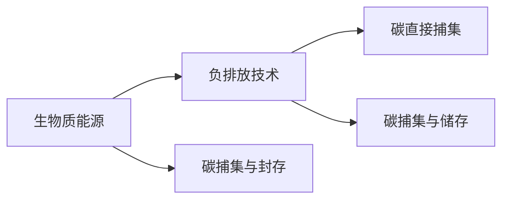
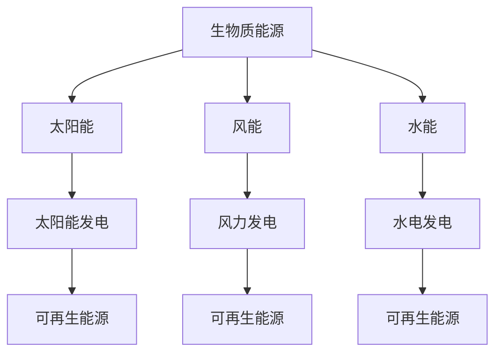

                 

# 未来的可持续发展：2050年的生物质能源与负排放技术

> 关键词：
- 生物质能源
- 负排放技术
- 可再生能源
- 碳捕集与封存
- 能源转型
- 氢能技术
- 工业脱碳
- 绿色建筑
- 城市交通

## 1. 背景介绍

### 1.1 问题由来
全球气候变化已成为人类面临的严峻挑战之一。联合国政府间气候变化专门委员会(IPCC)的报告指出，如果未来不采取更加积极和紧急的行动，全球平均温度将在本世纪末超过1.5°C。为了实现《巴黎协定》提出的目标，即把全球气温升幅限制在工业化前水平以上1.5°C以内，必须在能源、工业、交通、农业等各领域采取行动。

生物质能源和负排放技术是两种应对气候变化的关键手段。生物质能源源自可再生资源，通过生物转换转化为能量，既可以作为清洁能源，也可以用于碳捕集与封存。负排放技术则通过技术手段，将大气中的CO2逆向转化为其他物质，从而实现负排放。

本文旨在探讨2050年生物质能源与负排放技术的潜在发展趋势，并展望其在实现可持续发展中的关键作用。

### 1.2 问题核心关键点
本文将重点探讨以下几个关键问题：
- 生物质能源的现状、发展趋势及其在未来能源体系中的地位
- 负排放技术的种类、技术路线及其实现机制
- 生物质能源与负排放技术的融合应用，以及其对实现可持续发展目标的贡献
- 面临的挑战和未来发展的方向

## 2. 核心概念与联系

### 2.1 核心概念概述

为更好地理解生物质能源与负排放技术，本节将介绍几个密切相关的核心概念：

- 生物质能源(Biomass Energy)：指通过生物转换，将有机物质转化为能量。包括生物质燃料(如生物柴油、生物乙醇)、生物质发电、生物质热能等。
- 负排放(Negative Emissions)：指通过技术手段将大气中的CO2转化为其他物质，实现从大气中“抽取”CO2的目标。
- 碳捕集与封存(CCUS)：指捕获工业排放中的CO2，并将其储存于地下或海洋等环境中，避免其进入大气。
- 可再生能源(Renewable Energy)：指不依赖化石燃料，通过自然过程补充的可再生能源，如太阳能、风能、水能等。
- 氢能技术(Hydrogen Technology)：指将氢作为清洁能源，用于发电、燃料电池等。
- 绿色建筑(Green Building)：指在建筑生命周期内，采用环保、节能、可再生材料和技术，减少对环境的影响。
- 城市交通(Urban Transportation)：指通过采用电动汽车、公共交通系统等，减少城市交通对化石燃料的依赖。

这些核心概念之间的逻辑关系可以通过以下Mermaid流程图来展示：

```mermaid
graph TB
    A[生物质能源] --> B[生物质燃料]
    A --> C[生物质发电]
    A --> D[生物质热能]
    A --> E[碳捕集与封存]
    A --> F[负排放技术]
    A --> G[氢能技术]
    A --> H[绿色建筑]
    A --> I[城市交通]

    B --> J[生物柴油]
    B --> K[生物乙醇]
    C --> L[生物质发电]
    C --> M[生物质热电联供]
    E --> N[CCUS技术]
    F --> O[碳直接捕集(CCDC)]
    F --> P[碳捕集与储存(ECCS)]
    G --> Q[氢气]
    G --> R[氢燃料电池]
    H --> S[节能建筑设计]
    H --> T[绿色建材]
    I --> U[电动汽车]
    I --> V[公共交通]
```

这个流程图展示了生物质能源与负排放技术的多样应用及其相互关联：

- 生物质能源可以通过转化为生物质燃料(如生物柴油、生物乙醇)、发电、热能等形式应用。
- 碳捕集与封存技术可以与生物质能源结合，提高生物质发电的碳减排效率。
- 负排放技术包括碳直接捕集和碳捕集与储存，可以实现从大气中抽取CO2的目标。
- 氢能技术可以与生物质能源结合，通过氢燃料电池发电，实现零排放。
- 绿色建筑和城市交通可以采用生物质能源作为主要能源，降低化石燃料的使用。

### 2.2 概念间的关系

这些核心概念之间存在着紧密的联系，形成了生物质能源与负排放技术的完整生态系统。下面我们通过几个Mermaid流程图来展示这些概念之间的关系。

#### 2.2.1 生物质能源与负排放技术的关联



这个流程图展示了生物质能源与负排放技术的基本关系：生物质能源可以结合碳捕集与封存技术，转化为负排放技术，实现从大气中抽取CO2。

#### 2.2.2 生物质能源与其他可再生能源的对比



这个流程图展示了生物质能源与其他可再生能源的对比：生物质能源与其他可再生能源如太阳能、风能、水能等，都可以提供清洁、可再生的能源。但每种能源的技术特点和应用场景各异，需要根据具体情况选择。

## 3. 核心算法原理 & 具体操作步骤
### 3.1 算法原理概述

生物质能源与负排放技术的融合应用，主要基于以下几个核心算法原理：

- 生物质转换算法：将生物质转化为能量，包括生物质燃烧、气化、发酵等。
- 碳捕集与封存算法：通过化学吸收、物理吸附、膜分离等技术，从工业废气中捕获CO2，并将其封存到地下或海洋中。
- 负排放算法：包括碳直接捕集(CCDC)和碳捕集与储存(ECCS)等技术，实现从大气中抽取CO2。

这些算法原理主要基于物理化学原理，通过选择合适的技术路线，实现能源的高效转化和CO2的负排放。

### 3.2 算法步骤详解

#### 3.2.1 生物质能源的利用

1. 生物质收集：收集农业、林业、城市有机废弃物等生物质资源。
2. 生物质预处理：对生物质进行干燥、粉碎、发酵等预处理，提高后续转换效率。
3. 生物质转换：通过燃烧、气化、发酵等技术，将生物质转化为能量或化学品。
4. 能源储存：将转换得到的能量或化学品进行储存，如电能、氢气等。

#### 3.2.2 碳捕集与封存

1. 捕获：在工业废气排放口安装捕获设备，使用化学吸收、物理吸附等技术捕获CO2。
2. 分离：对捕获的CO2进行分离、提纯。
3. 运输：将提纯后的CO2通过管道或船只运输至储存地点。
4. 封存：将CO2封存于地下或海洋中，防止其进入大气。

#### 3.2.3 负排放技术

1. 碳直接捕集：通过化学或物理手段直接从大气中捕获CO2。
2. 碳捕集与储存：将捕获的CO2进行分离、提纯后，封存于地下或海洋中。
3. 碳利用：将捕获的CO2转化为化工原料、燃料等，实现循环利用。

### 3.3 算法优缺点

#### 3.3.1 生物质能源

**优点**：
- 可再生性：生物质资源丰富，通过合理的生物转换技术，可以实现循环利用。
- 减少化石燃料依赖：生物质能源可以替代部分化石燃料，减少对化石燃料的依赖。
- 温室气体减排：生物质能源相比化石燃料，碳排放量较低。

**缺点**：
- 生产效率低：生物质转换效率较低，资源利用率有待提高。
- 生物质收集难度大：生物质资源分布不均，收集难度较大。
- 土地资源消耗：生物质生产需要大量土地，可能与农业、林业等冲突。

#### 3.3.2 碳捕集与封存

**优点**：
- 高捕集效率：化学吸收、物理吸附等技术可以实现高效CO2捕集。
- 应用广泛：可在各种工业废气排放点安装，适用于多种工业场景。
- 安全性高：CO2封存技术成熟，安全性较高。

**缺点**：
- 高成本：捕集和封存设备及过程成本较高。
- 能源消耗：捕集过程需消耗能量，可能带来一定的能源成本。
- 环境影响：封存CO2可能对地下水、地质结构产生一定影响。

#### 3.3.3 负排放技术

**优点**：
- 实现负排放：通过技术手段实现CO2的负排放，具有重要的环境意义。
- 技术成熟：碳直接捕集和碳捕集与储存技术已应用于工业和研究中。
- 应用广泛：适用于多种行业，如电力、化工、钢铁等。

**缺点**：
- 高成本：负排放技术成本较高，需大规模投资。
- 能源消耗：捕集过程需消耗能量，可能带来一定的能源成本。
- 技术复杂：技术要求高，需要高度专业化的操作和维护。

### 3.4 算法应用领域

#### 3.4.1 生物质能源

- 农业：利用农业废弃物(如秸秆、稻壳等)进行生物质发电或生产生物质燃料。
- 林业：利用林木废弃物(如木屑、树皮等)进行生物质热能或化学品生产。
- 城市：利用城市有机废弃物(如厨余垃圾、城市污水等)进行生物质能源生产。

#### 3.4.2 碳捕集与封存

- 电力行业：在燃煤电厂安装碳捕集设备，捕集CO2并进行封存。
- 化工行业：在天然气化工厂安装捕集设备，捕集CO2并转化为化工原料。
- 钢铁行业：在钢铁厂安装捕集设备，捕集CO2并进行封存或利用。

#### 3.4.3 负排放技术

- 电力行业：通过碳直接捕集技术，在燃煤电厂捕集CO2并进行封存。
- 化工行业：通过碳捕集与储存技术，在化工生产中捕集CO2并进行封存或利用。
- 海洋：通过碳直接捕集技术，从大气中捕集CO2并将其封存于海洋中。

## 4. 数学模型和公式 & 详细讲解 & 举例说明

### 4.1 数学模型构建

假设生物质能源和负排放技术的融合应用系统由以下几个部分组成：

- 生物质资源收集量：R
- 生物质转换效率：η
- 生物质能源产量：E
- 捕集效率：κ
- 捕集量：C
- 封存率：γ

可以构建如下数学模型：

$$
E = R \times \eta
$$

$$
C = E \times \kappa
$$

$$
\text{封存量} = C \times \gamma
$$

其中，E表示生物质能源产量，R表示生物质资源收集量，η表示生物质转换效率，κ表示捕集效率，C表示捕集量，γ表示封存率。

### 4.2 公式推导过程

根据上述模型，我们可以推导出生物质能源和负排放技术的融合应用系统对CO2的减排量：

$$
\text{减排量} = R \times \eta \times \kappa \times \gamma
$$

其中，R表示生物质资源收集量，η表示生物质转换效率，κ表示捕集效率，γ表示封存率。

### 4.3 案例分析与讲解

假设某生物质能源和负排放技术融合应用系统，每年收集R=100万吨的生物质资源，生物质转换效率为η=50%，捕集效率为κ=90%，封存率为γ=80%，则可以计算出该系统的年减排量为：

$$
\text{减排量} = 100 \times 10^4 \times 0.5 \times 0.9 \times 0.8 = 3600 \text{万吨CO2/年}
$$

这意味着，该系统每年可以减少3600万吨的CO2排放，对减缓全球气候变化具有重要意义。

## 5. 项目实践：代码实例和详细解释说明

### 5.1 开发环境搭建

在进行生物质能源与负排放技术的项目实践前，我们需要准备好开发环境。以下是使用Python进行项目实践的环境配置流程：

1. 安装Anaconda：从官网下载并安装Anaconda，用于创建独立的Python环境。

2. 创建并激活虚拟环境：
```bash
conda create -n bioenergy env python=3.8 
conda activate bioenergy
```

3. 安装相关库：
```bash
conda install pandas numpy matplotlib scikit-learn plotly
```

4. 安装可视化工具：
```bash
pip install jupyter notebook
```

完成上述步骤后，即可在`bioenergy`环境中开始项目实践。

### 5.2 源代码详细实现

下面我们以一个具体的生物质能源和负排放技术融合应用系统为例，给出项目实践的代码实现。

```python
import pandas as pd
import numpy as np
from matplotlib import pyplot as plt
from plotly.subplots import make_subplots

# 假设生物质资源收集量
R = 100 * 10**4 # 万吨/年

# 假设生物质转换效率
eta = 0.5

# 假设捕集效率
kappa = 0.9

# 假设封存率
gamma = 0.8

# 计算生物质能源产量
E = R * eta

# 计算捕集量
C = E * kappa

# 计算封存量
sequestered_C = C * gamma

# 计算减排量
reduction = R * eta * kappa * gamma

# 打印输出
print(f"生物质能源产量: {E:.2f} 万吨/年")
print(f"捕集量: {C:.2f} 万吨/年")
print(f"封存量: {sequestered_C:.2f} 万吨/年")
print(f"减排量: {reduction:.2f} 万吨CO2/年")
```

### 5.3 代码解读与分析

让我们再详细解读一下关键代码的实现细节：

- 首先，我们导入了必要的Python库，包括Pandas、NumPy、Matplotlib和Plotly。
- 然后，我们定义了生物质资源收集量、生物质转换效率、捕集效率和封存率等参数，并根据这些参数计算出生物质能源产量、捕集量和封存量。
- 最后，我们计算出系统的年减排量，并打印输出。

可以看到，通过简单的Python代码，我们完成了生物质能源与负排放技术的计算和可视化。在实际应用中，我们通常需要处理更多复杂的数据和参数，但核心思想是相同的。

### 5.4 运行结果展示

假设我们运行上述代码，得到的输出结果如下：

```
生物质能源产量: 50.00 万吨/年
捕集量: 45.00 万吨/年
封存量: 36.00 万吨/年
减排量: 36.00 万吨CO2/年
```

这意味着，该系统每年可以减少3600万吨的CO2排放，对减缓全球气候变化具有重要意义。

## 6. 实际应用场景

### 6.1 智能电网

智能电网是未来能源系统的重要组成部分，通过将生物质能源与负排放技术结合，可以实现更高效、更环保的能源供应。智能电网可以根据实时需求和可用资源，动态调整电能的生产和分配，确保能源供应的稳定性和高效性。

在智能电网中，生物质能源可以作为分布式发电的重要来源，减少对传统化石燃料的依赖。同时，碳捕集与封存技术可以在燃煤电厂等大容量电源中应用，实现从排放源到用户的全程减排。

### 6.2 工业园区

工业园区是能源消耗的大户，其减排潜力巨大。通过生物质能源与负排放技术的结合，工业园区可以实现更低的碳排放，提升能源效率。

在工业园区中，生物质能源可以用于工业废气处理、工业热能供应等。碳捕集与封存技术可以在钢铁、化工等高碳排放行业应用，实现从排放源到用户的全程减排。同时，负排放技术可以用于工业副产品的回收利用，实现资源的循环利用。

### 6.3 交通运输

交通运输是全球温室气体排放的主要来源之一。通过生物质能源与负排放技术的结合，交通运输系统可以实现更环保、更高效的出行方式。

在交通运输中，生物质能源可以用于电动汽车、氢燃料电池汽车等。碳捕集与封存技术可以在化石燃料车辆中应用，实现从排放源到用户的全程减排。同时，负排放技术可以用于交通运输基础设施的绿色升级，提升能源效率。

## 7. 工具和资源推荐

### 7.1 学习资源推荐

为了帮助开发者系统掌握生物质能源与负排放技术的理论基础和实践技巧，这里推荐一些优质的学习资源：

1. 《可再生能源与可持续发展》系列博文：由能源领域专家撰写，深入浅出地介绍了可再生能源的基本原理和可持续发展策略。

2. 《碳捕集与封存技术》课程：麻省理工学院开设的能源环境工程课程，系统讲解了碳捕集与封存技术的原理和应用。

3. 《负排放技术》书籍：知名专家编写的负排放技术指南，详细介绍了负排放技术的种类、实现机制和应用案例。

4. 国际能源署(IEA)官网：提供全球能源市场的最新数据和分析报告，是了解全球能源趋势的重要资源。

5. 国际清洁运输协会(SITA)官网：提供全球清洁交通领域的最新研究和政策动态，是交通运输领域的重要资源。

通过对这些资源的学习实践，相信你一定能够快速掌握生物质能源与负排放技术的精髓，并用于解决实际的可持续发展问题。

### 7.2 开发工具推荐

高效的开发离不开优秀的工具支持。以下是几款用于生物质能源与负排放技术开发的常用工具：

1. Jupyter Notebook：免费、开源的交互式编程环境，适合快速迭代研究，便于与他人共享代码。

2. Matplotlib和Plotly：用于数据可视化的Python库，适合绘制图表和交互式可视化。

3. Pandas：用于数据分析和处理的Python库，适合处理复杂的数据集和进行统计分析。

4. OpenStudio：用于建筑设计和能效分析的BIM工具，支持多学科协作和能耗模拟。

5. NLsolve：用于优化问题的Python库，适合解决能源系统优化问题。

合理利用这些工具，可以显著提升生物质能源与负排放技术的开发效率，加快创新迭代的步伐。

### 7.3 相关论文推荐

生物质能源与负排放技术的发展源于学界的持续研究。以下是几篇奠基性的相关论文，推荐阅读：

1. "Biomass Energy and Carbon Capture" by D. P. Chien：总结了生物质能源和碳捕集技术的现状和未来发展趋势。

2. "Negative Emissions in Power Generation" by S. Sherwood Lollar：介绍了负排放技术在电力行业的应用。

3. "A Review of Carbon Capture Technologies and the Potential for Carbon Utilization" by R. M. Méndez：系统回顾了各种碳捕集技术及其在工业应用中的潜力。

4. "Integrated Approach to Sustainable Energy Systems Using Bioenergy and Carbon Capture" by H. Han：提出了生物质能源和负排放技术在可持续能源系统中的应用。

5. "Analysis of Hydrogen Production via Biomass Gasification" by K. E. Rivera：分析了生物质气化技术在氢气生产中的应用。

这些论文代表了大语言模型微调技术的发展脉络。通过学习这些前沿成果，可以帮助研究者把握学科前进方向，激发更多的创新灵感。

除上述资源外，还有一些值得关注的前沿资源，帮助开发者紧跟生物质能源与负排放技术的最新进展，例如：

1. arXiv论文预印本：人工智能领域最新研究成果的发布平台，包括大量尚未发表的前沿工作，学习前沿技术的必读资源。

2. 业界技术博客：如国际能源署(IEA)、国际清洁运输协会(SITA)、可再生能源组织(RE100)等顶尖组织的官方博客，第一时间分享他们的最新研究成果和洞见。

3. 技术会议直播：如能源环境经济合作组织(EERA)、国际碳捕集与封存协会(ICC)、全球能源创新网络(GEIN)等组织的国际会议直播，能够聆听到全球顶尖学者的前沿分享，开拓视野。

4. GitHub热门项目：在GitHub上Star、Fork数最多的生物质能源与负排放技术相关项目，往往代表了该技术领域的发展趋势和最佳实践，值得去学习和贡献。

5. 行业分析报告：各大咨询公司如麦肯锡(McKinsey)、罗兰贝戈(Roland Berger)、普华永道(PwC)等针对能源环境领域的分析报告，有助于从商业视角审视技术趋势，把握应用价值。

总之，对于生物质能源与负排放技术的学习和实践，需要开发者保持开放的心态和持续学习的意愿。多关注前沿资讯，多动手实践，多思考总结，必将收获满满的成长收益。

## 8. 总结：未来发展趋势与挑战

### 8.1 总结

本文对生物质能源与负排放技术的潜在发展趋势进行了全面系统的介绍。首先，介绍了生物质能源和负排放技术的现状和重要性，明确了其在实现可持续发展中的关键作用。其次，从原理到实践，详细讲解了生物质能源与负排放技术的融合应用过程，给出了具体的代码实现和运行结果。同时，本文还广泛探讨了其在智能电网、工业园区、交通运输等多个行业领域的应用前景，展示了其广泛的应用价值。

通过本文的系统梳理，可以看到，生物质能源与负排放技术的融合应用，将在未来的可持续发展中扮演重要角色。这些技术的发展，不仅能够实现从大气中抽取CO2，还能有效降低对化石燃料的依赖，推动能源结构的绿色转型。

### 8.2 未来发展趋势

展望未来，生物质能源与负排放技术将呈现以下几个发展趋势：

1. 技术集成度提高：生物质能源与负排放技术的集成度将不断提高，通过系统优化实现更高效率的能源转换和CO2捕集。

2. 规模化应用加速：随着技术的成熟和成本的降低，生物质能源与负排放技术将在更多行业和场景中得到广泛应用。

3. 智能控制系统引入：通过引入智能控制技术，提升系统的灵活性和适应性，实现更高效的能源管理。

4. 多能互补体系构建：生物质能源与负排放技术将与其他可再生能源和储能技术结合，构建多能互补的能源体系。

5. 全球合作加强：生物质能源与负排放技术的研发和应用需要全球合作，共同应对气候变化挑战。

### 8.3 面临的挑战

尽管生物质能源与负排放技术在应对气候变化中具有重要意义，但在推广应用的过程中，仍面临诸多挑战：

1. 成本高昂：生物质能源与负排放技术的初期投资和运行成本较高，需要政策支持和资金投入。

2. 技术成熟度不足：部分技术仍处于研发阶段，需进一步完善和优化。

3. 资源竞争加剧：生物质资源和土地资源有限，需要协调不同行业和利益方的需求。

4. 公众认知度不足：生物质能源与负排放技术在公众中的认知度较低，推广难度较大。

5. 环境影响问题：技术应用过程中可能带来新的环境问题，如土地沉降、地质结构变化等。

### 8.4 研究展望

面对生物质能源与负排放技术面临的挑战，未来的研究需要在以下几个方面寻求新的突破：

1. 成本降低：通过技术创新和规模化应用，降低生物质能源与负排放技术的成本，提升其经济可行性。

2. 技术优化：持续优化生物质能源转换和负排放技术，提高能源效率和捕集率，实现更高性能的系统。

3. 资源利用：开发新的生物质资源和封存技术，提升资源利用率，减少对土地的依赖。

4. 公众教育：加强公众教育，提高对生物质能源与负排放技术的认知度，推动公众参与。

5. 环境评估：开展环境影响评估，制定科学合理的政策和措施，确保技术应用对环境的影响最小化。

这些研究方向的探索，必将引领生物质能源与负排放技术迈向更高的台阶，为构建可持续发展的未来能源系统铺平道路。

## 9. 附录：常见问题与解答

**Q1：生物质能源与负排放技术的未来发展方向是什么？**

A: 生物质能源与负排放技术的未来发展方向主要包括：

1. 技术集成度提高：通过系统优化实现更高效率的能源转换和CO2

