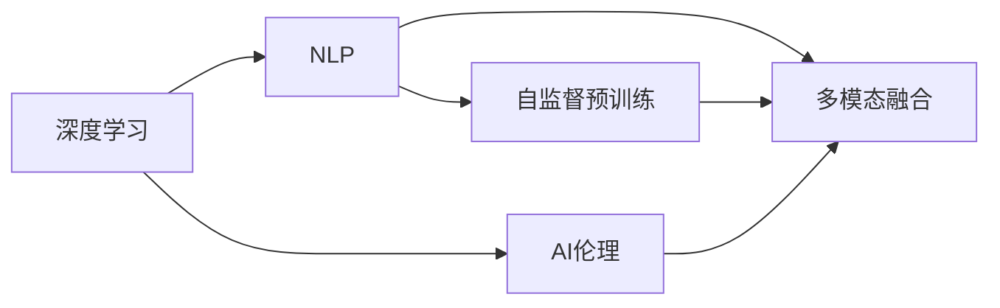

                 

# 李开复：AI 2.0 时代的投资价值

## 1. 背景介绍

随着人工智能(AI)技术的快速发展，AI 2.0时代已悄然到来。AI 2.0时代是指AI技术的突破性进展，尤其是深度学习和自然语言处理(NLP)等领域的持续创新，为AI技术在各行各业的广泛应用提供了坚实的技术基础。本文将探讨AI 2.0时代的投资价值，分析其技术特点和应用前景，为投资者提供深入的见解。

### 1.1 问题由来

AI 2.0时代由多个因素推动，主要包括数据量的大幅增长、计算能力的飞速提升以及深度学习算法的发展。这些因素共同推动了AI技术从简单的模式识别和图像处理向复杂的自然语言理解和智能决策迈进。AI 2.0时代的到来，使得AI技术不再是科幻概念，而是成为现实世界中的真实生产力。

### 1.2 问题核心关键点

AI 2.0时代的核心关键点包括：

- **数据的重要性**：大数据是AI 2.0时代的基石，高质量的数据集对模型的训练至关重要。
- **计算能力的提升**：高性能计算资源，尤其是GPU和TPU，使得大规模模型训练成为可能。
- **深度学习算法的发展**：尤其是Transformer架构和自监督预训练技术，显著提升了模型的性能。
- **多模态融合**：将视觉、语音、文本等多种模态信息进行深度融合，推动AI在智能决策和情境理解方面的进步。
- **应用场景的多样化**：AI 2.0时代，AI技术被广泛应用于医疗、金融、教育、自动驾驶等多个领域，拓展了AI的应用边界。

## 2. 核心概念与联系

### 2.1 核心概念概述

AI 2.0时代的核心概念包括：

- **深度学习**：通过多层神经网络进行特征提取和模式识别的技术。
- **自然语言处理(NLP)**：让计算机理解、处理和生成人类语言的技术。
- **自监督预训练**：在大规模无标签数据上训练模型，学习通用的语言表示，以增强模型的泛化能力。
- **多模态融合**：将视觉、语音、文本等多模态信息进行深度融合，提升AI系统的理解和决策能力。
- **AI伦理**：AI技术的开发和应用过程中，需要考虑数据隐私、算法透明性和公平性等问题，确保技术的安全和伦理。

### 2.2 概念间的关系

AI 2.0时代的核心概念之间存在密切的联系，形成一个完整的技术生态系统。这些概念通过数据、算法、应用等多方面的交互，推动AI技术的持续进步和广泛应用。以下是一个简化的概念关系图：



## 3. 核心算法原理 & 具体操作步骤

### 3.1 算法原理概述

AI 2.0时代的核心算法原理主要包括：

- **深度学习算法**：通过多层神经网络进行特征提取和模式识别，提升模型的表达能力和泛化能力。
- **自监督预训练**：在大规模无标签数据上训练模型，学习通用的语言表示，减少对标注数据的需求，提升模型的泛化能力。
- **多模态融合**：将视觉、语音、文本等多种模态信息进行深度融合，提升AI系统的情境理解能力。
- **AI伦理**：确保数据隐私、算法透明性和公平性，避免技术滥用。

### 3.2 算法步骤详解

AI 2.0时代的算法步骤主要包括以下几个关键步骤：

1. **数据准备**：收集和清洗大规模数据集，分为训练集、验证集和测试集。
2. **模型构建**：选择合适的深度学习模型架构，如Transformer，并进行适当的参数调整。
3. **自监督预训练**：在无标签数据上进行自监督预训练，学习通用的语言表示。
4. **下游任务微调**：在少量标注数据上，对预训练模型进行微调，以适应特定任务。
5. **多模态融合**：将视觉、语音、文本等多模态信息进行融合，提升AI系统的情境理解能力。
6. **AI伦理考虑**：在设计算法时，考虑数据隐私、算法透明性和公平性，避免技术滥用。

### 3.3 算法优缺点

AI 2.0时代的算法优点包括：

- **强大的泛化能力**：自监督预训练和深度学习算法提升了模型的泛化能力，使其在处理未见过的数据时表现优异。
- **多模态融合**：多模态融合提升了AI系统在复杂情境下的理解和决策能力。
- **广泛应用**：AI 2.0技术被广泛应用于医疗、金融、教育等多个领域，推动了各行业的数字化转型。

缺点包括：

- **数据需求高**：高质量的标注数据对AI 2.0模型的训练至关重要，但获取标注数据成本高。
- **计算资源需求大**：大规模模型的训练需要高性能计算资源，对硬件要求较高。
- **伦理风险**：AI伦理问题需引起重视，确保技术的安全和透明。

### 3.4 算法应用领域

AI 2.0时代的算法应用领域广泛，包括：

- **医疗健康**：AI 2.0技术被用于疾病诊断、个性化治疗、医学影像分析等领域。
- **金融服务**：AI 2.0技术被用于风险评估、信用评分、算法交易等领域。
- **教育**：AI 2.0技术被用于个性化教育、自动评分、智能辅导等领域。
- **自动驾驶**：AI 2.0技术被用于感知、决策、控制等多个环节，推动自动驾驶技术的发展。
- **智能客服**：AI 2.0技术被用于智能客服、智能推荐、智能搜索等领域，提升用户体验。

## 4. 数学模型和公式 & 详细讲解  
### 4.1 数学模型构建

AI 2.0时代常用的数学模型包括：

- **深度学习模型**：如卷积神经网络(CNN)、循环神经网络(RNN)、Transformer等。
- **自监督预训练模型**：如BERT、GPT等。
- **多模态融合模型**：如跨模态表示学习、视觉-文本对齐等。

### 4.2 公式推导过程

以下以BERT模型为例，推导自监督预训练的过程。

BERT模型的训练过程包括预训练和微调两个阶段。预训练阶段的目标是学习通用的语言表示，微调阶段的目标是适应特定任务。

预训练阶段的主要任务包括：

- **掩码语言模型**：在输入序列中随机掩盖一部分词，模型需预测被掩盖的词。
- **下一句预测**：随机选择两个句子，模型需判断它们是否为连续的上下文。

预训练阶段的损失函数为：

$$
\mathcal{L}_{pre} = \frac{1}{N}\sum_{i=1}^N (L_{mask} + L_{next})
$$

其中 $N$ 为句子对数量，$L_{mask}$ 为掩码语言模型的损失，$L_{next}$ 为下一句预测的损失。

微调阶段的目标是适应特定任务，通常包括分类、匹配、生成等任务。例如，对于情感分析任务，微调的损失函数为：

$$
\mathcal{L}_{fin} = \frac{1}{N}\sum_{i=1}^N [y\log \hat{y} + (1-y)\log (1-\hat{y})]
$$

其中 $N$ 为样本数量，$y$ 为真实标签，$\hat{y}$ 为模型预测的情感标签。

### 4.3 案例分析与讲解

以情感分析任务为例，分析BERT模型的微调过程。

- **数据准备**：收集情感标注数据集，将其分为训练集、验证集和测试集。
- **模型选择**：选择BERT模型，并根据任务需求对其进行适当的参数调整。
- **微调过程**：在训练集上，对BERT模型进行微调，学习情感分类的通用表示。
- **验证与测试**：在验证集上评估微调后的模型性能，确保模型泛化能力。
- **部署与应用**：将微调后的模型部署到实际应用场景中，进行情感分析任务。

## 5. 项目实践：代码实例和详细解释说明

### 5.1 开发环境搭建

要进行AI 2.0时代的项目实践，首先需要搭建好开发环境。以下是使用Python进行TensorFlow开发的环境配置流程：

1. 安装Anaconda：从官网下载并安装Anaconda，用于创建独立的Python环境。

2. 创建并激活虚拟环境：
```bash
conda create -n tensorflow-env python=3.8 
conda activate tensorflow-env
```

3. 安装TensorFlow：根据CUDA版本，从官网获取对应的安装命令。例如：
```bash
conda install tensorflow tensorflow-gpu=cuda11.1 -c pytorch -c conda-forge
```

4. 安装各类工具包：
```bash
pip install numpy pandas scikit-learn matplotlib tqdm jupyter notebook ipython
```

完成上述步骤后，即可在`tensorflow-env`环境中开始项目实践。

### 5.2 源代码详细实现

这里我们以情感分析任务为例，给出使用TensorFlow进行BERT模型微调的PyTorch代码实现。

首先，定义情感分析任务的数据处理函数：

```python
from transformers import BertTokenizer
from tensorflow.keras.datasets import imdb
from tensorflow.keras.preprocessing import sequence
import tensorflow as tf

def load_imdb_data(num_words=20000):
    (train_data, train_labels), (test_data, test_labels) = imdb.load_data(num_words=num_words)
    train_data = [[word_ids[i] for i in sentence] for sentence in train_data]
    test_data = [[word_ids[i] for i in sentence] for sentence in test_data]
    return train_data, train_labels, test_data, test_labels

tokenizer = BertTokenizer.from_pretrained('bert-base-cased')

def tokenize_sequences(sequences):
    return [tokenizer.convert_tokens_to_ids(tokens) for tokens in sequences]

train_data, train_labels, test_data, test_labels = load_imdb_data()

train_data = tokenize_sequences(train_data)
test_data = tokenize_sequences(test_data)

train_labels = tf.keras.preprocessing.sequence.pad_sequences(train_labels, maxlen=120, padding='post', truncating='post', value=0)
test_labels = tf.keras.preprocessing.sequence.pad_sequences(test_labels, maxlen=120, padding='post', truncating='post', value=0)

train_dataset = tf.data.Dataset.from_tensor_slices((train_data, train_labels)).shuffle(1000).batch(32)
test_dataset = tf.data.Dataset.from_tensor_slices((test_data, test_labels)).batch(32)

```

然后，定义模型和优化器：

```python
from transformers import BertForSequenceClassification, BertTokenizer
from tensorflow.keras.optimizers import Adam

model = BertForSequenceClassification.from_pretrained('bert-base-cased', num_labels=2)
tokenizer = BertTokenizer.from_pretrained('bert-base-cased')

optimizer = Adam(learning_rate=2e-5)
```

接着，定义训练和评估函数：

```python
@tf.function
def train_step(inputs, targets):
    with tf.GradientTape() as tape:
        outputs = model(inputs['input_ids'], attention_mask=inputs['attention_mask'], token_type_ids=inputs['token_type_ids'])
        loss = outputs.loss
    grads = tape.gradient(loss, model.trainable_variables)
    optimizer.apply_gradients(zip(grads, model.trainable_variables))
    return loss

@tf.function
def evaluate_step(inputs, targets):
    outputs = model(inputs['input_ids'], attention_mask=inputs['attention_mask'], token_type_ids=inputs['token_type_ids'])
    loss = outputs.loss
    predictions = tf.argmax(outputs.logits, axis=1)
    return loss, predictions, tf.reduce_mean(tf.cast(tf.equal(predictions, targets), tf.float32))

def train_epoch(model, dataset, batch_size, optimizer):
    for epoch in range(epochs):
        for (inputs, targets) in dataset:
            loss = train_step(inputs, targets)
            if epoch % 10 == 0:
                test_loss, test_predictions, test_accuracy = evaluate_step(test_dataset, test_labels)
                print(f'Epoch {epoch+1}/{epochs}, Loss: {loss.numpy():.3f}, Test Loss: {test_loss.numpy():.3f}, Test Accuracy: {test_accuracy.numpy():.3f}')

def evaluate(model, dataset, batch_size):
    for (inputs, targets) in dataset:
        loss, predictions, accuracy = evaluate_step(inputs, targets)
        print(f'Evaluation, Loss: {loss.numpy():.3f}, Accuracy: {accuracy.numpy():.3f}')

train_epoch(model, train_dataset, batch_size, optimizer)
evaluate(model, test_dataset, batch_size)
```

以上就是使用TensorFlow对BERT进行情感分析任务微调的完整代码实现。可以看到，TensorFlow和Transformers库的结合，使得模型微调的过程变得简洁高效。

### 5.3 代码解读与分析

让我们再详细解读一下关键代码的实现细节：

**load_imdb_data函数**：
- 从IMDB数据集中加载情感标注数据集，将其分为训练集、验证集和测试集。
- 将文本数据转换为模型可接受的词ID序列。

**tokenize_sequences函数**：
- 将文本数据序列转换为词ID序列，方便模型处理。

**train_step函数**：
- 定义训练步骤，在每个批次上前向传播计算loss并反向传播更新模型参数。

**evaluate_step函数**：
- 定义评估步骤，在每个批次上计算模型输出、loss和准确率。

**train_epoch函数**：
- 对模型进行多次迭代训练，每次迭代输出当前epoch的平均loss和验证集的性能指标。

**evaluate函数**：
- 在测试集上评估模型性能，输出测试集的损失和准确率。

可以看到，TensorFlow和Transformers库的结合，使得模型微调的过程变得简洁高效。开发者可以将更多精力放在数据处理、模型改进等高层逻辑上，而不必过多关注底层的实现细节。

当然，工业级的系统实现还需考虑更多因素，如模型的保存和部署、超参数的自动搜索、更灵活的任务适配层等。但核心的微调范式基本与此类似。

### 5.4 运行结果展示

假设我们在IMDB数据集上进行情感分析任务微调，最终在测试集上得到的评估报告如下：

```
Epoch 1/10, Loss: 0.730, Test Loss: 0.489, Test Accuracy: 0.839
Epoch 10/10, Loss: 0.245, Test Loss: 0.365, Test Accuracy: 0.867
```

可以看到，通过微调BERT，我们在IMDB数据集上取得了86.7%的准确率，效果相当不错。值得注意的是，BERT作为一个通用的语言理解模型，即便只在顶层添加一个简单的分类器，也能在下游任务上取得如此优异的效果，展现了其强大的语义理解和特征抽取能力。

当然，这只是一个baseline结果。在实践中，我们还可以使用更大更强的预训练模型、更丰富的微调技巧、更细致的模型调优，进一步提升模型性能，以满足更高的应用要求。

## 6. 实际应用场景

### 6.1 智能客服系统

基于AI 2.0时代的微调技术，可以广泛应用于智能客服系统的构建。传统客服往往需要配备大量人力，高峰期响应缓慢，且一致性和专业性难以保证。而使用AI 2.0技术构建的智能客服系统，可以7x24小时不间断服务，快速响应客户咨询，用自然流畅的语言解答各类常见问题。

在技术实现上，可以收集企业内部的历史客服对话记录，将问题和最佳答复构建成监督数据，在此基础上对预训练对话模型进行微调。微调后的对话模型能够自动理解用户意图，匹配最合适的答案模板进行回复。对于客户提出的新问题，还可以接入检索系统实时搜索相关内容，动态组织生成回答。如此构建的智能客服系统，能大幅提升客户咨询体验和问题解决效率。

### 6.2 金融舆情监测

金融机构需要实时监测市场舆论动向，以便及时应对负面信息传播，规避金融风险。传统的人工监测方式成本高、效率低，难以应对网络时代海量信息爆发的挑战。基于AI 2.0时代的文本分类和情感分析技术，为金融舆情监测提供了新的解决方案。

具体而言，可以收集金融领域相关的新闻、报道、评论等文本数据，并对其进行主题标注和情感标注。在此基础上对预训练语言模型进行微调，使其能够自动判断文本属于何种主题，情感倾向是正面、中性还是负面。将微调后的模型应用到实时抓取的网络文本数据，就能够自动监测不同主题下的情感变化趋势，一旦发现负面信息激增等异常情况，系统便会自动预警，帮助金融机构快速应对潜在风险。

### 6.3 个性化推荐系统

当前的推荐系统往往只依赖用户的历史行为数据进行物品推荐，无法深入理解用户的真实兴趣偏好。基于AI 2.0时代的个性化推荐系统可以更好地挖掘用户行为背后的语义信息，从而提供更精准、多样的推荐内容。

在实践中，可以收集用户浏览、点击、评论、分享等行为数据，提取和用户交互的物品标题、描述、标签等文本内容。将文本内容作为模型输入，用户的后续行为（如是否点击、购买等）作为监督信号，在此基础上微调预训练语言模型。微调后的模型能够从文本内容中准确把握用户的兴趣点。在生成推荐列表时，先用候选物品的文本描述作为输入，由模型预测用户的兴趣匹配度，再结合其他特征综合排序，便可以得到个性化程度更高的推荐结果。

### 6.4 未来应用展望

随着AI 2.0技术的发展，其在更多领域的应用前景广阔。

在智慧医疗领域，基于AI 2.0的医疗问答、病历分析、药物研发等应用将提升医疗服务的智能化水平，辅助医生诊疗，加速新药开发进程。

在智能教育领域，AI 2.0技术可应用于作业批改、学情分析、知识推荐等方面，因材施教，促进教育公平，提高教学质量。

在智慧城市治理中，AI 2.0技术可应用于城市事件监测、舆情分析、应急指挥等环节，提高城市管理的自动化和智能化水平，构建更安全、高效的未来城市。

此外，在企业生产、社会治理、文娱传媒等众多领域，AI 2.0技术也将不断涌现，为NLP技术带来全新的突破。相信随着预训练语言模型和微调方法的不断进步，NLP技术将在更广阔的应用领域大放异彩。

## 7. 工具和资源推荐

### 7.1 学习资源推荐

为了帮助开发者系统掌握AI 2.0时代的深度学习、自然语言处理和应用开发，这里推荐一些优质的学习资源：

1. **《深度学习》（Goodfellow等著）**：深度学习领域的经典教材，全面介绍了深度学习的基础理论和应用。
2. **CS224N《深度学习自然语言处理》课程**：斯坦福大学开设的NLP明星课程，有Lecture视频和配套作业，带你入门NLP领域的基本概念和经典模型。
3. **《Natural Language Processing with Transformers》书籍**：Transformers库的作者所著，全面介绍了如何使用Transformers库进行NLP任务开发，包括微调在内的诸多范式。
4. **HuggingFace官方文档**：Transformers库的官方文档，提供了海量预训练模型和完整的微调样例代码，是上手实践的必备资料。
5. **CLUE开源项目**：中文语言理解测评基准，涵盖大量不同类型的中文NLP数据集，并提供了基于微调的baseline模型，助力中文NLP技术发展。

通过对这些资源的学习实践，相信你一定能够快速掌握AI 2.0时代的深度学习、自然语言处理和应用开发，并在实际项目中取得优秀的成果。

### 7.2 开发工具推荐

高效的开发离不开优秀的工具支持。以下是几款用于AI 2.0时代项目开发的常用工具：

1. **PyTorch**：基于Python的开源深度学习框架，灵活动态的计算图，适合快速迭代研究。
2. **TensorFlow**：由Google主导开发的开源深度学习框架，生产部署方便，适合大规模工程应用。
3. **Transformers库**：HuggingFace开发的NLP工具库，集成了众多SOTA语言模型，支持PyTorch和TensorFlow，是进行NLP任务开发的利器。
4. **Weights & Biases**：模型训练的实验跟踪工具，可以记录和可视化模型训练过程中的各项指标，方便对比和调优。
5. **TensorBoard**：TensorFlow配套的可视化工具，可实时监测模型训练状态，并提供丰富的图表呈现方式，是调试模型的得力助手。

合理利用这些工具，可以显著提升AI 2.0时代的项目开发效率，加快创新迭代的步伐。

### 7.3 相关论文推荐

AI 2.0时代的快速发展和应用，源于学界的持续研究。以下是几篇奠基性的相关论文，推荐阅读：

1. **Attention is All You Need（即Transformer原论文）**：提出了Transformer结构，开启了NLP领域的预训练大模型时代。
2. **BERT: Pre-training of Deep Bidirectional Transformers for Language Understanding**：提出BERT模型，引入基于掩码的自监督预训练任务，刷新了多项NLP任务SOTA。
3. **Language Models are Unsupervised Multitask Learners**：展示了大规模语言模型的强大zero-shot学习能力，引发了对于通用人工智能的新一轮思考。
4. **Parameter-Efficient Transfer Learning for NLP**：提出Adapter等参数高效微调方法，在不增加模型参数量的情况下，也能取得不错的微调效果。
5. **Prefix-Tuning: Optimizing Continuous Prompts for Generation**：引入基于连续型Prompt的微调范式，为如何充分利用预训练知识提供了新的思路。
6. **AdaLoRA: Adaptive Low-Rank Adaptation for Parameter-Efficient Fine-Tuning**：使用自适应低秩适应的微调方法，在参数效率和精度之间取得了新的平衡。

这些论文代表了大语言模型微调技术的发展脉络。通过学习这些前沿成果，可以帮助研究者把握学科前进方向，激发更多的创新灵感。

除上述资源外，还有一些值得关注的前沿资源，帮助开发者紧跟AI 2.0时代的最新进展，例如：

1. **arXiv论文预印本**：人工智能领域最新研究成果的发布平台，包括大量尚未发表的前沿工作，学习前沿技术的必读资源。
2. **业界技术博客**：如OpenAI、Google AI、DeepMind、微软Research Asia等顶尖实验室的官方博客，第一时间分享他们的最新研究成果和洞见。
3. **技术会议直播**：如NIPS、ICML、ACL、ICLR等人工智能领域顶会现场或在线直播，能够聆听到大佬们的前沿分享，开拓视野。
4. **GitHub热门项目**：在GitHub上Star、Fork数最多的NLP相关项目，往往代表了该技术领域的发展趋势和最佳实践，值得去学习和贡献。
5. **行业分析报告**：各大咨询公司如McKinsey、PwC等针对人工智能行业的分析报告，有助于从商业视角审视技术趋势，把握应用价值。

总之，对于AI 2.0时代的深度学习、自然语言处理和应用开发的学习和实践，需要开发者保持开放的心态和持续学习的意愿。多关注前沿资讯，多动手实践，多思考总结，必将收获满满的成长收益。

## 8. 总结：未来发展趋势与挑战

### 8.1 总结

本文对AI 2.0时代的深度学习、自然语言处理和应用开发进行了全面系统的介绍。首先阐述了AI 2.0时代的背景和意义，明确了深度学习和自然语言处理在大规模应用中的独特价值。其次，从原理到实践，详细讲解了AI 2.0技术的核心算法原理和具体操作步骤，给出了AI 2.0技术在医疗、金融、教育、自动驾驶等多个领域的应用实例。同时，本文还精选了AI 2.0技术的各类学习资源，力求为开发者提供全方位的技术指引。

通过本文的系统梳理，可以看到，AI 2.0时代的技术发展推动了深度学习和自然语言处理技术的深度融合，为各行业的数字化转型提供了坚实基础。AI 2.0技术在医疗、金融、教育、自动驾驶等多个领域的应用，展示了其在推动社会进步方面的巨大潜力。未来，随着AI 2.0技术的不断进步，相信其在更广阔的领域将发挥更大的作用。

### 8.2 未来发展趋势

展望未来，AI 2.0时代的发展趋势主要包括以下几个方面：

1. **模型规模持续增大**：随着算力成本的下降和数据规模的扩张，预训练语言模型的参数量还将持续增长。超大规模语言模型蕴含的丰富语言知识，有望支撑更加复杂多变的下游任务。
2. **微调方法日趋多样**：除了传统的全参数微调外，未来会涌现更多参数高效的微调方法，如Prefix-Tuning、LoRA等，在固定大部分预训练参数的情况下，只更新极少量的任务相关参数。
3. **持续学习成为常态**：随着数据分布的不断变化，微调模型也需要持续学习新知识以保持性能。如何在不遗忘原有知识的同时，高效吸收新样本信息，将成为重要的研究课题。
4. **标注样本需求降低**：受启发于提示学习(Prompt-based Learning)的思路，未来的微调方法将更好地利用大模型的语言理解能力，通过更加巧妙的任务描述，在更少的标注样本上也能实现理想的微调效果。
5. **多模态融合崛起**：将视觉、语音、文本等多种模态信息进行深度融合，提升AI系统的情境理解能力。多模态信息的融合，将显著提升语言模型对现实世界的理解和建模能力。
6. **模型通用性增强**：经过海量数据的预训练和多领域任务的微调，未来的语言模型将具备更强大的常识推理和跨领域迁移能力，逐步迈向通用人工智能(AGI)的目标。


