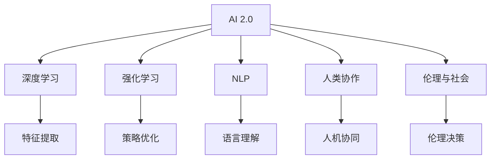
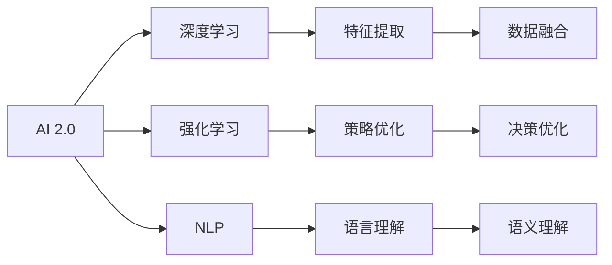
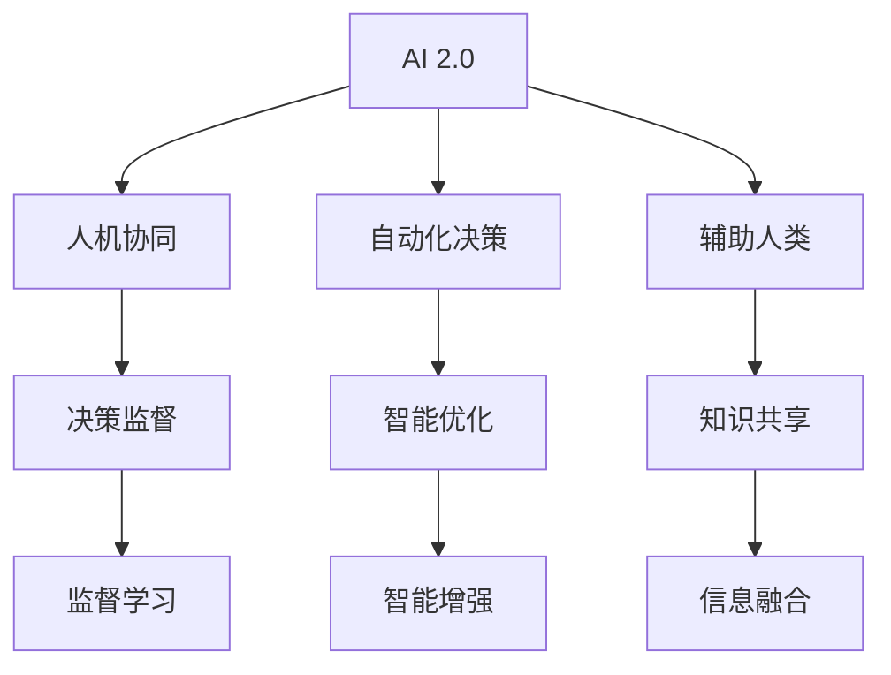
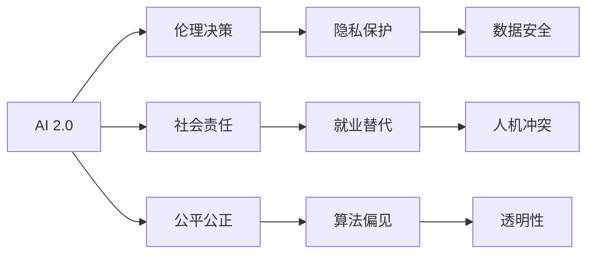

                 

# 李开复：AI 2.0 时代的未来展望

> 关键词：AI 2.0, 未来趋势, 人工智能, 深度学习, 人类协作, 伦理与社会

## 1. 背景介绍

在过去的几十年中，人工智能（AI）技术经历了飞速发展，从最初的专家系统到现代的深度学习，AI 技术已经深刻改变了我们的生活方式和社会结构。特别是在近年来，AI 技术不断取得突破，进入了一个新的阶段——AI 2.0。在这个时代，AI 不仅是科学家和技术专家的工具，更是全球各行各业都在积极拥抱的变革力量。

AI 2.0 时代的到来，意味着 AI 技术将更加智能、更加普及、更加深入地融入我们的日常生活。这不仅是一场技术革命，更是一场社会、经济、伦理等多方面的深刻变革。本文将深入探讨 AI 2.0 时代的未来展望，分析 AI 技术的发展趋势、面临的挑战和机遇，以及其在各个领域的应用前景。

## 2. 核心概念与联系

### 2.1 核心概念概述

在 AI 2.0 时代，以下几个核心概念将扮演关键角色：

- **AI 2.0**：指新一代的人工智能，结合了深度学习、强化学习、自然语言处理等多种技术，能够处理更复杂、更抽象的任务，提供更加智能化、个性化的解决方案。

- **深度学习**：一种基于神经网络的机器学习方法，通过多层次的抽象表示，使得机器能够自动学习特征，并进行复杂的决策和推理。

- **强化学习**：通过与环境的互动，不断优化策略，使得智能体能够在未知环境中进行有效的决策和学习。

- **自然语言处理（NLP）**：使计算机能够理解、处理和生成自然语言，实现人机交互的智能化。

- **人类协作**：AI 技术的发展离不开人类专家的指导和监督，AI 和人类将在多个层面上协作，共同解决问题。

- **伦理与社会**：AI 技术的广泛应用带来了诸多伦理和社会问题，如隐私保护、算法偏见、就业替代等，需要我们在技术进步的同时，不断思考和解决这些问题。

这些概念之间的联系可以通过以下 Mermaid 流程图来展示：



这个流程图展示了 AI 2.0 时代的主要技术组件和应用领域，以及它们之间的关系和作用。

### 2.2 概念间的关系

这些核心概念之间存在着紧密的联系，共同构成了 AI 2.0 时代的技术生态系统。下面通过几个 Mermaid 流程图来展示这些概念之间的关系：

#### 2.2.1 AI 2.0 技术框架



这个流程图展示了 AI 2.0 技术框架的各个组件及其相互关系。

#### 2.2.2 AI 2.0 与人类协作



这个流程图展示了 AI 2.0 与人类协作的关系，以及二者在多个层面上共同工作的场景。

#### 2.2.3 AI 2.0 与伦理与社会



这个流程图展示了 AI 2.0 在伦理和社会层面的挑战和应对策略。

## 3. 核心算法原理 & 具体操作步骤

### 3.1 算法原理概述

AI 2.0 时代的技术核心是深度学习和强化学习。这些算法通过多层次的抽象表示和自适应优化，使得机器能够自主学习和决策，从而在复杂任务中取得优异的表现。

- **深度学习**：通过多层神经网络，将输入数据自动转换为高层次的特征表示，并通过反向传播算法不断优化权重，使得模型能够学习和处理更加复杂的数据和任务。

- **强化学习**：通过与环境的互动，智能体不断尝试不同的策略，根据奖励和惩罚信号调整行为，最终找到最优的策略。

### 3.2 算法步骤详解

深度学习和强化学习的具体操作步骤如下：

**深度学习**：

1. **数据准备**：收集和预处理数据，确保数据质量。
2. **模型设计**：选择合适的网络结构和超参数，设计损失函数。
3. **模型训练**：使用随机梯度下降等优化算法，不断调整权重，最小化损失函数。
4. **模型评估**：使用验证集评估模型性能，调整超参数。
5. **模型应用**：将训练好的模型应用于实际任务，进行推理和决策。

**强化学习**：

1. **环境设计**：定义环境和奖励函数，确定智能体的行为空间。
2. **策略选择**：设计合适的策略，如贪心策略、Q-learning、Deep Q Network 等。
3. **智能体训练**：在环境中不断尝试策略，根据奖励和惩罚信号调整策略。
4. **策略优化**：使用蒙特卡洛方法、值迭代等算法，优化策略，找到最优策略。
5. **应用测试**：将优化后的策略应用于实际环境，验证效果。

### 3.3 算法优缺点

**深度学习**：

- **优点**：能够处理大规模数据，学习高层次特征表示，适用于各种任务。
- **缺点**：需要大量标注数据，模型复杂度高，容易过拟合。

**强化学习**：

- **优点**：能够处理未知环境，自主学习和决策。
- **缺点**：需要长时间训练，策略优化困难，数据利用率低。

### 3.4 算法应用领域

AI 2.0 技术已经在多个领域取得了广泛应用，包括：

- **医疗**：通过深度学习和强化学习，AI 能够辅助医生进行疾病诊断、治疗方案优化等。
- **金融**：AI 在风险控制、智能投顾、量化交易等领域表现优异。
- **制造**：智能工厂、自动化生产线上广泛应用 AI 技术，提高生产效率和质量。
- **交通**：自动驾驶、智能交通管理等领域，AI 技术在提升安全性、降低成本等方面发挥了重要作用。
- **娱乐**：AI 在音乐、影视、游戏等领域，通过生成对抗网络等技术，提供个性化的内容推荐和服务。

## 4. 数学模型和公式 & 详细讲解

### 4.1 数学模型构建

深度学习和强化学习的数学模型如下：

- **深度学习**：使用神经网络进行特征提取和分类，模型损失函数为交叉熵损失。

$$
\mathcal{L}(\theta) = -\frac{1}{N}\sum_{i=1}^N \log p(y_i|x_i; \theta)
$$

- **强化学习**：使用 Q-learning 算法进行策略优化，状态-动作对的状态价值函数为：

$$
Q(s,a) = r + \gamma \max_a Q(s',a')
$$

其中，$s$ 为当前状态，$a$ 为当前动作，$r$ 为即时奖励，$s'$ 为下一个状态，$a'$ 为下一个动作，$\gamma$ 为折扣因子。

### 4.2 公式推导过程

以深度学习为例，推导一个简单的神经网络分类模型的损失函数。

假设模型输入为 $x$，输出为 $y$，模型参数为 $\theta$，输出层的激活函数为 $\sigma$。则模型的输出概率为：

$$
p(y|x;\theta) = \sigma(Wx + b)
$$

其中，$W$ 为权重矩阵，$b$ 为偏置向量。模型的交叉熵损失函数为：

$$
\mathcal{L}(\theta) = -\frac{1}{N}\sum_{i=1}^N \sum_{j=1}^C y_{ij}\log \sigma(\theta^T x_i + b_j)
$$

其中，$C$ 为类别数，$y_{ij}$ 为第 $i$ 个样本属于第 $j$ 个类别的标签，$\sigma$ 为 sigmoid 函数。

### 4.3 案例分析与讲解

以图像分类为例，使用深度学习模型进行图像分类任务。

假设模型为卷积神经网络（CNN），输入为 $x$，输出为 $y$，模型参数为 $\theta$，输出层的激活函数为 $\sigma$。则模型的输出概率为：

$$
p(y|x;\theta) = \sigma(Wx + b)
$$

其中，$W$ 为权重矩阵，$b$ 为偏置向量。模型的交叉熵损失函数为：

$$
\mathcal{L}(\theta) = -\frac{1}{N}\sum_{i=1}^N \log p(y_i|x_i; \theta)
$$

使用随机梯度下降算法进行优化，更新模型参数 $\theta$：

$$
\theta \leftarrow \theta - \eta \nabla_{\theta}\mathcal{L}(\theta)
$$

其中，$\eta$ 为学习率。

## 5. 项目实践：代码实例和详细解释说明

### 5.1 开发环境搭建

在进行项目实践前，我们需要准备好开发环境。以下是使用 Python 进行 TensorFlow 开发的环境配置流程：

1. 安装 Anaconda：从官网下载并安装 Anaconda，用于创建独立的 Python 环境。

2. 创建并激活虚拟环境：

```bash
conda create -n tf-env python=3.8 
conda activate tf-env
```

3. 安装 TensorFlow：根据 GPU 版本，从官网获取对应的安装命令。例如：

```bash
conda install tensorflow -c pytorch -c conda-forge
```

4. 安装相关工具包：

```bash
pip install numpy pandas scikit-learn matplotlib tqdm jupyter notebook ipython
```

完成上述步骤后，即可在 `tf-env` 环境中开始项目实践。

### 5.2 源代码详细实现

下面我们以图像分类任务为例，给出使用 TensorFlow 进行深度学习的 PyTorch 代码实现。

首先，定义图像分类任务的数据处理函数：

```python
from tensorflow.keras.preprocessing.image import ImageDataGenerator

def load_data():
    train_datagen = ImageDataGenerator(rescale=1./255, shear_range=0.2, zoom_range=0.2, horizontal_flip=True)
    test_datagen = ImageDataGenerator(rescale=1./255)
    
    train_generator = train_datagen.flow_from_directory(train_dir, target_size=(224, 224), batch_size=32, class_mode='categorical')
    test_generator = test_datagen.flow_from_directory(test_dir, target_size=(224, 224), batch_size=32, class_mode='categorical')
    
    return train_generator, test_generator
```

然后，定义模型和优化器：

```python
from tensorflow.keras.applications import VGG16
from tensorflow.keras.layers import Dense, Flatten
from tensorflow.keras.models import Model

def build_model():
    base_model = VGG16(weights='imagenet', include_top=False, input_shape=(224, 224, 3))
    x = Flatten()(base_model.output)
    x = Dense(512, activation='relu')(x)
    x = Dense(num_classes, activation='softmax')(x)
    
    model = Model(inputs=base_model.input, outputs=x)
    
    return model

def compile_model(model):
    model.compile(optimizer='adam', loss='categorical_crossentropy', metrics=['accuracy'])
```

接着，定义训练和评估函数：

```python
def train(model, train_generator, test_generator, epochs):
    model.fit(train_generator, epochs=epochs, validation_data=test_generator)
    
def evaluate(model, test_generator):
    loss, accuracy = model.evaluate(test_generator)
    print(f'Test loss: {loss:.4f}')
    print(f'Test accuracy: {accuracy:.4f}')
```

最后，启动训练流程并在测试集上评估：

```python
train_generator, test_generator = load_data()
model = build_model()
compile_model(model)
train(model, train_generator, test_generator, epochs=10)
evaluate(model, test_generator)
```

以上就是使用 TensorFlow 进行图像分类任务深度学习的完整代码实现。可以看到，得益于 TensorFlow 的强大封装，我们可以用相对简洁的代码完成图像分类模型的构建和训练。

### 5.3 代码解读与分析

让我们再详细解读一下关键代码的实现细节：

**load_data** 函数：
- 定义数据增强器，对训练集和测试集进行预处理。
- 使用 `flow_from_directory` 函数加载数据，设置目标大小、批次大小和类别模式。

**build_model** 函数：
- 加载预训练的 VGG16 模型，移除顶层分类层。
- 添加全连接层和输出层，定义模型。

**compile_model** 函数：
- 配置模型优化器、损失函数和评估指标。

**train** 函数：
- 使用 `fit` 函数进行模型训练，设置训练轮数和验证集。

**evaluate** 函数：
- 使用 `evaluate` 函数进行模型评估，输出测试集的损失和准确率。

通过以上步骤，我们可以完成一个简单的图像分类任务，展示了深度学习模型的构建和训练过程。

## 6. 实际应用场景

### 6.1 医疗影像分析

AI 2.0 技术在医疗领域有广泛应用，特别是在影像分析方面。深度学习模型能够快速处理大量医学影像，辅助医生进行疾病诊断和治疗方案优化。

例如，使用卷积神经网络对医学影像进行分类，可以自动识别肿瘤、器官、病变等，提供精准的诊断结果。强化学习模型可以优化治疗方案，通过模拟不同的治疗方案，找到最优的策略，提高治疗效果。

### 6.2 智能客服系统

AI 2.0 技术在智能客服系统中的应用也日益普及。通过深度学习模型和强化学习模型，AI 能够理解用户需求，提供个性化的服务。

例如，使用序列到序列模型进行问答对话，能够实时回答用户问题，解决常见问题。使用强化学习模型进行用户行为分析，能够优化客服策略，提高用户满意度。

### 6.3 自动驾驶

自动驾驶是 AI 2.0 技术的另一个重要应用领域。深度学习模型能够处理复杂的交通场景，识别交通标志、车辆、行人等，提供实时的决策支持。强化学习模型能够优化驾驶策略，提高行车安全性和效率。

## 7. 工具和资源推荐

### 7.1 学习资源推荐

为了帮助开发者系统掌握 AI 2.0 技术的理论基础和实践技巧，这里推荐一些优质的学习资源：

1. 《深度学习》系列课程：斯坦福大学、Coursera 等在线平台提供的深度学习课程，系统介绍深度学习的基本概念和算法。

2. 《强化学习》系列课程：斯坦福大学、DeepMind 等在线平台提供的强化学习课程，深入讲解强化学习的原理和应用。

3. 《自然语言处理》书籍：《Speech and Language Processing》等经典书籍，全面介绍自然语言处理的理论和实践。

4. 《AI 2.0》系列书籍：了解 AI 2.0 时代的最新技术进展和应用案例。

5. 《TensorFlow》官方文档：TensorFlow 的官方文档，提供详细的 API 文档和示例代码。

### 7.2 开发工具推荐

高效的开发离不开优秀的工具支持。以下是几款用于 AI 2.0 技术开发的常用工具：

1. TensorFlow：谷歌推出的开源深度学习框架，支持分布式训练和部署，广泛应用于 AI 领域。

2. PyTorch：Facebook 推出的开源深度学习框架，灵活的动态计算图，适合快速迭代研究。

3. Jupyter Notebook：交互式编程环境，支持代码块、图表和文本，便于开发者进行实验和分享。

4. GitHub：代码托管平台，方便开发者协作和版本管理。

5. Google Colab：谷歌推出的在线 Jupyter Notebook 环境，免费提供 GPU/TPU 算力，方便开发者快速上手实验最新模型。

### 7.3 相关论文推荐

AI 2.0 技术的发展源于学界的持续研究。以下是几篇奠基性的相关论文，推荐阅读：

1. **Deep Residual Learning for Image Recognition**（ResNet 论文）：提出了残差网络结构，使得深度网络的训练更加稳定。

2. **Attention is All You Need**（Transformer 论文）：提出了 Transformer 结构，提升了深度学习模型的表达能力。

3. **Playing Atari with Deep Reinforcement Learning**（DQN 论文）：展示了深度 Q-learning 在图像游戏中的应用。

4. **AlphaGo Zero**：展示了强化学习在复杂游戏中的应用，深度强化学习可以自主学习和决策。

5. **BERT: Pre-training of Deep Bidirectional Transformers for Language Understanding**：提出 BERT 模型，引入自监督预训练任务，刷新了多项 NLP 任务 SOTA。

这些论文代表了大模型微调技术的发展脉络。通过学习这些前沿成果，可以帮助研究者把握学科前进方向，激发更多的创新灵感。

除上述资源外，还有一些值得关注的前沿资源，帮助开发者紧跟 AI 2.0 技术的最新进展，例如：

1. arXiv 论文预印本：人工智能领域最新研究成果的发布平台，包括大量尚未发表的前沿工作，学习前沿技术的必读资源。

2. 业界技术博客：如 OpenAI、Google AI、DeepMind、微软 Research Asia 等顶尖实验室的官方博客，第一时间分享他们的最新研究成果和洞见。

3. 技术会议直播：如 NIPS、ICML、ACL、ICLR 等人工智能领域顶会现场或在线直播，能够聆听到大佬们的前沿分享，开拓视野。

4. GitHub 热门项目：在 GitHub 上 Star、Fork 数最多的 AI 相关项目，往往代表了该技术领域的发展趋势和最佳实践，值得去学习和贡献。

5. 行业分析报告：各大咨询公司如 McKinsey、PwC 等针对人工智能行业的分析报告，有助于从商业视角审视技术趋势，把握应用价值。

总之，对于 AI 2.0 技术的学习和实践，需要开发者保持开放的心态和持续学习的意愿。多关注前沿资讯，多动手实践，多思考总结，必将收获满满的成长收益。

## 8. 总结：未来发展趋势与挑战

### 8.1 总结

本文对 AI 2.0 时代的未来展望进行了全面系统的介绍。首先阐述了 AI 2.0 技术的研究背景和意义，明确了 AI 技术在复杂任务中的强大应用潜力。其次，从原理到实践，详细讲解了深度学习和强化学习的数学模型和操作步骤，给出了项目实践的完整代码实例。同时，本文还广泛探讨了 AI 2.0 技术在各个领域的应用前景，展示了 AI 技术的广泛应用前景。最后，本文精选了 AI 2.0 技术的各类学习资源，力求为读者提供全方位的技术指引。

通过本文的系统梳理，可以看到，AI 2.0 技术正在成为 AI 领域的重要范式，极大地拓展了深度学习和强化学习的应用边界，催生了更多的落地场景。受益于大规模语料的预训练和微调方法的持续演进，AI 技术必将进一步推动自然语言理解和智能交互系统的进步，深刻影响人类的生产生活方式。

### 8.2 未来发展趋势

展望未来，AI 2.0 技术将呈现以下几个发展趋势：

1. **算法与硬件协同进化**：随着芯片和算法的发展，AI 技术将更加高效、更加智能化。

2. **多模态信息融合**：AI 将不仅仅处理文本和图像，还将融合语音、视频、传感器等多种模态信息，提供更加全面、精准的解决方案。

3. **人机协同智能**：AI 将与人类协作，提供更加智能、个性化的服务，实现人机协同智能。

4. **跨领域应用扩展**：AI 技术将扩展到更多领域，如医疗、金融、制造、交通等，带来深远的社会影响。

5. **伦理与社会挑战**：随着 AI 技术的广泛应用，伦理和社会问题也将日益突出，需要我们在技术进步的同时，不断思考和解决这些问题。

### 8.3 面临的挑战

尽管 AI 2.0 技术已经取得了瞩目成就，但在迈向更加智能化、普适化应用的过程中，它仍面临着诸多挑战：

1. **数据隐私和安全**：AI 技术的应用需要大量的数据，如何保护用户隐私，防止数据泄露和滥用，是一个重要的挑战。

2. **算法偏见与公平性**：AI 模型可能会学习到训练数据中的偏见，如何设计公平的算法，避免偏见，是一个需要深入研究的课题。

3. **计算资源限制**：AI 模型往往需要大量的计算资源，如何优化模型结构，提高计算效率，是一个重要的挑战。

4. **可解释性和透明性**：AI 模型通常是一个“黑盒”，如何增强模型的可解释性和透明性，是一个重要的研究方向。

5. **模型鲁棒性和泛化能力**：AI 模型在面对新数据时，泛化能力往往不足，如何提高模型的鲁棒性和泛化能力，是一个重要的研究方向。

### 8.4 研究展望

面对 AI 2.0 技术面临的种种挑战，未来的研究需要在以下几个方面寻求新的突破：

1. **无监督学习与半监督学习**：摆脱对大规模标注数据的依赖，利用自监督学习、主动学习等无监督和半监督范式，最大限度利用非结构化数据。

2. **高效计算与模型压缩**：开发更加参数高效和计算高效的微调方法，优化模型结构，提高计算效率。

3. **跨模态信息融合**：将符号化的先验知识，如知识图谱、逻辑规则等，与神经网络模型进行巧妙融合，引导微调过程学习更准确、合理的语言模型。

4. **伦理与法律框架**：设计伦理导向的评估指标，过滤和惩罚有偏见、有害的输出倾向，加强人工干预和审核，建立模型行为的监管机制。

这些研究方向的探索，必将引领 AI 2.0 技术迈向更高的台阶，为构建安全、可靠、可解释、可控的智能系统铺平道路。面向未来，AI 2.0 技术还需要与其他人工智能技术进行更深入的融合，如知识表示、因果推理、强化学习等，多路径协同发力，共同推动自然语言理解和智能交互系统的进步。只有勇于创新、敢于突破，才能不断拓展 AI 技术的边界，让智能技术更好地造福人类社会。

## 9. 附录：常见问题与解答

**Q1：AI 2.0 与 AI 1.0 有什么区别？**

A: AI 2.0 和 AI 1.0 的主要区别在于其核心算法和应用范式。AI 1.0 主要依赖规则系统和专家知识，以符号计算为主；而 AI 2.0 则主要依赖深度学习和强化学习，以数据驱动和自适应学习为主。AI 2.0 能够处理更复杂、更抽象的任务，提供更加智能、个性化的解决方案。

**Q2：AI 2.0 的优点和缺点是什么？**

A: AI 2.0 的优点包括：

- 能够处理大规模数据，学习高层次特征表示。
- 能够适应未知环境，自主学习和决策。

AI 2.0 的缺点包括：

- 需要大量标注数据，模型复杂度高，容易过拟合。
- 数据隐私和安全问题亟需解决。

**Q3：AI 2.0 技术的应用前景有哪些？**

A: AI 2.0 技术在医疗、金融、制造、交通、娱乐等多个领域都有广泛应用前景：

- 医疗：辅助医生进行疾病诊断和治疗方案优化。
- 金融：智能投顾、量化交易等。
- 制造：智能工厂、自动化生产线上广泛应用。
- 交通：自动驾驶、智能交通管理等。
- 娱乐：音乐、影视、游戏等领域的个性化内容推荐和服务。

**Q4：AI 2.0 技术面临的主要挑战有哪些？**

A: AI 2.0 技术面临的主要挑战包括：

- 数据隐私和安全问题。
- 算法偏见与公平性问题。
- 计算资源限制。
- 模型可解释性和透明性问题。
- 模型鲁棒性和泛化能力问题。

**Q5：AI 2.0 技术的未来发展方向是什么？**

A: AI 2.0 技术的未来发展方向包括：

- 算法与硬件协同进化。
- 多模态信息融合。
- 人机协同智能。
- 跨领域应用扩展。
- 伦理与社会挑战。

这些方向的探索，必将引领 AI 2.0 技术迈向更高的台阶，为构建安全、可靠、可解释、可控的智能系统铺平道路。

---

作者：禅与计算机程序设计艺术 / Zen and the Art of Computer Programming

