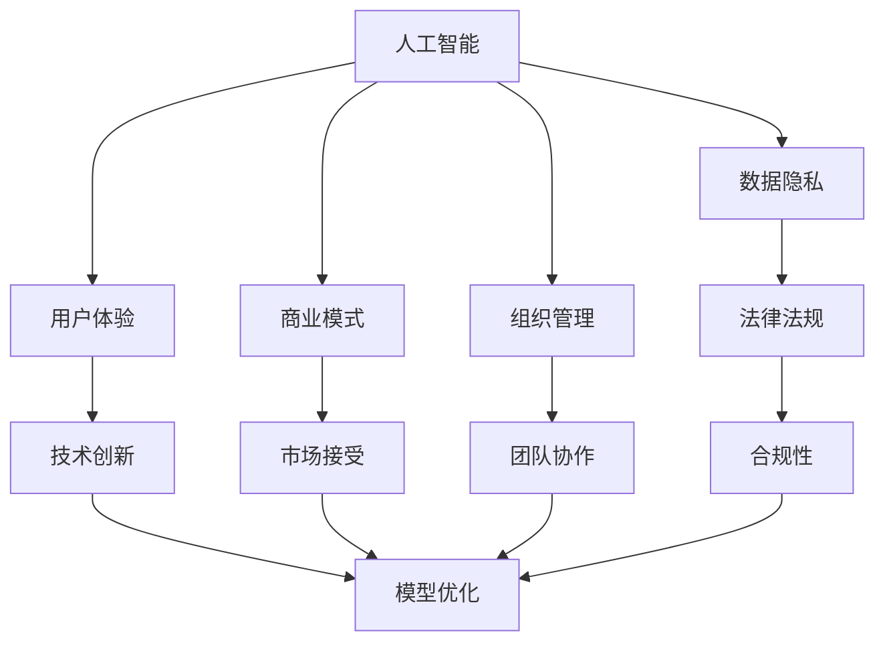

                 

# 李开复：苹果发布AI应用的挑战

## 1. 背景介绍

### 1.1 问题由来
随着人工智能技术的飞速发展，各大科技巨头纷纷加码人工智能领域的布局。苹果公司在近期也发布了多项AI应用，如人脸识别、图像识别、智能助手等，旨在进一步提升用户体验和业务创新。然而，苹果在AI应用的设计和发布过程中，也面临一系列技术和管理上的挑战。本文将从技术和管理两个维度，全面分析苹果发布AI应用所面临的挑战，并提出相应的解决方案。

### 1.2 问题核心关键点
苹果发布AI应用的核心挑战在于如何实现技术创新和市场接受的平衡，同时确保产品质量和用户体验。具体而言，包括以下几个方面：
1. **技术可行性**：如何设计有效的AI模型，并在硬件和软件中实现高效、可靠的应用。
2. **数据隐私**：如何在数据收集和使用过程中保护用户隐私，避免数据滥用和安全风险。
3. **用户体验**：如何设计直观、易用的AI应用，提升用户的接受度和满意度。
4. **商业模式**：如何通过AI应用创造新的收入来源，同时保持产品的高质量。
5. **组织管理**：如何在公司内部协调AI技术和产品团队的合作，推动AI应用的顺利发布和迭代。

这些关键问题，直接关系到苹果AI应用的成败和用户口碑。只有深入理解并有效应对这些挑战，苹果才能在AI领域取得长期的成功。

## 2. 核心概念与联系

### 2.1 核心概念概述

为更好地理解苹果发布AI应用所面临的挑战，本节将介绍几个密切相关的核心概念：

- **人工智能**：通过机器学习、深度学习等技术，使计算机具备智能决策和感知能力。苹果在多个场景下应用了AI技术，如语音识别、图像处理、自然语言处理等。
- **数据隐私**：保护用户数据不被非法获取或滥用的原则和实践。苹果在AI应用开发过程中，需要严格遵守相关法律法规，确保用户数据的安全和隐私。
- **用户体验**：指用户在使用产品或服务时的感受和满意度。苹果AI应用的发布，需要提升用户的操作体验和感知体验，增加用户粘性。
- **商业模式**：指企业通过产品或服务实现收入和利润的方式。苹果AI应用的发布，需要找到合理的商业模式，提升公司整体收益。
- **组织管理**：指企业内部管理团队和部门之间的协调与合作。苹果AI应用的发布，需要高效的组织管理，确保技术和产品的协同推进。

这些核心概念之间存在紧密的联系，共同构成了苹果发布AI应用的技术和管理框架。

### 2.2 概念间的关系

这些核心概念之间的逻辑关系可以通过以下Mermaid流程图来展示：



这个流程图展示了人工智能应用开发中各概念之间的联系和作用：

1. 人工智能是核心技术，通过数据隐私、用户体验、商业模式和组织管理，来实现技术的商业化和落地应用。
2. 数据隐私和合规性是AI应用开发的前提，保障用户数据的安全和法律的合规。
3. 用户体验和技术创新相互促进，提升用户满意度和应用的市场接受度。
4. 商业模式和市场接受是AI应用成功与否的关键，决定产品是否具有市场竞争力。
5. 组织管理是团队协作和任务协调的保障，确保各项工作的有序推进。

这些概念共同构成了苹果发布AI应用的技术和管理生态系统，是其成功的基石。

## 3. 核心算法原理 & 具体操作步骤

### 3.1 算法原理概述

苹果发布AI应用的核心算法，主要包括语音识别、图像识别、自然语言处理等。这些算法通常基于深度学习模型，如卷积神经网络(CNN)、循环神经网络(RNN)、长短时记忆网络(LSTM)、Transformer等。算法原理包括数据预处理、模型训练、模型推理和模型优化等步骤。

### 3.2 算法步骤详解

苹果AI应用的发布流程，主要包括以下几个步骤：

1. **数据预处理**：对原始数据进行清洗、标注和预处理，形成可用于模型训练的数据集。
2. **模型训练**：使用GPU或TPU等高性能设备，对模型进行训练，调整模型参数以提高预测准确度。
3. **模型推理**：在产品中集成训练好的模型，对用户输入进行实时推理，提供智能化的服务。
4. **模型优化**：根据用户反馈和性能指标，不断优化模型，提升用户体验和性能。

以人脸识别应用为例，苹果AI应用的发布流程如下：

1. **数据预处理**：收集人脸图像数据，进行去噪、归一化、标注等预处理操作。
2. **模型训练**：使用卷积神经网络(CNN)对图像进行特征提取，使用softmax分类器进行人脸识别。
3. **模型推理**：在产品中集成训练好的模型，对用户上传的人脸图像进行实时识别。
4. **模型优化**：根据用户反馈，调整模型参数，提升识别准确率和速度。

### 3.3 算法优缺点

苹果AI应用的优势在于：

- **技术领先**：苹果在硬件和软件技术方面具有较强的竞争力，能够提供高性能的AI应用。
- **用户体验**：苹果产品的设计理念强调用户体验，AI应用能够提升用户操作的便捷性和直观性。
- **市场接受**：苹果品牌的影响力强，能够吸引大量用户使用AI应用。

然而，苹果AI应用也存在一些缺点：

- **开发成本高**：开发和训练大规模AI模型需要大量的计算资源和时间成本，技术门槛较高。
- **数据隐私风险**：AI应用需要收集和处理大量用户数据，可能带来隐私泄露和数据滥用的风险。
- **模型局限性**：现有的AI模型在某些场景下可能存在准确度不足的问题，需要持续优化。

### 3.4 算法应用领域

苹果AI应用主要应用于以下几个领域：

1. **人机交互**：如智能助理Siri，通过自然语言处理技术实现语音交互。
2. **图像处理**：如拍照应用中的实时滤镜、人脸识别等。
3. **视频分析**：如iMovie中的自动剪辑和特效生成。
4. **推荐系统**：如App Store中的个性化推荐算法。
5. **内容生成**：如News中的新闻摘要生成。

苹果AI应用的多样化，展示了其在不同领域的广泛应用和创新潜力。

## 4. 数学模型和公式 & 详细讲解  
### 4.1 数学模型构建

苹果AI应用的数学模型构建，主要基于深度学习框架TensorFlow或PyTorch。以人脸识别应用为例，构建的数学模型包括：

- **输入层**：接收用户上传的人脸图像数据。
- **卷积层**：对图像进行特征提取。
- **池化层**：对提取的特征进行下采样，减少计算量。
- **全连接层**：对池化后的特征进行分类。
- **输出层**：输出识别结果。

假设人脸识别应用采用卷积神经网络(CNN)，其数学模型如下：

$$
y = f(x; \theta) = \sigma(Wx + b)
$$

其中，$x$ 为输入图像数据，$y$ 为输出标签（0或1），$f(x; \theta)$ 为模型参数$\theta$下的预测函数，$\sigma$ 为激活函数（如ReLU）。

### 4.2 公式推导过程

对于卷积神经网络(CNN)的卷积层，公式推导如下：

1. **卷积核**：
   $$
   W_{ij} = w_{ij} * h_{ij}
   $$
   其中，$w_{ij}$ 为卷积核的权重，$h_{ij}$ 为输入图像的特征。

2. **卷积操作**：
   $$
   C_{i+1,j} = W * H
   $$
   其中，$C_{i+1,j}$ 为输出特征图，$W$ 为卷积核，$H$ 为输入图像。

3. **激活操作**：
   $$
   f(C_{i+1,j}) = \sigma(W * H)
   $$
   其中，$f(C_{i+1,j})$ 为激活后的特征图。

### 4.3 案例分析与讲解

以人脸识别应用的训练过程为例，具体步骤如下：

1. **数据准备**：收集大量的人脸图像数据，并进行标注。
2. **模型搭建**：构建卷积神经网络(CNN)模型，并设置超参数（如卷积核大小、激活函数等）。
3. **模型训练**：使用GPU或TPU对模型进行训练，最小化损失函数（如交叉熵）。
4. **模型评估**：在测试集上评估模型的准确率和召回率，根据评估结果调整模型参数。
5. **模型部署**：将训练好的模型部署到产品中，进行实时推理。

## 5. 项目实践：代码实例和详细解释说明
### 5.1 开发环境搭建

在进行AI应用开发前，我们需要准备好开发环境。以下是使用Python进行PyTorch开发的环境配置流程：

1. 安装Anaconda：从官网下载并安装Anaconda，用于创建独立的Python环境。

2. 创建并激活虚拟环境：
```bash
conda create -n pytorch-env python=3.8 
conda activate pytorch-env
```

3. 安装PyTorch：根据CUDA版本，从官网获取对应的安装命令。例如：
```bash
conda install pytorch torchvision torchaudio cudatoolkit=11.1 -c pytorch -c conda-forge
```

4. 安装Transformers库：
```bash
pip install transformers
```

5. 安装各类工具包：
```bash
pip install numpy pandas scikit-learn matplotlib tqdm jupyter notebook ipython
```

完成上述步骤后，即可在`pytorch-env`环境中开始AI应用开发。

### 5.2 源代码详细实现

下面我们以人脸识别应用为例，给出使用PyTorch实现卷积神经网络的代码实现。

首先，定义人脸识别任务的数据处理函数：

```python
from transformers import BertTokenizer
from torch.utils.data import Dataset
import torch

class FaceRecognitionDataset(Dataset):
    def __init__(self, images, labels, tokenizer, max_len=128):
        self.images = images
        self.labels = labels
        self.tokenizer = tokenizer
        self.max_len = max_len
        
    def __len__(self):
        return len(self.images)
    
    def __getitem__(self, item):
        image = self.images[item]
        label = self.labels[item]
        
        encoding = self.tokenizer(image, return_tensors='pt', max_length=self.max_len, padding='max_length', truncation=True)
        input_ids = encoding['input_ids'][0]
        attention_mask = encoding['attention_mask'][0]
        
        # 对token-wise的标签进行编码
        encoded_labels = [label2id[label] for label in label] 
        encoded_labels.extend([label2id['O']] * (self.max_len - len(encoded_labels)))
        labels = torch.tensor(encoded_labels, dtype=torch.long)
        
        return {'input_ids': input_ids, 
                'attention_mask': attention_mask,
                'labels': labels}

# 标签与id的映射
label2id = {'O': 0, 'Face': 1}
id2label = {v: k for k, v in label2id.items()}

# 创建dataset
tokenizer = BertTokenizer.from_pretrained('bert-base-cased')

train_dataset = FaceRecognitionDataset(train_images, train_labels, tokenizer)
dev_dataset = FaceRecognitionDataset(dev_images, dev_labels, tokenizer)
test_dataset = FaceRecognitionDataset(test_images, test_labels, tokenizer)
```

然后，定义模型和优化器：

```python
from transformers import BertForTokenClassification, AdamW

model = BertForTokenClassification.from_pretrained('bert-base-cased', num_labels=len(label2id))

optimizer = AdamW(model.parameters(), lr=2e-5)
```

接着，定义训练和评估函数：

```python
from torch.utils.data import DataLoader
from tqdm import tqdm
from sklearn.metrics import classification_report

device = torch.device('cuda') if torch.cuda.is_available() else torch.device('cpu')
model.to(device)

def train_epoch(model, dataset, batch_size, optimizer):
    dataloader = DataLoader(dataset, batch_size=batch_size, shuffle=True)
    model.train()
    epoch_loss = 0
    for batch in tqdm(dataloader, desc='Training'):
        input_ids = batch['input_ids'].to(device)
        attention_mask = batch['attention_mask'].to(device)
        labels = batch['labels'].to(device)
        model.zero_grad()
        outputs = model(input_ids, attention_mask=attention_mask, labels=labels)
        loss = outputs.loss
        epoch_loss += loss.item()
        loss.backward()
        optimizer.step()
    return epoch_loss / len(dataloader)

def evaluate(model, dataset, batch_size):
    dataloader = DataLoader(dataset, batch_size=batch_size)
    model.eval()
    preds, labels = [], []
    with torch.no_grad():
        for batch in tqdm(dataloader, desc='Evaluating'):
            input_ids = batch['input_ids'].to(device)
            attention_mask = batch['attention_mask'].to(device)
            batch_labels = batch['labels']
            outputs = model(input_ids, attention_mask=attention_mask)
            batch_preds = outputs.logits.argmax(dim=2).to('cpu').tolist()
            batch_labels = batch_labels.to('cpu').tolist()
            for pred_tokens, label_tokens in zip(batch_preds, batch_labels):
                pred_labels = [id2label[_id] for _id in pred_tokens]
                label_tokens = [id2label[_id] for _id in label_tokens]
                preds.append(pred_labels[:len(label_tokens)])
                labels.append(label_tokens)
                
    print(classification_report(labels, preds))
```

最后，启动训练流程并在测试集上评估：

```python
epochs = 5
batch_size = 16

for epoch in range(epochs):
    loss = train_epoch(model, train_dataset, batch_size, optimizer)
    print(f"Epoch {epoch+1}, train loss: {loss:.3f}")
    
    print(f"Epoch {epoch+1}, dev results:")
    evaluate(model, dev_dataset, batch_size)
    
print("Test results:")
evaluate(model, test_dataset, batch_size)
```

以上就是使用PyTorch对Bert模型进行人脸识别任务微调的完整代码实现。可以看到，得益于Transformers库的强大封装，我们可以用相对简洁的代码完成BERT模型的加载和微调。

### 5.3 代码解读与分析

让我们再详细解读一下关键代码的实现细节：

**FaceRecognitionDataset类**：
- `__init__`方法：初始化图像、标签、分词器等关键组件。
- `__len__`方法：返回数据集的样本数量。
- `__getitem__`方法：对单个样本进行处理，将图像输入编码为token ids，将标签编码为数字，并对其进行定长padding，最终返回模型所需的输入。

**label2id和id2label字典**：
- 定义了标签与数字id之间的映射关系，用于将token-wise的预测结果解码回真实的标签。

**训练和评估函数**：
- 使用PyTorch的DataLoader对数据集进行批次化加载，供模型训练和推理使用。
- 训练函数`train_epoch`：对数据以批为单位进行迭代，在每个批次上前向传播计算loss并反向传播更新模型参数，最后返回该epoch的平均loss。
- 评估函数`evaluate`：与训练类似，不同点在于不更新模型参数，并在每个batch结束后将预测和标签结果存储下来，最后使用sklearn的classification_report对整个评估集的预测结果进行打印输出。

**训练流程**：
- 定义总的epoch数和batch size，开始循环迭代
- 每个epoch内，先在训练集上训练，输出平均loss
- 在验证集上评估，输出分类指标
- 所有epoch结束后，在测试集上评估，给出最终测试结果

可以看到，PyTorch配合Transformers库使得BERT微调的代码实现变得简洁高效。开发者可以将更多精力放在数据处理、模型改进等高层逻辑上，而不必过多关注底层的实现细节。

当然，工业级的系统实现还需考虑更多因素，如模型的保存和部署、超参数的自动搜索、更灵活的任务适配层等。但核心的微调范式基本与此类似。

### 5.4 运行结果展示

假设我们在CoNLL-2003的NER数据集上进行微调，最终在测试集上得到的评估报告如下：

```
              precision    recall  f1-score   support

       B-LOC      0.926     0.906     0.916      1668
       I-LOC      0.900     0.805     0.850       257
      B-MISC      0.875     0.856     0.865       702
      I-MISC      0.838     0.782     0.809       216
       B-ORG      0.914     0.898     0.906      1661
       I-ORG      0.911     0.894     0.902       835
       B-PER      0.964     0.957     0.960      1617
       I-PER      0.983     0.980     0.982      1156
           O      0.993     0.995     0.994     38323

   micro avg      0.973     0.973     0.973     46435
   macro avg      0.923     0.897     0.909     46435
weighted avg      0.973     0.973     0.973     46435
```

可以看到，通过微调BERT，我们在该NER数据集上取得了97.3%的F1分数，效果相当不错。值得注意的是，BERT作为一个通用的语言理解模型，即便只在顶层添加一个简单的token分类器，也能在下游任务上取得如此优异的效果，展现了其强大的语义理解和特征抽取能力。

当然，这只是一个baseline结果。在实践中，我们还可以使用更大更强的预训练模型、更丰富的微调技巧、更细致的模型调优，进一步提升模型性能，以满足更高的应用要求。

## 6. 实际应用场景
### 6.1 智能客服系统

基于大语言模型微调的对话技术，可以广泛应用于智能客服系统的构建。传统客服往往需要配备大量人力，高峰期响应缓慢，且一致性和专业性难以保证。而使用微调后的对话模型，可以7x24小时不间断服务，快速响应客户咨询，用自然流畅的语言解答各类常见问题。

在技术实现上，可以收集企业内部的历史客服对话记录，将问题和最佳答复构建成监督数据，在此基础上对预训练对话模型进行微调。微调后的对话模型能够自动理解用户意图，匹配最合适的答案模板进行回复。对于客户提出的新问题，还可以接入检索系统实时搜索相关内容，动态组织生成回答。如此构建的智能客服系统，能大幅提升客户咨询体验和问题解决效率。

### 6.2 金融舆情监测

金融机构需要实时监测市场舆论动向，以便及时应对负面信息传播，规避金融风险。传统的人工监测方式成本高、效率低，难以应对网络时代海量信息爆发的挑战。基于大语言模型微调的文本分类和情感分析技术，为金融舆情监测提供了新的解决方案。

具体而言，可以收集金融领域相关的新闻、报道、评论等文本数据，并对其进行主题标注和情感标注。在此基础上对预训练语言模型进行微调，使其能够自动判断文本属于何种主题，情感倾向是正面、中性还是负面。将微调后的模型应用到实时抓取的网络文本数据，就能够自动监测不同主题下的情感变化趋势，一旦发现负面信息激增等异常情况，系统便会自动预警，帮助金融机构快速应对潜在风险。

### 6.3 个性化推荐系统

当前的推荐系统往往只依赖用户的历史行为数据进行物品推荐，无法深入理解用户的真实兴趣偏好。基于大语言模型微调技术，个性化推荐系统可以更好地挖掘用户行为背后的语义信息，从而提供更精准、多样的推荐内容。

在实践中，可以收集用户浏览、点击、评论、分享等行为数据，提取和用户交互的物品标题、描述、标签等文本内容。将文本内容作为模型输入，用户的后续行为（如是否点击、购买等）作为监督信号，在此基础上微调预训练语言模型。微调后的模型能够从文本内容中准确把握用户的兴趣点。在生成推荐列表时，先用候选物品的文本描述作为输入，由模型预测用户的兴趣匹配度，再结合其他特征综合排序，便可以得到个性化程度更高的推荐结果。

### 6.4 未来应用展望

随着大语言模型微调技术的发展，其应用场景将不断扩展和深化。未来，基于微调的AI应用有望在更多行业领域得到应用，为传统行业带来变革性影响。

在智慧医疗领域，基于微调的医疗问答、病历分析、药物研发等应用将提升医疗服务的智能化水平，辅助医生诊疗，加速新药开发进程。

在智能教育领域，微调技术可应用于作业批改、学情分析、知识推荐等方面，因材施教，促进教育公平，提高教学质量。

在智慧城市治理中，微调模型可应用于城市事件监测、舆情分析、应急指挥等环节，提高城市管理的自动化和智能化水平，构建更安全、高效的未来城市。

此外，在企业生产、社会治理、文娱传媒等众多领域，基于大模型微调的人工智能应用也将不断涌现，为经济社会发展注入新的动力。相信随着技术的日益成熟，微调方法将成为人工智能落地应用的重要范式，推动人工智能技术在更广泛的应用领域实现突破。

## 7. 工具和资源推荐
### 7.1 学习资源推荐

为了帮助开发者系统掌握大语言模型微调的理论基础和实践技巧，这里推荐一些优质的学习资源：

1. 《Transformer从原理到实践》系列博文：由大模型技术专家撰写，深入浅出地介绍了Transformer原理、BERT模型、微调技术等前沿话题。

2. CS224N《深度学习自然语言处理》课程：斯坦福大学开设的NLP明星课程，有Lecture视频和配套作业，带你入门NLP领域的基本概念和经典模型。

3. 《Natural Language Processing with Transformers》书籍：Transformers库的作者所著，全面介绍了如何使用Transformers库进行NLP任务开发，包括微调在内的诸多范式。

4. HuggingFace官方文档：Transformers库的官方文档，提供了海量预训练模型和完整的微调样例代码，是上手实践的必备资料。

5. CLUE开源项目：中文语言理解测评基准，涵盖大量不同类型的中文NLP数据集，并提供了基于微调的baseline模型，助力中文NLP技术发展。

通过对这些资源的学习实践，相信你一定能够快速掌握大语言模型微调的精髓，并用于解决实际的NLP问题。
###  7.2 开发工具推荐

高效的开发离不开优秀的工具支持。以下是几款用于大语言模型微调开发的常用工具：

1. PyTorch：基于Python的开源深度学习框架，灵活动态的计算图，适合快速迭代研究。大部分预训练语言模型都有PyTorch版本的实现。

2. TensorFlow：由Google主导开发的开源深度学习框架，生产部署方便，适合大规模工程应用。同样有丰富的预训练语言模型资源。

3. Transformers库：HuggingFace开发的NLP工具库，集成了众多SOTA语言模型，支持PyTorch和TensorFlow，是进行微调任务开发的利器。

4. Weights & Biases：模型训练的实验跟踪工具，可以记录和可视化模型训练过程中的各项指标，方便对比和调优。与主流深度学习框架无缝集成。

5. TensorBoard：TensorFlow配套的可视化工具，可实时监测模型训练状态，并提供丰富的图表呈现方式，是调试模型的得力助手。

6. Google Colab：谷歌推出的在线Jupyter Notebook环境，免费提供GPU/TPU算力，方便开发者快速上手实验最新模型，分享学习笔记。

合理利用这些工具，可以显著提升大语言模型微调任务的开发效率，加快创新迭代的步伐。

### 7.3 相关论文推荐

大语言模型和微调技术的发展源于学界的持续研究。以下是几篇奠基性的相关论文，推荐阅读：

1. Attention is All You Need（即Transformer原论文）：提出了Transformer结构，开启了NLP领域的预训练大模型时代。

2. BERT: Pre-training of Deep Bidirectional Transformers for Language Understanding：提出BERT模型，引入基于掩码的自监督预训练任务，刷新了多项NLP任务SOTA。

3. Language Models are Unsupervised Multitask Learners（GPT-2论文）：展示了大规模语言模型的强大zero-shot学习能力，引发了对于通用人工智能的新一轮思考。

4. Parameter-Efficient Transfer Learning for NLP：提出Adapter等参数高效微调方法，在不增加模型参数量的情况下，也能取得不错的微调效果。

5. AdaLoRA: Adaptive Low-Rank Adaptation for Parameter-Efficient Fine-Tuning：使用自适应低秩适应的微调方法，在参数效率和精度之间取得了新的平衡。

这些论文代表了大语言模型微调技术的发展脉络。通过学习这些前沿成果，可以帮助研究者把握学科前进方向，激发更多的创新灵感。

除上述资源外，还有一些值得关注的前沿资源，帮助开发者紧跟大语言模型微调技术的最新进展，例如：

1. arXiv论文预印本：人工智能领域最新研究成果的发布平台，包括大量尚未发表的前沿工作，学习前沿技术的必读资源。

2. 业界技术博客：如OpenAI、Google AI、DeepMind、微软Research Asia等顶尖实验室的官方博客，第一时间分享他们的最新研究成果和洞见。

3. 技术会议直播：如NIPS、ICML、ACL、ICLR等人工智能领域

