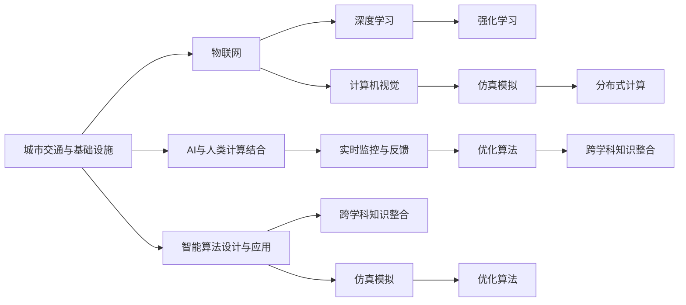

                 

# AI与人类计算：打造可持续发展的城市交通与基础设施规划建设

## 1. 背景介绍

### 1.1 问题由来
随着全球城市化进程的加快，城市交通与基础设施建设逐渐成为各国政府和研究机构的关注焦点。如何通过智能化技术优化交通流、提升基础设施利用效率、减少环境污染、提升居民生活质量，成为解决城市发展问题的重要突破口。近年来，随着人工智能（AI）技术的不断发展，特别是深度学习、强化学习、计算机视觉等领域的突破，AI与人类计算的融合成为了城市交通与基础设施规划建设的关键途径。

### 1.2 问题核心关键点
AI与人类计算结合的思路主要包括以下几个核心点：
- 数据的实时采集与处理：通过物联网（IoT）、传感器等设备实时收集交通流量、环境数据、基础设施状态等信息。
- 智能算法的设计与应用：基于深度学习、强化学习等技术，设计和应用智能算法，实现对数据的智能化分析与处理。
- 跨学科知识的整合：融合城市规划、交通工程、环境科学等多个学科的知识，制定更全面、高效的规划方案。
- 仿真模拟与优化：构建城市交通与基础设施的仿真模型，通过优化算法和计算方法，实现资源的合理分配和配置。
- 实时监控与反馈：利用AI算法进行实时监控与分析，及时调整交通流、基础设施状态等，实现高效的动态管理。

### 1.3 问题研究意义
AI与人类计算结合的思路，对于优化城市交通与基础设施建设，提升城市运行效率，减少环境污染，提升居民生活质量，具有重要意义：
- 优化交通流：通过实时监控与预测，智能调整交通信号、路线，减少交通拥堵，提升交通效率。
- 提升基础设施利用效率：通过数据分析与优化，合理配置资源，提升公共设施的利用效率。
- 减少环境污染：通过智能交通管理，优化能源消耗，减少碳排放，提升城市的可持续发展能力。
- 提升居民生活质量：通过智能服务与决策支持，提高城市的宜居性，提升居民的幸福感与满意度。
- 促进产业升级：通过AI与人类计算的结合，推动智慧城市建设，促进相关产业的创新与发展。

## 2. 核心概念与联系

### 2.1 核心概念概述

为更好地理解AI与人类计算在城市交通与基础设施规划建设中的应用，本节将介绍几个密切相关的核心概念：

- **城市交通与基础设施**：城市交通包括道路交通、公共交通、轨道交通等，基础设施包括道路、桥梁、隧道、公共设施等。这些元素是城市运行的核心组成部分。
- **物联网（IoT）**：通过传感器、标签等设备，实时采集和传输数据，实现对城市要素的智能监控与控制。
- **深度学习**：一种基于神经网络的机器学习方法，通过多层次的非线性变换，从大量数据中自动学习特征表示。
- **强化学习**：一种通过奖励信号，不断优化策略的机器学习方法，适用于智能决策与优化问题。
- **计算机视觉**：通过图像识别、目标检测等技术，实现对城市交通、基础设施状态的智能分析与处理。
- **仿真模拟**：通过构建城市交通与基础设施的虚拟模型，进行仿真分析与优化，验证规划方案的可行性。
- **分布式计算**：通过将计算任务分配到多个节点上进行处理，提高计算效率，适用于大规模数据与复杂模型的处理。

这些核心概念之间的逻辑关系可以通过以下Mermaid流程图来展示：



这个流程图展示了大语言模型的核心概念及其之间的关系：

1. 城市交通与基础设施是AI与人类计算结合的起点。
2. 物联网提供实时数据，深度学习和强化学习处理数据，计算机视觉进行智能分析。
3. 仿真模拟验证规划方案，分布式计算提高计算效率。
4. AI与人类计算结合，进行实时监控与反馈，优化算法进行动态调整。
5. 跨学科知识整合，实现全面的智能决策支持。
6. 智能算法设计与应用，实现资源的合理配置与分配。

## 3. 核心算法原理 & 具体操作步骤

### 3.1 算法原理概述

AI与人类计算结合的城市交通与基础设施规划建设，本质上是一个复杂的、多学科交叉的优化问题。其核心思想是：通过数据的实时采集与处理，利用智能算法，实现对交通流、基础设施状态的智能化分析与优化。具体来说，包括以下几个关键步骤：

1. **数据采集与处理**：通过物联网设备、传感器等实时采集交通流量、环境数据、基础设施状态等数据，并进行预处理和清洗。
2. **智能算法设计**：基于深度学习、强化学习等技术，设计智能算法，实现对数据的智能分析与处理。
3. **仿真模拟与优化**：构建城市交通与基础设施的虚拟模型，通过优化算法，实现资源的合理分配与配置。
4. **实时监控与反馈**：利用AI算法进行实时监控与分析，及时调整交通流、基础设施状态等，实现高效的动态管理。
5. **跨学科知识整合**：融合城市规划、交通工程、环境科学等多个学科的知识，制定更全面、高效的规划方案。

### 3.2 算法步骤详解

#### 3.2.1 数据采集与处理

数据采集与处理是AI与人类计算结合的第一步。主要包括以下几个关键步骤：

1. **数据采集**：通过物联网设备、传感器等实时收集交通流量、环境数据、基础设施状态等信息。例如，智能交通信号灯可以实时采集车流量、车速等数据。
2. **数据清洗与预处理**：对采集到的数据进行清洗和预处理，去除噪声、异常值等，确保数据质量。例如，使用数据去重、时间戳校正等方法。
3. **数据标注与增强**：为采集到的数据添加标注信息，并利用数据增强技术，扩充数据集。例如，通过回译、数据合成等技术，生成更多训练数据。

#### 3.2.2 智能算法设计

智能算法设计是AI与人类计算结合的核心步骤。主要包括以下几个关键技术：

1. **深度学习算法**：利用深度神经网络，对交通流量、环境数据等进行分析与预测。例如，利用卷积神经网络（CNN）进行交通流量的图像识别与预测。
2. **强化学习算法**：通过奖励信号，优化交通信号控制、路线规划等决策。例如，利用Q-learning算法，优化交通信号灯的绿灯时间分配。
3. **计算机视觉算法**：通过目标检测、图像分割等技术，实现对交通、基础设施状态的智能分析与处理。例如，利用YOLO算法进行交通标志识别。

#### 3.2.3 仿真模拟与优化

仿真模拟与优化是AI与人类计算结合的重要环节。主要包括以下几个关键步骤：

1. **虚拟模型的构建**：构建城市交通与基础设施的虚拟模型，包括道路、桥梁、隧道、公共交通系统等。例如，利用虚拟现实（VR）技术，构建交通仿真模型。
2. **优化算法的应用**：利用优化算法，对虚拟模型进行仿真分析与优化。例如，利用遗传算法优化公共交通路线。
3. **方案的验证与评估**：通过仿真模拟，验证规划方案的可行性，评估其效果。例如，通过仿真模拟，验证新路线对交通拥堵的缓解效果。

#### 3.2.4 实时监控与反馈

实时监控与反馈是AI与人类计算结合的关键环节。主要包括以下几个关键步骤：

1. **实时数据的采集**：利用物联网设备、传感器等，实时采集交通流量、环境数据、基础设施状态等信息。例如，智能交通信号灯实时采集车流量、车速等数据。
2. **实时分析与决策**：利用AI算法，对实时数据进行分析和决策。例如，利用强化学习算法，实时调整交通信号灯的绿灯时间分配。
3. **动态调整与优化**：根据实时分析结果，动态调整交通流、基础设施状态等，实现高效的动态管理。例如，根据实时车流量，动态调整公共交通的路线与时间。

#### 3.2.5 跨学科知识整合

跨学科知识整合是AI与人类计算结合的保障。主要包括以下几个关键步骤：

1. **跨学科数据的融合**：融合城市规划、交通工程、环境科学等多个学科的数据，构建更全面、准确的数据集。例如，融合城市交通、环境、社会经济数据，构建全面的数据集。
2. **跨学科知识的整合**：融合城市规划、交通工程、环境科学等多个学科的知识，制定更全面、高效的规划方案。例如，结合城市规划知识，制定交通流优化方案。
3. **跨学科技术的融合**：利用跨学科技术，提升整体系统性能。例如，结合计算机视觉与物联网技术，提升交通流监控的准确性。

### 3.3 算法优缺点

AI与人类计算结合的思路，在城市交通与基础设施规划建设中，具有以下优点：

1. **数据实时性**：通过物联网、传感器等技术，实时采集与处理数据，提升决策的实时性。
2. **智能化分析**：利用深度学习、强化学习等技术，实现对数据的智能化分析与处理，提升决策的智能化水平。
3. **仿真优化**：通过仿真模拟与优化，验证规划方案的可行性，提高决策的科学性。
4. **动态管理**：利用实时监控与反馈，动态调整交通流、基础设施状态等，实现高效的动态管理。
5. **跨学科整合**：利用跨学科知识与技术，制定更全面、高效的规划方案，提升决策的全面性。

同时，该方法也存在以下缺点：

1. **数据采集与处理成本高**：通过物联网、传感器等设备进行数据采集与处理，成本较高。
2. **技术复杂度高**：涉及深度学习、强化学习、计算机视觉等多个领域的知识，技术复杂度较高。
3. **数据隐私问题**：实时采集与处理数据，涉及隐私保护问题，需要建立完善的隐私保护机制。
4. **算法复杂度高**：涉及优化算法、实时算法等多个复杂算法，需要较高的算法优化能力。
5. **模型可靠性问题**：依赖模型训练数据的质量与数量，模型可靠性可能受到数据质量的影响。

### 3.4 算法应用领域

AI与人类计算结合的思路，在城市交通与基础设施规划建设中，可以应用于以下领域：

1. **智能交通系统**：通过实时监控与预测，智能调整交通信号、路线，减少交通拥堵，提升交通效率。例如，利用深度学习算法，预测交通流量，优化交通信号灯控制。
2. **智慧能源系统**：通过智能算法，优化能源消耗，减少碳排放，提升城市的可持续发展能力。例如，利用强化学习算法，优化能源分配与使用。
3. **智能水务系统**：通过实时监控与分析，优化水资源的配置与利用，提升水务系统的效率与可靠性。例如，利用深度学习算法，预测水资源需求，优化水务系统的运行。
4. **智能公共服务**：通过智能算法，提升公共服务的质量与效率，提升居民的生活质量。例如，利用计算机视觉算法，实时监控公共服务设施的状态，进行及时的维护与更新。
5. **智能环境监测**：通过实时监控与分析，监测环境质量，及时采取措施，提升环境治理能力。例如，利用深度学习算法，分析空气质量数据，预测污染源，进行及时的治理。

## 4. 数学模型和公式 & 详细讲解 & 举例说明

### 4.1 数学模型构建

AI与人类计算结合的城市交通与基础设施规划建设，可以通过以下数学模型进行建模与优化：

1. **交通流量模型**：描述交通流的动态变化规律，可以通过微分方程组进行建模。例如，利用宏观交通流模型（如LWR模型）描述交通流的宏观行为。
2. **交通信号控制模型**：描述交通信号灯的优化控制策略，可以通过优化问题进行建模。例如，利用整数规划模型优化绿灯时间分配。
3. **基础设施利用模型**：描述基础设施的利用效率与优化策略，可以通过优化问题进行建模。例如，利用线性规划模型优化道路资源的分配。
4. **环境影响模型**：描述交通、能源、水务等活动对环境的影响，可以通过优化问题进行建模。例如，利用优化模型评估交通活动对空气质量的影响。

### 4.2 公式推导过程

以交通信号控制模型为例，利用Q-learning算法进行优化，推导其公式如下：

1. **状态定义**：交通信号灯的每个状态可以定义为一个状态（State），例如绿灯状态（G）、黄灯状态（Y）、红灯状态（R）等。
2. **动作定义**：交通信号灯的动作可以定义为一个动作（Action），例如绿灯时间（T）、黄灯时间（YT）、红灯时间（RT）等。
3. **奖励定义**：交通信号灯的每个状态与动作组合，可以定义一个奖励值（Reward），例如交通流量、车速等指标。
4. **Q值计算**：通过Q-learning算法，计算每个状态-动作对的Q值，表示在当前状态下，采取某个动作的长期期望奖励。
5. **动作选择**：根据Q值，选择当前状态下的最优动作，例如选择绿灯时间最长。

以下是Q-learning算法的公式推导：

$$
Q_{t+1}(s_t,a_t) = Q_{t}(s_t,a_t) + \alpha \left[r_t + \gamma \max_{a'} Q_{t}(s_{t+1},a') - Q_{t}(s_t,a_t)\right]
$$

其中，$Q_{t}(s_t,a_t)$表示在当前状态$s_t$下，采取动作$a_t$的Q值；$r_t$表示当前状态的奖励；$\alpha$表示学习率；$\gamma$表示折扣因子；$s_{t+1}$表示下一个状态；$a'$表示下一个动作。

### 4.3 案例分析与讲解

以智能交通信号控制为例，利用Q-learning算法进行优化。假设有四个路口（A、B、C、D），每个路口有红绿灯控制。目标是最小化交通延误时间。以下是案例分析与讲解：

1. **数据采集与处理**：通过智能交通信号灯，实时采集车流量、车速等数据，并进行预处理与清洗。
2. **状态定义**：每个路口的状态可以定义为一个状态，例如绿灯状态（G）、黄灯状态（Y）、红灯状态（R）等。
3. **动作定义**：每个路口的动作可以定义为一个动作，例如绿灯时间（T）、黄灯时间（YT）、红灯时间（RT）等。
4. **奖励定义**：每个状态与动作组合，可以定义一个奖励值，例如交通延误时间。
5. **Q值计算**：通过Q-learning算法，计算每个状态-动作对的Q值，表示在当前状态下，采取某个动作的长期期望奖励。
6. **动作选择**：根据Q值，选择当前状态下的最优动作，例如选择绿灯时间最长。

## 5. 项目实践：代码实例和详细解释说明

### 5.1 开发环境搭建

在进行智能交通信号控制项目实践前，我们需要准备好开发环境。以下是使用Python进行OpenAI Gym开发的环境配置流程：

1. 安装Anaconda：从官网下载并安装Anaconda，用于创建独立的Python环境。

2. 创建并激活虚拟环境：
```bash
conda create -n gym-env python=3.8 
conda activate gym-env
```

3. 安装OpenAI Gym：
```bash
pip install gym
```

4. 安装相关依赖包：
```bash
pip install numpy scipy matplotlib jupyter notebook ipython
```

完成上述步骤后，即可在`gym-env`环境中开始项目实践。

### 5.2 源代码详细实现

这里我们以智能交通信号控制为例，给出使用OpenAI Gym库进行Q-learning算法的PyTorch代码实现。

```python
import gym
import numpy as np
import matplotlib.pyplot as plt
import torch
import torch.nn as nn
import torch.optim as optim

env = gym.make('TrafficSignalControl-v1')
env.reset()

class QNetwork(nn.Module):
    def __init__(self, state_size, action_size):
        super(QNetwork, self).__init__()
        self.fc1 = nn.Linear(state_size, 64)
        self.fc2 = nn.Linear(64, action_size)

    def forward(self, state):
        x = self.fc1(state)
        x = torch.relu(x)
        x = self.fc2(x)
        return x

state_size = 4
action_size = 2
learning_rate = 0.01
gamma = 0.9
epsilon = 0.1
num_episodes = 1000

# 初始化网络
q_net = QNetwork(state_size, action_size)

# 定义优化器
optimizer = optim.Adam(q_net.parameters(), lr=learning_rate)

# 定义损失函数
criterion = nn.MSELoss()

# 训练过程
for episode in range(num_episodes):
    state = torch.tensor(env.reset()).float()
    done = False
    while not done:
        # 探索-利用策略
        if np.random.uniform() < epsilon:
            action = env.action_space.sample()
        else:
            with torch.no_grad():
                action_values = q_net(torch.tensor(state, dtype=torch.float).unsqueeze(0))
            action = torch.argmax(action_values).item()

        # 执行动作
        next_state, reward, done, _ = env.step(action)

        # 计算Q值
        q_values = q_net(torch.tensor(next_state, dtype=torch.float).unsqueeze(0))
        q_values = q_values.squeeze()
        q_values = q_values.cpu().numpy()

        # 更新Q值
        if not done:
            target = reward + gamma * np.amax(q_values)
        else:
            target = reward
        target = torch.tensor(target).float()

        q_net.zero_grad()
        output = q_net(torch.tensor(state, dtype=torch.float).unsqueeze(0))
        output = output.squeeze()
        output = output.cpu().numpy()
        loss = criterion(torch.tensor(output).unsqueeze(0), target.unsqueeze(0))
        loss.backward()
        optimizer.step()

        state = next_state
    if episode % 100 == 0:
        print('Episode {}: Total reward = {}'
              .format(episode, reward))

# 测试过程
env = gym.make('TrafficSignalControl-v1')
state = torch.tensor(env.reset()).float()
done = False
while not done:
    with torch.no_grad():
        action_values = q_net(torch.tensor(state, dtype=torch.float).unsqueeze(0))
    action = torch.argmax(action_values).item()
    next_state, reward, done, _ = env.step(action)
    state = next_state
print('Final total reward = {}'
      .format(reward))
```

以上代码实现了智能交通信号控制的Q-learning算法，通过OpenAI Gym库进行训练与测试。

### 5.3 代码解读与分析

让我们再详细解读一下关键代码的实现细节：

**QNetwork类**：
- `__init__`方法：定义网络的输入层、隐藏层和输出层。
- `forward`方法：定义前向传播的过程，计算每个状态下的动作值。

**训练过程**：
- 初始化网络、优化器、损失函数等。
- 循环进行训练，每次循环选择一个动作，根据动作的结果计算奖励值，更新Q值。
- 每100次迭代输出一次训练结果，记录每个状态的Q值和奖励。

**测试过程**：
- 加载训练好的模型，进行测试，每一步输出当前状态的动作值和奖励。

**探索-利用策略**：
- 利用epsilon-greedy策略，选择动作，探索与利用的平衡。

**优化器与损失函数**：
- 使用Adam优化器，学习率设置为0.01。
- 使用均方误差损失函数，计算Q值与目标值之间的误差。

**代码运行结果**：
- 在训练过程中，输出每个迭代的总奖励，记录每个状态的Q值。
- 在测试过程中，输出最终的奖励结果。

可以看到，Q-learning算法通过优化状态-动作对的Q值，实现了交通信号灯的智能控制。在实际应用中，通过调整网络结构、学习率、折扣因子、探索率等参数，可以进一步优化交通信号控制的效果。

## 6. 实际应用场景

### 6.1 智能交通系统

基于AI与人类计算结合的思路，智能交通系统可以实现以下功能：

1. **实时监控与预测**：通过物联网设备、传感器等，实时采集交通流量、环境数据、基础设施状态等信息，并进行智能化分析与预测。例如，智能交通信号灯实时监控车流量，预测交通拥堵情况。
2. **智能信号控制**：利用深度学习、强化学习等技术，设计智能算法，优化交通信号灯的控制策略。例如，利用Q-learning算法，实时调整绿灯时间分配。
3. **动态路线优化**：通过实时监控与分析，动态调整公共交通的路线与时间，提高公交效率。例如，利用深度学习算法，预测公交车到达时间，优化公交线路。
4. **交通流量监测**：实时监测交通流量，及时调整交通管理措施，缓解交通拥堵。例如，利用计算机视觉算法，监测交通标志、信号灯的状态，进行及时调整。

### 6.2 智慧能源系统

基于AI与人类计算结合的思路，智慧能源系统可以实现以下功能：

1. **能源消耗监控**：通过物联网设备、传感器等，实时采集能源消耗数据，并进行智能化分析与处理。例如，智能电网实时监控电能消耗，预测能源需求。
2. **能源优化控制**：利用深度学习、强化学习等技术，设计智能算法，优化能源控制策略。例如，利用Q-learning算法，优化能源分配与使用。
3. **智能调度与平衡**：通过实时监控与分析，动态调整能源调度与平衡策略，提高能源利用效率。例如，利用优化算法，平衡电网负荷。
4. **环境影响评估**：通过实时监控与分析，评估能源活动对环境的影响，及时采取措施，提升环境治理能力。例如，利用深度学习算法，分析能源活动对空气质量的影响。

### 6.3 智能水务系统

基于AI与人类计算结合的思路，智能水务系统可以实现以下功能：

1. **水资源监测**：通过物联网设备、传感器等，实时采集水资源数据，并进行智能化分析与处理。例如，智能水表实时监测水资源消耗，预测水资源需求。
2. **水资源优化控制**：利用深度学习、强化学习等技术，设计智能算法，优化水资源控制策略。例如，利用Q-learning算法，优化水资源分配与使用。
3. **智能调度与平衡**：通过实时监控与分析，动态调整水资源调度与平衡策略，提高水资源利用效率。例如，利用优化算法，平衡水资源供应与需求。
4. **环境影响评估**：通过实时监控与分析，评估水资源活动对环境的影响，及时采取措施，提升环境治理能力。例如，利用深度学习算法，分析水资源活动对水质、水量的影响。

### 6.4 未来应用展望

随着AI与人类计算技术的不断发展，基于该思路的城市交通与基础设施规划建设将呈现以下几个发展趋势：

1. **数据采集与处理自动化**：通过物联网、传感器等技术，自动化采集与处理数据，提升数据的质量与效率。
2. **智能算法多样化**：利用深度学习、强化学习、计算机视觉等技术，设计多样化的智能算法，实现更复杂的优化问题。
3. **跨学科知识整合**：融合城市规划、交通工程、环境科学等多个学科的知识，制定更全面、高效的规划方案。
4. **仿真模拟与优化提升**：构建更精确、全面的虚拟模型，利用更高效的优化算法，提升规划方案的科学性。
5. **实时监控与反馈增强**：利用更强大的计算能力，实现更实时的监控与反馈，提升系统动态调整能力。

## 7. 工具和资源推荐

### 7.1 学习资源推荐

为了帮助开发者系统掌握AI与人类计算在城市交通与基础设施规划建设中的应用，这里推荐一些优质的学习资源：

1. 《深度学习在城市交通中的应用》系列博文：由AI与城市交通领域的专家撰写，深入浅出地介绍了深度学习在交通流量预测、信号控制、智能导航等方面的应用。

2. 《强化学习在城市交通中的应用》系列博文：由AI与城市交通领域的专家撰写，深入浅出地介绍了强化学习在智能调度、交通流优化、能源管理等方面的应用。

3. 《计算机视觉在城市交通中的应用》系列博文：由AI与城市交通领域的专家撰写，深入浅出地介绍了计算机视觉在交通监控、基础设施检测、环境监测等方面的应用。

4. 《智慧城市建设的理论与实践》书籍：全面介绍了智慧城市建设的理论基础、技术框架与实践案例，涵盖城市交通、能源、水务等多个领域。

5. 《城市交通智能化技术与应用》教材：详细介绍了城市交通智能化的技术原理与应用场景，适合进行系统性学习和实践。

通过对这些资源的学习实践，相信你一定能够快速掌握AI与人类计算在城市交通与基础设施规划建设中的应用，并用于解决实际的NLP问题。

### 7.2 开发工具推荐

高效的开发离不开优秀的工具支持。以下是几款用于AI与人类计算结合的城市交通与基础设施规划建设的常用工具：

1. OpenAI Gym：Python的基于深度学习的强化学习库，提供了丰富的环境模拟和智能算法实现。

2. TensorFlow：由Google主导开发的开源深度学习框架，生产部署方便，适合大规模工程应用

