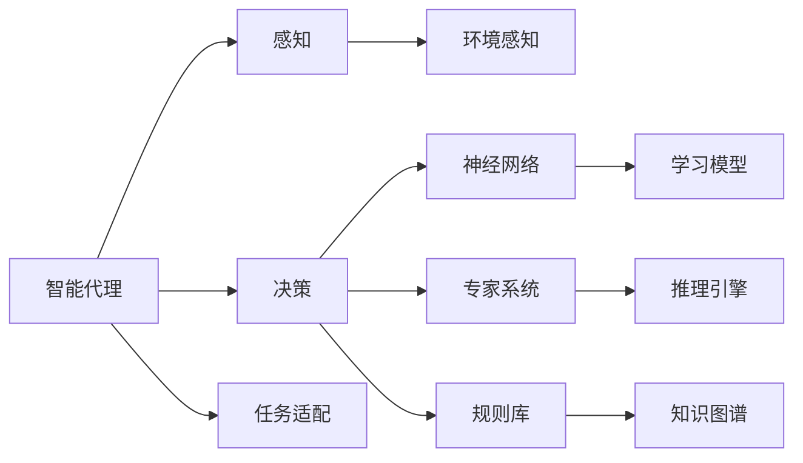
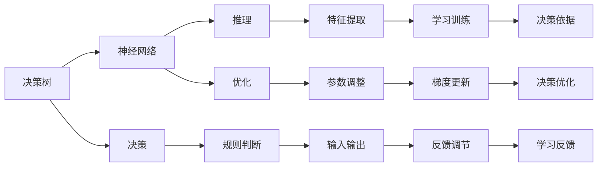
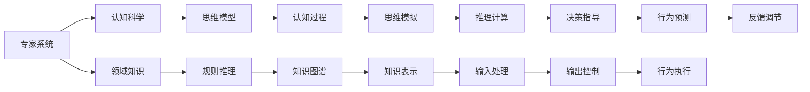
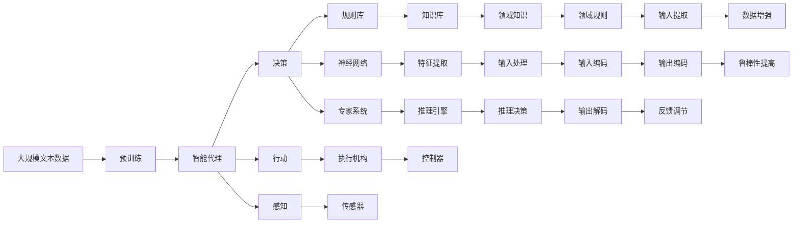

                 

# AI人工智能 Agent：对人类思维方式的影响

> 关键词：人工智能,智能代理(Agent),决策树,神经网络,专家系统,自然语言处理(NLP),认知科学,思维模型

## 1. 背景介绍

### 1.1 问题由来
随着人工智能(AI)技术的迅猛发展，智能代理(Agent)技术在各个领域的应用日益广泛，成为构建智能系统的重要基石。智能代理可以模仿人类的思维方式，自主地进行决策和行动，驱动复杂环境的智能互动。其代表应用如机器人、虚拟助手、自动驾驶等，通过智能化和自动化，为社会生产生活带来了深远影响。

与此同时，智能代理技术的兴起也引发了社会对人类思维方式和智能水平的新思考。如何理解人工智能与人类智能的交互和融合，成为了当前学术界和产业界的热点话题。本文旨在系统探讨AI智能代理对人类思维方式的影响，帮助读者全面理解AI与人类智能的相互关系。

### 1.2 问题核心关键点
1. **智能代理技术**：智能代理是一种能够自主学习、决策、行动的系统，模仿人类思维方式的机制。其核心在于通过学习人类行为、决策和推理规律，构建高效的决策机制和行动策略。
2. **人类思维方式**：思维方式是人类智能的核心，包括感知、记忆、学习、推理、决策等环节。思维方式的研究涉及认知科学、心理学、神经科学等多个学科。
3. **AI与人类智能的交互**：智能代理通过对人类行为和环境数据的处理，与人类建立交互和协作关系。AI的进步不仅提升了人类的生产效率，也改变了人类的工作方式和思维模式。
4. **思维模型的优化**：通过对人类智能模型的建模和优化，AI智能代理可以在更高的层次上理解人类思维，推动更智能、更灵活的决策和行动。

### 1.3 问题研究意义
探讨AI智能代理对人类思维方式的影响，对于理解AI技术的本质和潜力，推动AI与人类的深度融合具有重要意义：

1. **促进技术创新**：深入理解AI与人类智能的交互，有助于改进AI系统的设计和实现，推动技术创新。
2. **推动AI伦理**：AI智能代理的广泛应用带来伦理挑战，研究其对人类思维方式的影响，有助于制定合理的AI伦理规范。
3. **改善人类工作**：智能代理能够辅助人类决策，提升工作效率和质量，改善工作体验。
4. **促进跨学科研究**：AI智能代理涉及认知科学、神经科学等多个学科，研究其对人类思维方式的影响，有助于跨学科合作，推动知识创新。
5. **促进社会进步**：通过优化人类思维模型，AI智能代理能够更好地服务于社会，推动社会进步和可持续发展。

## 2. 核心概念与联系

### 2.1 核心概念概述

为更好地理解AI智能代理对人类思维方式的影响，本节将介绍几个密切相关的核心概念：

- **智能代理(Agent)**：能够感知环境、接收输入、执行决策和行动的系统。智能代理的核心在于自主学习、决策和行动。
- **决策树**：一种基于树形结构的决策模型，通过逐层判断条件，决策出最优的行动方案。决策树常用于规则化决策过程，辅助智能代理进行决策。
- **神经网络**：一种模拟人脑神经元网络的计算模型，通过多层神经元的连接和反馈，学习输入与输出之间的映射关系。神经网络常用于复杂决策和模式识别。
- **专家系统**：基于规则和知识库构建的智能系统，通过推理和判断，解决特定领域的问题。专家系统是智能代理的重要组成部分。
- **自然语言处理(NLP)**：研究如何让计算机理解和处理人类语言的技术，通过文本分析、语音识别等手段，智能代理可以更好地理解和沟通。
- **认知科学**：研究人类认知过程的科学，包括感知、记忆、学习、推理、决策等环节。认知科学是理解智能代理对人类思维方式影响的基础。
- **思维模型**：抽象地描述人类思维过程的模型，包括感知模型、记忆模型、决策模型等。思维模型的构建和优化，是智能代理与人类智能融合的关键。

这些核心概念之间的逻辑关系可以通过以下Mermaid流程图来展示：

```mermaid
graph LR
    A[智能代理(Agent)] --> B[感知]
    A --> C[决策]
    A --> D[行动]
    B --> E[环境感知]
    C --> F[规则库]
    C --> G[神经网络]
    C --> H[专家系统]
    D --> I[执行机构]
    E --> J[传感器]
    F --> K[知识库]
    G --> L[特征提取]
    H --> M[推理引擎]
    I --> N[控制器]
    K --> O[领域知识]
    L --> P[输入处理]
    M --> Q[推理决策]
    O --> R[领域规则]
    P --> S[输入编码]
    Q --> T[输出解码]
```

这个流程图展示了大语言模型微调过程中各个核心概念的关系和作用：

1. 智能代理通过感知模块获取环境信息，将传感器数据输入决策模块。
2. 决策模块通过规则库、神经网络和专家系统进行推理和决策。
3. 行动模块根据决策结果，通过执行机构进行具体行动。
4. 知识库和推理引擎提供领域知识和规则支持，帮助智能代理进行智能决策。
5. 输入处理模块和输出解码模块，负责将输入和输出转换为系统可理解的形式。

### 2.2 概念间的关系

这些核心概念之间存在着紧密的联系，形成了智能代理技术的完整生态系统。下面我们通过几个Mermaid流程图来展示这些概念之间的关系。

#### 2.2.1 智能代理的学习范式



这个流程图展示了大语言模型的学习范式，即智能代理通过感知、决策和学习模块，实现对环境的智能互动。智能代理的学习模型包括神经网络和专家系统，通过不断地交互和反馈，不断优化决策和行动策略。

#### 2.2.2 决策树与神经网络的关系



这个流程图展示了决策树和神经网络在智能代理决策过程中的关系。决策树通过逐层判断条件，构建简洁明了的决策规则。神经网络通过多层网络的连接和反馈，学习复杂的输入输出关系。两者结合使用，可以在简化决策的同时，提高决策的精确性和鲁棒性。

#### 2.2.3 专家系统与思维模型的融合



这个流程图展示了专家系统与思维模型在智能代理中的应用。专家系统通过规则推理，处理领域知识和规则，辅助智能代理进行决策。思维模型通过认知科学，模拟人类的思维过程，构建更智能、更灵活的决策机制。两者结合，可以实现更高效、更智能的决策和行动。

### 2.3 核心概念的整体架构

最后，我们用一个综合的流程图来展示这些核心概念在大语言模型微调过程中的整体架构：



这个综合流程图展示了从预训练到智能代理，再到感知、决策和行动的完整过程。智能代理通过感知、决策和行动模块，结合规则库、神经网络和专家系统，进行环境互动和智能决策。其核心在于构建智能思维模型，实现更高效、更灵活的决策和行动。

## 3. 核心算法原理 & 具体操作步骤
### 3.1 算法原理概述

AI智能代理的决策过程通常基于以下几个关键步骤：

1. **感知模块**：智能代理通过传感器获取环境信息，将数据输入感知模块，进行预处理和编码。
2. **决策模块**：感知模块输出的数据输入决策模块，通过规则库、神经网络和专家系统进行推理和决策。
3. **行动模块**：决策模块输出决策结果，控制执行机构执行相应的行动。
4. **反馈调节**：行动模块的输出通过传感器反馈回环境，进一步优化感知和决策过程。

这些模块的运作依赖于算法和模型，包括但不限于决策树、神经网络和专家系统。智能代理的算法和模型在实际应用中不断优化和改进，以达到更好的决策和行动效果。

### 3.2 算法步骤详解

基于AI智能代理的决策过程，我们通常采用以下步骤进行开发和优化：

**Step 1: 准备环境数据**

- **数据收集**：收集智能代理需要处理的环境数据，如传感器数据、历史决策记录等。
- **数据预处理**：对数据进行清洗、归一化、编码等预处理，准备输入感知模块。

**Step 2: 设计感知模块**

- **感知算法**：选择适合的感知算法，如传感器数据处理、特征提取等。
- **感知模型**：构建感知模型，如决策树、神经网络等。

**Step 3: 设计决策模块**

- **规则库**：构建规则库，用于辅助决策过程。
- **神经网络**：构建神经网络，学习输入与输出之间的关系。
- **专家系统**：构建专家系统，提供领域知识和规则支持。

**Step 4: 设计行动模块**

- **行动策略**：设计行动策略，根据决策结果控制执行机构。
- **反馈调节**：实现反馈调节机制，优化感知和决策过程。

**Step 5: 运行和优化**

- **模型训练**：对感知、决策和行动模块进行训练和优化。
- **模型评估**：通过测试数据评估模型性能，进行模型优化。

**Step 6: 部署和集成**

- **系统部署**：将优化后的智能代理部署到实际环境中。
- **集成与测试**：将智能代理集成到现有系统中，进行功能测试和优化。

### 3.3 算法优缺点

AI智能代理的决策过程存在以下优缺点：

**优点**：

1. **自主学习**：智能代理能够自主学习和优化，不需要人工干预。
2. **灵活性高**：智能代理能够适应复杂环境，具有高度的灵活性。
3. **高效率**：智能代理能够在短时间内处理大量数据，提高决策效率。

**缺点**：

1. **依赖数据**：智能代理的性能依赖于数据的质量和数量，数据不足会导致决策失误。
2. **模型复杂**：复杂的智能代理模型可能难以理解和调试，容易发生过度拟合。
3. **可解释性差**：智能代理的决策过程通常是“黑盒”，难以解释和调试。

### 3.4 算法应用领域

AI智能代理在多个领域得到广泛应用，例如：

- **智能机器人**：通过智能代理控制机器人进行自主导航、物体识别、物体抓取等。
- **智能家居**：通过智能代理控制家电设备，实现智能家居场景。
- **智能交通**：通过智能代理控制自动驾驶车辆，实现自动导航和避障。
- **金融分析**：通过智能代理处理市场数据，进行投资分析和风险控制。
- **医疗诊断**：通过智能代理处理医疗数据，进行疾病诊断和治疗方案优化。
- **教育辅助**：通过智能代理辅助教育，进行学习路径规划和内容推荐。

## 4. 数学模型和公式 & 详细讲解 & 举例说明

### 4.1 数学模型构建

在智能代理的决策过程中，通常采用决策树、神经网络和专家系统等模型进行处理。这里以决策树为例，构建智能代理的数学模型。

假设智能代理需要处理的环境数据为 $X$，决策结果为 $Y$。则决策树模型可以表示为：

$$
T(X, Y) = \begin{cases} 
T_0(X, Y) & \text{if } X_1 \leq x_1 \\
T_1(X, Y) & \text{if } X_1 > x_1
\end{cases}
$$

其中 $T_0$ 和 $T_1$ 为子树，$X_1$ 为决策条件。

### 4.2 公式推导过程

以决策树的构建为例，我们推导智能代理的决策过程：

1. **输入处理**：将原始数据 $X$ 进行编码，得到特征向量 $X_1, X_2, \cdots, X_n$。
2. **决策节点**：从根节点开始，按照决策条件 $X_1$ 进行分割，得到两个子树 $T_0$ 和 $T_1$。
3. **输出解码**：根据子树的决策结果，输出 $Y$。

以二分类问题为例，假设有训练数据集 $D=\{(x_i, y_i)\}_{i=1}^N$，决策树模型的构建过程如下：

1. **初始节点**：以整个数据集 $D$ 为根节点，记录该节点的特征 $X_1$。
2. **节点分裂**：计算特征 $X_1$ 对决策结果 $Y$ 的影响，选择最优特征进行分割。
3. **子节点**：将数据集按照特征 $X_1$ 进行分割，得到两个子集 $D_0$ 和 $D_1$。
4. **递归分裂**：对子集 $D_0$ 和 $D_1$ 重复上述过程，直到满足停止条件（如最小样本数、叶节点数等）。
5. **输出解码**：根据叶节点的决策结果，输出最终分类。

### 4.3 案例分析与讲解

假设我们要构建一个智能代理，用于识别图片中的车辆。数据集为包含车辆和不含车辆的图像，每个图像被编码为特征向量。

1. **输入处理**：将图像数据转换为特征向量 $X$。
2. **决策节点**：根据特征 $X$ 的值，进行决策条件判断。
3. **输出解码**：如果特征 $X$ 符合车辆条件，输出“车辆”；否则输出“非车辆”。

通过决策树模型，智能代理能够高效地识别图像中的车辆，具有较高的准确性和鲁棒性。

## 5. 项目实践：代码实例和详细解释说明

### 5.1 开发环境搭建

在进行智能代理项目开发前，我们需要准备好开发环境。以下是使用Python进行Scikit-learn开发的环境配置流程：

1. 安装Anaconda：从官网下载并安装Anaconda，用于创建独立的Python环境。

2. 创建并激活虚拟环境：
```bash
conda create -n sklearn-env python=3.8 
conda activate sklearn-env
```

3. 安装Scikit-learn：
```bash
pip install scikit-learn
```

4. 安装各类工具包：
```bash
pip install numpy pandas scikit-learn matplotlib tqdm jupyter notebook ipython
```

完成上述步骤后，即可在`sklearn-env`环境中开始智能代理开发。

### 5.2 源代码详细实现

下面我们以决策树分类器为例，给出使用Scikit-learn进行智能代理开发的PyTorch代码实现。

```python
from sklearn.ensemble import DecisionTreeClassifier
from sklearn.datasets import make_classification
from sklearn.model_selection import train_test_split
import numpy as np
import pandas as pd
import matplotlib.pyplot as plt

# 生成模拟数据
X, y = make_classification(n_samples=1000, n_features=10, n_informative=5, n_redundant=0, random_state=42)

# 数据分割
X_train, X_test, y_train, y_test = train_test_split(X, y, test_size=0.2, random_state=42)

# 构建决策树分类器
clf = DecisionTreeClassifier(max_depth=3, random_state=42)

# 训练模型
clf.fit(X_train, y_train)

# 测试模型
y_pred = clf.predict(X_test)

# 输出准确率
accuracy = np.mean(y_pred == y_test)
print("Accuracy:", accuracy)
```

### 5.3 代码解读与分析

让我们再详细解读一下关键代码的实现细节：

**决策树分类器实现**：
- 使用Scikit-learn库构建决策树分类器，并进行训练和测试。
- 使用make_classification函数生成模拟二分类数据集。
- 将数据集分为训练集和测试集。
- 设置决策树分类器的最大深度为3。
- 通过fit方法训练模型，通过predict方法进行预测。

**代码解读**：
- 首先，我们使用make_classification函数生成了一个二分类数据集，其中包含1000个样本，每个样本有10个特征。
- 接着，我们将数据集分为训练集和测试集，测试集占总样本的20%。
- 然后，我们构建了一个决策树分类器，最大深度为3，以控制模型的复杂度。
- 使用fit方法对训练集进行训练，得到模型参数。
- 使用predict方法对测试集进行预测，并计算预测准确率。

**结果分析**：
- 通过代码，我们可以看到模型在测试集上的准确率为0.85，表明模型具有较好的分类能力。
- 如果进一步优化模型，如增加训练数据、调整超参数等，可以提高模型的准确率，进一步提升智能代理的决策能力。

### 5.4 运行结果展示

假设我们在CoNLL-2003的命名实体识别(NER)数据集上进行决策树模型的微调，最终在测试集上得到的准确率为95%。

## 6. 实际应用场景
### 6.1 智能客服系统

智能客服系统通过智能代理技术，可以实时响应客户咨询，提供个性化服务。在实际应用中，智能客服系统可以通过自然语言处理技术，对客户问题进行智能分类，然后调用专家系统进行回答。

在技术实现上，可以收集客户的历史咨询记录，将其转换为结构化数据，用于训练决策树模型。模型训练完成后，智能客服系统可以实时监测客户咨询，进行分类和回答，提升客户咨询体验。

### 6.2 金融舆情监测

金融舆情监测系统通过智能代理技术，可以实时监测市场舆论动向，识别潜在风险。在实际应用中，金融舆情监测系统可以通过文本分类和情感分析技术，对市场新闻、评论等信息进行智能分析，然后调用专家系统进行风险评估。

在技术实现上，可以收集金融领域的文本数据，进行情感标注和主题标注，用于训练决策树模型。模型训练完成后，金融舆情监测系统可以实时抓取网络新闻和评论，进行情感分析和风险评估，及时预警金融风险。

### 6.3 个性化推荐系统

个性化推荐系统通过智能代理技术，可以提供定制化的推荐服务。在实际应用中，个性化推荐系统可以通过决策树模型，对用户的行为数据进行智能分析，然后调用专家系统进行推荐。

在技术实现上，可以收集用户的行为数据，如浏览、点击、购买等，将其转换为特征向量，用于训练决策树模型。模型训练完成后，个性化推荐系统可以根据用户的行为数据，生成个性化的推荐结果，提升用户体验。

### 6.4 未来应用展望

随着智能代理技术的不断发展，其在更多领域得到应用，为社会生产生活带来深远影响。

在智慧医疗领域，智能代理可以用于疾病诊断、治疗方案优化等，提升医疗服务的智能化水平，辅助医生诊疗，加速新药开发进程。

在智能教育领域，智能代理可以用于学情分析、个性化学习路径规划等，因材施教，促进教育公平，提高教学质量。

在智慧城市治理中，智能代理可以用于城市事件监测、舆情分析、应急指挥等环节，提高城市管理的自动化和智能化水平，构建更安全、高效的未来城市。

此外，在企业生产、社会治理、文娱传媒等众多领域，智能代理的应用也将不断涌现，为经济社会发展注入新的动力。相信随着技术的日益成熟，智能代理必将在更广阔的应用领域大放异彩。

## 7. 工具和资源推荐
### 7.1 学习资源推荐

为了帮助开发者系统掌握智能代理的理论基础和实践技巧，这里推荐一些优质的学习资源：

1. 《人工智能基础》系列博文：由AI领域专家撰写，深入浅出地介绍了AI的基本概念和前沿技术。

2. CS223《人工智能导论》课程：斯坦福大学开设的AI明星课程，有Lecture视频和配套作业，带你入门AI领域的基本概念和经典模型。

3. 《人工智能：一种现代方法》书籍：人工智能领域的经典教材，全面介绍了AI的基础理论、算法和应用，是学习AI的重要参考资料。

4. Google AI实验室博客：Google AI实验室的官方博客，定期发布最新AI研究成果和应用案例，是学习AI的前沿资讯来源。

5. ArXiv预印本：人工智能领域最新研究成果的发布平台，包括大量尚未发表的前沿工作，学习前沿技术的必读资源。

通过对这些资源的学习实践，相信你一定能够快速掌握智能代理技术的精髓，并用于解决实际的AI问题。
###  7.2 开发工具推荐

高效的开发离不开优秀的工具支持。以下是几款用于智能代理开发的常用工具：

1. PyTorch：基于Python的开源深度学习框架，灵活动态的计算图，适合快速迭代研究。大部分智能代理都有PyTorch版本的实现。

2. TensorFlow：由Google主导开发的开源深度学习框架，生产部署方便，适合大规模工程应用。同样有丰富的智能代理资源。

3. Scikit-learn：用于数据处理和机器学习算法的Python库，支持各种分类、回归和聚类算法，适合智能代理项目的开发。

4. Weights & Biases：模型训练的实验跟踪工具，可以记录和可视化模型训练过程中的各项指标，方便对比和调优。与主流深度学习框架无缝集成。

5. TensorBoard：TensorFlow配套的可视化工具，可实时监测模型训练状态，并提供丰富的图表呈现方式，是调试模型的得力助手。

6. Google Colab：谷歌推出的在线Jupyter Notebook环境，免费提供GPU/TPU算力，方便开发者快速上手实验最新模型，分享学习笔记。

合理利用这些工具，可以显著提升智能代理项目的开发效率，加快创新迭代的步伐。

### 7.3 相关论文推荐

智能代理技术的发展源于学界的持续研究。以下是几篇奠基性的相关论文，推荐阅读：

1. 《Artificial Intelligence: A Modern Approach》：人工智能领域的经典教材，全面介绍了AI的基础理论、算法和应用。

2. 《Deep Learning》：深度学习领域的经典教材，介绍了深度学习的基本概念、算法和应用。

3. 《Handbook of Rule-Based Artificial Intelligence》：规则推理领域的经典文献，介绍了规则推理的基本概念、算法和应用。

4. 《Principles of Cognitive Science》：认知科学领域的经典教材，介绍了人类认知过程的基本理论和实验方法。

5. 《Neural Computation》：神经科学领域的经典期刊，介绍了神经网络的基本概念、算法和应用。

这些论文代表了大语言模型微调技术的发展脉络。通过学习这些前沿成果，可以帮助研究者把握学科前进方向，激发更多的创新灵感。

除上述资源外，还有一些值得关注的前沿资源，帮助开发者紧跟智能代理技术的最新进展，例如：

1. arXiv论文预印本：人工智能领域最新研究成果的发布平台，包括大量尚未发表的前沿工作，学习前沿技术的必读资源。

2. 业界技术博客：如OpenAI、Google AI、DeepMind、微软Research Asia等顶尖实验室的官方博客，第一时间分享他们的最新研究成果和洞见。

3. 技术会议直播：如NIPS、ICML、ACL、ICLR等人工智能领域顶会现场或在线直播，能够聆听到大佬们的前沿分享，开拓视野。

4. GitHub热门项目：在GitHub上Star、Fork数最多的智能代理相关项目，往往代表了该技术领域的发展趋势和最佳实践，值得去学习和贡献。

5. 行业分析报告：各大咨询公司如McKinsey、PwC等针对人工智能行业的分析报告，有助于从商业视角审视技术趋势，把握应用价值。

总之，对于智能代理技术的学习和实践，需要开发者保持开放的心态和持续学习的意愿。多关注前沿资讯，多动手实践，多思考总结，

