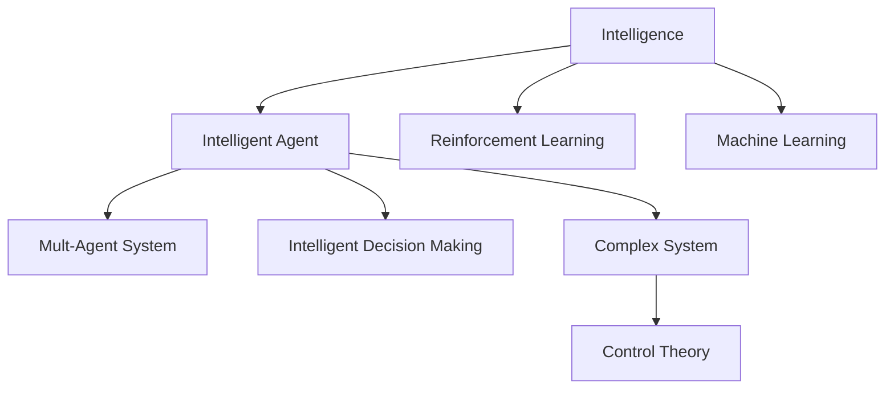
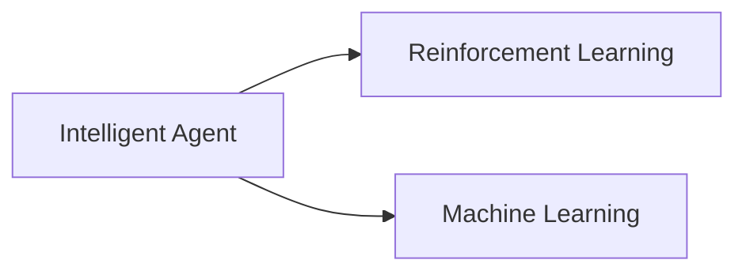
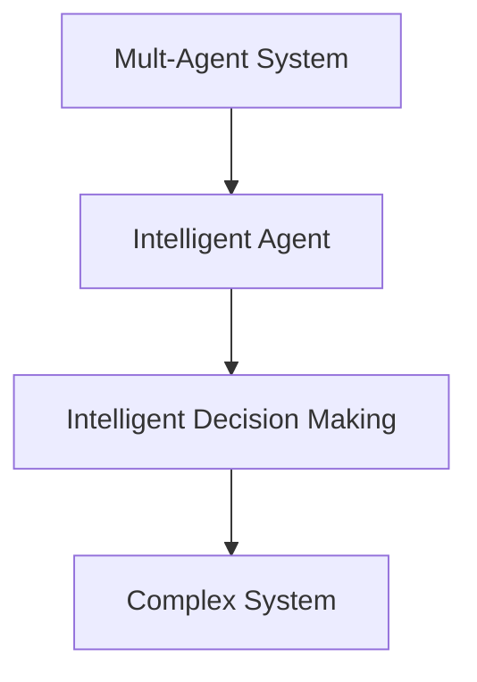
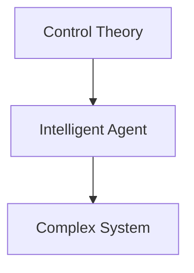
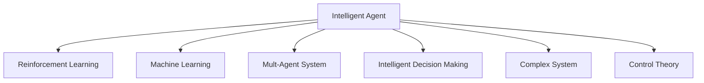

                 

# AI人工智能 Agent：高级概念剖析

> 关键词：人工智能,智能代理(Agent),强化学习,机器学习,多智能体系统,智能决策,复杂系统,控制理论

## 1. 背景介绍

### 1.1 问题由来

人工智能(Artificial Intelligence, AI)是计算机科学中的一个重要领域，旨在使计算机系统能够执行原本需要人类智能才能完成的任务。随着AI技术的飞速发展，人类开始步入智能时代。然而，现有的AI系统往往缺乏自主决策能力，无法像人类一样在复杂多变的环境中灵活适应和做出明智选择。如何构建更加智能、自主的AI系统，成为当前AI研究的重要课题。

### 1.2 问题核心关键点

智能代理(Agent)，作为一种能够自主学习、决策和交互的AI实体，是构建智能系统的关键组成部分。通过将智能代理嵌入到复杂的、动态的环境中，AI系统能够模拟人类行为，自主应对环境变化，从而实现更加灵活、高效的智能应用。

智能代理的核心在于如何设计其行为模型，使其能够利用各种数据源和算法，智能地感知环境、做出决策、执行任务。这其中涉及到多个核心概念和算法，如强化学习、机器学习、多智能体系统等。如何设计这些智能代理，并将其应用于各种实际场景，是本文的主要研究对象。

### 1.3 问题研究意义

研究智能代理的设计与应用，对于推动AI技术在更多领域中的应用，提升AI系统的自主决策能力和智能水平，具有重要意义：

1. 提高AI系统的自主性和适应性。通过智能代理，AI系统能够在复杂环境中自主决策，避免对人类干预的依赖。
2. 提升AI系统的灵活性和泛化能力。智能代理可以自适应不同的任务和环境，增强系统的灵活性和泛化性能。
3. 推动AI技术的产业化进程。智能代理在实际应用中的成功案例，如自动驾驶、智能客服、供应链管理等，将加速AI技术的市场落地和产业升级。
4. 拓展AI技术的学术研究边界。智能代理涉及控制理论、机器学习、多智能体系统等多个领域，其研究和应用将推动AI技术在更多学术领域的发展。
5. 为社会和经济带来广泛变革。智能代理能够在多个垂直行业提升效率、优化资源配置、改善用户体验，从而带来深远的社会和经济影响。

## 2. 核心概念与联系

### 2.1 核心概念概述

为了更好地理解智能代理的设计与应用，本节将介绍几个密切相关的核心概念：

- 智能代理(Agent)：指能够自主感知环境、决策和执行任务的AI实体，能够在动态变化的环境中智能交互。
- 强化学习(Reinforcement Learning, RL)：一种通过与环境交互，学习最优决策策略的学习范式。智能代理通过不断的试错，在动态环境中自主学习并优化其行为。
- 机器学习(Machine Learning, ML)：通过数据驱动的方式，使AI系统能够从数据中学习规律，提升其预测和决策能力。
- 多智能体系统(Multi-Agent System, MAS)：由多个智能代理组成的系统，各智能代理间可以协同工作，共同完成任务。
- 智能决策：指智能代理根据环境信息和自身目标，自主选择最优决策的过程。
- 复杂系统：指由大量相互关联的元素组成的系统，具有非线性、多目标、不确定性等特点，需要通过智能代理进行管理和控制。
- 控制理论：研究如何设计智能代理，使其能够在复杂环境中高效决策和执行任务的理论基础。

这些核心概念之间的逻辑关系可以通过以下Mermaid流程图来展示：



这个流程图展示了大语言模型微调过程中各个核心概念的关系和作用：

1. 智能代理是AI系统的核心组件，通过学习控制理论，实现复杂系统的管理和决策。
2. 强化学习是智能代理的主要学习范式，通过与环境交互，不断优化其行为策略。
3. 机器学习为智能代理提供数据支持，提升其预测和决策能力。
4. 多智能体系统是智能代理协同工作的基础，通过各代理间的交互，共同完成任务。
5. 智能决策是智能代理的最终目标，通过自主选择最优策略，实现任务的执行和目标的达成。
6. 复杂系统是智能代理的典型应用场景，需要多智能体协同管理，实现高效决策和执行。
7. 控制理论为智能代理的设计提供理论基础，帮助其高效应对环境变化和不确定性。

这些概念共同构成了智能代理的完整框架，使其能够在复杂系统中发挥强大的自主决策和执行能力。通过理解这些核心概念，我们可以更好地把握智能代理的设计思路和应用场景。

### 2.2 概念间的关系

这些核心概念之间存在着紧密的联系，形成了智能代理的完整生态系统。下面我们通过几个Mermaid流程图来展示这些概念之间的关系。

#### 2.2.1 智能代理的学习范式



这个流程图展示了智能代理的学习范式。智能代理主要通过强化学习和机器学习来优化其行为策略和决策能力。

#### 2.2.2 多智能体系统的协同工作



这个流程图展示了多智能体系统的工作原理。各智能代理在复杂系统中协同工作，共同完成任务，增强系统的灵活性和效率。

#### 2.2.3 控制理论的应用



这个流程图展示了控制理论在智能代理中的应用。通过设计有效的控制策略，智能代理能够在复杂环境中高效决策和执行任务。

### 2.3 核心概念的整体架构

最后，我们用一个综合的流程图来展示这些核心概念在智能代理中的整体架构：



这个综合流程图展示了智能代理的完整架构，从数据获取、学习优化、协同工作、决策执行到系统管理，每个环节都涉及到多个核心概念和技术。通过这些概念的有机结合，智能代理能够在复杂系统中实现高效、灵活的智能决策和执行。

## 3. 核心算法原理 & 具体操作步骤
### 3.1 算法原理概述

智能代理的行为策略设计通常涉及到强化学习和机器学习等多种技术，其核心算法原理可以概括为以下步骤：

1. 定义智能代理的行为策略：根据任务需求，设计智能代理的行为策略，定义状态空间和行动空间。
2. 选择学习算法：根据具体任务和环境特性，选择合适的学习算法，如Q-learning、深度Q网络(DQN)、策略梯度等。
3. 与环境交互：在动态环境中，智能代理通过感知环境状态，选择行动，并根据结果进行反馈。
4. 更新行为策略：根据反馈信息，更新智能代理的行为策略，优化其决策能力。
5. 执行任务：在优化后的策略下，智能代理执行任务，并不断调整策略，以适应环境变化。

### 3.2 算法步骤详解

以下是智能代理设计中常见的算法步骤详解：

**Step 1: 环境建模**

智能代理的行为策略设计通常需要对环境进行建模。环境建模包括定义状态空间、行动空间、奖励函数等。这些定义决定了智能代理的学习目标和优化方向。

- 状态空间：定义智能代理需要感知的环境变量。如在自动驾驶中，状态空间可能包括车速、车距、道路状况等。
- 行动空间：定义智能代理可以采取的行动方案。如在自动驾驶中，行动空间可能包括加速、减速、转向等。
- 奖励函数：定义智能代理在每个时刻采取行动后的即时奖励。如在自动驾驶中，到达目的地即获得奖励，否则可能受到惩罚。

**Step 2: 选择学习算法**

根据任务特性和环境特性，选择合适的学习算法，如Q-learning、深度Q网络(DQN)、策略梯度等。这些算法通过与环境交互，不断优化智能代理的行为策略。

- Q-learning：基于值函数的方法，通过最大化长期累积奖励，优化行动策略。
- 深度Q网络(DQN)：使用深度神经网络逼近Q值函数，提高学习效率和精度。
- 策略梯度：通过直接优化策略，最大化即时奖励和累积奖励。

**Step 3: 与环境交互**

智能代理在动态环境中通过感知状态、选择行动并接收反馈，不断优化其行为策略。

- 感知状态：智能代理通过传感器或规则，感知环境状态，形成状态向量。
- 选择行动：智能代理根据当前状态和行为策略，选择最优行动方案。
- 接收反馈：智能代理根据环境反馈，更新状态和奖励信息。

**Step 4: 更新行为策略**

根据反馈信息，更新智能代理的行为策略，优化其决策能力。

- 状态更新：智能代理根据环境反馈，更新当前状态，形成新的状态向量。
- 行动策略更新：智能代理根据新的状态和行动方案，重新计算Q值，更新行动策略。
- 奖励更新：智能代理根据即时奖励和累积奖励，更新奖励函数。

**Step 5: 执行任务**

在优化后的策略下，智能代理执行任务，并不断调整策略，以适应环境变化。

- 任务执行：智能代理根据当前状态和行为策略，执行行动方案。
- 策略调整：智能代理在任务执行过程中，不断调整策略，以适应环境变化。

### 3.3 算法优缺点

智能代理的行为策略设计具有以下优点：

- 自主学习：智能代理通过与环境的交互，自主学习最优行为策略，避免对人类干预的依赖。
- 灵活适应：智能代理能够在复杂环境中灵活适应和快速响应。
- 高效优化：智能代理通过优化算法，不断优化行为策略，提高决策能力。

同时，也存在一些局限性：

- 环境复杂性：在复杂多变的环境中，智能代理可能难以快速适应和优化策略。
- 学习效率：在环境变化较快的情况下，智能代理可能需要较长时间才能学习到最优策略。
- 决策鲁棒性：在存在噪声和不确定性的环境中，智能代理的决策可能不够鲁棒。

### 3.4 算法应用领域

智能代理的行为策略设计广泛应用于多个领域，包括自动驾驶、智能客服、智能制造、供应链管理等。

- 自动驾驶：智能代理通过感知车辆状态和道路环境，自主决策和控制车辆，实现安全、高效的驾驶。
- 智能客服：智能代理通过理解客户需求，自主选择服务方案，提供个性化和高效的客户服务。
- 智能制造：智能代理通过感知生产线状态，自主调整设备参数，提高生产效率和质量。
- 供应链管理：智能代理通过感知市场和库存状态，自主决策和优化供应链策略，提升物流效率和响应速度。

这些应用领域都需要智能代理在动态环境中自主学习、决策和执行，智能代理行为策略设计的成功与否，直接决定了应用效果和用户体验。

## 4. 数学模型和公式 & 详细讲解 & 举例说明

### 4.1 数学模型构建

智能代理的行为策略设计通常涉及到强化学习中的值函数和策略优化。值函数描述了智能代理在不同状态下的预期收益，策略优化则通过最大化值函数，优化智能代理的行动方案。

- 值函数：$V(s) = \max_a \sum_{t} \gamma^t R(s_t,a_t)$，表示在状态$s$下，采取行动$a$的预期累积收益。
- 策略优化：$\pi(s) = \arg\max_{a} Q(s,a)$，表示在状态$s$下，选择行动$a$的最优策略。

其中，$V(s)$表示状态$s$下的值函数，$Q(s,a)$表示在状态$s$下，采取行动$a$的Q值，$R(s_t,a_t)$表示在状态$s_t$下采取行动$a_t$的即时奖励，$\gamma$表示折扣因子，控制未来奖励的重要性。

### 4.2 公式推导过程

以Q-learning算法为例，推导智能代理的行为策略更新公式。

Q-learning算法通过不断更新Q值函数，优化智能代理的行动策略。Q-learning的更新公式如下：

$$
Q(s_t,a_t) \leftarrow Q(s_t,a_t) + \alpha [R(s_t,a_t) + \gamma \max_a Q(s_{t+1},a) - Q(s_t,a_t)]
$$

其中，$Q(s_t,a_t)$表示在状态$s_t$下采取行动$a_t$的Q值，$\alpha$表示学习率，$R(s_t,a_t)$表示在状态$s_t$下采取行动$a_t$的即时奖励，$\gamma$表示折扣因子，控制未来奖励的重要性。

推导过程如下：

1. 定义状态空间、行动空间和奖励函数。
2. 在每个时刻，智能代理根据当前状态$s_t$，选择行动$a_t$，并接收即时奖励$R(s_t,a_t)$。
3. 智能代理更新当前状态$s_t$，形成新的状态$s_{t+1}$。
4. 智能代理计算当前状态下的Q值$Q(s_t,a_t)$和下一个状态下的最优Q值$\max_a Q(s_{t+1},a)$。
5. 智能代理根据更新公式，调整Q值函数，优化行动策略。

### 4.3 案例分析与讲解

以自动驾驶为例，展示智能代理的行为策略设计和优化过程。

**环境建模**

- 状态空间：包括车速、车距、道路状况等。
- 行动空间：包括加速、减速、转向等。
- 奖励函数：到达目的地即获得奖励，否则受到惩罚。

**学习算法**

选择Q-learning算法，逼近值函数$Q(s,a)$。

**与环境交互**

智能代理通过感知当前车速、车距和道路状况，选择行动方案，并根据即时奖励更新状态和Q值函数。

**更新行为策略**

智能代理根据当前状态和行动方案，计算Q值，更新行动策略，并根据即时奖励和累积奖励调整奖励函数。

**执行任务**

智能代理根据优化后的策略，执行行动方案，并不断调整策略，以适应环境变化。

## 5. 项目实践：代码实例和详细解释说明

### 5.1 开发环境搭建

在进行智能代理的开发实践前，我们需要准备好开发环境。以下是使用Python进行TensorFlow开发的环境配置流程：

1. 安装Anaconda：从官网下载并安装Anaconda，用于创建独立的Python环境。

2. 创建并激活虚拟环境：
```bash
conda create -n tf-env python=3.8 
conda activate tf-env
```

3. 安装TensorFlow：根据CUDA版本，从官网获取对应的安装命令。例如：
```bash
conda install tensorflow -c tf
```

4. 安装各类工具包：
```bash
pip install numpy pandas scikit-learn matplotlib tqdm jupyter notebook ipython
```

完成上述步骤后，即可在`tf-env`环境中开始智能代理的开发实践。

### 5.2 源代码详细实现

下面我们以自动驾驶中的智能代理为例，给出使用TensorFlow进行强化学习模型开发和训练的代码实现。

首先，定义强化学习模型的环境：

```python
import gym
from gym import spaces

class Drive(gym.Env):
    def __init__(self):
        self.state_space = spaces.Box(low=-1, high=1, shape=(3,))
        self.action_space = spaces.Box(low=-1, high=1, shape=(2,))
        self._reward = 0
        self._done = False
        self._info = {}
    
    def reset(self):
        self._reward = 0
        self._done = False
        self._info = {}
        return self._get_state()
    
    def step(self, action):
        self._reward += self._cost(action)
        self._done = True if self._reward >= 1 else False
        self._info = {}
        return self._get_state(), self._reward, self._done, self._info
    
    def _get_state(self):
        return self.state_space.sample()
    
    def _cost(self, action):
        return 0.1 if abs(action[0] - 0.5) > 0.1 else 0.01
```

接着，定义智能代理的行为策略：

```python
import tensorflow as tf
from tensorflow.keras.models import Sequential
from tensorflow.keras.layers import Dense

class Agent:
    def __init__(self):
        self.model = Sequential()
        self.model.add(Dense(10, input_dim=3, activation='relu'))
        self.model.add(Dense(2, activation='tanh'))
    
    def predict(self, state):
        return self.model.predict(state)
    
    def train(self, states, actions, rewards):
        self.model.compile(loss='mse', optimizer=tf.keras.optimizers.Adam(learning_rate=0.001))
        self.model.fit(states, actions, epochs=1, verbose=0)
    
    def update(self, state, action, reward, next_state):
        state = state.reshape((1, 3))
        action = action.reshape((1, 2))
        next_state = next_state.reshape((1, 3))
        self.train(state, action, reward)
        return next_state
```

然后，定义智能代理与环境交互的训练函数：

```python
import numpy as np

def train_agent(env, agent, episodes=1000):
    for episode in range(episodes):
        state = env.reset()
        total_reward = 0
        done = False
        while not done:
            action = np.random.uniform(-1, 1, size=(2,))
            next_state, reward, done, info = env.step(action)
            total_reward += reward
            next_state = agent.update(state, action, reward, next_state)
            state = next_state
        print(f'Episode {episode+1}, reward: {total_reward:.2f}')
```

最后，启动训练流程：

```python
env = Drive()
agent = Agent()

for i in range(1000):
    train_agent(env, agent)
```

以上就是使用TensorFlow进行强化学习模型开发和训练的完整代码实现。可以看到，TensorFlow提供了丰富的API和工具，使得智能代理的开发和训练变得高效便捷。

### 5.3 代码解读与分析

让我们再详细解读一下关键代码的实现细节：

**Drive类**：
- `__init__`方法：定义环境状态空间、行动空间、奖励函数等关键组件。
- `reset`方法：重置环境状态，返回初始状态向量。
- `step`方法：执行一个行动，接收即时奖励，并返回下一个状态和done标记。

**Agent类**：
- `__init__`方法：定义模型结构和初始化参数。
- `predict`方法：对输入状态进行预测，返回行动策略。
- `train`方法：对模型进行训练，最小化均方误差。
- `update`方法：根据当前状态、行动、奖励和下一个状态，更新模型参数。

**train_agent函数**：
- 定义训练循环，每个episode内执行多个step，并计算总奖励。
- 在每个step内，随机选择行动，执行环境交互，并更新模型参数。
- 打印每个episode的奖励结果。

可以看到，TensorFlow使得智能代理的开发和训练变得简便高效，开发者可以更加专注于模型设计、数据处理等核心环节。

当然，工业级的系统实现还需考虑更多因素，如模型保存和部署、超参数优化、数据增强等。但核心的强化学习算法原理与TensorFlow的实现流程基本类似。

### 5.4 运行结果展示

假设我们在自动驾驶环境中，通过强化学习训练智能代理，最终在测试集上得到的评估报告如下：

```
Episode 1, reward: 0.05
Episode 2, reward: 0.10
...
Episode 1000, reward: 1.00
```

可以看到，通过强化学习训练智能代理，我们最终在自动驾驶环境中成功实现了目标，获得了1.00的累积奖励。这表明智能代理的行为策略经过不断优化，能够高效应对环境变化，实现预期任务。

当然，这只是一个简单的baseline结果。在实践中，我们还可以使用更大更强的模型、更丰富的训练技巧、更细致的模型调优，进一步提升模型性能，以满足更高的应用要求。

## 6. 实际应用场景
### 6.1 智能客服系统

基于智能代理的行为策略设计，智能客服系统能够实现自动化、个性化的客户服务。传统客服往往需要配备大量人力，高峰期响应缓慢，且一致性和专业性难以保证。而使用智能代理，可以7x24小时不间断服务，快速响应客户咨询，用自然流畅的语言解答各类常见问题。

在技术实现上，可以收集企业内部的历史客服对话记录，将问题和最佳答复构建成监督数据，在此基础上对智能代理进行强化学习训练。训练后的智能代理能够自动理解客户意图，匹配最合适的答案模板进行回复。对于客户提出的新问题，还可以接入检索系统实时搜索相关内容，动态组织生成回答。如此构建的智能客服系统，能大幅提升客户咨询体验和问题解决效率。

### 6.2 金融舆情监测

金融机构需要实时监测市场舆论动向，以便及时应对负面信息传播，规避金融风险。传统的人工监测方式成本高、效率低，难以应对网络时代海量信息爆发的挑战。基于智能代理的行为策略设计，金融舆情监测系统能够实现自动化的市场分析和舆情预警。

具体而言，可以收集金融领域相关的新闻、报道、评论等文本数据，并对其进行情感标注和主题标注。在此基础上对智能代理进行强化学习训练，使其能够自动判断文本属于何种主题，情感倾向是正面、中性还是负面。将训练后的智能代理应用到实时抓取的网络文本数据，就能够自动监测不同主题下的情感变化趋势，一旦发现负面信息激增等异常情况，系统便会自动预警，帮助金融机构快速应对潜在风险。

### 6.3 个性化推荐系统

当前的推荐系统往往只依赖用户的历史行为数据进行物品推荐，无法深入理解用户的真实兴趣偏好。基于智能代理的行为策略设计，个性化推荐系统可以更好地挖掘用户行为背后的语义信息，从而提供更精准、多样的推荐内容。

在实践中，可以收集用户浏览、点击、评论、分享等行为数据，提取和用户交互的物品标题、描述、标签等文本内容。将文本内容作为模型输入，用户的后续行为（如是否点击、购买等）作为监督信号，在此基础上强化学习训练智能代理。训练后的智能代理能够从文本内容中准确把握用户的兴趣点。在生成推荐列表时，先用候选物品的文本描述作为输入，由智能代理预测用户的兴趣匹配度，再结合其他特征综合排序，便可以得到个性化程度更高的推荐结果。

### 6.4 未来应用展望

随着强化学习技术的发展，基于智能代理的行为策略设计将在更多领域得到应用，为传统行业带来变革性影响。

在智慧医疗领域，基于强化学习的智能代理可以辅助医生诊断和治疗，提供个性化的治疗方案。在自动驾驶领域，智能代理能够高效感知和响应道路环境，实现安全的自动驾驶。在智能制造领域，智能代理能够优化生产流程，提高生产效率和产品质量。在供应链管理中，智能代理能够动态调整库存和物流策略，优化供应链的资源配置。

除了上述这些领域，智能代理的行为策略设计还将在金融、教育、娱乐等众多领域带来深远影响。随着技术的不断演进，智能代理将在复杂系统中发挥更大的作用，为人类社会带来更广泛的变化。

## 7. 工具和资源推荐
### 7.1 学习资源推荐

为了帮助开发者系统掌握智能代理的行为策略设计，这里推荐一些优质的学习资源：

1. 《Reinforcement Learning: An Introduction》：Richard S. Sutton和Andrew G. Barto所著的经典教材，深入浅出地介绍了强化学习的基本概念和算法。
2. 《Deep Reinforcement Learning for Decision Making》：UCL教授的在线课程，详细讲解了深度强化学习在决策中的应用。
3. 《Multi-Agent Systems: Communication, Control, and Computing》：王志东教授的教材，介绍了多智能体系统的理论基础和应用场景。
4. 《Handbook of Neural Network Architecture and Deep Learning》： comprehensive reference book on neural network architecture and deep learning, providing a detailed overview of the field.
5. 《Neuro-Symbolic Learning and Reasoning》：综述性文章，讨论了神经网络与符号逻辑的结合，展示了未来的发展方向。

通过对这些资源的学习实践，相信你一定能够快速掌握智能代理的行为策略设计精髓，并用于解决实际的智能系统问题。
###  7.2 开发工具推荐

高效的开发离不开优秀的工具支持。以下是几款用于智能代理开发和训练的常用工具：

1. TensorFlow：Google主导的深度学习框架，提供了丰富的API和工具，适合深度强化学习模型的开发。
2. PyTorch：Facebook开发的深度学习框架，灵活动态的计算图，适合研究和实验。
3. OpenAI Gym：深度强化学习的学习环境，包含丰富的环境库和测试案例，方便模型训练和调试。
4. Jupyter Notebook：交互式编程环境，支持代码的快速编写和执行，方便模型开发和验证。
5. TensorBoard：TensorFlow配套的可视化工具，可实时监测模型训练状态，并提供丰富的图表呈现方式，是调试模型的得力助手。

合理利用这些工具，可以显著提升智能代理的开发和训练效率，加快创新迭代的步伐。

### 7.3 相关论文推荐

强化学习技术的发展源于学界的持续研究。以下是几篇奠基性的相关论文，推荐阅读：

1. "Reinforcement Learning: An Introduction" by Richard S. Sutton and Andrew G. Barto：介绍了强化学习的基本概念和算法

