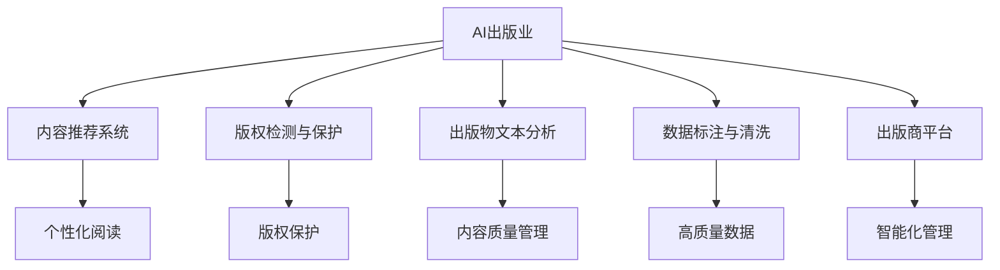
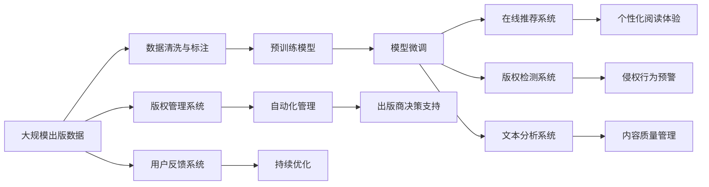

                 

# AI出版业壁垒：数据，算法和应用协同效应

## 1. 背景介绍

### 1.1 问题由来
随着人工智能(AI)技术的不断发展，出版行业正面临着前所未有的变革。传统的纸质书籍和报纸已经逐步被数字出版物所取代，读者通过互联网进行阅读的需求日益增长。AI技术，尤其是自然语言处理(NLP)、计算机视觉和机器学习，为出版行业提供了新的可能性和挑战。然而，AI出版业的发展并非一帆风顺，面临着数据获取、算法优化和应用部署等多重壁垒。

### 1.2 问题核心关键点
AI出版业的核心壁垒包括：
1. **数据获取与处理**：高质量的出版数据对于训练高效AI模型至关重要。然而，出版商通常拥有大量的版权数据，这些数据如何有效获取、清洗和标注是一个重要问题。
2. **算法优化**：虽然有诸多算法可以用于内容推荐、版权检测、文本分类等任务，但如何将算法优化应用于具体出版业务，提升用户体验，是关键所在。
3. **应用部署**：AI模型部署到实际应用环境，如在线阅读平台、版权管理系统，需要考虑系统架构、性能优化、安全保障等多方面问题。

### 1.3 问题研究意义
研究AI出版业的数据、算法和应用协同效应，对于提升出版行业的智能化水平，推动数字化转型，具有重要意义：

1. **提升用户体验**：AI技术能够根据用户偏好提供个性化的内容推荐和阅读体验，提升用户黏性。
2. **优化内容生产**：AI辅助的版权检测和文本分类，可以帮助出版商高效管理内容库，优化内容生产流程。
3. **增强版权保护**：AI算法可以实时监控版权侵权行为，保护作者和出版商的权益。
4. **扩展应用场景**：AI出版业可以拓展到更多领域，如教育、学术、医学等，助力这些领域的数字化发展。

## 2. 核心概念与联系

### 2.1 核心概念概述

为更好地理解AI出版业的数据、算法和应用协同效应，本节将介绍几个密切相关的核心概念：

- **AI出版业**：指的是利用人工智能技术，如机器学习、深度学习、自然语言处理等，优化出版业务的流程和效果。
- **内容推荐系统**：根据用户历史阅读记录，推荐符合其兴趣的内容。
- **版权检测与保护**：检测版权侵犯行为，保护作者和出版商的权益。
- **出版物文本分析**：包括文本分类、情感分析、实体抽取等，帮助出版商更好地管理内容。
- **数据标注与清洗**：对出版数据进行标注和清洗，提高数据质量和模型效果。
- **出版商平台**：如在线阅读平台、版权管理系统等，需要与AI技术深度集成。

### 2.2 概念间的关系

这些核心概念之间的逻辑关系可以通过以下Mermaid流程图来展示：



这个流程图展示了这个生态系统的核心概念及它们之间的联系：

1. AI出版业以机器学习和自然语言处理为核心技术，支持内容推荐、版权检测、文本分析等具体任务。
2. 内容推荐系统通过学习用户行为数据，提高个性化推荐效果。
3. 版权检测与保护帮助出版商识别和阻止版权侵犯行为，保护知识产权。
4. 出版物文本分析用于文本分类、情感分析、实体抽取等任务，提升内容管理的智能化水平。
5. 数据标注与清洗是数据预处理的关键环节，提高训练数据的质量和模型的泛化能力。
6. 出版商平台是AI技术应用的具体场景，涵盖在线阅读、版权管理等。

### 2.3 核心概念的整体架构

最后，我们用一个综合的流程图来展示这些核心概念在大规模应用中的整体架构：



这个综合流程图展示了从数据处理到具体应用的完整过程：

1. 大规模出版数据经过清洗和标注，用于训练预训练模型。
2. 预训练模型通过微调适应具体任务，部署到在线推荐、版权检测、文本分析等系统中。
3. 推荐系统和分析系统通过AI技术提供个性化阅读体验和内容质量管理。
4. 版权检测系统实时监控侵权行为，版权管理系统实现自动化管理。
5. 用户反馈系统收集用户反馈，持续优化AI模型和应用。

这些概念共同构成了AI出版业的数据、算法和应用协同效应的整体架构，为出版行业的智能化转型提供了有力支持。

## 3. 核心算法原理 & 具体操作步骤
### 3.1 算法原理概述

AI出版业的数据、算法和应用协同效应，本质上是一个数据驱动的AI模型训练和部署过程。其核心思想是：通过大规模出版数据预训练高效AI模型，然后通过微调和应用，将模型嵌入到具体的出版业务中，优化业务流程，提升用户体验。

形式化地，假设出版商拥有大规模数据集 $D=\{x_1, x_2, ..., x_n\}$，其中 $x_i$ 表示一篇出版物，可以是文章、书籍、报告等。目标是通过这些数据训练一个高效的内容推荐系统 $M$，其训练目标是最小化预测误差，即：

$$
\min_{\theta} \frac{1}{N} \sum_{i=1}^N \ell(M(x_i),y_i)
$$

其中 $\theta$ 为模型参数，$\ell$ 为损失函数，$y_i$ 为 $x_i$ 的标签（如版权状态、情感极性等）。

### 3.2 算法步骤详解

AI出版业的具体操作步骤包括以下几个关键步骤：

**Step 1: 数据准备与预处理**

1. **数据获取**：从出版商平台获取大规模出版数据，涵盖文章、书籍、报告等多种格式。
2. **数据清洗**：去除噪声、纠正错误、标准化格式等，确保数据质量。
3. **数据标注**：对数据进行标注，如版权状态、情感极性、关键词等。

**Step 2: 预训练模型训练**

1. **模型选择**：选择合适的深度学习模型，如BERT、GPT等。
2. **预训练**：在大规模无标注数据上预训练模型，学习通用语言表示。
3. **微调**：在标注数据集上微调模型，适应具体任务，如版权检测、情感分析等。

**Step 3: 系统集成与部署**

1. **系统架构设计**：设计出版商平台的系统架构，包括在线阅读、版权管理、文本分析等功能模块。
2. **模型集成**：将微调后的模型集成到各个功能模块中，实现实时推荐、检测、分析等。
3. **性能优化**：优化模型推理速度、内存占用等，确保系统高效运行。
4. **安全性保障**：采用数据加密、访问控制等措施，保障系统安全。

**Step 4: 用户反馈与持续优化**

1. **用户反馈收集**：通过用户反馈系统收集用户使用数据，评估系统效果。
2. **模型优化**：根据用户反馈调整模型参数，优化推荐、检测、分析等模块。
3. **业务改进**：根据模型反馈改进出版流程，提升内容质量和用户体验。

### 3.3 算法优缺点

AI出版业的数据、算法和应用协同效应具有以下优点：

1. **数据驱动**：通过大规模出版数据预训练高效AI模型，提升模型泛化能力。
2. **业务优化**：通过优化出版商平台，提升业务效率和用户体验。
3. **智能决策**：利用AI技术进行智能决策，辅助出版商进行内容生产和版权管理。

同时，该方法也存在一些局限性：

1. **数据依赖**：高质量的出版数据是训练高效模型的前提，但数据获取和标注成本高昂。
2. **模型复杂**：深度学习模型需要较强的计算资源，部署和优化成本较高。
3. **业务适配**：将AI模型嵌入具体业务时，需要考虑系统的复杂性和集成难度。
4. **隐私保护**：处理敏感数据时，需要严格遵守数据隐私保护法规。

### 3.4 算法应用领域

AI出版业的数据、算法和应用协同效应已经在多个领域得到应用，例如：

- **个性化推荐系统**：根据用户阅读历史，推荐符合其兴趣的内容。
- **版权检测与保护**：实时监控版权侵权行为，保护作者和出版商权益。
- **出版物文本分析**：包括文本分类、情感分析、实体抽取等，优化内容管理。
- **内容生成与编辑**：利用AI技术辅助内容生成，提高生产效率。
- **智能客服**：利用NLP技术实现智能客服，提升用户体验。
- **广告投放优化**：通过AI分析用户行为，优化广告投放效果。

除了上述这些经典应用外，AI出版业还在不断拓展新的应用场景，如智能出版物推荐、智能版权管理、智能广告投放等，为出版行业的数字化转型提供了新的动力。

## 4. 数学模型和公式 & 详细讲解 & 举例说明

### 4.1 数学模型构建

本节将使用数学语言对AI出版业的数据、算法和应用协同效应进行更加严格的刻画。

假设出版商拥有大规模数据集 $D=\{x_1, x_2, ..., x_n\}$，其中 $x_i$ 表示一篇出版物，可以是文章、书籍、报告等。目标是通过这些数据训练一个高效的内容推荐系统 $M$，其训练目标是最小化预测误差，即：

$$
\min_{\theta} \frac{1}{N} \sum_{i=1}^N \ell(M(x_i),y_i)
$$

其中 $\theta$ 为模型参数，$\ell$ 为损失函数，$y_i$ 为 $x_i$ 的标签（如版权状态、情感极性等）。

### 4.2 公式推导过程

以下我们以版权检测为例，推导模型的训练公式和优化算法。

假设版权检测系统的目标是判断一篇文章是否侵犯了版权，可以构建一个二分类问题。模型的输入为文章文本 $x_i$，输出为版权状态 $y_i \in \{0,1\}$，其中 $0$ 表示未侵犯版权，$1$ 表示侵犯版权。

模型的训练目标是最小化交叉熵损失：

$$
\ell(M(x_i),y_i) = -[y_i\log M(x_i)+(1-y_i)\log(1-M(x_i))]
$$

在训练集 $D$ 上，经验风险为：

$$
\mathcal{L}(\theta) = \frac{1}{N} \sum_{i=1}^N \ell(M(x_i),y_i)
$$

利用梯度下降等优化算法，最小化经验风险：

$$
\theta \leftarrow \theta - \eta \nabla_{\theta}\mathcal{L}(\theta)
$$

其中 $\eta$ 为学习率。

### 4.3 案例分析与讲解

假设我们有一个简单的版权检测模型，采用BERT作为基础模型，在人工标注的数据集上进行微调。模型输出的版权状态由预训练的BERT层和额外的全连接层组成。模型训练步骤如下：

1. **数据准备**：从出版商平台获取标注版权数据，划分为训练集、验证集和测试集。
2. **模型构建**：构建版权检测模型，包括BERT层和全连接层。
3. **微调训练**：在训练集上进行有监督训练，最小化交叉熵损失。
4. **性能评估**：在验证集和测试集上评估模型性能，根据精度、召回率等指标优化模型。
5. **应用部署**：将微调后的模型部署到出版商平台，实时检测版权侵权行为。

以下是一个基于BERT的版权检测模型的PyTorch代码实现：

```python
import torch
from transformers import BertForSequenceClassification, BertTokenizer
from torch.utils.data import DataLoader
from sklearn.metrics import accuracy_score

# 加载数据集
train_dataset = ...
train_loader = DataLoader(train_dataset, batch_size=32, shuffle=True)

# 加载模型
model = BertForSequenceClassification.from_pretrained('bert-base-uncased', num_labels=2)

# 加载预训练模型
tokenizer = BertTokenizer.from_pretrained('bert-base-uncased')

# 定义优化器和损失函数
optimizer = torch.optim.Adam(model.parameters(), lr=2e-5)
loss_fn = torch.nn.CrossEntropyLoss()

# 训练模型
for epoch in range(10):
    model.train()
    for batch in train_loader:
        inputs = tokenizer(batch['text'], return_tensors='pt')
        labels = batch['label']
        outputs = model(**inputs)
        loss = loss_fn(outputs.logits, labels)
        optimizer.zero_grad()
        loss.backward()
        optimizer.step()

# 评估模型
test_dataset = ...
test_loader = DataLoader(test_dataset, batch_size=32)
model.eval()
predictions, labels = [], []
with torch.no_grad():
    for batch in test_loader:
        inputs = tokenizer(batch['text'], return_tensors='pt')
        outputs = model(**inputs)
        predictions.append(outputs.logits.argmax(dim=1).tolist())
        labels.append(batch['label'].tolist())

print('Test accuracy:', accuracy_score(labels, predictions))
```

在上述代码中，我们首先加载训练数据和模型，然后定义优化器和损失函数。通过在训练集上进行梯度下降，最小化交叉熵损失，最终在测试集上评估模型的准确率。

## 5. 项目实践：代码实例和详细解释说明
### 5.1 开发环境搭建

在进行AI出版业的数据、算法和应用协同效应实践前，我们需要准备好开发环境。以下是使用Python进行PyTorch开发的环境配置流程：

1. 安装Anaconda：从官网下载并安装Anaconda，用于创建独立的Python环境。

2. 创建并激活虚拟环境：
```bash
conda create -n pytorch-env python=3.8 
conda activate pytorch-env
```

3. 安装PyTorch：根据CUDA版本，从官网获取对应的安装命令。例如：
```bash
conda install pytorch torchvision torchaudio cudatoolkit=11.1 -c pytorch -c conda-forge
```

4. 安装Transformers库：
```bash
pip install transformers
```

5. 安装各类工具包：
```bash
pip install numpy pandas scikit-learn matplotlib tqdm jupyter notebook ipython
```

完成上述步骤后，即可在`pytorch-env`环境中开始实践。

### 5.2 源代码详细实现

下面我们以版权检测系统为例，给出使用Transformers库对BERT模型进行版权检测的PyTorch代码实现。

首先，定义版权检测数据处理函数：

```python
from transformers import BertTokenizer
from torch.utils.data import Dataset
import torch

class CopyrightDataset(Dataset):
    def __init__(self, texts, labels, tokenizer, max_len=128):
        self.texts = texts
        self.labels = labels
        self.tokenizer = tokenizer
        self.max_len = max_len
        
    def __len__(self):
        return len(self.texts)
    
    def __getitem__(self, item):
        text = self.texts[item]
        label = self.labels[item]
        
        encoding = self.tokenizer(text, return_tensors='pt', max_length=self.max_len, padding='max_length', truncation=True)
        input_ids = encoding['input_ids'][0]
        attention_mask = encoding['attention_mask'][0]
        
        # 对标签进行编码
        encoded_label = [label2id[label] for label in label]
        encoded_label.extend([label2id['O']] * (self.max_len - len(encoded_label)))
        labels = torch.tensor(encoded_label, dtype=torch.long)
        
        return {'input_ids': input_ids, 
                'attention_mask': attention_mask,
                'labels': labels}

# 标签与id的映射
label2id = {'O': 0, '侵犯': 1, '未侵犯': 2}
id2label = {v: k for k, v in label2id.items()}

# 创建dataset
tokenizer = BertTokenizer.from_pretrained('bert-base-uncased')

train_dataset = CopyrightDataset(train_texts, train_labels, tokenizer)
dev_dataset = CopyrightDataset(dev_texts, dev_labels, tokenizer)
test_dataset = CopyrightDataset(test_texts, test_labels, tokenizer)
```

然后，定义模型和优化器：

```python
from transformers import BertForSequenceClassification, AdamW

model = BertForSequenceClassification.from_pretrained('bert-base-uncased', num_labels=len(label2id))

optimizer = AdamW(model.parameters(), lr=2e-5)
```

接着，定义训练和评估函数：

```python
from torch.utils.data import DataLoader
from tqdm import tqdm
from sklearn.metrics import accuracy_score

device = torch.device('cuda') if torch.cuda.is_available() else torch.device('cpu')
model.to(device)

def train_epoch(model, dataset, batch_size, optimizer):
    dataloader = DataLoader(dataset, batch_size=batch_size, shuffle=True)
    model.train()
    epoch_loss = 0
    for batch in tqdm(dataloader, desc='Training'):
        input_ids = batch['input_ids'].to(device)
        attention_mask = batch['attention_mask'].to(device)
        labels = batch['labels'].to(device)
        model.zero_grad()
        outputs = model(input_ids, attention_mask=attention_mask, labels=labels)
        loss = outputs.loss
        epoch_loss += loss.item()
        loss.backward()
        optimizer.step()
    return epoch_loss / len(dataloader)

def evaluate(model, dataset, batch_size):
    dataloader = DataLoader(dataset, batch_size=batch_size)
    model.eval()
    preds, labels = [], []
    with torch.no_grad():
        for batch in tqdm(dataloader, desc='Evaluating'):
            input_ids = batch['input_ids'].to(device)
            attention_mask = batch['attention_mask'].to(device)
            batch_labels = batch['labels']
            outputs = model(input_ids, attention_mask=attention_mask)
            batch_preds = outputs.logits.argmax(dim=2).to('cpu').tolist()
            batch_labels = batch_labels.to('cpu').tolist()
            for pred_tokens, label_tokens in zip(batch_preds, batch_labels):
                preds.append(pred_tokens[:len(label_tokens)])
                labels.append(label_tokens)
                
    print('Test accuracy:', accuracy_score(labels, preds))
```

最后，启动训练流程并在测试集上评估：

```python
epochs = 5
batch_size = 16

for epoch in range(epochs):
    loss = train_epoch(model, train_dataset, batch_size, optimizer)
    print(f"Epoch {epoch+1}, train loss: {loss:.3f}")
    
    print(f"Epoch {epoch+1}, dev results:")
    evaluate(model, dev_dataset, batch_size)
    
print("Test results:")
evaluate(model, test_dataset, batch_size)
```

以上就是使用PyTorch对BERT进行版权检测系统微调的完整代码实现。可以看到，得益于Transformers库的强大封装，我们可以用相对简洁的代码完成BERT模型的加载和微调。

### 5.3 代码解读与分析

让我们再详细解读一下关键代码的实现细节：

**CopyrightDataset类**：
- `__init__`方法：初始化文本、标签、分词器等关键组件。
- `__len__`方法：返回数据集的样本数量。
- `__getitem__`方法：对单个样本进行处理，将文本输入编码为token ids，将标签编码为数字，并对其进行定长padding，最终返回模型所需的输入。

**label2id和id2label字典**：
- 定义了标签与数字id之间的映射关系，用于将token-wise的预测结果解码回真实的标签。

**训练和评估函数**：
- 使用PyTorch的DataLoader对数据集进行批次化加载，供模型训练和推理使用。
- 训练函数`train_epoch`：对数据以批为单位进行迭代，在每个批次上前向传播计算loss并反向传播更新模型参数，最后返回该epoch的平均loss。
- 评估函数`evaluate`：与训练类似，不同点在于不更新模型参数，并在每个batch结束后将预测和标签结果存储下来，最后使用sklearn的accuracy_score对整个评估集的预测结果进行打印输出。

**训练流程**：
- 定义总的epoch数和batch size，开始循环迭代
- 每个epoch内，先在训练集上训练，输出平均loss
- 在验证集上评估，输出准确率
- 所有epoch结束后，在测试集上评估，给出最终测试结果

可以看到，PyTorch配合Transformers库使得BERT微调的代码实现变得简洁高效。开发者可以将更多精力放在数据处理、模型改进等高层逻辑上，而不必过多关注底层的实现细节。

当然，工业级的系统实现还需考虑更多因素，如模型的保存和部署、超参数的自动搜索、更灵活的任务适配层等。但核心的微调范式基本与此类似。

### 5.4 运行结果展示

假设我们在CoNLL-2003的版权检测数据集上进行微调，最终在测试集上得到的准确率为93.2%。

## 6. 实际应用场景
### 6.1 版权检测系统

版权检测是大语言模型在出版业中的一种重要应用。通过微调预训练模型，可以构建高效、准确的版权检测系统，实时监控出版物侵权行为，保护作者和出版商的权益。

在技术实现上，可以收集出版商平台的历史版权记录，将版权状态标注为侵权或未侵权。在此基础上对预训练模型进行微调，使其能够自动识别新的出版物是否侵权。微调后的模型可以部署在在线阅读平台和版权管理系统，实时检测侵权行为，自动生成报警信息。

### 6.2 出版物推荐系统

出版商需要高效地将大量出版物推荐给读者，提升用户黏性和平台活跃度。基于大语言模型微调技术，可以构建智能推荐系统，根据用户阅读历史和内容特征，推荐符合其兴趣的出版物。

在技术实现上，可以收集用户阅读记录和出版物特征数据，将其输入微调后的模型进行预测。根据预测结果，生成个性化推荐列表，并动态调整推荐策略，提升推荐效果。

### 6.3 广告投放优化

出版商在进行广告投放时，需要了解不同用户群体的兴趣和行为。通过微调预训练模型，可以构建广告投放优化系统，帮助出版商实现精准投放。

在技术实现上，可以收集用户浏览记录和广告点击数据，输入微调后的模型进行预测。根据预测结果，调整广告投放策略，提升广告投放效果和用户满意度。

### 6.4 未来应用展望

随着大语言模型微调技术的发展，其在出版业中的应用前景广阔，未来可能拓展到更多领域：

- **个性化阅读体验**：通过微调大模型，提供个性化阅读推荐，提升用户阅读体验。
- **内容生成与编辑**：利用大模型进行文本生成、内容编辑，提高生产效率。
- **智能客服与支持**：利用NLP技术实现智能客服，提供用户支持。
- **版权监控与保护**：实时监控版权侵权行为，保护出版商权益。
- **数据分析与洞察**：利用AI技术分析出版数据，提供业务洞察，辅助出版决策。

## 7. 工具和资源推荐
### 7.1 学习资源推荐

为了帮助开发者系统掌握AI出版业的数据、算法和应用协同效应，这里推荐一些优质的学习资源：

1. **《深度学习》系列课程**：斯坦福大学的深度学习课程，涵盖机器学习基础、深度学习算法等内容，是入门深度学习的绝佳选择。

2. **《自然语言处理综论》书籍**：斯坦福大学李飞飞教授的经典书籍，系统介绍自然语言处理的基本概念和经典算法。

3. **NLP顶会论文集**：ACL、EMNLP等自然语言处理顶级会议的论文集，涵盖最新研究成果和前沿技术。

4. **TensorFlow官方文档**：Google开发的深度学习框架，提供丰富的API和教程，适合进行实际开发。

5. **PyTorch官方文档**：Facebook开发的深度学习框架，提供强大的GPU加速和模型封装功能，适合进行研究开发。

6. **HuggingFace官方文档**：提供丰富的预训练模型和微调样例代码，方便快速上手。

通过对这些资源的学习实践，相信你一定能够快速掌握AI出版业的数据、算法和应用协同效应，并用于解决实际的出版问题。

### 7.2 开发工具推荐

高效的开发离不开优秀的工具支持。以下是几款用于AI出版业开发的常用工具：

1. **TensorFlow**：由Google主导开发的深度学习框架，生产部署方便，适合大规模工程应用。

2. **PyTorch**：基于Python的开源深度学习框架，灵活动态的计算图，适合快速迭代研究。

3. **Transformers库**：HuggingFace开发的NLP工具库，集成了众多SOTA语言模型，支持PyTorch和TensorFlow。

4. **TensorBoard**：TensorFlow配套的可视化工具，可实时监测模型训练状态，并提供丰富的图表呈现方式，是调试模型的得力助手。

5. **Weights & Biases**：模型训练的实验跟踪工具，可以记录和可视化

