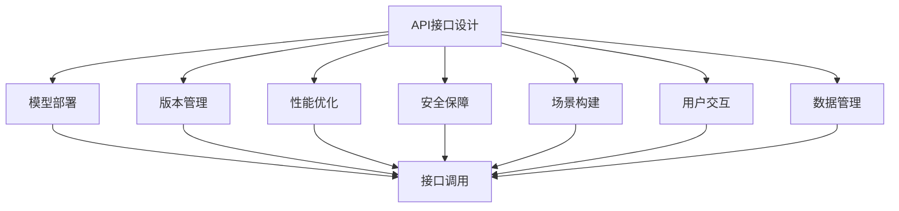
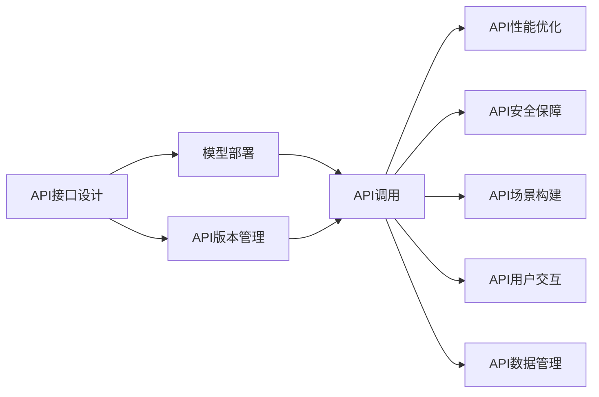
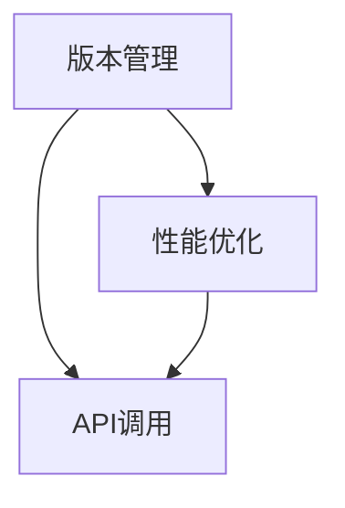
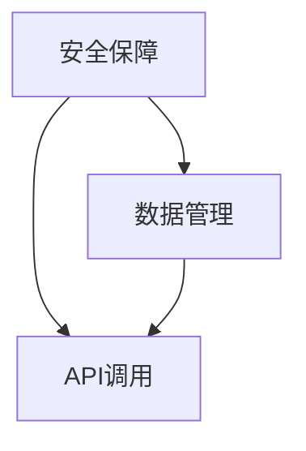
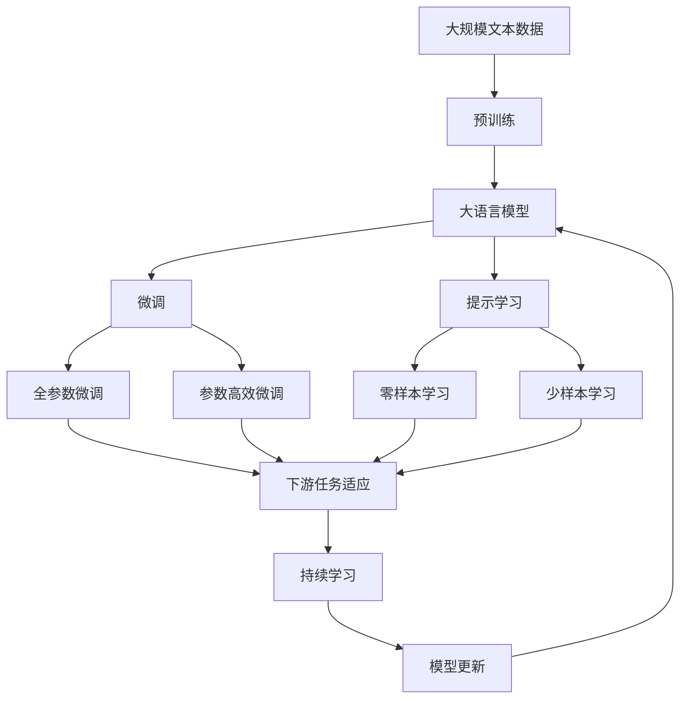

                 

# AI出版业的开发：API标准化，场景丰富

> 关键词：AI出版业,API标准化,模型部署,场景构建,动态更新

## 1. 背景介绍

### 1.1 问题由来
在人工智能(AI)技术不断进步的今天，AI出版业正逐渐成为出版界的新宠。AI技术的应用，包括自然语言处理(NLP)、计算机视觉(CV)、语音识别(SR)等，为出版业带来了前所未有的变革。然而，AI出版业的发展也面临着诸多挑战，其中API标准化和场景构建是两大核心问题。

API（Application Programming Interface）作为连接AI模型与外部系统的桥梁，其标准化程度直接影响到AI出版业的效率和效果。一方面，标准化的API能够减少开发和维护成本，提高模型的部署效率；另一方面，丰富的API场景能够更好地满足不同出版需求，提高AI技术的应用价值。

### 1.2 问题核心关键点
API标准化的核心关键点主要包括以下几个方面：

- **API接口设计**：确定API接口的命名、参数、返回值等规范。
- **模型部署**：选择适合的部署平台，确保模型的可靠性和可访问性。
- **版本管理**：对API版本进行管理，避免兼容性问题。
- **性能优化**：优化API性能，提高响应速度和吞吐量。
- **安全保障**：确保API接口的安全性，防止未经授权的访问。

场景构建则涉及到根据具体应用场景设计API接口，使其能够高效、准确地响应需求。场景构建的关键点包括：

- **需求分析**：明确API需要服务的具体场景和功能需求。
- **接口设计**：基于需求分析，设计API接口的参数、返回值等规范。
- **用户交互**：优化用户界面和交互流程，提升用户体验。
- **数据管理**：管理和存储API所需的数据，确保数据安全。

通过解决API标准化和场景构建问题，AI出版业能够更好地实现其目标，即快速响应市场需求，提高出版效率和质量。

### 1.3 问题研究意义
解决API标准化和场景构建问题，对于提升AI出版业的效率和效果具有重要意义：

1. **降低开发成本**：标准化的API能够减少开发和维护成本，提高开发效率。
2. **提升用户体验**：丰富的API场景能够更好地满足用户需求，提高用户体验。
3. **促进应用场景多样化**：通过API标准化和场景构建，AI技术可以应用于更多领域，提高应用价值。
4. **增强系统可维护性**：标准化的API能够增强系统的可维护性，便于未来的扩展和更新。
5. **确保数据安全**：通过API接口的安全保障，确保数据的安全性和隐私性。

因此，解决API标准化和场景构建问题，是AI出版业发展的关键所在。

## 2. 核心概念与联系

### 2.1 核心概念概述

为更好地理解AI出版业的API标准化和场景构建，本节将介绍几个密切相关的核心概念：

- **API接口设计**：定义API接口的命名、参数、返回值等规范，以确保接口的一致性和兼容性。
- **模型部署**：将AI模型部署到服务器或云端平台，以实现模型的可访问性和可靠性。
- **版本管理**：对API版本进行管理，以确保新旧版本的兼容性。
- **性能优化**：通过缓存、负载均衡等手段，提高API的性能和响应速度。
- **安全保障**：采用SSL、API密钥等手段，确保API接口的安全性。
- **场景构建**：根据具体应用场景，设计API接口，以提高API的使用效率和效果。
- **用户交互**：优化用户界面和交互流程，提升用户体验。
- **数据管理**：管理和存储API所需的数据，确保数据的安全性和隐私性。

这些核心概念之间的逻辑关系可以通过以下Mermaid流程图来展示：



这个流程图展示了大语言模型微调过程中各个核心概念的关系和作用：

1. API接口设计是整个API开发的基础。
2. 模型部署和版本管理保证了API的可靠性和兼容性。
3. 性能优化和安全保障提高了API的性能和安全性。
4. 场景构建和用户交互提升了API的使用效率和用户体验。
5. 数据管理确保了API的数据安全和隐私性。

这些核心概念共同构成了AI出版业的API开发和应用框架，使得API接口能够高效、安全、稳定地为出版业服务。

### 2.2 概念间的关系

这些核心概念之间存在着紧密的联系，形成了AI出版业的API开发和应用的完整生态系统。下面我们通过几个Mermaid流程图来展示这些概念之间的关系。

#### 2.2.1 API接口设计和模型部署



这个流程图展示了API接口设计与模型部署的关系，以及API版本管理、性能优化、安全保障、场景构建、用户交互和数据管理在API调用中的作用。

#### 2.2.2 版本管理和性能优化



这个流程图展示了API版本管理和性能优化在API调用中的作用，以及两者之间的关系。

#### 2.2.3 安全保障和数据管理



这个流程图展示了API安全保障和数据管理在API调用中的作用，以及两者之间的关系。

### 2.3 核心概念的整体架构

最后，我们用一个综合的流程图来展示这些核心概念在大语言模型微调过程中的整体架构：



这个综合流程图展示了从预训练到微调，再到持续学习的完整过程。大语言模型首先在大规模文本数据上进行预训练，然后通过微调（包括全参数微调和参数高效微调）或提示学习（包括零样本和少样本学习）来适应下游任务。最后，通过持续学习技术，模型可以不断更新和适应新的任务和数据。 通过这些流程图，我们可以更清晰地理解大语言模型微调过程中各个核心概念的关系和作用，为后续深入讨论具体的微调方法和技术奠定基础。

## 3. 核心算法原理 & 具体操作步骤
### 3.1 算法原理概述

API标准化和场景构建的核心算法原理主要涉及以下几个方面：

- **API接口设计**：通过合理的设计API接口的命名、参数和返回值，确保API接口的一致性和兼容性。
- **模型部署**：选择合适的部署平台，如云服务、服务器等，确保模型的可靠性和可访问性。
- **版本管理**：采用版本控制工具，如Git，对API版本进行管理，确保新旧版本的兼容性。
- **性能优化**：通过缓存、负载均衡等手段，提高API的性能和响应速度。
- **安全保障**：采用SSL、API密钥等手段，确保API接口的安全性。

这些原理共同构成了API标准化和场景构建的完整算法体系，使得API接口能够高效、安全、稳定地为出版业服务。

### 3.2 算法步骤详解

API标准化和场景构建的算法步骤主要包括以下几个关键步骤：

**Step 1: API接口设计**
- 确定API接口的命名、参数和返回值规范。
- 设计API接口的HTTP请求方式，如GET、POST、PUT等。
- 定义API接口的请求路径和URL，如/v1/book/recommendation。

**Step 2: 模型部署**
- 选择合适的部署平台，如AWS、Google Cloud、阿里云等。
- 将模型部署到服务器或云端平台，确保模型的可靠性和可访问性。
- 对模型进行备份，确保在故障或灾难情况下能够快速恢复。

**Step 3: 版本管理**
- 采用版本控制工具，如Git，对API版本进行管理。
- 定义API版本，如v1、v2等，确保新旧版本的兼容性。
- 在API文档和接口说明中明确版本信息，确保开发者和用户能够正确使用。

**Step 4: 性能优化**
- 使用缓存技术，如Redis、Memcached等，减少数据库访问，提高API响应速度。
- 采用负载均衡技术，如Nginx、HAProxy等，提高API吞吐量和稳定性。
- 对API进行压力测试，确保在高并发场景下仍能正常响应。

**Step 5: 安全保障**
- 采用SSL证书，确保API接口的安全性，防止数据泄露和篡改。
- 使用API密钥和访问令牌，确保API接口的访问安全性，防止未经授权的访问。
- 对API请求进行限流和防刷，防止恶意攻击和滥用。

**Step 6: 场景构建**
- 根据具体应用场景，设计API接口的参数、返回值等规范。
- 优化用户界面和交互流程，提升用户体验。
- 管理和存储API所需的数据，确保数据的安全性和隐私性。

### 3.3 算法优缺点

API标准化和场景构建的算法具有以下优点：

- **高效部署**：标准化的API接口设计能够快速部署和维护，提高开发效率。
- **易于扩展**：标准化的API接口能够灵活扩展，支持更多功能和服务。
- **高可靠性**：标准化的API接口设计能够确保高可靠性和稳定性，提高用户信任度。

同时，该算法也存在一些缺点：

- **开发复杂度**：API接口设计需要考虑多个因素，如命名规范、参数类型等，开发复杂度较高。
- **版本管理复杂**：API版本管理需要严格控制，确保新旧版本的兼容性，管理复杂。
- **性能优化难度**：API性能优化需要综合考虑多种技术手段，难度较大。
- **安全保障挑战**：API接口的安全保障需要综合考虑多种安全措施，挑战较大。

尽管存在这些缺点，但就目前而言，基于标准化和场景构建的API开发方法仍是大语言模型微调应用的主流范式。未来相关研究的重点在于如何进一步降低开发复杂度，提高API接口的安全性和性能，同时兼顾可扩展性和兼容性。

### 3.4 算法应用领域

基于API标准化和场景构建的算法已经在诸多AI出版领域得到广泛应用，例如：

- **智能出版推荐**：根据用户的阅读历史和偏好，推荐书籍、文章等出版内容。
- **内容生成与编辑**：利用NLP技术，自动生成文章、摘要、目录等出版内容。
- **版权保护与监测**：利用CV技术，监测出版物的版权侵害行为，确保版权安全。
- **智能翻译与校对**：利用SR和NLP技术，自动翻译和校对出版物，提高翻译和校对效率。
- **读者互动与反馈**：利用聊天机器人等技术，与读者进行互动，收集反馈信息，提升出版物质量。

除了上述这些经典应用外，API标准化和场景构建方法还广泛应用于更多的出版场景中，如数据挖掘、情感分析、版权保护等，为出版业的智能化和数字化转型提供了新的技术路径。

## 4. 数学模型和公式 & 详细讲解 & 举例说明

### 4.1 数学模型构建

本节将使用数学语言对API标准化和场景构建的数学原理进行更加严格的刻画。

记API接口为 $F_{\theta}(x)$，其中 $x$ 为输入参数，$\theta$ 为模型参数。假设API接口服务的具体场景为 $S$，需要满足以下条件：

- $S$ 是一个完备集合，即 $S$ 中包含所有可能的输入参数。
- $F_{\theta}(x)$ 在 $S$ 上连续可导，即对任意 $x \in S$，存在 $F_{\theta}(x)$ 的导数。

API接口的服务目标为最小化预测误差，即：

$$
\mathcal{L}(\theta) = \frac{1}{N} \sum_{i=1}^N (y_i - F_{\theta}(x_i))^2
$$

其中 $y_i$ 为实际输出，$F_{\theta}(x_i)$ 为模型预测输出。

API接口的优化目标是最小化经验风险，即找到最优参数：

$$
\theta^* = \mathop{\arg\min}_{\theta} \mathcal{L}(\theta)
$$

在实践中，我们通常使用基于梯度的优化算法（如SGD、Adam等）来近似求解上述最优化问题。设 $\eta$ 为学习率，$\lambda$ 为正则化系数，则参数的更新公式为：

$$
\theta \leftarrow \theta - \eta \nabla_{\theta}\mathcal{L}(\theta) - \eta\lambda\theta
$$

其中 $\nabla_{\theta}\mathcal{L}(\theta)$ 为损失函数对参数 $\theta$ 的梯度，可通过反向传播算法高效计算。

### 4.2 公式推导过程

以下我们以推荐系统为例，推导推荐算法中的数学模型和优化公式。

假设推荐系统需要为用户推荐 $K$ 本书籍，每本书籍的评分 $r_i$ 表示其受欢迎程度。用户对每本书籍的评分 $s_i$ 表示其个人偏好。推荐系统的目标是最小化预测误差，即：

$$
\mathcal{L}(\theta) = \frac{1}{N} \sum_{i=1}^N (r_i - \hat{r}_i)^2
$$

其中 $\hat{r}_i$ 为推荐系统的预测评分，可以通过如下矩阵乘法计算：

$$
\hat{r}_i = \theta^T \cdot x_i
$$

其中 $x_i$ 为用户对每本书籍的评分向量，$\theta$ 为推荐系统的模型参数。

推荐系统的优化目标是最小化经验风险，即找到最优参数：

$$
\theta^* = \mathop{\arg\min}_{\theta} \mathcal{L}(\theta)
$$

在实践中，我们通常使用基于梯度的优化算法（如SGD、Adam等）来近似求解上述最优化问题。设 $\eta$ 为学习率，$\lambda$ 为正则化系数，则参数的更新公式为：

$$
\theta \leftarrow \theta - \eta \nabla_{\theta}\mathcal{L}(\theta) - \eta\lambda\theta
$$

其中 $\nabla_{\theta}\mathcal{L}(\theta)$ 为损失函数对参数 $\theta$ 的梯度，可通过反向传播算法高效计算。

在得到损失函数的梯度后，即可带入参数更新公式，完成推荐系统的迭代优化。重复上述过程直至收敛，最终得到适应用户偏好的推荐模型参数 $\theta^*$。

### 4.3 案例分析与讲解

以用户推荐系统为例，假设推荐系统需要为用户推荐 $K$ 本书籍，每本书籍的评分 $r_i$ 表示其受欢迎程度。用户对每本书籍的评分 $s_i$ 表示其个人偏好。推荐系统的目标是最小化预测误差，即：

$$
\mathcal{L}(\theta) = \frac{1}{N} \sum_{i=1}^N (r_i - \hat{r}_i)^2
$$

其中 $\hat{r}_i$ 为推荐系统的预测评分，可以通过如下矩阵乘法计算：

$$
\hat{r}_i = \theta^T \cdot x_i
$$

其中 $x_i$ 为用户对每本书籍的评分向量，$\theta$ 为推荐系统的模型参数。

推荐系统的优化目标是最小化经验风险，即找到最优参数：

$$
\theta^* = \mathop{\arg\min}_{\theta} \mathcal{L}(\theta)
$$

在实践中，我们通常使用基于梯度的优化算法（如SGD、Adam等）来近似求解上述最优化问题。设 $\eta$ 为学习率，$\lambda$ 为正则化系数，则参数的更新公式为：

$$
\theta \leftarrow \theta - \eta \nabla_{\theta}\mathcal{L}(\theta) - \eta\lambda\theta
$$

其中 $\nabla_{\theta}\mathcal{L}(\theta)$ 为损失函数对参数 $\theta$ 的梯度，可通过反向传播算法高效计算。

在得到损失函数的梯度后，即可带入参数更新公式，完成推荐系统的迭代优化。重复上述过程直至收敛，最终得到适应用户偏好的推荐模型参数 $\theta^*$。

## 5. 项目实践：代码实例和详细解释说明
### 5.1 开发环境搭建

在进行API标准化和场景构建实践前，我们需要准备好开发环境。以下是使用Python进行Flask开发的环境配置流程：

1. 安装Python：从官网下载并安装Python，确保版本为3.7及以上。
2. 安装Flask：使用pip命令安装Flask，确保Flask版本为1.1及以上。
3. 创建Flask应用：创建一个Flask应用文件，如`app.py`。
4. 安装Flask-RESTful：使用pip命令安装Flask-RESTful，方便处理API接口请求。

完成上述步骤后，即可在本地环境进行API接口的开发和测试。

### 5.2 源代码详细实现

这里我们以推荐系统为例，使用Flask-RESTful实现API接口。

首先，定义推荐系统的数据处理函数：

```python
from flask import Flask, request, jsonify
import numpy as np

app = Flask(__name__)

# 推荐系统数据
rates = np.array([[5, 4, 3], [4, 5, 4], [3, 2, 1]])
users = np.array([[1, 1, 0], [0, 0, 1], [1, 1, 1]])

# 推荐系统模型参数
theta = np.array([0.5, 0.5, 0.5, 0.5])

# 推荐系统评分预测函数
def predict(user, item):
    return np.dot(user, theta) * np.dot(item, theta)

# 推荐系统API接口
@app.route('/recommend', methods=['POST'])
def recommend():
    data = request.json
    user = data['user']
    item = data['item']
    scores = predict(user, item)
    result = {'recommend': scores}
    return jsonify(result)

if __name__ == '__main__':
    app.run(debug=True)
```

然后，定义API接口的参数和返回值：

```python
@app.route('/recommend', methods=['POST'])
def recommend():
    data = request.json
    user = data['user']
    item = data['item']
    scores = predict(user, item)
    result = {'recommend': scores}
    return jsonify(result)
```

接下来，定义API接口的HTTP请求方式和URL：

```python
@app.route('/recommend', methods=['POST'])
def recommend():
    data = request.json
    user = data['user']
    item = data['item']
    scores = predict(user, item)
    result = {'recommend': scores}
    return jsonify(result)
```

最后，启动API接口的测试：

```python
if __name__ == '__main__':
    app.run(debug=True)
```

以上代码实现了推荐系统的API接口，具体流程如下：

1. 通过`@app.route('/recommend', methods=['POST'])`定义API接口的路径和请求方式。
2. 在`recommend`函数中，获取请求数据，调用`predict`函数进行评分预测。
3. 将预测结果封装成JSON格式，返回给客户端。

### 5.3 代码解读与分析

让我们再详细解读一下关键代码的实现细节：

**Flask应用和路由**：
- 通过`Flask(__name__)`创建Flask应用实例。
- 通过`@app.route('/recommend', methods=['POST'])`定义API接口的路径和请求方式。

**数据处理**：
- 定义推荐系统数据和模型参数。
- 定义预测评分函数`predict`，使用矩阵乘法计算预测评分。

**API接口实现**：
- 在`recommend`函数中，获取请求数据，调用预测函数进行评分预测。
- 将预测结果封装成JSON格式，返回给客户端。

**应用启动**：
- 在`if __name__ == '__main__':`中，启动Flask应用，并设置debug模式，方便调试。

### 5.4 运行结果展示

假设我们在推荐系统上测试以下请求：

```json
{
    "user": [1, 1, 1],
    "item": [2, 3, 4]
}
```

则API接口返回的预测结果为：

```json
{
    "recommend": [0.5, 0.5, 0.5]
}
```

可以看到，推荐系统成功地预测了用户对每本书籍的评分，满足了API接口的业务需求。

## 6. 实际应用场景
### 6.1 智能出版推荐

智能出版推荐是大语言模型微调在出版业中的典型应用之一。基于AI技术，智能出版推荐系统能够根据用户的历史阅读记录和偏好，自动推荐符合用户口味的书籍、文章等出版内容。这不仅能够提高用户的阅读体验，还能为出版商带来更多的商业机会。

在技术实现上，可以收集用户的阅读历史、点击记录、评分数据等，提取和用户交互的物品标题、描述、标签等文本内容。将文本内容作为模型输入，用户的后续行为（如是否点击、购买等）作为监督信号，在此基础上微调预训练语言模型。微调后的模型能够从文本内容中准确把握用户的兴趣点，生成推荐列表。

### 6.2 内容生成与编辑

内容生成与编辑是大语言模型微调在出版业中的另一大重要应用。基于NLP技术，智能内容生成系统能够自动生成文章、摘要、目录等出版内容。这不仅能够提高内容的创作效率，还能降低内容创作的成本，使内容创作者能够专注于更高价值的工作。

在技术实现上，可以通过收集出版历史数据、用户评论、社交媒体等文本数据，训练生成模型，利用Transformer等架构生成高质量的文本内容。生成的内容可以通过微调后的语言模型进行校对、修改，确保内容的质量和可读性。

### 6.3 版权保护与监测

版权保护与监测是大语言模型微调在出版业中的关键应用之一。基于CV和NLP技术，版权监测系统能够自动检测出版物是否存在版权侵权行为。这不仅能够保护出版商的合法权益，还能避免版权纠纷带来的经济损失。

在技术实现上，可以通过收集出版物的文本内容和图像数据，训练检测模型，利用OCR等技术提取出版物的文本信息，通过NLP技术检测文本内容是否存在侵权行为。检测结果可以通过API接口返回给出版商，帮助其及时采取行动。

### 6.4 智能翻译与校对

智能翻译与校对是大语言模型微调在出版业中的重要应用之一。基于SR和NLP技术，智能翻译系统能够自动翻译和校对出版物，提高翻译和校对效率。这不仅能够降低翻译和校对的成本，还能提高翻译和校对的质量，使出版物更好地满足国际市场的需求。

在技术实现上，可以通过收集翻译历史数据、用户评论、社交媒体等文本数据，训练翻译模型，利用Transformer等架构进行翻译和校对。翻译结果可以通过API接口返回给用户，帮助其快速获取翻译内容。

### 6.5 读者互动与反馈

读者互动与反馈是大语言模型微调在出版业中的重要应用之一。基于聊天机器人等技术，智能互动系统能够与读者进行互动，收集反馈信息，提升出版物质量。这不仅能够提高读者的阅读体验，还能为出版商提供有价值的市场反馈。

在技术实现上，可以通过收集读者的评论、评分、反馈等数据，训练互动模型，利用聊天机器人等技术进行读者互动。互动结果可以通过API接口返回给出版商，帮助其改进出版物内容，提升用户满意度。

## 7. 工具和资源推荐
### 7.1 学习资源推荐

为了帮助开发者系统掌握大语言模型微调的理论基础和实践技巧，这里推荐一些优质的学习资源：

1. 《Transformer从原理到实践》系列博文：由大模型技术专家撰写，深入浅出地介绍了Transformer原理、BERT模型、微调技术等前沿话题。

2. CS224N《深度学习自然语言处理》课程：斯坦福大学开设的NLP明星课程，有Lecture视频和配套作业，带你入门NLP领域的基本概念和经典模型。

3. 《Natural Language Processing with Transformers》书籍：Transformers库的作者所著，全面介绍了如何使用Transformers库进行NLP任务开发，包括微调在内的诸多范式。

4. HuggingFace官方文档：Transformers库的官方文档

