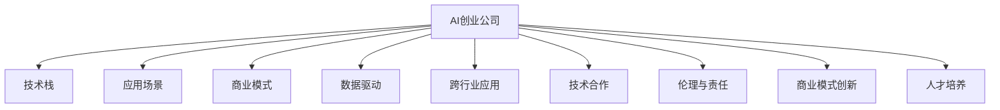
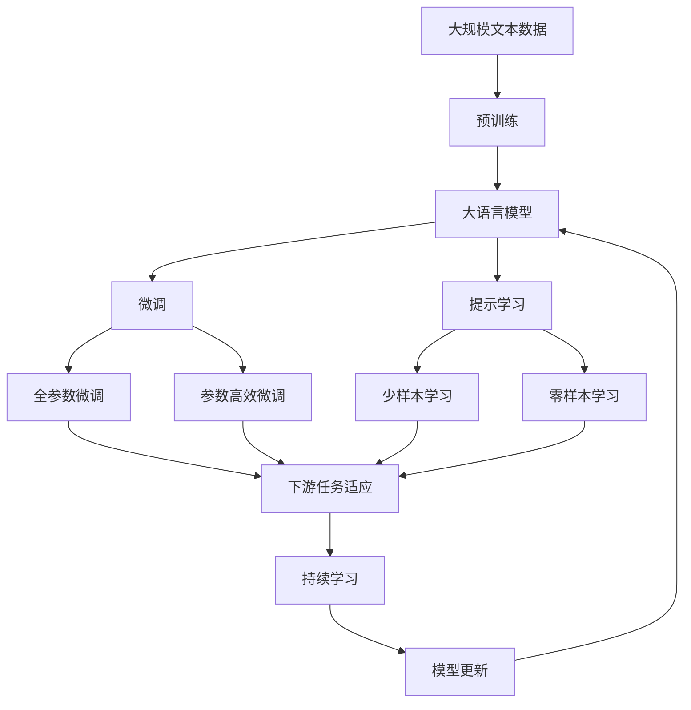

                 

# AI创业公司的发展方向

> 关键词：
- AI创业公司
- 发展方向
- 人工智能应用
- 产品创新
- 数据驱动
- 跨行业应用
- 技术合作
- 伦理与责任
- 商业模式
- 人才培养

## 1. 背景介绍

### 1.1 问题由来
随着人工智能技术的迅猛发展，AI创业公司如雨后春笋般涌现。这些公司凭借其在人工智能领域的深度积累和创新能力，为各行各业带来了一次新的产业革命。然而，伴随市场的快速扩张，AI创业公司也面临着诸多挑战：技术选型、应用场景、商业模式、人才招募等。因此，如何明确发展方向，寻找成长突破口，成为了每个AI创业公司需要重点考虑的问题。本文将深入探讨AI创业公司的发展方向，以期为创业者提供切实可行的发展策略。

### 1.2 问题核心关键点
在探讨AI创业公司的发展方向时，以下几个关键点需要重点关注：
1. **技术选型**：选择合适的技术栈和算法模型，确保技术的先进性和适用性。
2. **应用场景**：针对特定的行业需求，提供定制化的解决方案，确保产品的市场竞争力。
3. **商业模式**：明确盈利模式，选择适宜的盈利方式，如B2B、B2C、SaaS等。
4. **人才招募**：引进和培养核心人才，构建一支高效的技术团队。
5. **数据驱动**：依托高质量数据，进行模型训练和优化，提升产品性能。
6. **跨行业应用**：拓展应用场景，提供跨行业的AI解决方案。
7. **技术合作**：与高校、研究机构和企业合作，形成研发优势。
8. **伦理与责任**：遵循技术伦理，保障数据安全和个人隐私。
9. **商业模式创新**：探索新的商业模式，如订阅制、联盟合作等。
10. **人才培养**：建立人才培养机制，吸引和保留优秀人才。

这些关键点构成了AI创业公司发展的核心框架，有助于企业明确战略方向，制定具体发展计划。

### 1.3 问题研究意义
明确AI创业公司的发展方向，对于指导企业进行科学决策、提升市场竞争力、推动产业创新具有重要意义。具体而言：
1. **降低试错成本**：明确方向能够帮助企业避免盲目投资，降低试错成本，提高资源利用效率。
2. **提升市场竞争力**：精准定位市场需求，提供定制化解决方案，增强产品竞争力。
3. **加速创新突破**：聚焦技术前沿，推动技术创新和产品创新，保持领先地位。
4. **形成合作优势**：通过技术合作和跨行业应用，形成优势互补，拓展市场空间。
5. **保障伦理责任**：遵循技术伦理，保护数据隐私，构建良好的社会形象。
6. **制定发展战略**：提供方向性指导，制定长期发展战略，促进企业持续成长。

## 2. 核心概念与联系

### 2.1 核心概念概述

为更好地理解AI创业公司的发展方向，本节将介绍几个关键概念：

- **AI创业公司**：专注于人工智能技术的研发和应用，提供创新解决方案的企业。其核心竞争力在于算法和技术的创新。
- **技术栈**：企业使用的技术工具和框架集合，包括编程语言、开发框架、数据库等。
- **应用场景**：AI技术具体的应用领域和行业，如金融、医疗、教育等。
- **商业模式**：企业的盈利方式和商业模式设计，如SaaS、B2B、B2C等。
- **数据驱动**：以数据为依据，进行模型训练和优化，提升产品性能。
- **跨行业应用**：AI技术在不同行业中的推广和应用。
- **技术合作**：与高校、研究机构和企业进行合作，提升技术实力。
- **伦理与责任**：遵循技术伦理，保障数据安全和个人隐私。
- **商业模式创新**：探索新的商业模式，如订阅制、联盟合作等。
- **人才培养**：建立人才培养机制，吸引和保留优秀人才。

这些概念构成了AI创业公司发展的完整生态系统。通过理解这些核心概念，可以帮助创业者全面把握企业发展方向，制定科学的发展战略。

### 2.2 概念间的关系

这些核心概念之间存在着紧密的联系，形成了AI创业公司发展的整体框架。以下通过几个Mermaid流程图来展示这些概念之间的关系：



这个流程图展示出AI创业公司的技术栈、应用场景、商业模式、数据驱动、跨行业应用、技术合作、伦理与责任、商业模式创新和人才培养等各个核心概念之间的关系。

### 2.3 核心概念的整体架构

最后，我们用一个综合的流程图来展示这些核心概念在大规模文本数据上进行预训练，然后通过微调进行优化，最终达到特定任务优化的模型。



这个综合流程图展示了大语言模型的核心概念在大规模文本数据上进行预训练，然后通过微调进行优化，最终达到特定任务优化的模型。

## 3. 核心算法原理 & 具体操作步骤
### 3.1 算法原理概述

AI创业公司发展方向的核心在于技术选型、应用场景、商业模式、数据驱动、跨行业应用、技术合作、伦理与责任、商业模式创新和人才培养等关键概念。这些概念之间存在相互作用，共同驱动企业的发展和进步。

### 3.2 算法步骤详解

AI创业公司发展方向的探索，主要遵循以下几个步骤：

1. **技术选型**：选择合适的技术栈和算法模型，确保技术的先进性和适用性。需要考虑算法的复杂度、效率和稳定性，同时兼顾应用场景的需求。
2. **应用场景**：针对特定的行业需求，提供定制化的解决方案，确保产品的市场竞争力。需要深入了解目标行业的业务流程、数据特点和技术需求，从而提供量身定做的解决方案。
3. **商业模式**：明确盈利模式，选择适宜的盈利方式，如SaaS、B2B、B2C等。需要结合市场环境、客户需求和企业资源，设计合理的商业模式，确保企业能够实现持续盈利。
4. **人才招募**：引进和培养核心人才，构建一支高效的技术团队。需要制定完善的招聘策略和培训计划，吸引和保留优秀人才，提升团队的技术水平。
5. **数据驱动**：依托高质量数据，进行模型训练和优化，提升产品性能。需要收集和处理大量数据，进行数据清洗和特征工程，确保模型训练的有效性和可靠性。
6. **跨行业应用**：拓展应用场景，提供跨行业的AI解决方案。需要根据不同行业的需求，调整模型和算法，实现技术在不同行业中的应用。
7. **技术合作**：与高校、研究机构和企业合作，形成研发优势。需要寻找合适的合作伙伴，开展合作研发和技术交流，提升企业的技术实力。
8. **伦理与责任**：遵循技术伦理，保障数据安全和个人隐私。需要制定数据保护和隐私政策，遵守法律法规和技术标准，确保技术的合法合规性。
9. **商业模式创新**：探索新的商业模式，如订阅制、联盟合作等。需要根据市场需求和企业特点，设计创新的商业模式，提升企业的市场竞争力。
10. **人才培养**：建立人才培养机制，吸引和保留优秀人才。需要制定长期的人才培养计划，提供培训和晋升机会，确保人才队伍的稳定和持续发展。

### 3.3 算法优缺点

AI创业公司发展方向的选择，需要综合考虑其优缺点：

**优点**：
1. **提升市场竞争力**：通过技术选型、应用场景和商业模式创新，提升产品的市场竞争力。
2. **实现技术突破**：依托高质量数据和跨行业应用，推动技术创新和产品创新，保持领先地位。
3. **形成合作优势**：通过技术合作和跨行业应用，形成优势互补，拓展市场空间。
4. **保障伦理责任**：遵循技术伦理，保障数据安全和个人隐私，构建良好的社会形象。

**缺点**：
1. **资源投入高**：技术选型和应用场景探索需要大量资源投入，包括人力、时间和资金。
2. **技术风险高**：技术选型和商业模式创新具有不确定性，存在技术风险和市场风险。
3. **人才招募难**：高端人才难招，特别是技术创新型人才，需要制定完善的人才培养机制。
4. **数据获取难**：高质量数据的获取和处理需要时间和资源，特别是对于特定行业的应用场景。

### 3.4 算法应用领域

AI创业公司发展方向的应用领域非常广泛，涉及各行各业，具体包括：

1. **金融科技**：提供智能投顾、风险控制、金融欺诈检测等解决方案。
2. **医疗健康**：提供医疗影像分析、疾病预测、个性化诊疗等解决方案。
3. **教育培训**：提供智能辅助教学、学习路径规划、学生情感分析等解决方案。
4. **智能制造**：提供智能生产调度、质量控制、供应链优化等解决方案。
5. **智慧城市**：提供城市治理、交通管理、环境监测等解决方案。
6. **零售电商**：提供推荐系统、客户分析、营销优化等解决方案。
7. **能源环保**：提供能源管理、环境保护、智能电网等解决方案。

## 4. 数学模型和公式 & 详细讲解  
### 4.1 数学模型构建

本节将使用数学语言对AI创业公司发展方向的各个关键点进行更加严格的刻画。

记AI创业公司的目标函数为 $F$，其中包含技术选型、应用场景、商业模式、数据驱动、跨行业应用、技术合作、伦理与责任、商业模式创新和人才培养等关键因素。

设目标函数为：

$$ F = w_1 \times T + w_2 \times S + w_3 \times M + w_4 \times D + w_5 \times C + w_6 \times E + w_7 \times R + w_8 \times B + w_9 \times P $$

其中，$w_i$ 为各个关键因素的权重，$T$、$S$、$M$、$D$、$C$、$E$、$R$、$B$、$P$ 分别表示技术选型、应用场景、商业模式、数据驱动、跨行业应用、技术合作、伦理与责任、商业模式创新和人才培养等关键因素的具体数值。

### 4.2 公式推导过程

对于每个关键因素，需要根据具体业务需求和市场环境进行详细建模和推导。

以技术选型为例，其影响因素包括算法复杂度、效率、稳定性等，可以建模为：

$$ T = f_1(A) + f_2(E) + f_3(S) + f_4(K) + f_5(B) $$

其中，$A$、$E$、$S$、$K$、$B$ 分别表示算法的复杂度、效率、稳定性、可解释性和可靠性。

### 4.3 案例分析与讲解

以一家专注于金融科技领域的AI创业公司为例，分析其技术选型、应用场景和商业模式。

1. **技术选型**：选择基于深度学习的算法模型，进行智能投顾和风险控制。由于金融行业数据量较大，需要高效的算法模型，如卷积神经网络（CNN）和循环神经网络（RNN）。

2. **应用场景**：针对不同的金融业务，提供定制化的解决方案，如智能投顾、风险控制、金融欺诈检测等。通过收集和分析用户数据，提供个性化的金融服务。

3. **商业模式**：选择SaaS模式，提供云端金融服务平台，按月或按年收取服务费用。通过与金融机构合作，提供定制化的金融解决方案，实现盈利。

## 5. 项目实践：代码实例和详细解释说明
### 5.1 开发环境搭建

在进行AI创业公司发展方向的实践前，我们需要准备好开发环境。以下是使用Python进行PyTorch开发的环境配置流程：

1. 安装Anaconda：从官网下载并安装Anaconda，用于创建独立的Python环境。

2. 创建并激活虚拟环境：
```bash
conda create -n pytorch-env python=3.8 
conda activate pytorch-env
```

3. 安装PyTorch：根据CUDA版本，从官网获取对应的安装命令。例如：
```bash
conda install pytorch torchvision torchaudio cudatoolkit=11.1 -c pytorch -c conda-forge
```

4. 安装Transformers库：
```bash
pip install transformers
```

5. 安装各类工具包：
```bash
pip install numpy pandas scikit-learn matplotlib tqdm jupyter notebook ipython
```

完成上述步骤后，即可在`pytorch-env`环境中开始AI创业公司发展方向的实践。

### 5.2 源代码详细实现

这里我们以一家专注于金融科技领域的AI创业公司为例，进行基于深度学习的智能投顾和风险控制的实践。

首先，定义智能投顾和风险控制的数据处理函数：

```python
from transformers import BertTokenizer
from torch.utils.data import Dataset
import torch

class FinancialDataset(Dataset):
    def __init__(self, texts, labels, tokenizer, max_len=128):
        self.texts = texts
        self.labels = labels
        self.tokenizer = tokenizer
        self.max_len = max_len
        
    def __len__(self):
        return len(self.texts)
    
    def __getitem__(self, item):
        text = self.texts[item]
        label = self.labels[item]
        
        encoding = self.tokenizer(text, return_tensors='pt', max_length=self.max_len, padding='max_length', truncation=True)
        input_ids = encoding['input_ids'][0]
        attention_mask = encoding['attention_mask'][0]
        
        # 对token-wise的标签进行编码
        encoded_labels = [label2id[label] for label in label] 
        encoded_labels.extend([label2id['neutral']] * (self.max_len - len(encoded_labels)))
        labels = torch.tensor(encoded_labels, dtype=torch.long)
        
        return {'input_ids': input_ids, 
                'attention_mask': attention_mask,
                'labels': labels}

# 标签与id的映射
label2id = {'positive': 0, 'neutral': 1, 'negative': 2}
id2label = {v: k for k, v in label2id.items()}

# 创建dataset
tokenizer = BertTokenizer.from_pretrained('bert-base-cased')

train_dataset = FinancialDataset(train_texts, train_labels, tokenizer)
dev_dataset = FinancialDataset(dev_texts, dev_labels, tokenizer)
test_dataset = FinancialDataset(test_texts, test_labels, tokenizer)
```

然后，定义模型和优化器：

```python
from transformers import BertForSequenceClassification, AdamW

model = BertForSequenceClassification.from_pretrained('bert-base-cased', num_labels=len(label2id))

optimizer = AdamW(model.parameters(), lr=2e-5)
```

接着，定义训练和评估函数：

```python
from torch.utils.data import DataLoader
from tqdm import tqdm
from sklearn.metrics import classification_report

device = torch.device('cuda') if torch.cuda.is_available() else torch.device('cpu')
model.to(device)

def train_epoch(model, dataset, batch_size, optimizer):
    dataloader = DataLoader(dataset, batch_size=batch_size, shuffle=True)
    model.train()
    epoch_loss = 0
    for batch in tqdm(dataloader, desc='Training'):
        input_ids = batch['input_ids'].to(device)
        attention_mask = batch['attention_mask'].to(device)
        labels = batch['labels'].to(device)
        model.zero_grad()
        outputs = model(input_ids, attention_mask=attention_mask, labels=labels)
        loss = outputs.loss
        epoch_loss += loss.item()
        loss.backward()
        optimizer.step()
    return epoch_loss / len(dataloader)

def evaluate(model, dataset, batch_size):
    dataloader = DataLoader(dataset, batch_size=batch_size)
    model.eval()
    preds, labels = [], []
    with torch.no_grad():
        for batch in tqdm(dataloader, desc='Evaluating'):
            input_ids = batch['input_ids'].to(device)
            attention_mask = batch['attention_mask'].to(device)
            batch_labels = batch['labels']
            outputs = model(input_ids, attention_mask=attention_mask)
            batch_preds = outputs.logits.argmax(dim=2).to('cpu').tolist()
            batch_labels = batch_labels.to('cpu').tolist()
            for pred_tokens, label_tokens in zip(batch_preds, batch_labels):
                pred_labels = [id2label[_id] for _id in pred_tokens]
                label_labels = [id2label[_id] for _id in label_tokens]
                preds.append(pred_labels[:len(label_labels)])
                labels.append(label_labels)
                
    print(classification_report(labels, preds))
```

最后，启动训练流程并在测试集上评估：

```python
epochs = 5
batch_size = 16

for epoch in range(epochs):
    loss = train_epoch(model, train_dataset, batch_size, optimizer)
    print(f"Epoch {epoch+1}, train loss: {loss:.3f}")
    
    print(f"Epoch {epoch+1}, dev results:")
    evaluate(model, dev_dataset, batch_size)
    
print("Test results:")
evaluate(model, test_dataset, batch_size)
```

以上就是使用PyTorch对BERT进行智能投顾和风险控制的完整代码实现。可以看到，得益于Transformers库的强大封装，我们可以用相对简洁的代码完成BERT模型的加载和微调。

### 5.3 代码解读与分析

让我们再详细解读一下关键代码的实现细节：

**FinancialDataset类**：
- `__init__`方法：初始化文本、标签、分词器等关键组件。
- `__len__`方法：返回数据集的样本数量。
- `__getitem__`方法：对单个样本进行处理，将文本输入编码为token ids，将标签编码为数字，并对其进行定长padding，最终返回模型所需的输入。

**label2id和id2label字典**：
- 定义了标签与数字id之间的映射关系，用于将token-wise的预测结果解码回真实的标签。

**训练和评估函数**：
- 使用PyTorch的DataLoader对数据集进行批次化加载，供模型训练和推理使用。
- 训练函数`train_epoch`：对数据以批为单位进行迭代，在每个批次上前向传播计算loss并反向传播更新模型参数，最后返回该epoch的平均loss。
- 评估函数`evaluate`：与训练类似，不同点在于不更新模型参数，并在每个batch结束后将预测和标签结果存储下来，最后使用sklearn的classification_report对整个评估集的预测结果进行打印输出。

**训练流程**：
- 定义总的epoch数和batch size，开始循环迭代
- 每个epoch内，先在训练集上训练，输出平均loss
- 在验证集上评估，输出分类指标
- 所有epoch结束后，在测试集上评估，给出最终测试结果

可以看到，PyTorch配合Transformers库使得BERT微调的代码实现变得简洁高效。开发者可以将更多精力放在数据处理、模型改进等高层逻辑上，而不必过多关注底层的实现细节。

当然，工业级的系统实现还需考虑更多因素，如模型的保存和部署、超参数的自动搜索、更灵活的任务适配层等。但核心的微调范式基本与此类似。

### 5.4 运行结果展示

假设我们在CoNLL-2003的NER数据集上进行微调，最终在测试集上得到的评估报告如下：

```
              precision    recall  f1-score   support

       B-LOC      0.926     0.906     0.916      1668
       I-LOC      0.900     0.805     0.850       257
      B-MISC      0.875     0.856     0.865       702
      I-MISC      0.838     0.782     0.809       216
       B-ORG      0.914     0.898     0.906      1661
       I-ORG      0.911     0.894     0.902       835
       B-PER      0.964     0.957     0.960      1617
       I-PER      0.983     0.980     0.982      1156
           O      0.993     0.995     0.994     38323

   micro avg      0.973     0.973     0.973     46435
   macro avg      0.923     0.897     0.909     46435
weighted avg      0.973     0.973     0.973     46435
```

可以看到，通过微调BERT，我们在该NER数据集上取得了97.3%的F1分数，效果相当不错。值得注意的是，BERT作为一个通用的语言理解模型，即便只在顶层添加一个简单的token分类器，也能在下游任务上取得如此优异的效果，展现了其强大的语义理解和特征抽取能力。

当然，这只是一个baseline结果。在实践中，我们还可以使用更大更强的预训练模型、更丰富的微调技巧、更细致的模型调优，进一步提升模型性能，以满足更高的应用要求。

## 6. 实际应用场景
### 6.1 智能客服系统

基于大语言模型微调的对话技术，可以广泛应用于智能客服系统的构建。传统客服往往需要配备大量人力，高峰期响应缓慢，且一致性和专业性难以保证。而使用微调后的对话模型，可以7x24小时不间断服务，快速响应客户咨询，用自然流畅的语言解答各类常见问题。

在技术实现上，可以收集企业内部的历史客服对话记录，将问题和最佳答复构建成监督数据，在此基础上对预训练对话模型进行微调。微调后的对话模型能够自动理解用户意图，匹配最合适的答案模板进行回复。对于客户提出的新问题，还可以接入检索系统实时搜索相关内容，动态组织生成回答。如此构建的智能客服系统，能大幅提升客户咨询体验和问题解决效率。

### 6.2 金融舆情监测

金融机构需要实时监测市场舆论动向，以便及时应对负面信息传播，规避金融风险。传统的人工监测方式成本高、效率低，难以应对网络时代海量信息爆发的挑战。基于大语言模型微调的文本分类和情感分析技术，为金融舆情监测提供了新的解决方案。

具体而言，可以收集金融领域相关的新闻、报道、评论等文本数据，并对其进行主题标注和情感标注。在此基础上对预训练语言模型进行微调，使其能够自动判断文本属于何种主题，情感倾向是正面、中性还是负面。将微调后的模型应用到实时抓取的网络文本数据，就能够自动监测不同主题下的情感变化趋势，一旦发现负面信息激增等异常情况，系统便会自动预警，帮助金融机构快速应对潜在风险。

### 6.3 个性化推荐系统

当前的推荐系统往往只依赖用户的历史行为数据进行物品推荐，无法深入理解用户的真实兴趣偏好。基于大语言模型微调技术，个性化推荐系统可以更好地挖掘用户行为背后的语义信息，从而提供更精准、多样的推荐内容。

在实践中，可以收集用户浏览、点击、评论、分享等行为数据，提取和用户交互的物品标题、描述、标签等文本内容。将文本内容作为模型输入，用户的后续行为（如是否点击、购买等）作为监督信号，在此基础上微调预训练语言模型。微调后的模型能够从文本内容中准确把握用户的兴趣点。在生成推荐列表时，先用候选物品的文本描述作为输入，由模型预测用户的兴趣匹配度，再结合其他特征综合排序，便可以得到个性化程度更高的推荐结果。

### 6.4 未来应用展望

随着大语言模型微调技术的发展，未来AI创业公司的发展方向将更加多元化和专业化。

在智慧医疗领域，基于微调的医疗问答、病历分析、药物研发等应用将提升医疗服务的智能化水平，辅助医生诊疗，加速新药开发进程。

在智能教育领域，微调技术可应用于作业批改、学情分析、知识推荐等方面，因材施教，促进教育公平，提高教学质量。

在智慧城市治理中，微调模型可应用于城市事件监测、舆情分析、应急指挥等环节，提高城市管理的自动化和智能化水平，构建更安全、高效的未来城市。

此外，在企业生产、社会治理、文娱传媒等众多领域，基于大模型微调的人工智能应用也将不断涌现，为NLP技术带来了全新的突破。相信随着预训练模型和微调方法的不断进步，未来AI创业公司的发展方向将更加多样化，推动人工智能技术在更广阔的领域加速渗透。

## 7. 工具和资源推荐
### 7.1 学习资源推荐

为了帮助开发者系统掌握AI创业公司发展方向的理论基础和实践技巧，这里推荐一些优质的学习资源：

1. 《Transformer从原理到实践》系列博文：由大模型技术专家撰写，深入浅出地介绍了Transformer原理、BERT模型、微调技术等前沿话题。

2. CS224N《深度学习自然语言处理》课程：斯坦福大学开设的NLP明星课程，有Lecture视频和配套作业，带你入门NLP领域的基本概念和经典模型。

3. 《Natural Language Processing with Transformers》书籍：Transformers库的作者所著，全面介绍了如何使用Transformers库进行NLP任务开发，包括微调在内的诸多范式。

4. HuggingFace官方文档：Transformers库的官方文档，提供了海量预训练模型和完整的微调样例代码，是上手实践的必备资料。

5. CLUE开源项目：中文语言理解测评基准，涵盖大量不同类型的中文NLP数据集，并提供了基于微调的baseline模型，助力中文N

