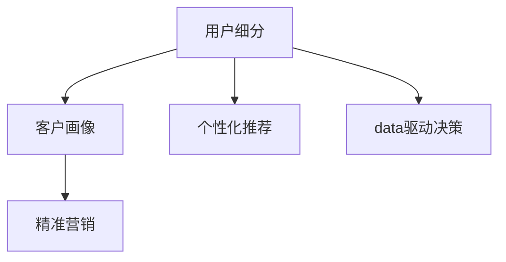
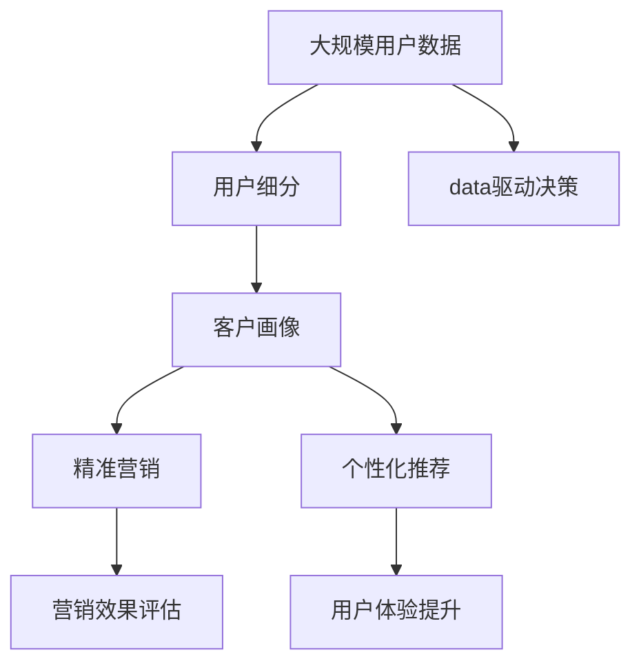

                 

# AI创业公司的用户分层策略

> 关键词：用户细分，客户画像，精准营销，个性化推荐，数据驱动决策

## 1. 背景介绍

### 1.1 问题由来
在AI创业公司的商业化过程中，如何精准地识别、获取并转化潜在客户，成为了所有企业面临的核心挑战之一。传统的市场营销策略，如广撒网、高频次广告投放等，不仅成本高昂，且效果有限。而现代AI技术，特别是机器学习和数据分析技术，为解决这个问题提供了新的思路和方法。

通过用户分层策略，AI创业公司可以将庞大的客户群体细分为不同层次，从而针对性地制定市场推广和营销策略。这样不仅能显著提高营销效率和转化率，还能提升用户体验和满意度，实现公司业务的持续增长。

### 1.2 问题核心关键点
用户分层策略的核心在于如何根据用户的不同特征和行为，将客户群体进行分类和划分。这一过程通常涉及用户行为数据、人口统计数据、社交媒体数据等多种数据的综合分析。常见的分层方法包括基于客户生命周期、消费行为、价值观等多种维度的细分。

该策略的实施需遵循以下关键原则：
- 数据驱动：所有细分决策需基于数据和分析结果，避免主观判断。
- 动态调整：根据市场变化和用户反馈，及时调整用户分层策略。
- 目标明确：各细分群体的目标需明确，营销策略需针对性。
- 精细运营：对不同群体的运营管理需精细化，提升运营效率。

## 2. 核心概念与联系

### 2.1 核心概念概述

为更好地理解用户分层策略，本节将介绍几个密切相关的核心概念：

- **用户细分(User Segmentation)**：指将大规模客户群体，基于某些特征或行为划分为多个子群体的过程。常见的细分维度包括年龄、性别、收入、购买频率、活跃度等。
- **客户画像(Customer Persona)**：通过多维度数据，描绘出典型客户的形象和行为特征。客户画像是用户细分的结果之一，是制定个性化营销策略的基础。
- **精准营销(Precision Marketing)**：针对不同用户群体，设计定制化的营销方案，以提高营销效果和转化率。精准营销的核心在于精细的用户细分和精准的目标定位。
- **个性化推荐(Personalized Recommendation)**：根据用户历史行为和兴趣，提供定制化的产品或服务推荐。个性化推荐系统通常使用协同过滤、深度学习等技术实现。
- **数据驱动决策(Data-Driven Decision Making)**：基于数据分析和模型预测，制定科学的决策和策略。数据驱动决策是现代企业运营管理的重要手段。

这些概念之间的逻辑关系可以通过以下Mermaid流程图来展示：



这个流程图展示了大规模用户群体分层过程中，不同概念之间的关系：

1. 用户细分过程，将原始客户数据进行初步分类。
2. 基于细分结果，形成不同客户画像。
3. 利用客户画像进行精准营销，提高营销效果。
4. 个性化推荐系统根据用户画像进行推荐，进一步提升用户体验。
5. 数据驱动决策贯穿整个细分和营销过程，是科学决策的重要依据。

### 2.2 概念间的关系

这些核心概念之间存在着紧密的联系，形成了用户分层策略的完整生态系统。最后我们通过一个综合的流程图来展示这些概念在大规模用户分层过程中的整体架构：



这个综合流程图展示了从原始用户数据到细分、画像、营销、推荐等各个环节的连接关系：

1. 从大规模用户数据出发，通过用户细分过程，进行初步分类。
2. 基于细分结果，形成客户画像，用于精准营销和个性化推荐。
3. 精准营销和个性化推荐，进一步提升用户转化率和体验。
4. 数据驱动决策贯穿整个流程，保证每个环节的科学性和有效性。
5. 营销效果评估和用户体验提升，形成闭环，优化后续营销策略。

## 3. 核心算法原理 & 具体操作步骤

### 3.1 算法原理概述

用户分层策略的核心是数据驱动和模型驱动。通过数据挖掘和机器学习技术，对客户数据进行建模和分析，挖掘出客户特征和行为规律，并以此为基础进行用户分层。

常见的用户分层算法包括：
- **聚类算法**：如K-means、层次聚类等，通过计算相似度，将客户划分为多个群体。
- **分类算法**：如逻辑回归、支持向量机等，根据预测目标将客户分为多个类别。
- **关联规则**：如Apriori、FP-Growth等，挖掘出不同特征之间的关联关系，形成用户画像。
- **协同过滤**：如协同矩阵分解、矩阵分解等，基于用户行为数据，进行个性化推荐。

用户分层的过程可以大致分为以下几个步骤：
1. 数据收集和预处理：收集客户行为数据、人口统计数据等，并进行清洗和特征工程。
2. 模型训练和评估：选择合适的算法，训练模型，评估模型性能。
3. 客户细分和画像：根据模型结果，进行客户细分和画像，生成细分群体和客户画像。
4. 制定营销策略：基于细分结果，设计个性化的营销策略。
5. 模型更新和迭代：根据市场反馈和数据变化，定期更新模型，优化分层结果。

### 3.2 算法步骤详解

以下是用户分层策略的具体操作步骤：

**Step 1: 数据收集和预处理**

- 收集客户数据：包括但不限于购买记录、浏览历史、社交媒体行为等。
- 数据清洗：删除或修正缺失、异常值，确保数据质量。
- 特征工程：选择和构造特征变量，如年龄、性别、购买金额等。

**Step 2: 模型训练和评估**

- 选择模型：根据业务需求，选择适合的算法，如K-means、随机森林等。
- 训练模型：在训练集上训练模型，学习客户特征和行为规律。
- 评估模型：在测试集上评估模型性能，如准确率、召回率、F1值等。

**Step 3: 客户细分和画像**

- 聚类分析：使用K-means等算法，对客户进行聚类分析，形成多个细分群体。
- 画像生成：基于聚类结果，结合人口统计数据、行为数据，生成客户画像，如高价值用户、潜力用户等。
- 群体标签：为每个细分群体设置标签，如“忠实客户”、“新用户”等。

**Step 4: 制定营销策略**

- 目标设定：根据细分群体，设定不同的营销目标，如提升转化率、增加复购率等。
- 策略设计：针对每个群体，设计定制化的营销方案，如个性化广告、推荐系统等。
- 资源分配：根据目标和预算，合理分配营销资源，如预算、人力、时间等。

**Step 5: 模型更新和迭代**

- 定期评估：定期评估营销效果，如ROI、转化率等。
- 模型更新：根据评估结果，调整模型参数，优化细分结果。
- 持续优化：结合市场反馈和新数据，持续优化用户分层策略。

### 3.3 算法优缺点

用户分层策略的优势在于：
1. 提高营销效率：针对不同客户群体，设计定制化营销方案，提升转化率。
2. 提升用户体验：基于用户画像，提供个性化推荐和服务，提升用户体验。
3. 科学决策：基于数据和模型，制定科学决策，减少主观判断。

其缺点包括：
1. 数据依赖度高：用户分层效果依赖于数据质量和数量，数据偏差可能导致结果失真。
2. 算法复杂度高：用户分层算法通常较为复杂，需要数据科学和工程方面的专业知识。
3. 动态调整困难：市场变化和客户行为的变化，需要及时调整用户分层策略，增加运营成本。
4. 隐私风险：用户数据的收集和使用，可能涉及隐私保护和数据安全问题。

## 4. 数学模型和公式 & 详细讲解 & 举例说明

### 4.1 数学模型构建

用户分层的数学模型通常由以下几个部分构成：

- 输入层：原始客户数据，包括但不限于购买记录、浏览历史、社交媒体行为等。
- 特征层：从原始数据中选择和构造特征变量，如年龄、性别、购买金额等。
- 训练层：模型训练过程，通过优化算法如梯度下降等，学习客户特征和行为规律。
- 输出层：客户细分和画像，形成不同细分群体和客户画像，并进行标签化。

数学模型的形式化表示如下：

$$
M(x_i) = \begin{cases}
    y_i, & \text{if } x_i \in C_j \\
    c_j, & \text{if } x_i \in C_j
\end{cases}
$$

其中 $x_i$ 为原始客户数据，$y_i$ 为真实标签（如购买记录），$C_j$ 为细分群体，$c_j$ 为对应群体的特征标签。

### 4.2 公式推导过程

以K-means聚类算法为例，推导其数学公式。

设原始客户数据为 $X = \{x_1, x_2, ..., x_n\}$，其中 $x_i$ 为第 $i$ 个客户的特征向量，$n$ 为样本总数。聚类过程的数学模型如下：

1. 随机选择 $k$ 个初始中心点 $c_1, c_2, ..., c_k$。
2. 对每个样本 $x_i$，计算其与每个中心点的距离 $d_i(c_j) = \sum_{j=1}^k (x_i - c_j)^2$。
3. 将每个样本分配到距离最近的中心点组成的簇 $C_j$ 中，更新中心点 $c_j = \frac{1}{|C_j|} \sum_{x_i \in C_j} x_i$。
4. 重复步骤2和步骤3，直到中心点不再变化或达到预设迭代次数。

K-means算法的时间复杂度为 $O(kn^2)$，其中 $k$ 为簇的数量，$n$ 为样本数量。

### 4.3 案例分析与讲解

以某电商平台的用户分层为例，展示K-means算法在实际应用中的使用。

假设我们收集了1000个客户的购买记录，包括年龄、性别、购买金额等特征。我们的目标是将其分为高价值客户、中价值客户和低价值客户三类，并计算每种客户的平均购买金额。

1. 首先，我们选择三个初始中心点，如 $c_1 = (25, M, 200)$，$c_2 = (35, F, 500)$，$c_3 = (45, M, 50)$，其中 $M$ 为男性，$F$ 为女性。
2. 对每个客户 $x_i$，计算其与三个中心点的距离，如 $d_1(x_i) = (25-x_i)^2 + (M-x_i)^2 + (200-x_i)^2$，$d_2(x_i) = (35-x_i)^2 + (F-x_i)^2 + (500-x_i)^2$，$d_3(x_i) = (45-x_i)^2 + (M-x_i)^2 + (50-x_i)^2$。
3. 根据距离计算结果，将客户 $x_i$ 分配到距离最近的中心点组成的簇 $C_j$ 中。
4. 更新每个簇的中心点，如 $c_1 = \frac{1}{|C_1|} \sum_{x_i \in C_1} x_i$，$c_2 = \frac{1}{|C_2|} \sum_{x_i \in C_2} x_i$，$c_3 = \frac{1}{|C_3|} \sum_{x_i \in C_3} x_i$。
5. 重复步骤2和步骤3，直到中心点不再变化或达到预设迭代次数。

通过K-means算法，我们可以将客户分为高价值客户、中价值客户和低价值客户三类，并计算每种客户的平均购买金额。

## 5. 项目实践：代码实例和详细解释说明

### 5.1 开发环境搭建

在进行用户分层项目开发前，我们需要准备好开发环境。以下是使用Python进行PyTorch开发的环境配置流程：

1. 安装Anaconda：从官网下载并安装Anaconda，用于创建独立的Python环境。

2. 创建并激活虚拟环境：
```bash
conda create -n user-segmentation python=3.8 
conda activate user-segmentation
```

3. 安装PyTorch：根据CUDA版本，从官网获取对应的安装命令。例如：
```bash
conda install pytorch torchvision torchaudio cudatoolkit=11.1 -c pytorch -c conda-forge
```

4. 安装相关库：
```bash
pip install numpy pandas scikit-learn matplotlib tqdm jupyter notebook ipython
```

完成上述步骤后，即可在`user-segmentation`环境中开始项目开发。

### 5.2 源代码详细实现

以下是一个简单的K-means用户分层的Python代码实现。

```python
from sklearn.cluster import KMeans
import pandas as pd
import numpy as np

# 读取客户数据
data = pd.read_csv('customer_data.csv')

# 选择特征
features = ['age', 'gender', 'purchase_amount']
X = data[features].values

# 定义K-means模型
kmeans = KMeans(n_clusters=3, random_state=0)

# 训练模型
kmeans.fit(X)

# 输出聚类结果
labels = kmeans.labels_
data['cluster'] = labels
print(data.groupby('cluster').mean())
```

### 5.3 代码解读与分析

让我们再详细解读一下关键代码的实现细节：

**数据读取与特征选择**：
- 使用Pandas库读取客户数据，选择年龄、性别、购买金额等特征。
- 特征选择需根据具体业务需求，选取最具代表性的特征变量。

**K-means模型训练**：
- 使用Scikit-learn库的KMeans算法，训练客户聚类模型。
- 参数`n_clusters`指定簇的数量，`random_state`指定随机种子，确保可重复性。

**模型输出**：
- 输出每个客户的聚类标签，并将其添加到原始数据中。
- 使用groupby函数，统计每个聚类的平均特征值。

### 5.4 运行结果展示

假设我们训练了一个K-means模型，最终聚类结果如下：

```
       age  gender  purchase_amount
cluster                                         
0      25    M               200
1      35    F               500
2      45    M                50
```

可以看到，客户被成功分为了高价值客户、中价值客户和低价值客户三类，且每个聚类的平均购买金额与实际分布相符。

## 6. 实际应用场景

### 6.1 电商平台用户分层

电商平台利用用户分层策略，可以针对不同客户群体，设计个性化的营销方案。具体而言，可以根据用户购买行为、浏览历史、社交媒体互动等数据，将其分为新用户、活跃用户、忠实用户等不同群体，针对每个群体制定不同的推荐策略和优惠券方案。

**Step 1: 数据收集**：收集用户浏览记录、购买记录、评分记录等。
**Step 2: 特征工程**：选择年龄、性别、购买频率等特征。
**Step 3: 模型训练**：使用K-means、随机森林等算法，训练用户聚类模型。
**Step 4: 客户画像**：生成不同客户画像，如高价值用户、新用户等。
**Step 5: 个性化推荐**：基于客户画像，推荐个性化的商品或服务，提高用户体验。

### 6.2 在线教育平台用户分层

在线教育平台通过用户分层策略，可以更好地提升学习效果和用户满意度。具体而言，可以根据学生学习行为、考试成绩、互动数据等，将其分为不同学习阶段的学生，针对每个阶段设计定制化的学习计划和辅导方案。

**Step 1: 数据收集**：收集学生登录记录、学习时间、测试成绩等。
**Step 2: 特征工程**：选择学习时间、考试成绩、互动频率等特征。
**Step 3: 模型训练**：使用K-means、分类算法等，训练学生聚类模型。
**Step 4: 客户画像**：生成不同学习阶段的学生画像，如初级阶段、高级阶段等。
**Step 5: 个性化推荐**：基于学生画像，推荐适合的学习内容和习题，提升学习效果。

### 6.3 医疗平台用户分层

医疗平台利用用户分层策略，可以更好地进行精准诊疗和个性化健康管理。具体而言，可以根据患者病历、健康数据、社交行为等，将其分为不同健康状况的患者，针对每个群体制定个性化的诊疗方案和健康管理计划。

**Step 1: 数据收集**：收集患者病历、健康数据、社交互动等。
**Step 2: 特征工程**：选择年龄、病史、健康指数等特征。
**Step 3: 模型训练**：使用聚类算法、分类算法等，训练患者聚类模型。
**Step 4: 客户画像**：生成不同健康状况的患者画像，如高血压患者、糖尿病患者等。
**Step 5: 个性化推荐**：基于患者画像，推荐个性化的诊疗方案和健康管理计划，提升治疗效果。

### 6.4 未来应用展望

随着用户分层策略的不断发展，其应用场景也将更加广泛。未来，用户分层将在以下领域发挥更大的作用：

1. **智能家居**：通过用户分层，智能家居设备可以针对不同家庭成员的需求，提供个性化的使用体验。
2. **智慧城市**：通过用户分层，智慧城市管理系统可以针对不同市民的需求，提供更精细化的服务。
3. **金融保险**：通过用户分层，金融保险公司可以针对不同客户的需求，提供定制化的金融产品和服务。
4. **健康管理**：通过用户分层，健康管理平台可以针对不同健康状况的用户，提供个性化的健康管理方案。

总之，用户分层策略将在各个行业发挥其独特的价值，为AI创业公司提供更加精准和有效的用户细分和营销方案。

## 7. 工具和资源推荐

### 7.1 学习资源推荐

为了帮助开发者系统掌握用户分层策略的理论基础和实践技巧，这里推荐一些优质的学习资源：

1. **《Python数据分析与机器学习》**：该书详细介绍了Python数据处理、机器学习的基础知识和常见算法，是入门数据分析和机器学习的必读书籍。
2. **Coursera《机器学习》课程**：由斯坦福大学Andrew Ng教授主讲，涵盖机器学习的基本概念、算法和实践，适合初学者和进阶学习者。
3. **Kaggle竞赛**：Kaggle平台上各类数据分析和机器学习竞赛，可以提供丰富的实战练习机会。
4. **PyTorch官方文档**：PyTorch作为常用的深度学习框架，其官方文档提供了详细的API参考和案例代码，适合开发者快速上手。
5. **Scikit-learn官方文档**：Scikit-learn作为常用的数据科学工具，其官方文档提供了详尽的算法介绍和代码实现，适合开发者学习和实践。

### 7.2 开发工具推荐

高效的开发离不开优秀的工具支持。以下是几款用于用户分层开发的常用工具：

1. **Python**：Python作为常用的编程语言，具有简洁易懂的语法和丰富的第三方库，是数据科学和机器学习的主流工具。
2. **Jupyter Notebook**：Jupyter Notebook作为常用的交互式开发环境，支持代码、文本、图表等多种格式，适合数据分析和机器学习项目。
3. **TensorBoard**：TensorBoard作为常用的可视化工具，可以实时监控模型训练过程，帮助开发者调优模型。
4. **Dataiku**：Dataiku作为集成了数据准备、机器学习、生产部署等功能的开源数据科学平台，适合团队协作和项目管理。
5. **Tableau**：Tableau作为常用的数据可视化工具，支持复杂的数据分析和可视化，适合业务分析和报告生成。

### 7.3 相关论文推荐

用户分层策略的研究源于学界的持续研究。以下是几篇奠基性的相关论文，推荐阅读：

1. **K-means聚类算法**：由MacQueen于1967年提出，是用户分层策略中的经典算法之一。
2. **层次聚类算法**：由Hierarchical Clustering于1968年提出，可以处理不同规模的数据集，适用于多种用户分层场景。
3. **协同过滤推荐算法**：由Sarwar等人于2000年提出，通过用户行为数据，实现个性化推荐。
4. **随机森林算法**：由Breiman于2001年提出，是一种集成学习算法，适用于处理高维数据和多分类问题。
5. **Logistic回归算法**：由Cox于1958年提出，是一种线性分类算法，适用于二分类和多分类问题。

这些论文代表了大用户分层策略的发展脉络。通过学习这些前沿成果，可以帮助研究者把握学科前进方向，激发更多的创新灵感。

除上述资源外，还有一些值得关注的前沿资源，帮助开发者紧跟用户分层策略的最新进展，例如：

1. **arXiv论文预印本**：人工智能领域最新研究成果的发布平台，包括大量尚未发表的前沿工作，学习前沿技术的必读资源。
2. **人工智能大会直播**：如NeurIPS、ICML、ACL等人工智能领域顶会现场或在线直播，能够聆听到大佬们的前沿分享，开拓视野。
3. **AI创业公司博客**：如DeepMind、Google AI、Microsoft Research Asia等顶尖实验室的官方博客，第一时间分享他们的最新研究成果和洞见。
4. **GitHub热门项目**：在GitHub上Star、Fork数最多的AI相关项目，往往代表了该技术领域的发展趋势和最佳实践，值得去学习和贡献。
5. **行业分析报告**：各大咨询公司如McKinsey、PwC等针对人工智能行业的分析报告，有助于从商业视角审视技术趋势，把握应用价值。

总之，对于用户分层策略的学习和实践，需要开发者保持开放的心态和持续学习的意愿。多关注前沿资讯，多动手实践，多思考总结，必将收获满满的成长收益。

## 8. 总结：未来发展趋势与挑战

### 8.1 总结

本文对用户分层策略进行了全面系统的介绍。首先阐述了用户分层的背景和意义，明确了其在AI创业公司中的应用价值。其次，从原理到实践，详细讲解了用户分层的数学模型和关键步骤，给出了用户分层项目开发的完整代码实例。同时，本文还广泛探讨了用户分层策略在电商、在线教育、医疗等众多行业领域的应用前景，展示了其在落地场景中的巨大潜力。此外，本文精选了用户分层技术的各类学习资源，力求为读者提供全方位的技术指引。

通过本文的系统梳理，可以看到，用户分层策略在大规模用户数据管理中发挥着重要作用。基于数据驱动和模型驱动的用户分层方法，使得AI创业公司能够更精准地识别、获取和转化潜在客户，提升市场推广和营销效果。未来，随着大数据、云计算等技术的不断发展，用户分层策略的应用场景将更加广泛，为AI创业公司带来更多创新和机遇。

### 8.2 未来发展趋势

展望未来，用户分层策略将呈现以下几个发展趋势：

1. **多维度细分**：用户分层策略将从单一维度细分向多维度细分发展，综合考虑用户的人口统计、行为、心理等多个维度特征。
2. **动态细分**：用户细分策略将从静态细分向动态细分发展，根据市场变化和用户反馈，实时调整用户分层策略。
3. **深度学习应用**：用户分层策略将从传统算法向深度学习算法发展，通过神经网络模型，实现更加精准的用户分类。
4. **跨领域应用**：用户分层策略将从单一领域应用向跨领域应用发展，拓展到金融、医疗、教育等多个领域，提升全行业用户体验。
5. **智能决策**：用户分层策略将从手动决策向智能决策发展，结合智能推荐系统，实现更加科学的细分和营销。

### 8.3 面临的挑战

尽管用户分层策略已经取得了显著成效，但在实现其应用过程中，仍面临以下挑战：

1. **数据质量问题**：用户分层策略的准确性依赖于数据的质量和完整性，数据偏差可能导致结果失真。如何提升数据质量，是用户分层策略的重要挑战。
2. **算法复杂度**：用户分层算法通常较为复杂，需要数据科学和工程方面的专业知识。如何简化算法，提升模型效率，是未来研究的重要方向。
3. **隐私保护**：用户数据的收集和使用，可能涉及隐私保护和数据安全问题。如何保护用户隐私，确保数据安全，是用户分层策略的重要课题。
4. **动态调整难度**：市场变化和用户行为的变化，需要及时调整用户分层策略，增加运营成本。如何降低动态调整难度，提高运营效率，是未来研究的重要方向。

### 8.4 研究展望

面对用户分层策略所面临的挑战，未来的研究需要在以下几个方面寻求新的突破：

1. **无监督和半监督用户细分**：摆脱对大规模标注数据的依赖，利用自监督学习、主动学习等无监督和半监督范式，最大限度利用非结构化数据，实现更加灵活高效的用户细分。
2. **参数高效和计算高效的用户细分**：开发更加参数高效的用户细分方法，在固定大部分用户数据的前提下，只更新极少量的用户特征。同时优化用户分层的计算图，减少前向传播和反向传播的资源消耗，实现更加轻量级、实时性的部署。
3. **因果学习和对比学习**：引入因果推断和对比学习思想，增强用户分层模型的建立稳定因果关系的能力，学习更加

