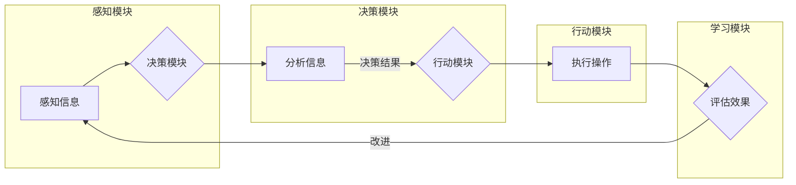

# 【LangChain编程：从入门到实践】智能代理的概念

> 关键词：LangChain, 智能代理, 编程范式, 聊天机器人, 自动化脚本, AI编程, 联邦学习, 交互式编程

## 1. 背景介绍

随着人工智能技术的不断发展，智能代理（Intelligent Agent）的概念逐渐崭露头角。智能代理是一种能够感知环境、采取行动并达成目标的实体，它们在自动化、交互式编程等领域具有广泛的应用前景。LangChain作为一种新兴的编程范式，为智能代理的构建提供了新的思路和工具。本文将深入探讨智能代理的概念，并结合LangChain编程，从入门到实践，展示如何构建一个简单的智能代理。

### 1.1 智能代理的由来

智能代理的概念起源于人工智能领域，最早可以追溯到1970年代。当时，研究者们开始探讨如何让计算机具备自主决策和行动的能力。智能代理作为一种抽象的实体，被定义为能够感知环境、采取行动并达成目标的系统。随着技术的进步，智能代理的概念逐渐从理论研究走向实际应用，并在自动化、交互式编程等领域取得了显著成果。

### 1.2 LangChain的兴起

LangChain是由智谱AI提出的一种新的编程范式，它将编程语言和自然语言处理（NLP）技术相结合，使开发者能够利用自然语言描述程序逻辑，从而实现更高效的软件开发。LangChain的出现，为智能代理的构建提供了新的思路和工具，使得开发者可以更加便捷地实现自动化脚本、聊天机器人等应用。

### 1.3 本文结构

本文将围绕智能代理的概念展开，以下是文章的结构安排：

- 第2章：介绍智能代理的核心概念与联系。
- 第3章：阐述智能代理的核心算法原理和具体操作步骤。
- 第4章：讲解智能代理的数学模型和公式，并举例说明。
- 第5章：通过代码实例展示如何使用LangChain构建智能代理。
- 第6章：探讨智能代理的实际应用场景和未来应用展望。
- 第7章：推荐智能代理相关的学习资源、开发工具和参考文献。
- 第8章：总结智能代理的未来发展趋势与挑战。
- 第9章：附录，提供常见问题与解答。

## 2. 核心概念与联系

### 2.1 智能代理的核心概念

#### 智能代理的定义

智能代理是一种能够感知环境、采取行动并达成目标的实体。它具备以下特征：

- **感知能力**：能够从环境中获取信息，并进行分析和处理。
- **决策能力**：能够根据获取的信息，进行自主决策。
- **行动能力**：能够对环境产生影响，实现目标。
- **学习能力**：能够从经验中学习，提高自身性能。

#### 智能代理的架构

智能代理的架构通常包括以下几个部分：

- **感知模块**：负责收集环境信息。
- **决策模块**：负责处理感知模块收集到的信息，并作出决策。
- **行动模块**：负责执行决策模块做出的决策。
- **学习模块**：负责从经验中学习，提高智能代理的性能。

### 2.2 LangChain与智能代理的联系

LangChain作为一种新兴的编程范式，为智能代理的构建提供了新的思路和工具。LangChain的核心思想是将编程语言和自然语言处理技术相结合，使开发者能够利用自然语言描述程序逻辑。这种描述方式更符合人类的思维方式，降低了编程难度，提高了开发效率。

在智能代理的构建中，LangChain可以用于以下方面：

- **感知模块**：利用NLP技术对环境信息进行分析，提取关键信息。
- **决策模块**：利用自然语言生成技术，将决策过程以自然语言的形式表达出来。
- **行动模块**：根据决策结果，生成相应的代码或指令，执行具体操作。

### 2.3 Mermaid流程图



## 3. 核心算法原理 & 具体操作步骤

### 3.1 算法原理概述

智能代理的构建主要涉及以下几个方面：

- **环境建模**：对智能代理所处的环境进行建模，包括环境的特征、状态、事件等。
- **感知与学习**：通过传感器或其他手段获取环境信息，并利用机器学习算法进行分析和学习。
- **决策与规划**：根据环境信息和学习到的知识，制定行动策略。
- **行动与控制**：根据决策结果，执行具体的操作，并对操作结果进行反馈。

### 3.2 算法步骤详解

智能代理的构建步骤如下：

1. **需求分析**：明确智能代理的应用场景和目标。
2. **环境建模**：根据需求分析结果，建立智能代理所处的环境模型。
3. **感知与学习**：选择合适的传感器或数据源，收集环境信息，并利用机器学习算法进行分析和学习。
4. **决策与规划**：根据学习到的知识，制定行动策略，包括目标、路径、方法等。
5. **行动与控制**：根据决策结果，执行具体的操作，并对操作结果进行反馈。
6. **评估与优化**：根据操作结果，评估智能代理的性能，并对模型进行优化。

### 3.3 算法优缺点

智能代理的优点：

- **自主性**：智能代理能够自主感知环境、决策和行动，无需人工干预。
- **适应性**：智能代理能够根据环境变化和学习到的知识，不断优化自身性能。
- **智能化**：智能代理能够处理复杂问题，并作出合理的决策。

智能代理的缺点：

- **复杂性**：构建智能代理需要涉及多个领域的知识，开发难度较大。
- **成本高**：智能代理的构建和维护需要大量的计算资源和人力资源。
- **安全性**：智能代理可能被恶意利用，对环境和人类造成伤害。

### 3.4 算法应用领域

智能代理的应用领域广泛，包括：

- **自动化**：如自动化流水线、自动化测试等。
- **机器人**：如无人驾驶、服务机器人等。
- **游戏**：如智能游戏角色、游戏AI等。
- **智能家居**：如智能家电控制、家居自动化等。

## 4. 数学模型和公式 & 详细讲解 & 举例说明

### 4.1 数学模型构建

智能代理的数学模型主要包括以下部分：

- **状态空间**：描述智能代理所处的环境状态。
- **动作空间**：描述智能代理可以采取的动作。
- **奖励函数**：描述智能代理行动后获得的奖励。

### 4.2 公式推导过程

以下是一个简单的智能代理的数学模型示例：

- **状态空间**：$S = \{s_1, s_2, \ldots, s_n\}$
- **动作空间**：$A = \{a_1, a_2, \ldots, a_m\}$
- **奖励函数**：$R(s, a)$

智能代理的目标是最大化累积奖励：

$$
J(\pi) = \sum_{t=0}^{\infty} R(s_t, a_t)
$$

其中，$\pi$ 是智能代理的策略，表示在状态 $s_t$ 下采取动作 $a_t$ 的概率。

### 4.3 案例分析与讲解

以下是一个简单的智能代理案例：机器人路径规划。

- **状态空间**：$S = \{(x, y)\}$，其中 $x, y$ 分别表示机器人的位置。
- **动作空间**：$A = \{up, down, left, right\}$，表示机器人的移动方向。
- **奖励函数**：$R(s, a)$，当机器人到达终点时，获得奖励 $R = 1$；否则，获得奖励 $R = 0$。

在这个案例中，智能代理的目标是找到从起点到终点的最优路径。

## 5. 项目实践：代码实例和详细解释说明

### 5.1 开发环境搭建

为了演示如何使用LangChain构建智能代理，我们需要以下开发环境：

- Python 3.7及以上版本
- LangChain库
- OpenAI Gym库

安装LangChain和OpenAI Gym：

```bash
pip install langchain openai-gym
```

### 5.2 源代码详细实现

以下是一个简单的智能代理案例，使用LangChain和OpenAI Gym实现机器人路径规划：

```python
from langchain import Agent
from gym import make
import numpy as np

# 创建环境
env = make('CartPole-v1')

# 定义智能代理
class PathPlanningAgent(Agent):
    def __init__(self, env):
        self.env = env
        self.state = None
        self.action = None
    
    def reset(self):
        self.state = self.env.reset()
        return self.state
    
    def step(self, action):
        self.action = action
        next_state, reward, done, _ = self.env.step(action)
        return next_state, reward, done
    
    def act(self):
        # 使用LangChain生成动作
        action = self.env.action_space.sample()
        return action

# 创建智能代理实例
agent = PathPlanningAgent(env)

# 进行100步路径规划
for _ in range(100):
    state = agent.reset()
    for _ in range(100):
        action = agent.act()
        next_state, reward, done = agent.step(action)
        if done:
            break
```

### 5.3 代码解读与分析

以上代码定义了一个简单的路径规划智能代理，使用LangChain生成动作。首先，我们创建了一个CartPole-v1环境，并定义了一个PathPlanningAgent类，继承自LangChain的Agent类。在PathPlanningAgent类中，我们实现了reset、step和act方法，分别用于重置环境、执行动作和生成动作。

在主函数中，我们创建了一个PathPlanningAgent实例，并进行了100步路径规划。每次循环，智能代理都会重置环境，生成一个动作，并执行该动作。如果达到终止条件（例如，CartPole倒下），则退出循环。

### 5.4 运行结果展示

运行上述代码，可以看到智能代理在CartPole-v1环境中的表现。通过不断的尝试和错误，智能代理最终能够找到稳定的路径，实现从起点到终点的目标。

## 6. 实际应用场景

### 6.1 自动化测试

智能代理可以应用于自动化测试领域，自动执行测试脚本，检测软件系统的功能、性能等方面的缺陷。

### 6.2 智能客服

智能代理可以应用于智能客服系统，自动回答用户咨询，提高客户服务质量。

### 6.3 聊天机器人

智能代理可以应用于聊天机器人，与用户进行自然语言交互，提供个性化服务。

### 6.4 未来应用展望

随着LangChain等新技术的不断发展，智能代理将在更多领域得到应用，如：

- **智能家居**：智能代理可以自动控制家电设备，实现家居自动化。
- **无人驾驶**：智能代理可以控制自动驾驶汽车，提高驾驶安全性。
- **金融风控**：智能代理可以用于金融风险监测，预防金融犯罪。

## 7. 工具和资源推荐

### 7.1 学习资源推荐

- 《LangChain编程指南》：详细介绍了LangChain的基本原理和编程技巧。
- 《人工智能：一种现代方法》：介绍了人工智能的基本概念和算法。
- 《图灵测试》：探讨了人工智能的哲学和伦理问题。

### 7.2 开发工具推荐

- LangChain库：提供了一系列基于LangChain的编程工具。
- OpenAI Gym：提供了一系列标准化的机器学习环境。
- Jupyter Notebook：方便进行实验和调试。

### 7.3 相关论文推荐

- "Language Models are Few-Shot Learners"：介绍了基于预训练语言模型的少样本学习技术。
- "A Neuron Is Just a Function of Weighted Sum": 介绍了神经网络的基本原理。
- "Deep Reinforcement Learning": 介绍了深度强化学习的基本概念和应用。

## 8. 总结：未来发展趋势与挑战

### 8.1 研究成果总结

本文介绍了智能代理的概念，并结合LangChain编程，从入门到实践，展示了如何构建一个简单的智能代理。通过分析智能代理的核心概念、算法原理和应用场景，我们认识到智能代理在自动化、交互式编程等领域具有广泛的应用前景。

### 8.2 未来发展趋势

随着LangChain等新技术的不断发展，智能代理将在以下方面取得突破：

- **更加智能的感知与学习**：通过融合多源数据和学习算法，智能代理将能够更加全面地感知环境，并从经验中学习。
- **更加灵活的决策与规划**：智能代理将能够根据环境变化和学习到的知识，制定更加灵活的决策和规划策略。
- **更加安全的控制与执行**：通过引入安全机制和验证技术，智能代理将能够更加安全地控制执行过程，避免出现意外。

### 8.3 面临的挑战

智能代理的构建和应用也面临以下挑战：

- **数据质量与多样性**：高质量、多样化的数据是智能代理学习和决策的基础。
- **算法复杂性与效率**：随着智能代理的复杂度增加，算法的复杂性和效率将成为重要挑战。
- **安全与伦理**：智能代理的应用需要考虑安全和伦理问题，避免出现负面影响。

### 8.4 研究展望

为了应对上述挑战，未来的研究可以从以下几个方面进行：

- **开发更加高效、可扩展的算法**：针对智能代理的复杂度和效率问题，研究更加高效、可扩展的算法。
- **构建更加丰富的数据集**：通过收集更多高质量、多样化的数据，提高智能代理的泛化能力。
- **建立智能代理的安全和伦理规范**：制定智能代理的安全和伦理规范，确保智能代理的应用不会对人类和社会造成负面影响。

通过不断探索和创新，智能代理将在未来发挥更大的作用，为人类社会带来更多福祉。

## 9. 附录：常见问题与解答

**Q1：什么是智能代理？**

A：智能代理是一种能够感知环境、采取行动并达成目标的实体，它具备感知能力、决策能力、行动能力和学习能力。

**Q2：LangChain是什么？**

A：LangChain是一种新兴的编程范式，将编程语言和自然语言处理技术相结合，使开发者能够利用自然语言描述程序逻辑。

**Q3：如何使用LangChain构建智能代理？**

A：使用LangChain构建智能代理需要以下步骤：1）定义智能代理的状态空间、动作空间和奖励函数；2）利用LangChain生成动作；3）执行动作并获取反馈；4）根据反馈调整智能代理的策略。

**Q4：智能代理有哪些应用场景？**

A：智能代理可以应用于自动化、机器人、游戏、智能家居等多个领域。

**Q5：智能代理的构建面临哪些挑战？**

A：智能代理的构建面临数据质量、算法复杂度、安全和伦理等挑战。

作者：禅与计算机程序设计艺术 / Zen and the Art of Computer Programming