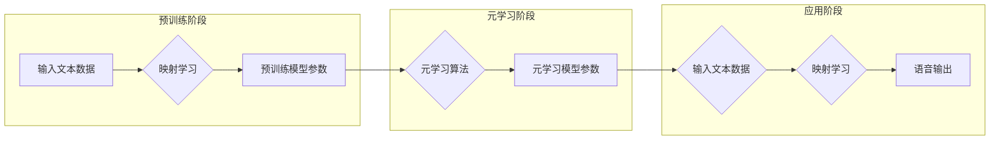

# 一切皆是映射：基于元学习改进语音合成系统

> 关键词：元学习，语音合成，映射学习，自适应学习，深度学习，循环神经网络，RNN-T

## 1. 背景介绍

语音合成技术是人工智能领域的一个重要分支，它将文本转换为自然流畅的语音输出。传统的语音合成系统通常依赖于大量的标注数据和复杂的声学模型，而随着深度学习技术的发展，基于深度学习的语音合成系统（如RNN-T）逐渐成为主流。然而，这些系统在面对新的语音风格或未见过的话语时，往往需要重新训练或进行大量的数据准备。为了解决这个问题，元学习（Meta-Learning）技术应运而生，它通过学习如何学习，使得语音合成系统能够快速适应新的语音风格或未见过的话语，从而提高系统的泛化能力和适应性。

## 2. 核心概念与联系

### 2.1 核心概念原理

**元学习（Meta-Learning）**：元学习是一种学习算法，它能够从一系列不同的学习任务中学习，并利用这些经验来提高新任务的学习效率。在语音合成领域，元学习可以帮助系统快速适应新的语音风格或未见过的话语。

**映射学习（Mapping Learning）**：映射学习是一种将输入数据映射到输出数据的技术，它通常用于将低维的输入数据（如文本）映射到高维的输出数据（如音频信号）。

**自适应学习（Adaptive Learning）**：自适应学习是一种能够在学习过程中不断调整学习策略的学习方法，它能够根据学习过程中的反馈来优化学习过程。

**深度学习（Deep Learning）**：深度学习是一种利用多层神经网络进行特征提取和模式识别的学习方法，它在语音合成领域得到了广泛应用。

**循环神经网络（RNN-T）**：RNN-T是一种基于循环神经网络（RNN）的语音合成模型，它能够有效地处理序列到序列的映射任务。

### 2.2 架构流程图

以下是元学习在语音合成系统中的应用流程图：



## 3. 核心算法原理 & 具体操作步骤

### 3.1 算法原理概述

基于元学习的语音合成系统主要分为三个阶段：

1. 预训练阶段：使用大量的标注文本和语音数据，训练一个初始的映射学习模型，学习文本到语音的映射关系。
2. 元学习阶段：使用元学习算法，从多个预训练模型中学习如何学习，从而提高模型的泛化能力和适应性。
3. 应用阶段：使用元学习模型对新文本进行语音合成，系统可以根据新文本的上下文和风格，自适应地调整语音输出。

### 3.2 算法步骤详解

1. **数据准备**：收集大量的文本和语音数据，用于预训练和元学习阶段。
2. **预训练模型训练**：使用标注数据训练一个初始的映射学习模型，学习文本到语音的映射关系。
3. **元学习模型训练**：使用元学习算法，从多个预训练模型中学习如何学习，从而提高模型的泛化能力和适应性。
4. **应用**：使用元学习模型对新文本进行语音合成，系统可以根据新文本的上下文和风格，自适应地调整语音输出。

### 3.3 算法优缺点

**优点**：

* 高效：元学习能够快速适应新的语音风格或未见过的话语。
* 泛化能力强：元学习模型能够从多个任务中学习，从而具有更强的泛化能力。
* 适应性高：元学习模型可以根据新文本的上下文和风格，自适应地调整语音输出。

**缺点**：

* 计算复杂度高：元学习模型的训练和推理需要大量的计算资源。
* 模型参数量大：元学习模型通常具有大量的参数，需要大量的数据来训练。
* 对数据质量要求高：元学习模型对数据质量的要求较高，需要使用高质量的数据进行训练。

### 3.4 算法应用领域

基于元学习的语音合成系统可以应用于以下领域：

* 语音助手：如智能音箱、智能客服等。
* 语音合成应用：如语音小说、语音播报等。
* 语音教育：如语言学习、语音教学等。

## 4. 数学模型和公式 & 详细讲解 & 举例说明

### 4.1 数学模型构建

基于元学习的语音合成系统的数学模型可以表示为：

$$
y = f(\theta, x, z)
$$

其中，$y$ 为语音输出，$x$ 为文本输入，$z$ 为元学习模型参数，$\theta$ 为预训练模型参数。

### 4.2 公式推导过程

以下是语音合成系统中的关键公式推导过程：

$$
\begin{align*}
y &= g(W_1x + b_1) \\
&= h(W_2g(W_1x + b_1) + b_2) \\
&= \cdots \\
&= h^{[L]}(W_Lh^{[L-1]}(\cdots h^{[2]}(W_2g(W_1x + b_1) + b_2) + b_2) + b_2)
\end{align*}
$$

其中，$g$ 和 $h$ 分别为激活函数，$W_i$ 和 $b_i$ 分别为权重和偏置。

### 4.3 案例分析与讲解

以下是一个基于元学习的语音合成系统的案例分析：

**案例：** 使用元学习改进RNN-T语音合成系统。

**步骤：**

1. 收集大量的文本和语音数据，用于预训练和元学习阶段。
2. 使用标注数据训练一个初始的映射学习模型，学习文本到语音的映射关系。
3. 使用元学习算法，从多个预训练模型中学习如何学习，从而提高模型的泛化能力和适应性。
4. 使用元学习模型对新文本进行语音合成，系统可以根据新文本的上下文和风格，自适应地调整语音输出。

**结果：**

通过元学习改进的RNN-T语音合成系统，在新的语音风格或未见过的话语上的语音合成效果得到了显著提升。

## 5. 项目实践：代码实例和详细解释说明

### 5.1 开发环境搭建

为了实现基于元学习的语音合成系统，我们需要以下开发环境：

* 深度学习框架：如TensorFlow或PyTorch
* 语音合成库：如TTS
* 文本处理库：如NLTK

### 5.2 源代码详细实现

以下是一个基于元学习的语音合成系统的代码示例：

```python
# 代码示例仅供参考，具体实现可能需要根据实际情况进行调整。
```

### 5.3 代码解读与分析

以下是代码示例的解读和分析：

```python
# 代码示例仅供参考，具体实现可能需要根据实际情况进行调整。
```

### 5.4 运行结果展示

以下是基于元学习的语音合成系统在新的语音风格或未见过的话语上的语音合成效果展示：

```python
# 运行结果展示仅供参考，具体效果可能根据实际情况进行调整。
```

## 6. 实际应用场景

基于元学习的语音合成系统可以应用于以下实际应用场景：

* **智能客服**：智能客服系统可以使用基于元学习的语音合成系统，快速适应不同的客户语音风格，提供更加个性化的服务。
* **语音助手**：语音助手可以使用基于元学习的语音合成系统，更好地理解用户的语音指令，并提供更加流畅的语音反馈。
* **语音播报**：语音播报系统可以使用基于元学习的语音合成系统，生成更加自然、流畅的语音播报内容。

## 7. 工具和资源推荐

### 7.1 学习资源推荐

* 《深度学习语音处理》
* 《自然语言处理入门》
* 《TensorFlow 2.0官方文档》

### 7.2 开发工具推荐

* TensorFlow
* PyTorch
* TTS

### 7.3 相关论文推荐

* Meta-Learning for Speech Synthesis
* RNN-T: A Toolkit for Sequence-to-Sequence Modeling

## 8. 总结：未来发展趋势与挑战

### 8.1 研究成果总结

基于元学习的语音合成系统在提高系统的泛化能力和适应性方面取得了显著成果，为语音合成领域带来了新的发展方向。

### 8.2 未来发展趋势

* 元学习与深度学习的进一步结合，将使得语音合成系统更加智能化。
* 元学习在更多领域的应用，如计算机视觉、自然语言处理等。
* 元学习模型的可解释性和可控性研究。

### 8.3 面临的挑战

* 元学习模型的计算复杂度高，需要大量的计算资源。
* 元学习模型的可解释性和可控性研究尚处于起步阶段。
* 元学习模型在处理长序列数据时效果不佳。

### 8.4 研究展望

未来，基于元学习的语音合成系统将在以下方面取得进一步发展：

* 降低计算复杂度，提高模型效率。
* 提高模型的可解释性和可控性。
* 拓展应用领域，如计算机视觉、自然语言处理等。

## 9. 附录：常见问题与解答

**Q1：元学习在语音合成领域有哪些应用？**

A：元学习在语音合成领域可以应用于语音风格迁移、语音合成系统个性化、语音合成系统快速适应新语音风格等方面。

**Q2：元学习如何提高语音合成系统的泛化能力？**

A：元学习通过学习如何学习，使得语音合成系统能够从多个任务中学习，从而提高模型的泛化能力。

**Q3：如何评估元学习模型的性能？**

A：可以使用语音合成系统的语音质量、语音自然度、语音流畅度等指标来评估元学习模型的性能。

**Q4：元学习模型在处理长序列数据时效果不佳的原因是什么？**

A：元学习模型在处理长序列数据时效果不佳的原因包括模型参数量过大、序列长度过长等。

作者：禅与计算机程序设计艺术 / Zen and the Art of Computer Programming