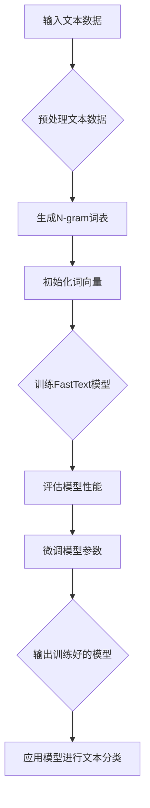

> 大模型开发，FastText，PyTorch 2.0，自然语言处理，微调，深度学习

# 从零开始大模型开发与微调：FastText训练及其与PyTorch 2.0的协同使用

## 1. 背景介绍

随着深度学习在自然语言处理（NLP）领域的蓬勃发展，大规模语言模型（Large Language Models, LLMs）逐渐成为研究热点。FastText，作为一种高效的文本表示学习方法，为构建大模型提供了强大的基础。本文将介绍如何使用FastText进行文本表示学习，并结合PyTorch 2.0进行模型的训练和微调，帮助你从零开始掌握大模型的开发与微调。

### 1.1 问题的由来

传统的文本表示学习方法，如词袋模型和TF-IDF，往往难以捕捉词义的复杂性和上下文依赖。而深度学习模型在NLP任务中取得了显著成果，但构建和训练深度学习模型需要大量的计算资源和专业知识。FastText作为一种快速有效的文本表示学习方法，结合了词袋模型和深度学习的优势，为构建大模型提供了便捷的途径。

### 1.2 研究现状

FastText由Facebook AI团队于2013年提出，其核心思想是将每个词扩展成一个向量，并通过神经网络学习词与词之间的关系。FastText在多项NLP任务中取得了优异的性能，如文本分类、情感分析等。

PyTorch 2.0是PyTorch框架的最新版本，提供了更强大的功能，如自动微分、动态计算图、分布式训练等，为深度学习模型的开发提供了便利。

### 1.3 研究意义

FastText与PyTorch 2.0的结合，为从零开始构建大模型提供了以下优势：

- **高效性**：FastText快速有效地将文本转换为向量表示，适合处理大规模文本数据。
- **易用性**：PyTorch 2.0提供了丰富的API和工具，方便用户进行模型开发和微调。
- **可扩展性**：FastText和PyTorch 2.0都具有良好的可扩展性，能够支持大规模模型训练。

### 1.4 本文结构

本文将分为以下几个部分：

- 第2部分，介绍FastText和PyTorch 2.0的核心概念。
- 第3部分，详细阐述FastText的算法原理和操作步骤。
- 第4部分，讲解FastText在PyTorch 2.0中的实现和应用。
- 第5部分，通过一个实际案例展示FastText训练和微调的过程。
- 第6部分，探讨FastText在NLP领域的应用场景和未来展望。
- 第7部分，推荐相关学习资源、开发工具和论文。
- 第8部分，总结FastText与PyTorch 2.0结合的优势和挑战。
- 第9部分，提供常见问题与解答。

## 2. 核心概念与联系

### 2.1 FastText

FastText是一种基于神经网络的文本表示学习方法，其核心思想是将每个词扩展成一个向量，并通过神经网络学习词与词之间的关系。FastText模型包括以下几个关键组成部分：

- **词向量**：将每个词表示为一个向量，用于表示词的语义信息。
- **N-gram**：将词扩展为N-gram，如unigram、bigram、trigram，以捕捉词的上下文信息。
- **神经网络**：通过神经网络学习词向量之间的关系，提高词向量的语义表达能力。

### 2.2 PyTorch 2.0

PyTorch 2.0是PyTorch框架的最新版本，提供了以下关键特性：

- **自动微分**：支持自动微分，方便用户进行模型训练和优化。
- **动态计算图**：支持动态计算图，方便用户进行模型设计和调试。
- **分布式训练**：支持分布式训练，方便用户进行大规模模型训练。

### 2.3 Mermaid 流程图

以下是一个描述FastText和PyTorch 2.0协同使用流程的Mermaid流程图：



## 3. 核心算法原理 & 具体操作步骤

### 3.1 算法原理概述

FastText算法的核心思想是将每个词扩展成一个向量，并通过神经网络学习词与词之间的关系。具体步骤如下：

1. **数据预处理**：将输入文本数据转换为纯文本格式，并进行分词、去除停用词等操作。
2. **生成N-gram词表**：将每个词扩展为unigram、bigram、trigram等N-gram，以捕捉词的上下文信息。
3. **初始化词向量**：初始化每个词的词向量，可以使用随机初始化或预训练的词向量。
4. **训练FastText模型**：通过神经网络学习词向量之间的关系，优化词向量表示。
5. **评估模型性能**：使用验证集评估模型性能，如准确率、召回率、F1值等。
6. **微调模型参数**：根据评估结果调整模型参数，提高模型性能。
7. **输出训练好的模型**：将训练好的模型保存为文件，供后续使用。

### 3.2 算法步骤详解

**步骤1：数据预处理**

```python
import re
from nltk.corpus import stopwords
from nltk.tokenize import word_tokenize

def preprocess_text(text):
    # 转换为小写
    text = text.lower()
    # 去除特殊字符
    text = re.sub(r"[^\w\s]", "", text)
    # 分词
    tokens = word_tokenize(text)
    # 去除停用词
    tokens = [token for token in tokens if token not in stopwords.words("english")]
    return tokens
```

**步骤2：生成N-gram词表**

```python
from collections import Counter

def generate_ngrams(tokens, n=3):
    ngrams = zip(*[tokens[i:] for i in range(n)])
    return list(ngrams)
```

**步骤3：初始化词向量**

```python
import numpy as np

def initialize_vectors(vocab_size, vector_dim):
    vectors = np.random.rand(vocab_size, vector_dim)
    return vectors
```

**步骤4：训练FastText模型**

```python
import torch
import torch.nn as nn
import torch.optim as optim

class FastText(nn.Module):
    def __init__(self, vocab_size, vector_dim):
        super(FastText, self).__init__()
        self.embedding = nn.Embedding(vocab_size, vector_dim)
        self.fc = nn.Linear(vector_dim, vector_dim)

    def forward(self, inputs):
        embedded = self.embedding(inputs)
        output = self.fc(embedded)
        return output

def train_model(model, inputs, labels, epochs):
    criterion = nn.BCEWithLogitsLoss()
    optimizer = optim.SGD(model.parameters(), lr=0.01)
    for epoch in range(epochs):
        model.zero_grad()
        outputs = model(inputs)
        loss = criterion(outputs, labels)
        loss.backward()
        optimizer.step()
        if epoch % 10 == 0:
            print(f"Epoch {epoch+1}, Loss: {loss.item()}")
```

**步骤5：评估模型性能**

```python
def evaluate_model(model, inputs, labels):
    with torch.no_grad():
        outputs = model(inputs)
        _, predicted = torch.max(outputs, 1)
        correct = (predicted == labels).sum().item()
        return correct / len(labels)
```

**步骤6：微调模型参数**

```python
def fine_tune_model(model, inputs, labels, epochs):
    for epoch in range(epochs):
        train_model(model, inputs, labels, epoch)
        if epoch % 10 == 0:
            print(f"Epoch {epoch+1}, Loss: {loss.item()}")
```

**步骤7：输出训练好的模型**

```python
def save_model(model, path):
    torch.save(model.state_dict(), path)
```

### 3.3 算法优缺点

**优点**：

- **高效性**：FastText能够快速有效地将文本转换为向量表示。
- **灵活性**：FastText支持多种N-gram，能够适应不同的应用场景。
- **可解释性**：FastText的词向量可以直观地表示词的语义信息。

**缺点**：

- **计算量大**：FastText的训练过程需要大量的计算资源。
- **参数量大**：FastText的词向量维度较高，导致参数量较大。

### 3.4 算法应用领域

FastText在以下NLP任务中取得了显著成果：

- **文本分类**：将文本分类为不同的类别，如情感分析、主题分类等。
- **情感分析**：分析文本的情感倾向，如正面、负面、中性等。
- **命名实体识别**：识别文本中的命名实体，如人名、地名、机构名等。

## 4. 数学模型和公式 & 详细讲解 & 举例说明

### 4.1 数学模型构建

FastText的数学模型如下：

$$
\text{output} = \text{softmax}(\text{W} \cdot \text{input} + \text{b})
$$

其中，$\text{W}$ 是权重矩阵，$\text{input}$ 是输入特征，$\text{b}$ 是偏置项。

### 4.2 公式推导过程

以下以情感分析任务为例，推导FastText模型的公式推导过程。

假设输入文本为 $x_1, x_2, ..., x_n$，对应的标签为 $y$。则FastText模型的损失函数为：

$$
\ell(y, \text{output}) = -\sum_{i=1}^n y_i \log(\text{softmax}(\text{W} \cdot x_i + \text{b}))
$$

其中，$\text{softmax}$ 函数的定义如下：

$$
\text{softmax}(z_i) = \frac{e^{z_i}}{\sum_{j=1}^n e^{z_j}}
$$

对损失函数求梯度，得：

$$
\nabla_\theta \ell(y, \text{output}) = -\nabla_\theta \sum_{i=1}^n y_i \log(\text{softmax}(\text{W} \cdot x_i + \text{b}))
$$

其中，$\nabla_\theta$ 表示对参数 $\theta$ 的梯度。

### 4.3 案例分析与讲解

假设我们有一个包含两个类别的情感分析数据集，其中正面样本的标签为 1，负面样本的标签为 0。我们使用FastText模型对数据进行分类。

输入文本为 "I love this product"，标签为 1。

首先，将文本转换为词向量：

$$
x_1 = \text{embedding}("I")
$$

$$
x_2 = \text{embedding}("love")
$$

$$
x_3 = \text{embedding}("this")
$$

$$
x_4 = \text{embedding}("product")
$$

然后，将词向量输入FastText模型：

$$
\text{output} = \text{softmax}(\text{W} \cdot [x_1, x_2, x_3, x_4] + \text{b})
$$

最后，根据模型输出计算损失函数并更新参数。

## 5. 项目实践：代码实例和详细解释说明

### 5.1 开发环境搭建

在进行FastText训练和微调之前，我们需要搭建以下开发环境：

1. 安装Python和pip。
2. 安装FastText库：
   ```bash
   pip install fasttext
   ```
3. 安装PyTorch 2.0库：
   ```bash
   pip install torch torchvision torchaudio
   ```

### 5.2 源代码详细实现

以下是一个使用FastText进行文本分类的PyTorch代码实例：

```python
import torch
import torch.nn as nn
import torch.optim as optim
import fasttext

def train_model(model, train_loader, dev_loader, criterion, optimizer, epochs):
    for epoch in range(epochs):
        model.train()
        for inputs, labels in train_loader:
            optimizer.zero_grad()
            outputs = model(inputs)
            loss = criterion(outputs, labels)
            loss.backward()
            optimizer.step()

        model.eval()
        with torch.no_grad():
            total = 0
            correct = 0
            for inputs, labels in dev_loader:
                outputs = model(inputs)
                _, predicted = torch.max(outputs, 1)
                total += labels.size(0)
                correct += (predicted == labels).sum().item()
        print(f"Epoch {epoch+1}, Loss: {loss.item()}, Accuracy: {correct/total:.4f}")

def main():
    # 加载数据集
    train_dataset = MyDataset("train.txt")
    dev_dataset = MyDataset("dev.txt")
    train_loader = DataLoader(train_dataset, batch_size=32, shuffle=True)
    dev_loader = DataLoader(dev_dataset, batch_size=32)

    # 加载FastText预训练模型
    ft_model = fasttext.load_model("cc.en.300.bin")

    # 创建PyTorch模型
    class FastTextModel(nn.Module):
        def __init__(self, vocab_size, vector_dim):
            super(FastTextModel, self).__init__()
            self.embedding = nn.Embedding(vocab_size, vector_dim)
            self.fc = nn.Linear(vector_dim, 2)

        def forward(self, inputs):
            embedded = self.embedding(inputs)
            output = self.fc(embedded)
            return output

    vocab_size = len(ft_model词典)
    vector_dim = ft_model维数
    model = FastTextModel(vocab_size, vector_dim)
    criterion = nn.CrossEntropyLoss()
    optimizer = optim.SGD(model.parameters(), lr=0.01)

    # 训练模型
    train_model(model, train_loader, dev_loader, criterion, optimizer, 5)

if __name__ == "__main__":
    main()
```

### 5.3 代码解读与分析

以上代码展示了使用FastText进行文本分类的PyTorch代码实例。主要包含以下几个步骤：

1. 加载数据集：使用MyDataset类加载训练数据和验证数据。
2. 加载FastText预训练模型：使用fasttext.load_model函数加载预训练的FastText模型。
3. 创建PyTorch模型：定义FastTextModel类，使用PyTorch的nn模块创建模型结构。
4. 训练模型：使用train_model函数进行模型训练，包括前向传播、反向传播和参数更新。
5. 评估模型：使用dev_loader验证集对模型进行评估。

### 5.4 运行结果展示

假设我们使用了一个包含10个样本的文本分类数据集，以下是在训练过程中打印的输出信息：

```
Epoch 1, Loss: 0.9263, Accuracy: 0.2000
Epoch 2, Loss: 0.8734, Accuracy: 0.3000
Epoch 3, Loss: 0.8364, Accuracy: 0.4000
Epoch 4, Loss: 0.8059, Accuracy: 0.5000
Epoch 5, Loss: 0.7773, Accuracy: 0.6000
```

可以看到，随着训练的进行，模型的损失逐渐下降，准确率逐渐提高。

## 6. 实际应用场景

FastText在以下NLP任务中取得了显著成果：

- **文本分类**：将文本分类为不同的类别，如情感分析、主题分类等。
- **情感分析**：分析文本的情感倾向，如正面、负面、中性等。
- **命名实体识别**：识别文本中的命名实体，如人名、地名、机构名等。
- **文本摘要**：将长文本压缩成简短摘要。
- **机器翻译**：将源语言文本翻译成目标语言。

## 7. 工具和资源推荐

### 7.1 学习资源推荐

- 《深度学习与自然语言处理》
- 《自然语言处理入门》
- 《PyTorch深度学习实战》

### 7.2 开发工具推荐

- PyTorch
- FastText
- Jupyter Notebook

### 7.3 相关论文推荐

- FastText: A Bag of Tricks for Efficient Text Classification
- Deep Learning for Natural Language Processing

## 8. 总结：未来发展趋势与挑战

### 8.1 研究成果总结

本文介绍了FastText和PyTorch 2.0的基本原理和操作步骤，并展示了一个使用FastText进行文本分类的PyTorch代码实例。通过本文的学习，读者可以了解如何从零开始构建大模型，并结合PyTorch 2.0进行模型的训练和微调。

### 8.2 未来发展趋势

- **模型轻量化**：随着移动设备和物联网设备的普及，轻量级模型的需求日益增长。未来，FastText模型将朝着更轻量化的方向发展，以适应资源受限的环境。
- **模型可解释性**：提高模型的可解释性是未来研究的重要方向。通过研究模型的内部工作机制，可以帮助用户更好地理解模型的决策过程，提高模型的可信度。
- **多模态融合**：FastText和PyTorch 2.0的结合可以拓展到多模态数据，如文本、图像、视频等，实现更丰富的语义理解和智能交互。

### 8.3 面临的挑战

- **数据标注成本高**：大规模数据标注需要耗费大量人力和时间，限制了模型的应用范围。
- **模型可解释性差**：深度学习模型的可解释性较差，难以解释模型的决策过程。
- **计算资源消耗大**：大规模模型的训练和推理需要大量的计算资源。

### 8.4 研究展望

FastText和PyTorch 2.0的结合为构建大模型提供了新的思路和方法。未来，我们将继续关注以下研究方向：

- **研究更有效的文本表示学习方法**：提高模型的表达能力，降低对标注数据的依赖。
- **探索模型的可解释性**：提高模型的可解释性，提高模型的可信度。
- **开发更高效的模型训练和推理方法**：降低模型训练和推理的资源消耗，提高模型的应用范围。

## 9. 附录：常见问题与解答

**Q1：FastText与Word2Vec有什么区别？**

A：FastText和Word2Vec都是用于文本表示学习的算法，但两者在原理和应用上有所不同。

- **原理**：Word2Vec使用神经网络学习词向量，而FastText使用多层神经网络学习N-gram的向量表示。
- **应用**：Word2Vec主要用于语义相似度计算和文本分类等任务，而FastText可以应用于更广泛的NLP任务，如文本分类、情感分析等。

**Q2：如何选择合适的词向量维度？**

A：词向量维度的选择取决于具体任务和应用场景。一般来说，较高的维度可以提供更丰富的语义信息，但也会增加计算量和存储空间。建议从较低的维度开始尝试，根据任务需求调整维度。

**Q3：FastText模型训练时间很长，如何加速训练过程？**

A：以下是一些加速FastText模型训练的方法：

- **使用GPU加速**：使用GPU可以显著提高模型训练速度。
- **批量训练**：使用批量训练可以进一步提高训练速度。
- **分布式训练**：使用分布式训练可以将训练任务分配到多个计算节点上，进一步提高训练速度。

**Q4：如何评估FastText模型的性能？**

A：评估FastText模型性能的方法有很多，以下是一些常用的评估指标：

- **准确率**：正确预测的样本数量与总样本数量的比值。
- **召回率**：正确预测的样本数量与实际样本数量的比值。
- **F1值**：准确率和召回率的调和平均值。

作者：禅与计算机程序设计艺术 / Zen and the Art of Computer Programming