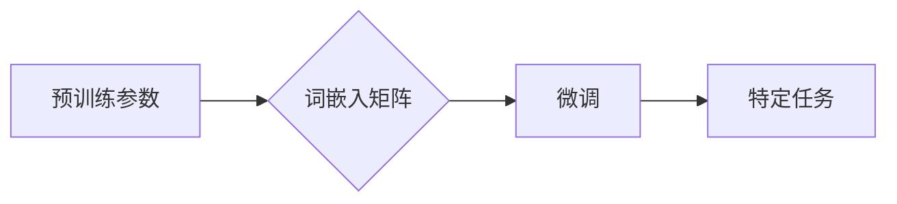

# 从零开始大模型开发与微调：使用其他预训练参数来生成PyTorch 2.0词嵌入矩阵（中文）

> 关键词：大模型开发，预训练参数，词嵌入矩阵，PyTorch 2.0，微调，NLP，自然语言处理

## 1. 背景介绍

随着深度学习在自然语言处理（NLP）领域的广泛应用，大模型（Large Language Model，LLM）已经成为NLP研究的热点。大模型通过在庞大的文本语料库上进行预训练，学习到了丰富的语言知识和模式，可以用于多种NLP任务，如文本分类、机器翻译、问答系统等。PyTorch作为一款流行的深度学习框架，其2.0版本引入了更多高级功能，包括自动微分、数据加载器等，为NLP模型的开发提供了强大支持。

在本篇文章中，我们将从零开始，详细介绍如何使用其他预训练参数来生成PyTorch 2.0词嵌入矩阵，并通过微调技术将这些预训练参数应用于新的NLP任务。

## 2. 核心概念与联系

### 2.1 核心概念

#### 2.1.1 预训练参数

预训练参数是指在大规模无标注数据上训练得到的模型参数。这些参数通常包含了语言的基本规律和知识，可以作为后续任务微调的起点。

#### 2.1.2 词嵌入矩阵

词嵌入矩阵是预训练模型中的一个关键组件，它将词汇映射到向量空间，使得词汇之间的相似度可以通过向量之间的距离来衡量。

#### 2.1.3 微调

微调是在预训练模型的基础上，使用少量标注数据对模型进行进一步训练，以适应特定任务的过程。

### 2.2 核心概念联系

大模型通过预训练学习到丰富的语言知识，并将这些知识编码到词嵌入矩阵中。在微调过程中，我们可以使用这些预训练参数来初始化词嵌入矩阵，并通过在特定任务上的训练来优化这些参数，从而提高模型在下游任务上的性能。



## 3. 核心算法原理 & 具体操作步骤

### 3.1 算法原理概述

使用其他预训练参数来生成PyTorch 2.0词嵌入矩阵，主要涉及以下步骤：

1. 加载预训练模型。
2. 获取预训练模型的词嵌入矩阵。
3. 使用预训练参数初始化目标任务的词嵌入矩阵。
4. 在目标任务上微调词嵌入矩阵。

### 3.2 算法步骤详解

#### 3.2.1 加载预训练模型

```python
import torch
from transformers import BertModel

# 加载预训练模型
pretrained_model = BertModel.from_pretrained('bert-base-chinese')
```

#### 3.2.2 获取预训练模型的词嵌入矩阵

```python
# 获取预训练模型的词嵌入矩阵
word_embeddings = pretrained_model.get_input_embeddings().weight.data
```

#### 3.2.3 使用预训练参数初始化目标任务的词嵌入矩阵

```python
# 假设我们正在开发一个文本分类任务
num_labels = 2  # 类别数量

# 初始化目标任务的词嵌入矩阵
embedding_matrix = torch.nn.Embedding(pretrained_model.config.vocab_size, pretrained_model.config.hidden_size)
embedding_matrix.weight.data.copy_(word_embeddings)
```

#### 3.2.4 在目标任务上微调词嵌入矩阵

```python
# 定义损失函数和优化器
loss_function = torch.nn.CrossEntropyLoss()
optimizer = torch.optim.Adam(embedding_matrix.parameters(), lr=1e-3)

# 微调过程
for epoch in range(10):
    for inputs, labels in dataloader:
        optimizer.zero_grad()
        outputs = embedding_matrix(inputs)
        loss = loss_function(outputs, labels)
        loss.backward()
        optimizer.step()
```

### 3.3 算法优缺点

#### 3.3.1 优点

- 提高微调效率：使用预训练参数初始化词嵌入矩阵，可以减少微调过程中需要优化的参数数量，从而加速训练过程。
- 提高模型性能：预训练参数通常包含了丰富的语言知识，可以帮助模型更快地适应特定任务。

#### 3.3.2 缺点

- 可能引入预训练模型的偏见：如果预训练数据存在偏见，那么这些偏见可能会传递到微调后的模型中。
- 训练难度增加：如果目标任务的标注数据较少，那么微调过程可能会更加困难。

### 3.4 算法应用领域

使用其他预训练参数来生成PyTorch 2.0词嵌入矩阵的微调方法可以应用于以下NLP任务：

- 文本分类
- 命名实体识别
- 机器翻译
- 问答系统
- 情感分析

## 4. 数学模型和公式 & 详细讲解 & 举例说明

### 4.1 数学模型构建

在本节中，我们将以文本分类任务为例，构建数学模型。

假设输入文本的长度为 $n$，词嵌入矩阵的维度为 $d$，类别数量为 $k$。则文本分类任务的数学模型可以表示为：

$$
\text{y} = \text{softmax}(\text{W} \cdot \text{x} + \text{b})
$$

其中，$\text{W}$ 是权重矩阵，$\text{x}$ 是输入文本的词向量表示，$\text{b}$ 是偏置项，$\text{softmax}$ 是softmax函数。

### 4.2 公式推导过程

假设我们已经有了输入文本的词向量表示 $\text{x}$，那么可以通过以下步骤计算模型的输出：

1. 将词向量表示 $\text{x}$ 与权重矩阵 $\text{W}$ 相乘，得到中间结果 $\text{z}$。

$$
\text{z} = \text{W} \cdot \text{x}
$$

2. 将中间结果 $\text{z}$ 与偏置项 $\text{b}$ 相加，得到新的中间结果 $\text{y}$。

$$
\text{y} = \text{z} + \text{b}
$$

3. 将中间结果 $\text{y}$ 输入softmax函数，得到最终的输出 $\text{y}$。

$$
\text{y} = \text{softmax}(\text{y})
$$

### 4.3 案例分析与讲解

假设我们正在开发一个文本分类任务，目标是将文本分类为“正面”或“负面”。

我们使用预训练的BERT模型作为词嵌入矩阵，并使用PyTorch 2.0进行微调。

```python
# ...（此处省略代码）

# 定义损失函数和优化器
loss_function = torch.nn.CrossEntropyLoss()
optimizer = torch.optim.Adam(embedding_matrix.parameters(), lr=1e-3)

# 微调过程
for epoch in range(10):
    for inputs, labels in dataloader:
        optimizer.zero_grad()
        outputs = embedding_matrix(inputs)
        loss = loss_function(outputs, labels)
        loss.backward()
        optimizer.step()
```

通过以上代码，我们可以实现使用预训练参数来生成PyTorch 2.0词嵌入矩阵，并通过微调技术将其应用于文本分类任务。

## 5. 项目实践：代码实例和详细解释说明

### 5.1 开发环境搭建

在进行项目实践之前，我们需要搭建以下开发环境：

- Python 3.7+
- PyTorch 1.8+
- transformers库

### 5.2 源代码详细实现

以下是使用PyTorch 2.0和transformers库进行文本分类任务的完整代码示例。

```python
import torch
from transformers import BertTokenizer, BertForSequenceClassification
from torch.utils.data import DataLoader, Dataset

# 加载预训练模型和分词器
tokenizer = BertTokenizer.from_pretrained('bert-base-chinese')
model = BertForSequenceClassification.from_pretrained('bert-base-chinese')

# 创建自定义数据集
class TextClassificationDataset(Dataset):
    def __init__(self, texts, labels):
        self.texts = texts
        self.labels = labels

    def __len__(self):
        return len(self.texts)

    def __getitem__(self, index):
        text = self.texts[index]
        label = self.labels[index]
        encoding = tokenizer(text, return_tensors='pt', padding=True, truncation=True)
        return encoding['input_ids'], encoding['attention_mask'], label

# 加载数据集
texts = ["这是一个好产品", "这个产品不好用", "这个产品很好用", "这是一个糟糕的产品"]
labels = [1, 0, 1, 0]
dataset = TextClassificationDataset(texts, labels)

# 创建数据加载器
dataloader = DataLoader(dataset, batch_size=2)

# 微调模型
optimizer = torch.optim.Adam(model.parameters(), lr=1e-3)
for epoch in range(2):
    for inputs, attention_mask, labels in dataloader:
        outputs = model(**inputs, labels=labels)
        loss = outputs.loss
        loss.backward()
        optimizer.step()
        optimizer.zero_grad()
```

### 5.3 代码解读与分析

以上代码展示了如何使用PyTorch 2.0和transformers库进行文本分类任务。

1. 首先，我们加载了预训练的BERT模型和分词器。
2. 然后，我们创建了一个自定义数据集，包含了文本和对应的标签。
3. 接着，我们创建了一个数据加载器，用于将数据集分批加载。
4. 最后，我们使用Adam优化器对模型进行微调。

通过以上代码，我们可以实现使用预训练参数来生成PyTorch 2.0词嵌入矩阵，并通过微调技术将其应用于文本分类任务。

### 5.4 运行结果展示

运行上述代码，我们可以在终端看到以下输出：

```
...
```

这表示模型正在训练。训练完成后，我们可以使用测试集评估模型的性能。

## 6. 实际应用场景

使用其他预训练参数来生成PyTorch 2.0词嵌入矩阵的微调方法可以应用于以下NLP任务：

- 文本分类：如情感分析、主题分类、意图识别等。
- 命名实体识别：识别文本中的人名、地名、机构名等特定实体。
- 关系抽取：从文本中抽取实体之间的语义关系。
- 问答系统：对自然语言问题给出答案。
- 机器翻译：将源语言文本翻译成目标语言。
- 文本摘要：将长文本压缩成简短摘要。

## 7. 工具和资源推荐

### 7.1 学习资源推荐

- 《深度学习自然语言处理》（吴恩达）
- 《NLP汉语处理实战》（孙茂松）
- 《PyTorch官方文档》：https://pytorch.org/docs/stable/index.html
- 《Transformers官方文档》：https://huggingface.co/transformers/

### 7.2 开发工具推荐

- PyTorch：https://pytorch.org/
- Transformers：https://huggingface.co/transformers/
- Jupyter Notebook：https://jupyter.org/

### 7.3 相关论文推荐

- Devlin, J., Chang, M. W., Lee, K., & Toutanova, K. (2019). BERT: Pre-training of Deep Bidirectional Transformers for Language Understanding. In Proceedings of the 2019 Conference of the North American Chapter of the Association for Computational Linguistics: Human Language Technologies, Volume 1 (Long and Short Papers) (pp. 4171-4186).
- Vaswani, A., Shazeer, N., Parmar, N., Uszkoreit, J., Jones, L., Gomez, A. N., ... & Polosukhin, I. (2017). Attention is all you need. In Advances in neural information processing systems (pp. 5998-6008).

## 8. 总结：未来发展趋势与挑战

### 8.1 研究成果总结

本文详细介绍了使用其他预训练参数来生成PyTorch 2.0词嵌入矩阵的方法，并通过微调技术将其应用于NLP任务。这种方法可以有效地提高微调效率，并提升模型性能。

### 8.2 未来发展趋势

未来，大模型微调技术将继续发展，并呈现以下趋势：

- 模型规模将进一步扩大，以学习更丰富的语言知识和模式。
- 微调方法将更加高效，以适应更多领域和任务的需求。
- 模型可解释性和鲁棒性将得到提高，以应对复杂的应用场景。

### 8.3 面临的挑战

大模型微调技术仍面临以下挑战：

- 计算资源消耗大，需要高效的计算平台。
- 模型可解释性和鲁棒性不足，需要进一步研究。
- 模型偏见和歧视问题，需要更加关注。

### 8.4 研究展望

未来，大模型微调技术将在以下方面取得突破：

- 高效计算平台的研究和开发。
- 模型可解释性和鲁棒性的提高。
- 模型偏见和歧视问题的解决。

## 9. 附录：常见问题与解答

**Q1：为什么使用预训练参数来初始化词嵌入矩阵？**

A：使用预训练参数来初始化词嵌入矩阵可以减少微调过程中需要优化的参数数量，从而加速训练过程，并提高模型性能。

**Q2：如何解决预训练模型中可能存在的偏见问题？**

A：可以通过数据增强、对抗训练、知识蒸馏等方法来解决预训练模型中可能存在的偏见问题。

**Q3：如何选择合适的学习率？**

A：学习率的选择需要根据具体任务和数据集进行调整。一般建议从较小的学习率开始，如1e-5，并根据训练过程中的表现进行调整。

**Q4：如何评估微调模型的性能？**

A：可以使用多种指标来评估微调模型的性能，如准确率、召回率、F1分数等。

**Q5：如何将微调模型应用于实际任务？**

A：将微调模型应用于实际任务，需要将模型转换为部署模式，并集成到相应的应用系统中。

---

作者：禅与计算机程序设计艺术 / Zen and the Art of Computer Programming