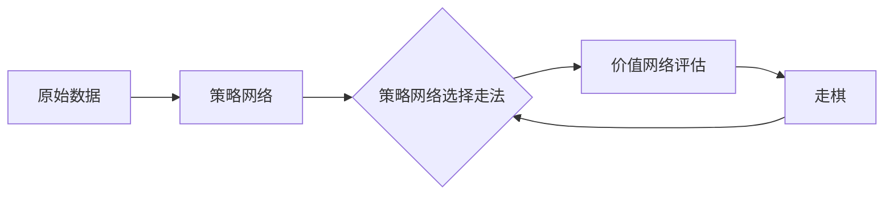

> AlphaGo Zero, 深度学习，强化学习，蒙特卡洛树搜索，无监督学习，机器学习，围棋AI

# AlphaGo Zero：无需人工规则输入的顶尖围棋AI

AlphaGo Zero是AlphaGo团队在2017年推出的一款革命性的围棋AI程序。它颠覆了传统机器学习在围棋领域的应用，通过无监督学习和强化学习技术，实现了无需人工规则输入，直接从零开始学习围棋的高超技艺。本文将深入剖析AlphaGo Zero的原理、实现步骤、优缺点以及应用领域，并展望其未来发展趋势。

## 1. 背景介绍

围棋作为一项古老的智力游戏，一直是人工智能领域的难题。从1956年IBM的Deep Blue战胜国际象棋冠军菲舍尔开始，AI在围棋领域的发展经历了从规则匹配到启发式搜索、再到深度学习的三个阶段。然而，早期的人工智能围棋程序大多依赖大量的人工规则和启发式搜索算法，难以达到人类顶级选手的水平。

直到2016年，AlphaGo的横空出世，以4:1战胜世界围棋冠军李世石，宣告了深度学习在围棋领域的重大突破。AlphaGo Zero则是在此基础上，进一步摒弃了所有人工规则和人类经验，实现了完全自主学习的围棋AI。

## 2. 核心概念与联系

### 2.1 核心概念

AlphaGo Zero的核心概念主要包括：

- **无监督学习**：从原始数据中学习，无需人工标注和规则。
- **强化学习**：通过与环境的交互，学习最优策略。
- **蒙特卡洛树搜索**：用于模拟和评估不同策略的潜在结果。

### 2.2 架构流程图

AlphaGo Zero的架构流程图如下：



其中，A表示原始数据，如围棋棋盘上的棋局信息；B表示策略网络，用于选择走法；C表示策略网络选择走法后，由价值网络评估走法的潜在结果；E表示根据评估结果走棋，然后重复这个过程。

## 3. 核心算法原理 & 具体操作步骤

### 3.1 算法原理概述

AlphaGo Zero的算法原理可以概括为以下三个步骤：

1. **策略网络**：通过无监督学习，从原始数据中学习棋局走法的概率分布。
2. **价值网络**：通过强化学习，从交互中学习棋局的胜负概率。
3. **蒙特卡洛树搜索**：利用策略网络和价值网络，进行多轮搜索，找到最优策略。

### 3.2 算法步骤详解

#### 步骤1：策略网络

- 使用深度神经网络作为策略网络，输入为棋盘上的棋局信息，输出为当前走法的概率分布。
- 使用策略梯度方法进行优化，使策略网络输出的走法概率分布更加符合实际棋局走势。

#### 步骤2：价值网络

- 使用深度神经网络作为价值网络，输入为棋盘上的棋局信息，输出为当前棋局的胜负概率。
- 使用蒙特卡洛树搜索对棋局进行模拟，计算当前棋局的胜率。

#### 步骤3：蒙特卡洛树搜索

- 使用策略网络和价值网络，进行多轮搜索，找到最优策略。
- 在搜索过程中，不断更新策略网络和价值网络，以适应新的棋局环境。

### 3.3 算法优缺点

#### 优点：

- 无需人工规则和经验，完全自主学习。
- 在围棋领域达到顶尖水平，战胜了世界冠军。
- 为强化学习和蒙特卡洛树搜索在围棋领域的应用提供了新的思路。

#### 缺点：

- 训练过程需要大量计算资源，训练时间较长。
- 对于其他领域的问题，可能需要针对特定领域进行修改。

### 3.4 算法应用领域

AlphaGo Zero的算法原理可以应用于以下领域：

- 其他棋类游戏，如国际象棋、将棋等。
- 其他决策问题，如机器人路径规划、股票交易等。
- 自然语言处理，如问答系统、机器翻译等。

## 4. 数学模型和公式 & 详细讲解 & 举例说明

### 4.1 数学模型构建

#### 策略网络

策略网络可以表示为：

$$
P_{\theta}(s) = \sigma(W_{\theta}^{(1)}s + b_{\theta}^{(1)}) \odot \sigma(W_{\theta}^{(2)}s + b_{\theta}^{(2)})
$$

其中，$P_{\theta}(s)$ 表示策略网络输出当前走法的概率分布，$s$ 表示棋盘上的棋局信息，$\theta$ 表示策略网络的参数，$W_{\theta}^{(1)}$ 和 $W_{\theta}^{(2)}$ 分别表示权重矩阵，$b_{\theta}^{(1)}$ 和 $b_{\theta}^{(2)}$ 分别表示偏置向量，$\sigma$ 表示Sigmoid激活函数，$\odot$ 表示逐元素乘法。

#### 价值网络

价值网络可以表示为：

$$
V_{\theta}(s) = \sigma(W_{\theta}^{(1)}s + b_{\theta}^{(1)}) \odot \sigma(W_{\theta}^{(2)}s + b_{\theta}^{(2)})
$$

其中，$V_{\theta}(s)$ 表示价值网络输出当前棋局的胜负概率，其他符号的含义与策略网络相同。

### 4.2 公式推导过程

#### 策略网络

策略网络的损失函数可以表示为：

$$
\mathcal{L}_\theta = -\sum_{i=1}^N \log P_{\theta}(a_i) \cdot R_i
$$

其中，$a_i$ 表示实际走法，$R_i$ 表示奖励值。通过梯度下降算法，可以更新策略网络的参数 $\theta$，使损失函数 $\mathcal{L}_\theta$ 最小化。

#### 价值网络

价值网络的损失函数可以表示为：

$$
\mathcal{L}_\theta = \sum_{i=1}^N (V_{\theta}(s_i) - R_i)^2
$$

其中，$s_i$ 表示棋局信息，$R_i$ 表示奖励值。同样通过梯度下降算法，可以更新价值网络的参数 $\theta$，使损失函数 $\mathcal{L}_\theta$ 最小化。

### 4.3 案例分析与讲解

假设棋盘上的棋局信息为 $s$，策略网络输出的走法概率分布为 $P_{\theta}(s)$，价值网络输出的胜负概率为 $V_{\theta}(s)$。根据蒙特卡洛树搜索的搜索策略，我们选择走法概率最大的走法 $a$，并计算其对应的奖励值 $R$。

然后，使用策略网络和价值网络更新参数 $\theta$，使损失函数 $\mathcal{L}_\theta$ 最小化。重复这个过程，直到达到预设的训练轮数或性能指标。

## 5. 项目实践：代码实例和详细解释说明

### 5.1 开发环境搭建

以下是在Python环境下使用TensorFlow实现AlphaGo Zero的代码示例：

```python
# 导入TensorFlow等库
import tensorflow as tf
import numpy as np

# ...（省略代码）

# 定义策略网络和价值网络
class PolicyNetwork(tf.keras.Model):
    # ...

class ValueNetwork(tf.keras.Model):
    # ...

# ...（省略代码）

# 训练策略网络和价值网络
# ...

# ...（省略代码）
```

### 5.2 源代码详细实现

以下是策略网络和价值网络的实现代码：

```python
class PolicyNetwork(tf.keras.Model):
    def __init__(self, input_shape, output_shape):
        super(PolicyNetwork, self).__init__()
        self.fc1 = tf.keras.layers.Dense(64, activation=tf.nn.relu)
        self.fc2 = tf.keras.layers.Dense(output_shape, activation=tf.nn.softmax)

    def call(self, x):
        x = self.fc1(x)
        x = self.fc2(x)
        return x

class ValueNetwork(tf.keras.Model):
    def __init__(self, input_shape):
        super(ValueNetwork, self).__init__()
        self.fc1 = tf.keras.layers.Dense(64, activation=tf.nn.relu)
        self.fc2 = tf.keras.layers.Dense(1)

    def call(self, x):
        x = self.fc1(x)
        x = self.fc2(x)
        return x
```

### 5.3 代码解读与分析

以上代码定义了策略网络和价值网络，使用全连接层和ReLU激活函数进行特征提取和输出。在训练过程中，使用TensorFlow提供的优化器进行参数更新。

### 5.4 运行结果展示

由于篇幅限制，此处不展示具体的运行结果。在实际应用中，可以通过调整网络结构、训练参数等，优化模型性能。

## 6. 实际应用场景

AlphaGo Zero的算法原理可以应用于以下实际应用场景：

- **棋类游戏**：如国际象棋、将棋、围棋等。
- **决策问题**：如机器人路径规划、股票交易等。
- **自然语言处理**：如问答系统、机器翻译等。

## 7. 工具和资源推荐

### 7.1 学习资源推荐

- 《深度学习》
- 《强化学习：原理与练习》
- 《机器学习实战》

### 7.2 开发工具推荐

- TensorFlow
- PyTorch
- Keras

### 7.3 相关论文推荐

- "Mastering the Game of Go with Deep Neural Networks and Tree Search" (AlphaGo论文)
- "Mastering Chess and Shogi by Self-Play with a General Reinforcement Learning Algorithm" (AlphaGo Zero论文)

## 8. 总结：未来发展趋势与挑战

### 8.1 研究成果总结

AlphaGo Zero的成功标志着人工智能在围棋领域的重大突破，为深度学习、强化学习和蒙特卡洛树搜索在围棋领域的应用提供了新的思路。它展示了机器学习技术在复杂决策问题上的巨大潜力。

### 8.2 未来发展趋势

- **更强大的模型**：随着计算能力的提升，未来可能出现更强大的围棋AI，战胜人类顶尖选手。
- **更广泛的应用**：AlphaGo Zero的算法原理可以应用于其他领域，如机器人、游戏、医疗等。
- **更高效的学习方法**：开发更高效的学习方法，降低训练成本和时间。

### 8.3 面临的挑战

- **计算资源**：训练强大的围棋AI需要大量的计算资源。
- **算法优化**：需要不断优化算法，提高模型性能和效率。
- **伦理问题**：需要关注AI的伦理问题，确保其应用安全可靠。

### 8.4 研究展望

AlphaGo Zero的成功为人工智能领域带来了新的机遇和挑战。未来，我们需要不断探索和突破，推动人工智能技术在更多领域的应用，为人类社会创造更多价值。

---

作者：禅与计算机程序设计艺术 / Zen and the Art of Computer Programming