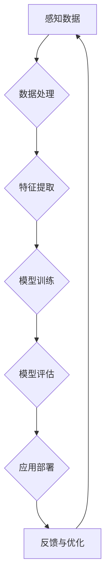

# Andrej Karpathy：人工智能的未来发展机遇

> 关键词：Andrej Karpathy，人工智能，机器学习，深度学习，自然语言处理，计算机视觉，自动驾驶，未来趋势

## 1. 背景介绍

Andrej Karpathy 是一位杰出的计算机科学家，以其在深度学习、自然语言处理和计算机视觉领域的贡献而闻名。他在斯坦福大学的博士学位研究涉及使用神经网络进行文本分类，并在 OpenAI 工作了多年，参与了诸如 GPT-3 这样的突破性项目。本文将探讨 Andrej Karpathy 的观点，分析人工智能的未来发展机遇，并探讨该领域可能面临的挑战。

## 2. 核心概念与联系

### 2.1 核心概念原理和架构的 Mermaid 流程图



### 2.2 核心概念解释

- **感知数据**：人工智能系统的输入，可以是文本、图像、音频或任何其他形式的数据。
- **数据处理**：将原始数据转换为适合模型处理的格式。
- **特征提取**：从数据中提取有用的信息，用于训练模型。
- **模型训练**：使用算法和计算资源训练模型，使其能够学习数据和模式。
- **模型评估**：评估模型的性能，确保其准确性和泛化能力。
- **应用部署**：将模型部署到实际应用中，如自动驾驶汽车、智能客服等。
- **反馈与优化**：收集用户反馈，不断优化模型和系统。

## 3. 核心算法原理 & 具体操作步骤

### 3.1 算法原理概述

人工智能的核心是机器学习，特别是深度学习。深度学习使用多层神经网络来学习数据中的复杂模式。以下是一些常用的深度学习算法：

- **监督学习**：使用标注数据进行训练，如分类和回归。
- **无监督学习**：使用无标注数据进行训练，如聚类和降维。
- **强化学习**：通过奖励和惩罚来训练模型，使其能够做出最优决策。

### 3.2 算法步骤详解

1. **数据收集**：收集大量的数据，包括标注数据和无标注数据。
2. **数据预处理**：清洗、标准化和转换数据。
3. **特征工程**：提取有用的特征，用于训练模型。
4. **模型选择**：选择合适的模型架构，如卷积神经网络（CNN）、循环神经网络（RNN）或生成对抗网络（GAN）。
5. **模型训练**：使用计算资源训练模型，如GPU或TPU。
6. **模型评估**：使用测试集评估模型性能。
7. **模型优化**：根据评估结果调整模型参数。
8. **应用部署**：将模型部署到实际应用中。

### 3.3 算法优缺点

- **优点**：
  - 高度自动化的数据处理和特征提取。
  - 能够学习非常复杂的数据模式。
  - 在许多任务中取得了优异的性能。
- **缺点**：
  - 需要大量的数据和计算资源。
  - 模型可能难以解释。
  - 训练过程可能需要很长时间。

### 3.4 算法应用领域

- **自然语言处理**：文本分类、机器翻译、情感分析。
- **计算机视觉**：图像识别、物体检测、图像生成。
- **语音识别**：语音到文本、语音合成。
- **自动驾驶**：环境感知、决策制定、路径规划。
- **医疗诊断**：疾病检测、诊断建议。

## 4. 数学模型和公式 & 详细讲解 & 举例说明

### 4.1 数学模型构建

深度学习模型通常基于以下数学模型：

- **神经网络**：由多个神经元组成的层次结构，用于学习数据中的模式。
- **激活函数**：用于引入非线性，使模型能够学习更复杂的模式。
- **损失函数**：用于衡量模型预测值与真实值之间的差异。

### 4.2 公式推导过程

以下是一个简单的神经网络公式示例：

$$
y = f(z) = \sigma(W \cdot x + b)
$$

其中 $y$ 是模型的输出，$z$ 是线性组合的输入，$W$ 是权重矩阵，$b$ 是偏置项，$\sigma$ 是激活函数。

### 4.3 案例分析与讲解

假设我们有一个简单的文本分类任务，我们需要将文本分类为“正面”或“负面”。我们可以使用以下步骤：

1. 收集并预处理文本数据。
2. 使用词袋模型或TF-IDF将文本转换为向量。
3. 选择一个合适的神经网络架构，如卷积神经网络（CNN）。
4. 训练神经网络，使用交叉熵损失函数。
5. 评估模型性能，调整超参数。

## 5. 项目实践：代码实例和详细解释说明

### 5.1 开发环境搭建

为了进行人工智能项目，我们需要以下开发环境：

- **编程语言**：Python
- **深度学习框架**：TensorFlow或PyTorch
- **计算资源**：GPU或TPU

### 5.2 源代码详细实现

以下是一个使用TensorFlow进行文本分类的简单代码示例：

```python
import tensorflow as tf
from tensorflow.keras.models import Sequential
from tensorflow.keras.layers import Embedding, GlobalAveragePooling1D, Dense, Dropout

# 假设我们有一个包含正面和负面评论的数据集
train_texts = [...]
train_labels = [...]
test_texts = [...]
test_labels = [...]

# 将文本转换为向量
tokenizer = tf.keras.preprocessing.text.Tokenizer(...)
tokenizer.fit_on_texts(train_texts)
train_sequences = tokenizer.texts_to_sequences(train_texts)
test_sequences = tokenizer.texts_to_sequences(test_texts)

# 构建模型
model = Sequential([
    Embedding(input_dim=vocab_size, output_dim=embedding_dim, input_length=max_length),
    GlobalAveragePooling1D(),
    Dense(24, activation='relu'),
    Dropout(0.5),
    Dense(2, activation='softmax')
])

# 编译模型
model.compile(optimizer='adam', loss='sparse_categorical_crossentropy', metrics=['accuracy'])

# 训练模型
model.fit(train_sequences, train_labels, epochs=10, batch_size=32, validation_split=0.2)

# 评估模型
model.evaluate(test_sequences, test_labels)
```

### 5.3 代码解读与分析

上述代码展示了如何使用TensorFlow和Keras构建一个简单的文本分类模型。首先，我们使用Tokenizer将文本转换为向量。然后，我们构建一个简单的卷积神经网络，其中包含嵌入层、全局平均池化层、全连接层和dropout层。最后，我们编译和训练模型，并在测试集上评估其性能。

## 6. 实际应用场景

人工智能技术已经广泛应用于各种实际场景，以下是一些例子：

- **智能客服**：使用自然语言处理技术，自动回答客户问题。
- **自动驾驶**：使用计算机视觉和机器学习技术，使汽车能够自动驾驶。
- **医疗诊断**：使用人工智能技术辅助医生进行诊断。
- **金融分析**：使用人工智能技术进行风险评估和股票交易。

## 7. 工具和资源推荐

### 7.1 学习资源推荐

- **书籍**：
  - "Deep Learning" by Ian Goodfellow, Yoshua Bengio, and Aaron Courville
  - "Python Machine Learning" by Sebastian Raschka and Vahid Mirjalili
- **在线课程**：
  - Coursera: Machine Learning Specialization by Andrew Ng
  - Udacity: Deep Learning Nanodegree
- **博客和论坛**：
  - Medium: AI Hype vs Reality
  - Reddit: r/MachineLearning

### 7.2 开发工具推荐

- **深度学习框架**：
  - TensorFlow
  - PyTorch
- **数据集**：
  - Kaggle
  - UCI Machine Learning Repository
- **云服务**：
  - Google Cloud AI
  - AWS AI

### 7.3 相关论文推荐

- "A Theoretical Analysis of the VAE" by Kingma and Welling
- "Generative Adversarial Nets" by Goodfellow et al.
- "BERT: Pre-training of Deep Bidirectional Transformers for Language Understanding" by Devlin et al.

## 8. 总结：未来发展趋势与挑战

### 8.1 研究成果总结

人工智能领域已经取得了显著的进展，包括深度学习、自然语言处理和计算机视觉。这些技术的应用已经渗透到各个领域，并为人类社会带来了巨大的变革。

### 8.2 未来发展趋势

- **更强大的模型**：随着计算能力的提升，我们将能够训练更强大的模型，学习更复杂的数据模式。
- **更高效的方法**：开发更高效的学习和推理算法，降低计算和存储成本。
- **更广泛的领域**：人工智能将在更多领域得到应用，如医疗、教育、能源等。

### 8.3 面临的挑战

- **数据隐私**：如何保护用户数据隐私是一个重要挑战。
- **伦理道德**：人工智能的决策过程可能存在偏见，需要制定相应的伦理规范。
- **安全性和可靠性**：确保人工智能系统的安全性和可靠性是一个重要问题。

### 8.4 研究展望

人工智能的未来充满机遇和挑战。我们需要继续推动技术创新，同时关注伦理道德和社会影响。只有这样，人工智能才能真正为人类社会带来福祉。

## 9. 附录：常见问题与解答

**Q1：人工智能是否会取代人类工作？**

A：人工智能可能会取代一些重复性和危险的工作，但也会创造新的工作机会。重要的是，我们需要培养适应未来工作需求的新技能。

**Q2：人工智能是否会变得危险？**

A：人工智能本身没有意识，但它可能会产生不可预测的行为。我们需要制定相应的安全措施，确保人工智能系统的安全性和可靠性。

**Q3：人工智能如何影响社会？**

A：人工智能将改变我们的生活方式、工作方式和决策方式。我们需要积极适应这些变化，并确保人工智能的发展造福人类社会。

作者：禅与计算机程序设计艺术 / Zen and the Art of Computer Programming