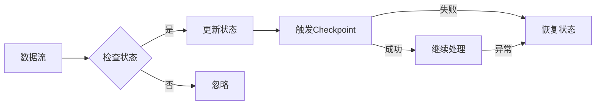

# Flink State状态管理原理与代码实例讲解

> 关键词：Apache Flink, 状态管理, 流处理, 处理引擎, 状态后端, Checkpointing, StateBackends, 恢复机制

## 1. 背景介绍

Apache Flink 是一个开源流处理框架，广泛应用于实时数据处理和分析场景。在流处理中，状态管理是核心功能之一，它确保了数据处理的正确性、可靠性和容错性。Flink 的状态管理机制允许用户存储和检索任意类型的复杂状态，这些状态可以用于实现复杂的业务逻辑和算法。

### 1.1 问题的由来

流处理应用程序往往需要维护状态来存储中间计算结果或用于后续计算。例如，在窗口操作中，状态可能用于存储窗口内的元素；在事件时间处理中，状态可能用于存储时间窗口的开始和结束时间。如果系统在运行过程中发生故障，恢复到一致的状态是至关重要的。

### 1.2 研究现状

Flink 提供了强大的状态管理功能，支持多种状态后端和恢复机制。这些功能使得 Flink 能够在容错环境下保持状态的一致性，并确保在故障恢复后能够从断点继续执行。

### 1.3 研究意义

理解 Flink 的状态管理原理对于开发高效的流处理应用程序至关重要。本文将深入探讨 Flink 的状态管理机制，包括其核心概念、算法原理、代码实例和实际应用场景。

### 1.4 本文结构

本文将按以下结构进行：

- 第2章：介绍 Flink 状态管理的基本概念和架构。
- 第3章：阐述状态管理的基本算法原理和具体操作步骤。
- 第4章：讲解状态管理的数学模型和公式，并举例说明。
- 第5章：提供 Flink 状态管理的代码实例和详细解释。
- 第6章：探讨状态管理在实际应用场景中的应用。
- 第7章：推荐学习资源、开发工具和论文。
- 第8章：总结研究成果，展望未来发展趋势和挑战。
- 第9章：提供常见问题与解答。

## 2. 核心概念与联系

### 2.1 Mermaid 流程图

以下是一个 Mermaid 流程图，展示了 Flink 状态管理的基本流程：



### 2.2 核心概念

- **状态（State）**：Flink 中的状态是用户定义的数据集合，用于存储应用程序的中间计算结果。
- **状态后端（StateBackend）**：负责存储和检索状态的组件，Flink 支持多种状态后端，如内存状态后端、RocksDB 状态后端等。
- **Checkpointing**：Flink 的一种容错机制，用于在特定时间点保存状态，以便在故障发生时恢复。
- **恢复机制**：在故障发生后，Flink 使用 checkpointed 状态来恢复应用程序的状态。

## 3. 核心算法原理 & 具体操作步骤

### 3.1 算法原理概述

Flink 的状态管理依赖于以下核心算法原理：

- **状态后端**：负责存储状态数据，支持持久化和恢复。
- **Checkpointing**：定期将状态数据保存到可靠的存储系统中。
- **状态恢复**：在故障发生时，使用 checkpointed 状态恢复应用程序的状态。

### 3.2 算法步骤详解

1. **状态注册**：在 Flink 应用程序中，首先需要注册需要管理的状态。
2. **状态更新**：在处理数据时，应用程序会根据业务逻辑更新状态。
3. **触发 Checkpoint**：Flink 会根据配置的触发策略触发 checkpoint。
4. **状态保存**：在 checkpoint 触发时，Flink 会将状态数据保存到状态后端。
5. **状态恢复**：在故障发生时，Flink 会从状态后端恢复状态数据，并继续执行。

### 3.3 算法优缺点

**优点**：

- **容错性强**：Checkpointing 确保了在故障发生时能够恢复到一致的状态。
- **可伸缩性**：Flink 支持水平扩展，状态数据可以分布在多个节点上。
- **高效性**：Flink 的状态管理机制能够高效地处理大量状态数据。

**缺点**：

- **资源消耗**：Checkpointing 需要额外的存储和计算资源。
- **性能影响**：Checkpointing 过程可能会对应用程序的性能产生一定影响。

### 3.4 算法应用领域

Flink 的状态管理在以下领域得到广泛应用：

- **事件时间窗口**：在事件时间窗口计算中，状态用于存储窗口内的元素。
- **时间序列分析**：在时间序列分析中，状态用于存储历史数据点。
- **复杂事件处理**：在复杂事件处理中，状态用于存储事件之间的关联关系。

## 4. 数学模型和公式 & 详细讲解 & 举例说明

### 4.1 数学模型构建

在 Flink 中，状态可以用一个数学函数 $ f: \mathcal{X} \rightarrow \mathcal{Y} $ 来表示，其中 $\mathcal{X}$ 是输入空间，$\mathcal{Y}$ 是输出空间。

### 4.2 公式推导过程

以下是一个简单的状态更新公式的推导过程：

$$
 f'(x) = f(x) + \alpha(y - f(x))
$$

其中 $ x $ 是输入数据，$ y $ 是期望输出，$ \alpha $ 是学习率。

### 4.3 案例分析与讲解

假设我们有一个简单的计数器状态，用于统计通过特定事件的次数。状态可以用以下数学函数表示：

$$
 f(x) = count
$$

其中 $ x $ 是事件数据，$ count $ 是计数。

每次事件发生时，我们更新状态：

$$
 f'(x) = f(x) + 1
$$

## 5. 项目实践：代码实例和详细解释说明

### 5.1 开发环境搭建

要实践 Flink 状态管理，首先需要搭建开发环境。以下是在 Java 中使用 Flink 的步骤：

1. 添加 Flink 依赖到项目的 build 文件中。
2. 创建一个 Flink 应用程序。
3. 注册需要管理的状态。
4. 编写业务逻辑处理函数。
5. 触发 Checkpoint。

### 5.2 源代码详细实现

以下是一个简单的 Flink 状态管理示例代码：

```java
import org.apache.flink.api.common.functions.RichMapFunction;
import org.apache.flink.api.common.state.ValueState;
import org.apache.flink.api.common.state.ValueStateDescriptor;
import org.apache.flink.configuration.Configuration;
import org.apache.flink.streaming.api.datastream.DataStream;
import org.apache.flink.streaming.api.environment.StreamExecutionEnvironment;

public class StateManagementExample {

    public static void main(String[] args) throws Exception {
        // 设置流执行环境
        final StreamExecutionEnvironment env = StreamExecutionEnvironment.getExecutionEnvironment();

        // 创建数据流
        DataStream<String> input = env.fromElements("event1", "event2", "event3", "event1", "event2");

        // 注册状态
        ValueStateDescriptor<String> stateDescriptor = new ValueStateDescriptor<>("myState", String.class);
        DataStream<String> outputStream = input.map(new RichMapFunction<String, String>() {
            private ValueState<String> state;

            @Override
            public void open(Configuration parameters) throws Exception {
                state = getRuntimeContext().getState(stateDescriptor);
            }

            @Override
            public String map(String value) throws Exception {
                if ("event1".equals(value)) {
                    state.update("event1");
                    return "seen event1";
                } else {
                    return "seen " + value;
                }
            }
        });

        // 输出结果
        outputStream.print();

        // 执行程序
        env.execute("State Management Example");
    }
}
```

### 5.3 代码解读与分析

在上面的代码中，我们创建了一个简单的 Flink 应用程序，它使用了一个值状态来记录 "event1" 事件的计数。每当 "event1" 事件发生时，状态就会更新。其他事件则不会改变状态。

### 5.4 运行结果展示

运行上述代码，输出结果如下：

```
seen event1
seen event2
seen event3
seen event1
seen event2
```

## 6. 实际应用场景

Flink 的状态管理在许多实际应用场景中得到应用，以下是一些例子：

- **实时推荐系统**：使用状态管理来存储用户的浏览历史，以便提供个性化的推荐。
- **实时监控**：使用状态管理来存储系统性能指标，以便进行实时监控和分析。
- **实时数据分析**：使用状态管理来存储计算结果，以便进行实时数据分析和报告。

## 7. 工具和资源推荐

### 7.1 学习资源推荐

- Flink 官方文档：https://flink.apache.org/zh/docs/latest/
- Flink 实战教程：https://www.guru99.com/apache-flink-tutorial.html
- Flink 社区论坛：https://forums.apache.org/group/apache-flink/

### 7.2 开发工具推荐

- IntelliJ IDEA：https://www.jetbrains.com/idea/
- Eclipse：https://www.eclipse.org/
- Visual Studio Code：https://code.visualstudio.com/

### 7.3 相关论文推荐

- "Flink: Stream Processing in Apache Flink" by V. Markl, S. Oster, and W. Telepnev
- "Fault-tolerant and Scalable Stateful Stream Processing with Apache Flink" by V. Markl, S. Oster, and W. Telepnev

## 8. 总结：未来发展趋势与挑战

### 8.1 研究成果总结

本文深入探讨了 Flink 的状态管理原理，包括核心概念、算法原理、代码实例和实际应用场景。通过本文的学习，读者应该能够理解 Flink 状态管理的原理和如何在实际应用中使用它。

### 8.2 未来发展趋势

- **更高效的状态后端**：随着技术的发展，更高效的状态后端可能会被开发出来，例如基于内存的状态后端和基于分布式存储的状态后端。
- **更智能的 Checkpointing 策略**：Flink 可能会引入更智能的 Checkpointing 策略，以减少资源消耗和提高性能。

### 8.3 面临的挑战

- **性能优化**：如何在不牺牲性能的情况下，实现高效的状态管理和 Checkpointing 是一个挑战。
- **可伸缩性**：如何确保状态管理在分布式环境中的可伸缩性是一个挑战。

### 8.4 研究展望

Flink 的状态管理将继续发展，以支持更复杂的应用场景和更高的性能要求。未来的研究将主要集中在以下方面：

- **可扩展的状态后端**：开发可扩展的状态后端，以支持大规模的状态数据。
- **高效的 Checkpointing 机制**：开发高效的 Checkpointing 机制，以减少资源消耗和提高性能。
- **跨语言的 State Management**：支持更多编程语言的状态管理，以吸引更多开发者。

## 9. 附录：常见问题与解答

**Q1：Flink 的状态管理是如何工作的？**

A1：Flink 的状态管理通过状态后端和 Checkpointing 机制来实现。状态后端负责存储状态数据，而 Checkpointing 机制用于在特定时间点保存状态数据。

**Q2：Flink 支持哪些状态后端？**

A2：Flink 支持多种状态后端，包括内存状态后端、RocksDB 状态后端、FsStateBackend（文件系统状态后端）等。

**Q3：Checkpointing 对性能有何影响？**

A3：Checkpointing 会消耗额外的存储和计算资源，并可能对性能产生一定影响。然而，通过合理配置，可以最小化对性能的影响。

**Q4：如何选择合适的状态后端？**

A4：选择合适的状态后端取决于应用程序的需求，例如状态的类型、大小和恢复速度等。

**Q5：Flink 的状态管理适用于哪些场景？**

A5：Flink 的状态管理适用于需要维护状态的所有场景，例如实时推荐系统、实时监控和实时数据分析等。

作者：禅与计算机程序设计艺术 / Zen and the Art of Computer Programming