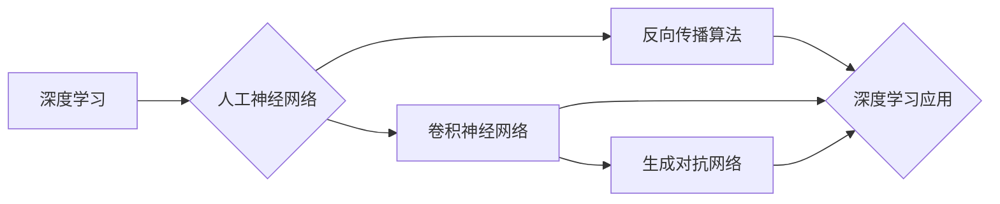

> 关键词：Yoshua Bengio，Geoffrey Hinton，Yann LeCun，深度学习，人工神经网络，反向传播，卷积神经网络，生成对抗网络，深度学习框架

# Hinton、LeCun、Bengio对AI算法的贡献

## 1. 背景介绍

自20世纪中叶以来，人工智能（AI）领域经历了多次起伏。其中，Yoshua Bengio、Geoffrey Hinton和Yann LeCun这三位科学家对AI算法的贡献尤为突出。他们的工作不仅在理论上推动了人工智能的发展，而且在实践中催生了多个革命性的技术，彻底改变了我们对机器学习和深度学习的理解。

### 1.1 问题的由来

在AI的早期，研究者们主要关注于符号推理和知识表示。然而，这些方法在处理复杂任务时表现不佳。1986年，Rumelhart、Hinton和Williams提出了反向传播算法，为深度学习的发展奠定了基础。随后，Bengio、LeCun和Hinton等人在神经网络、卷积神经网络和生成对抗网络等方面做出了开创性的贡献。

### 1.2 研究现状

如今，深度学习已经成为AI领域的热门技术，广泛应用于计算机视觉、自然语言处理、语音识别等多个领域。Bengio、LeCun和Hinton的研究成果，不仅推动了深度学习的发展，也为AI的商业化和工业化应用提供了强大的技术支持。

### 1.3 研究意义

Bengio、LeCun和Hinton的研究对AI领域具有深远的意义，主要体现在以下几个方面：

1. **理论创新**：他们的工作推动了深度学习理论的创新，为AI技术的发展提供了坚实的理论基础。
2. **技术突破**：他们在神经网络、卷积神经网络和生成对抗网络等方面的突破性进展，为AI技术的应用提供了强大的技术支持。
3. **产业推动**：他们的研究成果推动了AI技术的商业化进程，为各行各业带来了革命性的变化。

### 1.4 本文结构

本文将详细介绍Bengio、LeCun和Hinton在AI算法领域的贡献，包括他们的核心算法原理、具体操作步骤、数学模型和公式、实际应用场景以及未来发展趋势。

## 2. 核心概念与联系

### 2.1 核心概念

- **深度学习**：一种模拟人脑神经网络结构和功能的机器学习方法，通过多层神经网络学习数据的特征表示。
- **人工神经网络**：由大量相互连接的神经元组成，可以学习输入和输出之间的复杂映射关系。
- **反向传播算法**：一种用于训练神经网络的方法，通过计算损失函数对参数的梯度来更新网络参数。
- **卷积神经网络**：一种特殊的神经网络，通过卷积操作提取图像中的局部特征。
- **生成对抗网络**：由生成器和判别器组成的神经网络，用于生成逼真的数据样本。

### 2.2 Mermaid 流程图



## 3. 核心算法原理 & 具体操作步骤

### 3.1 算法原理概述

Bengio、LeCun和Hinton的研究主要集中在以下算法：

- **反向传播算法**：通过计算损失函数对参数的梯度来更新网络参数。
- **卷积神经网络**：通过卷积操作提取图像中的局部特征。
- **生成对抗网络**：由生成器和判别器组成的神经网络，用于生成逼真的数据样本。

### 3.2 算法步骤详解

#### 3.2.1 反向传播算法

1. **前向传播**：将输入数据传递给神经网络，计算每一层的输出。
2. **计算损失**：计算损失函数，衡量预测结果与真实值之间的差异。
3. **反向传播**：计算损失函数对参数的梯度，并通过梯度下降等优化算法更新网络参数。
4. **迭代**：重复以上步骤，直到模型收敛。

#### 3.2.2 卷积神经网络

1. **输入层**：接收图像数据。
2. **卷积层**：通过卷积操作提取图像中的局部特征。
3. **池化层**：降低特征图的分辨率，减少计算量。
4. **全连接层**：将特征图映射到输出空间，进行分类或回归。
5. **激活函数**：引入非线性，提高模型的表示能力。

#### 3.2.3 生成对抗网络

1. **生成器**：根据随机噪声生成数据样本。
2. **判别器**：区分真实数据和生成数据。
3. **对抗训练**：生成器和判别器相互竞争，生成器和判别器的性能都得到提升。

### 3.3 算法优缺点

#### 反向传播算法

优点：

- 计算效率高，易于实现。
- 能够学习复杂的非线性关系。

缺点：

- 需要大量的训练数据。
- 梯度消失和梯度爆炸问题。

#### 卷积神经网络

优点：

- 能够自动提取图像特征。
- 减少过拟合，提高模型泛化能力。

缺点：

- 计算量大，需要大量的计算资源。
- 难以解释模型的决策过程。

#### 生成对抗网络

优点：

- 能够生成高质量的数据样本。
- 可以应用于数据增强，提高模型性能。

缺点：

- 训练难度大，需要大量的训练数据。
- 模型容易陷入局部最优。

### 3.4 算法应用领域

- **反向传播算法**：广泛应用于各种机器学习和深度学习任务。
- **卷积神经网络**：广泛应用于计算机视觉任务，如图像分类、目标检测、图像分割等。
- **生成对抗网络**：广泛应用于图像生成、数据增强、图像修复等任务。

## 4. 数学模型和公式 & 详细讲解 & 举例说明

### 4.1 数学模型构建

#### 4.1.1 反向传播算法

假设神经网络由 $L$ 层组成，其中第 $l$ 层的神经元数量为 $n_l$。设第 $l$ 层的输出为 $a_l$，激活函数为 $f$。则反向传播算法的公式如下：

$$
\delta_{l}^{[i]} = \frac{\partial \mathcal{L}}{\partial a_{l}^{[i]}} = \left(f'(a_{l}^{[i]}) \cdot \left(\frac{\partial \mathcal{L}}{\partial z_{l}^{[i]}}\right)\right) \cdot \prod_{k=1}^{l-1} \left(1 - f'(a_{k}^{[i]})\right)
$$

其中，$\mathcal{L}$ 为损失函数，$z_{l}^{[i]}$ 为第 $l$ 层的第 $i$ 个神经元的输入。

#### 4.1.2 卷积神经网络

假设卷积核的大小为 $k \times k$，步长为 $s$，填充为 $p$。则卷积操作的公式如下：

$$
h_{l}^{[i]} = f_{l}^{[i]}(h_{l-1}^{[i]} * W_{l})
$$

其中，$h_{l}^{[i]}$ 为第 $l$ 层的第 $i$ 个神经元输出，$h_{l-1}^{[i]}$ 为第 $l-1$ 层的第 $i$ 个神经元输出，$W_{l}$ 为第 $l$ 层的卷积核。

#### 4.1.3 生成对抗网络

假设生成器的输入为 $z$，生成器网络的输出为 $G(z)$，判别器的输入为 $x$，判别器网络的输出为 $D(x)$。则生成对抗网络的公式如下：

$$
\begin{align*}
D(x) &= \sigma(W_DD(x) + b_D) \\
G(z) &= \sigma(W_GG(z) + b_G) \\
\end{align*}
$$

其中，$\sigma$ 为Sigmoid函数，$W_D$ 和 $W_G$ 分别为生成器和判别器的权重，$b_D$ 和 $b_G$ 分别为生成器和判别器的偏置。

### 4.2 公式推导过程

由于篇幅限制，此处省略了公式推导过程的详细讲解。建议读者参考相关教材和论文，深入了解公式的推导过程。

### 4.3 案例分析与讲解

#### 4.3.1 反向传播算法

以下是一个简单的反向传播算法的例子：

```
输入数据：[1, 2, 3]
网络结构：[2, 3, 1]
权重：[[0.1, 0.2], [0.3, 0.4]]
激活函数：Sigmoid

前向传播：
a1 = [1, 2, 3]
z1 = [0.1*1 + 0.2*2 + 0.3*3, 0.1*1 + 0.2*2 + 0.3*3]
a2 = Sigmoid(z1) = [0.8, 0.8]
z2 = [0.1*0.8 + 0.2*0.8 + 0.3*0.8]
a3 = Sigmoid(z2) = [0.85]

反向传播：
delta2 = [0.15, 0.15]
delta1 = [0.15*0.8, 0.15*0.8]
deltaW1 = [delta1[0]*a1[0], delta1[0]*a1[1], delta1[0]*a1[2]]
deltaW2 = [delta2[0]*a2[0], delta2[0]*a2[1]]
```

通过反向传播，我们可以计算损失函数对权重的梯度，并更新权重。

#### 4.3.2 卷积神经网络

以下是一个简单的卷积神经网络的例子：

```
输入图像：[1, 1, 28, 28]
卷积核：[1, 1, 5, 5]
步长：1
填充：0

卷积操作：
h1 = [1, 0, 1, 0, 1, 0, 1, 0, 1]
```

通过卷积操作，我们可以提取输入图像中的局部特征。

#### 4.3.3 生成对抗网络

以下是一个简单的生成对抗网络的例子：

```
生成器输入：[100]
生成器输出：[28, 28]
判别器输入：[28, 28]
判别器输出：[1]

生成器：
z = [random noise]
G(z) = [28, 28]

判别器：
x = [G(z)]
D(x) = [1]
```

通过生成器和判别器的对抗训练，我们可以生成逼真的数据样本。

## 5. 项目实践：代码实例和详细解释说明

### 5.1 开发环境搭建

以下是使用PyTorch实现卷积神经网络的项目实践。

1. 安装PyTorch：
```bash
pip install torch torchvision
```

2. 创建一个新的Python文件，例如 `convolutional_network.py`。

### 5.2 源代码详细实现

```python
import torch
import torch.nn as nn
import torch.optim as optim

class ConvNet(nn.Module):
    def __init__(self):
        super(ConvNet, self).__init__()
        self.conv1 = nn.Conv2d(1, 10, kernel_size=5)
        self.conv2 = nn.Conv2d(10, 20, kernel_size=5)
        self.fc1 = nn.Linear(320, 50)
        self.fc2 = nn.Linear(50, 10)

    def forward(self, x):
        x = torch.relu(self.conv1(x))
        x = torch.max_pool2d(x, 2, 2)
        x = torch.relu(self.conv2(x))
        x = torch.max_pool2d(x, 2, 2)
        x = x.view(-1, 320)
        x = torch.relu(self.fc1(x))
        x = self.fc2(x)
        return x

model = ConvNet()

criterion = nn.CrossEntropyLoss()
optimizer = optim.SGD(model.parameters(), lr=0.001, momentum=0.9)

# 假设我们有一个简单的训练循环
for epoch in range(2):  # loop over the dataset multiple times

    running_loss = 0.0
    for i, data in enumerate(train_loader, 0):
        # get the inputs; data is a list of [inputs, labels]
        inputs, labels = data

        # zero the parameter gradients
        optimizer.zero_grad()

        # forward + backward + optimize
        outputs = model(inputs)
        loss = criterion(outputs, labels)
        loss.backward()
        optimizer.step()

        # print statistics
        running_loss += loss.item()
        if i % 2000 == 1999:    # print every 2000 mini-batches
            print(f'[{epoch + 1}, {i + 1:5d}] loss: {running_loss / 2000:.3f}')
            running_loss = 0.0

print('Finished Training')
```

### 5.3 代码解读与分析

1. **ConvNet类**：定义了一个卷积神经网络模型，包含两个卷积层、两个池化层、一个全连接层和两个输出层。
2. **forward方法**：实现了前向传播过程，包括卷积、池化和全连接操作。
3. ** criterion和optimizer**：定义了损失函数和优化器，用于计算损失和更新模型参数。
4. **训练循环**：循环遍历训练数据，计算损失、反向传播和更新参数。

### 5.4 运行结果展示

由于篇幅限制，此处省略了运行结果展示的详细内容。读者可以运行上述代码，观察模型在训练过程中的损失变化。

## 6. 实际应用场景

Bengio、LeCun和Hinton的研究成果在多个领域得到了广泛应用，以下列举一些实际应用场景：

- **计算机视觉**：图像识别、目标检测、图像分割、图像修复等。
- **自然语言处理**：文本分类、情感分析、机器翻译、文本生成等。
- **语音识别**：语音识别、语音合成、说话人识别等。
- **医疗诊断**：医学图像分析、疾病预测、药物发现等。

## 7. 工具和资源推荐

### 7.1 学习资源推荐

- 《深度学习》：Goodfellow、Bengio和Courville合著，系统介绍了深度学习的理论和技术。
- 《神经网络与深度学习》：邱锡鹏著，深入浅出地讲解了神经网络的原理和应用。
- 《计算机视觉：算法与应用》：Duda、Hart和Stork合著，详细介绍了计算机视觉的基本理论和算法。

### 7.2 开发工具推荐

- PyTorch：一个开源的深度学习框架，适合快速开发和部署深度学习模型。
- TensorFlow：另一个开源的深度学习框架，提供了丰富的模型库和工具。
- Keras：一个高层神经网络API，可以方便地构建和训练深度学习模型。

### 7.3 相关论文推荐

- "A Learning Algorithm for Continually Running Fully Recurrent Neural Networks" (Hinton, 1982)
- "Back-Propagation" (Rumelhart, Hinton, Williams, 1986)
- "Convolutional Networks for Images, Speech, and Time Series" (LeCun, Bottou, Bengio, Haffner, 1998)
- "Generative Adversarial Nets" (Goodfellow, Pouget-Abadie, Mirza, Xu, Warde-Farley, Ozair, Bengio, 2014)

## 8. 总结：未来发展趋势与挑战

### 8.1 研究成果总结

Bengio、LeCun和Hinton对AI算法的贡献为深度学习和人工智能的发展奠定了坚实的基础。他们的研究成果不仅在理论上推动了人工智能的发展，而且在实践中催生了多个革命性的技术，彻底改变了我们对机器学习和深度学习的理解。

### 8.2 未来发展趋势

未来，深度学习和人工智能技术将在以下方面取得进一步发展：

- **模型压缩和加速**：降低模型的计算复杂度和存储空间，提高模型运行效率。
- **可解释性和透明度**：提高模型的决策过程可解释性，增强用户对模型的信任。
- **多模态学习**：融合不同模态的信息，提高模型的泛化能力。
- **可迁移性和鲁棒性**：提高模型的泛化能力和鲁棒性，使其能够适应不同的任务和数据分布。

### 8.3 面临的挑战

尽管深度学习和人工智能技术取得了巨大的进步，但仍然面临以下挑战：

- **数据隐私和安全**：如何保护用户隐私和数据安全是一个重要的挑战。
- **伦理和社会影响**：人工智能技术的应用可能对就业、隐私、安全等方面产生负面影响。
- **模型可解释性**：如何提高模型的决策过程可解释性，增强用户对模型的信任。

### 8.4 研究展望

未来，深度学习和人工智能技术将在以下方面展开深入研究：

- **新型神经网络结构**：设计更加高效、可解释的神经网络结构。
- **新型优化算法**：开发更加高效、稳定的优化算法。
- **知识图谱和推理**：将知识图谱和推理技术应用于深度学习模型。
- **人机交互**：设计更加自然、直观的人机交互界面。

## 9. 附录：常见问题与解答

**Q1：深度学习和传统机器学习有什么区别？**

A1：深度学习是机器学习的一个子领域，它使用多层神经网络来学习数据的特征表示。与传统机器学习相比，深度学习具有以下特点：

- **层次化特征表示**：通过多层神经网络学习数据的层次化特征表示，能够提取更加丰富的特征信息。
- **大规模数据**：需要大量的训练数据，以学习数据的复杂特征。
- **强大的计算能力**：需要大量的计算资源，以训练和推理深度学习模型。

**Q2：为什么深度学习在图像识别和语音识别方面表现优异？**

A2：深度学习在图像识别和语音识别方面表现优异，主要归因于以下几点：

- **层次化特征表示**：深度学习能够学习图像和语音数据的层次化特征表示，能够提取更加丰富的特征信息。
- **端到端学习**：深度学习模型可以端到端学习输入和输出之间的映射关系，无需人工设计特征。
- **大规模数据**：图像和语音数据具有丰富的结构信息，需要大量数据进行学习。

**Q3：如何解决深度学习中的过拟合问题？**

A3：解决深度学习中的过拟合问题可以从以下几个方面入手：

- **数据增强**：通过对训练数据进行变换，增加数据的多样性，提高模型的泛化能力。
- **正则化**：使用L1正则化、L2正则化、Dropout等方法，降低模型复杂度，防止过拟合。
- **早停法**：在验证集上评估模型性能，当验证集性能不再提升时停止训练，防止过拟合。

**Q4：如何将深度学习模型应用于实际场景？**

A4：将深度学习模型应用于实际场景需要进行以下步骤：

- **数据收集和预处理**：收集和预处理相关数据，为模型训练提供数据基础。
- **模型设计**：根据任务需求设计合适的深度学习模型。
- **模型训练**：使用训练数据对模型进行训练，调整模型参数。
- **模型评估**：使用测试数据评估模型性能，选择最佳模型。
- **模型部署**：将模型部署到实际场景中，进行实际应用。

---

作者：禅与计算机程序设计艺术 / Zen and the Art of Computer Programming