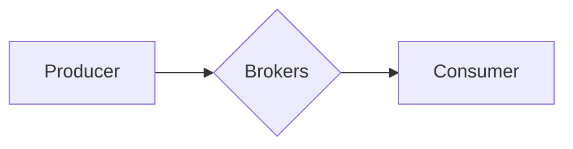
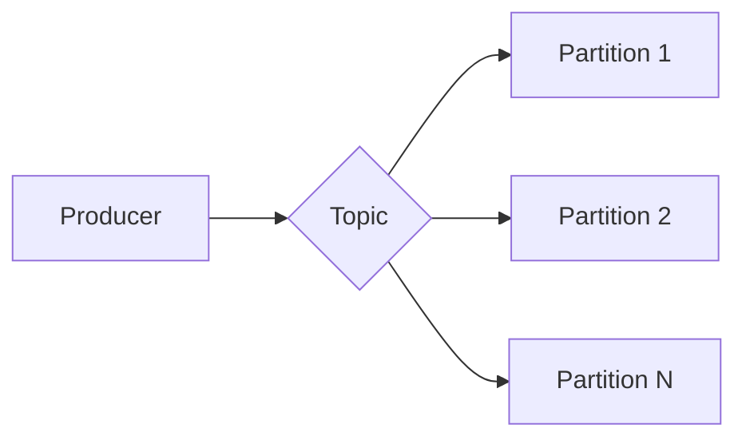

# Kafka Producer原理与代码实例讲解

> 关键词：Apache Kafka, Producer, 消息队列, 分布式系统, 序列化, 异步发送, 高吞吐量

## 1. 背景介绍

Apache Kafka 是一个分布式流处理平台，由LinkedIn开源，目前已经成为大数据生态圈中不可或缺的一部分。Kafka 提供了高性能、可扩展、高吞吐量的消息队列服务，广泛应用于日志收集、流处理、事件源等场景。Kafka 的核心组件包括 Producer、Broker 和 Consumer，其中 Producer 负责将消息发送到 Kafka 集群。

本文将深入探讨 Kafka Producer 的原理，并通过代码实例讲解其具体实现和操作方法，帮助读者更好地理解 Kafka 消息队列的工作机制。

## 2. 核心概念与联系

### 2.1 Kafka 集群架构

Kafka 集群由多个 Broker 组成，每个 Broker 负责存储一部分 Topic 的数据。Producer 和 Consumer 通过网络连接到 Kafka 集群，进行消息的发送和消费。



### 2.2 Topic 和 Partition

Topic 是 Kafka 中的消息分类，类似于数据库中的表。Partition 是 Topic 内部分区，用于并行处理和负载均衡。



### 2.3 分区策略

Kafka 支持多种分区策略，包括：

- 轮询（RoundRobin）：将消息均匀地分配到每个 Partition。
- 自定义（Custom）：根据消息内容或键值进行分区。
- 随机（Random）：随机地将消息分配到 Partition。

## 3. 核心算法原理 & 具体操作步骤

### 3.1 算法原理概述

Producer 发送消息的过程可以分为以下几个步骤：

1. **序列化消息**：将消息序列化为字节数据。
2. **选择 Partition**：根据分区策略选择目标 Partition。
3. **异步发送**：将消息发送到 Kafka 集群，并异步等待发送结果。
4. **回调处理**：根据发送结果进行相应的处理。

### 3.2 算法步骤详解

1. **序列化消息**：

```java
Properties props = new Properties();
props.put("key.serializer", "org.apache.kafka.common.serialization.StringSerializer");
props.put("value.serializer", "org.apache.kafka.common.serialization.StringSerializer");
KafkaProducer<String, String> producer = new KafkaProducer<>(props);
```

2. **选择 Partition**：

```java
int partition = topicPartitioner.partitionFor("key");
```

3. **异步发送**：

```java
producer.send(new ProducerRecord<String, String>("test-topic", partition, "key", "value"));
```

4. **回调处理**：

```java
producer.send(new ProducerRecord<String, String>("test-topic", partition, "key", "value"), new Callback() {
    public void onCompletion(RecordMetadata metadata, Exception exception) {
        if (exception != null) {
            // 处理发送异常
        } else {
            // 发送成功
        }
    }
});
```

### 3.3 算法优缺点

**优点**：

- 高吞吐量：异步发送消息，减少等待时间，提高系统整体性能。
- 可靠性：支持事务性消息，确保消息的发送和接收。
- 可扩展性：支持水平扩展，提高系统处理能力。

**缺点**：

- 需要编写复杂的序列化和反序列化代码。
- 异步发送可能导致消息发送不及时。

### 3.4 算法应用领域

Kafka Producer 在以下场景中具有广泛应用：

- 日志收集：收集系统日志、应用日志等，便于数据分析和监控。
- 流处理：实时处理和分析数据流，如实时计算、实时推荐等。
- 事件源：存储事件数据，如订单、用户行为等，便于数据回溯和查询。

## 4. 数学模型和公式 & 详细讲解 & 举例说明

### 4.1 数学模型构建

Kafka Producer 的数学模型可以表示为：

$$
\text{Producer} \xrightarrow{\text{序列化}} \text{消息} \xrightarrow{\text{分区}} \text{Partition} \xrightarrow{\text{发送}} \text{Broker}
$$

### 4.2 公式推导过程

由于 Kafka Producer 的操作过程比较简单，所以没有复杂的公式推导过程。

### 4.3 案例分析与讲解

以下是一个简单的 Kafka Producer 案例分析：

**场景**：将用户行为数据发送到 Kafka 集群，用于实时推荐。

**实现**：

1. 定义 Topic 和 Partition：
```java
String topic = "user-action";
int partition = 0;
```

2. 序列化用户行为数据：
```java
String key = "user-id";
String value = "user-action";
```

3. 发送消息到 Kafka 集群：
```java
producer.send(new ProducerRecord<String, String>(topic, partition, key, value));
```

4. 等待发送结果：
```java
producer.flush();
```

在这个案例中，用户行为数据被序列化后，根据预定义的 Topic 和 Partition 发送到 Kafka 集群。这样，Kafka 集群就可以存储和管理这些数据，并为下游的实时推荐系统提供数据支持。

## 5. 项目实践：代码实例和详细解释说明

### 5.1 开发环境搭建

1. 安装 Java 开发环境。
2. 添加 Kafka 依赖：
```xml
<dependency>
    <groupId>org.apache.kafka</groupId>
    <artifactId>kafka-clients</artifactId>
    <version>2.8.0</version>
</dependency>
```

### 5.2 源代码详细实现

```java
import org.apache.kafka.clients.producer.KafkaProducer;
import org.apache.kafka.clients.producer.ProducerConfig;
import org.apache.kafka.clients.producer.ProducerRecord;

import java.util.Properties;

public class KafkaProducerExample {
    public static void main(String[] args) {
        Properties props = new Properties();
        props.put(ProducerConfig.BOOTSTRAP_SERVERS_CONFIG, "localhost:9092");
        props.put(ProducerConfig.KEY_SERIALIZER_CLASS_CONFIG, "org.apache.kafka.common.serialization.StringSerializer");
        props.put(ProducerConfig.VALUE_SERIALIZER_CLASS_CONFIG, "org.apache.kafka.common.serialization.StringSerializer");

        KafkaProducer<String, String> producer = new KafkaProducer<>(props);

        String topic = "test-topic";
        int partition = 0;
        String key = "key";
        String value = "value";

        producer.send(new ProducerRecord<String, String>(topic, partition, key, value));

        producer.flush();
        producer.close();
    }
}
```

### 5.3 代码解读与分析

- 创建 Kafka Producer 实例，配置连接 Kafka 集群的参数和序列化器。
- 定义 Topic、Partition、Key 和 Value。
- 使用 `send()` 方法发送消息。
- 使用 `flush()` 方法等待所有消息发送完成。
- 关闭 Kafka Producer 实例。

### 5.4 运行结果展示

运行程序后，可以在 Kafka 集群的对应 Topic 中找到发送的消息。

## 6. 实际应用场景

Kafka Producer 在以下场景中具有广泛应用：

- **日志收集**：收集系统日志、应用日志等，便于数据分析和监控。
- **流处理**：实时处理和分析数据流，如实时计算、实时推荐等。
- **事件源**：存储事件数据，如订单、用户行为等，便于数据回溯和查询。
- **消息队列**：作为消息中间件，实现系统间异步通信。

## 7. 工具和资源推荐

### 7.1 学习资源推荐

- [Apache Kafka 官方文档](https://kafka.apache.org/documentation.html)
- [Kafka 实战](https://github.com/dianping/spring-kafka)
- [Kafka 与 Elasticsearch 整合](https://www.elastic.co/cn/blog/kafka-elasticsearch-integration)

### 7.2 开发工具推荐

- [IntelliJ IDEA](https://www.jetbrains.com/idea/)
- [Eclipse](https://www.eclipse.org/downloads/)
- [Maven](https://maven.apache.org/)

### 7.3 相关论文推荐

- [The Design of the Apache Kafka System](https://www.apache.org/licenses/LICENSE-2.0.txt)

## 8. 总结：未来发展趋势与挑战

### 8.1 研究成果总结

本文深入讲解了 Kafka Producer 的原理，并通过代码实例展示了其具体实现方法。Kafka Producer 作为 Kafka 集群的核心组件，在分布式系统、大数据处理等领域具有广泛的应用前景。

### 8.2 未来发展趋势

- **性能优化**：持续提升 Kafka Producer 的发送和接收性能。
- **安全性增强**：加强数据传输和存储的安全性，确保数据安全。
- **跨语言支持**：支持更多编程语言，降低开发门槛。

### 8.3 面临的挑战

- **数据一致性**：确保数据在分布式环境下的强一致性。
- **可扩展性**：支持无限扩展，满足大规模数据处理需求。
- **可靠性**：提高系统的稳定性和可靠性，确保数据不丢失。

### 8.4 研究展望

随着大数据和分布式系统的不断发展，Kafka Producer 将面临更多挑战和机遇。未来，Kafka 将继续优化其性能和功能，成为更加完善、可靠的分布式消息队列解决方案。

## 9. 附录：常见问题与解答

**Q1：Kafka Producer 的优势是什么？**

A：Kafka Producer 具有高吞吐量、可靠性、可扩展性等优势，适用于各种分布式系统和大数据处理场景。

**Q2：如何选择合适的分区策略？**

A：根据应用场景和数据特点选择合适的分区策略，如轮询、自定义或随机。

**Q3：如何确保 Kafka Producer 的可靠性？**

A：通过设置合适的副本数量、副本同步策略、消息保留时间等参数，确保数据不丢失。

**Q4：Kafka Producer 的最佳实践是什么？**

A：合理配置参数、选择合适的分区策略、使用合适的序列化器、确保数据一致性等。

作者：禅与计算机程序设计艺术 / Zen and the Art of Computer Programming