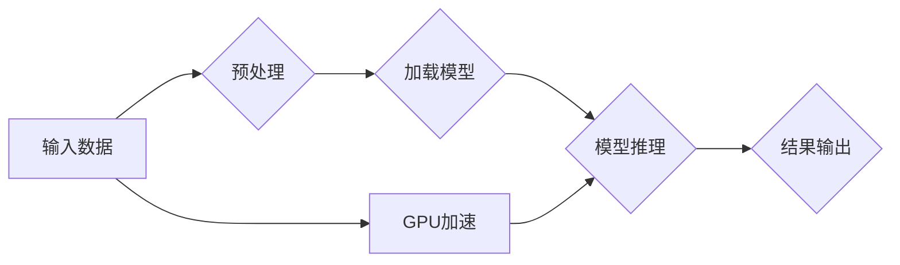

# NVIDIA的GPU技术与AI算力

> 关键词：NVIDIA, GPU, AI算力, CUDA, cuDNN, GPU加速,深度学习, 计算架构, 人工智能

## 1. 背景介绍

随着人工智能的迅猛发展，深度学习技术已经成为推动AI应用的核心力量。深度学习模型在图像识别、自然语言处理、语音识别等领域取得了显著的成果，而这些成果的背后，离不开强大的计算能力。在这个背景下，NVIDIA的GPU技术成为了AI算力的代名词。本文将深入探讨NVIDIA的GPU技术在AI算力领域的应用，分析其核心原理、架构、算法，并展望其未来发展趋势。

## 2. 核心概念与联系

### 2.1 核心概念

- **GPU（图形处理单元）**：与传统的CPU相比，GPU拥有更多的计算核心和更高效的并行处理能力，非常适合进行大规模并行计算。
- **CUDA（Compute Unified Device Architecture）**：NVIDIA开发的并行计算平台和编程模型，允许开发者在GPU上编写并行程序。
- **cuDNN（CUDA Deep Neural Network）**：NVIDIA推出的深度学习加速库，提供了针对深度神经网络的前向和反向传播的加速功能。
- **深度学习**：一种基于数据驱动的方法，通过神经网络模拟人脑处理信息的方式，从数据中学习并提取特征。

### 2.2 核心概念原理和架构的 Mermaid 流程图



### 2.3 核心概念联系

NVIDIA的GPU技术通过CUDA和cuDNN等技术，为深度学习提供了强大的算力支持。GPU的高并行计算能力使得深度学习模型能够在短时间内完成大量计算任务，从而加速了AI应用的研发和应用落地。

## 3. 核心算法原理 & 具体操作步骤

### 3.1 算法原理概述

深度学习算法通常包括以下步骤：

1. **数据预处理**：对输入数据进行标准化、归一化等处理，以便模型能够更好地学习。
2. **模型加载**：将预训练的模型加载到GPU上。
3. **模型推理**：使用GPU加速执行模型的正向和反向传播计算。
4. **结果输出**：将模型推理结果输出到指定设备。

### 3.2 算法步骤详解

1. **数据预处理**：使用GPU加速数据预处理，如批量归一化、随机翻转、随机裁剪等。
2. **模型加载**：将模型加载到GPU内存中，以便进行后续的计算。
3. **模型推理**：使用cuDNN库加速模型的正向传播和反向传播计算。
4. **结果输出**：将推理结果输出到CPU或GPU内存，以便进行后处理或展示。

### 3.3 算法优缺点

**优点**：

- **高性能**：GPU具有极高的并行计算能力，可以显著加速深度学习模型的训练和推理过程。
- **通用性**：CUDA和cuDNN库支持多种深度学习框架，如TensorFlow、PyTorch等，具有很好的通用性。
- **生态丰富**：NVIDIA拥有完善的开发者社区和丰富的应用案例，方便开发者进行GPU加速开发。

**缺点**：

- **成本较高**：高性能GPU的价格相对较高，对于一些预算有限的开发者和企业来说，可能构成一定的经济负担。
- **能耗较高**：GPU的功耗较高，需要配备相应的散热系统，增加了系统的成本和复杂度。

### 3.4 算法应用领域

NVIDIA的GPU技术在以下领域得到了广泛应用：

- **计算机视觉**：图像识别、物体检测、人脸识别、视频分析等。
- **语音识别**：语音转文字、语音合成、语音增强等。
- **自然语言处理**：文本分类、机器翻译、情感分析等。
- **推荐系统**：商品推荐、内容推荐、社交推荐等。

## 4. 数学模型和公式 & 详细讲解 & 举例说明

### 4.1 数学模型构建

深度学习模型通常基于以下数学模型：

- **神经网络**：由多个神经元组成，每个神经元通过权重连接，通过学习数据分布来提取特征。
- **损失函数**：用于衡量模型预测结果与真实标签之间的差异，如均方误差、交叉熵等。
- **优化算法**：用于迭代优化模型参数，如梯度下降、Adam等。

### 4.2 公式推导过程

以下以神经网络中的权重更新过程为例，简要介绍公式推导过程：

假设我们有以下神经网络模型：

$$
y = f(W \cdot x + b)
$$

其中，$W$ 为权重矩阵，$x$ 为输入特征，$b$ 为偏置项，$f$ 为激活函数。

损失函数为：

$$
L = \frac{1}{2} ||y - t||^2
$$

其中，$y$ 为模型预测结果，$t$ 为真实标签。

反向传播算法用于计算损失函数对权重矩阵 $W$ 的梯度：

$$
\frac{\partial L}{\partial W} = (y - t) \cdot x^T
$$

使用梯度下降算法更新权重矩阵：

$$
W \leftarrow W - \eta \cdot \frac{\partial L}{\partial W}
$$

其中，$\eta$ 为学习率。

### 4.3 案例分析与讲解

以下以使用PyTorch在GPU上训练一个简单的神经网络为例，演示如何使用CUDA和cuDNN库进行GPU加速：

```python
import torch
import torch.nn as nn
import torch.optim as optim

# 定义神经网络模型
class SimpleNN(nn.Module):
    def __init__(self):
        super(SimpleNN, self).__init__()
        self.fc1 = nn.Linear(784, 128)
        self.fc2 = nn.Linear(128, 10)
    
    def forward(self, x):
        x = torch.relu(self.fc1(x))
        x = self.fc2(x)
        return x

# 初始化模型、损失函数和优化器
model = SimpleNN().cuda() # 将模型移动到GPU
criterion = nn.CrossEntropyLoss()
optimizer = optim.SGD(model.parameters(), lr=0.01)

# 加载训练数据
train_loader = torch.utils.data.DataLoader(...) # 假设加载了训练数据

# 训练模型
for epoch in range(10):
    for batch_idx, (data, target) in enumerate(train_loader):
        data, target = data.cuda(), target.cuda() # 将数据移动到GPU
        optimizer.zero_grad()
        output = model(data)
        loss = criterion(output, target)
        loss.backward()
        optimizer.step()
        if batch_idx % 100 == 0:
            print('Train Epoch: {} [{}/{} ({:.0f}%)]\tLoss: {:.6f}'.format(
                epoch, batch_idx * len(data), len(train_loader.dataset),
                100. * batch_idx / len(train_loader), loss.item()))
```

以上代码展示了如何使用PyTorch在GPU上训练一个简单的神经网络。通过将模型和数据移动到GPU，可以使用CUDA和cuDNN库进行加速。

## 5. 项目实践：代码实例和详细解释说明

### 5.1 开发环境搭建

在进行NVIDIA GPU加速的深度学习项目开发前，我们需要准备好以下开发环境：

1. 操作系统：Linux或macOS
2. Python环境：Python 3.x
3. 深度学习框架：PyTorch或TensorFlow等
4. GPU驱动和CUDA：根据NVIDIA GPU型号下载并安装对应的驱动和CUDA版本
5. cuDNN：从NVIDIA官网下载并安装对应的cuDNN版本

### 5.2 源代码详细实现

以下是一个使用PyTorch在GPU上训练图像分类模型的代码实例：

```python
import torch
import torch.nn as nn
import torch.optim as optim
from torchvision import datasets, transforms

# 定义神经网络模型
class CNN(nn.Module):
    def __init__(self):
        super(CNN, self).__init__()
        self.conv1 = nn.Conv2d(3, 32, kernel_size=3, stride=1, padding=1)
        self.conv2 = nn.Conv2d(32, 64, kernel_size=3, stride=1, padding=1)
        self.pool = nn.MaxPool2d(kernel_size=2, stride=2)
        self.fc1 = nn.Linear(64 * 64 * 64, 1024)
        self.fc2 = nn.Linear(1024, 10)

    def forward(self, x):
        x = self.pool(F.relu(self.conv1(x)))
        x = self.pool(F.relu(self.conv2(x)))
        x = x.view(-1, 64 * 64 * 64)
        x = F.relu(self.fc1(x))
        x = self.fc2(x)
        return x

# 初始化模型、损失函数和优化器
model = CNN().cuda() # 将模型移动到GPU
criterion = nn.CrossEntropyLoss()
optimizer = optim.SGD(model.parameters(), lr=0.001)

# 加载训练数据
transform = transforms.Compose([
    transforms.ToTensor(),
    transforms.Normalize((0.5, 0.5, 0.5), (0.5, 0.5, 0.5))
])
train_dataset = datasets.CIFAR10(root='./data', train=True, download=True, transform=transform)
train_loader = torch.utils.data.DataLoader(train_dataset, batch_size=4, shuffle=True)

# 训练模型
for epoch in range(2):  # loop over the dataset multiple times

    running_loss = 0.0
    for i, data in enumerate(train_loader, 0):
        inputs, labels = data

        inputs, labels = inputs.cuda(), labels.cuda() # 将数据移动到GPU

        optimizer.zero_grad()

        outputs = model(inputs)
        loss = criterion(outputs, labels)
        loss.backward()
        optimizer.step()

        running_loss += loss.item()
        if i % 2000 == 1999:    # print every 2000 mini-batches
            print('[%d, %5d] loss: %.3f' %
                  (epoch + 1, i + 1, running_loss / 2000))
            running_loss = 0.0

print('Finished Training')
```

以上代码展示了如何使用PyTorch在GPU上训练一个简单的卷积神经网络（CNN）模型。通过将模型和数据移动到GPU，可以使用CUDA和cuDNN库进行加速。

### 5.3 代码解读与分析

上述代码中，我们定义了一个简单的CNN模型，并使用CIFAR-10数据集进行训练。代码中主要包含以下步骤：

1. **定义神经网络模型**：使用PyTorch定义一个简单的CNN模型。
2. **初始化模型、损失函数和优化器**：将模型移动到GPU，并初始化损失函数和优化器。
3. **加载训练数据**：使用PyTorch加载CIFAR-10数据集，并进行数据预处理。
4. **训练模型**：使用GPU加速执行模型的正向传播和反向传播计算，并更新模型参数。

## 6. 实际应用场景

### 6.1 计算机视觉

NVIDIA的GPU技术在计算机视觉领域得到了广泛应用，例如：

- **自动驾驶**：通过在GPU上加速图像识别和目标检测算法，实现自动驾驶汽车的安全行驶。
- **人脸识别**：在GPU上加速人脸识别算法，实现门禁、支付等场景的便捷通行。
- **图像增强**：在GPU上加速图像增强算法，提升图像质量，应用于医疗影像、遥感图像等领域。

### 6.2 语音识别

NVIDIA的GPU技术在语音识别领域也得到了广泛应用，例如：

- **智能客服**：在GPU上加速语音识别和语音合成算法，实现智能客服系统的快速响应用户需求。
- **语音助手**：在GPU上加速语音识别和语义理解算法，实现语音助手的自然交互体验。

### 6.3 自然语言处理

NVIDIA的GPU技术在自然语言处理领域也得到了广泛应用，例如：

- **机器翻译**：在GPU上加速机器翻译算法，实现高效、准确的跨语言翻译。
- **文本分类**：在GPU上加速文本分类算法，实现高效、准确的文本情感分析、主题分类等。

## 7. 工具和资源推荐

### 7.1 学习资源推荐

- **NVIDIA官网**：提供最新的GPU产品、CUDA和cuDNN库、开发者社区等信息。
- **PyTorch官网**：提供PyTorch框架的官方文档、教程、示例代码等。
- **TensorFlow官网**：提供TensorFlow框架的官方文档、教程、示例代码等。
- **Hugging Face官网**：提供Transformers库的官方文档、预训练模型、示例代码等。

### 7.2 开发工具推荐

- **CUDA Toolkit**：NVIDIA提供的并行计算开发工具包，包括CUDA编译器、调试器、性能分析工具等。
- **cuDNN**：NVIDIA提供的深度学习加速库，提供了针对深度神经网络的前向和反向传播的加速功能。
- **NVIDIA Drive**：NVIDIA推出的自动驾驶平台，提供自动驾驶所需的软件和硬件。
- **NVIDIA DGX**：NVIDIA推出的深度学习专用服务器，提供高性能的GPU集群。

### 7.3 相关论文推荐

- **AlexNet**：Alex Krizhevsky等人于2012年提出的卷积神经网络模型，被认为是深度学习领域的里程碑之一。
- **VGGNet**：Karen Simonyan和Andrew Zisserman于2014年提出的卷积神经网络模型，具有简洁的网络结构。
- **GoogLeNet**：Christian Szegedy等人于2014年提出的深度卷积神经网络模型，引入了Inception结构。
- **ResNet**：Kaiming He等人于2015年提出的残差网络模型，解决了深层神经网络训练困难的问题。
- **BERT**：Google AI于2018年提出的预训练语言模型，刷新了多项NLP任务的SOTA。

## 8. 总结：未来发展趋势与挑战

### 8.1 研究成果总结

NVIDIA的GPU技术在AI算力领域取得了显著的成果，为深度学习、计算机视觉、语音识别、自然语言处理等领域提供了强大的算力支持。通过CUDA和cuDNN等技术的应用，GPU加速已经成为深度学习研发和应用的重要手段。

### 8.2 未来发展趋势

未来，NVIDIA的GPU技术将在以下方面继续发展：

- **更高性能的GPU**：随着GPU架构的持续优化，GPU的计算能力将不断提升。
- **更优化的软件生态**：NVIDIA将继续优化CUDA和cuDNN等软件生态，提供更高效的深度学习开发工具。
- **跨领域融合**：NVIDIA的GPU技术将在更多领域得到应用，如自动驾驶、医疗、金融等。

### 8.3 面临的挑战

尽管NVIDIA的GPU技术在AI算力领域取得了显著成果，但仍面临着以下挑战：

- **能效比**：随着GPU计算能力的提升，能耗问题日益突出，需要开发更低功耗的GPU。
- **可扩展性**：GPU集群的规模不断扩大，需要开发更高效的分布式计算框架和算法。
- **安全性**：GPU设备的计算过程需要更高的安全性保障。

### 8.4 研究展望

未来，NVIDIA的GPU技术和AI算力将在以下方面进行深入研究：

- **新型计算架构**：探索新型计算架构，如神经形态计算、量子计算等，为AI算力提供新的解决方案。
- **异构计算**：将CPU、GPU、FPGA等多种计算资源进行融合，构建更强大的计算平台。
- **算法优化**：针对不同应用场景，优化深度学习算法，提高计算效率。

## 9. 附录：常见问题与解答

**Q1：为什么GPU比CPU更适合进行深度学习计算？**

A1：GPU具有更高的并行计算能力，可以同时处理大量的计算任务，而CPU的计算能力相对有限。此外，GPU的功耗和发热量也低于CPU，更适合进行长时间的大规模计算。

**Q2：CUDA和cuDNN分别有什么作用？**

A2：CUDA是NVIDIA推出的并行计算平台和编程模型，允许开发者在GPU上编写并行程序。cuDNN是NVIDIA推出的深度学习加速库，提供了针对深度神经网络的前向和反向传播的加速功能。

**Q3：如何将模型移动到GPU进行加速？**

A3：可以使用PyTorch、TensorFlow等深度学习框架提供的API将模型和数据移动到GPU。例如，在PyTorch中，可以使用`.cuda()`方法将模型移动到GPU。

**Q4：如何优化GPU加速程序的性能？**

A4：可以通过以下方法优化GPU加速程序的性能：
- 使用合适的批处理大小，减少GPU内存访问次数。
- 使用合适的线程和内存布局，提高内存访问效率。
- 使用合适的内存访问模式，减少内存访问延迟。

**Q5：如何评估GPU加速的效果？**

A5：可以通过比较GPU加速前后的运行时间、内存占用、能耗等指标来评估GPU加速的效果。

---

作者：禅与计算机程序设计艺术 / Zen and the Art of Computer Programming