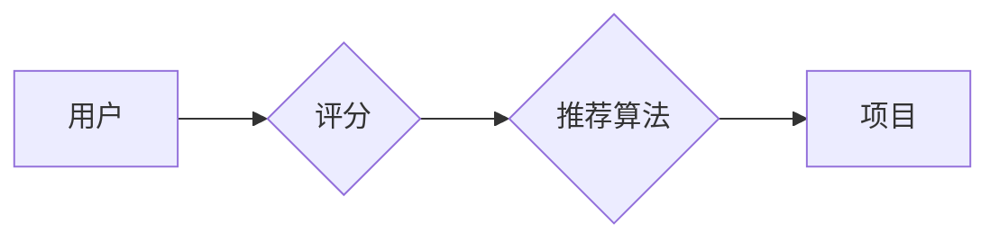

# Python深度学习实践：构建和优化推荐系统模型

> 关键词：深度学习，推荐系统，协同过滤，内容推荐，基于模型推荐，Python实践，Keras，TensorFlow

## 1. 背景介绍

推荐系统是当今互联网领域的关键技术之一，它通过预测用户可能感兴趣的项目，从而为用户提供个性化的内容推荐。随着深度学习技术的发展，基于深度学习的推荐系统在准确性和个性化方面取得了显著进步。本文将深入探讨如何使用Python和深度学习技术构建和优化推荐系统模型。

### 1.1 问题的由来

传统的推荐系统主要依赖于协同过滤（Collaborative Filtering）和内容推荐（Content-Based Filtering）等技术。协同过滤通过分析用户之间的相似性来推荐项目，而内容推荐则基于项目的特征来推荐相似的项目。然而，这两种方法都存在一些局限性，如冷启动问题、稀疏矩阵和可扩展性问题。

深度学习技术的引入为解决这些问题提供了新的思路。通过学习大量的用户行为数据，深度学习模型能够更好地理解用户偏好和项目特征，从而提供更精准的推荐。

### 1.2 研究现状

深度学习在推荐系统中的应用主要集中在以下领域：

- **深度协同过滤**：结合深度学习和协同过滤的思想，通过学习用户和项目的低维表示来提高推荐质量。
- **深度内容推荐**：使用深度学习模型提取项目特征，并基于这些特征进行推荐。
- **多模态推荐**：结合文本、图像、视频等多种模态信息，提供更全面的推荐。

### 1.3 研究意义

深度学习推荐系统的研究具有重要的理论和实际意义：

- **提升推荐质量**：通过学习用户和项目的复杂特征，深度学习模型能够提供更精准的推荐。
- **解决冷启动问题**：深度学习模型能够通过无监督或半监督学习方法解决冷启动问题。
- **提高可扩展性**：深度学习模型能够处理大规模数据集，提高推荐系统的可扩展性。

### 1.4 本文结构

本文将按照以下结构进行展开：

- 第2章介绍推荐系统的基础概念和流程。
- 第3章详细讲解深度学习推荐系统的核心算法原理。
- 第4章介绍数学模型和公式，并给出案例分析。
- 第5章通过代码实例展示如何使用Python和深度学习库构建推荐系统模型。
- 第6章探讨深度学习推荐系统的实际应用场景。
- 第7章推荐相关学习资源、开发工具和论文。
- 第8章总结研究成果，展望未来发展趋势和挑战。
- 第9章提供常见问题与解答。

## 2. 核心概念与联系

推荐系统的核心概念包括用户、项目、评分和推荐算法。

Mermaid流程图如下：



在这个流程中，用户对项目进行评分，推荐算法根据评分和其他信息推荐项目给用户。

## 3. 核心算法原理 & 具体操作步骤

### 3.1 算法原理概述

深度学习推荐系统通常使用以下算法：

- **深度协同过滤**：如神经协同过滤（Neural Collaborative Filtering）。
- **深度内容推荐**：如卷积神经网络（CNN）和循环神经网络（RNN）。
- **多模态推荐**：如图神经网络（GNN）。

### 3.2 算法步骤详解

深度学习推荐系统的一般步骤如下：

1. 数据预处理：包括数据清洗、特征工程、数据归一化等。
2. 模型选择：根据任务需求选择合适的深度学习模型。
3. 模型训练：使用训练数据训练模型。
4. 模型评估：使用验证集评估模型性能。
5. 模型优化：根据评估结果调整模型参数。
6. 模型部署：将模型部署到生产环境。

### 3.3 算法优缺点

深度学习推荐系统的优点包括：

- 能够学习到复杂的用户和项目特征。
- 能够解决冷启动问题。
- 能够处理大规模数据集。

缺点包括：

- 计算成本高。
- 需要大量的训练数据。
- 模型可解释性差。

### 3.4 算法应用领域

深度学习推荐系统可以应用于以下领域：

- 电子商务：推荐商品给用户。
- 社交媒体：推荐内容给用户。
- 视频网站：推荐视频给用户。
- 音乐流媒体：推荐音乐给用户。

## 4. 数学模型和公式 & 详细讲解 & 举例说明

### 4.1 数学模型构建

深度学习推荐系统的数学模型通常包括以下部分：

- 用户表示：将用户转换为低维向量。
- 项目表示：将项目转换为低维向量。
- 评分预测：预测用户对项目的评分。

### 4.2 公式推导过程

以神经协同过滤为例，其目标是最小化预测评分与实际评分之间的差距：

$$
L = \frac{1}{2} \sum_{(u,i) \in D}(r_{ui} - \hat{r}_{ui})^2
$$

其中，$r_{ui}$ 是用户 $u$ 对项目 $i$ 的实际评分，$\hat{r}_{ui}$ 是模型预测的评分。

### 4.3 案例分析与讲解

以下是一个使用TensorFlow和Keras构建神经协同过滤模型的示例：

```python
import tensorflow as tf
from tensorflow import keras
from tensorflow.keras import layers

# 定义模型
model = keras.Sequential([
    layers.Input(shape=(user嵌入维度)),
    layers.Dense(64, activation='relu'),
    layers.Dense(32, activation='relu'),
    layers.Dense(1)
])

# 编译模型
model.compile(optimizer='adam', loss='mean_squared_error')

# 训练模型
model.fit(user嵌入数据, 预测评分数据, epochs=10, batch_size=32)
```

在这个示例中，我们首先定义了一个简单的神经网络模型，其中包含两个ReLU激活函数和一层输出层。然后，我们使用Adam优化器和均方误差损失函数编译模型，并使用用户嵌入数据和预测评分数据进行训练。

## 5. 项目实践：代码实例和详细解释说明

### 5.1 开发环境搭建

为了进行深度学习推荐系统的开发，你需要安装以下软件：

- Python 3.6或更高版本
- TensorFlow或PyTorch深度学习框架
- NumPy、Pandas等科学计算库

### 5.2 源代码详细实现

以下是一个使用TensorFlow和Keras构建内容推荐模型的示例：

```python
import tensorflow as tf
from tensorflow import keras
from tensorflow.keras import layers

# 定义模型
model = keras.Sequential([
    layers.Input(shape=(特征维度)),
    layers.Dense(64, activation='relu'),
    layers.Dense(32, activation='relu'),
    layers.Dense(1)
])

# 编译模型
model.compile(optimizer='adam', loss='mean_squared_error')

# 训练模型
model.fit(特征数据, 预测评分数据, epochs=10, batch_size=32)
```

在这个示例中，我们首先定义了一个简单的神经网络模型，其中包含两个ReLU激活函数和一层输出层。然后，我们使用Adam优化器和均方误差损失函数编译模型，并使用特征数据和预测评分数据进行训练。

### 5.3 代码解读与分析

在这个代码示例中，我们首先定义了一个简单的神经网络模型，该模型包含一个输入层、两个隐藏层和一个输出层。输入层和输出层分别对应特征数据和预测评分数据。隐藏层使用ReLU激活函数，用于提取特征。

### 5.4 运行结果展示

在训练完成后，我们可以在测试集上评估模型的性能。以下是一个简单的性能评估代码：

```python
from sklearn.metrics import mean_squared_error

# 使用测试集评估模型
test_loss = model.evaluate(test_features, test_ratings)
print(f"Test Loss: {test_loss}")
```

这个代码将计算模型在测试集上的均方误差损失，从而评估模型的性能。

## 6. 实际应用场景

深度学习推荐系统可以应用于以下实际场景：

- 电子商务：推荐商品给用户。
- 社交媒体：推荐内容给用户。
- 视频网站：推荐视频给用户。
- 音乐流媒体：推荐音乐给用户。

例如，在电子商务平台上，深度学习推荐系统可以根据用户的购买历史和浏览行为，推荐用户可能感兴趣的商品。

## 7. 工具和资源推荐

### 7.1 学习资源推荐

- 《Python深度学习》
- 《深度学习推荐系统》
- TensorFlow官方文档
- PyTorch官方文档

### 7.2 开发工具推荐

- Jupyter Notebook
- TensorFlow
- PyTorch

### 7.3 相关论文推荐

- Factorization Machines for Machine Learning
- Deep Learning for Recommender Systems
- Neural Collaborative Filtering

## 8. 总结：未来发展趋势与挑战

### 8.1 研究成果总结

本文介绍了深度学习推荐系统的基本概念、核心算法、实践方法以及实际应用场景。通过Python和深度学习框架，我们可以构建和优化推荐系统模型，从而提供更精准、个性化的推荐服务。

### 8.2 未来发展趋势

- 模型小型化：为了提高推荐系统的可扩展性，未来模型将朝着小型化方向发展。
- 多模态推荐：结合文本、图像、视频等多种模态信息，提供更全面的推荐。
- 可解释性：提高推荐系统的可解释性，增强用户对推荐结果的理解和信任。

### 8.3 面临的挑战

- 数据质量：高质量的数据是构建高效推荐系统的基础。
- 模型可解释性：提高推荐系统的可解释性，避免算法偏见和歧视。
- 计算效率：提高推荐系统的计算效率，满足大规模实时推荐的需求。

### 8.4 研究展望

未来，深度学习推荐系统将在以下几个方面取得进展：

- 更精准的推荐：通过学习更复杂的用户和项目特征，提供更精准的推荐。
- 更个性化的推荐：通过学习用户的长期行为和短期兴趣，提供更个性化的推荐。
- 更智能的推荐：通过结合多种人工智能技术，提供更智能的推荐服务。

## 9. 附录：常见问题与解答

**Q1：深度学习推荐系统与传统推荐系统的区别是什么？**

A1：深度学习推荐系统利用深度学习技术学习用户和项目的复杂特征，从而提供更精准的推荐。而传统推荐系统主要依赖于协同过滤和内容推荐等技术，其推荐精度相对较低。

**Q2：如何解决冷启动问题？**

A2：冷启动问题可以通过以下方法解决：

- 使用无监督或半监督学习方法学习用户和项目的低维表示。
- 利用用户或项目的其他信息，如人口统计信息、地理位置等。
- 使用迁移学习，将其他领域的知识迁移到目标领域。

**Q3：如何提高推荐系统的可扩展性？**

A3：为了提高推荐系统的可扩展性，可以采取以下措施：

- 使用分布式计算框架，如Spark或Apache Flink。
- 使用模型压缩技术，如模型裁剪、量化加速等。
- 使用轻量级模型，如MobileNet或ShuffleNet。

**Q4：如何提高推荐系统的可解释性？**

A4：为了提高推荐系统的可解释性，可以采取以下措施：

- 使用可解释的深度学习模型，如LSTM或注意力机制。
- 使用可视化技术，如t-SNE或PCA，将模型输出可视化。
- 使用可解释的决策树或规则，解释模型的决策过程。

作者：禅与计算机程序设计艺术 / Zen and the Art of Computer Programming