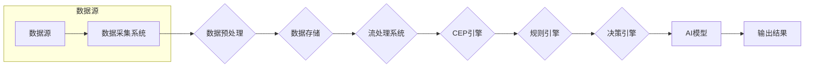

# 【AI大数据计算原理与代码实例讲解】CEP

> 关键词：AI计算架构，CEP，大数据处理，实时计算，流处理，机器学习，复杂事件处理

## 1. 背景介绍

在当今数据驱动的时代，AI和大数据技术已经成为企业创新和业务增长的关键驱动力。随着物联网、社交媒体、电子商务等领域的快速发展，数据量呈指数级增长，如何高效地处理和分析这些数据成为了亟待解决的问题。复杂事件处理（Complex Event Processing，简称CEP）作为一种实时计算技术，能够对实时数据流进行快速处理和分析，为AI算法提供数据支持，从而实现智能决策和业务洞察。

## 2. 核心概念与联系

### 2.1 核心概念

**AI计算架构**：指用于支持AI模型训练和推理的计算基础设施，包括硬件、软件和算法的组合。

**CEP**：一种实时数据处理技术，能够对复杂事件进行检测、分析和响应。

**大数据处理**：对海量数据进行存储、管理和分析的过程。

**流处理**：对实时数据流进行处理和分析的技术。

**机器学习**：一种使计算机能够从数据中学习并做出决策或预测的技术。

### 2.2 架构图

以下是一个简化的CEP架构图，展示了这些核心概念之间的联系：



## 3. 核心算法原理 & 具体操作步骤

### 3.1 算法原理概述

CEP的核心算法原理是实时事件检测和响应。它通过对实时数据流进行监控，识别出特定模式或事件，并在满足特定条件时触发相应的动作。

### 3.2 算法步骤详解

1. **数据采集**：从各种数据源（如传感器、日志、数据库等）采集数据。
2. **数据预处理**：对采集到的数据进行清洗、转换和格式化，以便后续处理。
3. **数据存储**：将预处理后的数据存储在数据库或其他存储系统中。
4. **流处理**：使用流处理技术对实时数据流进行监控和分析。
5. **CEP引擎**：识别和分析数据流中的复杂事件，触发规则或触发器。
6. **规则引擎**：根据预设的规则对事件进行分类和响应。
7. **决策引擎**：根据分析结果做出决策，如发送警报、启动流程或调用AI模型。
8. **AI模型**：使用机器学习算法对数据进行分析，提供更深入的洞察。
9. **输出结果**：将决策结果输出到目标系统或用户界面。

### 3.3 算法优缺点

#### 优点

- **实时性**：能够对实时数据流进行快速处理和分析。
- **灵活性**：可以灵活地定义事件和规则。
- **可扩展性**：能够处理大规模数据流。
- **集成性**：可以与其他系统和工具集成。

#### 缺点

- **复杂性**：架构复杂，需要专业的技术知识。
- **性能**：在高并发场景下可能存在性能瓶颈。
- **成本**：需要高性能的硬件和软件支持。

### 3.4 算法应用领域

CEP技术在多个领域都有广泛的应用，包括：

- **金融服务**：实时监控交易活动，识别欺诈行为。
- **零售**：分析顾客行为，优化营销策略。
- **制造**：实时监控生产过程，提高生产效率。
- **物联网**：分析设备状态，实现预测性维护。

## 4. 数学模型和公式 & 详细讲解 & 举例说明

### 4.1 数学模型构建

CEP系统的数学模型通常包括以下部分：

- **数据流模型**：描述数据流的结构和属性。
- **事件模型**：定义事件的类型、属性和关系。
- **规则模型**：定义规则的逻辑和条件。
- **决策模型**：定义决策的算法和目标。

### 4.2 公式推导过程

由于CEP系统的复杂性，很难用简单的数学公式进行描述。以下是一些常见的数学模型和公式：

- **数据流模型**：$X(t) = f(\text{数据源})$
- **事件模型**：$E = \{e_1, e_2, \ldots, e_n\}$
- **规则模型**：$R = \{r_1, r_2, \ldots, r_m\}$
- **决策模型**：$D = f(\text{规则模型}, X(t))$

### 4.3 案例分析与讲解

假设我们使用CEP技术监控一个金融交易系统，识别欺诈行为。

- **数据流模型**：$X(t) = \{交易金额, 交易时间, 交易账户, 交易类型\}$
- **事件模型**：$E = \{交易事件, 欺诈事件\}$
- **规则模型**：$R = \{如果 \text{交易金额} > 10000 \text{且} \text{交易类型} = \text{信用卡支付}, 那么 \text{触发欺诈事件}\}$
- **决策模型**：$D = f(\text{规则模型}, X(t))$

当检测到一个交易金额大于10000且交易类型为信用卡支付的交易事件时，规则引擎会触发欺诈事件，并通知相关人员进行进一步调查。

## 5. 项目实践：代码实例和详细解释说明

### 5.1 开发环境搭建

为了演示CEP的实践应用，我们将使用Apache Flink作为流处理框架，Apache Camel作为规则引擎，以及Python作为开发语言。

### 5.2 源代码详细实现

以下是一个简单的CEP示例，使用Apache Flink和Apache Camel识别欺诈交易：

```python
from org.apache.flink.streaming.api.environment import StreamExecutionEnvironment
from org.apache.flink.streaming.api.functions.source import SourceFunction
from org.apache.camel.builder.RouteBuilder import routeBuilder

# 初始化Flink流执行环境
env = StreamExecutionEnvironment.getExecutionEnvironment()

# 创建数据源
data_source = env.addSource(DataSource())

# 定义流处理逻辑
stream = data_source.map(lambda record: (record['amount'], record['type']))

# 使用Camel定义规则引擎
def rule_engine(amount, type):
    if amount > 10000 and type == 'credit_card':
        return 'fraudulent'
    return 'legitimate'

# 将规则引擎应用于流处理
stream.map(rule_engine).print()

# 启动流处理任务
env.execute("CEP Fraud Detection Example")
```

### 5.3 代码解读与分析

上述代码演示了如何使用Apache Flink和Apache Camel构建一个简单的CEP系统，用于识别欺诈交易。首先，我们创建了一个数据源，模拟实时交易数据的生成。然后，我们定义了一个流处理逻辑，将数据源中的数据映射到金额和类型。接下来，我们使用Camel定义了一个规则引擎，用于判断交易是否为欺诈行为。最后，我们将规则引擎应用于流处理，并打印出结果。

### 5.4 运行结果展示

当运行上述代码时，Flink会启动一个流处理任务，模拟实时交易数据的生成。每条交易记录都会通过规则引擎进行处理，并打印出是否为欺诈交易。

## 6. 实际应用场景

### 6.1 金融服务

在金融服务领域，CEP技术可以用于实时监控交易活动，识别欺诈行为、市场操纵和其他异常情况。通过快速响应和处理这些事件，金融机构可以减少损失，提高客户满意度。

### 6.2 零售

在零售领域，CEP技术可以用于分析顾客行为，优化库存管理、定价策略和营销活动。通过实时洞察顾客需求，零售商可以更好地满足顾客需求，提高销售业绩。

### 6.3 制造

在制造领域，CEP技术可以用于实时监控生产过程，识别设备故障、生产瓶颈和效率问题。通过及时响应和处理这些问题，制造商可以提高生产效率，降低成本。

### 6.4 物联网

在物联网领域，CEP技术可以用于分析设备状态，实现预测性维护。通过实时监控设备性能，企业可以提前发现和修复潜在问题，避免设备故障和停机。

## 7. 工具和资源推荐

### 7.1 学习资源推荐

- Apache Flink官网：https://flink.apache.org/
- Apache Camel官网：https://camel.apache.org/
- Apache Kafka官网：https://kafka.apache.org/
- 《Complex Event Processing in Action》

### 7.2 开发工具推荐

- Apache Flink：https://flink.apache.org/
- Apache Camel：https://camel.apache.org/
- Apache Kafka：https://kafka.apache.org/

### 7.3 相关论文推荐

- Event Processing in Action by J. DeWitt, D. F. Reddy, and W. A. Gray
- Stream Processing with Apache Flink by Dr. Vasiliy V. Filippov

## 8. 总结：未来发展趋势与挑战

### 8.1 研究成果总结

CEP作为一种实时计算技术，在数据处理、分析和响应方面发挥着越来越重要的作用。随着AI和大数据技术的不断发展，CEP将在更多领域得到应用，并与其他技术（如机器学习、物联网等）融合，为智能决策和业务洞察提供强有力的支持。

### 8.2 未来发展趋势

- **多模态数据处理**：CEP技术将能够处理来自不同来源和格式的数据，如文本、图像、语音等。
- **智能决策支持**：CEP将与AI和机器学习技术结合，提供更智能化的决策支持。
- **边缘计算**：CEP将应用于边缘计算场景，实现实时数据处理和分析。

### 8.3 面临的挑战

- **数据处理效率**：随着数据量的增加，如何提高数据处理效率是一个重要挑战。
- **可扩展性**：如何保证CEP系统的可扩展性是一个关键问题。
- **安全性和隐私**：如何在确保数据安全性和隐私的前提下，进行实时数据处理和分析是一个挑战。

### 8.4 研究展望

CEP技术将在未来数据驱动的世界中扮演越来越重要的角色。通过不断创新和突破，CEP技术将为各个领域带来更多的可能性，推动社会进步。

## 9. 附录：常见问题与解答

**Q1：CEP和传统数据分析有何区别？**

A：CEP与传统的数据分析主要区别在于实时性。CEP专注于实时数据流，能够对数据进行分析和响应，而传统数据分析则更侧重于历史数据的分析。

**Q2：CEP系统需要哪些技术支持？**

A：CEP系统需要流处理技术、规则引擎、决策引擎和AI模型等技术支持。

**Q3：CEP技术在金融领域的应用有哪些？**

A：CEP技术在金融领域的应用包括欺诈检测、市场操纵检测、信用评分等。

**Q4：CEP系统的优势是什么？**

A：CEP系统的优势包括实时性、灵活性、可扩展性和集成性。

**Q5：CEP系统的挑战是什么？**

A：CEP系统的挑战包括数据处理效率、可扩展性和安全性和隐私问题。

作者：禅与计算机程序设计艺术 / Zen and the Art of Computer Programming