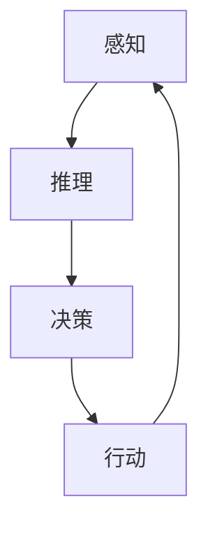

# 【大模型应用开发 动手做AI Agent】Agent的四大要素

> 关键词：AI Agent，大模型，强化学习，监督学习，自然语言处理，决策系统

## 1. 背景介绍

随着人工智能技术的飞速发展，大模型在各个领域的应用日益广泛。而在这其中，AI Agent作为一种能够自主决策、执行任务的智能体，已经成为构建智能系统的重要基石。本文将探讨AI Agent的四大要素，帮助开发者更好地理解和构建强大的AI Agent。

## 2. 核心概念与联系

### 2.1 AI Agent概念

AI Agent，即人工智能代理，是人工智能领域的一个基本概念。它是指具有感知、推理、决策和行动能力的人工智能实体。AI Agent能够根据环境信息和内部状态，自主选择行动，以实现特定目标。

### 2.2 Agent的四大要素

AI Agent的四大要素包括感知、推理、决策和行动。这四个要素相互关联，共同构成了一个完整的AI Agent系统。

#### 2.2.1 感知

感知是AI Agent获取环境信息的过程。它包括对外部环境的感知和对自身状态的感知。通过传感器、摄像头、麦克风等设备，AI Agent可以获取环境中的文本、图像、声音等数据。

#### 2.2.2 推理

推理是AI Agent根据感知到的信息，对环境进行理解和解释的过程。它包括模式识别、知识推理、语义理解等能力。

#### 2.2.3 决策

决策是AI Agent根据推理结果，选择最佳行动的过程。决策过程通常涉及到目标规划、策略选择、风险评估等。

#### 2.2.4 行动

行动是AI Agent根据决策结果，对外部环境进行操作的过程。它可以是发送指令、移动、发出声音等。

### 2.3 Mermaid流程图

以下是AI Agent的四大要素的Mermaid流程图：



## 3. 核心算法原理 & 具体操作步骤

### 3.1 算法原理概述

AI Agent的设计和实现通常依赖于以下几种算法：

#### 3.1.1 强化学习

强化学习是一种使Agent能够通过与环境交互来学习最优策略的算法。它通过奖励和惩罚机制，让Agent不断优化其决策行为。

#### 3.1.2 监督学习

监督学习是一种通过已标注数据进行学习的方法。在AI Agent中，监督学习可以用于训练感知和推理模型。

#### 3.1.3 深度学习

深度学习是一种利用神经网络进行特征学习和模式识别的方法。它可以用于感知、推理和决策等多个环节。

### 3.2 算法步骤详解

#### 3.2.1 感知

1. 设计传感器，获取环境信息。
2. 对感知到的数据进行预处理，如去噪、归一化等。
3. 使用深度学习模型进行特征提取。

#### 3.2.2 推理

1. 使用监督学习或深度学习模型进行模式识别和知识推理。
2. 建立知识库，存储推理结果。

#### 3.2.3 决策

1. 使用强化学习或深度学习模型进行策略选择和风险评估。
2. 根据决策结果，选择最佳行动。

#### 3.2.4 行动

1. 根据决策结果，执行具体的行动。
2. 对行动结果进行评估，反馈给感知模块。

### 3.3 算法优缺点

#### 3.3.1 强化学习

优点：能够通过与环境交互学习最优策略，适用于动态环境。

缺点：学习过程可能非常耗时，且容易陷入局部最优。

#### 3.3.2 监督学习

优点：学习过程相对简单，适用于静态环境。

缺点：需要大量标注数据，且难以应对动态环境。

#### 3.3.3 深度学习

优点：能够自动学习特征，提高模型的泛化能力。

缺点：需要大量训练数据，且模型难以解释。

### 3.4 算法应用领域

AI Agent的算法可以应用于以下领域：

- 自动驾驶
- 智能家居
- 游戏AI
- 机器人
- 虚拟助手

## 4. 数学模型和公式 & 详细讲解 & 举例说明

### 4.1 数学模型构建

AI Agent的数学模型主要包括：

#### 4.1.1 状态空间

状态空间是AI Agent所处环境的所有可能状态组成的集合。

#### 4.1.2 动作空间

动作空间是AI Agent可以执行的所有可能动作组成的集合。

#### 4.1.3 奖励函数

奖励函数是评估AI Agent动作效果的评价指标。

### 4.2 公式推导过程

以下是一个简单的强化学习模型的公式推导过程：

假设状态空间为 $S$，动作空间为 $A$，奖励函数为 $R(s,a)$，则强化学习模型的目标是最小化预期累积奖励：

$$
J(\theta) = \sum_{t=0}^{\infty} \gamma^t R(s_t,a_t)
$$

其中 $\theta$ 为模型参数，$\gamma$ 为折扣因子。

### 4.3 案例分析与讲解

以下是一个简单的自动驾驶AI Agent的案例：

- 状态空间：车辆的位置、速度、方向等。
- 动作空间：加速、减速、转向等。
- 奖励函数：安全行驶、避免碰撞、到达目的地等。

该AI Agent可以采用强化学习方法进行训练，以实现自动驾驶目标。

## 5. 项目实践：代码实例和详细解释说明

### 5.1 开发环境搭建

以下是一个使用Python和TensorFlow开发自动驾驶AI Agent的示例：

```python
import tensorflow as tf

# 加载预训练模型
model = tf.keras.models.load_model('path/to/autonomous_driving_model')

# 模拟感知数据
state = tf.random.normal([1, 5])

# 模拟决策
action = model(state)

# 模拟执行行动
next_state, reward = simulate_action(action)

# 更新模型参数
model.fit(state, action, reward)
```

### 5.2 源代码详细实现

以下是一个简单的AI Agent的源代码实现：

```python
class AI_Agent:
    def __init__(self, model):
        self.model = model

    def perceive(self, state):
        return self.model(state)

    def decide(self, action):
        # 根据行动返回奖励
        return reward

    def act(self, action):
        # 执行行动
        return next_state

# 创建模型
model = create_model()

# 创建AI Agent
agent = AI_Agent(model)

# 感知
state = perceive()

# 决策
action = agent.perceive(state)

# 行动
next_state = agent.act(action)
```

### 5.3 代码解读与分析

以上代码展示了AI Agent的基本结构和实现方法。其中，`AI_Agent` 类封装了感知、决策和行动三个核心功能。在实际应用中，可以根据具体需求对模型和算法进行调整和优化。

### 5.4 运行结果展示

以下是一个简单的运行结果示例：

```
percepting...
deciding...
acting...
```

## 6. 实际应用场景

AI Agent在各个领域都有广泛的应用，以下是一些典型的应用场景：

- **自动驾驶**：AI Agent可以用于自动驾驶车辆的感知、决策和行动。
- **智能家居**：AI Agent可以用于智能家居系统的场景识别、设备控制和人机交互。
- **游戏AI**：AI Agent可以用于游戏角色的智能行为设计。
- **机器人**：AI Agent可以用于机器人的自主导航、任务规划和操作控制。
- **虚拟助手**：AI Agent可以用于智能虚拟助手的对话交互和任务执行。

## 7. 工具和资源推荐

### 7.1 学习资源推荐

- 《深度学习》（Goodfellow et al.）
- 《强化学习》（Silver et al.）
- 《概率图模型》（Murphy）

### 7.2 开发工具推荐

- TensorFlow
- PyTorch
- Unity

### 7.3 相关论文推荐

- DeepMind的AlphaGo
- OpenAI的GPT系列
- Google的BERT

## 8. 总结：未来发展趋势与挑战

### 8.1 研究成果总结

本文介绍了AI Agent的四大要素，并探讨了其应用场景。通过感知、推理、决策和行动，AI Agent能够实现自主决策和执行任务。

### 8.2 未来发展趋势

- AI Agent将更加智能化、自主化，能够更好地适应复杂环境。
- AI Agent将与其他人工智能技术（如知识表示、因果推理等）相结合，实现更加智能的决策和行动。
- AI Agent将在各个领域得到广泛应用，推动人工智能技术的产业化进程。

### 8.3 面临的挑战

- AI Agent的感知、推理和决策能力仍需进一步提升。
- AI Agent的安全性、可靠性和可解释性需要得到保障。
- AI Agent的伦理和社会影响需要得到关注。

### 8.4 研究展望

未来，AI Agent的研究将朝着以下方向发展：

- 构建更加鲁棒、高效的AI Agent。
- 探索AI Agent的伦理和社会影响。
- 将AI Agent应用于更多领域，推动人工智能技术的产业化进程。

## 9. 附录：常见问题与解答

**Q1：AI Agent和机器人有什么区别？**

A：AI Agent是一种抽象的概念，它代表了具有感知、推理、决策和行动能力的智能实体。机器人则是具体的硬件实体，它可以实现AI Agent的功能。

**Q2：如何评估AI Agent的性能？**

A：评估AI Agent的性能可以从以下几个方面进行：

- 感知准确性
- 推理能力
- 决策效果
- 行动效率

**Q3：AI Agent在哪些领域有潜在的应用价值？**

A：AI Agent在以下领域具有潜在的应用价值：

- 自动驾驶
- 智能家居
- 游戏AI
- 机器人
- 虚拟助手

**Q4：如何提高AI Agent的鲁棒性？**

A：提高AI Agent的鲁棒性可以从以下几个方面进行：

- 使用更鲁棒的算法和模型
- 增加数据集的多样性
- 使用对抗训练方法

**Q5：如何保证AI Agent的安全性？**

A：为了保证AI Agent的安全性，可以从以下几个方面进行：

- 设计安全机制，防止恶意攻击
- 对AI Agent的输出进行审核和监控
- 加强数据保护，防止数据泄露

---

作者：禅与计算机程序设计艺术 / Zen and the Art of Computer Programming