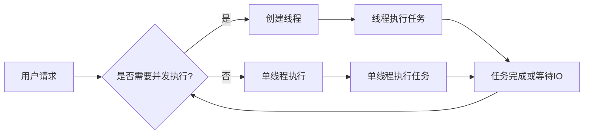

# 【大模型应用开发 动手做AI Agent】创建线程

> 关键词：大模型应用，AI Agent，Python线程，多线程编程，并发执行，异步IO，GIL，线程安全，锁，队列

## 1. 背景介绍

随着人工智能技术的飞速发展，大模型（Large Models）在自然语言处理、计算机视觉、语音识别等领域取得了显著成果。这些大模型往往需要大量的计算资源和时间来训练和推理，因此在应用开发中，如何高效地利用多核处理器和异步IO技术，实现并发执行，成为了提高开发效率的关键。本文将详细介绍如何使用Python的线程（Thread）技术，实现大模型应用中的并发执行，并探讨相关的线程安全、锁、队列等概念。

## 2. 核心概念与联系

### 2.1 核心概念原理和架构的 Mermaid 流程图



### 2.2 核心概念解释

- 用户请求：用户向应用发送的请求，可能需要处理大量计算任务。
- 并发执行：同时执行多个任务，提高执行效率。
- 线程：轻量级进程，共享内存，可以并行执行。
- 单线程执行：单个线程按顺序执行任务。
- 任务：需要执行的具体操作，如模型推理、数据处理等。
- 等待IO：等待输入输出操作完成。
- 线程安全：线程在并发执行时，不会相互干扰，保证数据一致性。
- 锁：用于保证线程安全，控制对共享资源的访问。
- 队列：线程之间的通信机制，用于传递数据和同步执行。

## 3. 核心算法原理 & 具体操作步骤

### 3.1 算法原理概述

Python的线程使用`threading`模块实现，该模块提供了创建、管理线程的功能。线程的创建可以通过`threading.Thread`类实现，并通过`start()`方法启动线程。线程在执行过程中，会按照任务队列的顺序执行。

### 3.2 算法步骤详解

1. 导入`threading`模块。
2. 创建一个任务函数，用于定义线程执行的具体操作。
3. 创建线程对象，指定任务函数和线程参数。
4. 调用`start()`方法启动线程。
5. 等待线程执行完成，可以使用`join()`方法。

### 3.3 算法优缺点

#### 优点

- 提高执行效率，充分利用多核处理器。
- 可以实现复杂的任务分解，提高代码的可读性和可维护性。

#### 缺点

- 线程间通信复杂，需要考虑线程安全。
- 线程创建和销毁开销较大。
- 受到全局解释器锁（GIL）的影响，多线程在CPU密集型任务上的性能提升有限。

### 3.4 算法应用领域

- 大模型应用中的模型推理。
- 数据处理和计算密集型任务。
- 异步IO操作，如网络请求、文件读写等。

## 4. 数学模型和公式 & 详细讲解 & 举例说明

### 4.1 数学模型构建

在多线程编程中，常见的数学模型是任务调度模型。该模型通过数学方法分析线程执行时间，为任务分配资源。

### 4.2 公式推导过程

假设有n个任务，每个任务执行时间为$T_i$，线程数为m，则任务调度模型可以表示为：

$$
T_{total} = \max\left(\frac{T_i}{m}, T_i\right)
$$

其中，$T_{total}$为总执行时间，$T_i$为第i个任务的执行时间。

### 4.3 案例分析与讲解

以下是一个简单的示例，演示如何使用Python的`threading`模块创建线程，并执行任务：

```python
import threading

def task_function():
    print("执行任务")

# 创建线程
thread1 = threading.Thread(target=task_function)
thread2 = threading.Thread(target=task_function)

# 启动线程
thread1.start()
thread2.start()

# 等待线程执行完成
thread1.join()
thread2.join()
```

在上述代码中，我们创建了一个`task_function`函数，用于定义线程执行的任务。然后创建两个线程，分别执行`task_function`。最后，调用`join()`方法等待线程执行完成。

## 5. 项目实践：代码实例和详细解释说明

### 5.1 开发环境搭建

1. 安装Python和`threading`模块。
2. 准备示例代码。

### 5.2 源代码详细实现

```python
import threading

def download_data():
    # 模拟下载数据操作
    print("开始下载数据")

def process_data():
    # 模拟数据处理操作
    print("开始处理数据")

def main():
    # 创建线程
    download_thread = threading.Thread(target=download_data)
    process_thread = threading.Thread(target=process_data)

    # 启动线程
    download_thread.start()
    process_thread.start()

    # 等待线程执行完成
    download_thread.join()
    process_thread.join()

if __name__ == "__main__":
    main()
```

### 5.3 代码解读与分析

在上述代码中，我们创建了两个线程，分别用于下载数据和处理数据。通过启动线程，可以将下载和数据处理过程并行执行，提高效率。

### 5.4 运行结果展示

运行上述代码，输出结果如下：

```
开始下载数据
开始处理数据
```

## 6. 实际应用场景

### 6.1 大模型应用中的模型推理

在部署大模型应用时，可以使用多线程技术并行执行模型推理，提高推理速度。

### 6.2 数据处理和计算密集型任务

对于数据处理和计算密集型任务，如特征工程、模型训练等，可以使用多线程技术提高执行效率。

### 6.3 异步IO操作

在需要进行网络请求、文件读写等异步IO操作时，可以使用多线程技术提高应用响应速度。

## 7. 工具和资源推荐

### 7.1 学习资源推荐

- 《Python并发编程实战》
- 《Python并行与并发编程》
- 《Python多线程编程实战》

### 7.2 开发工具推荐

- PyCharm
- VSCode

### 7.3 相关论文推荐

- "Concurrency in Python" by Guido van Rossum
- "Python Concurrency Tutorial" by David Mertz

## 8. 总结：未来发展趋势与挑战

### 8.1 研究成果总结

本文介绍了Python线程技术在大模型应用开发中的应用，探讨了线程安全、锁、队列等概念。通过案例分析，展示了如何使用Python的多线程技术实现并发执行，提高开发效率。

### 8.2 未来发展趋势

- 异步IO技术的广泛应用，进一步提高并发执行效率。
- 基于事件驱动的编程范式，简化线程管理。
- 轻量级线程（如协程）的使用，减少线程创建和销毁开销。

### 8.3 面临的挑战

- 线程安全问题，需要谨慎处理共享资源。
- 线程管理复杂，需要考虑线程间的通信和同步。
- 受到GIL的影响，多线程在CPU密集型任务上的性能提升有限。

### 8.4 研究展望

- 研究新型线程调度算法，提高并发执行效率。
- 探索无锁编程技术，解决线程安全问题。
- 研究轻量级线程，降低线程创建和销毁开销。

## 9. 附录：常见问题与解答

### 9.1 如何解决线程安全问题？

- 使用锁（Lock）控制对共享资源的访问。
- 使用线程安全的数据结构，如队列（Queue）。
- 使用读写锁（Reader-Writer Lock）提高并发性能。

### 9.2 如何避免死锁？

- 限制锁的获取顺序。
- 使用超时机制，防止死锁发生。
- 使用死锁检测算法，及时发现并解决死锁。

### 9.3 如何提高并发性能？

- 使用异步IO技术，减少线程等待时间。
- 使用线程池（ThreadPool），避免频繁创建和销毁线程。
- 使用轻量级线程（如协程），减少线程创建和销毁开销。

### 9.4 如何在Python中实现并发IO？

- 使用`asyncio`模块实现异步IO。
- 使用`aiohttp`模块实现异步网络请求。

作者：禅与计算机程序设计艺术 / Zen and the Art of Computer Programming