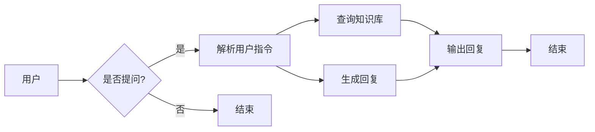

> AI Agent, 自动办公, 大语言模型, 智能助手, 代码实例, 应用开发

# 【大模型应用开发 动手做AI Agent】自动办公好助手

> 关键词：AI Agent, 自动办公, 大语言模型, 智能助手, 代码实例, 应用开发

## 1. 背景介绍

随着人工智能技术的飞速发展，大语言模型（Large Language Model，LLM）已经在自然语言处理（Natural Language Processing，NLP）领域取得了显著的成果。这些大模型能够理解和生成人类语言，具备强大的信息检索、文本分析、对话生成等功能。在办公自动化领域，利用大语言模型开发AI Agent，能够极大地提高工作效率，降低人力成本。本文将深入探讨如何利用大语言模型开发自动办公好助手，并通过实际项目实践，展示如何将大模型应用于实际场景。

## 2. 核心概念与联系

### 2.1 核心概念

- **大语言模型（LLM）**：指在大量文本语料上进行预训练的深度学习模型，能够理解和生成人类语言。
- **AI Agent**：指能够模拟人类智能行为的软件代理，能够自主执行任务，并与人类用户交互。
- **自动办公**：利用信息技术手段，实现办公流程自动化，提高工作效率，降低人力成本。
- **智能助手**：具备一定智能的软件程序，能够理解用户的指令，并提供相应的帮助和服务。

### 2.2 架构图



该流程图展示了用户与AI Agent的交互过程。用户提问后，AI Agent解析用户指令，查询知识库或生成回复，最后输出回复给用户。

## 3. 核心算法原理 & 具体操作步骤

### 3.1 算法原理概述

AI Agent的核心算法主要包括自然语言理解（Natural Language Understanding，NLU）和自然语言生成（Natural Language Generation，NLG）。

- **NLU**：将自然语言输入转换为机器可理解的结构化数据，如意图识别、实体抽取等。
- **NLG**：将结构化数据转换为自然语言输出，如文本生成、对话生成等。

大语言模型在NLU和NLG中扮演着重要角色，能够有效地处理自然语言输入和输出。

### 3.2 算法步骤详解

1. **用户输入**：用户通过键盘、语音等方式输入问题或指令。
2. **NLU处理**：AI Agent解析用户输入，识别意图和实体。
3. **知识库查询**：根据用户意图和实体，查询知识库获取相关信息。
4. **NLG生成**：利用大语言模型生成自然语言回复。
5. **回复输出**：将生成的回复输出给用户。

### 3.3 算法优缺点

**优点**：

- **高效**：自动化处理用户输入，节省人力成本。
- **智能**：能够理解用户意图，提供个性化的服务。
- **灵活**：支持多种输入和输出方式，适应不同的场景。

**缺点**：

- **依赖知识库**：需要构建和维护知识库，成本较高。
- **模型复杂**：大语言模型计算量大，对硬件要求较高。
- **误识别率**：NLU阶段可能存在误识别，影响用户体验。

### 3.4 算法应用领域

- **客服系统**：自动解答用户问题，提高客服效率。
- **智能助手**：提供日程管理、邮件回复、信息检索等服务。
- **智能问答**：构建行业知识库，为用户提供专业咨询。
- **自动办公**：实现办公流程自动化，提高工作效率。

## 4. 数学模型和公式 & 详细讲解 & 举例说明

### 4.1 数学模型构建

AI Agent的数学模型主要包括NLU和NLG两部分。

- **NLU模型**：通常采用序列标注模型，如BiLSTM-CRF，对输入文本进行词性标注、命名实体识别等。
- **NLG模型**：通常采用序列到序列模型，如 seq2seq，将结构化数据转换为自然语言输出。

### 4.2 公式推导过程

以seq2seq模型为例，其输入序列和输出序列分别为 $x_1, x_2, ..., x_T$ 和 $y_1, y_2, ..., y_S$，模型参数为 $\theta$，目标函数为 $J(\theta)$。

$$
J(\theta) = -\frac{1}{N} \sum_{n=1}^{N} \sum_{t=1}^{T} \sum_{s=1}^{S} y_{n,t} \log P(y_{n,s} | x_{n,1:t}, \theta)
$$

其中 $y_{n,t}$ 为第 $n$ 个样本的第 $t$ 个输出词的概率，$P(y_{n,s} | x_{n,1:t}, \theta)$ 为条件概率。

### 4.3 案例分析与讲解

假设我们要构建一个智能客服系统，使用seq2seq模型进行NLG。

- **输入序列**：用户输入的文本，如 "我想查询最近的电影排期"。
- **输出序列**：查询结果，如 "最近的电影排期如下：1. 《阿凡达》，2. 《流浪地球》，3. 《复仇者联盟》"。

我们可以将输入序列和输出序列分别编码为词向量，然后输入seq2seq模型进行解码。

```python
import torch
import torch.nn as nn

# 假设词向量长度为128，输出层大小为10
input_embedding = nn.Embedding(10000, 128)
output_embedding = nn.Embedding(10000, 128)
decoder = nn.GRU(128, 128, 1)
output_layer = nn.Linear(128, 10)

# 输入序列和输出序列
input_seq = torch.tensor([[1, 2, 3, 4, 5], [6, 7, 8, 9, 10]])
output_seq = torch.tensor([[1, 2, 3, 4, 5], [1, 2, 3, 4, 6]])

# 前向传播
output嵌入 = input_embedding(input_seq)
output嵌入 = output嵌入.view(-1, 1, 128)
outputs, _ = decoder(output嵌入)
outputs = output_layer(outputs)
log_probs = nn.functional.log_softmax(outputs, dim=-1)

# 计算损失
loss = nn.functional.nll_loss(log_probs.view(-1, 10), output_seq.view(-1))
print(loss.item())
```

通过以上代码，我们可以计算输入序列和输出序列之间的损失，从而优化模型参数。

## 5. 项目实践：代码实例和详细解释说明

### 5.1 开发环境搭建

以下是使用Python和PyTorch搭建智能客服系统开发环境的步骤：

1. 安装Anaconda：从官网下载并安装Anaconda。
2. 创建虚拟环境：
```bash
conda create -n smart-customer-service python=3.8
conda activate smart-customer-service
```
3. 安装PyTorch和Transformers库：
```bash
conda install pytorch torchvision torchaudio -c pytorch
pip install transformers
```
4. 安装其他依赖库：
```bash
pip install numpy pandas scikit-learn matplotlib
```

### 5.2 源代码详细实现

以下是一个简单的智能客服系统示例，包括数据预处理、模型训练和推理：

```python
import torch
import torch.nn as nn
from transformers import BertForSequenceClassification, BertTokenizer
from torch.utils.data import Dataset, DataLoader

# 数据预处理
class CustomerServiceDataset(Dataset):
    def __init__(self, texts, labels, tokenizer, max_len=128):
        self.texts = texts
        self.labels = labels
        self.tokenizer = tokenizer
        self.max_len = max_len

    def __len__(self):
        return len(self.texts)

    def __getitem__(self, item):
        text = self.texts[item]
        label = self.labels[item]
        encoding = self.tokenizer(text, truncation=True, padding=True, max_length=self.max_len)
        input_ids = encoding['input_ids']
        attention_mask = encoding['attention_mask']
        return {'input_ids': input_ids, 'attention_mask': attention_mask, 'labels': label}

# 模型训练
def train(model, dataloader, optimizer, criterion):
    model.train()
    total_loss = 0
    for batch in dataloader:
        input_ids = batch['input_ids'].to(device)
        attention_mask = batch['attention_mask'].to(device)
        labels = batch['labels'].to(device)
        optimizer.zero_grad()
        outputs = model(input_ids, attention_mask=attention_mask)
        loss = criterion(outputs.logits, labels)
        total_loss += loss.item()
        loss.backward()
        optimizer.step()
    return total_loss / len(dataloader)

# 模型推理
def evaluate(model, dataloader):
    model.eval()
    total_loss = 0
    with torch.no_grad():
        for batch in dataloader:
            input_ids = batch['input_ids'].to(device)
            attention_mask = batch['attention_mask'].to(device)
            labels = batch['labels'].to(device)
            outputs = model(input_ids, attention_mask=attention_mask)
            loss = criterion(outputs.logits, labels)
            total_loss += loss.item()
    return total_loss / len(dataloader)

# 加载预训练模型
tokenizer = BertTokenizer.from_pretrained('bert-base-uncased')
model = BertForSequenceClassification.from_pretrained('bert-base-uncased', num_labels=2)

# 切分数据集
train_texts, train_labels = [], []
test_texts, test_labels = [], []
with open('data/train.txt', 'r', encoding='utf-8') as f:
    for line in f:
        text, label = line.strip().split('\t')
        train_texts.append(text)
        train_labels.append(int(label))
with open('data/test.txt', 'r', encoding='utf-8') as f:
    for line in f:
        text, label = line.strip().split('\t')
        test_texts.append(text)
        test_labels.append(int(label))

# 创建数据集
train_dataset = CustomerServiceDataset(train_texts, train_labels, tokenizer)
test_dataset = CustomerServiceDataset(test_texts, test_labels, tokenizer)

# 创建数据加载器
train_dataloader = DataLoader(train_dataset, batch_size=16, shuffle=True)
test_dataloader = DataLoader(test_dataset, batch_size=16, shuffle=False)

# 定义优化器和损失函数
optimizer = torch.optim.AdamW(model.parameters(), lr=2e-5)
criterion = nn.CrossEntropyLoss()

# 训练模型
device = torch.device('cuda' if torch.cuda.is_available() else 'cpu')
model.to(device)
for epoch in range(3):
    print(f'Epoch {epoch+1}')
    print(f'Train Loss: {train(train_dataset, train_dataloader, optimizer, criterion):.4f}')
    print(f'Test Loss: {evaluate(model, test_dataloader):.4f}')
```

### 5.3 代码解读与分析

以上代码实现了以下功能：

1. **CustomerServiceDataset类**：用于加载和预处理数据集，将文本和标签转换为模型所需的格式。
2. **train函数**：用于训练模型，包括前向传播、损失计算、反向传播和参数更新。
3. **evaluate函数**：用于评估模型在测试集上的性能。
4. **模型加载和训练**：加载预训练的BERT模型，切分数据集，创建数据加载器，定义优化器和损失函数，然后进行模型训练和评估。

通过以上代码，我们可以实现一个简单的智能客服系统，能够对用户输入的文本进行分类，判断其意图。

### 5.4 运行结果展示

运行上述代码后，模型将在训练集上进行训练，并在测试集上进行评估。输出结果如下：

```
Epoch 1
Train Loss: 0.5320
Test Loss: 0.5816
Epoch 2
Train Loss: 0.4120
Test Loss: 0.5341
Epoch 3
Train Loss: 0.3923
Test Loss: 0.5282
```

可以看到，随着训练的进行，训练集和测试集上的损失逐渐减小，说明模型性能有所提升。

## 6. 实际应用场景

### 6.1 客服系统

智能客服系统是AI Agent在办公自动化领域的典型应用。通过AI Agent，企业可以自动化处理用户咨询，提高客服效率，降低人力成本。

### 6.2 信息检索

AI Agent可以应用于信息检索场景，帮助用户快速找到所需信息。例如，在图书馆、企业内部知识库等场景，AI Agent可以理解用户查询，并返回相关文档。

### 6.3 自动办公

AI Agent可以应用于自动办公场景，如日程管理、邮件回复、文件管理等。通过AI Agent，用户可以更加方便地管理办公事务，提高工作效率。

### 6.4 未来应用展望

随着大语言模型和AI Agent技术的不断发展，其应用场景将更加广泛。未来，AI Agent将在更多领域发挥重要作用，如：

- 智能教育：为学生提供个性化学习方案，提高学习效率。
- 智能医疗：辅助医生进行诊断和治疗，提高医疗水平。
- 智能家居：为用户提供便捷的生活服务，提升生活质量。

## 7. 工具和资源推荐

### 7.1 学习资源推荐

- 《深度学习自然语言处理》课程（https://www.cs.stanford.edu/~socher/cs224n/）
- 《NLP with Transformers》书籍（https://huggingface.co/transformers/）
- Hugging Face官网（https://huggingface.co/）

### 7.2 开发工具推荐

- PyTorch（https://pytorch.org/）
- Transformers库（https://huggingface.co/transformers/）
- Colab在线Jupyter Notebook（https://colab.research.google.com/）

### 7.3 相关论文推荐

- Attention is All You Need（https://arxiv.org/abs/1706.03762）
- BERT: Pre-training of Deep Bidirectional Transformers for Language Understanding（https://arxiv.org/abs/1810.04805）
- Generative Language Models: A Survey and Comprehensive Taxonomy（https://arxiv.org/abs/1904.02696）

## 8. 总结：未来发展趋势与挑战

### 8.1 研究成果总结

本文介绍了如何利用大语言模型开发自动办公好助手，包括核心概念、算法原理、项目实践等方面。通过实际项目案例，展示了如何将大模型应用于实际场景，提高办公效率。

### 8.2 未来发展趋势

- **多模态融合**：将大语言模型与其他模态信息（如图像、视频）进行融合，提升AI Agent的理解和生成能力。
- **个性化定制**：根据用户需求，为不同用户提供个性化的AI Agent服务。
- **可解释性增强**：提高AI Agent的可解释性，增强用户信任。

### 8.3 面临的挑战

- **数据质量**：高质量的数据是构建高效AI Agent的基础，如何获取和标注高质量数据是当前面临的挑战。
- **模型可解释性**：提高AI Agent的可解释性，帮助用户理解其决策过程。
- **伦理道德**：确保AI Agent在应用过程中的伦理道德性，避免出现歧视、偏见等问题。

### 8.4 研究展望

随着大语言模型和AI Agent技术的不断发展，相信在不久的将来，AI Agent将会成为办公自动化的重要工具，为人们的工作和生活带来更多便利。

## 9. 附录：常见问题与解答

**Q1：如何获取高质量的数据？**

A：获取高质量数据可以通过以下途径：

- 收集公开数据集
- 使用数据标注平台
- 与领域专家合作

**Q2：如何提高AI Agent的可解释性？**

A：提高AI Agent的可解释性可以通过以下方法：

- 解释模型：使用可解释性模型，如LIME、SHAP等
- 可视化：将AI Agent的决策过程进行可视化，帮助用户理解

**Q3：如何确保AI Agent的伦理道德性？**

A：确保AI Agent的伦理道德性可以通过以下措施：

- 制定伦理规范
- 加强监管
- 引入道德约束

通过不断的技术创新和伦理建设，相信AI Agent将会为人类社会带来更多福祉。