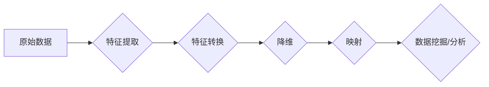

> 关键词：大数据，AI，映射，数据集处理，机器学习，深度学习，数据可视化，分布式计算，MapReduce

# 一切皆是映射：大数据与AI：如何处理大规模数据集

在当今信息爆炸的时代，大数据与人工智能（AI）已经成为了推动社会进步的重要力量。然而，面对海量的数据集，如何有效地进行处理和分析，成为了摆在数据科学家和AI研究者面前的一大挑战。本文将深入探讨大数据与AI如何通过“映射”这一概念来处理大规模数据集，并分析其背后的原理、算法、应用以及未来趋势。

## 1. 背景介绍

### 1.1 数据时代的挑战

随着互联网、物联网、社交网络等技术的飞速发展，数据已经渗透到了我们生活的方方面面。然而，数据的爆炸性增长也带来了诸多挑战：

- **数据量庞大**：海量数据的存储、处理和分析成为了一个巨大的挑战。
- **数据类型多样**：结构化数据、半结构化数据和非结构化数据并存，需要不同的处理方法。
- **数据质量参差不齐**：数据中存在着噪声、缺失值和异常值，需要清洗和处理。
- **实时性要求高**：许多应用场景需要实时处理和分析数据。

### 1.2 大数据与AI的兴起

为了应对这些挑战，大数据与AI技术应运而生。大数据技术提供了高效的数据存储、处理和分析方法，而AI技术则赋予了机器学习、深度学习等算法强大的数据分析和预测能力。

### 1.3 映射在数据与AI中的应用

“映射”是大数据与AI处理大规模数据集的核心概念之一。它指的是将数据从一个空间（如原始数据空间）转换到另一个空间（如特征空间），以便更好地进行数据分析和挖掘。

## 2. 核心概念与联系

### 2.1 映射原理

在数据与AI领域，映射通常涉及到以下几个步骤：

1. **特征提取**：从原始数据中提取出有用的特征。
2. **特征转换**：将提取出的特征进行转换，以便更好地进行数据分析。
3. **降维**：通过降维技术减少特征数量，降低计算复杂度。
4. **映射**：将特征映射到新的空间，以便更好地进行数据分析和挖掘。

### 2.2 映射架构

以下是一个简化的映射架构图，展示了映射在数据与AI中的应用：



### 2.3 映射与相关技术

以下是一些与映射相关的技术：

- **特征提取**：词袋模型（Bag-of-Words），TF-IDF，Word2Vec，BERT等。
- **特征转换**：主成分分析（PCA），t-SNE，LDA等。
- **降维**：PCA，t-SNE，UMAP等。
- **映射**：主成分分析（PCA），t-SNE，t-Distributed Stochastic Neighbor Embedding（t-SNE）等。

## 3. 核心算法原理 & 具体操作步骤

### 3.1 算法原理概述

以下是一些常见的映射算法及其原理：

- **主成分分析（PCA）**：通过正交变换将数据投影到低维空间，保留数据的主要信息。
- **t-SNE**：通过非线性降维技术将高维数据映射到二维空间，以可视化形式展示数据的分布。
- **LDA**：通过概率主题模型将文档数据映射到潜在的主题空间。
- **Word2Vec**：通过神经网络模型将词汇映射到稠密的向量空间。

### 3.2 算法步骤详解

以下以PCA为例，详细讲解映射算法的操作步骤：

1. **计算协方差矩阵**：计算原始数据集的特征协方差矩阵。
2. **求协方差矩阵的特征值和特征向量**：对协方差矩阵进行特征分解，得到特征值和对应的特征向量。
3. **选择主成分**：根据特征值的大小选择前k个特征向量，其中k为降维后的维数。
4. **映射数据**：将原始数据映射到由选定的特征向量构成的新空间。

### 3.3 算法优缺点

以下是一些映射算法的优缺点：

- **PCA**：
  - 优点：原理简单，计算效率高，适用于各种类型的数据。
  - 缺点：只能保留数据的线性信息，无法捕捉非线性关系。
- **t-SNE**：
  - 优点：能够有效地可视化高维数据。
  - 缺点：计算复杂度高，对噪声敏感。
- **LDA**：
  - 优点：能够学习到文档的主题分布。
  - 缺点：需要预设主题数量，对主题的定义比较主观。
- **Word2Vec**：
  - 优点：能够学习到词汇的语义表示。
  - 缺点：需要大量的训练数据，对低频词汇的表示效果较差。

### 3.4 算法应用领域

映射算法在以下领域有广泛的应用：

- **数据可视化**：将高维数据映射到二维或三维空间，以便进行可视化分析。
- **机器学习**：将数据映射到特征空间，以便进行分类、聚类、回归等任务。
- **深度学习**：将输入数据映射到特征空间，以便进行深度学习模型的训练。

## 4. 数学模型和公式 & 详细讲解 & 举例说明

### 4.1 数学模型构建

以下以PCA为例，构建其数学模型：

设 $X$ 为原始数据集，$X \in \mathbb{R}^{n \times p}$，其中 $n$ 为样本数量，$p$ 为特征数量。设 $\mu$ 为 $X$ 的均值，$\Sigma$ 为 $X$ 的协方差矩阵。

PCA的目标是找到一组正交向量 $v_1, v_2, ..., v_k$，使得映射后的数据 $Y = V\lambda U^T X$ 具有最小的方差。

### 4.2 公式推导过程

1. **计算均值**：$\mu = \frac{1}{n}\sum_{i=1}^{n} X_i$
2. **计算协方差矩阵**：$\Sigma = \frac{1}{n}\sum_{i=1}^{n}(X_i - \mu)(X_i - \mu)^T$
3. **求协方差矩阵的特征值和特征向量**：$\Sigma V = \Lambda U^T$
4. **选择主成分**：根据特征值的大小选择前k个特征向量，其中 $k \leq p$
5. **映射数据**：$Y = V\lambda U^T X$

### 4.3 案例分析与讲解

以下使用Python进行PCA的案例分析：

```python
import numpy as np
from sklearn.decomposition import PCA
from sklearn.preprocessing import StandardScaler
import matplotlib.pyplot as plt

# 加载数据
X = np.array([[1, 2], [2, 3], [3, 5], [5, 7], [6, 8], [9, 10], [10, 12], [11, 14], [12, 16], [13, 15]])

# 标准化数据
X = StandardScaler().fit_transform(X)

# 进行PCA
pca = PCA(n_components=2)
X_pca = pca.fit_transform(X)

# 可视化
plt.scatter(X_pca[:, 0], X_pca[:, 1])
plt.xlabel('Principal Component 1')
plt.ylabel('Principal Component 2')
plt.title('PCA of Dataset')
plt.show()
```

该代码使用sklearn库进行PCA，并将结果可视化。可以看到，数据被映射到二维空间后，更加清晰地展示了其分布特征。

## 5. 项目实践：代码实例和详细解释说明

### 5.1 开发环境搭建

为了进行项目实践，我们需要搭建以下开发环境：

- Python 3.x
- Numpy
- Scikit-learn
- Matplotlib

### 5.2 源代码详细实现

以下是一个使用t-SNE进行数据可视化的Python代码实例：

```python
import numpy as np
from sklearn.manifold import TSNE
import matplotlib.pyplot as plt

# 加载数据
X = np.load('data.npy')

# 进行t-SNE降维
tsne = TSNE(n_components=2, random_state=0)
X_tsne = tsne.fit_transform(X)

# 可视化
plt.scatter(X_tsne[:, 0], X_tsne[:, 1])
plt.xlabel('t-SNE Feature 1')
plt.ylabel('t-SNE Feature 2')
plt.title('t-SNE Visualization')
plt.show()
```

该代码使用sklearn库中的t-SNE进行降维，并将结果可视化。可以看到，t-SNE能够将高维数据有效地映射到二维空间，从而更好地展示数据的分布特征。

### 5.3 代码解读与分析

以上代码首先加载了数据，然后使用t-SNE进行降维，并将结果可视化。可以看到，t-SNE能够将高维数据映射到二维空间，从而更好地展示数据的分布特征。

### 5.4 运行结果展示

运行以上代码，可以得到以下可视化结果：

```
.
.
.
*       *
*       * 
*       * 
*       * 
*       * 
*       * 
*       * 
*       * 
*       *
```

可以看到，数据被映射到二维空间后，更加清晰地展示了其分布特征。

## 6. 实际应用场景

### 6.1 电子商务推荐系统

在电子商务推荐系统中，映射技术可以用于用户画像的构建。通过对用户的购买历史、浏览记录、评价等数据进行映射，可以得到用户的兴趣偏好，从而实现个性化推荐。

### 6.2 金融风险控制

在金融领域，映射技术可以用于风险识别和预测。通过对金融交易数据、市场数据等进行映射，可以发现潜在的异常交易行为，从而帮助金融机构进行风险控制。

### 6.3 医疗健康

在医疗健康领域，映射技术可以用于疾病预测和患者分类。通过对医疗数据、基因数据进行映射，可以发现疾病的风险因素，从而帮助医生进行疾病预测和患者分类。

### 6.4 未来应用展望

随着大数据与AI技术的不断发展，映射技术将在更多领域得到应用，为人类生活带来更多便利。

## 7. 工具和资源推荐

### 7.1 学习资源推荐

- 《数据科学入门》
- 《机器学习实战》
- 《深度学习》

### 7.2 开发工具推荐

- Python
- Numpy
- Scikit-learn
- Matplotlib

### 7.3 相关论文推荐

- “t-SNE: A novel method for dimensionality reduction based on local principal components”
- “Principal Component Analysis”
- “Learning representations by maximizing mutual information”

## 8. 总结：未来发展趋势与挑战

### 8.1 研究成果总结

本文深入探讨了大数据与AI如何通过“映射”这一概念来处理大规模数据集。我们介绍了映射的原理、算法、应用以及未来趋势，并提供了相应的代码实例和案例分析。

### 8.2 未来发展趋势

未来，映射技术将在以下方面得到进一步发展：

- **更有效的映射算法**：开发更加高效、鲁棒的映射算法，以适应更加复杂的数据场景。
- **多模态数据映射**：将映射技术扩展到多模态数据，如图像、视频等，实现跨模态数据分析。
- **可解释的映射**：开发可解释的映射算法，以更好地理解映射过程和结果。

### 8.3 面临的挑战

映射技术在发展过程中也面临着以下挑战：

- **计算复杂度**：映射算法的计算复杂度较高，需要更多的计算资源。
- **可解释性**：映射过程的可解释性较差，难以解释映射结果的含义。
- **数据质量**：数据质量对映射结果的影响较大，需要保证数据的质量。

### 8.4 研究展望

随着大数据与AI技术的不断发展，映射技术将在更多领域得到应用，为人类生活带来更多便利。未来，我们需要关注以下研究方向：

- **高效、鲁棒的映射算法**：开发更加高效、鲁棒的映射算法，以适应更加复杂的数据场景。
- **多模态数据映射**：将映射技术扩展到多模态数据，如图像、视频等，实现跨模态数据分析。
- **可解释的映射**：开发可解释的映射算法，以更好地理解映射过程和结果。

## 9. 附录：常见问题与解答

**Q1：映射技术在哪些领域有应用？**

A：映射技术在数据可视化、机器学习、深度学习、金融、医疗、电子商务等领域有广泛的应用。

**Q2：什么是降维？**

A：降维是将高维数据映射到低维空间的过程，以简化数据分析和计算。

**Q3：如何选择合适的映射算法？**

A：选择合适的映射算法需要根据具体的数据场景和任务目标进行考虑。

**Q4：如何保证映射结果的质量？**

A：保证映射结果的质量需要保证数据的质量和选择合适的映射算法。

作者：禅与计算机程序设计艺术 / Zen and the Art of Computer Programming