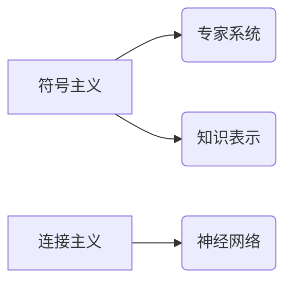

# 人工智能研究的早期方向

> 关键词：人工智能，机器学习，深度学习，知识表示，专家系统，符号主义，连接主义，强化学习，自然语言处理

## 1. 背景介绍

人工智能（Artificial Intelligence, AI）作为一门交叉学科，自20世纪50年代诞生以来，经历了数次的兴衰。早期的人工智能研究主要集中在几个核心方向，这些方向不仅定义了AI研究的早期轮廓，也为后来的发展奠定了坚实的基础。本篇博客将探讨人工智能研究的早期方向，分析其原理、应用和影响。

## 2. 核心概念与联系

### 2.1 核心概念原理

人工智能研究的早期方向主要包括以下几类：

- **符号主义（Symbolism）**：基于逻辑和符号操作，强调知识表示和推理。
- **连接主义（Connectionism）**：基于人工神经网络，通过调整连接权重进行学习。
- **专家系统（Expert Systems）**：模拟专家决策过程，用于特定领域的问题解决。
- **知识表示（Knowledge Representation）**：研究如何将知识编码到计算机系统中。

Mermaid流程图如下：



### 2.2 联系

这些早期方向之间存在紧密的联系。例如，符号主义和知识表示共同关注如何将知识编码到系统中，而专家系统和连接主义则分别通过规则和神经网络来实现知识的应用和更新。

## 3. 核心算法原理 & 具体操作步骤

### 3.1 算法原理概述

#### 3.1.1 符号主义

符号主义方法的核心思想是使用符号逻辑来表示知识和推理。这种方法依赖于形式化的语言和严格的推理规则。一个典型的符号主义系统包括以下组件：

- 知识库：存储领域知识。
- 推理引擎：根据规则和事实进行推理。

#### 3.1.2 连接主义

连接主义方法基于人工神经网络，通过模拟人脑神经元之间的连接来学习数据和模式。神经网络由多个层组成，包括输入层、隐藏层和输出层。学习过程涉及调整连接权重，以优化网络的性能。

#### 3.1.3 专家系统

专家系统通过模拟人类专家的知识和推理过程来解决特定领域的问题。它们通常包括以下步骤：

1. 知识获取：从专家那里获取领域知识。
2. 知识表示：将知识编码为规则和事实。
3. 问题求解：根据规则和事实进行推理，以解决问题。

### 3.2 算法步骤详解

#### 3.2.1 符号主义

符号主义方法的步骤通常包括：

1. 定义问题空间和操作符。
2. 构建知识库和推理引擎。
3. 使用推理引擎根据规则和事实解决问题。

#### 3.2.2 连接主义

连接主义方法的步骤通常包括：

1. 设计神经网络结构。
2. 选择合适的激活函数。
3. 训练网络，调整连接权重。
4. 使用训练好的网络进行预测。

#### 3.2.3 专家系统

专家系统的步骤通常包括：

1. 确定问题领域和目标。
2. 收集并整理专家知识。
3. 将知识编码为规则和事实。
4. 设计推理策略和用户界面。
5. 集成和测试系统。

### 3.3 算法优缺点

#### 3.3.1 符号主义

优点：

- 理论基础扎实。
- 可解释性强。
- 易于理解和使用。

缺点：

- 知识表示困难。
- 推理速度慢。

#### 3.3.2 连接主义

优点：

- 学习能力强。
- 可以处理复杂的数据和模式。

缺点：

- 难以解释。
- 计算资源需求高。

#### 3.3.3 专家系统

优点：

- 适用于特定领域的问题解决。
- 可以处理不确定性。

缺点：

- 知识获取困难。
- 扩展性差。

### 3.4 算法应用领域

- **符号主义**：逻辑编程、自动推理。
- **连接主义**：图像识别、语音识别。
- **专家系统**：医疗诊断、故障诊断。

## 4. 数学模型和公式 & 详细讲解 & 举例说明

### 4.1 数学模型构建

#### 4.1.1 符号主义

符号主义方法通常使用逻辑公式来表示知识。例如，以下公式表示“所有的人都会死亡”：

$$
\forall x (Person(x) \rightarrow Death(x))
$$

#### 4.1.2 连接主义

连接主义方法使用神经网络来表示知识。以下是一个简单的神经网络结构：

```
输入层: x1, x2
隐藏层: f(x1, x2)
输出层: y
```

其中，`f` 是激活函数。

#### 4.1.3 专家系统

专家系统使用规则和事实来表示知识。以下是一个专家系统中的规则：

```
如果 患有流感症状 且 体温超过38度
则 诊断 为 流感
```

### 4.2 公式推导过程

#### 4.2.1 符号主义

符号主义方法的公式推导过程通常遵循逻辑规则。

#### 4.2.2 连接主义

连接主义方法的公式推导过程涉及反向传播算法，用于计算网络参数的梯度。

#### 4.2.3 专家系统

专家系统的公式推导过程涉及推理算法，用于根据规则和事实进行推理。

### 4.3 案例分析与讲解

#### 4.3.1 符号主义

以自动推理为例，给定以下知识：

```
如果 x 是红色的 且 x 是圆的
则 x 是球
```

以及事实：

```
x 是红色的
x 是圆的
```

我们可以得出结论：`x` 是球。

#### 4.3.2 连接主义

以图像识别为例，给定一组图像和对应的标签，神经网络通过学习图像特征来识别新的图像。

#### 4.3.3 专家系统

以医疗诊断为例，专家系统根据患者的症状和体征，结合医学知识库，给出诊断建议。

## 5. 项目实践：代码实例和详细解释说明

### 5.1 开发环境搭建

以Python为例，搭建以下开发环境：

1. 安装Python 3.8及以上版本。
2. 安装PyTorch或TensorFlow等深度学习框架。
3. 安装Scikit-learn等机器学习库。

### 5.2 源代码详细实现

以下是一个简单的神经网络实现：

```python
import torch
import torch.nn as nn

class SimpleNN(nn.Module):
    def __init__(self):
        super(SimpleNN, self).__init__()
        self.fc1 = nn.Linear(2, 10)
        self.fc2 = nn.Linear(10, 1)
        
    def forward(self, x):
        x = torch.relu(self.fc1(x))
        x = self.fc2(x)
        return x

# 创建模型
model = SimpleNN()

# 训练模型
# ...

# 使用模型进行预测
# ...
```

### 5.3 代码解读与分析

以上代码定义了一个简单的神经网络，包括两个全连接层。网络输入两个特征，输出一个结果。

### 5.4 运行结果展示

假设我们使用随机数据训练和测试该模型，最终得到的测试集准确率可能在一定范围内波动。

## 6. 实际应用场景

### 6.1 符号主义

符号主义方法在逻辑编程、自动推理等领域有着广泛的应用。

### 6.2 连接主义

连接主义方法在图像识别、语音识别等领域取得了显著成果。

### 6.3 专家系统

专家系统在医疗诊断、故障诊断等领域发挥着重要作用。

## 7. 工具和资源推荐

### 7.1 学习资源推荐

- 《人工智能：一种现代的方法》（Artificial Intelligence: A Modern Approach）
- 《神经网络与深度学习》（Neural Networks and Deep Learning）
- 《机器学习》（Machine Learning）

### 7.2 开发工具推荐

- Python编程语言
- PyTorch或TensorFlow深度学习框架
- Scikit-learn机器学习库

### 7.3 相关论文推荐

- 《感知器》（Perceptrons）
- 《人工神经网络：一种计算模型》（Artificial Neural Networks: A Comprehensive Foundation）
- 《机器学习：概率视角》（Machine Learning: A Probabilistic Perspective）

## 8. 总结：未来发展趋势与挑战

### 8.1 研究成果总结

人工智能研究的早期方向为后来的发展奠定了坚实的基础。符号主义、连接主义和专家系统等方向在理论和实践上都取得了显著的成果。

### 8.2 未来发展趋势

人工智能未来的发展趋势包括：

- 深度学习与传统方法的结合。
- 多模态人工智能的发展。
- 人工智能与认知科学的结合。
- 人工智能与伦理道德的结合。

### 8.3 面临的挑战

人工智能面临的挑战包括：

- 数据隐私和安全问题。
- 模型可解释性问题。
- 人工智能与人类智能的差距。

### 8.4 研究展望

人工智能的未来研究将更加注重跨学科融合，以及与人类价值观和伦理道德的结合。通过解决数据、算法和伦理等方面的挑战，人工智能将为人类社会带来更多的机遇和福祉。

## 9. 附录：常见问题与解答

**Q1：什么是人工智能？**

A：人工智能是指使计算机系统具备类似人类智能的能力，如学习、推理、感知、理解等。

**Q2：什么是机器学习？**

A：机器学习是人工智能的一个分支，通过让计算机从数据中学习规律，从而实现特定任务的自动化。

**Q3：什么是深度学习？**

A：深度学习是机器学习的一个子领域，使用深层神经网络来学习数据的复杂模式。

**Q4：什么是专家系统？**

A：专家系统是模拟人类专家决策过程的人工智能系统，用于特定领域的问题解决。

**Q5：人工智能有哪些应用？**

A：人工智能的应用领域非常广泛，包括医疗、金融、交通、教育等。

---

作者：禅与计算机程序设计艺术 / Zen and the Art of Computer Programming