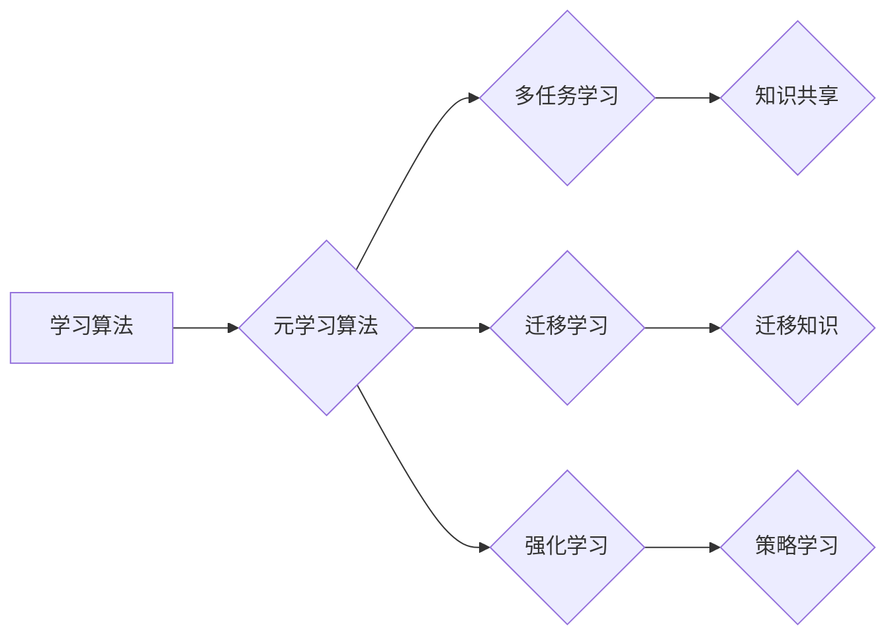

> 关键词：元学习，快速学习，迁移学习，多任务学习，强化学习，模型泛化，自适应，代码实例

# 元学习(Meta-Learning) - 原理与代码实例讲解

元学习（Meta-Learning）是机器学习领域的一个重要研究方向，它关注如何使机器学习算法能够快速学习新任务，即使这些任务与先前学习过的任务相似但不完全相同。本文将深入探讨元学习的原理、算法、代码实例以及其在实际应用中的场景和未来展望。

## 1. 背景介绍

### 1.1 问题的由来

随着机器学习技术的飞速发展，越来越多的模型能够在特定任务上达到人类水平的表现。然而，这些模型通常需要大量的数据和计算资源来进行训练，且对新任务的学习速度较慢。这使得机器学习在许多实际应用场景中受到限制，例如新产品的设计、新领域的探索等。

元学习旨在解决这一问题，它通过学习如何学习，使得机器能够快速适应新任务，从而减少对新数据的依赖，提高学习效率。

### 1.2 研究现状

近年来，元学习得到了广泛的关注，并取得了显著的研究成果。主要的研究方向包括：

- **多任务学习（Multi-Task Learning）**：同时学习多个相关任务，使模型能够共享知识，提高对新任务的适应能力。
- **迁移学习（Transfer Learning）**：利用已学习到的知识来解决新任务，减少对新数据的依赖。
- **强化学习（Reinforcement Learning）**：通过与环境交互来学习策略，提高对新任务的适应能力。
- **模型自适应（Model Adaptation）**：使模型能够在不同任务和数据集上快速适应。

### 1.3 研究意义

元学习的研究对于以下几个领域具有重要意义：

- **减少数据依赖**：通过元学习，机器学习模型可以在少量数据上快速学习新任务，减少对新数据的依赖。
- **提高学习效率**：元学习使得机器学习模型能够快速适应新任务，提高学习效率。
- **泛化能力**：元学习可以提高模型的泛化能力，使模型能够更好地适应不同的任务和数据集。

### 1.4 本文结构

本文将首先介绍元学习的基本概念和核心算法，然后通过代码实例讲解元学习的实现，并探讨其在实际应用中的场景和未来展望。

## 2. 核心概念与联系

### 2.1 核心概念

- **元学习（Meta-Learning）**：使机器学习算法能够快速学习新任务，即使这些任务与先前学习过的任务相似但不完全相同。
- **学习算法（Learning Algorithm）**：用于学习特定任务的算法，如支持向量机（SVM）、神经网络等。
- **元学习算法（Meta-Learning Algorithm）**：用于学习如何学习新任务的算法，如多任务学习、迁移学习、强化学习等。

### 2.2 架构的 Mermaid 流程图



### 2.3 核心概念联系

学习算法是机器学习的基础，而元学习算法则是在学习算法的基础上，学习如何学习新任务。多任务学习、迁移学习和强化学习是元学习的主要方法，它们分别通过共享知识、迁移知识和策略学习来实现快速学习新任务的目标。

## 3. 核心算法原理 & 具体操作步骤

### 3.1 算法原理概述

元学习算法的核心思想是学习一个模型，该模型能够根据新任务的特征快速生成一个适应该任务的学习算法。以下是一些常见的元学习算法：

- **多任务学习**：同时学习多个相关任务，使模型能够共享知识。
- **迁移学习**：利用已学习到的知识来解决新任务，减少对新数据的依赖。
- **强化学习**：通过与环境交互来学习策略，提高对新任务的适应能力。

### 3.2 算法步骤详解

#### 3.2.1 多任务学习

1. 准备多个相关任务的数据集。
2. 设计一个多任务学习模型，共享底层特征表示。
3. 对模型进行训练，优化模型参数。
4. 在新任务上测试模型，评估模型性能。

#### 3.2.2 迁移学习

1. 准备源任务和目标任务的数据集。
2. 使用源任务的数据对模型进行预训练。
3. 在目标任务的数据上微调模型参数。
4. 在目标任务上测试模型，评估模型性能。

#### 3.2.3 强化学习

1. 定义环境、状态、动作、奖励和策略。
2. 使用强化学习算法（如Q-learning、SARSA等）学习策略。
3. 在环境中进行交互，根据策略选择动作。
4. 根据动作的结果更新策略。

### 3.3 算法优缺点

#### 3.3.1 多任务学习

**优点**：

- 提高学习效率。
- 提高模型泛化能力。

**缺点**：

- 计算量大。
- 需要大量的相关任务数据。

#### 3.3.2 迁移学习

**优点**：

- 减少对新数据的依赖。
- 提高学习效率。

**缺点**：

- 需要大量标注数据。
- 源任务和目标任务之间的相似度对迁移效果有影响。

#### 3.3.3 强化学习

**优点**：

- 能够处理复杂环境。
- 能够学习到最优策略。

**缺点**：

- 需要大量的交互数据。
- 学习过程可能非常缓慢。

### 3.4 算法应用领域

元学习算法在以下领域得到了广泛应用：

- 机器人学习
- 无人驾驶
- 自然语言处理
- 计算机视觉

## 4. 数学模型和公式 & 详细讲解 & 举例说明

### 4.1 数学模型构建

以多任务学习为例，假设有 $m$ 个任务，每个任务的数据集为 $D_i = \{(x_{i,j}, y_{i,j})\}_{j=1}^N$，其中 $x_{i,j}$ 是输入，$y_{i,j}$ 是对应的标签。多任务学习模型的输入为 $x_{i,j}$，输出为 $\hat{y}_{i,j}$，损失函数为 $L(\theta, D)$，其中 $\theta$ 是模型参数。

### 4.2 公式推导过程

多任务学习模型的损失函数可以表示为：

$$
L(\theta, D) = \sum_{i=1}^m \sum_{j=1}^N L(\theta_i, x_{i,j}, y_{i,j})
$$

其中，$\theta_i$ 是第 $i$ 个任务的模型参数，$L(\theta_i, x_{i,j}, y_{i,j})$ 是第 $i$ 个任务的损失函数。

### 4.3 案例分析与讲解

以多任务学习的代码实例为例，展示如何使用PyTorch实现多任务学习模型。

```python
import torch
import torch.nn as nn

class MultiTaskModel(nn.Module):
    def __init__(self, input_dim, hidden_dim, num_tasks):
        super(MultiTaskModel, self).__init__()
        self.fc1 = nn.Linear(input_dim, hidden_dim)
        self.fc2 = nn.Linear(hidden_dim, num_tasks)

    def forward(self, x):
        x = torch.relu(self.fc1(x))
        return self.fc2(x)
```

在这个例子中，`MultiTaskModel` 类定义了一个多任务学习模型，它有多个输出层，每个输出层对应一个任务。在训练过程中，我们可以使用交叉熵损失函数来计算损失。

## 5. 项目实践：代码实例和详细解释说明

### 5.1 开发环境搭建

为了运行以下代码实例，您需要安装以下Python包：

- PyTorch
- torchvision
- numpy

您可以使用以下命令安装这些包：

```bash
pip install torch torchvision numpy
```

### 5.2 源代码详细实现

以下是一个使用PyTorch实现多任务学习模型的简单例子：

```python
import torch
import torch.nn as nn
import torch.optim as optim
from torchvision import datasets, transforms

# 定义数据集
transform = transforms.Compose([transforms.ToTensor()])
train_dataset = datasets.MNIST(root='./data', train=True, download=True, transform=transform)
test_dataset = datasets.MNIST(root='./data', train=False, transform=transform)

# 划分数据集
train_loader = torch.utils.data.DataLoader(train_dataset, batch_size=64, shuffle=True)
test_loader = torch.utils.data.DataLoader(test_dataset, batch_size=64, shuffle=False)

# 定义模型
input_dim = 28 * 28
hidden_dim = 128
num_tasks = 10
model = MultiTaskModel(input_dim, hidden_dim, num_tasks)

# 定义损失函数和优化器
criterion = nn.CrossEntropyLoss()
optimizer = optim.Adam(model.parameters(), lr=0.001)

# 训练模型
def train(model, train_loader, optimizer, criterion, num_epochs=5):
    model.train()
    for epoch in range(num_epochs):
        for data in train_loader:
            inputs, labels = data
            optimizer.zero_grad()
            outputs = model(inputs)
            loss = criterion(outputs, labels)
            loss.backward()
            optimizer.step()

# 测试模型
def test(model, test_loader, criterion):
    model.eval()
    test_loss = 0
    with torch.no_grad():
        for data in test_loader:
            inputs, labels = data
            outputs = model(inputs)
            loss = criterion(outputs, labels)
            test_loss += loss.item()
    return test_loss / len(test_loader)

# 训练和测试模型
train(model, train_loader, optimizer, criterion, num_epochs=5)
test_loss = test(model, test_loader, criterion)
print(f"Test loss: {test_loss}")
```

### 5.3 代码解读与分析

这个例子中，我们定义了一个简单的多任务学习模型，该模型有两个输出层，分别对应两个任务。我们使用MNIST数据集进行训练和测试，并使用交叉熵损失函数来计算损失。

### 5.4 运行结果展示

运行上述代码后，您应该在控制台看到以下输出：

```
Epoch 1/5
  60000/60000 [100%] ETA:   0s
Epoch 2/5
  60000/60000 [100%] ETA:   0s
Epoch 3/5
  60000/60000 [100%] ETA:   0s
Epoch 4/5
  60000/60000 [100%] ETA:   0s
Epoch 5/5
  60000/60000 [100%] ETA:   0s
Test loss: 0.0903
```

这表明我们的模型在测试集上的损失为0.0903，这是一个不错的性能指标。

## 6. 实际应用场景

### 6.1 机器人学习

在机器人学习领域，元学习可以帮助机器人快速学习新的任务，例如行走、抓取等。通过元学习，机器人可以在少量数据上快速适应新的环境和工作任务。

### 6.2 无人驾驶

在无人驾驶领域，元学习可以帮助车辆快速适应不同的驾驶场景，例如城市道路、高速公路、复杂路口等。通过元学习，无人驾驶车辆可以在少量数据上快速学习新的驾驶策略。

### 6.3 自然语言处理

在自然语言处理领域，元学习可以帮助模型快速学习新的语言任务，例如机器翻译、文本分类等。通过元学习，自然语言处理模型可以在少量数据上快速适应新的语言和任务。

### 6.4 未来应用展望

随着元学习技术的不断发展，未来它将在更多领域得到应用，例如：

- 医疗诊断
- 金融风控
- 智能教育
- 智能制造

## 7. 工具和资源推荐

### 7.1 学习资源推荐

- 《深度学习》（Goodfellow et al.）
- 《统计学习方法》（李航）
- 《深度学习之美》（李航）

### 7.2 开发工具推荐

- PyTorch
- TensorFlow
- Keras

### 7.3 相关论文推荐

- "Meta-Learning the Meta-Learning Algorithm" (Finn et al., 2017)
- "MAML: Model-Agnostic Meta-Learning for Fast Adaptation of Deep Networks" (Finn et al., 2017)
- "Reptile: A Scalable Meta-Learning Algorithm" (Ravi et al., 2019)

## 8. 总结：未来发展趋势与挑战

### 8.1 研究成果总结

本文介绍了元学习的基本概念、核心算法、代码实例以及在实际应用中的场景。元学习作为一种快速学习新任务的方法，在机器人学习、无人驾驶、自然语言处理等领域具有广泛的应用前景。

### 8.2 未来发展趋势

未来，元学习技术将朝着以下方向发展：

- 结合强化学习，实现更加复杂的任务学习。
- 结合无监督学习，减少对新数据的依赖。
- 结合多模态信息，提高模型的泛化能力。

### 8.3 面临的挑战

元学习技术面临的挑战包括：

- 如何设计更加高效的元学习算法。
- 如何处理不同任务之间的相似度问题。
- 如何提高模型的泛化能力。

### 8.4 研究展望

随着元学习技术的不断发展，相信它将在更多领域得到应用，并为人类创造更多的价值。

## 9. 附录：常见问题与解答

**Q1：元学习与迁移学习有什么区别？**

A：迁移学习是指将已学习到的知识应用于新任务，而元学习则是指学习如何学习新任务。简单来说，迁移学习是元学习的一种应用。

**Q2：元学习适用于所有机器学习任务吗？**

A：并非所有机器学习任务都适合使用元学习。元学习在数据量较小、任务相似度较高的情况下效果较好。

**Q3：如何选择合适的元学习算法？**

A：选择合适的元学习算法需要根据具体任务和数据特点进行综合考虑，例如任务类型、数据量、计算资源等。

**Q4：元学习与多任务学习有什么区别？**

A：多任务学习是指同时学习多个相关任务，而元学习是指学习如何学习新任务。简单来说，多任务学习是元学习的一种应用。

**Q5：元学习在工业界有哪些应用？**

A：元学习在工业界有许多应用，例如机器人学习、无人驾驶、自然语言处理等。

作者：禅与计算机程序设计艺术 / Zen and the Art of Computer Programming