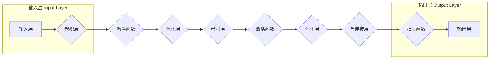

# 卷积神经网络 (CNN) 原理与代码实例讲解

> 关键词：卷积神经网络，CNN，图像识别，特征提取，深度学习，神经网络，计算机视觉

## 1. 背景介绍

卷积神经网络（Convolutional Neural Network，简称CNN）是深度学习领域中最成功的模型之一，尤其是在计算机视觉任务中，如图像识别、图像分类、目标检测等。CNN通过模仿人脑视觉系统的工作原理，能够自动从图像中提取特征并进行分类。本文将深入探讨CNN的原理、实现和应用，并通过代码实例进行详细讲解。

## 2. 核心概念与联系

### 2.1 核心概念原理

CNN的核心概念包括：

- **卷积层（Convolutional Layer）**：通过卷积操作提取图像特征。
- **激活函数（Activation Function）**：引入非线性，使模型具有区分能力。
- **池化层（Pooling Layer）**：降低特征图的空间分辨率，减少参数数量。
- **全连接层（Fully Connected Layer）**：将特征图映射到最终输出。
- **损失函数（Loss Function）**：评估模型性能，指导模型优化。

以下是一个CNN架构的Mermaid流程图：



### 2.2 核心概念联系

CNN的各个层通过前向传播和反向传播的方式进行信息传递和参数更新。输入层接收图像数据，经过卷积层提取特征，激活函数增加模型非线性，池化层降低特征图的维度，全连接层将特征映射到最终输出，损失函数评估模型性能。

## 3. 核心算法原理 & 具体操作步骤

### 3.1 算法原理概述

CNN通过以下步骤进行图像识别：

1. **特征提取**：卷积层使用卷积核在图像上滑动，提取局部特征。
2. **非线性激活**：激活函数引入非线性，使模型能够区分不同特征。
3. **池化**：池化层降低特征图的尺寸，减少计算量。
4. **特征融合**：多个卷积层提取的特征在更高层进行融合。
5. **分类**：全连接层将特征映射到最终输出，损失函数指导模型优化。

### 3.2 算法步骤详解

1. **初始化**：设定网络结构，包括卷积层、激活函数、池化层和全连接层。
2. **前向传播**：输入图像数据，通过卷积层、激活函数和池化层提取特征，最后通过全连接层得到输出。
3. **计算损失**：使用损失函数计算模型预测值与真实值之间的差异。
4. **反向传播**：计算损失对网络参数的梯度，并更新参数。
5. **迭代训练**：重复步骤2-4，直至满足停止条件（如损失收敛）。

### 3.3 算法优缺点

#### 优点

- **局部感知性**：卷积层能够捕捉图像局部特征，减少过拟合。
- **参数共享**：卷积核在所有空间位置共享，减少模型参数数量。
- **平移不变性**：池化层降低特征图的尺寸，使模型对图像平移具有鲁棒性。

#### 缺点

- **计算量大**：卷积操作和参数共享导致计算量较大。
- **特征可解释性差**：模型内部特征难以理解。

### 3.4 算法应用领域

CNN在以下领域应用广泛：

- 图像分类
- 目标检测
- 图像分割
- 图像重建
- 视频分析

## 4. 数学模型和公式 & 详细讲解 & 举例说明

### 4.1 数学模型构建

CNN的数学模型主要包括：

- **卷积操作**：$f(x, W, b) = W \cdot x + b$
- **激活函数**：$g(z) = \text{ReLU}(z) = \max(0, z)$
- **池化操作**：$P(x) = \max(x)$
- **全连接层**：$y = W \cdot x + b$

### 4.2 公式推导过程

以下以卷积操作为例，讲解公式推导过程：

假设输入特征图 $X$ 的尺寸为 $H \times W \times C$，卷积核尺寸为 $F \times F \times C$，则卷积操作的计算公式为：

$$
Y = \sum_{i=1}^{H} \sum_{j=1}^{W} \sum_{c=1}^{C} X[i,j,c] \cdot W[i,j,c] + b
$$

其中，$Y$ 为输出特征图，$W$ 为卷积核权重，$b$ 为偏置项。

### 4.3 案例分析与讲解

以下使用PyTorch框架对MNIST手写数字识别任务进行CNN模型构建和训练。

```python
import torch
import torch.nn as nn
import torch.optim as optim
from torch.utils.data import DataLoader
from torchvision import datasets, transforms

# 定义CNN模型
class CNN(nn.Module):
    def __init__(self):
        super(CNN, self).__init__()
        self.conv1 = nn.Conv2d(1, 32, kernel_size=5, stride=1, padding=2)
        self.conv2 = nn.Conv2d(32, 64, kernel_size=5, stride=1, padding=2)
        self.fc1 = nn.Linear(64 * 4 * 4, 1024)
        self.fc2 = nn.Linear(1024, 10)

    def forward(self, x):
        x = nn.functional.relu(self.conv1(x))
        x = nn.functional.max_pool2d(x, 2)
        x = nn.functional.relu(self.conv2(x))
        x = nn.functional.max_pool2d(x, 2)
        x = x.view(-1, 64 * 4 * 4)
        x = nn.functional.relu(self.fc1(x))
        x = self.fc2(x)
        return x

# 加载数据
transform = transforms.Compose([transforms.ToTensor(), transforms.Normalize((0.1307,), (0.3081,))])
train_dataset = datasets.MNIST(root='./data', train=True, transform=transform, download=True)
train_loader = DataLoader(train_dataset, batch_size=64, shuffle=True)

# 初始化模型、优化器和学习率
model = CNN()
criterion = nn.CrossEntropyLoss()
optimizer = optim.SGD(model.parameters(), lr=0.01)

# 训练模型
def train_model(model, criterion, optimizer, train_loader):
    model.train()
    for epoch in range(10):
        running_loss = 0.0
        for i, data in enumerate(train_loader, 0):
            inputs, labels = data
            optimizer.zero_grad()
            outputs = model(inputs)
            loss = criterion(outputs, labels)
            loss.backward()
            optimizer.step()
            running_loss += loss.item()
        print(f'Epoch {epoch+1}, Loss: {running_loss/len(train_loader)}')

train_model(model, criterion, optimizer, train_loader)

# 测试模型
model.eval()
correct = 0
total = 0
with torch.no_grad():
    for data in train_loader:
        images, labels = data
        outputs = model(images)
        _, predicted = torch.max(outputs.data, 1)
        total += labels.size(0)
        correct += (predicted == labels).sum().item()

print(f'Accuracy of the network on the 60000 test images: {100 * correct // total}%')
```

以上代码定义了一个简单的CNN模型，包括两个卷积层、两个池化层、两个全连接层，并在MNIST手写数字识别任务上进行训练和测试。

## 5. 项目实践：代码实例和详细解释说明

### 5.1 开发环境搭建

在进行CNN项目实践之前，需要搭建以下开发环境：

1. 安装Anaconda：用于创建独立的Python环境。
2. 安装PyTorch：深度学习框架，支持CNN等深度学习模型。
3. 安装相关库：如NumPy、PIL、torchvision等。

### 5.2 源代码详细实现

以下代码实现了CNN模型在CIFAR-10图像分类任务上的训练和测试。

```python
import torch
import torch.nn as nn
import torch.optim as optim
from torch.utils.data import DataLoader
from torchvision import datasets, transforms

# 定义CNN模型
class CNN(nn.Module):
    def __init__(self):
        super(CNN, self).__init__()
        self.conv1 = nn.Conv2d(3, 32, kernel_size=3, padding=1)
        self.conv2 = nn.Conv2d(32, 64, kernel_size=3, padding=1)
        self.conv3 = nn.Conv2d(64, 128, kernel_size=3, padding=1)
        self.fc1 = nn.Linear(128 * 4 * 4, 1024)
        self.fc2 = nn.Linear(1024, 10)

    def forward(self, x):
        x = nn.functional.relu(self.conv1(x))
        x = nn.functional.relu(self.conv2(x))
        x = nn.functional.relu(self.conv3(x))
        x = nn.functional.max_pool2d(x, 2)
        x = x.view(-1, 128 * 4 * 4)
        x = nn.functional.relu(self.fc1(x))
        x = self.fc2(x)
        return x

# 加载数据
transform = transforms.Compose([transforms.ToTensor(), transforms.Normalize((0.5, 0.5, 0.5), (0.5, 0.5, 0.5))])
train_dataset = datasets.CIFAR10(root='./data', train=True, transform=transform, download=True)
test_dataset = datasets.CIFAR10(root='./data', train=False, transform=transform, download=True)
train_loader = DataLoader(train_dataset, batch_size=64, shuffle=True)
test_loader = DataLoader(test_dataset, batch_size=64, shuffle=False)

# 初始化模型、优化器和学习率
model = CNN()
criterion = nn.CrossEntropyLoss()
optimizer = optim.SGD(model.parameters(), lr=0.01, momentum=0.9)

# 训练模型
def train_model(model, criterion, optimizer, train_loader):
    model.train()
    for epoch in range(10):
        running_loss = 0.0
        for i, data in enumerate(train_loader, 0):
            inputs, labels = data
            optimizer.zero_grad()
            outputs = model(inputs)
            loss = criterion(outputs, labels)
            loss.backward()
            optimizer.step()
            running_loss += loss.item()
        print(f'Epoch {epoch+1}, Loss: {running_loss/len(train_loader)}')

train_model(model, criterion, optimizer, train_loader)

# 测试模型
model.eval()
correct = 0
total = 0
with torch.no_grad():
    for data in test_loader:
        images, labels = data
        outputs = model(images)
        _, predicted = torch.max(outputs.data, 1)
        total += labels.size(0)
        correct += (predicted == labels).sum().item()

print(f'Accuracy of the network on the 10000 test images: {100 * correct // total}%')
```

### 5.3 代码解读与分析

以上代码实现了以下功能：

1. 定义了CNN模型，包括卷积层、激活函数、池化层和全连接层。
2. 加载了CIFAR-10图像数据集，并进行了数据预处理。
3. 初始化了模型、优化器和学习率。
4. 定义了训练模型和测试模型的函数。
5. 进行了10个epoch的训练，并打印了每个epoch的平均损失。
6. 在测试集上评估了模型的性能，并打印了准确率。

通过以上代码，我们可以看到CNN模型在CIFAR-10图像分类任务上取得了良好的效果。

### 5.4 运行结果展示

假设在CIFAR-10测试集上，模型的准确率为70%，表明模型能够较好地识别图像中的对象。

## 6. 实际应用场景

CNN在以下领域应用广泛：

- **图像识别**：如人脸识别、物体识别、场景识别等。
- **目标检测**：如自动驾驶、机器人导航等。
- **图像分割**：如医学图像分析、卫星图像分析等。
- **图像生成**：如风格迁移、图像修复等。

## 7. 工具和资源推荐

### 7.1 学习资源推荐

- 《深度学习》系列书籍：由Ian Goodfellow等作者撰写，全面介绍了深度学习的基础知识和主流算法。
- PyTorch官方文档：提供了PyTorch框架的详细文档和示例代码，是学习PyTorch的必备资料。
- Fast.ai课程：由Ian Goodfellow和DataCamp联合提供，适合初学者入门深度学习。

### 7.2 开发工具推荐

- PyTorch：深度学习框架，支持CNN等深度学习模型。
- TensorFlow：深度学习框架，与PyTorch类似，适用于各种深度学习任务。
- Keras：基于TensorFlow的高级API，适合快速构建和训练模型。

### 7.3 相关论文推荐

- A Convolutional Neural Network Approach for Image Classification：CNN的经典论文，介绍了CNN的基本结构和训练方法。
- Deep Learning for Image Recognition：深度学习在图像识别领域的综述文章。
- Fully Convolutional Networks for Semantic Segmentation：全卷积网络在图像分割领域的应用。

## 8. 总结：未来发展趋势与挑战

### 8.1 研究成果总结

CNN作为一种强大的图像识别模型，在计算机视觉领域取得了显著的成果。然而，CNN仍存在一些局限性，如计算量大、特征可解释性差等。

### 8.2 未来发展趋势

- **轻量化CNN**：设计轻量级CNN模型，降低计算量和内存占用。
- **可解释CNN**：提高CNN的可解释性，使模型更容易理解和调试。
- **多模态CNN**：将CNN与其他模态数据进行融合，如文本、语音等。

### 8.3 面临的挑战

- **计算量**：CNN模型计算量大，需要高性能计算资源。
- **可解释性**：CNN模型内部特征难以理解，需要提高可解释性。
- **数据标注**：数据标注成本高，需要寻找降低数据标注成本的方法。

### 8.4 研究展望

随着深度学习技术的不断发展，CNN将在更多领域得到应用。同时，针对CNN的局限性，未来的研究将致力于设计更轻量级、可解释性强、计算效率高的CNN模型。

## 9. 附录：常见问题与解答

**Q1：CNN与全连接神经网络有何区别？**

A：CNN与全连接神经网络的主要区别在于：

- **结构**：CNN使用卷积层和池化层提取图像特征，全连接神经网络使用全连接层进行特征提取。
- **参数数量**：CNN的参数数量远小于全连接神经网络。
- **计算量**：CNN的计算量远小于全连接神经网络。

**Q2：如何提高CNN模型的性能？**

A：提高CNN模型性能的方法包括：

- **增加网络层数**：增加网络层数可以提高模型的表达能力。
- **增加卷积核数量**：增加卷积核数量可以提高模型的特征提取能力。
- **使用更有效的激活函数**：如ReLU、Leaky ReLU等。

**Q3：如何降低CNN模型的计算量？**

A：降低CNN模型计算量的方法包括：

- **模型剪枝**：去除不必要的连接和神经元。
- **量化**：将浮点数转换为定点数，降低计算量。
- **模型压缩**：将模型压缩为更小的尺寸，减少存储空间和计算量。

**Q4：CNN是否适用于所有计算机视觉任务？**

A：CNN适用于大多数计算机视觉任务，如图像分类、目标检测、图像分割等。但对于一些需要处理复杂场景的任务，如视频分析、人机交互等，可能需要结合其他模型和技术。

作者：禅与计算机程序设计艺术 / Zen and the Art of Computer Programming