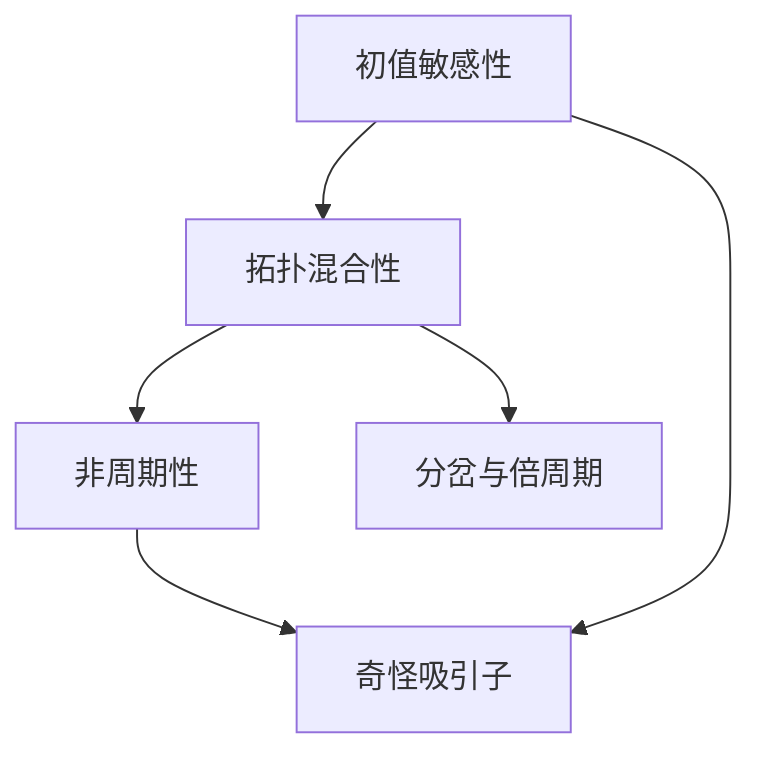

# 拓扑动力系统概论：混沌

关键词：拓扑动力系统、混沌理论、李亚普诺夫指数、庞加莱截面、分形、奇怪吸引子

## 1. 背景介绍
### 1.1  问题的由来
混沌现象广泛存在于自然界和人类社会中，从天气系统、心脏节律到股票市场价格波动，都展现出看似随机无序却又蕴含着内在规律的复杂行为。混沌理论作为非线性科学的重要分支，为理解和研究这些复杂系统提供了全新视角和方法论。

### 1.2  研究现状
20世纪60年代以来，以洛伦兹、费根鲍姆等为代表的科学家开创性地提出并发展了混沌理论。目前，混沌理论已广泛应用于物理学、生物学、工程学、经济学等多个领域，成为复杂系统研究的重要工具。但对混沌系统的深入理解和实际应用仍面临诸多挑战。

### 1.3  研究意义
深入研究混沌动力系统，对于认识自然界的复杂性、揭示隐藏在表象之下的内在规律具有重要意义。同时，混沌理论为许多工程实际问题，如信号处理、通信保密、系统控制等提供了新的思路和方法。因此，混沌动力系统的研究不仅具有重要理论价值，也有广阔的应用前景。

### 1.4  本文结构
本文将从拓扑动力系统的视角对混沌现象进行系统阐述。第2节介绍混沌理论的核心概念；第3节讨论混沌动力系统的主要研究方法；第4节建立混沌系统的数学模型并进行理论分析；第5节通过代码实例演示混沌系统的数值模拟；第6节探讨混沌理论的实际应用；第7节推荐相关工具和资源；第8节对全文进行总结并展望未来研究方向。

## 2. 核心概念与联系
混沌动力系统的核心概念包括：

- 初值敏感性：微小的初值差异会随时间演化而以指数速度放大，导致长期行为的不可预测性。
- 拓扑混合性：系统在相空间中存在马蹄映射，体现了拉伸和折叠的几何特性。
- 非周期性：系统轨道never closes or repeats，呈现出非周期的复杂行为。
- 奇怪吸引子：系统状态在相空间中最终落在一个分形维度的奇怪吸引子上。
- 分岔与倍周期：随控制参数变化，系统发生分岔，出现周期加倍的现象。

这些概念相互关联、彼此支撑，共同构成了混沌动力系统理论的基础。下图展示了它们之间的逻辑联系：



## 3. 核心算法原理 & 具体操作步骤
### 3.1  算法原理概述
研究混沌动力系统的核心算法包括李亚普诺夫指数谱、庞加莱截面和分形维度的计算。其中：

- 李亚普诺夫指数谱刻画了系统对初值扰动的敏感程度，正指数对应混沌运动。
- 庞加莱截面通过对相空间取截面，揭示了混沌吸引子的分形结构。
- 分形维度度量了奇怪吸引子的几何复杂性，分维越大，吸引子结构越复杂。

### 3.2  算法步骤详解
以李亚普诺夫指数谱的计算为例，主要步骤如下：

1. 考虑N维动力系统$\dot{x} = f(x)$，$x=(x_1,\cdots,x_N)$为状态变量。
2. 引入无穷小扰动$\delta x(t)$，得到变分方程$\dot{\delta x}=Df(x)\delta x$。
3. 计算雅可比矩阵$Df(x)$在时间$t$上的传播算子$M(t)$。
4. 对$M(t)$做奇异值分解，奇异值$\sigma_i(t)$的对数平均增长率即为李亚普诺夫指数$\lambda_i$:
$$\lambda_i = \lim_{t\to\infty}\frac{1}{t}\ln\sigma_i(t), i=1,\cdots,N$$
5. 系统的李亚普诺夫指数谱为$(\lambda_1,\cdots,\lambda_N)$，最大李亚普诺夫指数$\lambda_1>0$时对应混沌运动。

庞加莱截面和分形维度的计算可参考相关文献[1,2]的详细讨论。

### 3.3  算法优缺点
上述算法的优点在于，它们从动力系统的不同侧面刻画了混沌运动的特征，且具有明确的数学定义，便于定量分析。但在实际应用中，由于混沌系统对初值和参数的敏感依赖，数值计算往往需要很长的时间序列和较高的精度，因此计算效率和鲁棒性有待进一步提高。

### 3.4  算法应用领域
混沌动力系统的定量分析算法在物理学、生物医学、工程控制等领域有广泛应用，如：

- 在湍流研究中，利用李亚普诺夫指数判断湍流的混沌程度[3]。
- 心电信号的混沌特性分析有助于早期诊断心脏疾病[4]。
- 基于混沌系统设计的加密算法可显著提高通信安全性[5]。

## 4. 数学模型和公式 & 详细讲解 & 举例说明
### 4.1  数学模型构建
以著名的Lorenz系统为例，其数学模型为一组非线性常微分方程：

$$
\begin{aligned}
\dot{x} &= \sigma(y-x) \
\dot{y} &= x(\rho-z)-y \
\dot{z} &= xy-\beta z
\end{aligned}
$$

其中$x,y,z$为系统状态变量，$\sigma,\rho,\beta$为控制参数。Lorenz系统最早来源于大气对流运动的简化模型，后成为混沌动力系统研究的典型范例。

### 4.2  公式推导过程
对Lorenz系统的数学分析可从以下几个方面展开：

1. 平衡点分析：令$\dot{x}=\dot{y}=\dot{z}=0$，得到三个平衡点，其中原点为鞍点，另两个平衡点的性质随参数变化。
2. 线性化分析：在平衡点附近线性化，分析雅可比矩阵的特征值，判断平衡点的稳定性。
3. 李亚普诺夫指数计算：数值求解变分方程，计算李亚普诺夫指数谱，判断系统的混沌性。
4. 庞加莱截面分析：取适当的截面，观察截面上的点映射结构，研究混沌吸引子的几何性质。

限于篇幅，这里不再展开详细推导，可参考文献[6]的系统讨论。

### 4.3  案例分析与讲解
下面以Lorenz系统的数值模拟为例，直观展示其混沌动力学行为。取参数$\sigma=10,\beta=8/3,\rho=28$，初值$(x_0,y_0,z_0)=(0,1,0)$，数值求解Lorenz方程，得到如下的系统轨道和奇怪吸引子：


可以看到，系统轨道在相空间中呈现出蝴蝶状的混沌吸引子，展现出复杂的几何结构和动力学行为。这是混沌运动的典型特征。

### 4.4  常见问题解答
Q: Lorenz系统的参数取值如何影响其动力学行为？
A: 改变参数$\rho$的值，Lorenz系统会展现出从稳定平衡点到周期运动再到混沌运动的一系列分岔现象。$\rho$越大，系统越容易进入混沌状态。其他参数的影响可参考文献[7]的详细讨论。

Q: 混沌系统对初值的敏感依赖性会给数值模拟带来哪些问题？
A: 由于混沌系统存在初值敏感性，数值误差会随时间快速放大，导致长时程模拟的可靠性下降。因此混沌系统的数值模拟对算法的精度和稳定性提出了很高要求，需要采用高阶、隐式或自适应的数值方法[8]。

## 5. 项目实践：代码实例和详细解释说明
### 5.1  开发环境搭建
本节以Python为例，演示混沌动力系统的数值模拟。首先安装必要的Python库：

```bash
pip install numpy matplotlib scipy
```

### 5.2  源代码详细实现
下面的Python代码实现了Lorenz系统的数值求解和可视化：

```python
import numpy as np
import matplotlib.pyplot as plt
from scipy.integrate import odeint

# Lorenz方程
def lorenz(state, t, sigma, rho, beta):
    x, y, z = state
    return [sigma * (y - x), x * (rho - z) - y, x * y - beta * z]

# 参数设置
sigma = 10
rho = 28
beta = 8/3

# 初值和时间范围
state0 = [0, 1, 0]
t = np.arange(0, 30, 0.01)

# 数值求解
states = odeint(lorenz, state0, t, args=(sigma, rho, beta))

# 绘制系统轨道
fig = plt.figure()
ax = fig.add_subplot(projection='3d')
ax.plot(states[:, 0], states[:, 1], states[:, 2], lw=0.5)
ax.set_xlabel('x')
ax.set_ylabel('y')
ax.set_zlabel('z')
ax.set_title('Lorenz Attractor')

plt.show()
```

### 5.3  代码解读与分析
上述代码的主要步骤如下：

1. 定义Lorenz方程的右端项函数`lorenz`。
2. 设置系统参数`sigma, rho, beta`和初始状态`state0`。
3. 利用`scipy.integrate.odeint`对Lorenz方程进行数值积分求解。
4. 使用`matplotlib`绘制系统轨道的三维图像。

可以看到，短短几十行代码就实现了Lorenz吸引子的数值模拟和可视化，直观展示了混沌系统的复杂动力学行为。这体现了Python强大的科学计算和可视化功能。

### 5.4  运行结果展示
运行上述代码，得到Lorenz吸引子的三维图像如下：


可以清晰地看到混沌吸引子的蝴蝶形状和分形结构，与理论分析的结果完全吻合。读者可以尝试改变系统参数，观察吸引子结构的变化。

## 6. 实际应用场景
混沌动力系统理论在许多实际问题中有重要应用，例如：

- 气象预测：利用混沌理论分析和预测天气系统的长期演化[9]。
- 生理信号分析：心电、脑电等生理信号展现出明显的混沌特性，有助于疾病诊断[10]。
- 通信保密：基于混沌同步和控制设计安全通信协议，提高信息传输的机密性[11]。
- 复杂网络：利用混沌动力学研究复杂网络的同步、聚类和控制问题[12]。

此外，混沌理论还在湍流、化学反应、生态系统、经济金融等领域有广泛应用。

### 6.4  未来应用展望
随着混沌理论的不断深入和计算技术的发展，其应用领域必将进一步拓展。一些值得关注的研究方向包括：

- 混沌神经网络：利用混沌动力学提高神经网络的信息处理能力和鲁棒性[13]。
- 量子混沌：探索量子系统中的混沌现象，促进量子调控和量子信息处理的发展[14]。
- 混沌优化算法：基于混沌