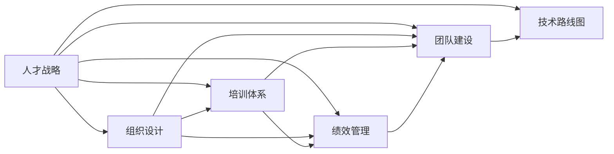

# 研发中心团队的建设和人才培养方案

## 1. 背景介绍

### 1.1 问题的由来

在当今快节奏的数字化时代，技术创新和产品迭代的速度前所未有。企业要想在激烈的市场竞争中立于不败之地,必须拥有一支高效的研发团队,不断推出创新的产品和服务。然而,构建和培养一支优秀的研发团队绝非易事,需要全面考虑人才选拔、团队建设、培训发展等多个方面的因素。

### 1.2 研究现状

目前,许多企业在研发团队建设方面存在诸多挑战:

1. **人才短缺**:优秀的技术人才一直是企业挚争的香馐馥馥,如何吸引和留住顶尖人才是企业面临的巨大挑战。
2. **技能缺口**:随着新技术的不断涌现,研发人员需要持续学习,以跟上行业发展步伐。如何有效缩小技能缺口是企业需要解决的问题。
3. **团队协作**:研发工作往往需要多人协作,如何促进团队内部的沟通协作,提高工作效率是企业需要思考的问题。
4. **人才培养**:企业需要建立系统的人才培养机制,帮助研发人员持续提升技术能力,满足企业发展需求。

### 1.3 研究意义

构建一支高效的研发团队对于企业的可持续发展至关重要。本文将从人才选拔、团队建设、培训发展等多个维度,提出一套系统的研发中心团队建设和人才培养方案,为企业提供参考和借鉴。通过实施本方案,企业可以:

1. 吸引和留住优秀的技术人才
2. 缩小研发人员的技能缺口
3. 促进研发团队的协作效率
4. 建立系统的人才培养机制
5. 提高研发团队的整体实力
6. 加速企业的技术创新步伐

### 1.4 本文结构

本文将分为以下几个部分:

1. 背景介绍
2. 核心概念与联系
3. 核心算法原理与具体操作步骤
4. 数学模型和公式详细讲解与举例说明
5. 项目实践:代码实例和详细解释说明
6. 实际应用场景
7. 工具和资源推荐
8. 总结:未来发展趋势与挑战
9. 附录:常见问题与解答

## 2. 核心概念与联系

在研发中心团队的建设和人才培养方案中,涉及到以下几个核心概念:

1. **人才战略**:确定企业所需的人才类型、数量和质量,制定相应的人才引进、培养和留任策略。
2. **组织设计**:根据企业的业务需求和发展战略,设计研发中心的组织架构、岗位设置和工作流程。
3. **培训体系**:建立系统的培训体系,包括新员工入职培训、在职培训、管理培训等,促进研发人员的持续学习和技能提升。
4. **绩效管理**:制定科学的绩效考核机制,公平合理地评估研发人员的工作表现,并与薪酬激励相挂钩。
5. **团队建设**:营造良好的团队氛围,促进团队成员之间的沟通协作,提高团队的凝聚力和执行力。
6. **技术路线图**:制定企业的技术发展路线图,明确未来的技术发展方向,引导研发团队的技术创新。

这些核心概念相互关联、相互影响,需要在研发中心团队建设和人才培养方案中统筹考虑和协调。

## 3. 核心算法原理与具体操作步骤

### 3.1 算法原理概述

在研发中心团队的建设和人才培养方案中,我们采用了一种基于数据驱动的算法,该算法可以根据企业的实际情况,动态调整人才战略、组织设计、培训体系等各个模块的参数,从而优化整个方案的效果。

该算法的核心思想是:

1. 收集并分析企业的历史数据,包括人员流失率、培训效果、项目完成情况等,建立数据模型。
2. 根据企业的战略目标和当前状况,设定期望的目标值,如期望的人员留存率、项目完成率等。
3. 利用机器学习算法,不断优化各个模块的参数,使实际数据值逐步逼近期望目标值。
4. 在算法运行过程中,持续收集新的数据,并反馈到模型中,实现自适应优化。

该算法的优点是可以根据企业的实际情况动态调整,避免了静态方案的缺陷。同时,通过数据驱动的方式,可以最大限度地提高方案的效果。

### 3.2 算法步骤详解

1. **数据收集与预处理**

   收集企业的历史数据,包括人员流失率、培训效果、项目完成情况等,并对数据进行清洗和标准化处理,构建数据集。

2. **建立数据模型**

   利用机器学习算法,基于历史数据建立数据模型,该模型可以描述各个因素之间的关系,并预测未来的发展趋势。

   常用的机器学习算法包括:
   - 线性回归
   - 决策树
   - 随机森林
   - 神经网络

   具体使用哪种算法,需要根据数据的特征和模型的复杂度进行选择。

3. **设定目标值**

   根据企业的战略目标和当前状况,设定期望的目标值,如期望的人员留存率、项目完成率等。这些目标值将作为算法优化的目标。

4. **参数优化**

   利用优化算法,不断调整各个模块的参数,使实际数据值逐步逼近期望目标值。

   常用的优化算法包括:
   - 梯度下降
   - 遗传算法
   - 模拟退火
   - 粒子群优化

   在优化过程中,需要设置合理的终止条件,如迭代次数上限、目标函数收敛精度等。

5. **方案实施与反馈**

   根据优化后的参数,实施研发中心团队建设和人才培养方案。同时,持续收集新的数据,并反馈到模型中,实现自适应优化。

### 3.3 算法优缺点

**优点**:

1. 数据驱动,可以根据企业的实际情况动态调整
2. 利用机器学习和优化算法,可以最大限度地提高方案效果
3. 自适应优化,可以持续收集新数据并反馈到模型中

**缺点**:

1. 需要大量的历史数据作为训练集,对数据质量要求较高
2. 算法的选择和参数调优需要一定的专业知识
3. 计算复杂度较高,对硬件资源要求较高

### 3.4 算法应用领域

该算法不仅可以应用于研发中心团队的建设和人才培养,还可以推广到企业的其他领域,如销售团队、市场营销团队等,为企业的人力资源管理提供数据支持和决策依据。

## 4. 数学模型和公式详细讲解与举例说明

### 4.1 数学模型构建

在研发中心团队建设和人才培养方案中,我们构建了一个多目标优化模型,旨在同时优化多个目标,如人员留存率、培训效果、项目完成率等。

假设我们需要优化的目标有 $m$ 个,分别记为 $f_1(x), f_2(x), \cdots, f_m(x)$,其中 $x$ 是决策变量向量,表示各个模块的参数。

我们的目标是找到一个 $x^*$,使得:

$$
\begin{aligned}
&\min_{x} F(x) = (f_1(x), f_2(x), \cdots, f_m(x))\
&\text{s.t. } x \in X
\end{aligned}
$$

其中, $X$ 是决策变量的可行域,表示各个参数的取值范围。

由于多目标优化问题通常没有唯一的最优解,我们采用权重求和法将多个目标合并为单一目标:

$$
\min_{x} G(x) = \sum_{i=1}^{m} w_i f_i(x)
$$

其中, $w_i$ 是第 $i$ 个目标的权重,满足 $\sum_{i=1}^{m} w_i = 1$。权重的设置需要根据企业的实际情况和优先级进行调整。

### 4.2 公式推导过程

我们以人员留存率和培训效果为例,推导目标函数的具体形式。

假设研发中心共有 $n$ 名员工,第 $i$ 个员工的留存状态用 $y_i$ 表示,如果留存则 $y_i=1$,否则 $y_i=0$。员工的留存率可以表示为:

$$
f_1(x) = 1 - \frac{1}{n}\sum_{i=1}^{n}y_i
$$

我们的目标是最小化留存率,即 $\min f_1(x)$。

对于培训效果,我们用员工的技能提升程度来衡量。假设第 $i$ 个员工的技能提升程度为 $z_i$,则培训效果可以表示为:

$$
f_2(x) = 1 - \frac{1}{n}\sum_{i=1}^{n}z_i
$$

我们的目标是最大化培训效果,即 $\min (-f_2(x))$。

将两个目标合并,我们得到:

$$
\min_{x} G(x) = w_1 f_1(x) + w_2 (-f_2(x))
$$

其中, $w_1$ 和 $w_2$ 分别是人员留存率和培训效果的权重,满足 $w_1 + w_2 = 1$。

### 4.3 案例分析与讲解

假设一家企业的研发中心共有 100 名员工,通过数据分析发现,当前的人员留存率为 80%,培训效果为 70%。企业希望在未来一年内将人员留存率提高到 90%,培训效果提高到 85%。

我们将人员留存率和培训效果的权重均设为 0.5,构建目标函数:

$$
\begin{aligned}
\min_{x} G(x) &= 0.5 f_1(x) + 0.5 (-f_2(x))\
&= 0.5 \left(1 - \frac{1}{100}\sum_{i=1}^{100}y_i\right) + 0.5 \left(\frac{1}{100}\sum_{i=1}^{100}z_i - 1\right)
\end{aligned}
$$

其中, $y_i$ 表示第 $i$ 个员工的留存状态, $z_i$ 表示第 $i$ 个员工的技能提升程度。

我们的目标是通过调整各个模块的参数 $x$,使目标函数 $G(x)$ 最小化,从而达到期望的人员留存率和培训效果。

在优化过程中,我们可以采用梯度下降等优化算法,不断迭代更新参数 $x$,直到目标函数收敛或达到预设的终止条件。

### 4.4 常见问题解答

1. **如何确定目标函数中各个目标的权重?**

   目标函数中各个目标的权重需要根据企业的实际情况和优先级进行设置。通常可以采用专家评估法或层次分析法等方法确定权重。同时,在实际应用中,也可以根据优化效果动态调整权重。

2. **如何处理目标函数中的约束条件?**

   在实际问题中,目标函数往往还需要满足一些约束条件,如资源限制、政策法规等。我们可以采用惩罚函数法或者乘子法等方法将约束条件转化为目标函数的一部分,从而将约束优化问题转化为无约束优化问题。

3. **如何选择合适的优化算法?**

   优化算法的选择需要综合考虑目标函数的特征、计算复杂度、收敛速度等因素。常用的优化算法包括梯度下降、遗传算法、模拟退火等。同时,也可以结合