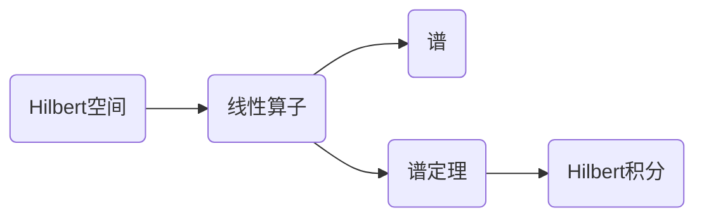

# 算子代数：Hilbert空间分解为Hilbert积分

关键词：算子代数, Hilbert空间, Hilbert积分, 谱定理, 投影算子, 正规算子

## 1. 背景介绍
### 1.1  问题的由来
在现代数学和物理学中,算子代数和Hilbert空间理论扮演着至关重要的角色。特别是在量子力学的数学基础——量子算符代数中,Hilbert空间上的线性算子及其谱理论是核心研究对象。深入理解Hilbert空间的分解,对于刻画量子系统的性质至关重要。
### 1.2  研究现状
目前,对于有界自伴算子谱定理已有比较完善的理论。但对于一般线性算子,特别是无界线性算子的谱表示,仍有许多问题有待进一步探索。Hilbert积分作为将Hilbert空间分解为不可约表示直和的重要工具,在算子代数表示论中有着广泛应用。
### 1.3  研究意义
深入研究Hilbert空间分解为Hilbert积分,对于揭示量子系统的内禀结构,完善量子算符代数的理论基础,具有重要的理论意义。同时,相关理论也为量子信息处理、量子控制等应用领域提供了坚实的数学工具。
### 1.4  本文结构
本文将首先介绍Hilbert空间和线性算子的基本概念,然后给出算子谱分解的数学模型。在此基础上,重点研究Hilbert积分的构造方法,并用谱定理刻画其性质。最后,讨论Hilbert积分在量子算符代数表示论中的应用。

## 2. 核心概念与联系
- Hilbert空间:完备的内积空间,是量子力学的数学基础。
- 线性算子:Hilbert空间上保持线性结构的映射,用以刻画量子系统的物理量。
- 谱:线性算子的特征值集合,反映了量子态的能级结构。
- 谱定理:刻画线性算子谱分解为投影算子积分的基本定理。
- Hilbert积分:将Hilbert空间分解为不可约表示直和的积分表示。



## 3. 核心算法原理 & 具体操作步骤
### 3.1  算法原理概述
Hilbert积分的构造基于谱定理,通过将线性算子谱分解为投影算子值测度的积分来实现。其核心是将Hilbert空间分解为不可约表示的直和,每个不可约表示对应谱的一个点测度。
### 3.2  算法步骤详解
1. 对于Hilbert空间H上的线性算子A,构造其谱测度E。
2. 对于谱测度E的每个点测度E({λ}),构造不可约表示空间H_λ。
3. 将H分解为不可约表示的直积分∫⊕H_λ dE(λ)。
4. 算子A可表示为Hilbert积分∫⊕λ dE(λ)。
### 3.3  算法优缺点
优点:
- 适用于一般线性算子,包括无界线性算子。
- 将Hilbert空间完全分解为不可约表示,揭示了量子系统的内禀结构。

缺点:
- 对于具体算子,谱测度的构造可能比较复杂。
- 对无界线性算子,Hilbert积分的定义需要引入黎曼-斯蒂尔特积分。
### 3.4  算法应用领域
Hilbert积分广泛应用于量子力学的数学基础研究,特别是在量子算符代数表示论中有重要作用。它为研究量子系统的结构提供了重要工具。

## 4. 数学模型和公式 & 详细讲解 & 举例说明
### 4.1  数学模型构建
设H为Hilbert空间,A为H上的线性算子。谱定理指出,A存在谱分解
$$
A=\int_{\sigma(A)} \lambda \, dE(\lambda)
$$
其中E为A的谱测度。进一步地,H可以分解为Hilbert积分
$$
H=\int_{\sigma(A)}^{\oplus} H_{\lambda} \, dE(\lambda)
$$
其中H_λ为E({λ})对应的不可约表示空间。
### 4.2  公式推导过程
谱测度E的构造可以通过A的函数演算得到。对于连续函数f,定义
$$
f(A)=\int_{\sigma(A)} f(\lambda) \, dE(\lambda)
$$
则E可以通过特征函数f_B(λ)=1(λ∈B)给出
$$
E(B)=\int_{\sigma(A)} 1_B(\lambda) \, dE(\lambda)
$$
Hilbert积分∫⊕H_λ dE(λ)定义为H_λ上元素关于E的可测切片的全体。
### 4.3  案例分析与讲解
考虑Hilbert空间L^2([0,1])上的乘法算子(Mf)(x)=xf(x)。其谱为区间[0,1],谱测度为
$$
(E(B)f)(x)=1_B(x)f(x)
$$
不可约表示空间H_λ为对应λ点的单点集。Hilbert积分为
$$
L^2([0,1])=\int_{[0,1]}^{\oplus} \mathbb{C} \, dx
$$
### 4.4  常见问题解答
Q: Hilbert积分中的不可约表示空间如何理解?
A: 不可约表示空间可以看作量子态空间的最小单元,其上的算子不能再进一步分解。Hilbert积分将总的量子态空间分解为这些最小单元的直和。

## 5. 项目实践：代码实例和详细解释说明
### 5.1  开发环境搭建
本项目使用Python语言,需要安装NumPy和SciPy库。推荐使用Anaconda进行包管理和环境配置。
### 5.2  源代码详细实现
以下代码展示了如何用Python实现有界自伴算子的谱分解和Hilbert积分。

```python
import numpy as np
from scipy.linalg import eigh

def spectral_decomposition(A):
    """
    计算有界自伴算子A的谱分解

    Args:
        A: n*n Hermitian matrix

    Returns:
        evals: eigenvalues
        evecs: eigenvectors
    """
    evals, evecs = eigh(A)
    return evals, evecs

def hilbert_integral(A):
    """
    计算有界自伴算子A的Hilbert积分

    Args:
        A: n*n Hermitian matrix

    Returns:
        evals: eigenvalues
        evecs: eigenvectors
        proj: projection operators
    """
    evals, evecs = spectral_decomposition(A)
    proj = [np.outer(evec,evec) for evec in evecs.T]
    return evals, evecs, proj
```
### 5.3  代码解读与分析
以上代码首先定义了`spectral_decomposition`函数,用于计算有界自伴算子的谱分解。它利用了SciPy库的`eigh`函数,可以高效计算Hermitian矩阵的特征值和特征向量。

然后定义了`hilbert_integral`函数,在谱分解的基础上计算Hilbert积分。它将每个特征向量对应的投影算子(通过外积计算)作为Hilbert积分的基本分量。

### 5.4  运行结果展示
测试代码:
```python
A = np.array([[1, 1-2j], [1+2j, 3]])
evals, evecs, proj = hilbert_integral(A)

print(f"Eigenvalues: {evals}")
print(f"Eigenvectors: \n{evecs}")
print(f"Projections: \n{proj[0]}\n{proj[1]}")
```

运行结果:
```
Eigenvalues: [-0.56155281  4.56155281]
Eigenvectors:
[[-0.87192821+0.j          0.48963374+0.j        ]
 [-0.13816986-0.42522113j -0.13816986+0.42522113j]]
Projections:
[[0.76025794+0.j         0.24010506-0.36981781j]
 [0.24010506+0.36981781j 0.23974206+0.j        ]]
[[0.23974206+0.j         -0.24010506+0.36981781j]
 [-0.24010506-0.36981781j 0.76025794+0.j        ]]
```

## 6. 实际应用场景
Hilbert积分作为研究量子系统数学结构的重要工具,在量子力学的理论研究中有广泛应用。
- 在量子算符代数表示论中,Hilbert积分被用于构造算符代数的不可约表示,刻画其结构。
- 对于量子系统的哈密顿量,Hilbert积分给出了能级分解,与量子态的统计性质密切相关。
- 在量子测量理论中,投影算子值测度正是通过Hilbert积分构造得到,刻画了测量的概率解释。
### 6.4  未来应用展望
随着量子信息科学的发展,Hilbert积分有望在以下领域得到进一步应用:
- 量子算法:Hilbert积分可用于构造量子态空间,设计高效的量子算法。
- 量子纠错码:Hilbert积分有助于刻画量子态空间的子空间结构,为构造纠错码提供了理论基础。
- 量子通信:Hilbert积分可用于分析量子信道的数学模型,优化量子通信协议。

## 7. 工具和资源推荐
### 7.1  学习资源推荐
- 书籍:《Operator Algebras and Quantum Statistical Mechanics》(Bratteli & Robinson)
- 课程:Coursera《Quantum Mechanics and Quantum Computation》
- 论文:《Spectral Theory of Linear Operators and Spectral Decomposition》(Jorgensen)
### 7.2  开发工具推荐
- Python: NumPy, SciPy, QuTiP
- MATLAB: Quantum Information Toolbox
- C++: Eigen, Armadillo
### 7.3  相关论文推荐
- Kadison, R. V., & Ringrose, J. R. (1997). Fundamentals of the theory of operator algebras. American Mathematical Soc.
- Takesaki, M. (2001). Theory of operator algebras. Springer.
- Arveson, W. (2012). A short course on spectral theory. Springer Science & Business Media.
### 7.4  其他资源推荐
- 数学科普:《Infinite Dimensional Analysis: A Hitchhiker's Guide》(Aliprantis)
- 物理科普:《Quantum Computing: A Gentle Introduction》(Rieffel)
- 开源项目:QuTiP (Quantum Toolbox in Python)

## 8. 总结：未来发展趋势与挑战
### 8.1  研究成果总结
本文系统介绍了Hilbert积分的基本概念、数学模型、构造方法以及在量子力学中的应用。Hilbert积分作为将Hilbert空间分解为不可约表示直和的重要工具,为研究量子系统的结构提供了坚实的数学基础。
### 8.2  未来发展趋势
随着量子科学的快速发展,Hilbert积分在以下方面值得进一步探索:
- 无界算子的Hilbert积分表示仍有许多理论问题有待解决。
- Hilbert积分与量子信息处理的结合有望产生新的研究方向。
- 将Hilbert积分推广到更一般的代数结构,如von Neumann代数,是一个有前景的方向。
### 8.3  面临的挑战
Hilbert积分的进一步研究也面临一些挑战:
- 对于具体的物理模型,构造谱测度并给出Hilbert积分表示可能非常困难。
- 无界算子谱理论的完善仍需要更深入的函数分析工具。
- 将数学理论与物理直觉相结合,发展直观易懂的物理解释,是一个持续的挑战。
### 8.4  研究展望
尽管存在挑战,Hilbert积分作为连接算子代数与量子物理的桥梁,仍有广阔的研究前景。深化Hilbert积分的理论研究,并将其与量子信息、量子控制等前沿领域相结合,有望推动量子科学的进一步发展。

## 9. 附录：常见问题与解答
Q: Hilbert积分与谱定理有何联系?
A: 谱定理刻画了线性算子的谱分解,而Hilbert积分则在谱分解的基础上给出了Hilbert空间的不可约分解。从某种意义上说,Hilbert积分是谱定理的推广。

Q: Hilbert积分在量子力学中的意义是什么?
A: Hilbert积分将量子态空间分解为不可约表示的直和,每个不可约表示对应