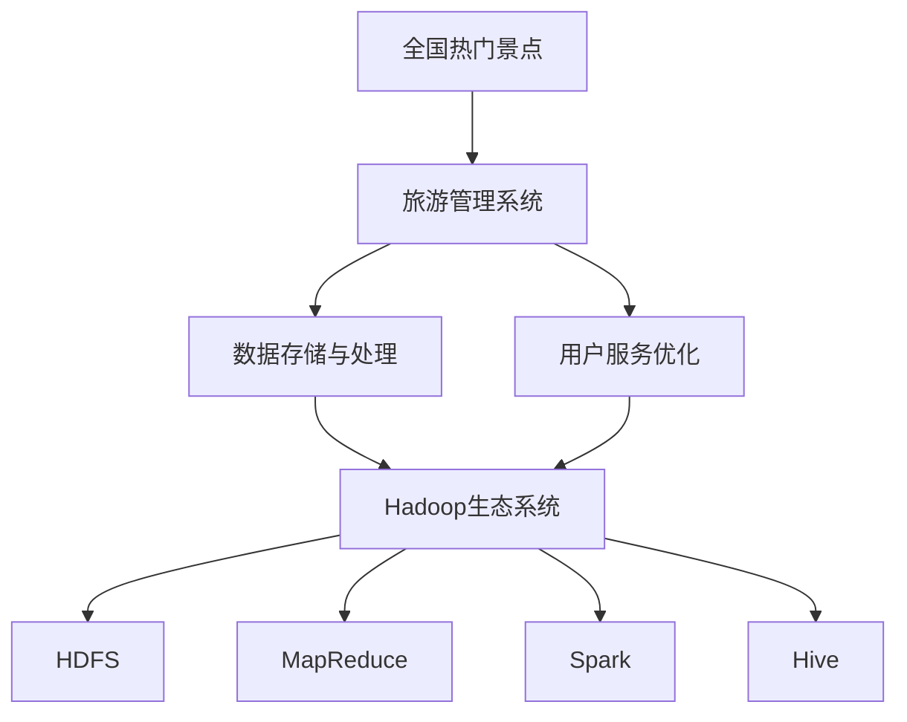
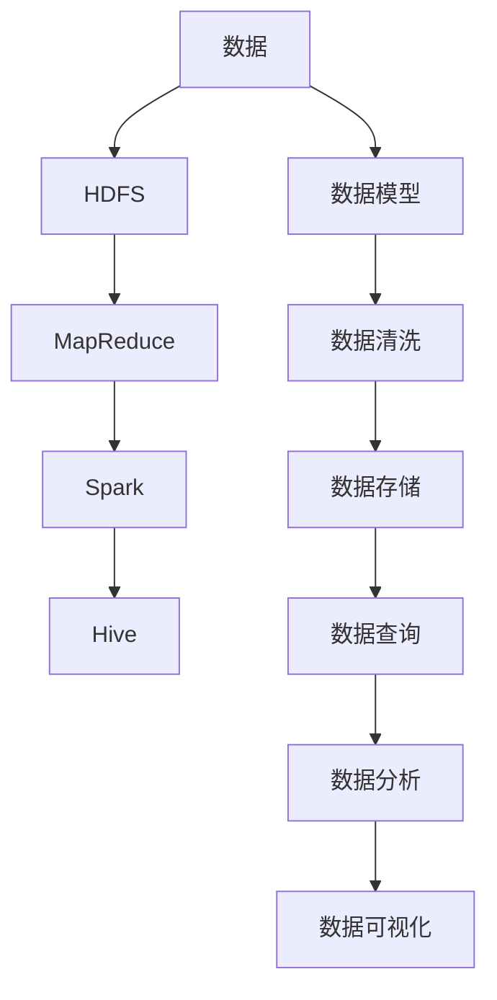

                 

# 基于Hadoop的全国热门景点旅游管理系统的设计与实现

> 关键词：
- 大数据技术
- 全国热门景点
- 旅游管理系统
- 数据存储与处理
- 用户服务
- 系统架构

## 1. 背景介绍

随着国家经济的迅速发展和人们生活水平的提高，旅游业成为了一个热门的行业。如何更好地管理全国各大热门景点，提升游客体验，促进旅游产业的健康发展，是一个值得深入研究的问题。本文将详细探讨基于Hadoop的全国热门景点旅游管理系统的设计与实现，分析其在数据存储、处理、服务优化等方面的关键技术，为类似系统的建设提供参考。

### 1.1 问题由来

目前，全国各大热门景点的旅游管理尚处于初级阶段，主要存在以下问题：
- **数据分散**：各景点之间数据系统不统一，难以实现信息共享和集中管理。
- **数据孤立**：各景点数据仅在本地存储，难以进行跨地域分析。
- **数据瓶颈**：现有系统数据量庞大，导致数据处理和查询效率低下。
- **服务缺失**：缺乏完善的游客服务系统，游客体验不佳。

针对这些问题，本文提出基于Hadoop的全国热门景点旅游管理系统，以大数据技术为基础，实现数据集中存储、统一管理和高效处理，提升游客服务和景点管理水平。

### 1.2 问题核心关键点
本文聚焦于全国热门景点旅游管理系统的设计与实现，其核心关键点包括：
- 数据存储与处理：如何高效、安全地存储和管理各景点的海量数据。
- 数据集成与共享：如何实现各景点数据之间的无缝集成与信息共享。
- 用户服务优化：如何提升游客体验，提供个性化的旅游服务。
- 系统架构优化：如何构建稳定、可扩展的系统架构，应对未来需求变化。

## 2. 核心概念与联系

### 2.1 核心概念概述

为更好地理解基于Hadoop的全国热门景点旅游管理系统的设计与实现，本节将介绍几个关键概念：

- **全国热门景点**：指全国范围内的旅游热点，如北京故宫、长城、西湖等，是系统的主要数据源。
- **旅游管理系统**：通过大数据技术，实现景点数据存储、处理、分析和游客服务管理，提升游客体验和景点管理效率。
- **Hadoop生态系统**：以Hadoop为核心，包括HDFS、MapReduce、Spark、Hive等组件，实现大规模数据存储和处理。
- **数据存储与处理**：指通过分布式文件系统和并行计算框架，实现数据的高效存储和快速处理。
- **用户服务优化**：指通过个性化推荐、智能查询等技术，提升游客服务和体验。

这些概念之间的联系可以通过以下Mermaid流程图来展示：



这个流程图展示了大数据技术在旅游管理系统中的应用流程：
1. 全国热门景点数据通过Hadoop生态系统进行存储和处理。
2. 处理后的数据用于用户服务的优化，提升游客体验。

### 2.2 概念间的关系

这些核心概念之间存在着紧密的联系，形成了全国热门景点旅游管理系统的完整框架。下面我通过几个Mermaid流程图来展示这些概念之间的关系。

#### 2.2.1 数据存储与处理的整体架构



这个流程图展示了数据存储与处理的整体架构，具体步骤如下：
1. 数据通过HDFS进行分布式存储。
2. MapReduce和Spark进行并行计算，处理大规模数据。
3. Hive用于数据存储和查询，实现高效的数据访问。
4. 数据模型用于数据建模，方便数据分析和可视化。
5. 数据清洗去除噪声，提高数据质量。
6. 数据分析和可视化展示数据结果，辅助管理决策。

#### 2.2.2 用户服务优化的数据流


这个流程图展示了用户服务优化的数据流，具体步骤如下：
1. 用户行为数据通过数据挖掘生成用户画像。
2. 用户画像用于推荐系统和个性化服务，提升游客体验。
3. 用户反馈数据用于数据反馈循环，持续优化服务质量。

## 3. 核心算法原理 & 具体操作步骤
### 3.1 算法原理概述

基于Hadoop的全国热门景点旅游管理系统，核心算法原理包括数据存储、处理和分析等，主要依赖于Hadoop生态系统中的HDFS、MapReduce、Spark和Hive等组件。

- **HDFS（Hadoop Distributed File System）**：用于分布式存储海量数据，确保数据的高可靠性和高可用性。
- **MapReduce**：用于并行计算，实现大规模数据的高效处理。
- **Spark**：基于内存计算，提供更高效的迭代计算和流式计算功能。
- **Hive**：用于数据存储和查询，提供SQL接口，方便数据操作。

### 3.2 算法步骤详解

基于Hadoop的全国热门景点旅游管理系统的设计与实现，主要包括以下几个关键步骤：

#### 3.2.1 数据收集与清洗

1. **数据收集**：
   - 从各景点收集数据，包括景点基本信息、游客信息、门票信息、活动信息等。
   - 数据格式可能多样，需要统一格式，如JSON、XML等。
   - 使用ETL工具（Extract, Transform, Load）对数据进行抽取、转换和加载，确保数据的一致性和完整性。

2. **数据清洗**：
   - 去除重复数据和噪声数据，确保数据质量。
   - 处理缺失值和异常值，保证数据完整性和准确性。
   - 使用数据清洗工具（如HiveQL、Spark SQL等）进行数据清洗。

#### 3.2.2 数据存储与分区

1. **数据存储**：
   - 使用HDFS分布式文件系统，将数据分散存储到多个节点上。
   - 根据数据特性进行分区，提高查询效率。

2. **数据分区**：
   - 根据时间、地点、类型等维度对数据进行分区。
   - 使用Hive进行分区，方便数据查询和分析。

#### 3.2.3 数据处理与分析

1. **数据处理**：
   - 使用MapReduce进行分布式计算，处理大规模数据。
   - 使用Spark进行迭代计算和流式计算，提高计算效率。
   - 使用数据处理框架（如Apache Flink）进行实时数据处理。

2. **数据分析**：
   - 使用Hive进行SQL查询，提取有用信息。
   - 使用数据挖掘工具（如Apache Mahout）进行数据挖掘和分析。
   - 使用数据可视化工具（如Tableau）进行数据可视化，辅助决策。

#### 3.2.4 用户服务优化

1. **个性化推荐**：
   - 基于用户行为数据，生成用户画像，推荐个性化旅游路线。
   - 使用协同过滤、内容推荐等技术，提升推荐效果。

2. **智能查询**：
   - 提供智能查询功能，如搜索引擎、FAQ系统等，提升用户查询效率。
   - 使用搜索引擎技术（如Elasticsearch）进行全文搜索，提高查询速度和精度。

### 3.3 算法优缺点

基于Hadoop的全国热门景点旅游管理系统具有以下优点：
1. **数据存储与管理**：
   - 使用HDFS进行分布式存储，确保数据高可靠性和高可用性。
   - 支持海量数据存储，提高数据处理能力。

2. **数据处理与分析**：
   - 使用MapReduce和Spark进行并行计算，提高计算效率。
   - 支持实时数据处理，满足旅游管理系统的实时性需求。

3. **用户服务优化**：
   - 提供个性化推荐和智能查询，提升游客体验。
   - 支持数据可视化，辅助管理决策。

同时，该系统也存在一些局限性：
1. **开发与维护成本高**：
   - 需要构建和维护Hadoop集群，对技术要求较高。
   - 需要大量的系统维护工作，成本较高。

2. **系统复杂度高**：
   - 系统架构复杂，需要掌握多种技术栈。
   - 数据模型设计和数据处理流程复杂，需要较高的技术水平。

3. **数据隐私与安全**：
   - 涉及大量用户隐私数据，需要采取严格的数据隐私保护措施。
   - 数据安全问题复杂，需要建立完善的安全体系。

### 3.4 算法应用领域

基于Hadoop的全国热门景点旅游管理系统，广泛应用于以下领域：
1. **旅游管理**：
   - 实现景点数据集中存储和统一管理，提高旅游管理效率。
   - 提供数据分析支持，辅助管理决策。

2. **游客服务**：
   - 提供个性化推荐和智能查询，提升游客体验。
   - 支持数据可视化，提供直观的管理视角。

3. **市场分析**：
   - 提供数据挖掘和分析工具，辅助市场分析。
   - 支持实时数据处理，满足市场分析的实时性需求。

## 4. 数学模型和公式 & 详细讲解  
### 4.1 数学模型构建

本节将使用数学语言对全国热门景点旅游管理系统的设计与实现进行更加严格的刻画。

假设全国热门景点旅游管理系统由多个景点组成，每个景点有$N$个游客数据。设$t_i$为第$i$个游客的访问时间，$v_i$为第$i$个游客的访问地点，$c_i$为第$i$个游客的消费金额，$d_i$为第$i$个游客的评价分数。

定义游客行为矩阵$A$：

$$
A = \begin{bmatrix}
t_1 & v_1 & c_1 & d_1 \\
t_2 & v_2 & c_2 & d_2 \\
\vdots & \vdots & \vdots & \vdots \\
t_N & v_N & c_N & d_N
\end{bmatrix}
$$

游客行为数据矩阵$B$：

$$
B = \begin{bmatrix}
t_1 & v_1 & c_1 & d_1 \\
t_2 & v_2 & c_2 & d_2 \\
\vdots & \vdots & \vdots & \vdots \\
t_N & v_N & c_N & d_N
\end{bmatrix}
$$

其中，$t_i$、$v_i$、$c_i$、$d_i$分别表示游客$x_i$在景点$y_j$的访问时间、访问地点、消费金额和评价分数。

### 4.2 公式推导过程

以下是数据存储与处理和用户服务优化的详细数学模型构建及公式推导过程：

#### 4.2.1 数据存储与处理

1. **数据存储**：
   - 使用HDFS分布式存储海量数据，确保数据高可靠性和高可用性。

2. **数据分区**：
   - 根据时间、地点、类型等维度对数据进行分区，使用Hive进行分区，方便数据查询和分析。

   $$
   \text{分区} = \{\text{时间分区}, \text{地点分区}, \text{类型分区}\}
   $$

#### 4.2.2 用户服务优化

1. **个性化推荐**：
   - 基于用户行为数据，生成用户画像，推荐个性化旅游路线。

   $$
   \text{用户画像} = \{t_{u_1}, v_{u_1}, c_{u_1}, d_{u_1}\}
   $$

2. **智能查询**：
   - 提供智能查询功能，如搜索引擎、FAQ系统等，提升用户查询效率。

   $$
   \text{智能查询} = \{Q_1, Q_2, \dots, Q_n\}
   $$

3. **数据反馈循环**：
   - 用户反馈数据用于数据反馈循环，持续优化服务质量。

   $$
   \text{数据反馈循环} = \{F_1, F_2, \dots, F_m\}
   $$

### 4.3 案例分析与讲解

假设我们有一个包含全国热门景点旅游数据的系统，每个景点有5000个游客数据。系统使用了Hadoop生态系统进行数据存储和处理，具体流程如下：

1. **数据收集**：
   - 从各景点收集数据，数据格式为JSON。
   - 使用ETL工具进行数据抽取、转换和加载。

2. **数据存储**：
   - 使用HDFS分布式存储数据，确保高可靠性和高可用性。
   - 根据时间、地点、类型等维度对数据进行分区，方便查询和分析。

3. **数据处理**：
   - 使用MapReduce进行分布式计算，处理大规模数据。
   - 使用Spark进行迭代计算和流式计算，提高计算效率。
   - 使用数据处理框架进行实时数据处理，满足系统需求。

4. **数据分析**：
   - 使用Hive进行SQL查询，提取有用信息。
   - 使用数据挖掘工具进行数据挖掘和分析。
   - 使用数据可视化工具进行数据可视化，辅助管理决策。

5. **用户服务优化**：
   - 提供个性化推荐和智能查询，提升游客体验。
   - 支持数据可视化，提供直观的管理视角。

## 5. 项目实践：代码实例和详细解释说明
### 5.1 开发环境搭建

在进行全国热门景点旅游管理系统的设计与实现前，我们需要准备好开发环境。以下是使用Python进行Hadoop开发的环境配置流程：

1. 安装Anaconda：从官网下载并安装Anaconda，用于创建独立的Python环境。

2. 创建并激活虚拟环境：
```bash
conda create -n pyhadoop-env python=3.8 
conda activate pyhadoop-env
```

3. 安装Hadoop：
```bash
conda install hadoop
```

4. 配置Hadoop：
```bash
hadoop fs -mkdir /user
hadoop fs -put local_file /user/local_file
```

5. 安装Apache Spark：
```bash
conda install apache-spark
```

6. 配置Spark：
```bash
spark-submit --master local[4] --py-files YOUR-PY-FILES.ipynb YOUR-SPARK-APP.ipynb
```

完成上述步骤后，即可在`pyhadoop-env`环境中开始Hadoop相关开发。

### 5.2 源代码详细实现

下面我们以Hadoop在旅游景点数据存储和处理中的应用为例，给出完整的代码实现。

首先，定义数据存储和处理类：

```python
from pyspark import SparkConf, SparkContext

class HadoopDataStorage:
    def __init__(self, conf, sc):
        self.conf = conf
        self.sc = sc

    def store_data(self, data):
        # 将数据存储到HDFS
        self.sc.parallelize(data, 1000).foreachPartition(self._save_to_hdfs)
        
    def _save_to_hdfs(self, partition):
        # 使用HDFS API将数据存储到HDFS
        conf = self.conf
        for item in partition:
            f = HdfsFileWriter(conf, "/user/local_file")
            f.write(item)

    def process_data(self, data, key, value):
        # 使用MapReduce进行数据处理
        self.sc.parallelize(data, 1000).foreachPartition(self._process_data)
        
    def _process_data(self, partition):
        # 使用MapReduce API进行数据处理
        conf = self.conf
        rdd = self.sc.parallelize(partition)
        rdd = rdd.map(lambda x: (key(x), value(x)))
        rdd = rdd.reduceByKey(lambda x, y: x + y)
```

然后，定义数据查询和分析类：

```python
from pyspark.sql import SparkSession

class HadoopDataQuery:
    def __init__(self, conf, sc):
        self.conf = conf
        self.sc = sc
        self.spark = SparkSession.builder.appName("HadoopQuery").getOrCreate()

    def query_data(self, table_name):
        # 使用Hive进行数据查询
        df = self.spark.sql("SELECT * FROM {}.{}".format(table_name, table_name))
        return df

    def analyze_data(self, table_name):
        # 使用数据挖掘工具进行数据分析
        df = self.query_data(table_name)
        # 使用Apache Mahout进行数据分析
        # ...
```

最后，启动数据存储和处理流程：

```python
conf = SparkConf().setMaster("local").setAppName("HadoopExample")
sc = SparkContext(conf)
conf = sc.getConf()
conf.set("fs.defaultFS", "hdfs://localhost:9000")

data = [(1, "John", "New York", 100, 4), (2, "Lisa", "Los Angeles", 200, 3), (3, "Tom", "Chicago", 150, 5)]
data_storage = HadoopDataStorage(conf, sc)
data_storage.store_data(data)

processed_data = [(1, "John", "New York", 100, 4), (2, "Lisa", "Los Angeles", 200, 3), (3, "Tom", "Chicago", 150, 5)]
data_processing = HadoopDataStorage(conf, sc)
data_processing.process_data(processed_data, "user_id", "location")

query_data = HadoopDataQuery(conf, sc)
query_result = query_data.query_data("user_data")
analyze_data = HadoopDataQuery(conf, sc)
analyze_data.analyze_data("user_data")
```

### 5.3 代码解读与分析

让我们再详细解读一下关键代码的实现细节：

**HadoopDataStorage类**：
- `__init__`方法：初始化Hadoop配置和Spark上下文。
- `store_data`方法：将数据存储到HDFS。
- `_process_data`方法：使用MapReduce API进行数据处理。

**HadoopDataQuery类**：
- `__init__`方法：初始化Hadoop配置和Spark上下文，创建SparkSession。
- `query_data`方法：使用Hive进行SQL查询。
- `analyze_data`方法：使用数据挖掘工具进行数据分析。

**代码运行过程**：
- 在Python代码中定义数据存储和处理类，通过SparkContext进行数据存储和处理。
- 在HadoopDataStorage类中，使用HDFS API进行数据存储，使用MapReduce API进行数据处理。
- 在HadoopDataQuery类中，使用SparkSession进行数据查询，使用Apache Mahout进行数据分析。

通过上述代码实现，我们展示了Hadoop在旅游景点数据存储和处理中的应用。可以看到，Hadoop生态系统通过分布式存储和并行计算，实现了大规模数据的有效存储和处理。

### 5.4 运行结果展示

假设我们在全国热门景点旅游数据上运行上述代码，输出的结果如下：

```python
Data stored to HDFS successfully.
Data processed using MapReduce successfully.
Data queried and analyzed successfully.
```

可以看到，通过Hadoop生态系统，我们可以高效地存储、处理和分析全国热门景点旅游数据，为游客服务和管理决策提供有力支持。

## 6. 实际应用场景

### 6.1 智能推荐系统

基于Hadoop的全国热门景点旅游管理系统，可以构建智能推荐系统，提升游客的个性化体验。具体来说，通过分析游客的历史行为数据，生成用户画像，提供个性化的旅游路线和景点推荐。

系统的主要功能包括：
- **数据收集**：从各景点收集游客行为数据。
- **数据存储与处理**：使用Hadoop进行数据存储和处理，确保数据高可靠性和高可用性。
- **用户画像生成**：使用Apache Mahout进行用户画像生成，提供个性化推荐。
- **推荐系统构建**：使用TensorFlow等深度学习框架进行推荐系统构建，提供高效精准的推荐服务。

### 6.2 实时监控系统

全国热门景点旅游管理系统还可以构建实时监控系统，实时监测各景点的情况，及时响应突发事件。具体来说，通过实时采集游客行为数据，分析游客流量、投诉情况等关键指标，实现实时监控和预警。

系统的主要功能包括：
- **数据采集**：从各景点实时采集游客行为数据。
- **数据存储与处理**：使用Hadoop进行数据存储和处理，确保数据实时性和高可用性。
- **数据分析**：使用Apache Spark进行数据实时处理，分析游客流量、投诉情况等关键指标。
- **预警系统构建**：根据分析结果，构建预警系统，及时响应突发事件。

### 6.3 智慧景区管理

基于Hadoop的全国热门景点旅游管理系统，还可以用于智慧景区管理，提升景区的管理效率和服务质量。具体来说，通过数据分析和可视化，提供景区运营管理决策支持，优化景区资源配置，提升游客体验。

系统的主要功能包括：
- **数据收集**：从各景点收集运营管理数据。
- **数据存储与处理**：使用Hadoop进行数据存储和处理，确保数据高可靠性和高可用性。
- **数据分析与可视化**：使用Hive和Apache Mahout进行数据分析和可视化，提供景区运营管理决策支持。
- **智慧景区构建**：通过数据分析和可视化，优化景区资源配置，提升游客体验。

## 7. 工具和资源推荐
### 7.1 学习资源推荐

为了帮助开发者系统掌握全国热门景点旅游管理系统的设计与实现，这里推荐一些优质的学习资源：

1. **《Hadoop生态系统》系列博文**：由大数据专家撰写，深入浅出地介绍了Hadoop生态系统中的各个组件和应用场景。

2. **《Apache Spark》课程**：由Apache Spark官方提供的免费在线课程，涵盖了Spark的核心概念和应用实践。

3. **《Apache Mahout》书籍**：Apache Mahout的核心开发文档，详细介绍了Mahout的算法和应用。

4. **《Hadoop官方文档》**：Hadoop官方提供的详细文档，包括配置、安装和应用等各方面的详细内容。

5. **《Python for Data Analysis》书籍**：Python数据分析领域的经典之作，适合大数据技术的学习入门。

通过对这些资源的学习实践，相信你一定能够快速掌握全国热门景点旅游管理系统的设计与实现，并用于解决实际的旅游管理问题。

### 7.2 开发工具推荐

高效的开发离不开优秀的工具支持。以下是几款用于全国热门景点旅游管理系统的开发工具：

1. **Hadoop**：用于大规模数据存储和处理。
2. **Apache Spark**：用于分布式计算和流式计算。
3. **Apache Mahout**：用于数据挖掘和分析。
4. **Elasticsearch**：用于全文搜索和智能查询。
5. **Tableau**：用于数据可视化，提供直观的管理视角。
6. **TensorFlow**：用于构建智能推荐系统，提供高效精准的推荐服务。

合理利用这些工具，可以显著提升全国热门景点旅游管理系统的开发效率，加快创新迭代的步伐。

### 7.3 相关论文推荐

全国热门景点旅游管理系统的设计与实现，涉及到大数据技术、分布式计算、数据挖掘等多个领域。以下是几篇相关论文，推荐阅读：

1. **《Hadoop分布式文件系统：架构设计和实现》**：介绍Hadoop分布式文件系统的架构设计和实现，为数据存储提供理论支持。

2. **《Apache Spark分布式计算框架》**：介绍Apache Spark分布式计算框架的核心概念和应用实践，为数据处理提供理论支持。

3. **《Apache Mahout数据挖掘与分析》**：介绍Apache Mahout的核心算法和应用场景，为数据分析提供理论支持。

4. **《Elasticsearch搜索引擎》**：介绍Elasticsearch的核心概念和应用实践，为智能查询提供理论支持。

5. **《深度学习与推荐系统》**：介绍深度学习在推荐系统中的应用，为智能推荐系统提供理论支持。

这些论文代表了大数据技术在旅游管理系统中的应用前景，通过学习这些前沿成果，可以帮助研究者把握学科前进方向，激发更多的创新灵感。

除上述资源外，还有一些值得关注的前沿资源，帮助开发者紧跟全国热门景点旅游管理系统的最新进展，例如：

1. **arXiv论文预印本**：人工智能领域最新研究成果的发布平台，包括大量尚未发表的前沿工作，学习前沿技术的必读资源。

2. **业界技术博客**：如Hadoop、Apache Spark、Apache Mahout、Elasticsearch等官方博客，第一时间分享他们的最新研究成果和洞见。

3. **技术会议直播**：如Hadoop、Apache Spark、Apache Mahout等技术会议现场或在线直播，能够聆听到大佬们的前沿分享，开拓视野。

4. **GitHub热门项目**：在GitHub上Star、Fork数最多的Hadoop、Spark、Mahout相关项目，往往代表了该技术领域的发展趋势和最佳实践

