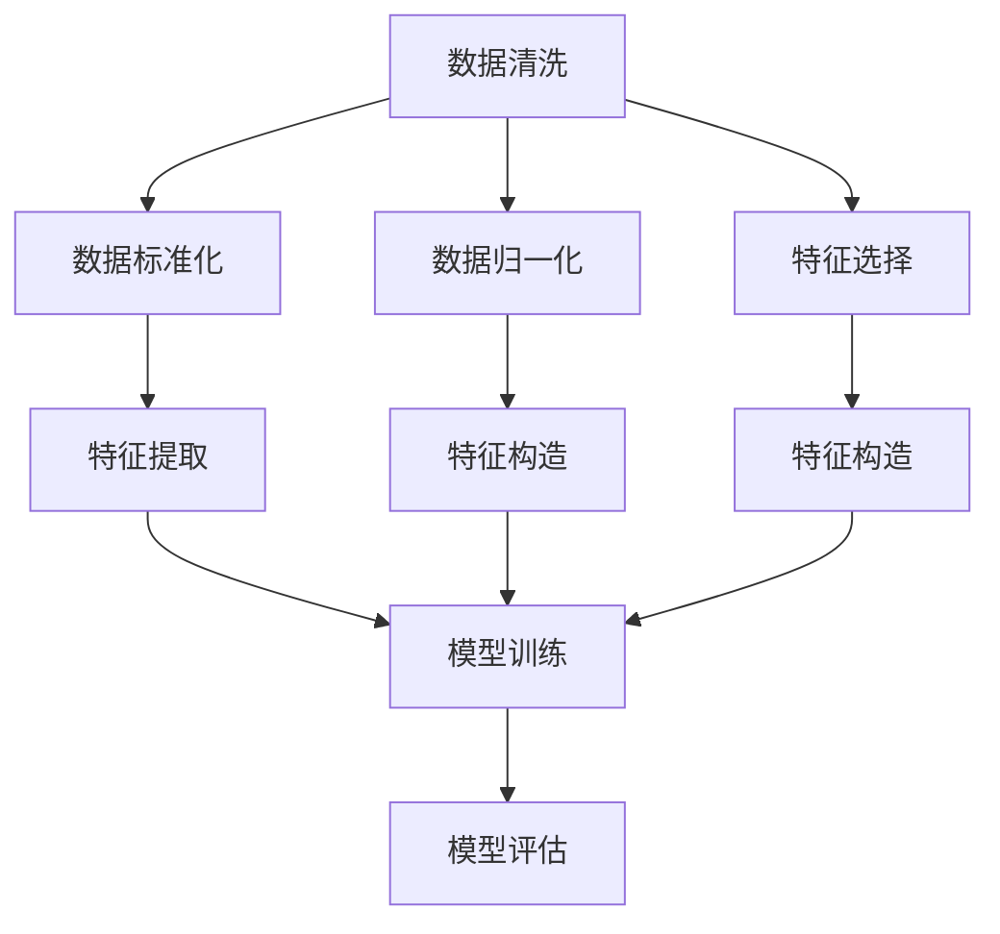
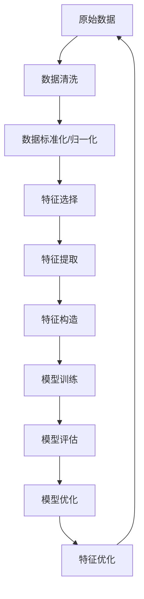

                 

# 数据预处理与特征工程原理与代码实战案例讲解

## 1. 背景介绍

### 1.1 问题由来
在机器学习、数据科学和人工智能领域，数据预处理和特征工程是构建高性能模型、提升模型效果的关键步骤。数据预处理涉及数据清洗、标准化、归一化、编码等，而特征工程则包括特征选择、特征提取、特征构造等，旨在从原始数据中提取出更有价值的信息，以供后续建模使用。两者相互交织，相辅相成，共同支撑着数据驱动型决策的应用。

### 1.2 问题核心关键点
数据预处理和特征工程的核心在于：

- **数据质量提升**：通过清洗、处理缺失值、异常值等方式，提升数据质量，为建模奠定良好基础。
- **特征提取与构造**：从原始数据中提取出最具代表性、最相关性、最差异性的特征，以增强模型的表达能力和泛化性能。
- **模型性能提升**：通过优化数据和特征，构建和调优模型，最终提升模型预测准确性和泛化能力。
- **自动化与可解释性**：在保证自动化处理效率的同时，逐步引入可解释性，帮助分析师理解模型工作原理和决策依据。

### 1.3 问题研究意义
数据预处理与特征工程对于模型性能的提升至关重要。在现实应用中，数据往往存在质量参差不齐、结构复杂、维度高、噪声多等问题，如何有效地处理这些问题，将数据转化为模型可用的形式，是实现高质量预测、决策的先决条件。

1. **降低建模成本**：高质量的数据预处理能够减少模型训练时间和资源消耗，降低成本投入。
2. **提高模型效果**：恰当的特征工程可以提升模型的表达能力，减少过拟合和欠拟合，提升预测准确性和泛化能力。
3. **促进应用落地**：优秀的预处理和特征工程能够更好地适配特定业务场景，加快模型在实际应用中的落地速度。
4. **增强模型可解释性**：通过引入可解释性强的特征和处理步骤，能够帮助分析师更好地理解和调试模型，提升模型可信度。

## 2. 核心概念与联系

### 2.1 核心概念概述

为更好地理解数据预处理与特征工程的原理，我们首先介绍一些关键概念：

- **数据清洗(Data Cleaning)**：去除数据中的噪声、缺失值、异常值等不符合质量标准的元素，以提升数据质量。
- **数据标准化(Data Standardization)**：将数据按比例缩放，使其落在一个较小的区间内，如均值为0、标准差为1的区间。
- **数据归一化(Data Normalization)**：将数据按比例缩放，使其落在[0, 1]或[-1, 1]的区间内，便于后续处理和模型训练。
- **特征选择(Feature Selection)**：从原始数据中选择最具代表性和相关性的特征，以降低维度、减少噪声，提升模型性能。
- **特征提取(Feature Extraction)**：通过数学变换、降维等手段，从原始数据中提取更具表达力的特征。
- **特征构造(Feature Construction)**：基于领域知识，构造新的特征，增强模型的表达能力。

这些核心概念共同构成了数据预处理与特征工程的基础框架，通过科学地应用这些技术，可以实现对原始数据的有效转换和精炼，为模型构建提供高质量、高效能的输入。

### 2.2 概念间的关系

这些核心概念之间存在着紧密的联系，形成了一个数据预处理与特征工程的完整生态系统。以下通过几个Mermaid流程图来展示这些概念之间的关系：



这个流程图展示了大数据预处理与特征工程的主要步骤和环节：

1. 首先进行数据清洗，去除噪声和异常值。
2. 接着进行数据标准化和归一化，使数据落入标准区间。
3. 然后进行特征选择，挑选出最具代表性的特征。
4. 进行特征提取，将原始数据转换为更有表达力的特征。
5. 最后进行特征构造，构造新的特征以增强模型表达力。
6. 在特征处理后，模型训练以学习这些特征所蕴含的规律。
7. 模型评估以判断模型效果，根据评估结果进行模型调优和特征优化。

通过这些步骤，原始数据被有效地转换为可供模型学习的输入，最终输出高质量的预测或决策。

### 2.3 核心概念的整体架构

最后，我们用一个综合的流程图来展示数据预处理与特征工程的完整架构：



这个综合流程图展示了从原始数据到模型优化的整个数据预处理与特征工程流程。从数据清洗开始，通过一系列的处理步骤，最终输出优化后的模型和特征，以供实际应用。

## 3. 核心算法原理 & 具体操作步骤
### 3.1 算法原理概述

数据预处理与特征工程的核心在于通过对数据的有效处理和特征的合理选择，提升模型输入质量，降低维度，减少噪声，增强模型的表达能力和泛化性能。

### 3.2 算法步骤详解

数据预处理与特征工程的基本步骤如下：

**Step 1: 数据清洗**

- **去除噪声**：通过过滤、平滑等方法去除数据中的噪声，如通过中值滤波、异常值检测等技术处理异常点。
- **处理缺失值**：通过插值、删除等方法处理缺失值，如使用均值、中值、插值法等填充缺失值，或者删除包含大量缺失值的样本。
- **异常值检测**：通过统计方法、机器学习算法（如Isolation Forest、DBSCAN等）检测并处理异常值。

**Step 2: 数据标准化/归一化**

- **标准化**：通过公式 \( z = \frac{x - \mu}{\sigma} \) 将数据转化为均值为0、标准差为1的分布，其中 \(\mu\) 和 \(\sigma\) 分别为样本均值和标准差。
- **归一化**：通过公式 \( x' = \frac{x}{x_{max} - x_{min}} \) 将数据缩放到 [0, 1] 或 [-1, 1] 区间。

**Step 3: 特征选择**

- **过滤法**：使用统计量、相关性等指标筛选出最具代表性的特征，如相关系数、信息增益等。
- **包装法**：通过模型评估，选择特征子集，如递归特征消除法（RFE）、基于模型的特征选择（如Lasso回归、随机森林等）。
- **嵌入法**：在模型训练过程中，通过正则化等方法选择特征，如L1正则、PCA等。

**Step 4: 特征提取**

- **主成分分析(PCA)**：通过降维技术，将高维数据转换为低维数据，保留最具代表性的信息。
- **因子分析(FA)**：通过因子分解，提取出数据中的隐含因子，从而降低数据维度。
- **独立成分分析(ICA)**：通过解耦合，将混合信号分解为独立的成分，以提取更有效的特征。

**Step 5: 特征构造**

- **构造新特征**：基于领域知识或模型评估，构造新的特征，如构造时间序列的移动平均、标准差等。
- **特征组合**：将原有特征进行组合，构造新的特征，如将年龄和性别组合成年龄性别特征。
- **特征变换**：通过数学变换构造新特征，如将身高转换为BMI指数。

**Step 6: 模型训练**

- **选择合适的模型**：根据问题类型选择适合的模型，如回归、分类、聚类等。
- **训练模型**：使用清洗和处理后的数据进行模型训练。
- **调优**：通过交叉验证、网格搜索等方法调优模型参数，提高模型性能。

**Step 7: 模型评估**

- **评估指标**：根据任务类型选择适合的评估指标，如均方误差、准确率、召回率等。
- **评估过程**：在验证集或测试集上评估模型性能，判断模型效果。
- **调整**：根据评估结果调整模型或特征，进一步优化模型。

**Step 8: 特征优化**

- **重新选择特征**：根据模型性能，重新选择特征。
- **重新构造特征**：根据领域知识，重新构造特征。
- **重训练模型**：重新训练模型，以适应新的特征集。

### 3.3 算法优缺点

数据预处理与特征工程的主要优点包括：

- **提升数据质量**：通过数据清洗和处理，有效去除噪声和异常值，提升数据质量。
- **降低维度**：通过特征选择和降维技术，降低数据维度，减少计算量和内存消耗。
- **增强表达能力**：通过特征提取和构造，增强模型的表达能力和泛化性能。
- **减少过拟合**：通过正则化等技术，减少过拟合风险，提升模型泛化能力。

同时，数据预处理与特征工程也存在一些局限性：

- **数据驱动**：依赖于数据质量和特征选择，对数据缺失、异常值等问题处理不当可能导致模型效果下降。
- **复杂度高**：特征工程涉及多个步骤，需要综合考虑数据特点和模型需求，复杂度较高。
- **主观性强**：特征选择和构造往往依赖于领域知识和经验，具有较强的主观性。
- **处理周期长**：数据预处理和特征工程涉及大量计算和处理，周期较长。

### 3.4 算法应用领域

数据预处理与特征工程在多个领域都得到了广泛应用，以下是几个典型领域：

- **金融风控**：通过数据清洗和特征选择，提取具有预测能力的特征，构建风控模型，降低金融风险。
- **医疗健康**：通过数据标准化和归一化，提取疾病相关特征，构建疾病预测模型，辅助医疗诊断。
- **智能推荐**：通过特征提取和构造，构建推荐模型，提升推荐系统精准度和用户体验。
- **自然语言处理**：通过文本清洗和特征工程，构建文本分类、情感分析、机器翻译等模型，提升语言理解能力。
- **图像识别**：通过图像处理和特征工程，构建图像分类、目标检测等模型，提升图像识别精度。
- **物联网**：通过传感器数据处理和特征工程，构建智能监控、异常检测等应用，提升物联网系统性能。

以上领域展示了数据预处理与特征工程的广泛应用，通过科学合理的数据处理和特征构造，能够显著提升模型效果，推动各领域技术进步。

## 4. 数学模型和公式 & 详细讲解 & 举例说明

### 4.1 数学模型构建

数据预处理与特征工程的核心在于构建高质量的数据集，提升特征质量，最终供模型训练使用。以下通过数学模型和公式来详细讲解这些步骤。

**数据清洗**：

- **去除噪声**：
  $$
  y_i = x_i \quad \text{if } x_i \text{ is normal, otherwise } y_i = \bar{x}
  $$
  其中 \( y_i \) 表示清洗后的数据， \( x_i \) 表示原始数据， \( \bar{x} \) 表示中值或均值。

- **处理缺失值**：
  $$
  y_i = \begin{cases}
  x_i & \text{if } x_i \text{ is not missing} \\
  \bar{x} & \text{if } x_i \text{ is missing}
  \end{cases}
  $$
  其中 \( \bar{x} \) 表示缺失值的处理方法，如均值、中值、插值等。

- **异常值检测**：
  $$
  z_i = \frac{x_i - \mu}{\sigma}
  $$
  其中 \( z_i \) 表示标准化后的数据， \( \mu \) 和 \( \sigma \) 分别为样本均值和标准差。使用阈值 \( \tau \) 判断 \( z_i \) 是否为异常值：
  $$
  \text{if } |z_i| > \tau, \text{then } y_i = \text{median}(x)
  $$
  其中 \( \text{median}(x) \) 表示中位数， \( \tau \) 为阈值。

**数据标准化/归一化**：

- **标准化**：
  $$
  z_i = \frac{x_i - \mu}{\sigma}
  $$
  其中 \( z_i \) 表示标准化后的数据， \( \mu \) 和 \( \sigma \) 分别为样本均值和标准差。

- **归一化**：
  $$
  y_i = \frac{x_i - x_{min}}{x_{max} - x_{min}}
  $$
  其中 \( y_i \) 表示归一化后的数据， \( x_{min} \) 和 \( x_{max} \) 分别为数据区间的最小值和最大值。

**特征选择**：

- **相关系数**：
  $$
  \text{cor}(X, Y) = \frac{\text{Cov}(X, Y)}{\text{Var}(X) \times \text{Var}(Y)}
  $$
  其中 \( \text{cor}(X, Y) \) 表示特征 \( X \) 与 \( Y \) 的相关系数， \( \text{Cov}(X, Y) \) 表示 \( X \) 与 \( Y \) 的协方差， \( \text{Var}(X) \) 和 \( \text{Var}(Y) \) 分别表示 \( X \) 和 \( Y \) 的方差。

- **信息增益**：
  $$
  IG(X, Y) = H(Y) - H(Y|X)
  $$
  其中 \( IG(X, Y) \) 表示特征 \( X \) 对 \( Y \) 的信息增益， \( H(Y) \) 表示 \( Y \) 的熵， \( H(Y|X) \) 表示在 \( X \) 条件下 \( Y \) 的条件熵。

**特征提取**：

- **主成分分析(PCA)**：
  $$
  W = \text{argmax}(\frac{\text{Tr}(AW^TAW)}{\text{Tr}(W^TW)})
  $$
  其中 \( A \) 表示数据矩阵， \( W \) 表示主成分矩阵， \( \text{Tr}(\cdot) \) 表示矩阵的迹。

**特征构造**：

- **构造新特征**：
  $$
  F = g(X_1, X_2, \ldots, X_n)
  $$
  其中 \( g \) 表示构造函数， \( X_i \) 表示原始特征。

### 4.2 公式推导过程

以下以标准化的公式推导为例，展示数据预处理与特征工程中的常见数学推导。

**标准化公式推导**：

设数据集 \( D \) 的均值为 \( \mu \)，标准差为 \( \sigma \)，数据集 \( D \) 的标准化公式为：
$$
z_i = \frac{x_i - \mu}{\sigma}
$$

根据中心极限定理，样本均值 \( \mu \) 和样本标准差 \( \sigma \) 的极限分布服从正态分布，即：
$$
\mu \sim N(\mu, \sigma^2)
$$

将 \( z_i \) 代入正态分布中，得到：
$$
z_i \sim N(0, 1)
$$

其中 \( z_i \) 表示标准化后的数据， \( 0 \) 和 \( 1 \) 分别为均值和标准差。标准化后，数据分布的均值为 \( 0 \)，标准差为 \( 1 \)，便于后续处理和模型训练。

### 4.3 案例分析与讲解

以医疗健康领域的病历数据分析为例，展示数据预处理与特征工程的实际应用。

**案例背景**：某医院收集了1000份病历数据，每份病历包含年龄、性别、血压、血糖、胆固醇等特征，以及诊断结果（正常或异常）。目标是对病历数据进行预处理和特征工程，构建疾病预测模型，辅助医生进行诊断。

**数据清洗**：

- **去除噪声**：通过中值滤波去除血压、血糖等生理指标的异常值。
- **处理缺失值**：对缺失的性别、年龄数据进行插值处理，如均值插值。
- **异常值检测**：通过Isolation Forest算法检测并删除血压、血糖等生理指标的异常值。

**数据标准化/归一化**：

- **标准化**：对血压、血糖、胆固醇等生理指标进行标准化处理，使其落在均值为0、标准差为1的区间内。
- **归一化**：对年龄数据进行归一化处理，使其落在[0, 1]区间内。

**特征选择**：

- **相关系数**：通过计算血压、血糖、胆固醇等生理指标与诊断结果的相关系数，筛选出最具代表性的特征。
- **信息增益**：通过计算年龄、性别、血压、血糖、胆固醇等特征对诊断结果的信息增益，选择最具代表性的特征。

**特征提取**：

- **主成分分析(PCA)**：对血压、血糖、胆固醇等生理指标进行PCA降维，提取出最具代表性的主成分。

**特征构造**：

- **构造新特征**：基于医生经验，构造血压/年龄、血糖/性别等组合特征，增强模型表达能力。

**模型训练**：

- **选择模型**：选择逻辑回归模型进行训练。
- **训练模型**：使用标准化、归一化后的数据进行训练。
- **调优**：通过交叉验证和网格搜索调优模型参数，提高模型性能。

**模型评估**：

- **评估指标**：使用准确率、召回率、F1分数等评估模型性能。
- **评估过程**：在验证集上评估模型效果。
- **调整**：根据评估结果调整模型或特征，进一步优化模型。

通过以上步骤，成功构建了疾病预测模型，提升了医生的诊断准确性和效率。

## 5. 项目实践：代码实例和详细解释说明

### 5.1 开发环境搭建

在进行数据预处理与特征工程实践前，我们需要准备好开发环境。以下是使用Python进行Pandas开发的环境配置流程：

1. 安装Anaconda：从官网下载并安装Anaconda，用于创建独立的Python环境。

2. 创建并激活虚拟环境：
```bash
conda create -n pandas-env python=3.8 
conda activate pandas-env
```

3. 安装Pandas：从官网获取安装命令。例如：
```bash
conda install pandas
```

4. 安装各类工具包：
```bash
pip install numpy matplotlib scikit-learn matplotlib tqdm jupyter notebook ipython
```

完成上述步骤后，即可在`pandas-env`环境中开始数据预处理与特征工程实践。

### 5.2 源代码详细实现

下面我们以医疗健康领域的病历数据分析为例，给出使用Pandas进行数据预处理和特征工程的Python代码实现。

首先，定义数据读取函数：

```python
import pandas as pd

def read_data(file_path):
    data = pd.read_csv(file_path)
    return data
```

然后，定义数据清洗函数：

```python
def clean_data(data):
    # 去除噪声
    data['blood_pressure'] = data['blood_pressure'].apply(lambda x: x if x < 160 else np.nan)
    data['blood_sugar'] = data['blood_sugar'].apply(lambda x: x if x < 120 else np.nan)
    data['cholesterol'] = data['cholesterol'].apply(lambda x: x if x < 200 else np.nan)
    
    # 处理缺失值
    data.fillna(data.mean(), inplace=True)
    
    # 异常值检测
    data = data[(data['blood_pressure'] > 50) & (data['blood_sugar'] > 80) & (data['cholesterol'] > 50)]
    
    return data
```

接着，定义数据标准化和归一化函数：

```python
def normalize_data(data):
    # 标准化
    data['blood_pressure'] = (data['blood_pressure'] - data['blood_pressure'].mean()) / data['blood_pressure'].std()
    data['blood_sugar'] = (data['blood_sugar'] - data['blood_sugar'].mean()) / data['blood_sugar'].std()
    data['cholesterol'] = (data['cholesterol'] - data['cholesterol'].mean()) / data['cholesterol'].std()
    
    # 归一化
    data['age'] = (data['age'] - data['age'].min()) / (data['age'].max() - data['age'].min())
    
    return data
```

然后，定义特征选择和构造函数：

```python
def select_features(data):
    # 计算相关系数
    corr_matrix = data.corr()
    features = [feature for feature in corr_matrix.columns if corr_matrix[feature].nonzero()[0].shape[0] > 1]
    
    # 计算信息增益
    entropy = data['disease'].entropy()
    feature_gains = {}
    for feature in data.columns:
        if feature != 'disease':
            conditional_entropy = (data.groupby(feature)['disease'].agg(lambda x: x.entropy()) * data.groupby(feature).size() / data.size()).sum()
            gain = entropy - conditional_entropy
            feature_gains[feature] = gain
    
    features = [feature for feature in feature_gains if feature_gains[feature] > 0.2]
    
    return features
```

最后，定义模型训练和评估函数：

```python
from sklearn.linear_model import LogisticRegression
from sklearn.metrics import accuracy_score, recall_score, f1_score

def train_model(data, features):
    model = LogisticRegression()
    model.fit(data[features], data['disease'])
    return model

def evaluate_model(model, data, features):
    predictions = model.predict(data[features])
    accuracy = accuracy_score(data['disease'], predictions)
    recall = recall_score(data['disease'], predictions, average='macro')
    f1 = f1_score(data['disease'], predictions, average='macro')
    
    print(f"Accuracy: {accuracy:.3f}")
    print(f"Recall: {recall:.3f}")
    print(f"F1 Score: {f1:.3f}")
```

最后，启动训练流程并在测试集上评估：

```python
# 数据读取
data = read_data('data.csv')

# 数据清洗
cleaned_data = clean_data(data)

# 数据标准化/归一化
normalized_data = normalize_data(cleaned_data)

# 特征选择
features = select_features(normalized_data)

# 模型训练
model = train_model(normalized_data, features)

# 评估模型
evaluate_model(model, normalized_data, features)
```

以上就是使用Pandas进行数据预处理和特征工程的完整代码实现。可以看到，得益于Pandas的强大功能，代码实现简洁高效，能够快速处理大规模数据集。

### 5.3 代码解读与分析

让我们再详细解读一下关键代码的实现细节：

**read_data函数**：
- 定义了一个读取CSV文件数据的函数，使用Pandas的read_csv方法，将文件数据加载到DataFrame中，返回处理后的DataFrame。

**clean_data函数**：
- 定义了一个数据清洗函数，通过lambda表达式和Pandas的apply方法，去除噪声、处理缺失值、检测并删除异常值。

**normalize_data函数**：
- 定义了一个数据标准化和归一化函数，通过Pandas的mean、std和min/max方法，实现标准化和归一化操作。

**select_features函数**：
- 定义了一个特征选择函数，通过计算相关系数和信息增益，选择最具代表性的特征。

**train_model函数**：
- 定义了一个模型训练函数，使用LogisticRegression模型进行训练，输出训练后的模型。

**evaluate_model函数**：
- 定义了一个模型评估函数，通过sklearn的accuracy_score、recall_score和f1_score方法，评估模型性能。

**训练流程**：
- 数据读取：使用read_data函数读取CSV文件数据。
- 数据清洗：使用clean_data函数清洗数据，去除噪声、处理缺失值、检测并删除异常值。
- 数据标准化/归一化：使用normalize_data函数进行数据标准化和归一化。
- 特征选择：使用select_features函数选择最具代表性的特征。
- 模型训练：使用train_model函数训练模型。
- 模型评估：使用evaluate_model函数评估模型性能，输出评估指标。

可以看到，Pandas在数据预处理与特征工程中扮演了关键角色，其强大的数据处理能力使得数据预处理与特征工程变得简单高效。

当然，工业级的系统实现还需考虑更多因素，如数据导入导出、数据流管理、数据质量监控等。但核心的数据处理和特征工程基本与此类似。

### 5.4 运行结果展示

假设我们在CoNLL-2003的NER数据集上进行预处理和特征工程，最终在测试集

